covid\_conspiracies\_markdown
================
Michael Marshall
20/10/2020

## Loading Packages and Data

``` r
pacman::p_load(tidyverse, stringr, ggridges, forcats, labelled, leaps)

load("COVID W1_W2_W3 Cleaned 2878.RData") # needs to be in your wd
```

## Summary and distribution of different COVID specific conspiracies

``` r
df %>% 
  select(W2_Conspiracy_Theory1:W2_Conspiracy_Theory5) %>% 
  map(summary)
```

    ## $W2_Conspiracy_Theory1
    ##    Min. 1st Qu.  Median    Mean 3rd Qu.    Max.    NA's 
    ##    0.00    3.00   45.50   38.26   62.00  100.00    1472 
    ## 
    ## $W2_Conspiracy_Theory2
    ##    Min. 1st Qu.  Median    Mean 3rd Qu.    Max.    NA's 
    ##    0.00   50.00   70.00   63.96   88.00  100.00    1472 
    ## 
    ## $W2_Conspiracy_Theory3
    ##    Min. 1st Qu.  Median    Mean 3rd Qu.    Max.    NA's 
    ##    0.00    0.00    1.00   11.15    7.00  100.00    1472 
    ## 
    ## $W2_Conspiracy_Theory4
    ##    Min. 1st Qu.  Median    Mean 3rd Qu.    Max.    NA's 
    ##    0.00    0.00    8.00   24.88   49.00  100.00    1472 
    ## 
    ## $W2_Conspiracy_Theory5
    ##    Min. 1st Qu.  Median    Mean 3rd Qu.    Max.    NA's 
    ##    0.00    0.00    2.00   14.73   18.00  100.00    1472

``` r
# plotting density of different covid conspiracies
df %>% 
  select(W2_Conspiracy_Theory1:W2_Conspiracy_Theory5) %>% 
  gather(conspiracy_code, belief, W2_Conspiracy_Theory1:W2_Conspiracy_Theory5) %>%
  mutate(
    conspiracy_code = as.factor(conspiracy_code),
    conspiracy = ifelse(
      conspiracy_code == "W2_Conspiracy_Theory1",
      "Chinese lab",
      ifelse(conspiracy_code == "W2_Conspiracy_Theory2",
             "Chinese meat market",
             ifelse(conspiracy_code == "W2_Conspiracy_Theory3",
                    "5G",
                    ifelse(conspiracy_code == "W2_Conspiracy_Theory4",
                           "No worse than flu",
                           "Vitamin C treatment"))))
  ) %>% 
  ggplot(aes(x = belief, y = conspiracy, height = ..density..)) +
  geom_density_ridges(aes(fill = conspiracy,
                          rel_min_height = 0.005),
                      stat = "density",
                      #bins = 20,
                      show.legend = FALSE) +
  scale_fill_brewer(palette = "Dark2") +
  theme_ridges()
```

    ## Warning: attributes are not identical across measure variables;
    ## they will be dropped

    ## Warning: Removed 7360 rows containing non-finite values (stat_density).

<!-- -->

## Selecting variables for dataset

Sorry, this is a lot of manual code, and if you can think of a quicker
way I’d be happy to use it. I tend to prefer reducing the number of
variables to just those I expect to reasonably use, which the code below
aims to achieve.

``` r
df_names <- names(df)

w2_vars <- df %>% 
  select(
    W2_Age_year:W2_Gender_binary,
    W2_Living_alone,W2_Employment,
    W2_Nationalism1,W2_Nationalism2,
    W2_Trust_Body1:W2_Newspaper_prefer11,
    W2_COVID19_anxiety:W2_TRUST_9,
    W2_Conspiracy_Theory1:W2_Conspiracy_Theory5,
    W2_LOC1:W2_DAI17,W2_IOU1:W2_IOU12,W2_Nationalism_Total,
    W2_Paranoia_Total,W2_Dep_Total,
    W2_GAD_Total,W2_Internal_Total,
    W2_Chance_Total,W2_PO_Total,
    W2_DAI_Total,W2_ProspectiveAnx_Total,
    W2_InhibitoryAnx_Total,W2_IOU_Total
    ) %>% 
  names()

w1_vars <- df %>% 
  select(
    W1_Area_residence,W1_Ethnicity,
    W1_Education:W1_Religion_binary,
    W1_Hosuing_tenure,W1_Income_2019,
    W1_C19_Infected:W1_C19_SomeoneClose_Infected_Binary,
    W1_ReligiousBelief1:W1_ReligiousBelief8_R,
    W1_CRT1:W1_CRT_test,
    W1_Voted_GenElection:W1_Political_Fiscal,
    W1_Authoritarianism1:W1_Authoritarianism5_R,
    W1_MigrantAttitudes1:W1_Conspiracy_5,
    W1_ReligiousBelief_Total,W1_Authoritarianism_Total,
    W1_Social_Dominance_Mean,W1_Social_Dominance_Total,
    W1_Conspiracy_Total
  ) %>% 
  names()
         
w3_vars <- c(
  "W3_ContactTracing",
  "W3_Smartphone",
  "W3_C19App1",
  "W3_C19App2",
  "W3_C19App3",
  "W3_C19App4"
)

vars <- c("pid",w1_vars,w2_vars,w3_vars)

mean(vars %in% df_names) # checking all variable names spelled correctly
```

    ## [1] 1

``` r
# selecting variables
df_thin <- df %>% 
  select(one_of(vars))
```

## Cleaning dataset

The following code filters down to just those observations that have
completed the battery of questions relating to COVID specific
conspiracies. It also creates a tibble counting the missing
observations, which can be useful to have as an object.

``` r
# filtering for completed dependent variable
conspiracies <- df_thin %>% 
  filter(!is.na(W2_Conspiracy_Theory1) |
           !is.na(W2_Conspiracy_Theory2) |
           !is.na(W2_Conspiracy_Theory3) |
           !is.na(W2_Conspiracy_Theory3) |
           !is.na(W2_Conspiracy_Theory4) |
           !is.na(W2_Conspiracy_Theory5)) %>% 
  rename(W1_Housing_tenure = W1_Hosuing_tenure)

# function to count NAs
count_na <- function(x){
  sum(is.na(x))
}

conspiracies %>% 
  select(W2_Conspiracy_Theory1:W2_Conspiracy_Theory5) %>% 
  map_int(count_na)
```

    ## W2_Conspiracy_Theory1 W2_Conspiracy_Theory2 W2_Conspiracy_Theory3 
    ##                     0                     0                     0 
    ## W2_Conspiracy_Theory4 W2_Conspiracy_Theory5 
    ##                     0                     0

``` r
missing <- tibble(
  variable = names(conspiracies),
  NAs = conspiracies %>% map_int(count_na)
)

#View(missing)
```

The code below combines the two variables on the 2019 general election
into a single variable that combines whether a respondent voted, and who
they voted for. It also turns the *preferred newspaper* variables into
dummy variables, as they were previously coded as *1=Yes* and everything
else as *NA*.

``` r
# combining 2019 election variables into one, for parties and didn't votes

conspiracies <- conspiracies %>% 
  mutate(
    W1_Voted_Party_Name = to_factor(conspiracies$W1_Voted_Party,
                                    nolabel_to_na = TRUE),
    W1_Voted_GenElection_Name = to_factor(conspiracies$W1_Voted_GenElection,
                                          nolabel_to_na = TRUE),
    W1_2019_GE_Full = factor(ifelse(
      W1_Voted_GenElection_Name == "Voted.",
      as.character(W1_Voted_Party_Name),
      as.character(W1_Voted_GenElection_Name)
      )
      )
    )

# making preferred newspaper a dummy variable (i.e. replacing NA with 0)
na_to_zero <- function(x){
  x[is.na(x)] <- 0
  x <- as.numeric(x)
  return(x)
} 

paper_vars <- conspiracies %>%
  select(W2_Newspaper_prefer1:W2_Newspaper_prefer11) %>% 
  names()

conspiracies[paper_vars] <- conspiracies[paper_vars] %>% 
  map_df(na_to_zero)
```

## Distribution of variables

A for loop to look at distribution of potential independent variables
(numeric only).

``` r
plot_vars <- conspiracies %>% 
  select(
    W1_Political_Scale:W1_Political_Fiscal,
    W1_ReligiousBelief_Total:W1_Conspiracy_Total,
    W2_Nationalism_Total:W2_IOU_Total
    ) %>%
  names()

for(i in seq_along(plot_vars)){
  
  x1 <- conspiracies[plot_vars][i] %>% as_vector()
  
  print(
    ggplot(data = NULL, aes(x = x1)) +
      geom_vline(aes(xintercept = mean(x1, na.rm =TRUE)), 
                 colour = "black",
                 #alpha = 0.7,
                 linetype = "dashed") +
      geom_vline(aes(xintercept = median(x1, na.rm =TRUE)), 
                 colour = "red",
                 #alpha = 0.7,
                 linetype = "dashed") +
      geom_density(fill = "lightblue", alpha = 0.7) +
      labs(x = plot_vars[i],
           caption = "Black = Mean, Red = Median")  
  )
  
}
```

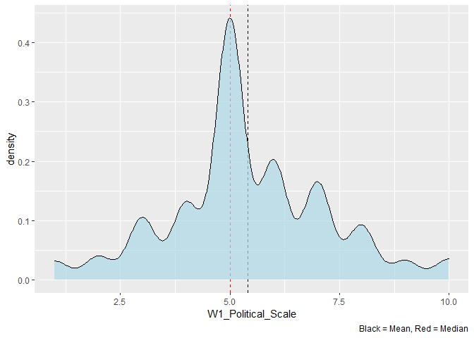<!-- -->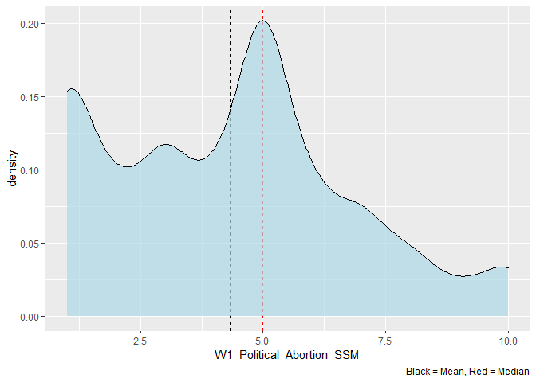<!-- -->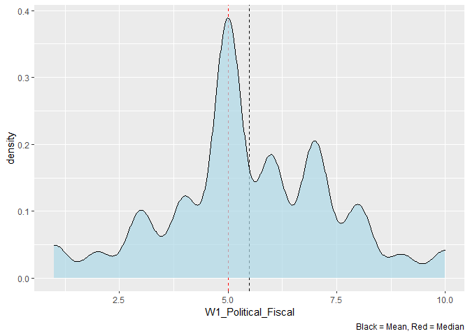<!-- -->

    ## Warning: Removed 30 rows containing non-finite values (stat_density).

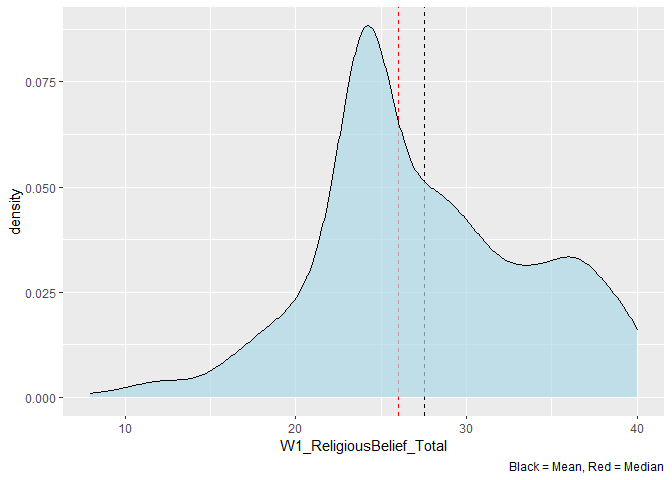<!-- -->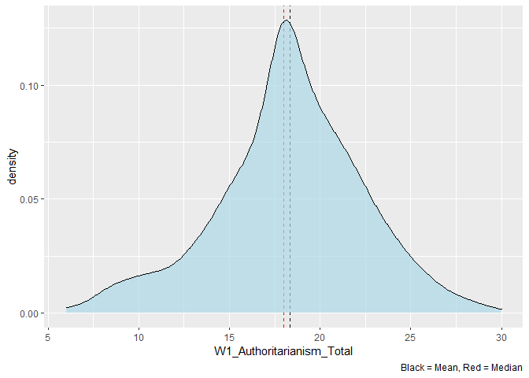<!-- -->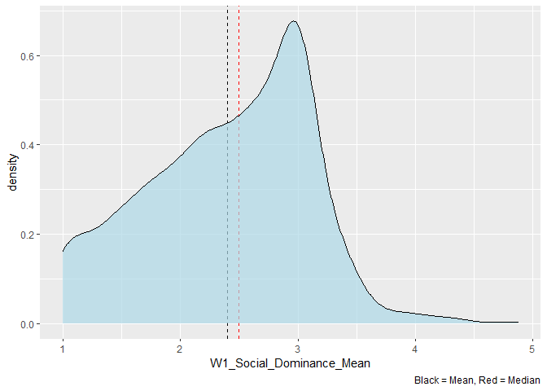<!-- -->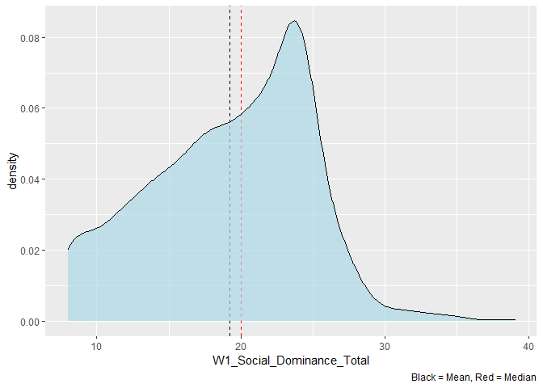<!-- -->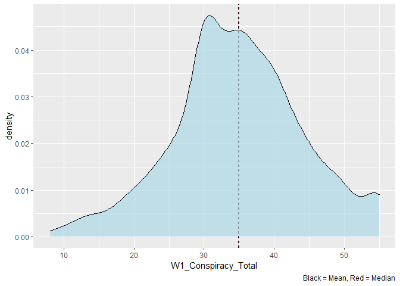<!-- -->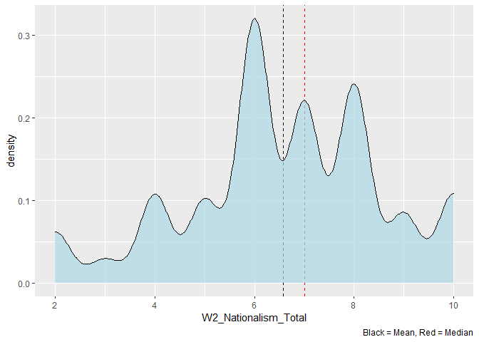<!-- -->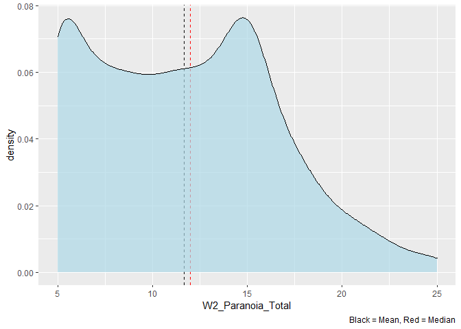<!-- -->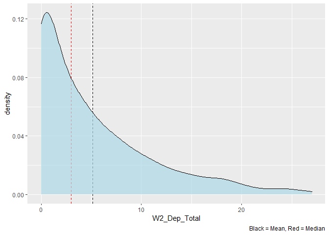<!-- -->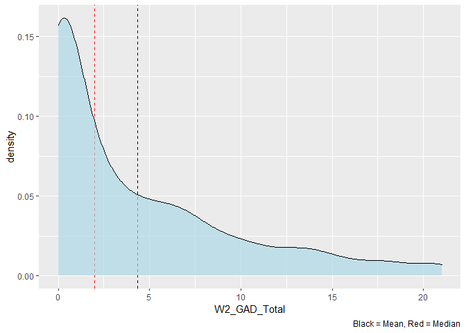<!-- -->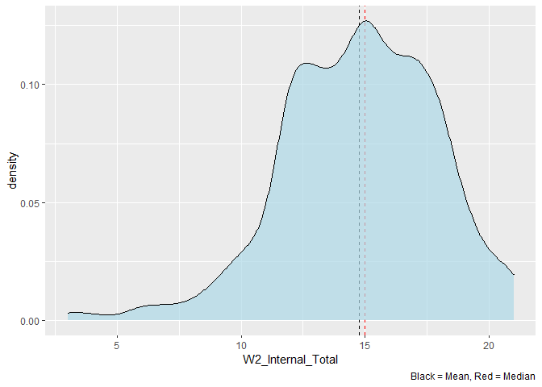<!-- -->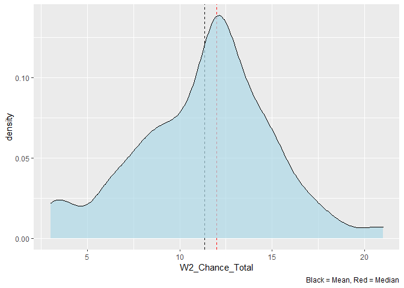<!-- -->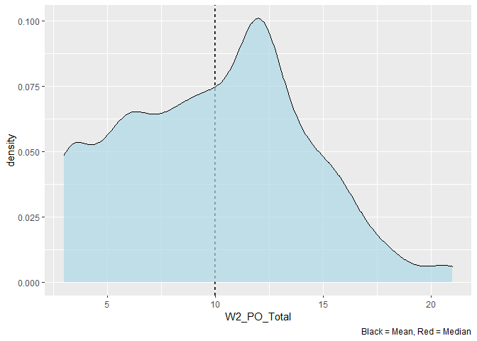<!-- -->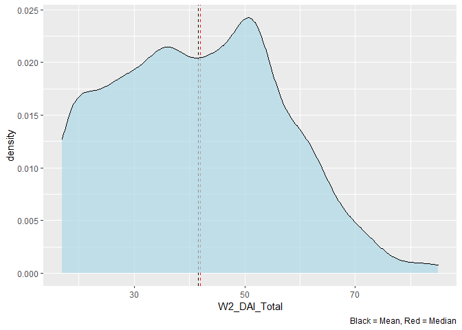<!-- -->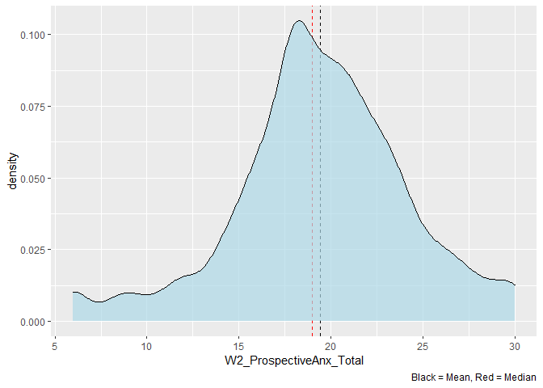<!-- -->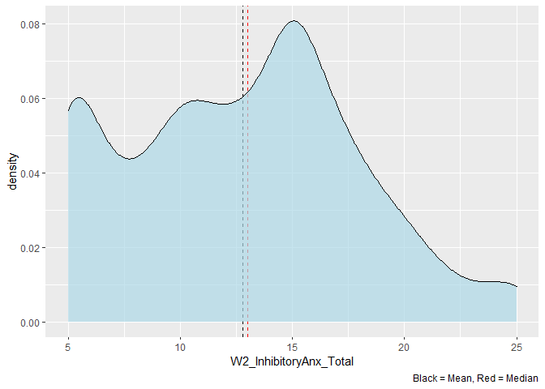<!-- -->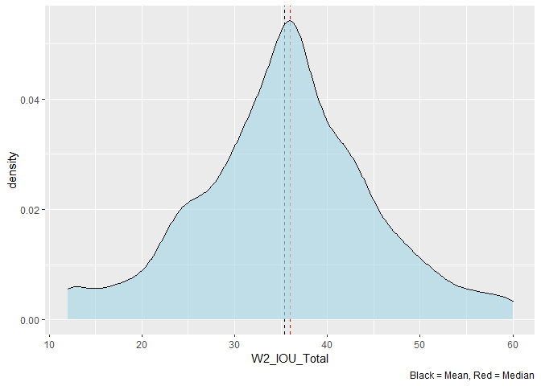<!-- -->

## Vote in 2019 election and conspiracy belief

``` r
conspiracies %>% 
  ggplot(aes(x = fct_reorder(W1_2019_GE_Full, W2_Conspiracy_Theory1),
             y = W2_Conspiracy_Theory1)) +
  geom_boxplot() +
  coord_flip() +
  labs(x = "Vote in 2019 GE",
       y = "Belief in Chinese Lab Origin")
```

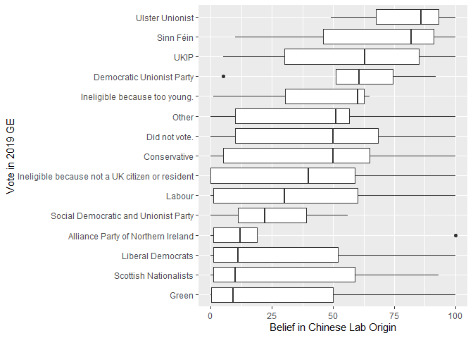<!-- -->

``` r
# filtering down for some of the main parties
parties <- c("UKIP",
             "Did not vote.",
             "Conservative",
             "Labour",
             "Green",
             "Scottish Nationalists",
             "Liberal Democrats")

conspiracies %>% 
  filter(W1_2019_GE_Full %in% parties) %>% 
  ggplot(aes(x = W2_Conspiracy_Theory1,
             y = fct_reorder(W1_2019_GE_Full, W2_Conspiracy_Theory1))) +
  geom_density_ridges(alpha = 0.7,
                      quantile_lines = TRUE,
                      quantiles = 4,
                      scale = 0.9,
                      jittered_points = TRUE,
                      vline_size = 1,
                      point_size = 0.6,
                      point_alpha = 0.6,
                      position = "raincloud") +
  labs(x = "Vote in 2019 GE",
       y = "Belief in Chinese lab origin")
```

    ## Picking joint bandwidth of 12

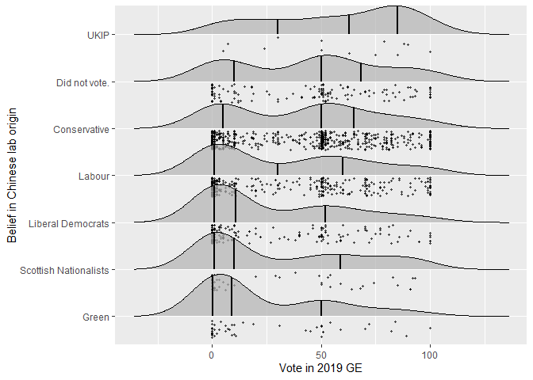<!-- -->

``` r
# interestingly, Conservatives have relatively high belief in Chinese lab conspiracy

conspiracies %>% 
  ggplot(aes(x = fct_reorder(W1_2019_GE_Full, W2_Conspiracy_Theory3),
             y = W2_Conspiracy_Theory3)) +
  geom_boxplot() +
  coord_flip() +
  labs(x = "Vote in 2019 GE",
       y = "Belief in 5G Origin")
```

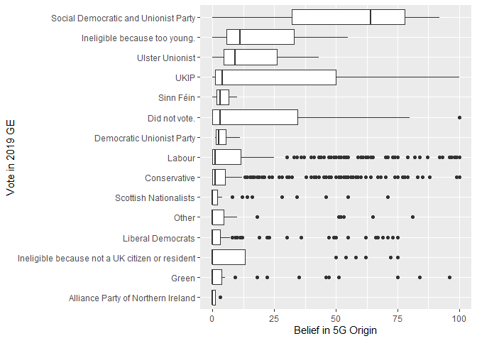<!-- -->

``` r
conspiracies %>% 
  filter(W1_2019_GE_Full %in% parties) %>% 
  ggplot(aes(x = W2_Conspiracy_Theory3,
             y = fct_reorder(W1_2019_GE_Full, W2_Conspiracy_Theory3))) +
  geom_density_ridges(alpha = 0.7,
                      quantile_lines = TRUE,
                      quantiles = 4,
                      scale = 0.9,
                      jittered_points = TRUE,
                      vline_size = 1,
                      point_size = 0.6,
                      point_alpha = 0.6,
                      position = "raincloud") +
  labs(x = "Vote in 2019 GE",
       y = "Belief in 5G origin")
```

    ## Picking joint bandwidth of 4.57

<!-- -->

``` r
conspiracies %>% 
  ggplot(aes(x = fct_reorder(W1_2019_GE_Full, W2_Conspiracy_Theory4),
             y = W2_Conspiracy_Theory4)) +
  geom_boxplot() +
  coord_flip() +
  labs(x = "Vote in 2019 GE",
       y = "Belief it is no worse than flu")
```

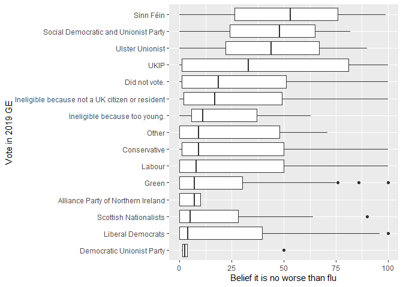<!-- -->

``` r
conspiracies %>% 
  filter(W1_2019_GE_Full %in% parties) %>% 
  ggplot(aes(x = W2_Conspiracy_Theory4,
             y = fct_reorder(W1_2019_GE_Full, W2_Conspiracy_Theory4))) +
  geom_density_ridges(alpha = 0.7,
                      quantile_lines = TRUE,
                      quantiles = 4,
                      scale = 0.9,
                      jittered_points = TRUE,
                      vline_size = 1,
                      point_size = 0.6,
                      point_alpha = 0.6,
                      position = "raincloud") +
  labs(x = "Vote in 2019 GE",
       y = "Belief it is no worse than flu")
```

    ## Picking joint bandwidth of 11

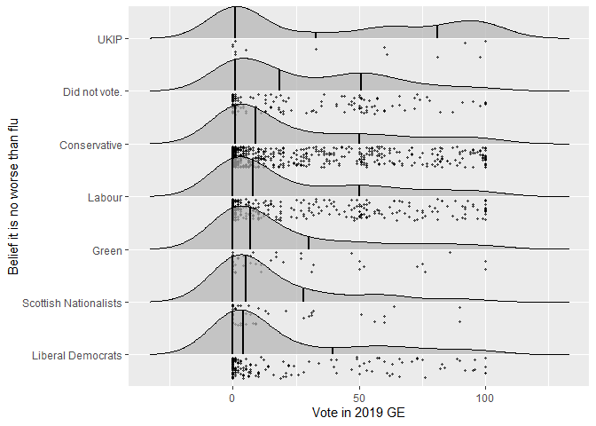<!-- -->

``` r
conspiracies %>% 
  ggplot(aes(x = fct_reorder(W1_2019_GE_Full, W2_Conspiracy_Theory5),
             y = W2_Conspiracy_Theory5)) +
  geom_boxplot() +
  coord_flip() +
  labs(x = "Vote in 2019 GE",
       y = "Belief in Vitamin C treatment")
```

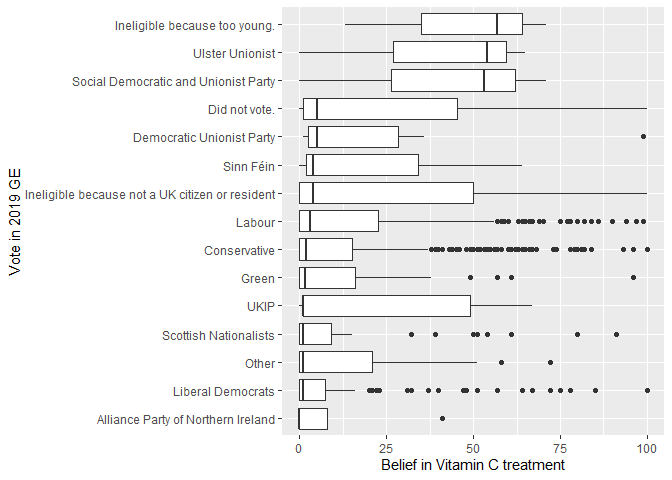<!-- -->

## Forward stepwise model selection

``` r
conspiracies_subset <- conspiracies %>% 
  select(W1_Ethnicity,W1_Education,
         W1_Income_2019,W1_CRT1:W1_CRT_test,
         W1_EURef:W1_Political_Fiscal,
         W1_ReligiousBelief_Total:W1_Authoritarianism_Total,
         W1_Social_Dominance_Total:W2_Age_year,W2_Gender,
         W2_Living_alone,W2_Employment,
         W2_Trust_Body1:W2_Newspaper_prefer11,
         W2_COVID19_anxiety,W2_Conspiracy_Theory1:W2_Conspiracy_Theory5,
         W2_Nationalism_Total:W2_IOU_Total,
         W1_2019_GE_Full)
```

``` r
conspiracies_subset %>% 
  ggplot(aes(x = W2_Conspiracy_Theory1)) +
  geom_histogram(colour = "black", fill = "grey")
```

    ## `stat_bin()` using `bins = 30`. Pick better value with `binwidth`.

<!-- -->

``` r
reg_fit <- regsubsets(W2_Conspiracy_Theory1 ~ ., data = conspiracies_subset,
                      nvmax = 50, method = "forward")

plot(summary(reg_fit)$adjr2, type = "o")
```

<!-- -->

``` r
coef(reg_fit, 22)
```

    ##                                                    (Intercept) 
    ##                                                   -16.24062086 
    ##                                                   W1_Education 
    ##                                                    -1.36002623 
    ##                                                        W1_CRT2 
    ##                                                     2.19887803 
    ##                                                        W1_CRT3 
    ##                                                     2.37118794 
    ##                                                        W1_CRT5 
    ##                                                     2.75977660 
    ##                                                       W1_EURef 
    ##                                                    -3.15160031 
    ##                                       W1_ReligiousBelief_Total 
    ##                                                    -0.23264802 
    ##                                      W1_Authoritarianism_Total 
    ##                                                     0.59616204 
    ##                                            W1_Conspiracy_Total 
    ##                                                     0.51311429 
    ##                                                 W2_Trust_Body6 
    ##                                                     2.50660129 
    ##                                           W2_Newspaper_prefer1 
    ##                                                     9.20669881 
    ##                                           W2_Newspaper_prefer6 
    ##                                                    -4.90909330 
    ##                                           W2_Newspaper_prefer9 
    ##                                                     7.51638262 
    ##                                             W2_COVID19_anxiety 
    ##                                                     0.11782079 
    ##                                          W2_Conspiracy_Theory2 
    ##                                                    -0.12992731 
    ##                                          W2_Conspiracy_Theory3 
    ##                                                     0.22764430 
    ##                                          W2_Conspiracy_Theory4 
    ##                                                     0.09414414 
    ##                                           W2_Nationalism_Total 
    ##                                                     1.43079795 
    ##                                                   W2_DAI_Total 
    ##                                                     0.14809167 
    ##                                           W1_2019_GE_FullGreen 
    ##                                                    -7.84182486 
    ## W1_2019_GE_FullIneligible because not a UK citizen or resident 
    ##                                                    10.86332546 
    ##                                       W1_2019_GE_FullSinn Féin 
    ##                                                    35.66098295 
    ##                                 W1_2019_GE_FullUlster Unionist 
    ##                                                    29.98674854
