covid\_conspiracies\_markdown2
================
Michael Marshall
21/10/2020

## Loading Packages and Data

``` r
pacman::p_load(tidyverse, stringr, ggridges, forcats, labelled, leaps)

load("COVID W1_W2_W3 Cleaned 2878.RData") # needs to be in your wd
```

## Summary and distribution of different COVID specific conspiracies

``` r
df %>% 
  select(W2_Conspiracy_Theory1:W2_Conspiracy_Theory5) %>% 
  map(summary)
```

    ## $W2_Conspiracy_Theory1
    ##    Min. 1st Qu.  Median    Mean 3rd Qu.    Max.    NA's 
    ##    0.00    3.00   45.50   38.26   62.00  100.00    1472 
    ## 
    ## $W2_Conspiracy_Theory2
    ##    Min. 1st Qu.  Median    Mean 3rd Qu.    Max.    NA's 
    ##    0.00   50.00   70.00   63.96   88.00  100.00    1472 
    ## 
    ## $W2_Conspiracy_Theory3
    ##    Min. 1st Qu.  Median    Mean 3rd Qu.    Max.    NA's 
    ##    0.00    0.00    1.00   11.15    7.00  100.00    1472 
    ## 
    ## $W2_Conspiracy_Theory4
    ##    Min. 1st Qu.  Median    Mean 3rd Qu.    Max.    NA's 
    ##    0.00    0.00    8.00   24.88   49.00  100.00    1472 
    ## 
    ## $W2_Conspiracy_Theory5
    ##    Min. 1st Qu.  Median    Mean 3rd Qu.    Max.    NA's 
    ##    0.00    0.00    2.00   14.73   18.00  100.00    1472

``` r
# plotting density of different covid conspiracies
df %>% 
  select(W2_Conspiracy_Theory1:W2_Conspiracy_Theory5) %>% 
  gather(conspiracy_code, belief, W2_Conspiracy_Theory1:W2_Conspiracy_Theory5) %>%
  mutate(
    conspiracy_code = as.factor(conspiracy_code),
    conspiracy = ifelse(
      conspiracy_code == "W2_Conspiracy_Theory1",
      "Chinese lab",
      ifelse(conspiracy_code == "W2_Conspiracy_Theory2",
             "Chinese meat market",
             ifelse(conspiracy_code == "W2_Conspiracy_Theory3",
                    "5G",
                    ifelse(conspiracy_code == "W2_Conspiracy_Theory4",
                           "No worse than flu",
                           "Vitamin C treatment"))))
  ) %>% 
  ggplot(aes(x = belief, y = conspiracy, height = ..density..)) +
  geom_density_ridges(aes(fill = conspiracy,
                          rel_min_height = 0.005),
                      stat = "density",
                      #bins = 20,
                      show.legend = FALSE) +
  scale_fill_brewer(palette = "Dark2") +
  theme_ridges()
```

    ## Warning: attributes are not identical across measure variables;
    ## they will be dropped

    ## Warning: Removed 7360 rows containing non-finite values (stat_density).

<!-- -->

## Selecting variables for dataset

Sorry, this is a lot of manual code, and if you can think of a quicker
way I’d be happy to use it. I tend to prefer reducing the number of
variables to just those I expect to reasonably use, which the code below
aims to achieve.

``` r
df_names <- names(df)

w2_vars <- df %>% 
  select(
    W2_Age_year:W2_Gender_binary,
    W2_Living_alone,W2_Employment,
    W2_Nationalism1,W2_Nationalism2,
    W2_Trust_Body1:W2_Newspaper_prefer11,
    W2_COVID19_anxiety:W2_TRUST_9,
    W2_Conspiracy_Theory1:W2_Conspiracy_Theory5,
    W2_LOC1:W2_DAI17,W2_IOU1:W2_IOU12,W2_Nationalism_Total,
    W2_Paranoia_Total,W2_Dep_Total,
    W2_GAD_Total,W2_Internal_Total,
    W2_Chance_Total,W2_PO_Total,
    W2_DAI_Total,W2_ProspectiveAnx_Total,
    W2_InhibitoryAnx_Total,W2_IOU_Total
    ) %>% 
  names()

w1_vars <- df %>% 
  select(
    W1_Area_residence,W1_Ethnicity,
    W1_Education:W1_Religion_binary,
    W1_Hosuing_tenure,W1_Income_2019,
    W1_C19_Infected:W1_C19_SomeoneClose_Infected_Binary,
    W1_ReligiousBelief1:W1_ReligiousBelief8_R,
    W1_CRT1:W1_CRT_test,
    W1_Voted_GenElection:W1_Political_Fiscal,
    W1_Authoritarianism1:W1_Authoritarianism5_R,
    W1_MigrantAttitudes1:W1_Conspiracy_5,
    W1_ReligiousBelief_Total,W1_Authoritarianism_Total,
    W1_Social_Dominance_Mean,W1_Social_Dominance_Total,
    W1_Conspiracy_Total
  ) %>% 
  names()
         
w3_vars <- c(
  "W3_ContactTracing",
  "W3_Smartphone",
  "W3_C19App1",
  "W3_C19App2",
  "W3_C19App3",
  "W3_C19App4"
)

vars <- c("pid",w1_vars,w2_vars,w3_vars)

mean(vars %in% df_names) # checking all variable names spelled correctly
```

    ## [1] 1

``` r
# selecting variables
df_thin <- df %>% 
  select(one_of(vars))
```

## Cleaning dataset

The following code filters down to just those observations that have
completed the battery of questions relating to COVID specific
conspiracies. It also creates a tibble counting the missing
observations, which can be useful to have as an object.

``` r
# filtering for completed dependent variable
conspiracies <- df_thin %>% 
  filter(!is.na(W2_Conspiracy_Theory1) |
           !is.na(W2_Conspiracy_Theory2) |
           !is.na(W2_Conspiracy_Theory3) |
           !is.na(W2_Conspiracy_Theory3) |
           !is.na(W2_Conspiracy_Theory4) |
           !is.na(W2_Conspiracy_Theory5)) %>% 
  rename(W1_Housing_tenure = W1_Hosuing_tenure)

# function to count NAs
count_na <- function(x){
  sum(is.na(x))
}

conspiracies %>% 
  select(W2_Conspiracy_Theory1:W2_Conspiracy_Theory5) %>% 
  map_int(count_na)
```

    ## W2_Conspiracy_Theory1 W2_Conspiracy_Theory2 W2_Conspiracy_Theory3 
    ##                     0                     0                     0 
    ## W2_Conspiracy_Theory4 W2_Conspiracy_Theory5 
    ##                     0                     0

``` r
missing <- tibble(
  variable = names(conspiracies),
  NAs = conspiracies %>% map_int(count_na)
)

#View(missing)
```

The code below combines the two variables on the 2019 general election
into a single variable that combines whether a respondent voted, and who
they voted for. It also turns the *preferred newspaper* variables into
dummy variables, as they were previously coded as *1=Yes* and everything
else as *NA*.

``` r
# combining 2019 election variables into one, for parties and didn't votes

conspiracies <- conspiracies %>% 
  mutate(
    W1_Voted_Party_Name = to_factor(conspiracies$W1_Voted_Party,
                                    nolabel_to_na = TRUE),
    W1_Voted_GenElection_Name = to_factor(conspiracies$W1_Voted_GenElection,
                                          nolabel_to_na = TRUE),
    W1_2019_GE_Full = factor(ifelse(
      W1_Voted_GenElection_Name == "Voted.",
      as.character(W1_Voted_Party_Name),
      as.character(W1_Voted_GenElection_Name)
      )
      )
    )

# making preferred newspaper a dummy variable (i.e. replacing NA with 0)
na_to_zero <- function(x){
  x[is.na(x)] <- 0
  x <- as.numeric(x)
  return(x)
} 

paper_vars <- conspiracies %>%
  select(W2_Newspaper_prefer1:W2_Newspaper_prefer11) %>% 
  names()

conspiracies[paper_vars] <- conspiracies[paper_vars] %>% 
  map_df(na_to_zero)
```

The code below turns the a number of variables into factors that are
currently stored as numeric. And makes the value labels the levels in
the factor.

``` r
factors <- conspiracies %>% 
  select(W1_Ethnicity:W1_EURef,
         W2_Gender:W2_Newspaper_prefer11) %>% 
  names()

for(i in seq_along(conspiracies[factors])){
  conspiracies[factors][,i] <- to_factor(
    conspiracies[factors][,i], nolabel_to_na = TRUE)
}

# unfortunately the loop doesn't work for the newspaper variables
class(conspiracies$W2_Newspaper_prefer1)
```

    ## [1] "numeric"

``` r
news <- conspiracies %>% 
  select(W2_Newspaper_prefer1:W2_Newspaper_prefer11) %>% 
  names()

conspiracies[news] <- conspiracies[news] %>% 
  map_df(as.factor)

conspiracies[news] %>% map_chr(class)
```

    ##  W2_Newspaper_prefer1  W2_Newspaper_prefer2  W2_Newspaper_prefer3 
    ##              "factor"              "factor"              "factor" 
    ##  W2_Newspaper_prefer4  W2_Newspaper_prefer5  W2_Newspaper_prefer6 
    ##              "factor"              "factor"              "factor" 
    ##  W2_Newspaper_prefer7  W2_Newspaper_prefer8  W2_Newspaper_prefer9 
    ##              "factor"              "factor"              "factor" 
    ## W2_Newspaper_prefer10 W2_Newspaper_prefer11 
    ##              "factor"              "factor"

``` r
# the code chunk below just checks the loop only changed factor variables
conspiracies %>% count(W1_Ethnicity)
```

    ## # A tibble: 11 x 2
    ##    W1_Ethnicity                           n
    ##    <fct>                              <int>
    ##  1 White British/Irish                 1239
    ##  2 White non-British/Irish               68
    ##  3 Indian                                26
    ##  4 Pakistani                             13
    ##  5 Chinese                               15
    ##  6 Afro-Caribbean                         5
    ##  7 African                               10
    ##  8 Arab                                   3
    ##  9 Bangladeshi                            4
    ## 10 Other Asian                            3
    ## 11 Other ethnic group. Please specify    20

``` r
conspiracies %>% count(W1_EURef)
```

    ## # A tibble: 5 x 2
    ##   W1_EURef                                            n
    ##   <fct>                                           <int>
    ## 1 Voted to leave the EU                             577
    ## 2 Voted to stay in EU                               662
    ## 3 Did not vote                                      122
    ## 4 Ineligible because too young                       14
    ## 5 Ineligible because not a UK citizen or resident    31

``` r
conspiracies %>% count(W2_Gender)
```

    ## # A tibble: 4 x 2
    ##   W2_Gender             n
    ##   <fct>             <int>
    ## 1 Male                727
    ## 2 Female              676
    ## 3 Prefer not to say     1
    ## 4 Other                 2

``` r
class(conspiracies$W2_Conspiracy_Theory1)
```

    ## [1] "numeric"

``` r
class(conspiracies$W2_Nationalism_Total)
```

    ## [1] "numeric"

``` r
summary(conspiracies$W1_Authoritarianism_Total)
```

    ##    Min. 1st Qu.  Median    Mean 3rd Qu.    Max. 
    ##    6.00   16.00   18.00   18.34   21.00   30.00

``` r
# dropping the transgender level in gender variable as no respondents
conspiracies <- conspiracies %>% 
  mutate(W2_Gender = fct_drop(W2_Gender))
levels(conspiracies$W2_Gender)
```

    ## [1] "Male"              "Female"            "Prefer not to say"
    ## [4] "Other"

## Distribution of variables

A for loop to look at distribution of potential independent variables
(numeric only).

``` r
plot_vars <- conspiracies %>% 
  select(
    W1_Political_Scale:W1_Political_Fiscal,
    W1_ReligiousBelief_Total:W1_Conspiracy_Total,
    W2_Nationalism_Total:W2_IOU_Total
    ) %>%
  names()

for(i in seq_along(plot_vars)){
  
  x1 <- conspiracies[plot_vars][i] %>% as_vector()
  
  print(
    ggplot(data = NULL, aes(x = x1)) +
      geom_vline(aes(xintercept = mean(x1, na.rm =TRUE)), 
                 colour = "black",
                 #alpha = 0.7,
                 linetype = "dashed") +
      geom_vline(aes(xintercept = median(x1, na.rm =TRUE)), 
                 colour = "red",
                 #alpha = 0.7,
                 linetype = "dashed") +
      geom_density(fill = "lightblue", alpha = 0.7) +
      labs(x = plot_vars[i],
           caption = "Black = Mean, Red = Median")  
  )
  
}
```

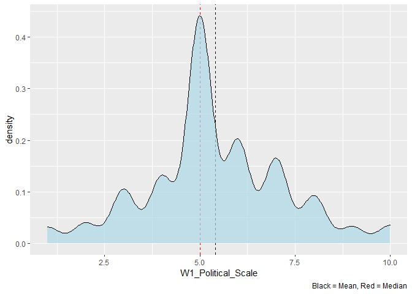<!-- -->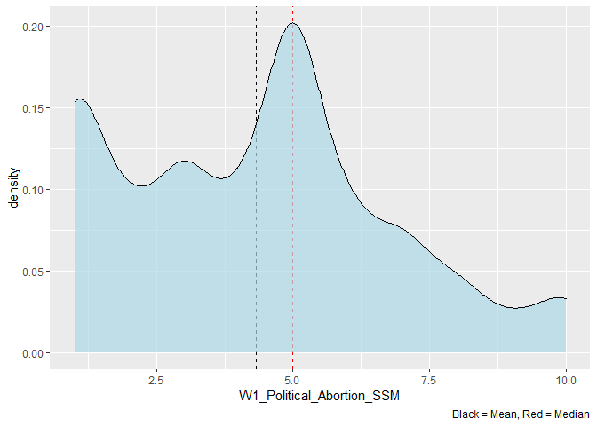<!-- -->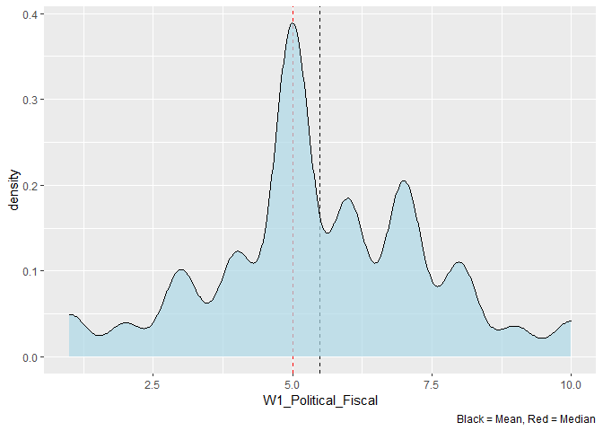<!-- -->

    ## Warning: Removed 30 rows containing non-finite values (stat_density).

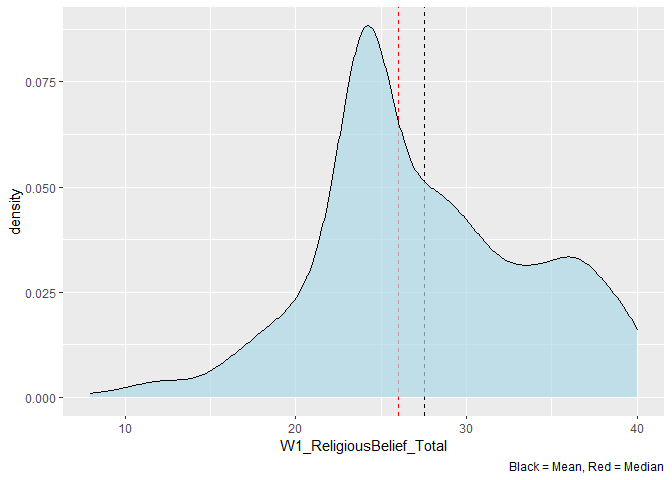<!-- -->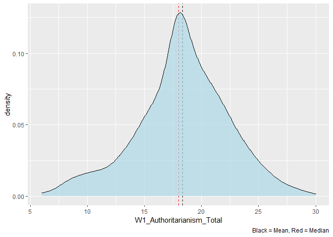<!-- -->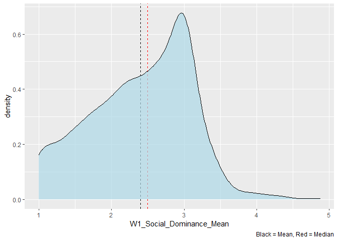<!-- -->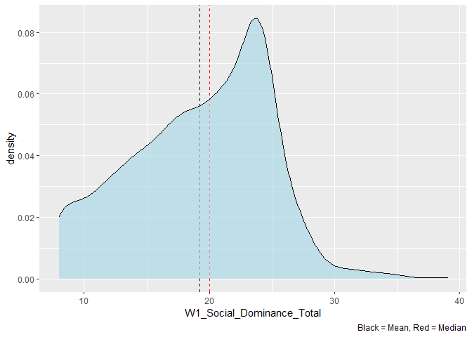<!-- -->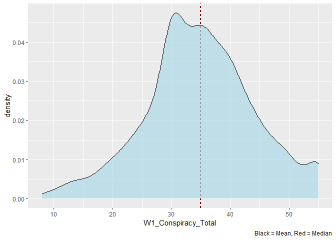<!-- -->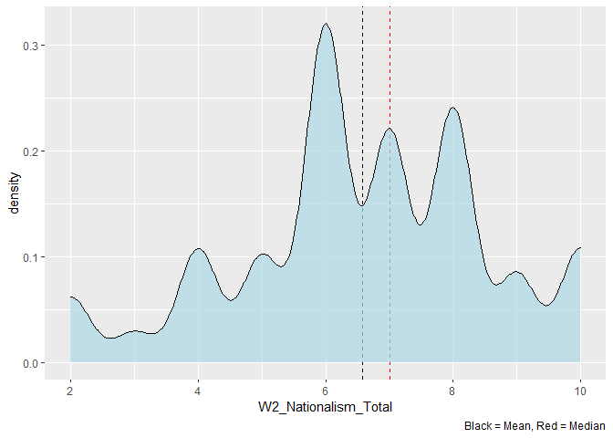<!-- --><!-- -->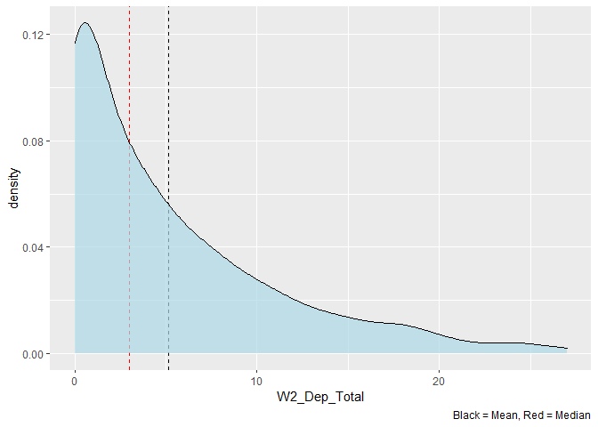<!-- -->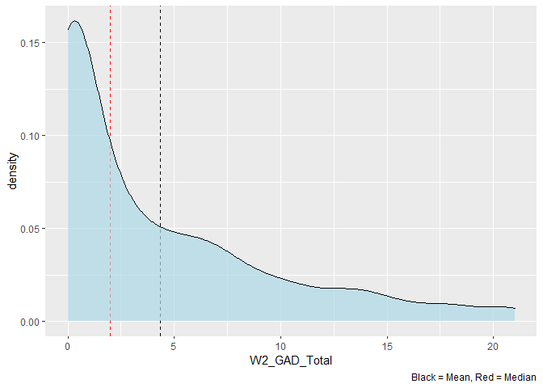<!-- -->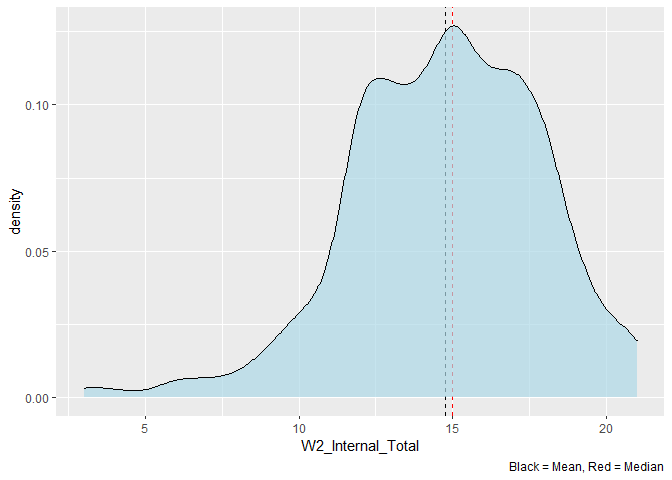<!-- -->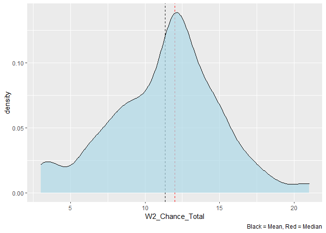<!-- -->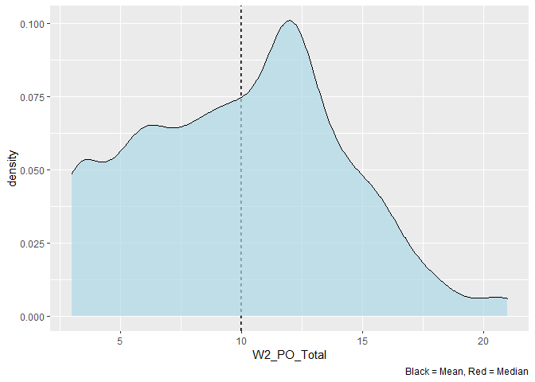<!-- -->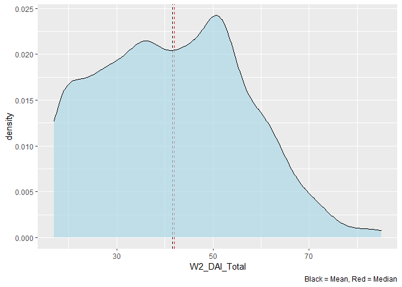<!-- -->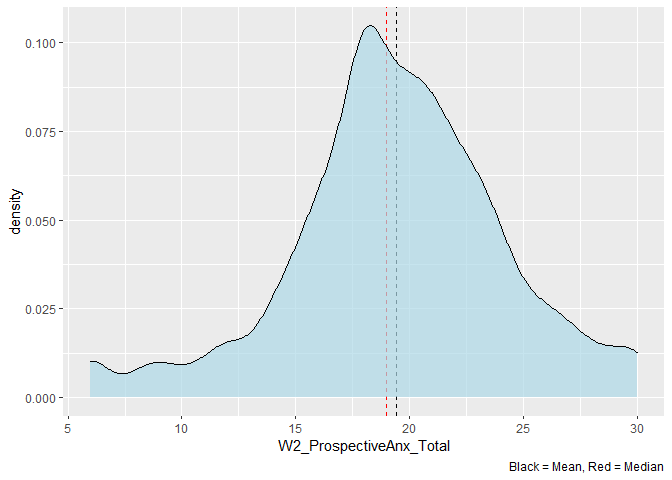<!-- -->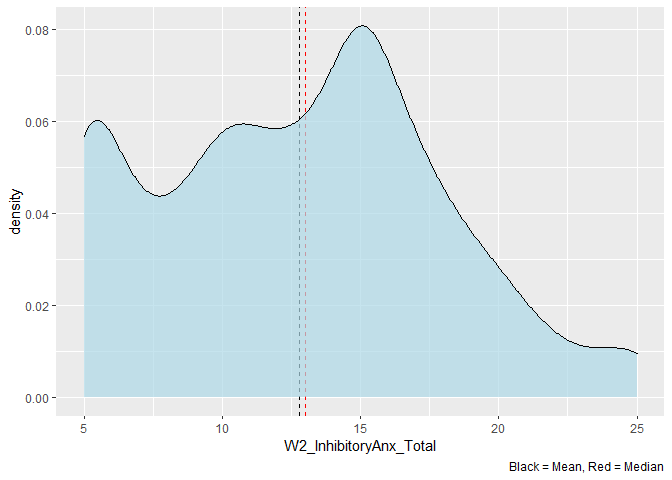<!-- -->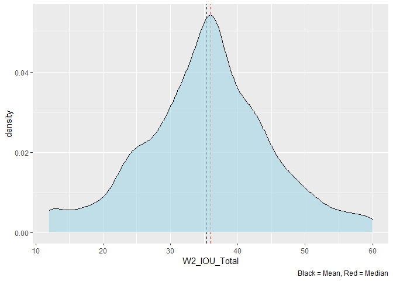<!-- -->

## Vote in 2019 election and conspiracy belief

``` r
conspiracies %>% 
  ggplot(aes(x = fct_reorder(W1_2019_GE_Full, W2_Conspiracy_Theory1),
             y = W2_Conspiracy_Theory1)) +
  geom_boxplot() +
  coord_flip() +
  labs(x = "Vote in 2019 GE",
       y = "Belief in Chinese Lab Origin")
```

<!-- -->

``` r
# filtering down for some of the main parties
parties <- c("UKIP",
             "Did not vote.",
             "Conservative",
             "Labour",
             "Green",
             "Scottish Nationalists",
             "Liberal Democrats")

conspiracies %>% 
  filter(W1_2019_GE_Full %in% parties) %>% 
  ggplot(aes(x = W2_Conspiracy_Theory1,
             y = fct_reorder(W1_2019_GE_Full, W2_Conspiracy_Theory1))) +
  geom_density_ridges(alpha = 0.7,
                      quantile_lines = TRUE,
                      quantiles = 4,
                      scale = 0.9,
                      jittered_points = TRUE,
                      vline_size = 1,
                      point_size = 0.6,
                      point_alpha = 0.6,
                      position = "raincloud") +
  labs(x = "Vote in 2019 GE",
       y = "Belief in Chinese lab origin")
```

    ## Picking joint bandwidth of 12

<!-- -->

``` r
# interestingly, Conservatives have relatively high belief in Chinese lab conspiracy

conspiracies %>% 
  ggplot(aes(x = fct_reorder(W1_2019_GE_Full, W2_Conspiracy_Theory3),
             y = W2_Conspiracy_Theory3)) +
  geom_boxplot() +
  coord_flip() +
  labs(x = "Vote in 2019 GE",
       y = "Belief in 5G Origin")
```

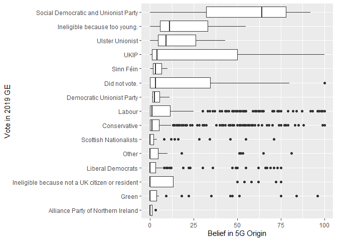<!-- -->

``` r
conspiracies %>% 
  filter(W1_2019_GE_Full %in% parties) %>% 
  ggplot(aes(x = W2_Conspiracy_Theory3,
             y = fct_reorder(W1_2019_GE_Full, W2_Conspiracy_Theory3))) +
  geom_density_ridges(alpha = 0.7,
                      quantile_lines = TRUE,
                      quantiles = 4,
                      scale = 0.9,
                      jittered_points = TRUE,
                      vline_size = 1,
                      point_size = 0.6,
                      point_alpha = 0.6,
                      position = "raincloud") +
  labs(x = "Vote in 2019 GE",
       y = "Belief in 5G origin")
```

    ## Picking joint bandwidth of 4.57

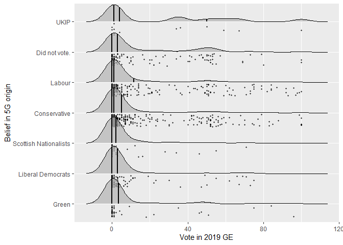<!-- -->

``` r
conspiracies %>% 
  ggplot(aes(x = fct_reorder(W1_2019_GE_Full, W2_Conspiracy_Theory4),
             y = W2_Conspiracy_Theory4)) +
  geom_boxplot() +
  coord_flip() +
  labs(x = "Vote in 2019 GE",
       y = "Belief it is no worse than flu")
```

<!-- -->

``` r
conspiracies %>% 
  filter(W1_2019_GE_Full %in% parties) %>% 
  ggplot(aes(x = W2_Conspiracy_Theory4,
             y = fct_reorder(W1_2019_GE_Full, W2_Conspiracy_Theory4))) +
  geom_density_ridges(alpha = 0.7,
                      quantile_lines = TRUE,
                      quantiles = 4,
                      scale = 0.9,
                      jittered_points = TRUE,
                      vline_size = 1,
                      point_size = 0.6,
                      point_alpha = 0.6,
                      position = "raincloud") +
  labs(x = "Vote in 2019 GE",
       y = "Belief it is no worse than flu")
```

    ## Picking joint bandwidth of 11

<!-- -->

``` r
conspiracies %>% 
  ggplot(aes(x = fct_reorder(W1_2019_GE_Full, W2_Conspiracy_Theory5),
             y = W2_Conspiracy_Theory5)) +
  geom_boxplot() +
  coord_flip() +
  labs(x = "Vote in 2019 GE",
       y = "Belief in Vitamin C treatment")
```

<!-- -->

## Forward stepwise model selection and linear model

``` r
conspiracies_subset <- conspiracies %>% 
  select(W1_Ethnicity,W1_Education,
         W1_Income_2019,W1_CRT1:W1_CRT_test,
         W1_EURef:W1_Political_Fiscal,
         W1_ReligiousBelief_Total:W1_Authoritarianism_Total,
         W1_Social_Dominance_Total:W2_Age_year,W2_Gender,
         W2_Living_alone,W2_Employment,
         W2_Trust_Body1:W2_Newspaper_prefer11,
         W2_COVID19_anxiety,W2_Conspiracy_Theory1:W2_Conspiracy_Theory5,
         W2_Nationalism_Total:W2_IOU_Total,
         W1_2019_GE_Full)
```

``` r
conspiracies_subset %>% 
  ggplot(aes(x = W2_Conspiracy_Theory1)) +
  geom_histogram(colour = "black", fill = "grey")
```

    ## `stat_bin()` using `bins = 30`. Pick better value with `binwidth`.

<!-- -->

``` r
pacman::p_load(plm)
model_matrix <- model.matrix(W2_Conspiracy_Theory1 ~ ., data = conspiracies_subset)
detect.lindep(model_matrix)
```

    ## [1] "No linear dependent column(s) detected."

``` r
reg_fit <- regsubsets(W2_Conspiracy_Theory1 ~ ., data = conspiracies_subset,
                      nvmax = 60, method = "forward")

plot(summary(reg_fit)$adjr2, type = "o")
```

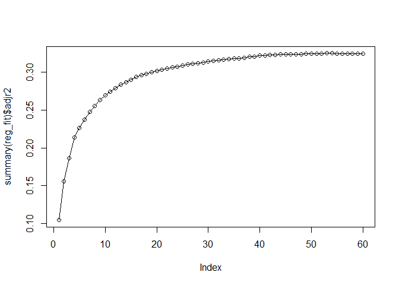<!-- -->

``` r
summary(reg_fit)$adjr2
```

    ##  [1] 0.1042053 0.1553604 0.1862207 0.2138494 0.2263827 0.2376108 0.2472434
    ##  [8] 0.2556947 0.2635711 0.2697876 0.2746367 0.2790626 0.2837059 0.2871326
    ## [15] 0.2902860 0.2936357 0.2962186 0.2978994 0.2998571 0.3016463 0.3033781
    ## [22] 0.3048775 0.3062533 0.3076579 0.3090437 0.3102190 0.3112729 0.3122751
    ## [29] 0.3131852 0.3140371 0.3148231 0.3156894 0.3165121 0.3171655 0.3179454
    ## [36] 0.3186991 0.3192006 0.3203053 0.3210424 0.3219848 0.3224210 0.3228545
    ## [43] 0.3232784 0.3235497 0.3236889 0.3238448 0.3240250 0.3242015 0.3245813
    ## [50] 0.3247571 0.3249401 0.3249766 0.3250513 0.3250342 0.3249174 0.3249329
    ## [57] 0.3247974 0.3246341 0.3245250 0.3243895

``` r
labels(coef(reg_fit, 38))
```

    ##  [1] "(Intercept)"                                                                                              
    ##  [2] "W1_EthnicityChinese"                                                                                      
    ##  [3] "W1_EthnicityAfro-Caribbean"                                                                               
    ##  [4] "W1_EducationO-Level/GCSE or similar"                                                                      
    ##  [5] "W1_EducationDiploma"                                                                                      
    ##  [6] "W1_Income_2019£491 - £740 per week (equals about £2,111 - £3,230 per month or £25,341 - £38,740 per year)"
    ##  [7] "W1_Income_2019£1,112 or more per week (equals about £4,831 or more per month or £57,931 or more per year)"
    ##  [8] "W1_CRT2500 minutes"                                                                                       
    ##  [9] "W1_CRT324 days"                                                                                           
    ## [10] "W1_CRT312 days"                                                                                           
    ## [11] "W1_CRT58"                                                                                                 
    ## [12] "W1_EURefVoted to stay in EU"                                                                              
    ## [13] "W1_EURefIneligible because not a UK citizen or resident"                                                  
    ## [14] "W1_ReligiousBelief_Total"                                                                                 
    ## [15] "W1_Authoritarianism_Total"                                                                                
    ## [16] "W1_Social_Dominance_Total"                                                                                
    ## [17] "W1_Conspiracy_Total"                                                                                      
    ## [18] "W2_Living_aloneYes"                                                                                       
    ## [19] "W2_EmploymentUnemployed (becasue of coronavirus)"                                                         
    ## [20] "W2_Trust_Body2Trust moderately"                                                                           
    ## [21] "W2_Trust_Body6Trust moderately"                                                                           
    ## [22] "W2_Trust_Body7Do not trust at all"                                                                        
    ## [23] "W2_Newspaper_prefer11"                                                                                    
    ## [24] "W2_Newspaper_prefer61"                                                                                    
    ## [25] "W2_Newspaper_prefer91"                                                                                    
    ## [26] "W2_COVID19_anxiety"                                                                                       
    ## [27] "W2_Conspiracy_Theory2"                                                                                    
    ## [28] "W2_Conspiracy_Theory3"                                                                                    
    ## [29] "W2_Conspiracy_Theory4"                                                                                    
    ## [30] "W2_Conspiracy_Theory5"                                                                                    
    ## [31] "W2_Nationalism_Total"                                                                                     
    ## [32] "W2_Paranoia_Total"                                                                                        
    ## [33] "W2_Internal_Total"                                                                                        
    ## [34] "W2_DAI_Total"                                                                                             
    ## [35] "W2_IOU_Total"                                                                                             
    ## [36] "W1_2019_GE_FullGreen"                                                                                     
    ## [37] "W1_2019_GE_FullIneligible because not a UK citizen or resident"                                           
    ## [38] "W1_2019_GE_FullSinn Féin"                                                                                 
    ## [39] "W1_2019_GE_FullUlster Unionist"

``` r
# creating necessary dummy variables
conspiracies_subset$chinese <- ifelse(
  conspiracies_subset$W1_Ethnicity == "Chinese", 1, 0
)

conspiracies_subset$afro_caribbean <- ifelse(
  conspiracies_subset$W1_Ethnicity == "Afro-Caribbean", 1, 0
)

conspiracies_subset$gcse <- ifelse(
  conspiracies_subset$W1_Education == "O-Level/GCSE or similar", 1, 0
)

conspiracies_subset$diploma <- ifelse(
  conspiracies_subset$W1_Education == "Diploma", 1, 0
)

conspiracies_subset$income_25341_38740_pa <- ifelse(
  conspiracies_subset$W1_Income_2019 == "£491 - £740 per week (equals about £2,111 - £3,230 per month or £25,341 - £38,740 per year)", 1, 0
)

conspiracies_subset$income_57931_plus_pa <- ifelse(
  conspiracies_subset$W1_Income_2019 == "£1,112 or more per week (equals about £4,831 or more per month or £57,931 or more per year)", 1, 0
)

conspiracies_subset$CRT2_500_mins <- ifelse(
  conspiracies_subset$W1_CRT2 == "500 minutes", 1, 0
)

conspiracies_subset$CRT3_24_days <- ifelse(
  conspiracies_subset$W1_CRT3 == "24 days", 1, 0
)

conspiracies_subset$CRT3_12_days <- ifelse(
  conspiracies_subset$W1_CRT3 == "12 days", 1, 0
)

conspiracies_subset$CRT5_8 <- ifelse(
  conspiracies_subset$W1_CRT5 == "8", 1, 0
)

conspiracies_subset$remainer <- ifelse(
  conspiracies_subset$W1_EURef == "Voted to stay in EU", 1, 0
)

conspiracies_subset$ref_not_citizen <- ifelse(
  conspiracies_subset$W1_EURef == "Ineligible because not a UK citizen or resident", 1, 0
)

conspiracies_subset$living_alone <- ifelse(
  conspiracies_subset$W2_Living_alone == "Yes", 1, 0
)

conspiracies_subset$unemployed_corona <- ifelse(
  conspiracies_subset$W2_Employment == "Unemployed (becasue of coronavirus)",
  1, 0
)

conspiracies_subset$trust_govt_moderate <- ifelse(
  conspiracies_subset$W2_Trust_Body2 == "Trust moderately",
  1, 0
)

conspiracies_subset$trust_science_moderate <- ifelse(
  conspiracies_subset$W2_Trust_Body6 == "Trust moderately",
  1, 0
)

conspiracies_subset$dont_trust_doctors <- ifelse(
  conspiracies_subset$W2_Trust_Body7 == "Do not trust at all",
  1, 0
)

conspiracies_subset$green <- ifelse(
  conspiracies_subset$W1_2019_GE_Full == "Green", 1, 0
)

conspiracies_subset$ineligible_ge <- ifelse(
  conspiracies_subset$W1_2019_GE_Full == "Ineligible because not a UK citizen or resident", 1, 0
)

conspiracies_subset$sinn_fein <- ifelse(
  conspiracies_subset$W1_2019_GE_Full == "Sinn Féin", 1, 0
)

conspiracies_subset$ulster_unionist <- ifelse(
  conspiracies_subset$W1_2019_GE_Full == "Ulster Unionist", 1, 0
)
```

``` r
lab_mod <- lm(W2_Conspiracy_Theory1 ~ chinese +
                afro_caribbean +
                gcse + 
                diploma +
                income_25341_38740_pa +
                income_57931_plus_pa +
                CRT2_500_mins +
                CRT3_24_days +
                CRT3_12_days +
                CRT5_8 +
                remainer +
                ref_not_citizen +
                W1_ReligiousBelief_Total +
                W1_Authoritarianism_Total +
                W1_Social_Dominance_Total +
                W1_Conspiracy_Total +
                living_alone +
                unemployed_corona +
                trust_govt_moderate +
                trust_science_moderate +
                dont_trust_doctors +
                W2_Newspaper_prefer1 +
                W2_Newspaper_prefer6 +
                W2_Newspaper_prefer9 +
                W2_COVID19_anxiety +
                W2_Conspiracy_Theory2 +
                W2_Conspiracy_Theory3 +
                W2_Conspiracy_Theory4 +
                W2_Conspiracy_Theory5 +
                W2_Nationalism_Total +
                W2_Paranoia_Total +
                W2_Internal_Total +
                W2_DAI_Total +
                W2_IOU_Total +
                green +
                ineligible_ge +
                sinn_fein +
                ulster_unionist,
              data = conspiracies_subset)

summary(lab_mod)
```

    ## 
    ## Call:
    ## lm(formula = W2_Conspiracy_Theory1 ~ chinese + afro_caribbean + 
    ##     gcse + diploma + income_25341_38740_pa + income_57931_plus_pa + 
    ##     CRT2_500_mins + CRT3_24_days + CRT3_12_days + CRT5_8 + remainer + 
    ##     ref_not_citizen + W1_ReligiousBelief_Total + W1_Authoritarianism_Total + 
    ##     W1_Social_Dominance_Total + W1_Conspiracy_Total + living_alone + 
    ##     unemployed_corona + trust_govt_moderate + trust_science_moderate + 
    ##     dont_trust_doctors + W2_Newspaper_prefer1 + W2_Newspaper_prefer6 + 
    ##     W2_Newspaper_prefer9 + W2_COVID19_anxiety + W2_Conspiracy_Theory2 + 
    ##     W2_Conspiracy_Theory3 + W2_Conspiracy_Theory4 + W2_Conspiracy_Theory5 + 
    ##     W2_Nationalism_Total + W2_Paranoia_Total + W2_Internal_Total + 
    ##     W2_DAI_Total + W2_IOU_Total + green + ineligible_ge + sinn_fein + 
    ##     ulster_unionist, data = conspiracies_subset)
    ## 
    ## Residuals:
    ##     Min      1Q  Median      3Q     Max 
    ## -71.353 -20.226  -2.311  18.610  83.761 
    ## 
    ## Coefficients:
    ##                            Estimate Std. Error t value Pr(>|t|)    
    ## (Intercept)               -11.68648    8.74365  -1.337  0.18159    
    ## chinese                   -19.86929    7.48008  -2.656  0.00800 ** 
    ## afro_caribbean             33.44321   16.05942   2.082  0.03749 *  
    ## gcse                        3.08595    2.00583   1.538  0.12417    
    ## diploma                     6.34259    3.39623   1.868  0.06205 .  
    ## income_25341_38740_pa      -6.09402    2.02781  -3.005  0.00270 ** 
    ## income_57931_plus_pa       -6.02619    2.01000  -2.998  0.00277 ** 
    ## CRT2_500_mins               7.81068    2.80615   2.783  0.00546 ** 
    ## CRT3_24_days                3.86324    1.84230   2.097  0.03619 *  
    ## CRT3_12_days                4.67033    2.52947   1.846  0.06506 .  
    ## CRT5_8                     -2.90455    1.70018  -1.708  0.08780 .  
    ## remainer                   -4.46813    1.68591  -2.650  0.00814 ** 
    ## ref_not_citizen           -18.56300    8.24070  -2.253  0.02445 *  
    ## W1_ReligiousBelief_Total   -0.21953    0.13414  -1.637  0.10195    
    ## W1_Authoritarianism_Total   0.42791    0.22688   1.886  0.05951 .  
    ## W1_Social_Dominance_Total   0.38371    0.16027   2.394  0.01680 *  
    ## W1_Conspiracy_Total         0.50567    0.08481   5.962 3.18e-09 ***
    ## living_alone               -3.22269    1.84811  -1.744  0.08143 .  
    ## unemployed_corona          -8.98400    4.84888  -1.853  0.06413 .  
    ## trust_govt_moderate        -4.35162    1.77983  -2.445  0.01462 *  
    ## trust_science_moderate      4.41601    1.86331   2.370  0.01793 *  
    ## dont_trust_doctors          7.34892    4.99033   1.473  0.14109    
    ## W2_Newspaper_prefer11       8.59211    1.73880   4.941 8.75e-07 ***
    ## W2_Newspaper_prefer61      -4.39034    2.52739  -1.737  0.08260 .  
    ## W2_Newspaper_prefer91       6.26434    2.40948   2.600  0.00943 ** 
    ## W2_COVID19_anxiety          0.13171    0.03168   4.158 3.41e-05 ***
    ## W2_Conspiracy_Theory2      -0.14375    0.02728  -5.270 1.59e-07 ***
    ## W2_Conspiracy_Theory3       0.16112    0.05043   3.195  0.00143 ** 
    ## W2_Conspiracy_Theory4       0.07759    0.02803   2.768  0.00572 ** 
    ## W2_Conspiracy_Theory5       0.08387    0.04610   1.819  0.06913 .  
    ## W2_Nationalism_Total        1.10441    0.43105   2.562  0.01051 *  
    ## W2_Paranoia_Total           0.36359    0.19183   1.895  0.05827 .  
    ## W2_Internal_Total           0.55692    0.25946   2.146  0.03202 *  
    ## W2_DAI_Total                0.14365    0.06411   2.240  0.02523 *  
    ## W2_IOU_Total               -0.16405    0.09933  -1.652  0.09886 .  
    ## green                      -7.59355    4.19393  -1.811  0.07043 .  
    ## ineligible_ge              14.60555    9.16776   1.593  0.11137    
    ## sinn_fein                  36.06850   16.18037   2.229  0.02597 *  
    ## ulster_unionist            30.60089   16.03478   1.908  0.05655 .  
    ## ---
    ## Signif. codes:  0 '***' 0.001 '**' 0.01 '*' 0.05 '.' 0.1 ' ' 1
    ## 
    ## Residual standard error: 27.43 on 1323 degrees of freedom
    ##   (44 observations deleted due to missingness)
    ## Multiple R-squared:  0.3372, Adjusted R-squared:  0.3182 
    ## F-statistic: 17.71 on 38 and 1323 DF,  p-value: < 2.2e-16

``` r
par(mfrow = c(2,2))
plot(lab_mod)
```

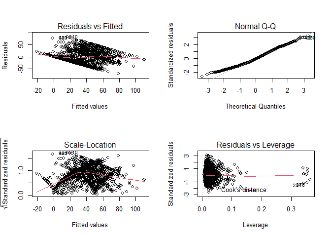<!-- -->

``` r
source("diagnostic_plots.R")

av_ggplot(lab_mod)
```

    ## `geom_smooth()` using formula 'y ~ x'

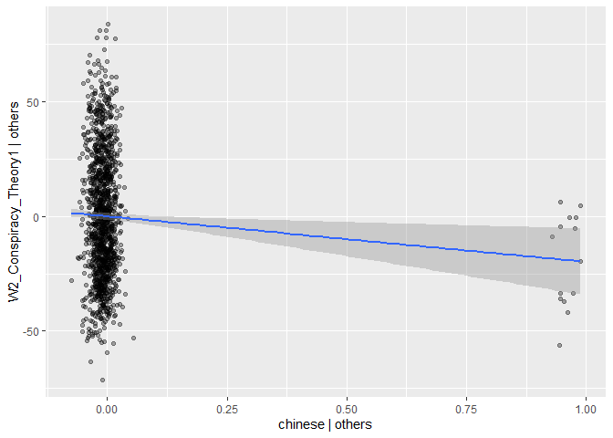<!-- -->

    ## `geom_smooth()` using formula 'y ~ x'

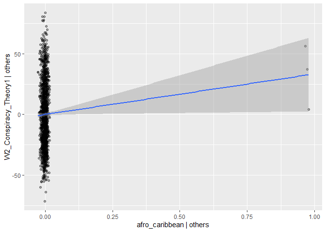<!-- -->

    ## `geom_smooth()` using formula 'y ~ x'

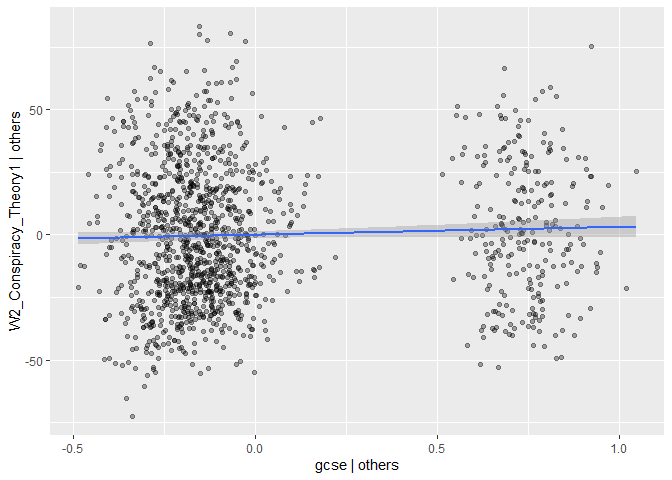<!-- -->

    ## `geom_smooth()` using formula 'y ~ x'

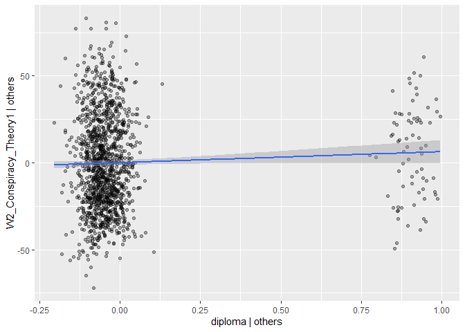<!-- -->

    ## `geom_smooth()` using formula 'y ~ x'

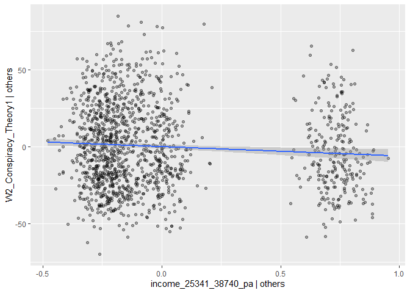<!-- -->

    ## `geom_smooth()` using formula 'y ~ x'

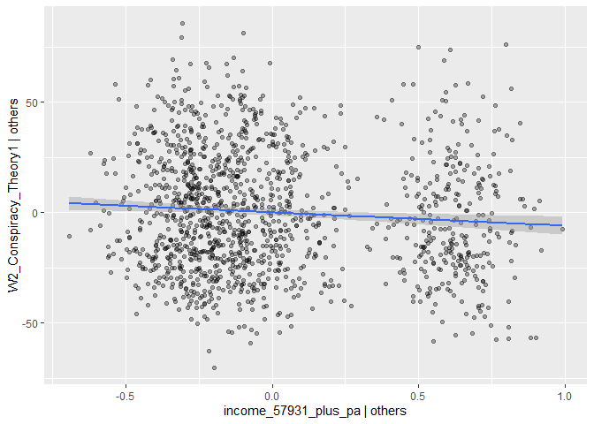<!-- -->

    ## `geom_smooth()` using formula 'y ~ x'

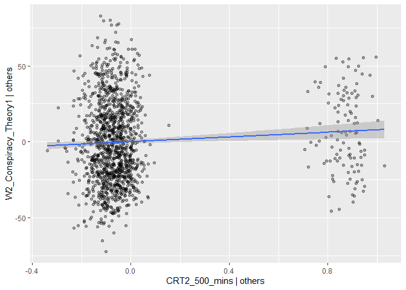<!-- -->

    ## `geom_smooth()` using formula 'y ~ x'

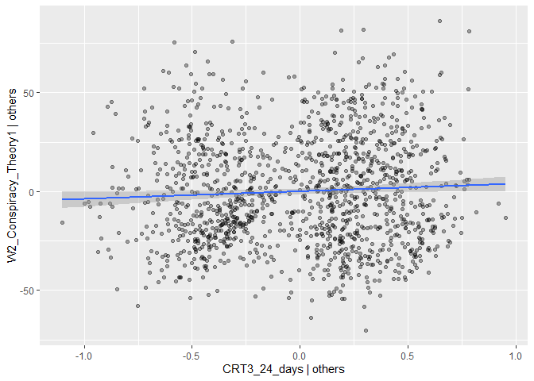<!-- -->

    ## `geom_smooth()` using formula 'y ~ x'

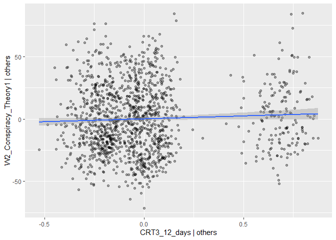<!-- -->

    ## `geom_smooth()` using formula 'y ~ x'

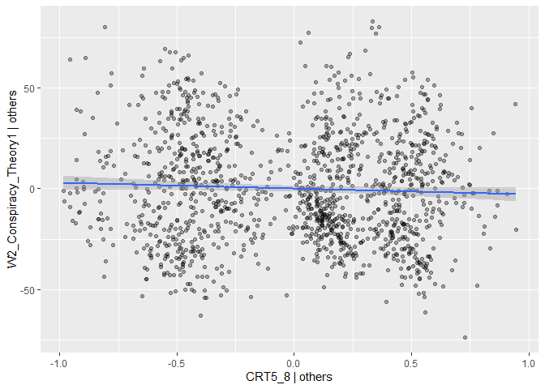<!-- -->

    ## `geom_smooth()` using formula 'y ~ x'

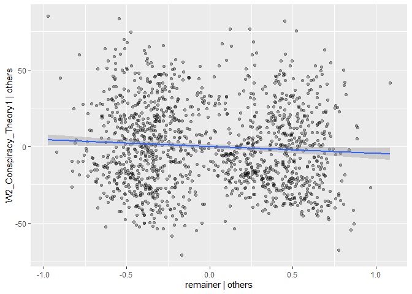<!-- -->

    ## `geom_smooth()` using formula 'y ~ x'

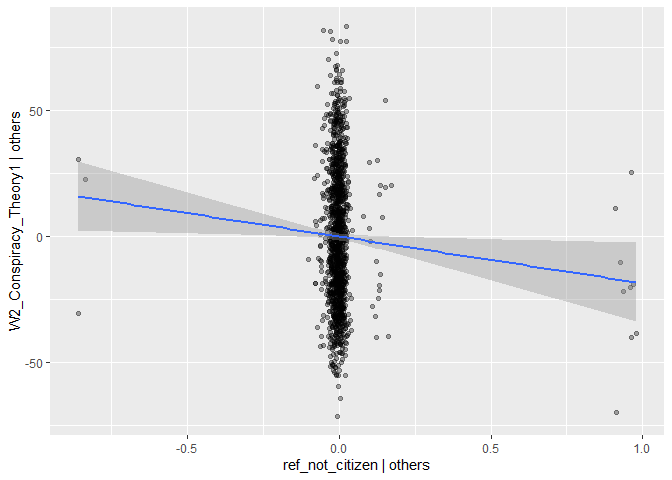<!-- -->

    ## `geom_smooth()` using formula 'y ~ x'

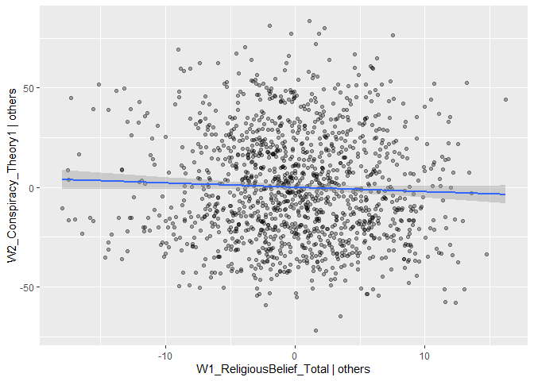<!-- -->

    ## `geom_smooth()` using formula 'y ~ x'

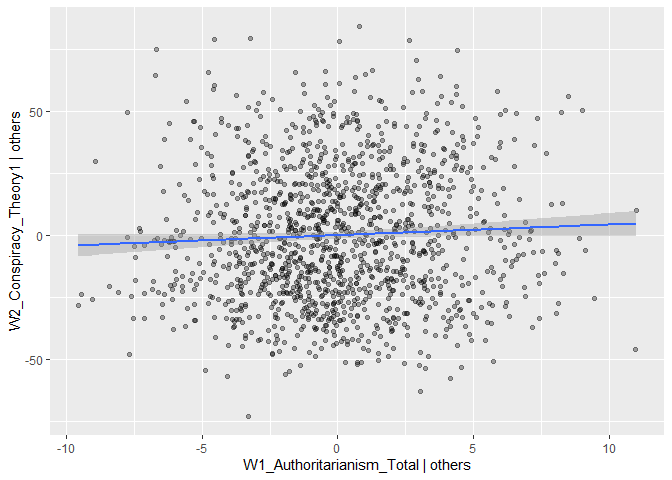<!-- -->

    ## `geom_smooth()` using formula 'y ~ x'

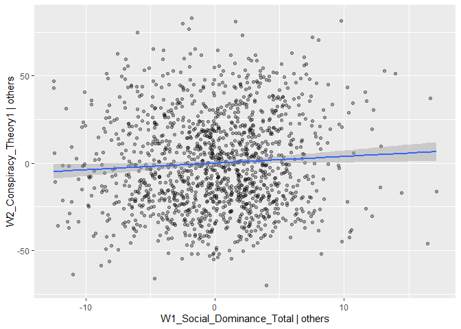<!-- -->

    ## `geom_smooth()` using formula 'y ~ x'

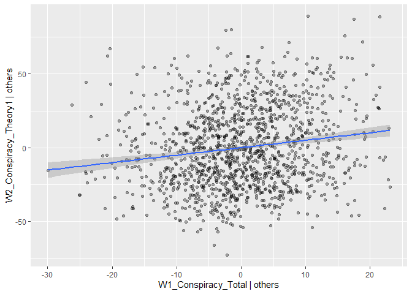<!-- -->

    ## `geom_smooth()` using formula 'y ~ x'

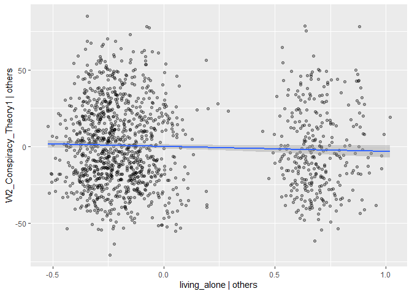<!-- -->

    ## `geom_smooth()` using formula 'y ~ x'

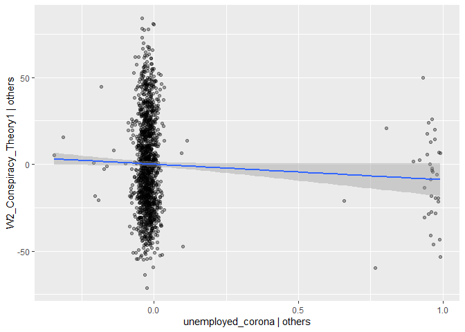<!-- -->

    ## `geom_smooth()` using formula 'y ~ x'

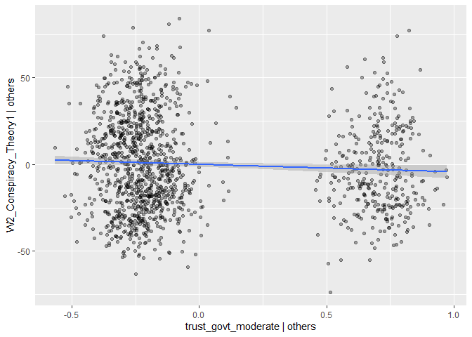<!-- -->

    ## `geom_smooth()` using formula 'y ~ x'

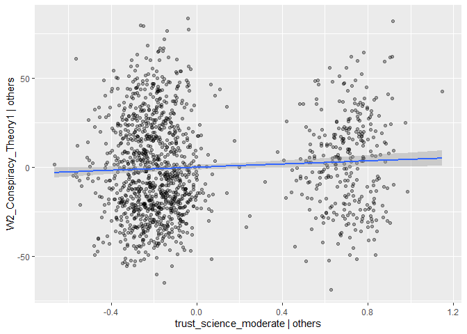<!-- -->

    ## `geom_smooth()` using formula 'y ~ x'

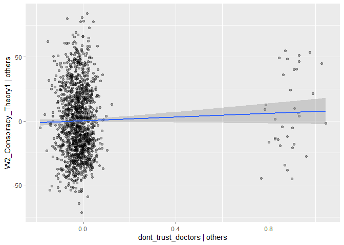<!-- -->

    ## `geom_smooth()` using formula 'y ~ x'

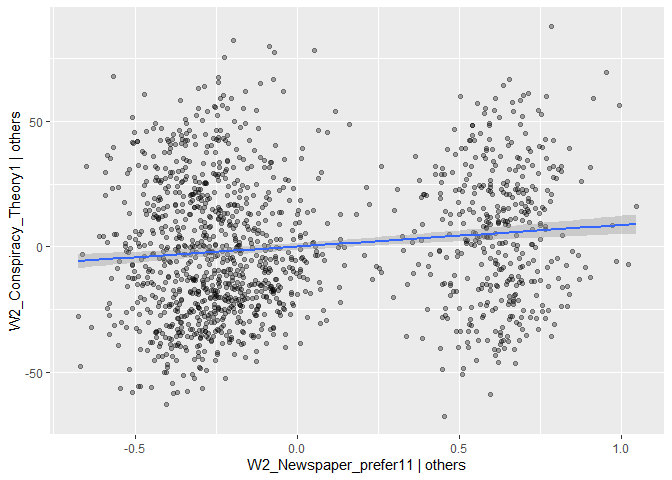<!-- -->

    ## `geom_smooth()` using formula 'y ~ x'

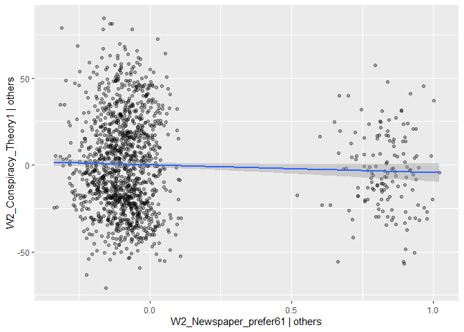<!-- -->

    ## `geom_smooth()` using formula 'y ~ x'

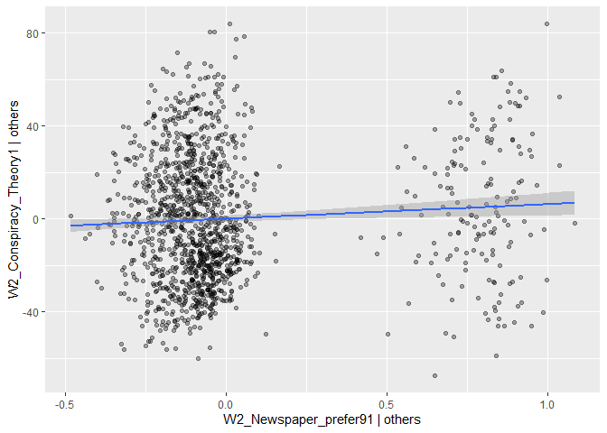<!-- -->

    ## `geom_smooth()` using formula 'y ~ x'

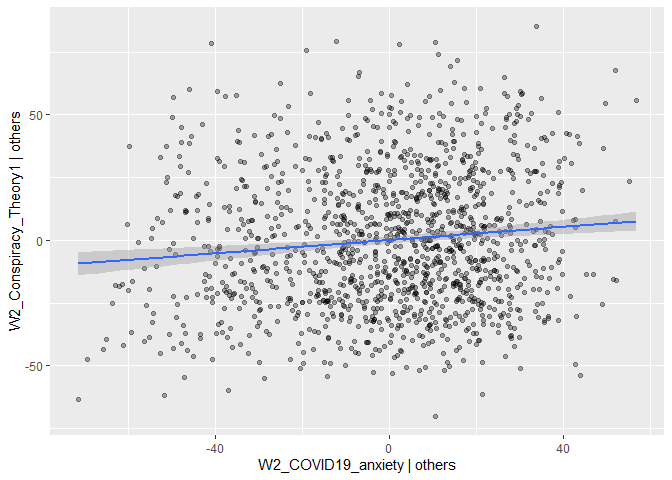<!-- -->

    ## `geom_smooth()` using formula 'y ~ x'

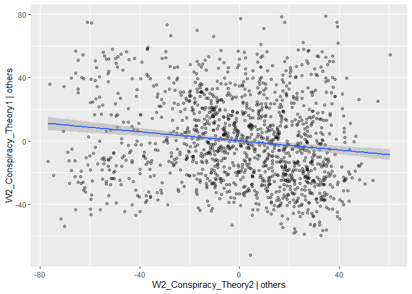<!-- -->

    ## `geom_smooth()` using formula 'y ~ x'

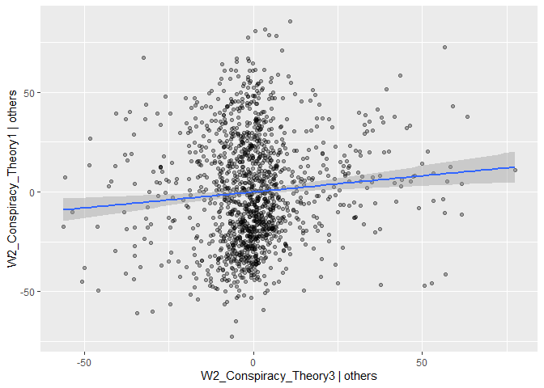<!-- -->

    ## `geom_smooth()` using formula 'y ~ x'

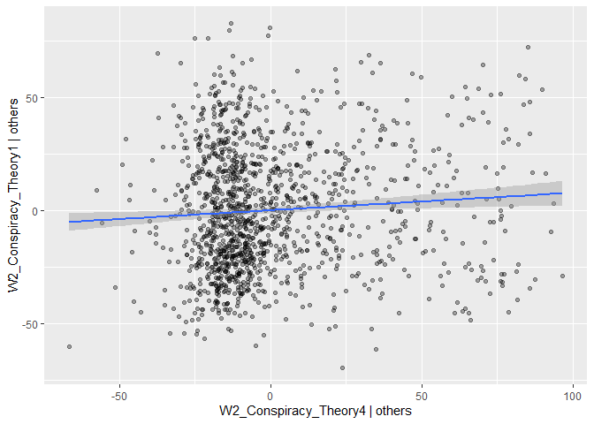<!-- -->

    ## `geom_smooth()` using formula 'y ~ x'

<!-- -->

    ## `geom_smooth()` using formula 'y ~ x'

<!-- -->

    ## `geom_smooth()` using formula 'y ~ x'

<!-- -->

    ## `geom_smooth()` using formula 'y ~ x'

<!-- -->

    ## `geom_smooth()` using formula 'y ~ x'

<!-- -->

    ## `geom_smooth()` using formula 'y ~ x'

<!-- -->

    ## `geom_smooth()` using formula 'y ~ x'

<!-- -->

    ## `geom_smooth()` using formula 'y ~ x'

<!-- -->

    ## `geom_smooth()` using formula 'y ~ x'

<!-- -->

    ## `geom_smooth()` using formula 'y ~ x'

<!-- -->
