covid\_conspiracies\_markdown2
================
Michael Marshall
21/10/2020

## Loading Packages and Data

``` r
pacman::p_load(tidyverse, stringr, ggridges, forcats, labelled, leaps,
               psych, corrr, cowplot, expss, haven, interplot,
               interactions, jtools,labelled, pscl, psych, 
               sjPlot, skimr)

load("COVID W1_W2_W3 Cleaned 2878.RData") # needs to be in your wd
```

## Rescaling variable

``` r
## [rescale01] Function to rescale a variable from 0 to 1
rescale01 <- function(x, ...) {
  (x - min(x, ...)) / ((max(x, ...)) - min(x, ...))
}
```

## Summary and distribution of different COVID specific conspiracies

``` r
# plotting density of different covid conspiracies
df %>% 
  dplyr::select(W2_Conspiracy_Theory1:W2_Conspiracy_Theory5) %>% 
  gather(conspiracy_code, belief,
         W2_Conspiracy_Theory1:W2_Conspiracy_Theory5) %>%
  mutate(
    conspiracy_code = as.factor(conspiracy_code),
    conspiracy = ifelse(
      conspiracy_code == "W2_Conspiracy_Theory1",
      "Chinese lab",
      ifelse(conspiracy_code == "W2_Conspiracy_Theory2",
             "Chinese meat market",
             ifelse(conspiracy_code == "W2_Conspiracy_Theory3",
                    "5G",
                    ifelse(conspiracy_code == "W2_Conspiracy_Theory4",
                           "No worse than flu",
                           "Vitamin C treatment"))))
  ) %>% 
  ggplot(aes(x = belief, y = conspiracy, height = ..density..)) +
  geom_density_ridges(aes(fill = conspiracy,
                          rel_min_height = 0.005),
                      stat = "density",
                      #bins = 20,
                      show.legend = FALSE) +
  scale_fill_brewer(palette = "Dark2") +
  theme_ridges()
```

    ## Warning: attributes are not identical across measure variables;
    ## they will be dropped

    ## Warning: Removed 7360 rows containing non-finite values (stat_density).

<!-- -->

## Cleaning dataset

The following code filters down to just those observations that have
completed the battery of questions relating to COVID specific
conspiracies. It also creates a tibble counting the missing
observations, which can be useful to have as an object.

``` r
# filtering for completed dependent variable
conspiracies <- df %>% 
  filter(!is.na(W2_Conspiracy_Theory1) |
           !is.na(W2_Conspiracy_Theory2) |
           !is.na(W2_Conspiracy_Theory3) |
           !is.na(W2_Conspiracy_Theory3) |
           !is.na(W2_Conspiracy_Theory4) |
           !is.na(W2_Conspiracy_Theory5)) %>% 
  rename(W1_Housing_tenure = W1_Hosuing_tenure)

# function to count NAs
count_na <- function(x){
  sum(is.na(x))
}

conspiracies %>% 
  dplyr::select(W2_Conspiracy_Theory1:W2_Conspiracy_Theory5) %>% 
  map_int(count_na)
```

    ## W2_Conspiracy_Theory1 W2_Conspiracy_Theory2 W2_Conspiracy_Theory3 
    ##                     0                     0                     0 
    ## W2_Conspiracy_Theory4 W2_Conspiracy_Theory5 
    ##                     0                     0

``` r
missing <- tibble(
  variable = names(conspiracies),
  NAs = conspiracies %>% map_int(count_na)
)

#View(missing)
```

The code below combines the two variables on the 2019 general election
into a single variable that combines whether a respondent voted, and who
they voted for. It also turns the *preferred newspaper* variables into
dummy variables, as they were previously coded as *1=Yes* and everything
else as *NA*.

``` r
# combining 2019 election variables into one, for parties and didn't votes

conspiracies <- conspiracies %>% 
  mutate(
    W1_Voted_Party_Name = to_factor(
      conspiracies$W1_Voted_Party,
      nolabel_to_na = TRUE),
    W1_Voted_GenElection_Name = to_factor(
      conspiracies$W1_Voted_GenElection,
      nolabel_to_na = TRUE),
    W1_2019_GE_Full = factor(ifelse(
      W1_Voted_GenElection_Name == "Voted.",
      as.character(W1_Voted_Party_Name),
      as.character(W1_Voted_GenElection_Name)))
    )

# making preferred newspaper dummy variable (i.e. replacing NA with 0)
na_to_zero <- function(x){
  x[is.na(x)] <- 0
  x <- as.numeric(x)
  return(x)
} 

paper_vars <- conspiracies %>%
  dplyr::select(W2_Newspaper_prefer1:W2_Newspaper_prefer11) %>% 
  names()

conspiracies[paper_vars] <- conspiracies[paper_vars] %>% 
  map_df(na_to_zero)
```

``` r
# Creating DVs
# [nat] nationalism
nat_keys <- list(nationalism = cs(W2_Nationalism1,W2_Nationalism2))
nat_test <- scoreItems(nat_keys, conspiracies, min = 1, max = 5)
head(nat_test$scores)
```

    ##      nationalism
    ## [1,]           4
    ## [2,]           4
    ## [3,]           4
    ## [4,]           3
    ## [5,]           3
    ## [6,]           3

``` r
nat_test$alpha  # Scale alpha
```

    ##       nationalism
    ## alpha   0.8213221

``` r
conspiracies$nat <- rescale01(nat_test$scores, na.rm = TRUE)
conspiracies$nat <- c(conspiracies$nat)  # Ensure variable is numeric and not matrix class
describe(conspiracies$nat)
```

    ##    vars    n mean   sd median trimmed  mad min max range  skew kurtosis   se
    ## X1    1 1406 0.57 0.25   0.62    0.58 0.19   0   1     1 -0.33    -0.18 0.01

``` r
## [imm.econ] Anti-immigrant sentiment - Economy 
table(conspiracies$W1_MigrantAttitudes1)
```

    ## 
    ##   1   2   3   4   5   6   7   8   9  10 
    ##  71  38  80 105 188 198 264 255  87 120

``` r
conspiracies$imm_econ <- rescale01(abs(
  conspiracies$W1_MigrantAttitudes1 - 11))

conspiracies %>% 
  dplyr::select(W1_MigrantAttitudes1, imm_econ) %>%
  correlate()
```

    ## 
    ## Correlation method: 'pearson'
    ## Missing treated using: 'pairwise.complete.obs'

    ## # A tibble: 2 x 3
    ##   rowname              W1_MigrantAttitudes1 imm_econ
    ##   <chr>                               <dbl>    <dbl>
    ## 1 W1_MigrantAttitudes1                   NA       -1
    ## 2 imm_econ                               -1       NA

``` r
## [imm.res] Anti-immigrant sentiment - Resources
table(conspiracies$W1_MigrantAttitudes3)
```

    ## 
    ##   1   2   3   4   5 
    ##  68 101 575 431 231

``` r
conspiracies$imm_res <- rescale01(conspiracies$W1_MigrantAttitudes3)
conspiracies %>% 
  dplyr::select(W1_MigrantAttitudes3, imm_res) %>%
  correlate()
```

    ## 
    ## Correlation method: 'pearson'
    ## Missing treated using: 'pairwise.complete.obs'

    ## # A tibble: 2 x 3
    ##   rowname              W1_MigrantAttitudes3 imm_res
    ##   <chr>                               <dbl>   <dbl>
    ## 1 W1_MigrantAttitudes3                   NA       1
    ## 2 imm_res                                 1      NA

``` r
## [imm.cul] Anti-immigrant sentiment - Culture
table(conspiracies$W1_MigrantAttitudes2)
```

    ## 
    ##   1   2   3   4   5   6   7   8   9  10 
    ## 101  57  88 120 202 177 225 219  80 137

``` r
conspiracies$imm_cul <- rescale01(abs(
  conspiracies$W1_MigrantAttitudes2 - 11))

conspiracies %>% 
  dplyr::select(W1_MigrantAttitudes2, imm_cul) %>%
  correlate()
```

    ## 
    ## Correlation method: 'pearson'
    ## Missing treated using: 'pairwise.complete.obs'

    ## # A tibble: 2 x 3
    ##   rowname              W1_MigrantAttitudes2 imm_cul
    ##   <chr>                               <dbl>   <dbl>
    ## 1 W1_MigrantAttitudes2                   NA      -1
    ## 2 imm_cul                                -1      NA

``` r
# Right wing authoritarianism
rwa_keys <- list(rwa = cs(W1_Authoritarianism1_R,
                          W1_Authoritarianism2,
                          W1_Authoritarianism3,
                          W1_Authoritarianism4_R, 
                          W1_Authoritarianism5_R,
                          W1_Authoritarianism6))

rwa_test <- scoreItems(rwa_keys, conspiracies, min = 1, max = 5)
head(rwa_test$scores)
```

    ##           rwa
    ## [1,] 2.833333
    ## [2,] 2.666667
    ## [3,] 3.166667
    ## [4,] 3.333333
    ## [5,] 3.000000
    ## [6,] 3.500000

``` r
summary(rwa_test$alpha)  # Scale alpha
```

    ##       rwa        
    ##  Min.   :0.6837  
    ##  1st Qu.:0.6837  
    ##  Median :0.6837  
    ##  Mean   :0.6837  
    ##  3rd Qu.:0.6837  
    ##  Max.   :0.6837

``` r
conspiracies$RWA <- rescale01(rwa_test$scores, na.rm = TRUE)
conspiracies$RWA <- c(conspiracies$RWA)  # Ensure variable is numeric and not matrix class

describe(conspiracies$RWA)
```

    ##    vars    n mean   sd median trimmed  mad min max range  skew kurtosis se
    ## X1    1 1406 0.51 0.17    0.5    0.52 0.12   0   1     1 -0.25      0.3  0

``` r
## [SDO] Social Dominance Orientation
sdo_keys <- list(sdo = cs(W1_Social_Dominance1,
                          W1_Social_Dominance2_R,
                          W1_Social_Dominance3_R,
                          W1_Social_Dominance4,
                          W1_Social_Dominance5_R,
                          W1_Social_Dominance6, 
                          W1_Social_Dominance7,
                          W1_Social_Dominance8_R))
sdo_test <- scoreItems(sdo_keys, conspiracies, min = 1, max = 5)
head(sdo_test$scores)
```

    ##        sdo
    ## [1,] 1.500
    ## [2,] 3.000
    ## [3,] 3.000
    ## [4,] 2.625
    ## [5,] 3.000
    ## [6,] 2.500

``` r
summary(sdo_test$alpha)  # Scale alpha
```

    ##       sdo        
    ##  Min.   :0.8404  
    ##  1st Qu.:0.8404  
    ##  Median :0.8404  
    ##  Mean   :0.8404  
    ##  3rd Qu.:0.8404  
    ##  Max.   :0.8404

``` r
conspiracies$SDO <- rescale01(sdo_test$scores, na.rm = TRUE)
conspiracies$SDO <- c(conspiracies$SDO)  # Ensure variable is numeric and not matrix class

summary(conspiracies$SDO)
```

    ##    Min. 1st Qu.  Median    Mean 3rd Qu.    Max. 
    ##  0.0000  0.2258  0.3871  0.3620  0.5161  1.0000

``` r
## [threat] Covid-19 related Threat
summary(conspiracies$W2_COVID19_anxiety)
```

    ##    Min. 1st Qu.  Median    Mean 3rd Qu.    Max. 
    ##    0.00   50.00   65.00   61.25   80.75  100.00

``` r
conspiracies$threat <- rescale01(conspiracies$W2_COVID19_anxiety)
conspiracies %>% 
  dplyr::select(W2_COVID19_anxiety, threat) %>%
  correlate()
```

    ## 
    ## Correlation method: 'pearson'
    ## Missing treated using: 'pairwise.complete.obs'

    ## # A tibble: 2 x 3
    ##   rowname            W2_COVID19_anxiety threat
    ##   <chr>                           <dbl>  <dbl>
    ## 1 W2_COVID19_anxiety                 NA      1
    ## 2 threat                              1     NA

``` r
## [right] Right-Wing political views
table(conspiracies$W1_Political_Scale)
```

    ## 
    ##   1   2   3   4   5   6   7   8   9  10 
    ##  35  44 116 143 488 221 182 102  36  39

``` r
conspiracies$right <- rescale01(conspiracies$W1_Political_Scale)
conspiracies %>% 
  dplyr::select(W1_Political_Scale, right) %>%
  correlate()
```

    ## 
    ## Correlation method: 'pearson'
    ## Missing treated using: 'pairwise.complete.obs'

    ## # A tibble: 2 x 3
    ##   rowname            W1_Political_Scale right
    ##   <chr>                           <dbl> <dbl>
    ## 1 W1_Political_Scale                 NA     1
    ## 2 right                               1    NA

``` r
## [soc.con] Social conservatism
table(conspiracies$W1_Political_Abortion_SSM)
```

    ## 
    ##   1   2   3   4   5   6   7   8   9  10 
    ## 262 123 175 129 330 124 109  67  31  56

``` r
conspiracies$soc_con <- rescale01(
  conspiracies$W1_Political_Abortion_SSM)
conspiracies %>% 
  dplyr::select(W1_Political_Abortion_SSM, soc_con) %>%
  correlate()
```

    ## 
    ## Correlation method: 'pearson'
    ## Missing treated using: 'pairwise.complete.obs'

    ## # A tibble: 2 x 3
    ##   rowname                   W1_Political_Abortion_SSM soc_con
    ##   <chr>                                         <dbl>   <dbl>
    ## 1 W1_Political_Abortion_SSM                        NA       1
    ## 2 soc_con                                           1      NA

``` r
## [fis.con] Fiscal conservatism
table(conspiracies$W1_Political_Fiscal)
```

    ## 
    ##   1   2   3   4   5   6   7   8   9  10 
    ##  55  43 112 133 430 201 226 121  39  46

``` r
conspiracies$fis_con <- rescale01(conspiracies$W1_Political_Fiscal)
conspiracies %>% 
  dplyr::select(W1_Political_Fiscal, fis_con) %>%
  correlate()
```

    ## 
    ## Correlation method: 'pearson'
    ## Missing treated using: 'pairwise.complete.obs'

    ## # A tibble: 2 x 3
    ##   rowname             W1_Political_Fiscal fis_con
    ##   <chr>                             <dbl>   <dbl>
    ## 1 W1_Political_Fiscal                  NA       1
    ## 2 fis_con                               1      NA

``` r
## [age.c] Age (in years)
summary(conspiracies$W2_Age_year)
```

    ##    Min. 1st Qu.  Median    Mean 3rd Qu.    Max. 
    ##   18.00   37.00   50.00   49.32   61.00   88.00

``` r
conspiracies$age_sc <- rescale01(conspiracies$W2_Age_year)
```

``` r
factors <- c("W1_Ethnicity","W1_C19_Infected",
             "W1_CRT1","W1_CRT2","W1_CRT3","W1_CRT4",
             "W1_CRT5","W1_CRT_test","W1_BornUK","W1_EURef",
             "W2_Gender_binary","W2_Living_alone","W2_Employment",
             rep(str_c("W2_INFO_",seq(1,9,1))))
```

``` r
# turning the above list into factors with the levels as the spss labels
#for(i in seq_along(conspiracies[factors])){
#  conspiracies[factors][,i] <- to_factor(
#    conspiracies[factors][,i], nolabel_to_na = TRUE)
#}
```

``` r
# Making a binary for each CRT scale, baseline = correct answer
conspiracies$CRT1 <- ifelse(
  to_factor(conspiracies$W1_CRT1) != "5 pence", 1, 0
)

conspiracies$CRT2 <- ifelse(
  to_factor(conspiracies$W1_CRT2) != "5 minutes", 1, 0
)

conspiracies$CRT3 <- ifelse(
  to_factor(conspiracies$W1_CRT3) != "47 days", 1, 0
)

conspiracies$CRT4 <- ifelse(
  to_factor(conspiracies$W1_CRT4) != "2nd", 1, 0
)

conspiracies$CRT5 <- ifelse(
  to_factor(conspiracies$W1_CRT5) != "8", 1, 0
)

conspiracies$CRT_test <- ifelse(
  to_factor(conspiracies$W1_CRT_test) == "None of them.", 1, 0
) # baseline = heard of some of them OR all of them
```

``` r
# Making a binary for each CRT scale, 1 = most common wrong answer
conspiracies$CRT1_wrong <- ifelse(
  to_factor(conspiracies$W1_CRT1) == "10 pence", 1, 0
)

conspiracies$CRT2_wrong <- ifelse(
  to_factor(conspiracies$W1_CRT2) == "100 minutes", 1, 0
)

conspiracies$CRT3_wrong <- ifelse(
  to_factor(conspiracies$W1_CRT3) == "24 days", 1, 0
)

conspiracies$CRT4_wrong <- ifelse(
  to_factor(conspiracies$W1_CRT4) == "1st", 1, 0
)

conspiracies$CRT5_wrong <- ifelse(
  to_factor(conspiracies$W1_CRT5) == "7", 1, 0
)
```

``` r
# setting the remaining factors as factors
factors_2 <- c("W1_Income_2019","W1_Education_binary",
               "W1_Housing_tenure",
               rep(str_c("W2_Trust_Body",
                         seq(1,7,1))))

# below line can be removed once relevelled factors with long strings
conspiracies[factors] <- conspiracies[factors] %>% 
  map_df(as.factor)

conspiracies[factors_2] <- conspiracies[factors_2] %>% 
  map_df(as.factor)
```

``` r
# rescaling the remaing numeric variables
numerics <- c("W1_ReligiousBelief_Total","W1_Conspiracy_Total",
              "W2_Paranoia_Total","W2_Dep_Total","W2_GAD_Total",
              "W2_Internal_Total","W2_Chance_Total","W2_PO_Total",
              "W2_DAI_Total","W2_ProspectiveAnx_Total",
              "W2_InhibitoryAnx_Total","W2_IOU_Total")

conspiracies[numerics] <- conspiracies[numerics] %>% 
  map_df(rescale01, na.rm = TRUE)
```

``` r
# creating scaled versions of each conspiracy belief
conspiracies$conspiracy1_sc <- rescale01(
  conspiracies$W2_Conspiracy_Theory1, na.rm = TRUE
)

conspiracies$conspiracy2_sc <- rescale01(
  conspiracies$W2_Conspiracy_Theory2, na.rm = TRUE
)

conspiracies$conspiracy3_sc <- rescale01(
  conspiracies$W2_Conspiracy_Theory3, na.rm = TRUE
)

conspiracies$conspiracy4_sc <- rescale01(
  conspiracies$W2_Conspiracy_Theory4, na.rm = TRUE
)

conspiracies$conspiracy5_sc <- rescale01(
  conspiracies$W2_Conspiracy_Theory5, na.rm = TRUE
)
```

## Distribution of variables

A for loop to look at distribution of potential independent variables
(numeric only).

``` r
plot_vars <- conspiracies %>% 
  dplyr::select(
    one_of(numerics),nat,imm_econ,imm_res,imm_cul,RWA,SDO,threat,right,
    soc_con,fis_con,age_sc
    ) %>%
  names()

for(i in seq_along(plot_vars)){
  
  x1 <- conspiracies[plot_vars][i] %>% as_vector()
  
  print(
    ggplot(data = NULL, aes(x = x1)) +
      geom_vline(aes(xintercept = mean(x1, na.rm =TRUE)), 
                 colour = "black",
                 #alpha = 0.7,
                 linetype = "dashed") +
      geom_vline(aes(xintercept = median(x1, na.rm =TRUE)), 
                 colour = "red",
                 #alpha = 0.7,
                 linetype = "dashed") +
      geom_density(fill = "lightblue", alpha = 0.7) +
      labs(x = plot_vars[i],
           caption = "Black = Mean, Red = Median")  
  )
  
}
```

    ## Warning: Removed 30 rows containing non-finite values (stat_density).

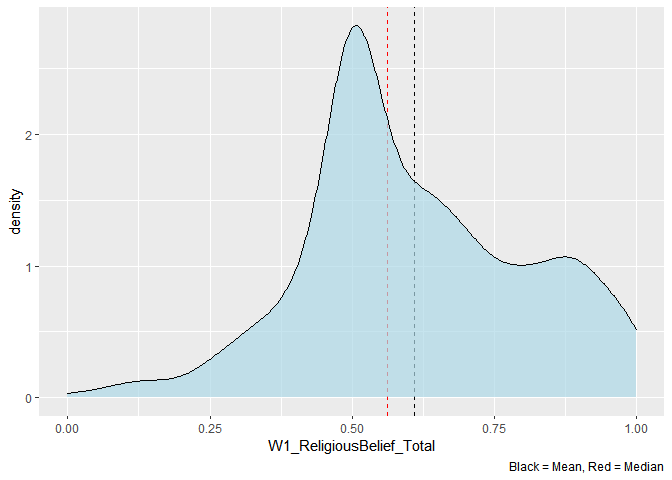<!-- -->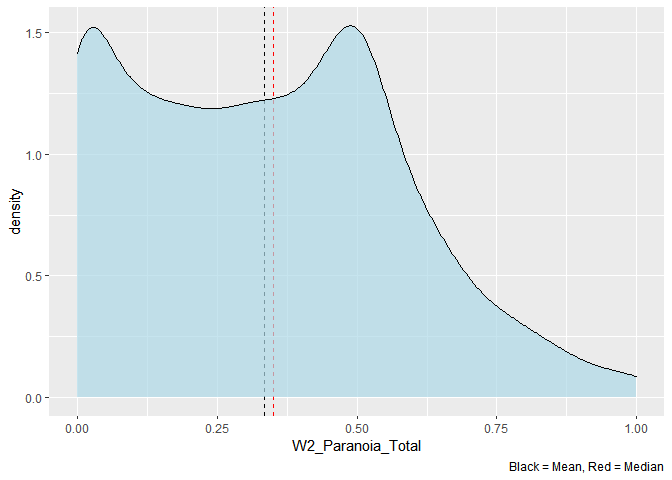<!-- -->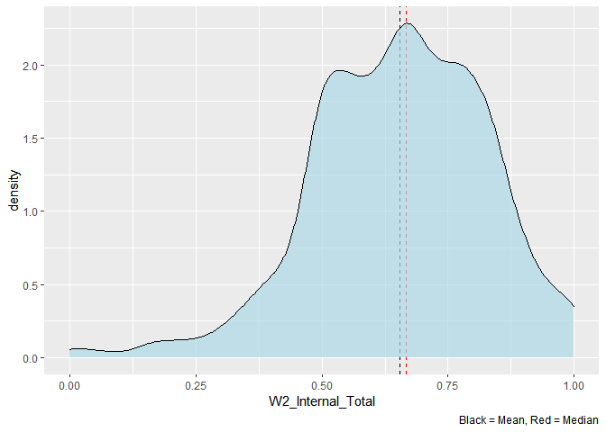<!-- -->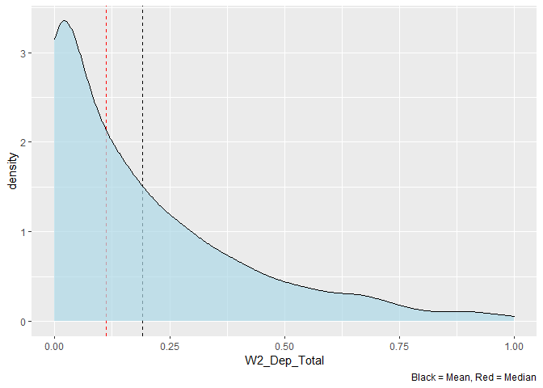<!-- --><!-- --><!-- -->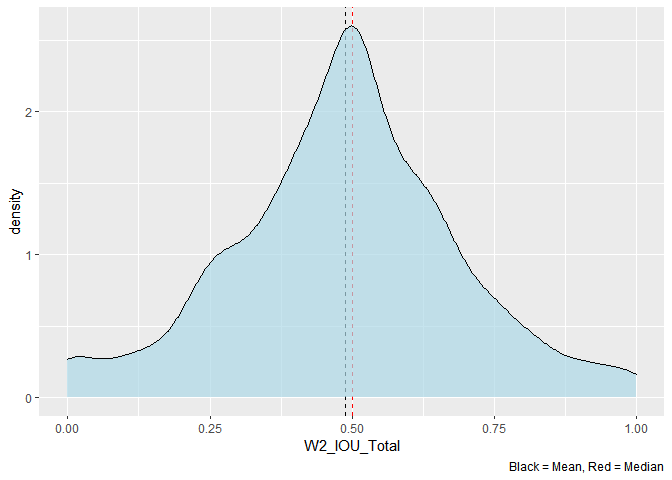<!-- --><!-- --><!-- -->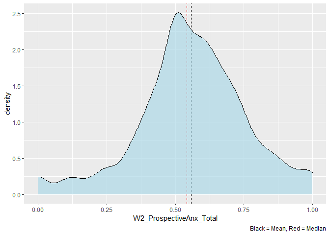<!-- --><!-- -->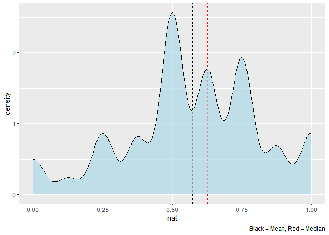<!-- -->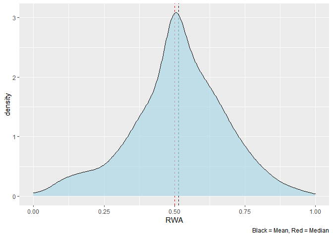<!-- -->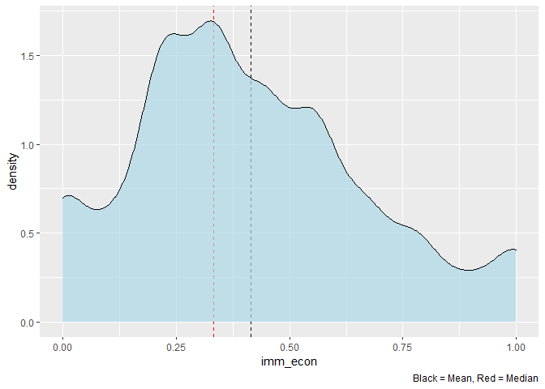<!-- -->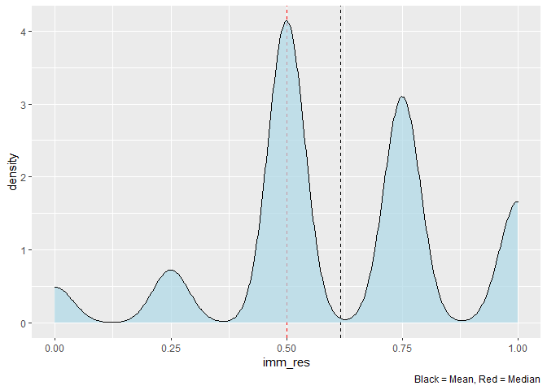<!-- -->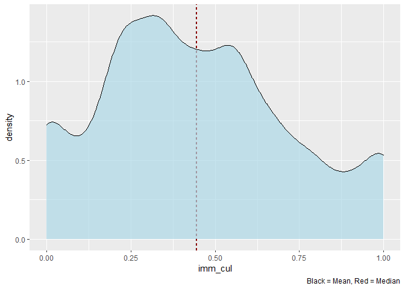<!-- --><!-- --><!-- --><!-- -->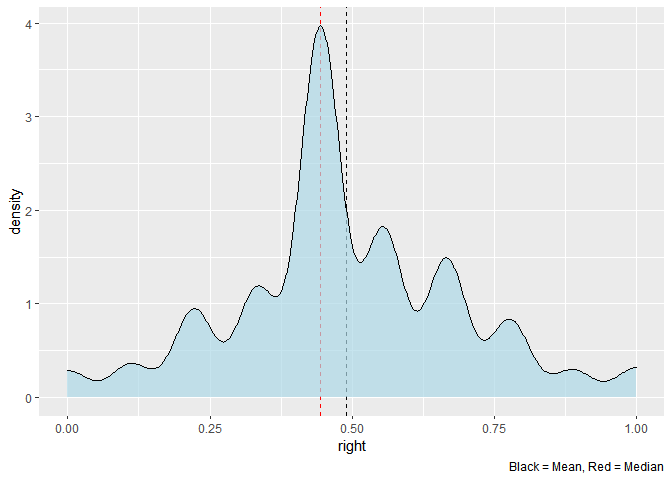<!-- --><!-- -->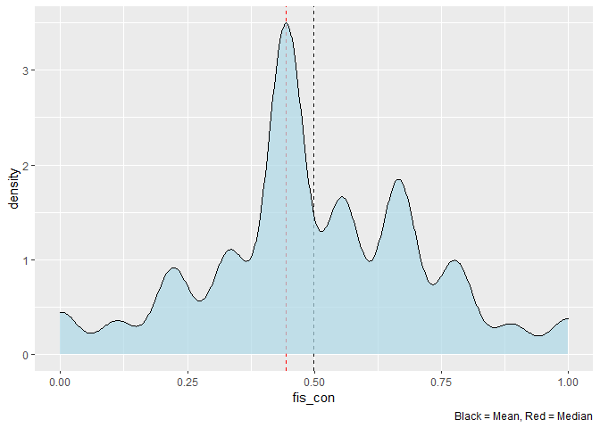<!-- -->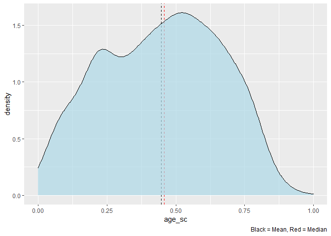<!-- -->

## Vote in 2019 election and conspiracy belief

``` r
conspiracies %>% 
  ggplot(aes(x = fct_reorder(W1_2019_GE_Full, W2_Conspiracy_Theory1),
             y = W2_Conspiracy_Theory1)) +
  geom_boxplot() +
  coord_flip() +
  labs(x = "Vote in 2019 GE",
       y = "Belief in Chinese Lab Origin")
```

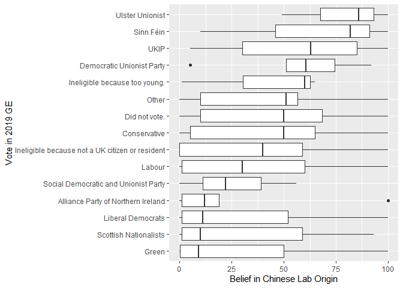<!-- -->

``` r
# filtering down for some of the main parties
parties <- c("UKIP",
             "Did not vote.",
             "Conservative",
             "Labour",
             "Green",
             "Scottish Nationalists",
             "Liberal Democrats")

conspiracies %>% 
  filter(W1_2019_GE_Full %in% parties) %>% 
  ggplot(aes(x = W2_Conspiracy_Theory1,
             y = fct_reorder(W1_2019_GE_Full, W2_Conspiracy_Theory1))) +
  geom_density_ridges(alpha = 0.7,
                      quantile_lines = TRUE,
                      quantiles = 4,
                      scale = 0.9,
                      jittered_points = TRUE,
                      vline_size = 1,
                      point_size = 0.6,
                      point_alpha = 0.6,
                      position = "raincloud") +
  labs(x = "Vote in 2019 GE",
       y = "Belief in Chinese lab origin")
```

    ## Picking joint bandwidth of 12

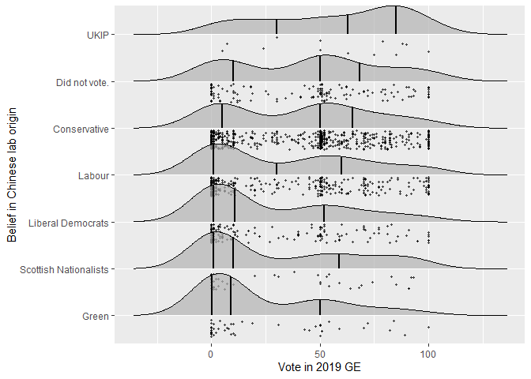<!-- -->

``` r
# interestingly, Conservatives have relatively high belief in Chinese lab conspiracy

conspiracies %>% 
  ggplot(aes(x = fct_reorder(W1_2019_GE_Full, W2_Conspiracy_Theory3),
             y = W2_Conspiracy_Theory3)) +
  geom_boxplot() +
  coord_flip() +
  labs(x = "Vote in 2019 GE",
       y = "Belief in 5G Origin")
```

<!-- -->

``` r
conspiracies %>% 
  filter(W1_2019_GE_Full %in% parties) %>% 
  ggplot(aes(x = W2_Conspiracy_Theory3,
             y = fct_reorder(W1_2019_GE_Full, W2_Conspiracy_Theory3))) +
  geom_density_ridges(alpha = 0.7,
                      quantile_lines = TRUE,
                      quantiles = 4,
                      scale = 0.9,
                      jittered_points = TRUE,
                      vline_size = 1,
                      point_size = 0.6,
                      point_alpha = 0.6,
                      position = "raincloud") +
  labs(x = "Vote in 2019 GE",
       y = "Belief in 5G origin")
```

    ## Picking joint bandwidth of 4.57

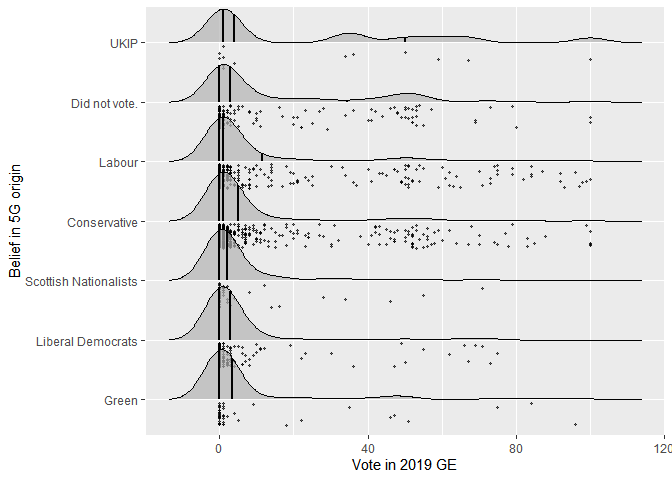<!-- -->

``` r
conspiracies %>% 
  ggplot(aes(x = fct_reorder(W1_2019_GE_Full, W2_Conspiracy_Theory4),
             y = W2_Conspiracy_Theory4)) +
  geom_boxplot() +
  coord_flip() +
  labs(x = "Vote in 2019 GE",
       y = "Belief it is no worse than flu")
```

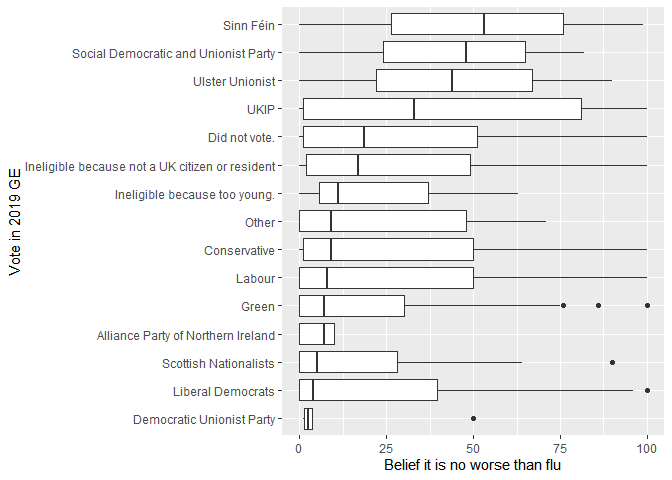<!-- -->

``` r
conspiracies %>% 
  filter(W1_2019_GE_Full %in% parties) %>% 
  ggplot(aes(x = W2_Conspiracy_Theory4,
             y = fct_reorder(W1_2019_GE_Full, W2_Conspiracy_Theory4))) +
  geom_density_ridges(alpha = 0.7,
                      quantile_lines = TRUE,
                      quantiles = 4,
                      scale = 0.9,
                      jittered_points = TRUE,
                      vline_size = 1,
                      point_size = 0.6,
                      point_alpha = 0.6,
                      position = "raincloud") +
  labs(x = "Vote in 2019 GE",
       y = "Belief it is no worse than flu")
```

    ## Picking joint bandwidth of 11

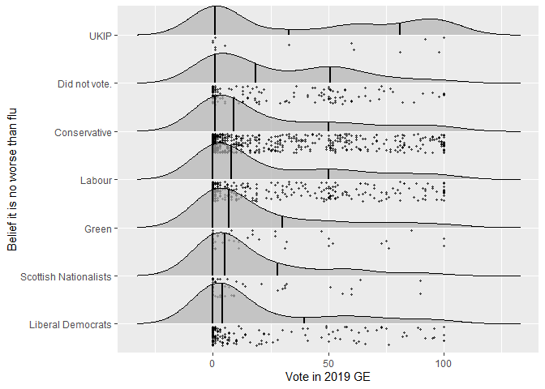<!-- -->

``` r
conspiracies %>% 
  ggplot(aes(x = fct_reorder(W1_2019_GE_Full, W2_Conspiracy_Theory5),
             y = W2_Conspiracy_Theory5)) +
  geom_boxplot() +
  coord_flip() +
  labs(x = "Vote in 2019 GE",
       y = "Belief in Vitamin C treatment")
```

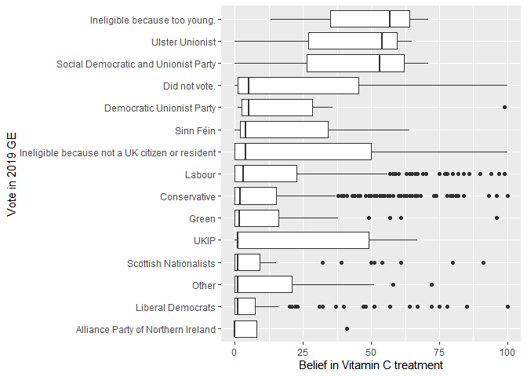<!-- -->

# Modelling for belief in Chinese lab origin

## DV Chinese lab conspiracy - singular IV models

``` r
sdo_lab <- lm(W2_Conspiracy_Theory1 ~ SDO,
              data = conspiracies)

summ(sdo_lab)
```

    ## MODEL INFO:
    ## Observations: 1406
    ## Dependent Variable: W2_Conspiracy_Theory1
    ## Type: OLS linear regression 
    ## 
    ## MODEL FIT:
    ## F(1,1404) = 65.28, p = 0.00
    ## R² = 0.04
    ## Adj. R² = 0.04 
    ## 
    ## Standard errors: OLS
    ## ------------------------------------------------
    ##                      Est.   S.E.   t val.      p
    ## ----------------- ------- ------ -------- ------
    ## (Intercept)         24.11   1.95    12.34   0.00
    ## SDO                 39.08   4.84     8.08   0.00
    ## ------------------------------------------------

``` r
ggplot(conspiracies,aes(x = SDO, y = W2_Conspiracy_Theory1)) +
  geom_boxplot(aes(group = cut_width(SDO,0.1))) +
  geom_smooth(method = "lm")
```

    ## `geom_smooth()` using formula 'y ~ x'

<!-- -->

``` r
par(mfrow = c(2,2))
plot(sdo_lab)
```

<!-- -->

``` r
rwa_lab <- lm(W2_Conspiracy_Theory1 ~ RWA,
              data = conspiracies)

summ(rwa_lab)
```

    ## MODEL INFO:
    ## Observations: 1406
    ## Dependent Variable: W2_Conspiracy_Theory1
    ## Type: OLS linear regression 
    ## 
    ## MODEL FIT:
    ## F(1,1404) = 87.72, p = 0.00
    ## R² = 0.06
    ## Adj. R² = 0.06 
    ## 
    ## Standard errors: OLS
    ## ------------------------------------------------
    ##                      Est.   S.E.   t val.      p
    ## ----------------- ------- ------ -------- ------
    ## (Intercept)         13.88   2.74     5.07   0.00
    ## RWA                 47.40   5.06     9.37   0.00
    ## ------------------------------------------------

``` r
ggplot(conspiracies,aes(x = RWA, y = W2_Conspiracy_Theory1)) +
  geom_boxplot(aes(group = cut_width(RWA,0.1))) +
  geom_smooth(method = "lm")
```

    ## `geom_smooth()` using formula 'y ~ x'

<!-- -->

``` r
par(mfrow = c(2,2))
plot(rwa_lab)
```

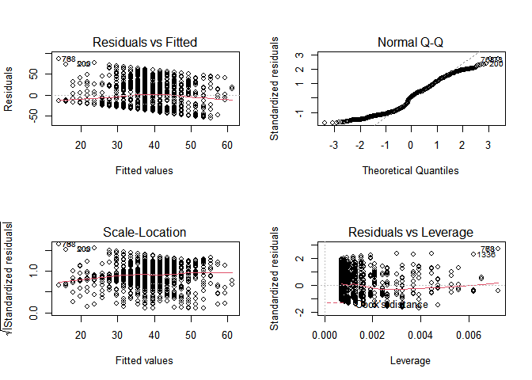<!-- -->

``` r
daily_m_lab <- lm(W2_Conspiracy_Theory1 ~ W2_Newspaper_prefer1,
              data = conspiracies)

summ(daily_m_lab)
```

    ## MODEL INFO:
    ## Observations: 1406
    ## Dependent Variable: W2_Conspiracy_Theory1
    ## Type: OLS linear regression 
    ## 
    ## MODEL FIT:
    ## F(1,1404) = 87.24, p = 0.00
    ## R² = 0.06
    ## Adj. R² = 0.06 
    ## 
    ## Standard errors: OLS
    ## ---------------------------------------------------------
    ##                               Est.   S.E.   t val.      p
    ## -------------------------- ------- ------ -------- ------
    ## (Intercept)                  32.96   1.03    32.02   0.00
    ## W2_Newspaper_prefer1         17.47   1.87     9.34   0.00
    ## ---------------------------------------------------------

``` r
ggplot(conspiracies,aes(x = as.factor(W2_Newspaper_prefer1), 
                        y = W2_Conspiracy_Theory1)) +
  geom_boxplot() +
  labs(x = "Daily Mail Reader")
```

<!-- -->

``` r
par(mfrow = c(2,2))
plot(daily_m_lab)
```

<!-- -->

``` r
social_m_lab <- lm(W2_Conspiracy_Theory1 ~ W2_INFO_5,
              data = conspiracies)

summ(social_m_lab)
```

    ## MODEL INFO:
    ## Observations: 1406
    ## Dependent Variable: W2_Conspiracy_Theory1
    ## Type: OLS linear regression 
    ## 
    ## MODEL FIT:
    ## F(3,1402) = 16.28, p = 0.00
    ## R² = 0.03
    ## Adj. R² = 0.03 
    ## 
    ## Standard errors: OLS
    ## ------------------------------------------------
    ##                      Est.   S.E.   t val.      p
    ## ----------------- ------- ------ -------- ------
    ## (Intercept)         32.46   1.31    24.72   0.00
    ## W2_INFO_52           6.07   2.10     2.89   0.00
    ## W2_INFO_53          15.28   2.32     6.57   0.00
    ## W2_INFO_54          13.03   3.52     3.70   0.00
    ## ------------------------------------------------

``` r
ggplot(conspiracies,aes(x = W2_INFO_5, 
                        y = W2_Conspiracy_Theory1)) +
  geom_boxplot() +
  labs(x = "COVID-19 info from social media")
```

<!-- -->

``` r
par(mfrow = c(2,2))
plot(social_m_lab)
```

<!-- -->

``` r
# plotting RWA and SDO by conspiracy, facetted by social media

conspiracies %>% 
  ggplot(aes(x = SDO, y = W2_Conspiracy_Theory1)) +
  geom_jitter(aes(colour = W2_INFO_5), alpha = 1/3) +
  geom_smooth(method = "lm") +
  facet_wrap(~W2_INFO_5) +
  labs(colour = "COVID-19 info from social media",
       x = "Social Dominance Orientation",
       y = "Belief in Chinese lab origin") +
  theme(legend.position = "top")
```

    ## `geom_smooth()` using formula 'y ~ x'

<!-- -->

``` r
conspiracies %>% 
  ggplot(aes(x = RWA, y = W2_Conspiracy_Theory1)) +
  geom_jitter(aes(colour = W2_INFO_5), alpha = 1/3) +
  geom_smooth(method = "lm") +
  facet_wrap(~W2_INFO_5) +
  labs(colour = "COVID-19 info from social media",
       x = "Right Wing Authoritarianism",
       y = "Belief in Chinese lab origin") +
  theme(legend.position = "top")
```

    ## `geom_smooth()` using formula 'y ~ x'

<!-- -->

## DV Chinese lab conspiracy - socio-economic variables

``` r
se_lab <- lm(W2_Conspiracy_Theory1 ~ W2_Gender_binary +
               W1_Education_binary +
               W1_BornUK +
               W1_Income_2019 +
               age_sc,
              data = conspiracies)

summ(se_lab)
```

    ## MODEL INFO:
    ## Observations: 1403 (3 missing obs. deleted)
    ## Dependent Variable: W2_Conspiracy_Theory1
    ## Type: OLS linear regression 
    ## 
    ## MODEL FIT:
    ## F(8,1394) = 7.48, p = 0.00
    ## R² = 0.04
    ## Adj. R² = 0.04 
    ## 
    ## Standard errors: OLS
    ## ----------------------------------------------------------
    ##                                Est.   S.E.   t val.      p
    ## -------------------------- -------- ------ -------- ------
    ## (Intercept)                   48.82   3.33    14.68   0.00
    ## W2_Gender_binary2              2.79   1.78     1.56   0.12
    ## W1_Education_binary1          -8.23   1.85    -4.45   0.00
    ## W1_BornUK2                     0.36   3.26     0.11   0.91
    ## W1_Income_20192                1.26   2.90     0.43   0.66
    ## W1_Income_20193               -4.24   2.86    -1.48   0.14
    ## W1_Income_20194               -2.09   2.73    -0.76   0.44
    ## W1_Income_20195              -10.11   2.79    -3.62   0.00
    ## age_sc                        -8.21   4.22    -1.95   0.05
    ## ----------------------------------------------------------

``` r
plot_coefs(se_lab)
```

    ## Loading required namespace: broom.mixed

<!-- -->

``` r
par(mfrow = c(2,2))
plot(se_lab)
```

<!-- -->

## DV Chinese lab conspiracy - socio-economic variables + political/media

``` r
se_pol_lab <- lm(W2_Conspiracy_Theory1 ~ W1_Education_binary +
                   W1_Income_2019 +
                   age_sc +
                   right +
                   soc_con +
                   fis_con +
                   nat +
                   W2_Newspaper_prefer1 +
                   W2_Newspaper_prefer5 +
                   W2_Newspaper_prefer6 +
                   W2_Newspaper_prefer9 +
                   W2_INFO_5 +
                   W2_INFO_9,
                 data = conspiracies)

#summary(se_pol_lab)
summ(se_pol_lab, vifs = TRUE)
```

    ## MODEL INFO:
    ## Observations: 1406
    ## Dependent Variable: W2_Conspiracy_Theory1
    ## Type: OLS linear regression 
    ## 
    ## MODEL FIT:
    ## F(20,1385) = 16.24, p = 0.00
    ## R² = 0.19
    ## Adj. R² = 0.18 
    ## 
    ## Standard errors: OLS
    ## ----------------------------------------------------------------
    ##                               Est.   S.E.   t val.      p    VIF
    ## -------------------------- ------- ------ -------- ------ ------
    ## (Intercept)                  19.66   4.06     4.84   0.00       
    ## W1_Education_binary1         -4.48   1.74    -2.58   0.01   1.12
    ## W1_Income_20192              -0.69   2.68    -0.26   0.80   1.19
    ## W1_Income_20193              -6.46   2.65    -2.43   0.02   1.19
    ## W1_Income_20194              -3.46   2.55    -1.35   0.18   1.19
    ## W1_Income_20195              -8.91   2.62    -3.40   0.00   1.19
    ## age_sc                       -2.49   4.25    -0.59   0.56   1.28
    ## right                         5.23   5.57     0.94   0.35   2.00
    ## soc_con                      13.47   3.53     3.81   0.00   1.45
    ## fis_con                      -3.20   5.30    -0.60   0.55   2.10
    ## nat                          14.01   3.65     3.84   0.00   1.28
    ## W2_Newspaper_prefer1         12.15   1.85     6.58   0.00   1.12
    ## W2_Newspaper_prefer5         -4.89   2.28    -2.14   0.03   1.33
    ## W2_Newspaper_prefer6         -4.61   2.85    -1.62   0.11   1.22
    ## W2_Newspaper_prefer9         11.22   2.58     4.34   0.00   1.12
    ## W2_INFO_52                    5.08   2.05     2.47   0.01   1.49
    ## W2_INFO_53                   11.28   2.39     4.72   0.00   1.49
    ## W2_INFO_54                    3.81   3.60     1.06   0.29   1.49
    ## W2_INFO_92                    4.77   2.10     2.27   0.02   1.29
    ## W2_INFO_93                    6.65   2.38     2.79   0.01   1.29
    ## W2_INFO_94                   18.86   4.06     4.65   0.00   1.29
    ## ----------------------------------------------------------------

``` r
plot_coefs(se_pol_lab)
```

    ## Loading required namespace: broom.mixed

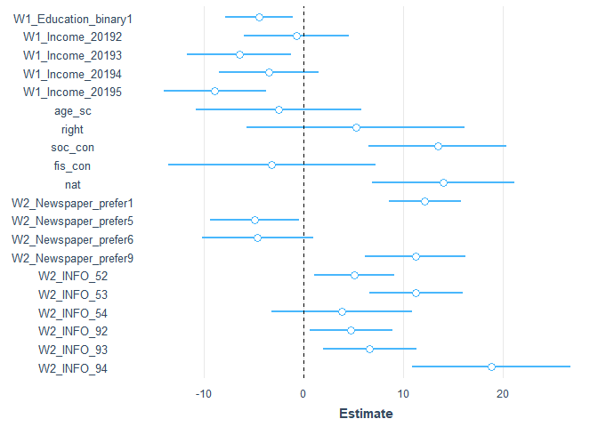<!-- -->

``` r
par(mfrow = c(2,2))
plot(se_pol_lab)
```

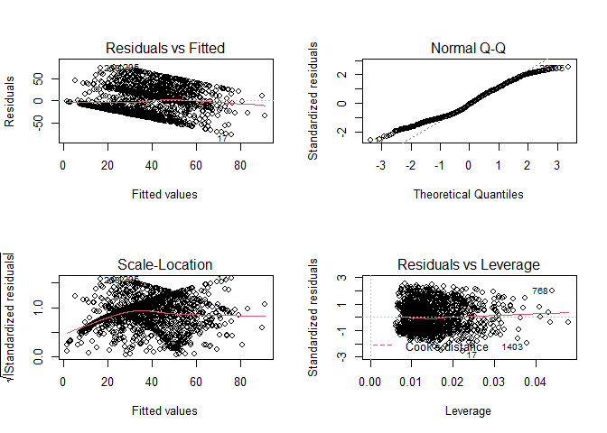<!-- -->

## DV Chinese lab conspiracy - socio-economic variables + political/media + pol-psych

``` r
# right and fis_con now dropped from modelling
# due to VIF >= 2 and non-significant effect
se_polpsych_lab <- lm(W2_Conspiracy_Theory1 ~ W1_Education_binary +
                   W1_Income_2019 +
                   age_sc +
                   #right +
                   soc_con +
                   #fis_con +
                   nat +
                   W2_Newspaper_prefer1 +
                   W2_Newspaper_prefer5 +
                   W2_Newspaper_prefer6 +
                   W2_Newspaper_prefer9 +
                   W2_INFO_5 +
                   W2_INFO_9 +
                   SDO +
                   RWA +
                   W2_DAI_Total +
                   W2_IOU_Total,
                 data = conspiracies)

#summary(se_polpsych_lab)
summ(se_polpsych_lab, vifs = TRUE)
```

    ## MODEL INFO:
    ## Observations: 1406
    ## Dependent Variable: W2_Conspiracy_Theory1
    ## Type: OLS linear regression 
    ## 
    ## MODEL FIT:
    ## F(22,1383) = 18.06, p = 0.00
    ## R² = 0.22
    ## Adj. R² = 0.21 
    ## 
    ## Standard errors: OLS
    ## ----------------------------------------------------------------
    ##                               Est.   S.E.   t val.      p    VIF
    ## -------------------------- ------- ------ -------- ------ ------
    ## (Intercept)                   5.99   4.89     1.23   0.22       
    ## W1_Education_binary1         -3.65   1.71    -2.13   0.03   1.13
    ## W1_Income_20192              -1.47   2.62    -0.56   0.57   1.18
    ## W1_Income_20193              -7.84   2.60    -3.01   0.00   1.18
    ## W1_Income_20194              -3.90   2.48    -1.57   0.12   1.18
    ## W1_Income_20195              -8.99   2.55    -3.53   0.00   1.18
    ## age_sc                        0.23   4.28     0.05   0.96   1.35
    ## soc_con                       4.89   3.40     1.44   0.15   1.40
    ## nat                           9.03   3.53     2.55   0.01   1.25
    ## W2_Newspaper_prefer1         10.66   1.81     5.89   0.00   1.12
    ## W2_Newspaper_prefer5         -1.93   2.28    -0.84   0.40   1.38
    ## W2_Newspaper_prefer6         -3.52   2.80    -1.26   0.21   1.23
    ## W2_Newspaper_prefer9          9.76   2.54     3.85   0.00   1.12
    ## W2_INFO_52                    4.45   2.02     2.21   0.03   1.52
    ## W2_INFO_53                    9.62   2.36     4.08   0.00   1.52
    ## W2_INFO_54                    2.33   3.55     0.65   0.51   1.52
    ## W2_INFO_92                    4.18   2.06     2.03   0.04   1.32
    ## W2_INFO_93                    6.34   2.35     2.70   0.01   1.32
    ## W2_INFO_94                   19.51   3.99     4.89   0.00   1.32
    ## SDO                          13.98   5.18     2.70   0.01   1.39
    ## RWA                          21.05   5.65     3.73   0.00   1.49
    ## W2_DAI_Total                 23.81   4.27     5.58   0.00   1.43
    ## W2_IOU_Total                 -8.67   4.69    -1.85   0.06   1.39
    ## ----------------------------------------------------------------

``` r
plot_coefs(se_polpsych_lab)
```

    ## Loading required namespace: broom.mixed

<!-- -->

``` r
par(mfrow = c(2,2))
plot(se_polpsych_lab)
```

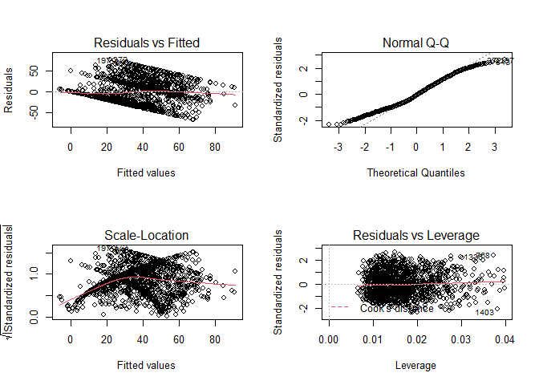<!-- -->

``` r
# looking for potential multicollinearity with DAI
cor_mat <- model.matrix(se_polpsych_lab) %>% as.data.frame()

cor_vec <- rep(NA,ncol(cor_mat))
for(i in seq_along(cor_mat)){
  cor_vec[i] <- cor(cor_mat$W2_DAI_Total,cor_mat[,i])
}
```

    ## Warning in cor(cor_mat$W2_DAI_Total, cor_mat[, i]): the standard deviation is
    ## zero

``` r
tibble(cor_vec,
       names(cor_mat)) %>% 
  arrange(desc(cor_vec)) # IOU moderately positively correlated
```

    ## # A tibble: 23 x 2
    ##    cor_vec `names(cor_mat)`    
    ##      <dbl> <chr>               
    ##  1  1      W2_DAI_Total        
    ##  2  0.486  W2_IOU_Total        
    ##  3  0.163  SDO                 
    ##  4  0.156  W2_INFO_53          
    ##  5  0.153  soc_con             
    ##  6  0.149  W2_Newspaper_prefer9
    ##  7  0.141  W2_INFO_54          
    ##  8  0.112  W1_Income_20192     
    ##  9  0.110  nat                 
    ## 10  0.0991 RWA                 
    ## # ... with 13 more rows

``` r
# looking for multicollinearity with soc_con
cor_vec2 <- rep(NA,ncol(cor_mat))
for(i in seq_along(cor_mat)){
  cor_vec2[i] <- cor(cor_mat$soc_con,cor_mat[,i])
}
```

    ## Warning in cor(cor_mat$soc_con, cor_mat[, i]): the standard deviation is zero

``` r
tibble(cor_vec2,
       names(cor_mat)) %>% 
  arrange(desc(cor_vec2)) # RWA moderately correlated with soc_con
```

    ## # A tibble: 23 x 2
    ##    cor_vec2 `names(cor_mat)`    
    ##       <dbl> <chr>               
    ##  1   1.00   soc_con             
    ##  2   0.450  RWA                 
    ##  3   0.382  SDO                 
    ##  4   0.262  nat                 
    ##  5   0.184  W2_Newspaper_prefer1
    ##  6   0.153  W2_DAI_Total        
    ##  7   0.0665 W2_Newspaper_prefer9
    ##  8   0.0612 W2_IOU_Total        
    ##  9   0.0565 age_sc              
    ## 10   0.0550 W2_INFO_94          
    ## # ... with 13 more rows

## DV Chinese lab belief - model above minus soc\_con and IOU

``` r
se_polpsych_lab_2 <- lm(W2_Conspiracy_Theory1 ~ W1_Education_binary +
                   W1_Income_2019 +
                   age_sc +
                   #right +
                   #soc_con +
                   #fis_con +
                   nat +
                   W2_Newspaper_prefer1 +
                   W2_Newspaper_prefer5 +
                   W2_Newspaper_prefer6 +
                   W2_Newspaper_prefer9 +
                   W2_INFO_5 +
                   W2_INFO_9 +
                   SDO +
                   RWA +
                   #W2_IOU_Total +
                   W2_DAI_Total,
                 data = conspiracies)

#summary(se_polpsych_lab_2)
summ(se_polpsych_lab_2, vifs = TRUE)
```

    ## MODEL INFO:
    ## Observations: 1406
    ## Dependent Variable: W2_Conspiracy_Theory1
    ## Type: OLS linear regression 
    ## 
    ## MODEL FIT:
    ## F(20,1385) = 19.54, p = 0.00
    ## R² = 0.22
    ## Adj. R² = 0.21 
    ## 
    ## Standard errors: OLS
    ## ----------------------------------------------------------------
    ##                               Est.   S.E.   t val.      p    VIF
    ## -------------------------- ------- ------ -------- ------ ------
    ## (Intercept)                   2.19   4.55     0.48   0.63       
    ## W1_Education_binary1         -3.69   1.71    -2.16   0.03   1.12
    ## W1_Income_20192              -1.12   2.62    -0.43   0.67   1.17
    ## W1_Income_20193              -7.47   2.60    -2.88   0.00   1.17
    ## W1_Income_20194              -3.66   2.49    -1.47   0.14   1.17
    ## W1_Income_20195              -8.62   2.54    -3.40   0.00   1.17
    ## age_sc                        1.37   4.25     0.32   0.75   1.33
    ## nat                           9.17   3.53     2.60   0.01   1.24
    ## W2_Newspaper_prefer1         10.79   1.81     5.97   0.00   1.11
    ## W2_Newspaper_prefer5         -2.16   2.28    -0.95   0.34   1.38
    ## W2_Newspaper_prefer6         -3.59   2.80    -1.28   0.20   1.22
    ## W2_Newspaper_prefer9          9.96   2.54     3.93   0.00   1.12
    ## W2_INFO_52                    4.10   2.01     2.04   0.04   1.50
    ## W2_INFO_53                    9.29   2.36     3.94   0.00   1.50
    ## W2_INFO_54                    1.71   3.55     0.48   0.63   1.50
    ## W2_INFO_92                    4.04   2.06     1.96   0.05   1.31
    ## W2_INFO_93                    6.30   2.35     2.68   0.01   1.31
    ## W2_INFO_94                   19.39   3.99     4.86   0.00   1.31
    ## SDO                          16.05   5.05     3.18   0.00   1.32
    ## RWA                          23.26   5.38     4.32   0.00   1.35
    ## W2_DAI_Total                 20.88   3.86     5.42   0.00   1.17
    ## ----------------------------------------------------------------

``` r
plot_coefs(se_polpsych_lab_2)
```

    ## Loading required namespace: broom.mixed

<!-- -->

``` r
par(mfrow = c(2,2))
plot(se_polpsych_lab_2)
```

<!-- -->

## DV Chinese lab conspiracy - socio-economic variables + political/media + pol-psych + covid-threat and CRT

``` r
multi_lab <- lm(W2_Conspiracy_Theory1 ~ W1_Education_binary +
                  W1_Income_2019 +
                  age_sc +
                  #right +
                  soc_con +
                  #fis_con +
                  nat +
                  W2_Newspaper_prefer1 +
                  W2_Newspaper_prefer5 +
                  W2_Newspaper_prefer6 +
                  W2_Newspaper_prefer9 +
                  W2_INFO_5 +
                  W2_INFO_9 +
                  SDO +
                  RWA +
                  W2_DAI_Total +
                  W2_IOU_Total +
                  threat +
                  CRT1 +
                  CRT2 +
                  CRT3 +
                  CRT4 +
                  CRT5,
                 data = conspiracies)

#summary(multi_lab)
summ(multi_lab, vifs = TRUE)
```

    ## MODEL INFO:
    ## Observations: 1406
    ## Dependent Variable: W2_Conspiracy_Theory1
    ## Type: OLS linear regression 
    ## 
    ## MODEL FIT:
    ## F(28,1377) = 16.00, p = 0.00
    ## R² = 0.25
    ## Adj. R² = 0.23 
    ## 
    ## Standard errors: OLS
    ## ----------------------------------------------------------------
    ##                               Est.   S.E.   t val.      p    VIF
    ## -------------------------- ------- ------ -------- ------ ------
    ## (Intercept)                  -1.12   5.08    -0.22   0.83       
    ## W1_Education_binary1         -3.33   1.69    -1.96   0.05   1.13
    ## W1_Income_20192              -1.03   2.60    -0.40   0.69   1.24
    ## W1_Income_20193              -6.97   2.58    -2.70   0.01   1.24
    ## W1_Income_20194              -2.29   2.48    -0.92   0.36   1.24
    ## W1_Income_20195              -6.99   2.55    -2.75   0.01   1.24
    ## age_sc                       -1.54   4.35    -0.35   0.72   1.43
    ## soc_con                       5.00   3.36     1.49   0.14   1.41
    ## nat                           9.16   3.50     2.62   0.01   1.26
    ## W2_Newspaper_prefer1         10.15   1.79     5.66   0.00   1.13
    ## W2_Newspaper_prefer5         -1.51   2.27    -0.66   0.51   1.40
    ## W2_Newspaper_prefer6         -3.55   2.77    -1.28   0.20   1.23
    ## W2_Newspaper_prefer9          8.35   2.52     3.32   0.00   1.13
    ## W2_INFO_52                    3.52   2.00     1.76   0.08   1.56
    ## W2_INFO_53                    8.18   2.34     3.49   0.00   1.56
    ## W2_INFO_54                    0.63   3.54     0.18   0.86   1.56
    ## W2_INFO_92                    3.95   2.04     1.93   0.05   1.37
    ## W2_INFO_93                    5.28   2.34     2.26   0.02   1.37
    ## W2_INFO_94                   16.38   3.99     4.10   0.00   1.37
    ## SDO                          16.03   5.18     3.10   0.00   1.42
    ## RWA                          15.71   5.66     2.78   0.01   1.53
    ## W2_DAI_Total                 17.56   4.37     4.02   0.00   1.54
    ## W2_IOU_Total                 -8.29   4.70    -1.77   0.08   1.43
    ## threat                        8.06   3.32     2.43   0.02   1.21
    ## CRT1                          0.62   2.23     0.28   0.78   1.38
    ## CRT2                          3.21   1.92     1.68   0.09   1.45
    ## CRT3                          4.85   2.06     2.35   0.02   1.58
    ## CRT4                         -1.13   1.80    -0.63   0.53   1.30
    ## CRT5                          5.25   1.84     2.86   0.00   1.37
    ## ----------------------------------------------------------------

``` r
plot_coefs(multi_lab)
```

    ## Loading required namespace: broom.mixed

<!-- -->

``` r
par(mfrow = c(2,2))
plot(multi_lab)
```

<!-- -->

## DV Chinese lab belief - model above minus soc\_con and IOU

``` r
multi_lab_2 <- lm(W2_Conspiracy_Theory1 ~ W1_Education_binary +
                  W1_Income_2019 +
                  age_sc +
                  #right +
                  #soc_con +
                  #fis_con +
                  nat +
                  W2_Newspaper_prefer1 +
                  W2_Newspaper_prefer5 +
                  W2_Newspaper_prefer6 +
                  W2_Newspaper_prefer9 +
                  W2_INFO_5 +
                  W2_INFO_9 +
                  SDO +
                  RWA +
                  W2_DAI_Total +
                  #W2_IOU_Total +
                  threat +
                  CRT1 +
                  CRT2 +
                  CRT3 +
                  CRT4 +
                  CRT5,
                 data = conspiracies)

#summary(multi_lab_2)
summ(multi_lab_2, vifs = TRUE)
```

    ## MODEL INFO:
    ## Observations: 1406
    ## Dependent Variable: W2_Conspiracy_Theory1
    ## Type: OLS linear regression 
    ## 
    ## MODEL FIT:
    ## F(26,1379) = 16.99, p = 0.00
    ## R² = 0.24
    ## Adj. R² = 0.23 
    ## 
    ## Standard errors: OLS
    ## ----------------------------------------------------------------
    ##                               Est.   S.E.   t val.      p    VIF
    ## -------------------------- ------- ------ -------- ------ ------
    ## (Intercept)                  -4.60   4.79    -0.96   0.34       
    ## W1_Education_binary1         -3.33   1.69    -1.97   0.05   1.13
    ## W1_Income_20192              -0.66   2.59    -0.26   0.80   1.22
    ## W1_Income_20193              -6.56   2.57    -2.55   0.01   1.22
    ## W1_Income_20194              -1.98   2.48    -0.80   0.43   1.22
    ## W1_Income_20195              -6.57   2.53    -2.60   0.01   1.22
    ## age_sc                       -0.31   4.31    -0.07   0.94   1.40
    ## nat                           9.35   3.50     2.67   0.01   1.25
    ## W2_Newspaper_prefer1         10.27   1.79     5.74   0.00   1.12
    ## W2_Newspaper_prefer5         -1.68   2.27    -0.74   0.46   1.40
    ## W2_Newspaper_prefer6         -3.61   2.77    -1.31   0.19   1.23
    ## W2_Newspaper_prefer9          8.53   2.52     3.39   0.00   1.13
    ## W2_INFO_52                    3.13   2.00     1.57   0.12   1.54
    ## W2_INFO_53                    7.85   2.34     3.35   0.00   1.54
    ## W2_INFO_54                    0.03   3.53     0.01   0.99   1.54
    ## W2_INFO_92                    3.86   2.05     1.88   0.06   1.36
    ## W2_INFO_93                    5.27   2.34     2.25   0.02   1.36
    ## W2_INFO_94                   16.37   3.99     4.10   0.00   1.36
    ## SDO                          17.91   5.06     3.54   0.00   1.35
    ## RWA                          18.04   5.41     3.34   0.00   1.39
    ## W2_DAI_Total                 15.03   4.01     3.75   0.00   1.29
    ## threat                        7.06   3.29     2.15   0.03   1.18
    ## CRT1                          0.66   2.23     0.29   0.77   1.38
    ## CRT2                          3.21   1.92     1.67   0.09   1.45
    ## CRT3                          4.99   2.06     2.42   0.02   1.58
    ## CRT4                         -1.06   1.80    -0.59   0.56   1.30
    ## CRT5                          5.41   1.84     2.95   0.00   1.36
    ## ----------------------------------------------------------------

``` r
plot_coefs(multi_lab_2)
```

    ## Loading required namespace: broom.mixed

<!-- -->

``` r
par(mfrow = c(2,2))
plot(multi_lab_2)
```

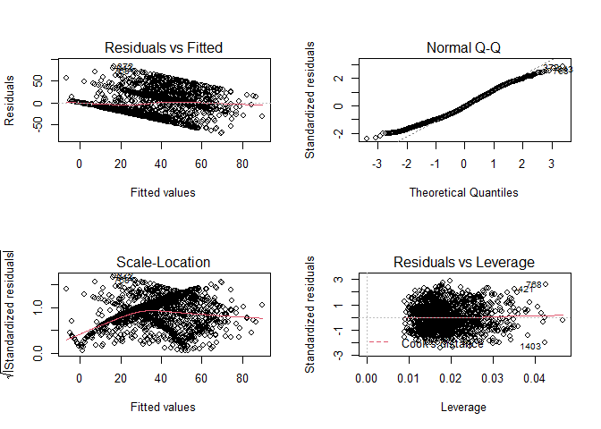<!-- -->

## DV Chinese lab belief - interaction RWA \* INFO\_9, minus soc\_con and IOU and conspiracy controls

``` r
int_lab <- lm(W2_Conspiracy_Theory1 ~ W1_Education_binary +
                  W1_Income_2019 +
                  age_sc +
                  #right +
                  #soc_con +
                  #fis_con +
                  nat +
                  W2_Newspaper_prefer1 +
                  W2_Newspaper_prefer5 +
                  W2_Newspaper_prefer6 +
                  W2_Newspaper_prefer9 +
                  W2_INFO_5 +
                  W2_INFO_9:RWA +
                  SDO +
                  #RWA +
                  W2_DAI_Total +
                  #W2_IOU_Total +
                  threat +
                  CRT1 +
                  CRT2 +
                  CRT3 +
                  CRT4 +
                  CRT5,
                 data = conspiracies)

#summary(int_lab)
summ(int_lab, vifs = TRUE)
```

    ## MODEL INFO:
    ## Observations: 1406
    ## Dependent Variable: W2_Conspiracy_Theory1
    ## Type: OLS linear regression 
    ## 
    ## MODEL FIT:
    ## F(26,1379) = 16.95, p = 0.00
    ## R² = 0.24
    ## Adj. R² = 0.23 
    ## 
    ## Standard errors: OLS
    ## ----------------------------------------------------------------
    ##                               Est.   S.E.   t val.      p    VIF
    ## -------------------------- ------- ------ -------- ------ ------
    ## (Intercept)                  -0.82   4.69    -0.17   0.86       
    ## W1_Education_binary1         -3.35   1.69    -1.98   0.05   1.13
    ## W1_Income_20192              -0.69   2.59    -0.27   0.79   1.22
    ## W1_Income_20193              -6.55   2.57    -2.55   0.01   1.22
    ## W1_Income_20194              -1.90   2.48    -0.77   0.44   1.22
    ## W1_Income_20195              -6.70   2.54    -2.64   0.01   1.22
    ## age_sc                       -0.61   4.31    -0.14   0.89   1.40
    ## nat                           9.51   3.50     2.72   0.01   1.25
    ## W2_Newspaper_prefer1         10.30   1.79     5.75   0.00   1.12
    ## W2_Newspaper_prefer5         -1.62   2.27    -0.71   0.48   1.40
    ## W2_Newspaper_prefer6         -3.56   2.77    -1.29   0.20   1.23
    ## W2_Newspaper_prefer9          8.60   2.52     3.41   0.00   1.13
    ## W2_INFO_52                    3.16   1.99     1.59   0.11   1.52
    ## W2_INFO_53                    7.95   2.33     3.41   0.00   1.52
    ## W2_INFO_54                    0.15   3.53     0.04   0.97   1.52
    ## SDO                          17.89   5.06     3.53   0.00   1.36
    ## W2_DAI_Total                 15.09   4.01     3.76   0.00   1.29
    ## threat                        6.96   3.29     2.11   0.03   1.19
    ## CRT1                          0.47   2.23     0.21   0.83   1.38
    ## CRT2                          3.21   1.92     1.67   0.09   1.45
    ## CRT3                          5.07   2.06     2.46   0.01   1.58
    ## CRT4                         -0.86   1.80    -0.48   0.63   1.29
    ## CRT5                          5.47   1.84     2.98   0.00   1.36
    ## W2_INFO_91:RWA               10.75   6.00     1.79   0.07   1.85
    ## W2_INFO_92:RWA               18.70   5.65     3.31   0.00   1.85
    ## W2_INFO_93:RWA               20.51   5.96     3.44   0.00   1.85
    ## W2_INFO_94:RWA               39.76   8.44     4.71   0.00   1.85
    ## ----------------------------------------------------------------

``` r
plot_coefs(int_lab)
```

    ## Loading required namespace: broom.mixed

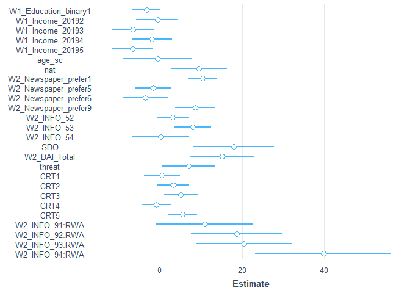<!-- -->

``` r
par(mfrow = c(2,2))
plot(int_lab)
```

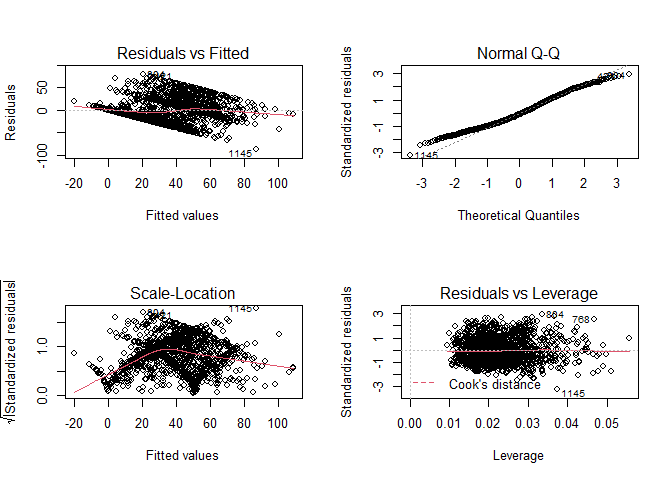<!-- -->

## DV Chinese lab conspiracy - socio-economic variables + political/media + pol-psych + covid-threat and CRT + conspiracies

``` r
full_lab <- lm(W2_Conspiracy_Theory1 ~ W1_Education_binary +
                  W1_Income_2019 +
                  age_sc +
                  #right +
                  #soc_con +
                  #fis_con +
                  nat +
                  W2_Newspaper_prefer1 +
                  W2_Newspaper_prefer5 +
                  W2_Newspaper_prefer6 +
                  W2_Newspaper_prefer9 +
                  W2_INFO_5 +
                  W2_INFO_9:RWA +
                  SDO +
                  #RWA +
                  W2_DAI_Total +
                  #W2_IOU_Total +
                  threat +
                  CRT1 +
                  CRT2 +
                  CRT3 +
                  CRT4 +
                  CRT5 +
                  W1_Conspiracy_Total +
                  conspiracy2_sc +
                  conspiracy3_sc +
                  conspiracy4_sc +
                  conspiracy5_sc,
                 data = conspiracies)

#summary(full_lab)
summ(full_lab, vifs = TRUE)
```

    ## MODEL INFO:
    ## Observations: 1406
    ## Dependent Variable: W2_Conspiracy_Theory1
    ## Type: OLS linear regression 
    ## 
    ## MODEL FIT:
    ## F(31,1374) = 20.76, p = 0.00
    ## R² = 0.32
    ## Adj. R² = 0.30 
    ## 
    ## Standard errors: OLS
    ## -----------------------------------------------------------------
    ##                                Est.   S.E.   t val.      p    VIF
    ## -------------------------- -------- ------ -------- ------ ------
    ## (Intercept)                  -10.04   5.10    -1.97   0.05       
    ## W1_Education_binary1          -3.50   1.61    -2.18   0.03   1.13
    ## W1_Income_20192                0.87   2.47     0.35   0.73   1.25
    ## W1_Income_20193               -6.19   2.45    -2.53   0.01   1.25
    ## W1_Income_20194                0.00   2.36     0.00   1.00   1.25
    ## W1_Income_20195               -4.30   2.42    -1.78   0.08   1.25
    ## age_sc                         4.29   4.12     1.04   0.30   1.42
    ## nat                           11.07   3.36     3.29   0.00   1.28
    ## W2_Newspaper_prefer1           9.29   1.71     5.43   0.00   1.13
    ## W2_Newspaper_prefer5          -0.31   2.16    -0.15   0.88   1.40
    ## W2_Newspaper_prefer6          -4.84   2.64    -1.84   0.07   1.24
    ## W2_Newspaper_prefer9           7.31   2.40     3.04   0.00   1.14
    ## W2_INFO_52                     3.09   1.90     1.63   0.10   1.56
    ## W2_INFO_53                     5.39   2.23     2.42   0.02   1.56
    ## W2_INFO_54                    -1.78   3.36    -0.53   0.60   1.56
    ## SDO                           11.55   4.96     2.33   0.02   1.44
    ## W2_DAI_Total                   8.60   3.90     2.21   0.03   1.36
    ## threat                        10.16   3.17     3.20   0.00   1.22
    ## CRT1                          -0.78   2.13    -0.37   0.71   1.39
    ## CRT2                           2.39   1.82     1.31   0.19   1.45
    ## CRT3                           4.12   1.96     2.10   0.04   1.59
    ## CRT4                          -0.75   1.71    -0.44   0.66   1.30
    ## CRT5                           2.47   1.77     1.40   0.16   1.40
    ## W1_Conspiracy_Total           26.35   3.90     6.76   0.00   1.09
    ## conspiracy2_sc               -13.40   2.66    -5.04   0.00   1.06
    ## conspiracy3_sc                18.59   4.88     3.81   0.00   2.09
    ## conspiracy4_sc                10.40   2.77     3.75   0.00   1.34
    ## conspiracy5_sc                 6.12   4.51     1.36   0.18   2.07
    ## W2_INFO_91:RWA                10.51   5.77     1.82   0.07   1.94
    ## W2_INFO_92:RWA                20.04   5.41     3.70   0.00   1.94
    ## W2_INFO_93:RWA                19.33   5.71     3.39   0.00   1.94
    ## W2_INFO_94:RWA                33.74   8.05     4.19   0.00   1.94
    ## -----------------------------------------------------------------

``` r
plot_coefs(full_lab)
```

    ## Loading required namespace: broom.mixed

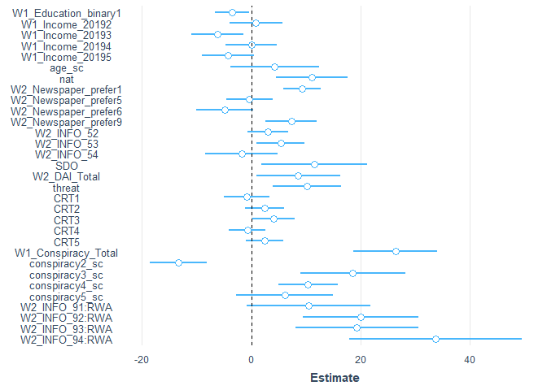<!-- -->

``` r
par(mfrow = c(2,2))
plot(full_lab)
```

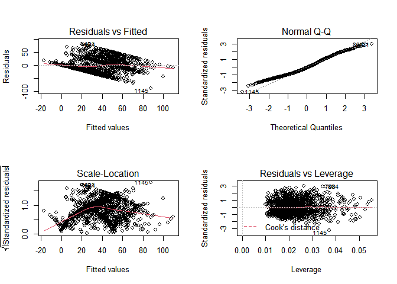<!-- -->

# Modelling for belief in 5G origin conspiracy

## Plots of DV, incl. log+1 transformation

``` r
conspiracies %>% 
  ggplot(aes(x = W2_Conspiracy_Theory3)) +
  geom_histogram(colour = "darkgrey", fill = "lightblue")
```

    ## `stat_bin()` using `bins = 30`. Pick better value with `binwidth`.

<!-- -->

## DV 5G conspiracy - singular IV models

``` r
sdo_5g <- lm(W2_Conspiracy_Theory3 ~ SDO,
              data = conspiracies)

summ(sdo_5g)
```

    ## MODEL INFO:
    ## Observations: 1406
    ## Dependent Variable: W2_Conspiracy_Theory3
    ## Type: OLS linear regression 
    ## 
    ## MODEL FIT:
    ## F(1,1404) = 82.37, p = 0.00
    ## R² = 0.06
    ## Adj. R² = 0.05 
    ## 
    ## Standard errors: OLS
    ## ------------------------------------------------
    ##                      Est.   S.E.   t val.      p
    ## ----------------- ------- ------ -------- ------
    ## (Intercept)          0.72   1.28     0.57   0.57
    ## SDO                 28.79   3.17     9.08   0.00
    ## ------------------------------------------------

``` r
ggplot(conspiracies,aes(x = SDO, 
                        y = W2_Conspiracy_Theory3)) +
  geom_boxplot(aes(group = cut_width(SDO,0.1))) +
  geom_smooth(method = "lm")
```

    ## `geom_smooth()` using formula 'y ~ x'

<!-- -->

``` r
par(mfrow = c(2,2))
plot(sdo_5g)
```

<!-- -->

``` r
rwa_5g <- lm(W2_Conspiracy_Theory3 ~ RWA,
              data = conspiracies)

summ(rwa_5g)
```

    ## MODEL INFO:
    ## Observations: 1406
    ## Dependent Variable: W2_Conspiracy_Theory3
    ## Type: OLS linear regression 
    ## 
    ## MODEL FIT:
    ## F(1,1404) = 2.80, p = 0.09
    ## R² = 0.00
    ## Adj. R² = 0.00 
    ## 
    ## Standard errors: OLS
    ## -----------------------------------------------
    ##                     Est.   S.E.   t val.      p
    ## ----------------- ------ ------ -------- ------
    ## (Intercept)         8.19   1.86     4.40   0.00
    ## RWA                 5.75   3.44     1.67   0.09
    ## -----------------------------------------------

``` r
ggplot(conspiracies,aes(x = RWA, y = W2_Conspiracy_Theory3)) +
  geom_boxplot(aes(group = cut_width(RWA,0.1))) +
  geom_smooth(method = "lm")
```

    ## `geom_smooth()` using formula 'y ~ x'

<!-- -->

``` r
par(mfrow = c(2,2))
plot(rwa_5g)
```

<!-- -->

``` r
daily_m_5g <- lm(W2_Conspiracy_Theory3 ~ 
                   W2_Newspaper_prefer1,
              data = conspiracies)

summ(daily_m_5g)
```

    ## MODEL INFO:
    ## Observations: 1406
    ## Dependent Variable: W2_Conspiracy_Theory3
    ## Type: OLS linear regression 
    ## 
    ## MODEL FIT:
    ## F(1,1404) = 11.96, p = 0.00
    ## R² = 0.01
    ## Adj. R² = 0.01 
    ## 
    ## Standard errors: OLS
    ## --------------------------------------------------------
    ##                              Est.   S.E.   t val.      p
    ## -------------------------- ------ ------ -------- ------
    ## (Intercept)                  9.82   0.70    14.09   0.00
    ## W2_Newspaper_prefer1         4.38   1.27     3.46   0.00
    ## --------------------------------------------------------

``` r
ggplot(conspiracies,aes(x = as.factor(W2_Newspaper_prefer1), 
                        y = W2_Conspiracy_Theory3)) +
  geom_boxplot() +
  labs(x = "Daily Mail Reader")
```

<!-- -->

``` r
par(mfrow = c(2,2))
plot(daily_m_5g)
```

<!-- -->

``` r
social_m_5g <- lm(W2_Conspiracy_Theory3 ~ W2_INFO_5,
              data = conspiracies)

summ(social_m_5g)
```

    ## MODEL INFO:
    ## Observations: 1406
    ## Dependent Variable: W2_Conspiracy_Theory3
    ## Type: OLS linear regression 
    ## 
    ## MODEL FIT:
    ## F(3,1402) = 31.55, p = 0.00
    ## R² = 0.06
    ## Adj. R² = 0.06 
    ## 
    ## Standard errors: OLS
    ## ------------------------------------------------
    ##                      Est.   S.E.   t val.      p
    ## ----------------- ------- ------ -------- ------
    ## (Intercept)          6.11   0.85     7.16   0.00
    ## W2_INFO_52           4.77   1.36     3.49   0.00
    ## W2_INFO_53          13.03   1.51     8.63   0.00
    ## W2_INFO_54          14.15   2.29     6.19   0.00
    ## ------------------------------------------------

``` r
ggplot(conspiracies,aes(x = W2_INFO_5, 
                        y = W2_Conspiracy_Theory3)) +
  geom_boxplot() +
  labs(x = "COVID-19 info from social media")
```

<!-- -->

``` r
par(mfrow = c(2,2))
plot(social_m_5g)
```

<!-- -->

``` r
# plotting RWA and SDO by conspiracy, facetted by social media

conspiracies %>% 
  ggplot(aes(x = SDO, y = W2_Conspiracy_Theory3, 
             colour = W2_INFO_5)) +
  geom_jitter(alpha = 1/3) +
  geom_smooth(method = "lm") +
  facet_wrap(~W2_INFO_5) +
  labs(colour = "COVID-19 info from social media",
       x = "Social Dominance Orientation",
       y = "Belief in 5G origin") +
  theme(legend.position = "top")
```

    ## `geom_smooth()` using formula 'y ~ x'

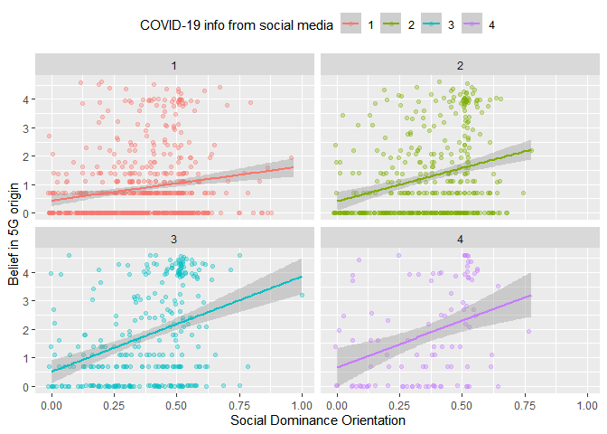<!-- -->

``` r
conspiracies %>% 
  ggplot(aes(x = RWA, y = W2_Conspiracy_Theory3, 
             colour = W2_INFO_5)) +
  geom_jitter(alpha = 1/3) +
  geom_smooth(method = "lm") +
  facet_wrap(~W2_INFO_5) +
  labs(colour = "COVID-19 info from social media",
       x = "Right Wing Authoritarianism",
       y = "Belief in 5G origin") +
  theme(legend.position = "top")
```

    ## `geom_smooth()` using formula 'y ~ x'

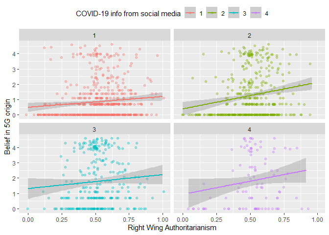<!-- -->

## DV 5G conspiracy - socio-economic variables

``` r
se_5g <- lm(W2_Conspiracy_Theory3 ~ W2_Gender_binary +
               W1_Education_binary +
               W1_BornUK +
               W1_Income_2019 +
               age_sc,
              data = conspiracies)

summ(se_5g)
```

    ## MODEL INFO:
    ## Observations: 1403 (3 missing obs. deleted)
    ## Dependent Variable: W2_Conspiracy_Theory3
    ## Type: OLS linear regression 
    ## 
    ## MODEL FIT:
    ## F(8,1394) = 11.71, p = 0.00
    ## R² = 0.06
    ## Adj. R² = 0.06 
    ## 
    ## Standard errors: OLS
    ## ----------------------------------------------------------
    ##                                Est.   S.E.   t val.      p
    ## -------------------------- -------- ------ -------- ------
    ## (Intercept)                   23.92   2.17    11.04   0.00
    ## W2_Gender_binary2             -0.94   1.16    -0.81   0.42
    ## W1_Education_binary1          -2.45   1.20    -2.03   0.04
    ## W1_BornUK2                     2.86   2.12     1.35   0.18
    ## W1_Income_20192               -1.36   1.89    -0.72   0.47
    ## W1_Income_20193                1.77   1.87     0.95   0.34
    ## W1_Income_20194               -4.69   1.78    -2.64   0.01
    ## W1_Income_20195               -6.57   1.82    -3.61   0.00
    ## age_sc                       -19.41   2.75    -7.06   0.00
    ## ----------------------------------------------------------

``` r
plot_coefs(se_5g)
```

    ## Loading required namespace: broom.mixed

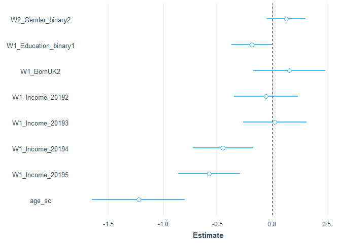<!-- -->

``` r
par(mfrow = c(2,2))
plot(se_5g)
```

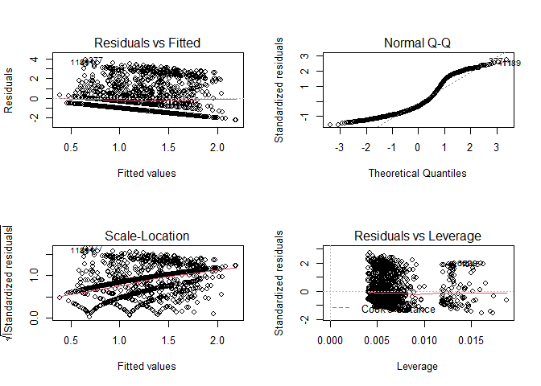<!-- -->

## DV 5G conspiracy - socio-economic variables + political/media

``` r
se_pol_5g <- lm(W2_Conspiracy_Theory3 ~ W1_Education_binary +
                   W1_Income_2019 +
                   age_sc +
                   right +
                   soc_con +
                   fis_con +
                   nat +
                   W2_Newspaper_prefer1 +
                   W2_Newspaper_prefer5 +
                   W2_Newspaper_prefer6 +
                   W2_Newspaper_prefer9 +
                   W2_INFO_5 +
                   W2_INFO_9,
                 data = conspiracies)

#summary(se_pol_5g)
summ(se_pol_5g, vifs = TRUE)
```

    ## MODEL INFO:
    ## Observations: 1406
    ## Dependent Variable: W2_Conspiracy_Theory3
    ## Type: OLS linear regression 
    ## 
    ## MODEL FIT:
    ## F(20,1385) = 13.01, p = 0.00
    ## R² = 0.16
    ## Adj. R² = 0.15 
    ## 
    ## Standard errors: OLS
    ## -----------------------------------------------------------------
    ##                                Est.   S.E.   t val.      p    VIF
    ## -------------------------- -------- ------ -------- ------ ------
    ## (Intercept)                    6.69   2.73     2.45   0.01       
    ## W1_Education_binary1          -0.97   1.17    -0.83   0.41   1.12
    ## W1_Income_20192               -2.19   1.80    -1.22   0.22   1.19
    ## W1_Income_20193                1.06   1.78     0.59   0.55   1.19
    ## W1_Income_20194               -4.37   1.72    -2.54   0.01   1.19
    ## W1_Income_20195               -4.78   1.76    -2.71   0.01   1.19
    ## age_sc                       -13.04   2.86    -4.56   0.00   1.28
    ## right                          3.47   3.74     0.93   0.35   2.00
    ## soc_con                       13.44   2.38     5.66   0.00   1.45
    ## fis_con                       -4.06   3.57    -1.14   0.25   2.10
    ## nat                            4.59   2.46     1.87   0.06   1.28
    ## W2_Newspaper_prefer1           1.44   1.24     1.16   0.25   1.12
    ## W2_Newspaper_prefer5          -2.58   1.54    -1.68   0.09   1.33
    ## W2_Newspaper_prefer6           4.24   1.91     2.21   0.03   1.22
    ## W2_Newspaper_prefer9           5.33   1.74     3.07   0.00   1.12
    ## W2_INFO_52                     2.86   1.38     2.07   0.04   1.49
    ## W2_INFO_53                     8.45   1.61     5.26   0.00   1.49
    ## W2_INFO_54                     6.12   2.42     2.53   0.01   1.49
    ## W2_INFO_92                     0.84   1.41     0.59   0.55   1.29
    ## W2_INFO_93                     3.56   1.60     2.22   0.03   1.29
    ## W2_INFO_94                     8.58   2.73     3.15   0.00   1.29
    ## -----------------------------------------------------------------

``` r
plot_coefs(se_pol_5g)
```

    ## Loading required namespace: broom.mixed

<!-- -->

``` r
par(mfrow = c(2,2))
plot(se_pol_5g)
```

<!-- -->

## DV 5G conspiracy - socio-economic variables + political/media + pol-psych

``` r
# right and fis_con now dropped from modelling
# due to VIF >= 2 and non-significant effect
se_polpsych_5g <- lm(W2_Conspiracy_Theory3 ~
                       W1_Education_binary +
                       W1_Income_2019 +
                       age_sc +
                       #right +
                       soc_con +
                       #fis_con +
                       nat +
                       W2_Newspaper_prefer1 +
                       W2_Newspaper_prefer5 +
                       W2_Newspaper_prefer6 +
                       W2_Newspaper_prefer9 +
                       W2_INFO_5 +
                       W2_INFO_9 +
                       W2_Trust_Body6 +
                       SDO +
                       RWA +
                       W2_DAI_Total +
                       W2_IOU_Total +
                       W2_Paranoia_Total +
                       W2_Internal_Total +
                       W2_Chance_Total,
                     data = conspiracies)

#summary(se_polpsych_5g)
summ(se_polpsych_5g, vifs = TRUE)
```

    ## MODEL INFO:
    ## Observations: 1402 (4 missing obs. deleted)
    ## Dependent Variable: W2_Conspiracy_Theory3
    ## Type: OLS linear regression 
    ## 
    ## MODEL FIT:
    ## F(29,1372) = 19.23, p = 0.00
    ## R² = 0.29
    ## Adj. R² = 0.27 
    ## 
    ## Standard errors: OLS
    ## -----------------------------------------------------------------
    ##                                Est.   S.E.   t val.      p    VIF
    ## -------------------------- -------- ------ -------- ------ ------
    ## (Intercept)                   -4.69   3.91    -1.20   0.23       
    ## W1_Education_binary1          -0.56   1.08    -0.52   0.60   1.13
    ## W1_Income_20192               -2.60   1.68    -1.55   0.12   1.32
    ## W1_Income_20193                1.47   1.67     0.88   0.38   1.32
    ## W1_Income_20194               -2.48   1.62    -1.53   0.13   1.32
    ## W1_Income_20195               -3.07   1.67    -1.84   0.07   1.32
    ## age_sc                        -2.55   2.83    -0.90   0.37   1.48
    ## soc_con                        7.13   2.17     3.28   0.00   1.44
    ## nat                            3.13   2.28     1.37   0.17   1.31
    ## W2_Newspaper_prefer1           0.13   1.15     0.11   0.91   1.13
    ## W2_Newspaper_prefer5          -1.25   1.45    -0.87   0.39   1.39
    ## W2_Newspaper_prefer6           4.74   1.78     2.66   0.01   1.24
    ## W2_Newspaper_prefer9           3.71   1.61     2.31   0.02   1.13
    ## W2_INFO_52                     2.29   1.28     1.80   0.07   1.53
    ## W2_INFO_53                     6.55   1.49     4.39   0.00   1.53
    ## W2_INFO_54                     4.84   2.25     2.15   0.03   1.53
    ## W2_INFO_92                     1.04   1.31     0.79   0.43   1.35
    ## W2_INFO_93                     4.14   1.49     2.78   0.01   1.35
    ## W2_INFO_94                     8.88   2.54     3.50   0.00   1.35
    ## W2_Trust_Body62                1.50   1.41     1.07   0.29   1.30
    ## W2_Trust_Body63                6.87   1.64     4.20   0.00   1.30
    ## W2_Trust_Body64               11.44   1.95     5.87   0.00   1.30
    ## W2_Trust_Body65               17.66   3.27     5.40   0.00   1.30
    ## SDO                           16.41   3.31     4.95   0.00   1.42
    ## RWA                          -12.48   3.58    -3.48   0.00   1.50
    ## W2_DAI_Total                  18.67   2.79     6.70   0.00   1.53
    ## W2_IOU_Total                 -12.74   3.17    -4.01   0.00   1.60
    ## W2_Paranoia_Total             12.85   2.70     4.76   0.00   1.74
    ## W2_Internal_Total             -0.29   3.17    -0.09   0.93   1.21
    ## W2_Chance_Total                1.88   2.86     0.66   0.51   1.36
    ## -----------------------------------------------------------------

``` r
plot_coefs(se_polpsych_5g)
```

    ## Loading required namespace: broom.mixed

<!-- -->

``` r
par(mfrow = c(2,2))
plot(se_polpsych_5g)
```

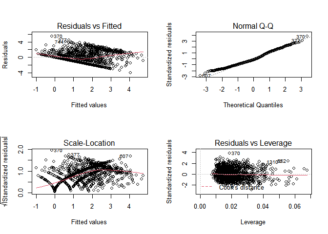<!-- -->

``` r
#av_ggplot(se_polpsych_5g)
```

## DV 5G conspiracy - socio-economic variables + political/media + pol-psych + covid-threat and CRT

``` r
multi_5g <- lm(W2_Conspiracy_Theory3 ~ W1_Education_binary +
                  W1_Income_2019 +
                  age_sc +
                  #right +
                  soc_con +
                  #fis_con +
                  nat +
                  W2_Newspaper_prefer1 +
                  W2_Newspaper_prefer5 +
                  W2_Newspaper_prefer6 +
                  W2_Newspaper_prefer9 +
                  W2_INFO_5 +
                  W2_INFO_9 +
                  W2_Trust_Body6 +
                  SDO +
                  RWA +
                  W2_DAI_Total +
                  W2_IOU_Total +
                  W2_Paranoia_Total +
                  W2_Internal_Total +
                  W2_Chance_Total +
                  threat +
                  CRT1 +
                  CRT2 +
                  CRT3 +
                  CRT4 +
                  CRT5,
                 data = conspiracies)

#summary(multi_5g)
summ(multi_5g, vifs = TRUE)
```

    ## MODEL INFO:
    ## Observations: 1402 (4 missing obs. deleted)
    ## Dependent Variable: W2_Conspiracy_Theory3
    ## Type: OLS linear regression 
    ## 
    ## MODEL FIT:
    ## F(35,1366) = 17.45, p = 0.00
    ## R² = 0.31
    ## Adj. R² = 0.29 
    ## 
    ## Standard errors: OLS
    ## -----------------------------------------------------------------
    ##                                Est.   S.E.   t val.      p    VIF
    ## -------------------------- -------- ------ -------- ------ ------
    ## (Intercept)                   -7.15   4.01    -1.78   0.08       
    ## W1_Education_binary1          -0.21   1.07    -0.19   0.85   1.14
    ## W1_Income_20192               -2.32   1.67    -1.39   0.16   1.37
    ## W1_Income_20193                2.02   1.66     1.21   0.22   1.37
    ## W1_Income_20194               -1.16   1.62    -0.72   0.47   1.37
    ## W1_Income_20195               -1.82   1.67    -1.09   0.28   1.37
    ## age_sc                        -3.53   2.88    -1.22   0.22   1.57
    ## soc_con                        7.29   2.15     3.39   0.00   1.44
    ## nat                            2.92   2.26     1.29   0.20   1.32
    ## W2_Newspaper_prefer1          -0.00   1.14    -0.00   1.00   1.14
    ## W2_Newspaper_prefer5          -1.01   1.44    -0.70   0.48   1.41
    ## W2_Newspaper_prefer6           4.72   1.76     2.68   0.01   1.24
    ## W2_Newspaper_prefer9           3.14   1.60     1.97   0.05   1.14
    ## W2_INFO_52                     1.63   1.27     1.29   0.20   1.58
    ## W2_INFO_53                     5.71   1.48     3.85   0.00   1.58
    ## W2_INFO_54                     3.69   2.24     1.64   0.10   1.58
    ## W2_INFO_92                     1.32   1.30     1.01   0.31   1.41
    ## W2_INFO_93                     3.96   1.48     2.67   0.01   1.41
    ## W2_INFO_94                     7.97   2.54     3.14   0.00   1.41
    ## W2_Trust_Body62                1.48   1.39     1.06   0.29   1.33
    ## W2_Trust_Body63                6.37   1.62     3.93   0.00   1.33
    ## W2_Trust_Body64               10.52   1.94     5.43   0.00   1.33
    ## W2_Trust_Body65               17.02   3.24     5.25   0.00   1.33
    ## SDO                           16.14   3.32     4.86   0.00   1.46
    ## RWA                          -13.80   3.60    -3.84   0.00   1.55
    ## W2_DAI_Total                  16.68   2.84     5.87   0.00   1.63
    ## W2_IOU_Total                 -10.64   3.17    -3.36   0.00   1.63
    ## W2_Paranoia_Total             12.08   2.68     4.52   0.00   1.75
    ## W2_Internal_Total             -0.10   3.15    -0.03   0.97   1.23
    ## W2_Chance_Total                2.10   2.82     0.74   0.46   1.37
    ## threat                        -2.34   2.11    -1.11   0.27   1.22
    ## CRT1                           2.13   1.42     1.50   0.13   1.39
    ## CRT2                           1.02   1.22     0.83   0.40   1.47
    ## CRT3                          -0.48   1.31    -0.37   0.72   1.59
    ## CRT4                           0.75   1.14     0.66   0.51   1.30
    ## CRT5                           5.36   1.17     4.60   0.00   1.38
    ## -----------------------------------------------------------------

``` r
plot_coefs(multi_5g)
```

    ## Loading required namespace: broom.mixed

<!-- -->

``` r
par(mfrow = c(2,2))
plot(multi_5g)
```

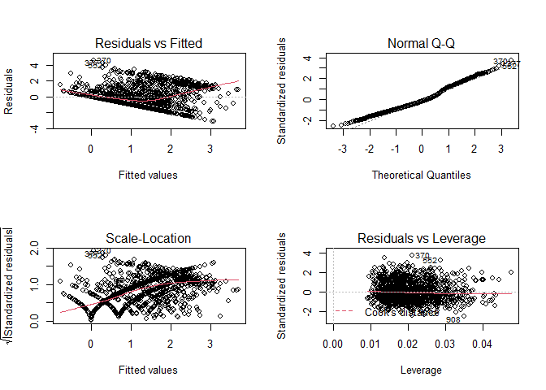<!-- -->

## DV 5G belief, socio-economic + pol-psych, dropping soc\_con and IOU

``` r
se_polpsych_5g_2 <- lm(W2_Conspiracy_Theory3 ~
                         W1_Education_binary +
                         W1_Income_2019 +
                         age_sc +
                         #right +
                         #soc_con +
                         #fis_con +
                         nat +
                         W2_Newspaper_prefer1 +
                         W2_Newspaper_prefer5 +
                         W2_Newspaper_prefer6 +
                         W2_Newspaper_prefer9 +
                         W2_INFO_5 +
                         W2_INFO_9 +
                         SDO +
                         RWA +
                         #W2_IOU_Total +
                         W2_DAI_Total,
                       data = conspiracies)

#summary(se_polpsych_5g_2)
summ(se_polpsych_5g_2, vifs = TRUE)
```

    ## MODEL INFO:
    ## Observations: 1406
    ## Dependent Variable: W2_Conspiracy_Theory3
    ## Type: OLS linear regression 
    ## 
    ## MODEL FIT:
    ## F(20,1385) = 18.91, p = 0.00
    ## R² = 0.21
    ## Adj. R² = 0.20 
    ## 
    ## Standard errors: OLS
    ## ----------------------------------------------------------------
    ##                               Est.   S.E.   t val.      p    VIF
    ## -------------------------- ------- ------ -------- ------ ------
    ## (Intercept)                  -1.47   3.01    -0.49   0.63       
    ## W1_Education_binary1         -0.56   1.13    -0.49   0.62   1.12
    ## W1_Income_20192              -3.30   1.74    -1.90   0.06   1.17
    ## W1_Income_20193               0.00   1.72     0.00   1.00   1.17
    ## W1_Income_20194              -4.85   1.64    -2.95   0.00   1.17
    ## W1_Income_20195              -5.53   1.68    -3.29   0.00   1.17
    ## age_sc                       -6.32   2.81    -2.25   0.02   1.33
    ## nat                           2.31   2.34     0.99   0.32   1.24
    ## W2_Newspaper_prefer1          1.30   1.20     1.09   0.28   1.11
    ## W2_Newspaper_prefer5         -1.75   1.51    -1.16   0.25   1.38
    ## W2_Newspaper_prefer6          4.65   1.85     2.51   0.01   1.22
    ## W2_Newspaper_prefer9          4.03   1.68     2.40   0.02   1.12
    ## W2_INFO_52                    1.58   1.33     1.18   0.24   1.50
    ## W2_INFO_53                    6.51   1.56     4.17   0.00   1.50
    ## W2_INFO_54                    4.51   2.35     1.92   0.05   1.50
    ## W2_INFO_92                    0.26   1.37     0.19   0.85   1.31
    ## W2_INFO_93                    3.59   1.56     2.31   0.02   1.31
    ## W2_INFO_94                    9.31   2.64     3.52   0.00   1.31
    ## SDO                          25.06   3.34     7.50   0.00   1.32
    ## RWA                          -8.45   3.56    -2.37   0.02   1.35
    ## W2_DAI_Total                 21.65   2.55     8.48   0.00   1.17
    ## ----------------------------------------------------------------

``` r
plot_coefs(se_polpsych_5g_2)
```

    ## Loading required namespace: broom.mixed

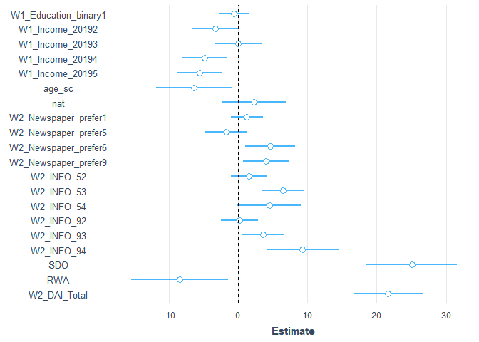<!-- -->

``` r
par(mfrow = c(2,2))
plot(se_polpsych_5g_2)
```

<!-- -->

## DV 5G belief, multivariate model, dropping soc\_con and IOU

``` r
multi_5g_2 <- lm(W2_Conspiracy_Theory3 ~
                   W1_Education_binary +
                   W1_Income_2019 +
                   age_sc +
                   #right +
                   #soc_con +
                   #fis_con +
                   nat +
                   W2_Newspaper_prefer1 +
                   W2_Newspaper_prefer5 +
                   W2_Newspaper_prefer6 +
                   W2_Newspaper_prefer9 +
                   W2_INFO_5 +
                   W2_INFO_9 +
                   W2_Trust_Body6 +
                   SDO +
                   RWA +
                   W2_DAI_Total +
                   #W2_IOU_Total +
                   W2_Paranoia_Total +
                   W2_Internal_Total +
                   W2_Chance_Total +
                   threat +
                   CRT1 +
                   CRT2 +
                   CRT3 +
                   CRT4 +
                   CRT5,
                 data = conspiracies)

#summary(multi_5g_2)
summ(multi_5g_2, vifs = TRUE)
```

    ## MODEL INFO:
    ## Observations: 1402 (4 missing obs. deleted)
    ## Dependent Variable: W2_Conspiracy_Theory3
    ## Type: OLS linear regression 
    ## 
    ## MODEL FIT:
    ## F(33,1368) = 17.56, p = 0.00
    ## R² = 0.30
    ## Adj. R² = 0.28 
    ## 
    ## Standard errors: OLS
    ## -----------------------------------------------------------------
    ##                                Est.   S.E.   t val.      p    VIF
    ## -------------------------- -------- ------ -------- ------ ------
    ## (Intercept)                  -10.92   3.95    -2.77   0.01       
    ## W1_Education_binary1          -0.16   1.08    -0.15   0.88   1.13
    ## W1_Income_20192               -2.07   1.68    -1.23   0.22   1.36
    ## W1_Income_20193                2.32   1.67     1.39   0.16   1.36
    ## W1_Income_20194               -0.99   1.63    -0.61   0.54   1.36
    ## W1_Income_20195               -1.68   1.68    -1.00   0.32   1.36
    ## age_sc                        -2.67   2.90    -0.92   0.36   1.57
    ## nat                            3.61   2.27     1.59   0.11   1.31
    ## W2_Newspaper_prefer1           0.10   1.15     0.09   0.93   1.13
    ## W2_Newspaper_prefer5          -1.24   1.44    -0.86   0.39   1.40
    ## W2_Newspaper_prefer6           4.75   1.77     2.68   0.01   1.24
    ## W2_Newspaper_prefer9           3.33   1.61     2.07   0.04   1.14
    ## W2_INFO_52                     1.11   1.27     0.87   0.38   1.56
    ## W2_INFO_53                     5.26   1.49     3.53   0.00   1.56
    ## W2_INFO_54                     3.03   2.25     1.35   0.18   1.56
    ## W2_INFO_92                     1.20   1.31     0.92   0.36   1.40
    ## W2_INFO_93                     4.01   1.50     2.68   0.01   1.40
    ## W2_INFO_94                     8.09   2.56     3.17   0.00   1.40
    ## W2_Trust_Body62                1.86   1.40     1.33   0.19   1.29
    ## W2_Trust_Body63                7.27   1.62     4.48   0.00   1.29
    ## W2_Trust_Body64               11.45   1.94     5.91   0.00   1.29
    ## W2_Trust_Body65               19.10   3.23     5.91   0.00   1.29
    ## SDO                           18.81   3.28     5.74   0.00   1.40
    ## RWA                          -10.59   3.45    -3.07   0.00   1.40
    ## W2_DAI_Total                  14.46   2.73     5.30   0.00   1.48
    ## W2_Paranoia_Total             10.14   2.63     3.86   0.00   1.66
    ## W2_Internal_Total             -0.01   3.17    -0.00   1.00   1.22
    ## W2_Chance_Total                0.29   2.80     0.10   0.92   1.32
    ## threat                        -3.35   2.11    -1.58   0.11   1.21
    ## CRT1                           2.27   1.43     1.59   0.11   1.39
    ## CRT2                           0.97   1.23     0.79   0.43   1.47
    ## CRT3                          -0.29   1.31    -0.22   0.83   1.59
    ## CRT4                           0.82   1.15     0.72   0.47   1.30
    ## CRT5                           5.49   1.17     4.68   0.00   1.37
    ## -----------------------------------------------------------------

``` r
plot_coefs(multi_5g_2)
```

    ## Loading required namespace: broom.mixed

<!-- -->

``` r
par(mfrow = c(2,2))
plot(multi_5g_2)
```

<!-- -->

## DV 5G conspiracy - multivariate and interaction model (not incl. conspiracy controls)

``` r
int_5g <- lm(W2_Conspiracy_Theory3 ~
                   W1_Education_binary +
                   W1_Income_2019 +
                   age_sc +
                   #right +
                   #soc_con +
                   #fis_con +
                   nat +
                   W2_Newspaper_prefer1 +
                   W2_Newspaper_prefer5 +
                   W2_Newspaper_prefer6 +
                   W2_Newspaper_prefer9 +
                   W2_INFO_5:SDO +
                   W2_INFO_9 +
                   W2_Trust_Body6 +
                   #SDO +
                   RWA +
                   W2_DAI_Total +
                   #W2_IOU_Total +
                   W2_Paranoia_Total +
                   W2_Internal_Total +
                   W2_Chance_Total +
                   threat +
                   CRT1 +
                   CRT2 +
                   CRT3 +
                   CRT4 +
                   CRT5,
                 data = conspiracies)

#summary(int_5g)
summ(int_5g, vifs = TRUE)
```

    ## MODEL INFO:
    ## Observations: 1402 (4 missing obs. deleted)
    ## Dependent Variable: W2_Conspiracy_Theory3
    ## Type: OLS linear regression 
    ## 
    ## MODEL FIT:
    ## F(33,1368) = 18.10, p = 0.00
    ## R² = 0.30
    ## Adj. R² = 0.29 
    ## 
    ## Standard errors: OLS
    ## -----------------------------------------------------------------
    ##                                Est.   S.E.   t val.      p    VIF
    ## -------------------------- -------- ------ -------- ------ ------
    ## (Intercept)                   -8.94   3.91    -2.29   0.02       
    ## W1_Education_binary1          -0.26   1.07    -0.24   0.81   1.13
    ## W1_Income_20192               -2.34   1.67    -1.40   0.16   1.36
    ## W1_Income_20193                2.20   1.66     1.32   0.19   1.36
    ## W1_Income_20194               -0.98   1.62    -0.61   0.54   1.36
    ## W1_Income_20195               -1.79   1.67    -1.07   0.29   1.36
    ## age_sc                        -1.79   2.86    -0.62   0.53   1.54
    ## nat                            3.40   2.26     1.50   0.13   1.31
    ## W2_Newspaper_prefer1           0.14   1.14     0.12   0.90   1.13
    ## W2_Newspaper_prefer5          -1.41   1.44    -0.98   0.33   1.40
    ## W2_Newspaper_prefer6           4.74   1.76     2.69   0.01   1.24
    ## W2_Newspaper_prefer9           3.22   1.60     2.01   0.04   1.14
    ## W2_INFO_92                     0.92   1.30     0.71   0.48   1.41
    ## W2_INFO_93                     3.47   1.48     2.34   0.02   1.41
    ## W2_INFO_94                     7.21   2.56     2.82   0.00   1.41
    ## W2_Trust_Body62                1.84   1.40     1.32   0.19   1.28
    ## W2_Trust_Body63                7.28   1.61     4.51   0.00   1.28
    ## W2_Trust_Body64               11.35   1.93     5.88   0.00   1.28
    ## W2_Trust_Body65               19.28   3.22     5.99   0.00   1.28
    ## RWA                          -10.02   3.43    -2.92   0.00   1.40
    ## W2_DAI_Total                  13.84   2.72     5.08   0.00   1.49
    ## W2_Paranoia_Total              9.90   2.62     3.79   0.00   1.67
    ## W2_Internal_Total             -0.04   3.16    -0.01   0.99   1.23
    ## W2_Chance_Total                0.00   2.79     0.00   1.00   1.32
    ## threat                        -2.97   2.10    -1.41   0.16   1.21
    ## CRT1                           2.04   1.42     1.43   0.15   1.39
    ## CRT2                           0.86   1.22     0.71   0.48   1.46
    ## CRT3                          -0.24   1.31    -0.18   0.85   1.59
    ## CRT4                           0.91   1.14     0.80   0.42   1.30
    ## CRT5                           5.35   1.17     4.58   0.00   1.38
    ## W2_INFO_51:SDO                12.24   3.64     3.36   0.00   2.19
    ## W2_INFO_52:SDO                18.70   3.85     4.86   0.00   2.19
    ## W2_INFO_53:SDO                30.26   4.03     7.51   0.00   2.19
    ## W2_INFO_54:SDO                25.95   5.90     4.40   0.00   2.19
    ## -----------------------------------------------------------------

``` r
plot_coefs(int_5g)
```

    ## Loading required namespace: broom.mixed

<!-- -->

``` r
par(mfrow = c(2,2))
plot(int_5g)
```

<!-- -->

## DV 5G conspiracy - socio-economic variables + political/media + pol-psych + covid-threat and CRT + conspiracies

``` r
full_5g <- lm(W2_Conspiracy_Theory3 ~
               W1_Education_binary +
               W1_Income_2019 +
               age_sc +
               #right +
               #soc_con +
               #fis_con +
               nat +
               W2_Newspaper_prefer1 +
               W2_Newspaper_prefer5 +
               W2_Newspaper_prefer6 +
               W2_Newspaper_prefer9 +
               W2_INFO_5:SDO +
               W2_INFO_9 +
               #SDO +
               RWA +
               #W2_IOU_Total +
               W2_DAI_Total +
               W2_Paranoia_Total + W2_Internal_Total + 
                W2_Chance_Total +
                threat +
               CRT1 +
               CRT2 +
               CRT3 +
               CRT4 +
               CRT5 +
               W1_Conspiracy_Total +
               conspiracy1_sc +
               conspiracy2_sc +
               conspiracy4_sc +
               conspiracy5_sc,
             data = conspiracies)

#summary(full_5g)
summ(full_5g, vifs = TRUE)
```

    ## MODEL INFO:
    ## Observations: 1406
    ## Dependent Variable: W2_Conspiracy_Theory3
    ## Type: OLS linear regression 
    ## 
    ## MODEL FIT:
    ## F(34,1371) = 45.36, p = 0.00
    ## R² = 0.53
    ## Adj. R² = 0.52 
    ## 
    ## Standard errors: OLS
    ## ----------------------------------------------------------------
    ##                               Est.   S.E.   t val.      p    VIF
    ## -------------------------- ------- ------ -------- ------ ------
    ## (Intercept)                  -4.34   3.29    -1.32   0.19       
    ## W1_Education_binary1         -0.55   0.88    -0.62   0.53   1.13
    ## W1_Income_20192              -1.52   1.38    -1.10   0.27   1.37
    ## W1_Income_20193               0.93   1.37     0.68   0.50   1.37
    ## W1_Income_20194              -1.38   1.33    -1.04   0.30   1.37
    ## W1_Income_20195              -1.40   1.38    -1.01   0.31   1.37
    ## age_sc                        1.38   2.36     0.58   0.56   1.54
    ## nat                          -1.03   1.87    -0.55   0.58   1.31
    ## W2_Newspaper_prefer1         -2.01   0.95    -2.11   0.03   1.16
    ## W2_Newspaper_prefer5          0.50   1.19     0.42   0.68   1.41
    ## W2_Newspaper_prefer6          2.58   1.45     1.78   0.07   1.24
    ## W2_Newspaper_prefer9          0.34   1.33     0.25   0.80   1.16
    ## W2_INFO_92                    0.13   1.07     0.12   0.90   1.43
    ## W2_INFO_93                    1.70   1.23     1.38   0.17   1.43
    ## W2_INFO_94                    4.52   2.11     2.14   0.03   1.43
    ## RWA                          -6.53   2.86    -2.28   0.02   1.44
    ## W2_DAI_Total                  8.27   2.26     3.66   0.00   1.51
    ## W2_Paranoia_Total             5.01   2.15     2.33   0.02   1.67
    ## W2_Internal_Total            -2.88   2.60    -1.11   0.27   1.23
    ## W2_Chance_Total              -1.71   2.32    -0.74   0.46   1.35
    ## threat                       -0.97   1.76    -0.55   0.58   1.25
    ## CRT1                          1.56   1.17     1.34   0.18   1.39
    ## CRT2                          0.69   1.00     0.69   0.49   1.45
    ## CRT3                         -1.69   1.08    -1.56   0.12   1.59
    ## CRT4                          0.27   0.94     0.29   0.77   1.30
    ## CRT5                          3.66   0.97     3.79   0.00   1.39
    ## W1_Conspiracy_Total           2.16   2.19     0.99   0.32   1.14
    ## conspiracy1_sc                5.49   1.48     3.72   0.00   1.46
    ## conspiracy2_sc               -0.38   1.49    -0.25   0.80   1.11
    ## conspiracy4_sc                6.48   1.52     4.25   0.00   1.35
    ## conspiracy5_sc               48.98   2.11    23.22   0.00   1.50
    ## W2_INFO_51:SDO                8.71   3.02     2.89   0.00   2.34
    ## W2_INFO_52:SDO               10.46   3.21     3.26   0.00   2.34
    ## W2_INFO_53:SDO               13.14   3.40     3.87   0.00   2.34
    ## W2_INFO_54:SDO                9.99   4.90     2.04   0.04   2.34
    ## ----------------------------------------------------------------

``` r
plot_coefs(full_5g)
```

    ## Loading required namespace: broom.mixed

<!-- -->

``` r
par(mfrow = c(2,2))
plot(full_5g)
```

<!-- -->

# Parsimonious models

## Chinese lab belief

``` r
pars_lab <- lm(W2_Conspiracy_Theory1 ~ W1_Education_binary +
                 W1_Income_2019 +
                 nat +
                 W2_Newspaper_prefer1 +
                 W2_Newspaper_prefer9 +
                 W2_INFO_5 +
                 W2_INFO_9:RWA +
                 SDO +
                 W2_DAI_Total +
                 threat +
                 CRT3 +
                 W1_Conspiracy_Total +
                 conspiracy2_sc +
                 conspiracy3_sc +
                 conspiracy4_sc,
              data = conspiracies)

summ(pars_lab, vifs = TRUE)
```

    ## MODEL INFO:
    ## Observations: 1406
    ## Dependent Variable: W2_Conspiracy_Theory1
    ## Type: OLS linear regression 
    ## 
    ## MODEL FIT:
    ## F(23,1382) = 27.45, p = 0.00
    ## R² = 0.31
    ## Adj. R² = 0.30 
    ## 
    ## Standard errors: OLS
    ## -----------------------------------------------------------------
    ##                                Est.   S.E.   t val.      p    VIF
    ## -------------------------- -------- ------ -------- ------ ------
    ## (Intercept)                   -9.50   4.48    -2.12   0.03       
    ## W1_Education_binary1          -3.82   1.59    -2.40   0.02   1.11
    ## W1_Income_20192                0.40   2.46     0.16   0.87   1.20
    ## W1_Income_20193               -6.67   2.44    -2.73   0.01   1.20
    ## W1_Income_20194               -0.36   2.35    -0.15   0.88   1.20
    ## W1_Income_20195               -4.82   2.41    -2.00   0.05   1.20
    ## nat                           12.05   3.31     3.64   0.00   1.24
    ## W2_Newspaper_prefer1           9.21   1.69     5.44   0.00   1.11
    ## W2_Newspaper_prefer9           6.61   2.37     2.79   0.01   1.10
    ## W2_INFO_52                     2.80   1.84     1.52   0.13   1.37
    ## W2_INFO_53                     5.06   2.15     2.36   0.02   1.37
    ## W2_INFO_54                    -2.34   3.25    -0.72   0.47   1.37
    ## SDO                           12.63   4.87     2.60   0.01   1.39
    ## W2_DAI_Total                   9.01   3.82     2.36   0.02   1.30
    ## threat                        10.26   3.13     3.27   0.00   1.19
    ## CRT3                           5.68   1.68     3.39   0.00   1.16
    ## W1_Conspiracy_Total           26.65   3.89     6.85   0.00   1.08
    ## conspiracy2_sc               -13.55   2.65    -5.10   0.00   1.06
    ## conspiracy3_sc                22.32   4.04     5.53   0.00   1.43
    ## conspiracy4_sc                11.52   2.70     4.26   0.00   1.27
    ## W2_INFO_91:RWA                12.88   5.62     2.29   0.02   1.80
    ## W2_INFO_92:RWA                21.82   5.29     4.12   0.00   1.80
    ## W2_INFO_93:RWA                21.42   5.60     3.83   0.00   1.80
    ## W2_INFO_94:RWA                35.60   7.99     4.45   0.00   1.80
    ## -----------------------------------------------------------------

``` r
plot_coefs(pars_lab)
```

    ## Loading required namespace: broom.mixed

<!-- -->

``` r
par(mfrow = c(2,2))
plot(pars_lab)
```

<!-- -->

## 5G origin belief

``` r
pars_5g <- lm(W2_Conspiracy_Theory3 ~
                W2_Newspaper_prefer1 +
                W2_Newspaper_prefer6 +
                RWA +
                W2_INFO_5:SDO +
                W2_DAI_Total +
                W2_Paranoia_Total +
                W2_Trust_Body6 +
                CRT5 +
                conspiracy1_sc +
                conspiracy4_sc +
                conspiracy5_sc,
             data = conspiracies)

#summary(pars_5g)
summ(pars_5g, vifs = TRUE)
```

    ## MODEL INFO:
    ## Observations: 1402 (4 missing obs. deleted)
    ## Dependent Variable: W2_Conspiracy_Theory3
    ## Type: OLS linear regression 
    ## 
    ## MODEL FIT:
    ## F(17,1384) = 92.03, p = 0.00
    ## R² = 0.53
    ## Adj. R² = 0.52 
    ## 
    ## Standard errors: OLS
    ## ----------------------------------------------------------------
    ##                               Est.   S.E.   t val.      p    VIF
    ## -------------------------- ------- ------ -------- ------ ------
    ## (Intercept)                  -6.58   1.71    -3.84   0.00       
    ## W2_Newspaper_prefer1         -2.35   0.93    -2.53   0.01   1.12
    ## W2_Newspaper_prefer6          3.28   1.33     2.46   0.01   1.06
    ## RWA                          -6.17   2.66    -2.32   0.02   1.26
    ## W2_DAI_Total                  7.49   2.11     3.55   0.00   1.34
    ## W2_Paranoia_Total             4.23   1.94     2.18   0.03   1.37
    ## W2_Trust_Body62               0.65   1.12     0.58   0.56   1.21
    ## W2_Trust_Body63               2.62   1.30     2.02   0.04   1.21
    ## W2_Trust_Body64               4.42   1.58     2.81   0.01   1.21
    ## W2_Trust_Body65              10.50   2.62     4.01   0.00   1.21
    ## CRT5                          4.06   0.86     4.73   0.00   1.11
    ## conspiracy1_sc                5.22   1.39     3.75   0.00   1.32
    ## conspiracy4_sc                6.26   1.49     4.22   0.00   1.31
    ## conspiracy5_sc               47.99   2.10    22.84   0.00   1.51
    ## W2_INFO_51:SDO                6.15   2.79     2.21   0.03   1.55
    ## W2_INFO_52:SDO                8.42   2.97     2.83   0.00   1.55
    ## W2_INFO_53:SDO               12.34   3.24     3.81   0.00   1.55
    ## W2_INFO_54:SDO               10.00   4.63     2.16   0.03   1.55
    ## ----------------------------------------------------------------

``` r
plot_coefs(pars_5g)
```

    ## Loading required namespace: broom.mixed

<!-- -->

``` r
par(mfrow = c(2,2))
plot(pars_5g)
```

<!-- -->
