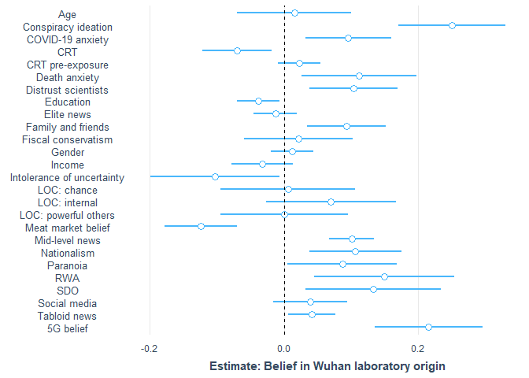
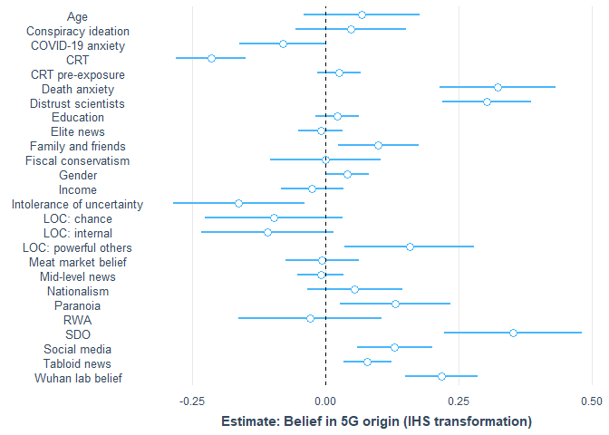
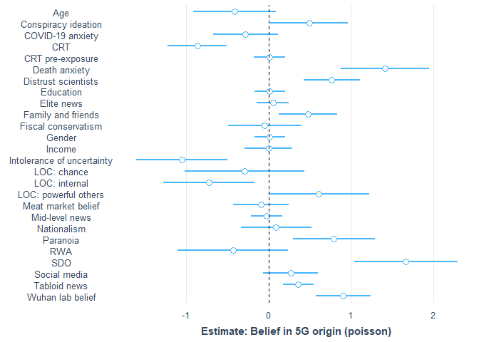
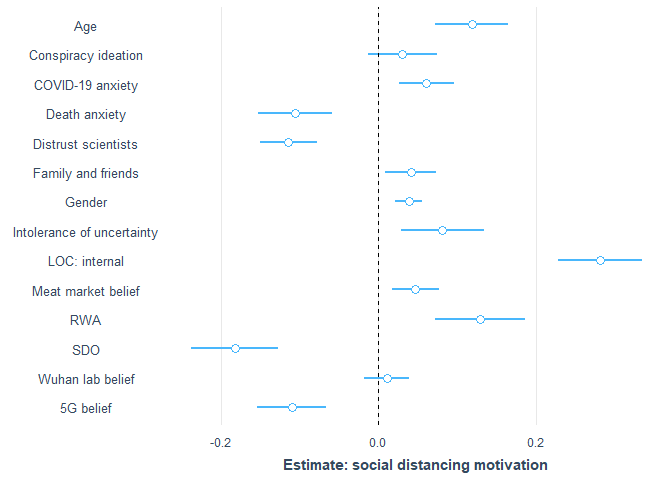

covid\_conspiracies\_markdown2
================
Michael Marshall
21/10/2020

## Loading Packages and Data

``` r
pacman::p_load(tidyverse, stringr, ggridges, forcats, labelled, leaps,
               psych, corrr, cowplot, expss, haven, interplot,
               interactions, jtools,labelled, pscl, psych, 
               sjPlot, skimr)

load("COVID W1_W2_W3 Cleaned 2878.RData") # needs to be in your wd
```

## Rescaling variable

``` r
## [rescale01] Function to rescale a variable from 0 to 1
rescale01 <- function(x, ...) {
  (x - min(x, ...)) / ((max(x, ...)) - min(x, ...))
}
```

## Summary and distribution of different COVID specific conspiracies

``` r
# plotting density of different covid conspiracies
df %>% 
  dplyr::select(W2_Conspiracy_Theory1:W2_Conspiracy_Theory5) %>% 
  gather(conspiracy_code, belief,
         W2_Conspiracy_Theory1:W2_Conspiracy_Theory5) %>%
  mutate(conspiracy_code = as.factor(conspiracy_code)) %>%
  filter(!conspiracy_code %in% c("W2_Conspiracy_Theory4",
                                 "W2_Conspiracy_Theory5")) %>% 
  ggplot(aes(x = belief, y = conspiracy_code, height = ..density..)) +
  geom_density_ridges(aes(rel_min_height = 0.005),
                      stat = "density",
                      fill = get_colors("CUD Bright",num.colors = 1)) +
  theme_nice() +
  scale_y_discrete(labels = c("Wuhan laboratory","Meat market","5G")) +
  labs(y = NULL, x = "Belief scale (0-100)",
       caption = "Distribution of origin theory belief") +
  theme(plot.caption = element_text(hjust = 0.61,
                                    face = "bold",
                                    size = 10),
        axis.title.x = element_text(size = 8,
                                    hjust = 0.5)
  )
```

<!-- -->

``` r
#pacman::p_load(patchwork)
df %>% 
  dplyr::select(W2_Conspiracy_Theory1:W2_Conspiracy_Theory5) %>% 
  gather(conspiracy_code, belief,
         W2_Conspiracy_Theory1:W2_Conspiracy_Theory5) %>%
  mutate(conspiracy_code = fct_recode(
    as.factor(conspiracy_code),
    "Wuhan laboratory" = "W2_Conspiracy_Theory1",
    "Meat market" = "W2_Conspiracy_Theory2",
    "5G" = "W2_Conspiracy_Theory3",
    "4" = "W2_Conspiracy_Theory4",
    "5" = "W2_Conspiracy_Theory5")
    ) %>%
  filter(!conspiracy_code %in% c("4","5")) %>% 
  mutate(
    order_var = ifelse(conspiracy_code == "Meat market", 1,
                       ifelse(conspiracy_code == "Wuhan laboratory",2,3))
  ) %>% 
  ggplot(aes(x = belief)) +
  geom_density(fill = get_colors("CUD Bright",num.colors = 1),
               alpha = 0.8) +
  theme_nice() +
  facet_wrap(~fct_reorder(conspiracy_code,order_var), 
             scales = "free_y", ncol = 1) +
  labs(y = "Density", 
       x = "Distribution of origin theory belief")
```

    ## Warning: attributes are not identical across measure variables;
    ## they will be dropped

    ## Warning: Removed 4416 rows containing non-finite values (stat_density).

<!-- -->

## Cleaning dataset

The following code filters down to just those observations that have
completed the battery of questions relating to COVID specific
conspiracies. It also creates a tibble counting the missing
observations, which can be useful to have as an object.

``` r
# filtering for completed dependent variable
conspiracies <- df %>% 
  filter(!is.na(W2_Conspiracy_Theory1) |
           !is.na(W2_Conspiracy_Theory2) |
           !is.na(W2_Conspiracy_Theory3) |
           !is.na(W2_Conspiracy_Theory3) |
           !is.na(W2_Conspiracy_Theory4) |
           !is.na(W2_Conspiracy_Theory5)) %>% 
  rename(W1_Housing_tenure = W1_Hosuing_tenure)

# function to count NAs
count_na <- function(x){
  sum(is.na(x))
}

conspiracies %>% 
  dplyr::select(W2_Conspiracy_Theory1:W2_Conspiracy_Theory5) %>% 
  map_int(count_na)
```

    ## W2_Conspiracy_Theory1 W2_Conspiracy_Theory2 W2_Conspiracy_Theory3 
    ##                     0                     0                     0 
    ## W2_Conspiracy_Theory4 W2_Conspiracy_Theory5 
    ##                     0                     0

``` r
missing <- tibble(
  variable = names(conspiracies),
  NAs = conspiracies %>% map_int(count_na)
)

#View(missing)
```

The code below combines the two variables on the 2019 general election
into a single variable that combines whether a respondent voted, and who
they voted for. It also turns the *preferred newspaper* variables into
dummy variables, as they were previously coded as *1=Yes* and everything
else as *NA*.

``` r
# making preferred newspaper dummy variable (i.e. replacing NA with 0)
na_to_zero <- function(x){
  x[is.na(x)] <- 0
  x <- as.numeric(x)
  return(x)
} 

paper_vars <- rep(str_c("W2_Newspaper_prefer",seq(1,11,1)))

conspiracies[paper_vars] <- conspiracies[paper_vars] %>% 
  map_df(na_to_zero)

conspiracies <- conspiracies %>% 
  mutate(
    red_top_tabloid = ifelse(
      W2_Newspaper_prefer3 == 1 | W2_Newspaper_prefer2 == 1 |
        W2_Newspaper_prefer7 == 1 | W2_Newspaper_prefer8 == 1 |
        W2_Newspaper_prefer9 == 1, 1, 0),
    mid_level_news = ifelse(
      W2_Newspaper_prefer1 == 1 | W2_Newspaper_prefer4 == 1, 1, 0),
    elite_news = ifelse(
      W2_Newspaper_prefer5 == 1 | W2_Newspaper_prefer6 == 1 |
        W2_Newspaper_prefer10 == 1 | 
        W2_Newspaper_prefer11 == 1, 1, 0)
  )

conspiracies %>% 
  count(red_top_tabloid, mid_level_news, elite_news)
```

    ## # A tibble: 8 x 4
    ##   red_top_tabloid mid_level_news elite_news     n
    ##             <dbl>          <dbl>      <dbl> <int>
    ## 1               0              0          0   423
    ## 2               0              0          1   317
    ## 3               0              1          0   219
    ## 4               0              1          1    75
    ## 5               1              0          0   163
    ## 6               1              0          1    54
    ## 7               1              1          0    73
    ## 8               1              1          1    82

``` r
# Creating DVs
# [nat] nationalism
nat_keys <- list(nationalism = cs(W2_Nationalism1,W2_Nationalism2))
nat_test <- scoreItems(nat_keys, conspiracies, min = 1, max = 5)
head(nat_test$scores)
```

    ##      nationalism
    ## [1,]           4
    ## [2,]           4
    ## [3,]           4
    ## [4,]           3
    ## [5,]           3
    ## [6,]           3

``` r
nat_test$alpha  # Scale alpha
```

    ##       nationalism
    ## alpha   0.8213221

``` r
conspiracies$nat <- rescale01(nat_test$scores, na.rm = TRUE)
conspiracies$nat <- c(conspiracies$nat)  # Ensure variable is numeric and not matrix class
describe(conspiracies$nat)
```

    ##    vars    n mean   sd median trimmed  mad min max range  skew kurtosis   se
    ## X1    1 1406 0.57 0.25   0.62    0.58 0.19   0   1     1 -0.33    -0.18 0.01

``` r
## [imm.econ] Anti-immigrant sentiment - Economy 
table(conspiracies$W1_MigrantAttitudes1)
```

    ## 
    ##   1   2   3   4   5   6   7   8   9  10 
    ##  71  38  80 105 188 198 264 255  87 120

``` r
conspiracies$imm_econ <- rescale01(abs(
  conspiracies$W1_MigrantAttitudes1 - 11))

conspiracies %>% 
  dplyr::select(W1_MigrantAttitudes1, imm_econ) %>%
  correlate()
```

    ## 
    ## Correlation method: 'pearson'
    ## Missing treated using: 'pairwise.complete.obs'

    ## # A tibble: 2 x 3
    ##   rowname              W1_MigrantAttitudes1 imm_econ
    ##   <chr>                               <dbl>    <dbl>
    ## 1 W1_MigrantAttitudes1                   NA       -1
    ## 2 imm_econ                               -1       NA

``` r
## [imm.res] Anti-immigrant sentiment - Resources
table(conspiracies$W1_MigrantAttitudes3)
```

    ## 
    ##   1   2   3   4   5 
    ##  68 101 575 431 231

``` r
conspiracies$imm_res <- rescale01(conspiracies$W1_MigrantAttitudes3)
conspiracies %>% 
  dplyr::select(W1_MigrantAttitudes3, imm_res) %>%
  correlate()
```

    ## 
    ## Correlation method: 'pearson'
    ## Missing treated using: 'pairwise.complete.obs'

    ## # A tibble: 2 x 3
    ##   rowname              W1_MigrantAttitudes3 imm_res
    ##   <chr>                               <dbl>   <dbl>
    ## 1 W1_MigrantAttitudes3                   NA       1
    ## 2 imm_res                                 1      NA

``` r
## [imm.cul] Anti-immigrant sentiment - Culture
table(conspiracies$W1_MigrantAttitudes2)
```

    ## 
    ##   1   2   3   4   5   6   7   8   9  10 
    ## 101  57  88 120 202 177 225 219  80 137

``` r
conspiracies$imm_cul <- rescale01(abs(
  conspiracies$W1_MigrantAttitudes2 - 11))

conspiracies %>% 
  dplyr::select(W1_MigrantAttitudes2, imm_cul) %>%
  correlate()
```

    ## 
    ## Correlation method: 'pearson'
    ## Missing treated using: 'pairwise.complete.obs'

    ## # A tibble: 2 x 3
    ##   rowname              W1_MigrantAttitudes2 imm_cul
    ##   <chr>                               <dbl>   <dbl>
    ## 1 W1_MigrantAttitudes2                   NA      -1
    ## 2 imm_cul                                -1      NA

``` r
# Right wing authoritarianism
rwa_keys <- list(rwa = cs(W1_Authoritarianism1_R,
                          W1_Authoritarianism2,
                          W1_Authoritarianism3,
                          W1_Authoritarianism4_R, 
                          W1_Authoritarianism5_R,
                          W1_Authoritarianism6))

rwa_test <- scoreItems(rwa_keys, conspiracies, min = 1, max = 5)
head(rwa_test$scores)
```

    ##           rwa
    ## [1,] 2.833333
    ## [2,] 2.666667
    ## [3,] 3.166667
    ## [4,] 3.333333
    ## [5,] 3.000000
    ## [6,] 3.500000

``` r
summary(rwa_test$alpha)  # Scale alpha
```

    ##       rwa        
    ##  Min.   :0.6837  
    ##  1st Qu.:0.6837  
    ##  Median :0.6837  
    ##  Mean   :0.6837  
    ##  3rd Qu.:0.6837  
    ##  Max.   :0.6837

``` r
conspiracies$RWA <- rescale01(rwa_test$scores, na.rm = TRUE)
conspiracies$RWA <- c(conspiracies$RWA)  # Ensure variable is numeric and not matrix class

describe(conspiracies$RWA)
```

    ##    vars    n mean   sd median trimmed  mad min max range  skew kurtosis se
    ## X1    1 1406 0.51 0.17    0.5    0.52 0.12   0   1     1 -0.25      0.3  0

``` r
## [SDO] Social Dominance Orientation
sdo_keys <- list(sdo = cs(W1_Social_Dominance1,
                          W1_Social_Dominance2_R,
                          W1_Social_Dominance3_R,
                          W1_Social_Dominance4,
                          W1_Social_Dominance5_R,
                          W1_Social_Dominance6, 
                          W1_Social_Dominance7,
                          W1_Social_Dominance8_R))
sdo_test <- scoreItems(sdo_keys, conspiracies, min = 1, max = 5)
head(sdo_test$scores)
```

    ##        sdo
    ## [1,] 1.500
    ## [2,] 3.000
    ## [3,] 3.000
    ## [4,] 2.625
    ## [5,] 3.000
    ## [6,] 2.500

``` r
summary(sdo_test$alpha)  # Scale alpha
```

    ##       sdo        
    ##  Min.   :0.8404  
    ##  1st Qu.:0.8404  
    ##  Median :0.8404  
    ##  Mean   :0.8404  
    ##  3rd Qu.:0.8404  
    ##  Max.   :0.8404

``` r
conspiracies$SDO <- rescale01(sdo_test$scores, na.rm = TRUE)
conspiracies$SDO <- c(conspiracies$SDO)  # Ensure variable is numeric and not matrix class

summary(conspiracies$SDO)
```

    ##    Min. 1st Qu.  Median    Mean 3rd Qu.    Max. 
    ##  0.0000  0.2258  0.3871  0.3620  0.5161  1.0000

``` r
## [threat] Covid-19 related Threat
summary(conspiracies$W2_COVID19_anxiety)
```

    ##    Min. 1st Qu.  Median    Mean 3rd Qu.    Max. 
    ##    0.00   50.00   65.00   61.25   80.75  100.00

``` r
conspiracies$threat <- rescale01(conspiracies$W2_COVID19_anxiety)
conspiracies %>% 
  dplyr::select(W2_COVID19_anxiety, threat) %>%
  correlate()
```

    ## 
    ## Correlation method: 'pearson'
    ## Missing treated using: 'pairwise.complete.obs'

    ## # A tibble: 2 x 3
    ##   rowname            W2_COVID19_anxiety threat
    ##   <chr>                           <dbl>  <dbl>
    ## 1 W2_COVID19_anxiety                 NA      1
    ## 2 threat                              1     NA

``` r
## [right] Right-Wing political views
table(conspiracies$W1_Political_Scale)
```

    ## 
    ##   1   2   3   4   5   6   7   8   9  10 
    ##  35  44 116 143 488 221 182 102  36  39

``` r
conspiracies$right <- rescale01(conspiracies$W1_Political_Scale)
conspiracies %>% 
  dplyr::select(W1_Political_Scale, right) %>%
  correlate()
```

    ## 
    ## Correlation method: 'pearson'
    ## Missing treated using: 'pairwise.complete.obs'

    ## # A tibble: 2 x 3
    ##   rowname            W1_Political_Scale right
    ##   <chr>                           <dbl> <dbl>
    ## 1 W1_Political_Scale                 NA     1
    ## 2 right                               1    NA

``` r
## [soc.con] Social conservatism
table(conspiracies$W1_Political_Abortion_SSM)
```

    ## 
    ##   1   2   3   4   5   6   7   8   9  10 
    ## 262 123 175 129 330 124 109  67  31  56

``` r
conspiracies$soc_con <- rescale01(
  conspiracies$W1_Political_Abortion_SSM)
conspiracies %>% 
  dplyr::select(W1_Political_Abortion_SSM, soc_con) %>%
  correlate()
```

    ## 
    ## Correlation method: 'pearson'
    ## Missing treated using: 'pairwise.complete.obs'

    ## # A tibble: 2 x 3
    ##   rowname                   W1_Political_Abortion_SSM soc_con
    ##   <chr>                                         <dbl>   <dbl>
    ## 1 W1_Political_Abortion_SSM                        NA       1
    ## 2 soc_con                                           1      NA

``` r
## [fis.con] Fiscal conservatism
table(conspiracies$W1_Political_Fiscal)
```

    ## 
    ##   1   2   3   4   5   6   7   8   9  10 
    ##  55  43 112 133 430 201 226 121  39  46

``` r
conspiracies$fis_con <- rescale01(conspiracies$W1_Political_Fiscal)
conspiracies %>% 
  dplyr::select(W1_Political_Fiscal, fis_con) %>%
  correlate()
```

    ## 
    ## Correlation method: 'pearson'
    ## Missing treated using: 'pairwise.complete.obs'

    ## # A tibble: 2 x 3
    ##   rowname             W1_Political_Fiscal fis_con
    ##   <chr>                             <dbl>   <dbl>
    ## 1 W1_Political_Fiscal                  NA       1
    ## 2 fis_con                               1      NA

``` r
## [age.c] Age (in years)
summary(conspiracies$W2_Age_year)
```

    ##    Min. 1st Qu.  Median    Mean 3rd Qu.    Max. 
    ##   18.00   37.00   50.00   49.32   61.00   88.00

``` r
conspiracies$age_sc <- rescale01(conspiracies$W2_Age_year)
```

``` r
# conspiracy ideation alpha
consp_keys <- list(consp = cs(W1_Conspiracy_1,
                          W1_Conspiracy_2,
                          W1_Conspiracy_3,
                          W1_Conspiracy_4,
                          W1_Conspiracy_5))
consp_test <- scoreItems(consp_keys, conspiracies, min = 1, max = 11)
```

    ## Number of categories should be increased  in order to count frequencies.

``` r
head(consp_test$scores)
```

    ##      consp
    ## [1,]   5.8
    ## [2,]   9.0
    ## [3,]   7.0
    ## [4,]   8.6
    ## [5,]   6.0
    ## [6,]   8.8

``` r
consp_test$alpha  # Scale alpha
```

    ##           consp
    ## alpha 0.8537269

``` r
cor(consp_test$scores, conspiracies$W1_Conspiracy_Total)
```

    ##       [,1]
    ## consp    1

``` r
# conspiracy ideation alpha
iou_keys <- list(iou = cs(W2_IOU1, W2_IOU2,W2_IOU3, W2_IOU4,
                          W2_IOU5, W2_IOU5,W2_IOU6,W2_IOU7,
                          W2_IOU7,W2_IOU8,W2_IOU9,W2_IOU10,
                          W2_IOU11,W2_IOU12))
iou_test <- scoreItems(iou_keys, conspiracies, min = 1, max = 5)
head(iou_test$scores)
```

    ##           iou
    ## [1,] 3.416667
    ## [2,] 3.916667
    ## [3,] 4.250000
    ## [4,] 3.083333
    ## [5,] 3.000000
    ## [6,] 2.500000

``` r
iou_test$alpha  # Scale alpha
```

    ##             iou
    ## alpha 0.9097412

``` r
cor(iou_test$scores, conspiracies$W2_IOU_Total)
```

    ##     [,1]
    ## iou    1

``` r
# conspiracy ideation alpha
chance_keys <- list(chance = cs(W2_LOC1,
                                W2_LOC3,
                                W2_LOC9))
chance_test <- scoreItems(chance_keys, conspiracies, min = 1, max = 7)
head(chance_test$scores)
```

    ##        chance
    ## [1,] 1.666667
    ## [2,] 4.333333
    ## [3,] 4.666667
    ## [4,] 4.333333
    ## [5,] 4.000000
    ## [6,] 4.333333

``` r
chance_test$alpha  # Scale alpha
```

    ##          chance
    ## alpha 0.7136639

``` r
cor(chance_test$scores, conspiracies$W2_Chance_Total)
```

    ##        [,1]
    ## chance    1

``` r
# conspiracy ideation alpha
int_keys <- list(int = cs(W2_LOC5,
                          W2_LOC6,
                          W2_LOC8))
int_test <- scoreItems(int_keys, conspiracies, min = 1, max = 7)
head(int_test$scores)
```

    ##           int
    ## [1,] 5.666667
    ## [2,] 5.000000
    ## [3,] 4.333333
    ## [4,] 5.333333
    ## [5,] 4.000000
    ## [6,] 4.666667

``` r
int_test$alpha  # Scale alpha
```

    ##             int
    ## alpha 0.7170552

``` r
cor(int_test$scores, conspiracies$W2_Internal_Total)
```

    ##     [,1]
    ## int    1

``` r
# conspiracy ideation alpha
po_keys <- list(po = cs(W2_LOC2,
                        W2_LOC4,
                        W2_LOC7))
po_test <- scoreItems(po_keys, conspiracies, min = 1, max = 7)
head(po_test$scores)
```

    ##            po
    ## [1,] 1.333333
    ## [2,] 3.333333
    ## [3,] 4.333333
    ## [4,] 5.666667
    ## [5,] 4.000000
    ## [6,] 2.333333

``` r
po_test$alpha  # Scale alpha
```

    ##              po
    ## alpha 0.8507852

``` r
cor(po_test$scores, conspiracies$W2_PO_Total)
```

    ##    [,1]
    ## po    1

``` r
ggplot(data = NULL, aes(x = po_test$scores,
                        conspiracies$W2_PO_Total)) +
  geom_point(alpha = 1/3)
```

<!-- -->

``` r
# paranoia alpha
par_keys <- list(par = cs(W2_Paranoia1,
                        W2_Paranoia2,
                        W2_Paranoia3, W2_Paranoia4, W2_Paranoia5))
par_test <- scoreItems(par_keys, conspiracies, min = 1, max = 5)
head(par_test$scores)
```

    ##      par
    ## [1,] 1.6
    ## [2,] 3.4
    ## [3,] 3.8
    ## [4,] 1.4
    ## [5,] 3.0
    ## [6,] 2.4

``` r
par_test$alpha  # Scale alpha
```

    ##             par
    ## alpha 0.8557798

``` r
cor(par_test$scores, conspiracies$W2_Paranoia_Total)
```

    ##     [,1]
    ## par    1

``` r
# dai alpha
dai_keys <- list(dai = cs(W2_DAI1,W2_DAI2,W2_DAI3,W2_DAI4,W2_DAI5,
                        W2_DAI6,W2_DAI7,W2_DAI8,W2_DAI9,W2_DAI10,
                        W2_DAI11, W2_DAI12, W2_DAI13,W2_DAI14,
                        W2_DAI15,W2_DAI16,W2_DAI17))
dai_test <- scoreItems(dai_keys, conspiracies, min = 1, max = 5)
head(dai_test$scores)
```

    ##           dai
    ## [1,] 1.764706
    ## [2,] 2.529412
    ## [3,] 1.941176
    ## [4,] 2.117647
    ## [5,] 3.000000
    ## [6,] 2.588235

``` r
dai_test$alpha  # Scale alpha
```

    ##            dai
    ## alpha 0.937162

``` r
cor(dai_test$scores, conspiracies$W2_DAI_Total)
```

    ##     [,1]
    ## dai    1

``` r
factors <- c("W1_Ethnicity","W1_C19_Infected","W1_BornUK","W1_EURef",
             "W2_Gender_binary","W2_Living_alone","W2_Employment",
             "W1_Education_binary","W1_Housing_tenure")
```

``` r
# turning the above list into factors with the levels as the spss labels
#for(i in seq_along(conspiracies[factors])){
#  conspiracies[factors][,i] <- to_factor(
#    conspiracies[factors][,i], nolabel_to_na = TRUE)
#}
```

``` r
# turning to factors
conspiracies[factors] <- conspiracies[factors] %>% 
  map_df(as.factor)
```

``` r
# Making a binary for each CRT scale, baseline = incorrect answer
conspiracies$CRT1 <- ifelse(
  to_factor(conspiracies$W1_CRT1) == "5 pence", 1, 0
)

conspiracies$CRT2 <- ifelse(
  to_factor(conspiracies$W1_CRT2) == "5 minutes", 1, 0
)

conspiracies$CRT3 <- ifelse(
  to_factor(conspiracies$W1_CRT3) == "47 days", 1, 0
)

conspiracies$CRT4 <- ifelse(
  to_factor(conspiracies$W1_CRT4) == "2nd", 1, 0
)

conspiracies$CRT5 <- ifelse(
  to_factor(conspiracies$W1_CRT5) == "8", 1, 0
)

conspiracies$CRT_test <- ifelse(
  to_factor(conspiracies$W1_CRT_test) == "None of them.", 1, 0
) # baseline = heard of some of them OR all of them
```

``` r
# CRT
crt_keys <- list(crt = cs(CRT1,
                          CRT2,
                          CRT3,
                          CRT4, 
                          CRT5
                          ))

crt_test <- scoreItems(crt_keys, conspiracies, min = 0, max = 1)
head(crt_test$scores)
```

    ##      crt
    ## [1,] 0.2
    ## [2,] 0.4
    ## [3,] 0.0
    ## [4,] 0.2
    ## [5,] 0.0
    ## [6,] 0.0

``` r
summary(crt_test$alpha)  # Scale alpha
```

    ##       crt        
    ##  Min.   :0.7332  
    ##  1st Qu.:0.7332  
    ##  Median :0.7332  
    ##  Mean   :0.7332  
    ##  3rd Qu.:0.7332  
    ##  Max.   :0.7332

``` r
conspiracies$crt <- rescale01(crt_test$scores, na.rm = TRUE)
conspiracies$crt <- c(conspiracies$crt)  # Ensure variable is numeric and not matrix class

describe(conspiracies$crt)
```

    ##    vars    n mean   sd median trimmed mad min max range skew kurtosis   se
    ## X1    1 1406 0.39 0.33    0.4    0.36 0.3   0   1     1 0.41    -1.06 0.01

``` r
# do CRT scores come from different distributions
# dependent on whether they've seen the test

conspiracies %>% 
  group_by(CRT_test) %>% 
  summarise(
    mean_crt = mean(crt),
    median_crt = median(crt),
    std_crt = sd(crt)
  )
```

    ## `summarise()` ungrouping output (override with `.groups` argument)

    ## # A tibble: 2 x 4
    ##   CRT_test mean_crt median_crt std_crt
    ##      <dbl>    <dbl>      <dbl>   <dbl>
    ## 1        0    0.478        0.4   0.335
    ## 2        1    0.334        0.2   0.314

``` r
kruskal.test(crt ~ CRT_test, data = conspiracies)
```

    ## 
    ##  Kruskal-Wallis rank sum test
    ## 
    ## data:  crt by CRT_test
    ## Kruskal-Wallis chi-squared = 61.72, df = 1, p-value = 3.96e-15

``` r
# renaming trust in science
conspiracies <- conspiracies %>% 
  rename(distrust_science = W2_Trust_Body6)
```

``` r
# rescaling the remaing numeric variables
numerics <- c("W1_Conspiracy_Total","W2_Paranoia_Total",
              "W2_Internal_Total","W2_Chance_Total","W2_PO_Total",
              "W2_DAI_Total","W2_IOU_Total", "W2_INFO_5",
              "W2_INFO_9","distrust_science","W1_Income_2019")

conspiracies[numerics] <- conspiracies[numerics] %>% 
  map_df(rescale01, na.rm = TRUE)
```

``` r
# creating scaled versions of each conspiracy belief
conspiracies$conspiracy1_sc <- rescale01(
  conspiracies$W2_Conspiracy_Theory1, na.rm = TRUE
)

conspiracies$conspiracy2_sc <- rescale01(
  conspiracies$W2_Conspiracy_Theory2, na.rm = TRUE
)

conspiracies$conspiracy3_sc <- rescale01(
  conspiracies$W2_Conspiracy_Theory3, na.rm = TRUE
)

conspiracies$conspiracy4_sc <- rescale01(
  conspiracies$W2_Conspiracy_Theory4, na.rm = TRUE
)

conspiracies$conspiracy5_sc <- rescale01(
  conspiracies$W2_Conspiracy_Theory5, na.rm = TRUE
)
```

## Distribution of variables

A for loop to look at distribution of potential independent variables
(numeric only).

``` r
plot_vars <- conspiracies %>% 
  dplyr::select(
    one_of(numerics),nat,RWA,SDO,threat,right,soc_con,fis_con
    ) %>%
  names()

for(i in seq_along(plot_vars)){
  
  x1 <- conspiracies[plot_vars][i] %>% as_vector()
  
  print(
    ggplot(data = NULL, aes(x = x1)) +
      geom_vline(aes(xintercept = mean(x1, na.rm =TRUE)), 
                 colour = "black",
                 linetype = "dashed") +
      geom_vline(aes(xintercept = median(x1, na.rm =TRUE)), 
                 colour = "red",
                 linetype = "dashed") +
      geom_density(fill = "lightblue", alpha = 0.7) +
      labs(x = plot_vars[i],
           caption = "Black = Mean, Red = Median")  
  )
  
}
```

<!-- --><!-- --><!-- --><!-- --><!-- --><!-- --><!-- --><!-- --><!-- -->

    ## Warning: Removed 4 rows containing non-finite values (stat_density).

<!-- --><!-- --><!-- --><!-- --><!-- --><!-- --><!-- --><!-- --><!-- -->

# Principal Components Analysis - PCA

``` r
# pca on conspiracy theory variables
pca_df <- conspiracies %>% 
  dplyr::select(W2_Conspiracy_Theory1:W2_Conspiracy_Theory5)

pca_fit <- prcomp(pca_df,scale = TRUE)
```

``` r
# looking at biplots for components 1:4
biplot(pca_fit,
       col = c("lightgrey","red"))
```

<!-- -->

``` r
biplot(pca_fit, choices = 3:4,
       col = c("lightgrey","red"))
```

<!-- -->

``` r
pca_fit$rotation[,1:4]
```

    ##                               PC1         PC2        PC3          PC4
    ## W2_Conspiracy_Theory1  0.38903347  0.24539595 -0.8871956  0.005348538
    ## W2_Conspiracy_Theory2 -0.06373755 -0.95279476 -0.2915166  0.055301539
    ## W2_Conspiracy_Theory3  0.56176975 -0.06995748  0.2010846  0.389643958
    ## W2_Conspiracy_Theory4  0.46001469 -0.12890497  0.1587345 -0.862444840
    ## W2_Conspiracy_Theory5  0.56337529 -0.10223712  0.2495403  0.318244587

``` r
components <- pca_fit$x[,1:4] %>% as_tibble()
```

First four principal components are as follows:  
1\. general conspiracy ideation, with belief in 5G, ‘it’s no worse than
flu’ and vitamin C treatment highly loaded to this component, and belief
in Chinese lab less so  
2\. disbelief in Chinese meat market origin, with mild positive loading
for Chinese lab origin  
3\. strong conspiracy ideation (non-nationalistic), strong loading for
belig 5g, ‘it’s no worse than flu’ and vitamin C treatment, with
negative loading for both Chinese lab origin and Chinese meat market  
4\. strong loading for belief in 5G conspiracy and vitamin C treatment,
but strong negative loading for belief ‘it’s no worse than flu’

``` r
pc <- cbind(conspiracies,components)

pc <- pc %>% 
  mutate(
    pc1_ihs = asinh(PC1)
  )

pc %>% 
  ggplot(aes(x = pc1_ihs)) +
  geom_density() +
  labs(x = "Principal Component 1 (IHS)")
```

<!-- -->

``` r
pc %>% 
  ggplot(aes(x = PC2)) +
  geom_density() +
  labs(x = "Principal Component 2")
```

<!-- -->

``` r
pc %>% 
  ggplot(aes(x = PC3)) +
  geom_density() +
  labs(x = "Principal Component 3")
```

<!-- -->

``` r
pc %>% 
  ggplot(aes(x = PC4)) +
  geom_density()  +
  labs(x = "Principal Component 4")
```

<!-- -->

Principal components 1 to 3 explain most of the variation in the data.

``` r
# modelling principal components against general conspiracy ideation
conspiracy_mod <- lm(W1_Conspiracy_Total ~ pc1_ihs + PC2 + PC3 + PC4,
                     data = pc)

par(mfrow = c(2,2))
plot(conspiracy_mod)
```

<!-- -->

``` r
summ(conspiracy_mod, vifs = TRUE)
```

    ## MODEL INFO:
    ## Observations: 1406
    ## Dependent Variable: W1_Conspiracy_Total
    ## Type: OLS linear regression 
    ## 
    ## MODEL FIT:
    ## F(4,1401) = 20.56, p = 0.00
    ## R² = 0.06
    ## Adj. R² = 0.05 
    ## 
    ## Standard errors: OLS
    ## -------------------------------------------------------
    ##                      Est.   S.E.   t val.      p    VIF
    ## ----------------- ------- ------ -------- ------ ------
    ## (Intercept)          0.58   0.01   111.45   0.00       
    ## pc1_ihs              0.03   0.01     6.56   0.00   1.01
    ## PC2                  0.01   0.01     1.23   0.22   1.00
    ## PC3                 -0.03   0.01    -5.78   0.00   1.00
    ## PC4                  0.00   0.01     0.05   0.96   1.00
    ## -------------------------------------------------------

``` r
source("diagnostic_plots.R")
```

Only principal components 1 and 3 associated with general conspiracy
ideation.

# Modelling for belief in Chinese lab origin

## DV Chinese lab conspiracy - singular IV models

``` r
sdo_lab <- lm(conspiracy1_sc ~ SDO,
              data = conspiracies)

summ(sdo_lab)
```

    ## MODEL INFO:
    ## Observations: 1406
    ## Dependent Variable: conspiracy1_sc
    ## Type: OLS linear regression 
    ## 
    ## MODEL FIT:
    ## F(1,1404) = 65.28, p = 0.00
    ## R² = 0.04
    ## Adj. R² = 0.04 
    ## 
    ## Standard errors: OLS
    ## -----------------------------------------------
    ##                     Est.   S.E.   t val.      p
    ## ----------------- ------ ------ -------- ------
    ## (Intercept)         0.24   0.02    12.34   0.00
    ## SDO                 0.39   0.05     8.08   0.00
    ## -----------------------------------------------

``` r
rwa_lab <- lm(conspiracy1_sc ~ RWA,
              data = conspiracies)

summ(rwa_lab)
```

    ## MODEL INFO:
    ## Observations: 1406
    ## Dependent Variable: conspiracy1_sc
    ## Type: OLS linear regression 
    ## 
    ## MODEL FIT:
    ## F(1,1404) = 87.72, p = 0.00
    ## R² = 0.06
    ## Adj. R² = 0.06 
    ## 
    ## Standard errors: OLS
    ## -----------------------------------------------
    ##                     Est.   S.E.   t val.      p
    ## ----------------- ------ ------ -------- ------
    ## (Intercept)         0.14   0.03     5.07   0.00
    ## RWA                 0.47   0.05     9.37   0.00
    ## -----------------------------------------------

``` r
mid_news_lab <- lm(conspiracy1_sc ~ mid_level_news,
              data = conspiracies)

summ(mid_news_lab)
```

    ## MODEL INFO:
    ## Observations: 1406
    ## Dependent Variable: conspiracy1_sc
    ## Type: OLS linear regression 
    ## 
    ## MODEL FIT:
    ## F(1,1404) = 96.79, p = 0.00
    ## R² = 0.06
    ## Adj. R² = 0.06 
    ## 
    ## Standard errors: OLS
    ## --------------------------------------------------
    ##                        Est.   S.E.   t val.      p
    ## -------------------- ------ ------ -------- ------
    ## (Intercept)            0.32   0.01    31.29   0.00
    ## mid_level_news         0.18   0.02     9.84   0.00
    ## --------------------------------------------------

``` r
social_m_lab <- lm(conspiracy1_sc ~ W2_INFO_5,
              data = conspiracies)

summ(social_m_lab)
```

    ## MODEL INFO:
    ## Observations: 1406
    ## Dependent Variable: conspiracy1_sc
    ## Type: OLS linear regression 
    ## 
    ## MODEL FIT:
    ## F(1,1404) = 43.67, p = 0.00
    ## R² = 0.03
    ## Adj. R² = 0.03 
    ## 
    ## Standard errors: OLS
    ## -----------------------------------------------
    ##                     Est.   S.E.   t val.      p
    ## ----------------- ------ ------ -------- ------
    ## (Intercept)         0.33   0.01    27.33   0.00
    ## W2_INFO_5           0.18   0.03     6.61   0.00
    ## -----------------------------------------------

## DV Chinese lab conspiracy - socio-economic variables

``` r
se_lab <- lm(conspiracy1_sc ~ W2_Gender_binary +
               W1_Education_binary +
               W1_Income_2019 +
               age_sc,
              data = conspiracies)

summ(se_lab, vifs = TRUE)
```

    ## MODEL INFO:
    ## Observations: 1403 (3 missing obs. deleted)
    ## Dependent Variable: conspiracy1_sc
    ## Type: OLS linear regression 
    ## 
    ## MODEL FIT:
    ## F(4,1398) = 13.24, p = 0.00
    ## R² = 0.04
    ## Adj. R² = 0.03 
    ## 
    ## Standard errors: OLS
    ## ----------------------------------------------------------------
    ##                               Est.   S.E.   t val.      p    VIF
    ## -------------------------- ------- ------ -------- ------ ------
    ## (Intercept)                   0.51   0.03    17.74   0.00       
    ## W2_Gender_binary2             0.03   0.02     1.56   0.12   1.03
    ## W1_Education_binary1         -0.08   0.02    -4.50   0.00   1.06
    ## W1_Income_2019               -0.09   0.03    -3.73   0.00   1.06
    ## age_sc                       -0.09   0.04    -2.16   0.03   1.03
    ## ----------------------------------------------------------------

## DV Chinese lab conspiracy - socio-economic variables + political/media

``` r
se_pol_lab <- lm(conspiracy1_sc ~ 
                   
                   #socio-economic variables
                   W2_Gender_binary +
                   W1_Education_binary +
                   W1_Income_2019 +
                   age_sc +
                   
                   #political and media variables
                   right +
                   soc_con +
                   fis_con +
                   nat +
                   distrust_science + #distrust of scientists
                   red_top_tabloid + 
                   mid_level_news + 
                   elite_news + 
                   W2_INFO_5 + #social media
                   W2_INFO_9, #family and friends
                 data = conspiracies)

summ(se_pol_lab, vifs = TRUE)
```

    ## MODEL INFO:
    ## Observations: 1399 (7 missing obs. deleted)
    ## Dependent Variable: conspiracy1_sc
    ## Type: OLS linear regression 
    ## 
    ## MODEL FIT:
    ## F(14,1384) = 25.53, p = 0.00
    ## R² = 0.21
    ## Adj. R² = 0.20 
    ## 
    ## Standard errors: OLS
    ## ----------------------------------------------------------------
    ##                               Est.   S.E.   t val.      p    VIF
    ## -------------------------- ------- ------ -------- ------ ------
    ## (Intercept)                   0.08   0.04     1.95   0.05       
    ## W2_Gender_binary2             0.03   0.02     1.90   0.06   1.06
    ## W1_Education_binary1         -0.05   0.02    -2.91   0.00   1.12
    ## W1_Income_2019               -0.06   0.02    -2.72   0.01   1.13
    ## age_sc                       -0.01   0.04    -0.18   0.86   1.26
    ## right                         0.06   0.05     1.16   0.25   1.97
    ## soc_con                       0.09   0.04     2.49   0.01   1.51
    ## fis_con                      -0.00   0.05    -0.04   0.97   2.08
    ## nat                           0.16   0.04     4.47   0.00   1.28
    ## distrust_science              0.23   0.03     6.84   0.00   1.08
    ## red_top_tabloid               0.07   0.02     3.58   0.00   1.08
    ## mid_level_news                0.11   0.02     6.07   0.00   1.12
    ## elite_news                   -0.03   0.02    -1.70   0.09   1.11
    ## W2_INFO_5                     0.10   0.03     3.35   0.00   1.36
    ## W2_INFO_9                     0.13   0.03     4.33   0.00   1.21
    ## ----------------------------------------------------------------

``` r
AIC(se_lab)
```

    ## [1] 846.3742

``` r
AIC(se_pol_lab)
```

    ## [1] 593.503

## DV Chinese lab conspiracy - socio-economic variables + political/media + pol-psych

``` r
se_polpsych_lab <- lm(conspiracy1_sc ~
                        
                        #socio-economic variables
                        W2_Gender_binary +
                        W1_Education_binary +
                        W1_Income_2019 +
                        age_sc +
                        
                        #political and media variables
                        right +
                        soc_con +
                        fis_con +
                        nat +
                        distrust_science + #distrust of scientists
                        red_top_tabloid + 
                        mid_level_news + 
                        elite_news + 
                        W2_INFO_5 + #social media
                        W2_INFO_9 + #family and friends
                     
                        #political-psychology variables
                        SDO +
                        RWA +
                        W2_DAI_Total +
                        W2_IOU_Total +
                        W2_Paranoia_Total +
                        W2_Internal_Total +
                        W2_Chance_Total +
                        W2_PO_Total,
                      data = conspiracies)

summ(se_polpsych_lab, vifs = TRUE)
```

    ## MODEL INFO:
    ## Observations: 1399 (7 missing obs. deleted)
    ## Dependent Variable: conspiracy1_sc
    ## Type: OLS linear regression 
    ## 
    ## MODEL FIT:
    ## F(22,1376) = 19.90, p = 0.00
    ## R² = 0.24
    ## Adj. R² = 0.23 
    ## 
    ## Standard errors: OLS
    ## ----------------------------------------------------------------
    ##                               Est.   S.E.   t val.      p    VIF
    ## -------------------------- ------- ------ -------- ------ ------
    ## (Intercept)                  -0.10   0.06    -1.61   0.11       
    ## W2_Gender_binary2             0.03   0.02     1.56   0.12   1.14
    ## W1_Education_binary1         -0.04   0.02    -2.41   0.02   1.13
    ## W1_Income_2019               -0.05   0.02    -2.09   0.04   1.21
    ## age_sc                        0.05   0.04     1.14   0.26   1.47
    ## right                         0.03   0.06     0.49   0.62   2.08
    ## soc_con                       0.02   0.04     0.47   0.64   1.69
    ## fis_con                      -0.01   0.05    -0.28   0.78   2.12
    ## nat                           0.10   0.04     2.72   0.01   1.36
    ## distrust_science              0.18   0.03     5.26   0.00   1.18
    ## red_top_tabloid               0.06   0.02     3.36   0.00   1.09
    ## mid_level_news                0.10   0.02     5.80   0.00   1.13
    ## elite_news                   -0.02   0.02    -1.02   0.31   1.13
    ## W2_INFO_5                     0.08   0.03     2.64   0.01   1.40
    ## W2_INFO_9                     0.13   0.03     4.27   0.00   1.24
    ## SDO                           0.11   0.05     2.13   0.03   1.51
    ## RWA                           0.20   0.06     3.54   0.00   1.53
    ## W2_DAI_Total                  0.17   0.04     3.91   0.00   1.54
    ## W2_IOU_Total                 -0.12   0.05    -2.47   0.01   1.59
    ## W2_Paranoia_Total             0.14   0.04     3.16   0.00   1.79
    ## W2_Internal_Total             0.06   0.05     1.14   0.26   1.26
    ## W2_Chance_Total              -0.01   0.05    -0.24   0.81   1.93
    ## W2_PO_Total                   0.06   0.05     1.27   0.20   2.23
    ## ----------------------------------------------------------------

Looking at mulitcollinearity below for the following variables:

  - right  
  - soc\_con  
  - fis\_con  
  - paranoia

<!-- end list -->

``` r
# looking for potential multicollinearity with right
cor_mat <- model.matrix(se_polpsych_lab) %>% as.data.frame()

cor_vec <- rep(NA,ncol(cor_mat))
for(i in seq_along(cor_mat)){
  cor_vec[i] <- cor(cor_mat$right,cor_mat[,i])
}
```

    ## Warning in cor(cor_mat$right, cor_mat[, i]): the standard deviation is zero

``` r
tibble(cor_vec,
       names(cor_mat)) %>% 
  arrange(desc(cor_vec))
```

    ## # A tibble: 23 x 2
    ##    cor_vec `names(cor_mat)` 
    ##      <dbl> <chr>            
    ##  1   1     right            
    ##  2   0.668 fis_con          
    ##  3   0.460 soc_con          
    ##  4   0.445 SDO              
    ##  5   0.379 nat              
    ##  6   0.376 RWA              
    ##  7   0.239 mid_level_news   
    ##  8   0.149 W2_Internal_Total
    ##  9   0.135 age_sc           
    ## 10   0.112 W1_Income_2019   
    ## # ... with 13 more rows

Fiscal conservatism positively correlated with right-left scale.

``` r
# looking for multicollinearity with soc_con
cor_vec2 <- rep(NA,ncol(cor_mat))
for(i in seq_along(cor_mat)){
  cor_vec2[i] <- cor(cor_mat$soc_con,cor_mat[,i])
}
```

    ## Warning in cor(cor_mat$soc_con, cor_mat[, i]): the standard deviation is zero

``` r
tibble(cor_vec2,
       names(cor_mat)) %>% 
  arrange(desc(cor_vec2))
```

    ## # A tibble: 23 x 2
    ##    cor_vec2 `names(cor_mat)` 
    ##       <dbl> <chr>            
    ##  1    1     soc_con          
    ##  2    0.503 fis_con          
    ##  3    0.460 right            
    ##  4    0.448 RWA              
    ##  5    0.380 SDO              
    ##  6    0.261 nat              
    ##  7    0.199 distrust_science 
    ##  8    0.192 mid_level_news   
    ##  9    0.151 W2_DAI_Total     
    ## 10    0.114 W2_Paranoia_Total
    ## # ... with 13 more rows

Fiscal conservatism, right-wing scale and RWA correlated with soc\_con.

``` r
# looking for multicollinearity with fis_con
cor_vec3 <- rep(NA,ncol(cor_mat))
for(i in seq_along(cor_mat)){
  cor_vec3[i] <- cor(cor_mat$fis_con,cor_mat[,i])
}
```

    ## Warning in cor(cor_mat$fis_con, cor_mat[, i]): the standard deviation is zero

``` r
tibble(cor_vec3,
       names(cor_mat)) %>% 
  arrange(desc(cor_vec3))
```

    ## # A tibble: 23 x 2
    ##    cor_vec3 `names(cor_mat)` 
    ##       <dbl> <chr>            
    ##  1    1.00  fis_con          
    ##  2    0.668 right            
    ##  3    0.503 soc_con          
    ##  4    0.404 SDO              
    ##  5    0.381 nat              
    ##  6    0.362 RWA              
    ##  7    0.216 mid_level_news   
    ##  8    0.157 W2_Internal_Total
    ##  9    0.131 W1_Income_2019   
    ## 10    0.128 age_sc           
    ## # ... with 13 more rows

Right, soc\_con correlated with fis\_con.

``` r
# looking for multicollinearity with paranoia
cor_vec4 <- rep(NA,ncol(cor_mat))
for(i in seq_along(cor_mat)){
  cor_vec4[i] <- cor(cor_mat$W2_Paranoia_Total,cor_mat[,i])
}
```

    ## Warning in cor(cor_mat$W2_Paranoia_Total, cor_mat[, i]): the standard deviation
    ## is zero

``` r
tibble(cor_vec4,
       names(cor_mat)) %>% 
  arrange(desc(cor_vec4))
```

    ## # A tibble: 23 x 2
    ##    cor_vec4 `names(cor_mat)` 
    ##       <dbl> <chr>            
    ##  1    1     W2_Paranoia_Total
    ##  2    0.491 W2_PO_Total      
    ##  3    0.463 W2_IOU_Total     
    ##  4    0.441 W2_DAI_Total     
    ##  5    0.418 W2_Chance_Total  
    ##  6    0.247 W2_INFO_5        
    ##  7    0.237 distrust_science 
    ##  8    0.158 SDO              
    ##  9    0.137 W2_INFO_9        
    ## 10    0.125 red_top_tabloid  
    ## # ... with 13 more rows

Potential multicollinearity between right, soc\_con and fis\_con. From
hereon, fis\_con is included in the models, as of the three, it shows
the least positive correlation between SDO and RWA. In addition, the
variables relating to locus of control (W2\_Internal\_Total,
W2\_Chance\_Total) are dropped due to non-significance.

## DV Chinese lab belief - model above minus the aforementioned variables

``` r
se_polpsych_lab_2 <- lm(conspiracy1_sc ~
                        
                        #socio-economic variables
                        W2_Gender_binary +
                        W1_Education_binary +
                        W1_Income_2019 +
                        age_sc +
                        
                        #political and media variables
                        fis_con +
                        nat +
                        distrust_science + #distrust of scientists
                        red_top_tabloid + 
                        mid_level_news + 
                        elite_news + 
                        W2_INFO_5 + #social media
                        W2_INFO_9 + #family and friends
                     
                        #political-psychology variables
                        SDO +
                        RWA +
                        W2_DAI_Total +
                        W2_IOU_Total +
                        W2_Paranoia_Total,
                      data = conspiracies)

summ(se_polpsych_lab_2, vifs = TRUE)
```

    ## MODEL INFO:
    ## Observations: 1399 (7 missing obs. deleted)
    ## Dependent Variable: conspiracy1_sc
    ## Type: OLS linear regression 
    ## 
    ## MODEL FIT:
    ## F(17,1381) = 25.61, p = 0.00
    ## R² = 0.24
    ## Adj. R² = 0.23 
    ## 
    ## Standard errors: OLS
    ## ----------------------------------------------------------------
    ##                               Est.   S.E.   t val.      p    VIF
    ## -------------------------- ------- ------ -------- ------ ------
    ## (Intercept)                  -0.05   0.05    -1.10   0.27       
    ## W2_Gender_binary2             0.02   0.02     1.37   0.17   1.10
    ## W1_Education_binary1         -0.04   0.02    -2.40   0.02   1.12
    ## W1_Income_2019               -0.05   0.02    -2.07   0.04   1.18
    ## age_sc                        0.05   0.04     1.22   0.22   1.44
    ## fis_con                       0.01   0.04     0.18   0.86   1.44
    ## nat                           0.11   0.04     2.97   0.00   1.33
    ## distrust_science              0.18   0.03     5.45   0.00   1.13
    ## red_top_tabloid               0.06   0.02     3.41   0.00   1.09
    ## mid_level_news                0.10   0.02     5.90   0.00   1.12
    ## elite_news                   -0.02   0.02    -1.06   0.29   1.13
    ## W2_INFO_5                     0.08   0.03     2.69   0.01   1.40
    ## W2_INFO_9                     0.13   0.03     4.43   0.00   1.23
    ## SDO                           0.12   0.05     2.32   0.02   1.43
    ## RWA                           0.21   0.05     3.80   0.00   1.39
    ## W2_DAI_Total                  0.18   0.04     4.15   0.00   1.51
    ## W2_IOU_Total                 -0.12   0.05    -2.37   0.02   1.52
    ## W2_Paranoia_Total             0.15   0.04     3.54   0.00   1.64
    ## ----------------------------------------------------------------

``` r
AIC(se_pol_lab)
```

    ## [1] 593.503

``` r
AIC(se_polpsych_lab_2)
```

    ## [1] 537.5375

## DV Chinese lab conspiracy - socio-economic variables + political/media + pol-psych + covid-threat + CRT

``` r
multi_lab <- lm(conspiracy1_sc ~
                  
                  #socio-economic variables
                  W2_Gender_binary +
                  W1_Education_binary +
                  W1_Income_2019 +
                  age_sc +
                  
                  #political and media variables
                  fis_con +
                  nat +
                  distrust_science + #distrust of scientists
                  red_top_tabloid + 
                  mid_level_news + 
                  elite_news + 
                  W2_INFO_5 + #social media
                  W2_INFO_9 + #family and friends
                  
                  #political-psychology variables
                  SDO +
                  RWA +
                  W2_DAI_Total +
                  W2_IOU_Total +
                  W2_Paranoia_Total +
                  
                  #covid-anxety
                  threat +
                  
                  #CRT
                  crt +
                  CRT_test,
                data = conspiracies)

summ(multi_lab, vifs = TRUE)
```

    ## MODEL INFO:
    ## Observations: 1399 (7 missing obs. deleted)
    ## Dependent Variable: conspiracy1_sc
    ## Type: OLS linear regression 
    ## 
    ## MODEL FIT:
    ## F(20,1378) = 23.63, p = 0.00
    ## R² = 0.26
    ## Adj. R² = 0.24 
    ## 
    ## Standard errors: OLS
    ## ----------------------------------------------------------------
    ##                               Est.   S.E.   t val.      p    VIF
    ## -------------------------- ------- ------ -------- ------ ------
    ## (Intercept)                  -0.02   0.05    -0.31   0.76       
    ## W2_Gender_binary2             0.01   0.02     0.76   0.45   1.12
    ## W1_Education_binary1         -0.04   0.02    -2.23   0.03   1.13
    ## W1_Income_2019               -0.04   0.02    -1.67   0.10   1.20
    ## age_sc                        0.01   0.04     0.22   0.82   1.50
    ## fis_con                       0.02   0.04     0.42   0.68   1.44
    ## nat                           0.10   0.04     2.90   0.00   1.33
    ## distrust_science              0.18   0.03     5.43   0.00   1.14
    ## red_top_tabloid               0.06   0.02     3.00   0.00   1.10
    ## mid_level_news                0.10   0.02     5.78   0.00   1.12
    ## elite_news                   -0.02   0.02    -1.00   0.32   1.13
    ## W2_INFO_5                     0.06   0.03     2.21   0.03   1.42
    ## W2_INFO_9                     0.12   0.03     3.82   0.00   1.25
    ## SDO                           0.14   0.05     2.62   0.01   1.46
    ## RWA                           0.16   0.05     3.00   0.00   1.42
    ## W2_DAI_Total                  0.14   0.04     3.09   0.00   1.58
    ## W2_IOU_Total                 -0.11   0.05    -2.29   0.02   1.55
    ## W2_Paranoia_Total             0.13   0.04     3.16   0.00   1.65
    ## threat                        0.08   0.03     2.34   0.02   1.21
    ## crt                          -0.10   0.03    -3.73   0.00   1.30
    ## CRT_test                      0.03   0.02     1.87   0.06   1.10
    ## ----------------------------------------------------------------

``` r
AIC(se_polpsych_lab_2)
```

    ## [1] 537.5375

``` r
AIC(multi_lab)
```

    ## [1] 514.316

## DV Chinese lab belief - interactions

``` r
int_lab <- lm(conspiracy1_sc ~
                  
                  #socio-economic variables
                  W2_Gender_binary +
                  W1_Education_binary +
                  W1_Income_2019 +
                  age_sc +
                  
                  #political and media variables
                  fis_con +
                  nat +
                  distrust_science + #distrust of scientists
                  red_top_tabloid + 
                  mid_level_news + 
                  elite_news + 
                  W2_INFO_5 +
                  W2_INFO_9 +
                  
                  #political-psychology variables
                  #SDO +
                  W2_DAI_Total +
                  W2_IOU_Total +
                  W2_Paranoia_Total +
                  
                  #covid-anxiety
                  threat +
                  
                  #CRT
                  #crt +
                  CRT_test +
                
                  #interactions
                  (crt*RWA) +
                  (crt*SDO),
                data = conspiracies)

summ(int_lab, vifs = TRUE)
```

    ## MODEL INFO:
    ## Observations: 1399 (7 missing obs. deleted)
    ## Dependent Variable: conspiracy1_sc
    ## Type: OLS linear regression 
    ## 
    ## MODEL FIT:
    ## F(22,1376) = 21.47, p = 0.00
    ## R² = 0.26
    ## Adj. R² = 0.24 
    ## 
    ## Standard errors: OLS
    ## -----------------------------------------------------------------
    ##                               Est.   S.E.   t val.      p     VIF
    ## -------------------------- ------- ------ -------- ------ -------
    ## (Intercept)                  -0.03   0.06    -0.53   0.60        
    ## W2_Gender_binary2             0.01   0.02     0.74   0.46    1.12
    ## W1_Education_binary1         -0.04   0.02    -2.22   0.03    1.13
    ## W1_Income_2019               -0.04   0.02    -1.64   0.10    1.21
    ## age_sc                        0.01   0.04     0.20   0.84    1.51
    ## fis_con                       0.02   0.04     0.45   0.65    1.45
    ## nat                           0.10   0.04     2.89   0.00    1.33
    ## distrust_science              0.18   0.03     5.38   0.00    1.15
    ## red_top_tabloid               0.05   0.02     2.98   0.00    1.10
    ## mid_level_news                0.10   0.02     5.77   0.00    1.12
    ## elite_news                   -0.02   0.02    -0.98   0.33    1.13
    ## W2_INFO_5                     0.06   0.03     2.19   0.03    1.42
    ## W2_INFO_9                     0.12   0.03     3.83   0.00    1.25
    ## W2_DAI_Total                  0.13   0.04     3.05   0.00    1.59
    ## W2_IOU_Total                 -0.11   0.05    -2.27   0.02    1.56
    ## W2_Paranoia_Total             0.13   0.04     3.16   0.00    1.66
    ## threat                        0.08   0.03     2.35   0.02    1.21
    ## CRT_test                      0.03   0.02     1.87   0.06    1.11
    ## crt                          -0.06   0.08    -0.81   0.42   11.73
    ## RWA                           0.18   0.08     2.19   0.03    3.23
    ## SDO                           0.16   0.08     2.04   0.04    3.24
    ## crt:RWA                      -0.03   0.15    -0.20   0.84   12.47
    ## crt:SDO                      -0.05   0.15    -0.36   0.72    7.96
    ## -----------------------------------------------------------------

``` r
AIC(multi_lab)
```

    ## [1] 514.316

``` r
AIC(int_lab) # no support for interactions
```

    ## [1] 518.0515

## DV Chinese lab conspiracy - full model incl. conspiracy ideation

Re-adding in LOC variables for comprehensiveness and transparency.

``` r
full_lab <- lm(conspiracy1_sc ~
                  
                  #socio-economic variables
                  W2_Gender_binary +
                  W1_Education_binary +
                  W1_Income_2019 +
                  age_sc +
                  
                  #political and media variables
                  fis_con +
                  nat +
                  distrust_science + #distrust of scientists
                  red_top_tabloid + 
                  mid_level_news + 
                  elite_news +
                  W2_INFO_5 + #social media
                  W2_INFO_9 + #family and friends
                  
                  #political-psychology variables
                  SDO +
                  RWA +
                  W2_DAI_Total +
                  W2_IOU_Total +
                  W2_Paranoia_Total +
                  W2_Chance_Total +
                  W2_PO_Total +
                  W2_Internal_Total +
                  
                  #covid-anxiety
                  threat +
                 
                  #CRT
                  crt +
                  CRT_test +
                  
                  #conspiracies
                  W1_Conspiracy_Total +
                  conspiracy2_sc +
                  conspiracy3_sc,
                data = conspiracies)

summ(full_lab, vifs = TRUE)
```

    ## MODEL INFO:
    ## Observations: 1399 (7 missing obs. deleted)
    ## Dependent Variable: conspiracy1_sc
    ## Type: OLS linear regression 
    ## 
    ## MODEL FIT:
    ## F(26,1372) = 22.94, p = 0.00
    ## R² = 0.30
    ## Adj. R² = 0.29 
    ## 
    ## Standard errors: OLS
    ## ----------------------------------------------------------------
    ##                               Est.   S.E.   t val.      p    VIF
    ## -------------------------- ------- ------ -------- ------ ------
    ## (Intercept)                  -0.11   0.06    -1.76   0.08       
    ## W2_Gender_binary2             0.01   0.02     0.76   0.45   1.14
    ## W1_Education_binary1         -0.04   0.02    -2.34   0.02   1.13
    ## W1_Income_2019               -0.03   0.02    -1.38   0.17   1.23
    ## age_sc                        0.02   0.04     0.36   0.72   1.53
    ## fis_con                       0.02   0.04     0.53   0.60   1.46
    ## nat                           0.11   0.04     3.03   0.00   1.36
    ## distrust_science              0.10   0.03     3.10   0.00   1.25
    ## red_top_tabloid               0.04   0.02     2.35   0.02   1.12
    ## mid_level_news                0.10   0.02     5.95   0.00   1.12
    ## elite_news                   -0.01   0.02    -0.78   0.43   1.14
    ## W2_INFO_5                     0.04   0.03     1.41   0.16   1.44
    ## W2_INFO_9                     0.09   0.03     3.13   0.00   1.28
    ## SDO                           0.13   0.05     2.59   0.01   1.51
    ## RWA                           0.15   0.05     2.80   0.01   1.46
    ## W2_DAI_Total                  0.11   0.04     2.57   0.01   1.66
    ## W2_IOU_Total                 -0.10   0.05    -2.10   0.04   1.66
    ## W2_Paranoia_Total             0.09   0.04     2.10   0.04   1.83
    ## W2_Chance_Total               0.01   0.05     0.12   0.91   1.94
    ## W2_PO_Total                   0.00   0.05     0.01   0.99   2.28
    ## W2_Internal_Total             0.07   0.05     1.42   0.16   1.30
    ## threat                        0.10   0.03     2.97   0.00   1.23
    ## crt                          -0.07   0.03    -2.65   0.01   1.33
    ## CRT_test                      0.02   0.02     1.42   0.16   1.11
    ## W1_Conspiracy_Total           0.25   0.04     6.19   0.00   1.14
    ## conspiracy2_sc               -0.12   0.03    -4.53   0.00   1.10
    ## conspiracy3_sc                0.22   0.04     5.26   0.00   1.43
    ## ----------------------------------------------------------------

``` r
par(mfrow = c(2,2))
plot(full_lab)
```

<!-- -->

``` r
AIC(multi_lab)
```

    ## [1] 514.316

``` r
AIC(full_lab)
```

    ## [1] 433.8714

# Interaction model

``` r
full_int_lab <- lm(conspiracy1_sc ~
                  
                  #socio-economic variables
                  W2_Gender_binary +
                  W1_Education_binary +
                  W1_Income_2019 +
                  age_sc +
                  
                  #political and media variables
                  fis_con +
                  nat +
                  distrust_science + #distrust of scientists
                  red_top_tabloid + 
                  mid_level_news + 
                  elite_news + 
                  W2_INFO_5 + #social media
                  W2_INFO_9 + #family and friends
                  
                  #political-psychology variables
                  #SDO +
                  RWA +
                  W2_DAI_Total +
                  W2_IOU_Total +
                  W2_Paranoia_Total +
                  W2_Chance_Total +
                  W2_PO_Total +
                  W2_Internal_Total +
                  
                  #covid-anxiety
                  threat +
                 
                  #CRT
                  #crt +
                  CRT_test +
                  
                  #conspiracies
                  W1_Conspiracy_Total +
                  conspiracy2_sc +
                  conspiracy3_sc +
                    
                  # interaction
                  (SDO*crt),
                data = conspiracies)

summ(full_int_lab, vifs = TRUE)
```

    ## MODEL INFO:
    ## Observations: 1399 (7 missing obs. deleted)
    ## Dependent Variable: conspiracy1_sc
    ## Type: OLS linear regression 
    ## 
    ## MODEL FIT:
    ## F(27,1371) = 22.11, p = 0.00
    ## R² = 0.30
    ## Adj. R² = 0.29 
    ## 
    ## Standard errors: OLS
    ## ----------------------------------------------------------------
    ##                               Est.   S.E.   t val.      p    VIF
    ## -------------------------- ------- ------ -------- ------ ------
    ## (Intercept)                  -0.13   0.07    -1.93   0.05       
    ## W2_Gender_binary2             0.01   0.02     0.74   0.46   1.14
    ## W1_Education_binary1         -0.04   0.02    -2.32   0.02   1.13
    ## W1_Income_2019               -0.03   0.02    -1.37   0.17   1.23
    ## age_sc                        0.01   0.04     0.33   0.74   1.54
    ## fis_con                       0.02   0.04     0.57   0.57   1.46
    ## nat                           0.11   0.04     3.03   0.00   1.36
    ## distrust_science              0.10   0.03     3.05   0.00   1.25
    ## red_top_tabloid               0.04   0.02     2.32   0.02   1.12
    ## mid_level_news                0.10   0.02     5.93   0.00   1.12
    ## elite_news                   -0.01   0.02    -0.75   0.45   1.14
    ## W2_INFO_5                     0.04   0.03     1.38   0.17   1.44
    ## W2_INFO_9                     0.09   0.03     3.17   0.00   1.28
    ## RWA                           0.16   0.05     2.89   0.00   1.49
    ## W2_DAI_Total                  0.11   0.04     2.55   0.01   1.66
    ## W2_IOU_Total                 -0.10   0.05    -2.07   0.04   1.67
    ## W2_Paranoia_Total             0.09   0.04     2.10   0.04   1.83
    ## W2_Chance_Total               0.01   0.05     0.12   0.90   1.94
    ## W2_PO_Total                  -0.00   0.05    -0.02   0.99   2.28
    ## W2_Internal_Total             0.07   0.05     1.45   0.15   1.30
    ## threat                        0.10   0.03     2.99   0.00   1.24
    ## CRT_test                      0.02   0.02     1.41   0.16   1.11
    ## W1_Conspiracy_Total           0.25   0.04     6.23   0.00   1.15
    ## conspiracy2_sc               -0.12   0.03    -4.56   0.00   1.10
    ## conspiracy3_sc                0.21   0.04     5.21   0.00   1.43
    ## SDO                           0.18   0.07     2.36   0.02   3.22
    ## crt                          -0.03   0.05    -0.56   0.58   5.82
    ## SDO:crt                      -0.11   0.13    -0.81   0.42   6.90
    ## ----------------------------------------------------------------

``` r
par(mfrow = c(2,2))
plot(full_int_lab)
```

<!-- -->

``` r
AIC(full_lab)
```

    ## [1] 433.8714

``` r
AIC(full_int_lab) # no support for interaction effect
```

    ## [1] 435.2088

# Modelling for belief in 5G origin conspiracy

## Plots of DV, incl. inverse hyperbolic sine transformation

``` r
ihs <- function(x, theta){  # IHS transformation
  asinh(theta * x)/theta
}

ihs_loglik <- function(theta,x){
  
  ihs <- function(x, theta){  # function to IHS transform
    asinh(theta * x)/theta
  }
  
  n <- length(x)
  xt <- ihs(x, theta)
  
  log_lik <- -n*log(sum((xt - mean(xt))^2))- sum(log(1+theta^2*x^2))
  return(log_lik)
}     


# alternative using shapiro-wik test
shapiro_test_pvalue <- function(theta, x){ 
  x <- ihs(x, theta) 
  shapiro.test(x)$p.value 
}
```

``` r
best_theta <- optimize(shapiro_test_pvalue, 
                       lower = 0.00001, upper = 50,
                       x = conspiracies$W2_Conspiracy_Theory3, 
                       maximum = TRUE)$maximum
best_theta
```

    ## [1] 5.450961

``` r
conspiracies %>% 
  ggplot(aes(x = W2_Conspiracy_Theory3)) +
  geom_histogram(colour = "darkgrey", fill = "lightblue")
```

    ## `stat_bin()` using `bins = 30`. Pick better value with `binwidth`.

<!-- -->

``` r
conspiracies <- conspiracies %>% 
  mutate(w2_conspiracy3_ihs = ihs(W2_Conspiracy_Theory3, best_theta))

conspiracies %>% 
  ggplot(aes(x = w2_conspiracy3_ihs)) +
  geom_histogram(colour = "darkgrey", fill = "lightblue")
```

    ## `stat_bin()` using `bins = 30`. Pick better value with `binwidth`.

<!-- -->

## DV 5G conspiracy - singular IV models

``` r
sdo_5g <- lm(conspiracy3_sc ~ SDO,
              data = conspiracies)

summ(sdo_5g)
```

    ## MODEL INFO:
    ## Observations: 1406
    ## Dependent Variable: conspiracy3_sc
    ## Type: OLS linear regression 
    ## 
    ## MODEL FIT:
    ## F(1,1404) = 82.37, p = 0.00
    ## R² = 0.06
    ## Adj. R² = 0.05 
    ## 
    ## Standard errors: OLS
    ## -----------------------------------------------
    ##                     Est.   S.E.   t val.      p
    ## ----------------- ------ ------ -------- ------
    ## (Intercept)         0.01   0.01     0.57   0.57
    ## SDO                 0.29   0.03     9.08   0.00
    ## -----------------------------------------------

``` r
rwa_5g <- lm(conspiracy3_sc ~ RWA,
              data = conspiracies)

summ(rwa_5g)
```

    ## MODEL INFO:
    ## Observations: 1406
    ## Dependent Variable: conspiracy3_sc
    ## Type: OLS linear regression 
    ## 
    ## MODEL FIT:
    ## F(1,1404) = 2.80, p = 0.09
    ## R² = 0.00
    ## Adj. R² = 0.00 
    ## 
    ## Standard errors: OLS
    ## -----------------------------------------------
    ##                     Est.   S.E.   t val.      p
    ## ----------------- ------ ------ -------- ------
    ## (Intercept)         0.08   0.02     4.40   0.00
    ## RWA                 0.06   0.03     1.67   0.09
    ## -----------------------------------------------

``` r
mid_news_5g <- lm(conspiracy3_sc ~ mid_level_news,
              data = conspiracies)

summ(mid_news_5g)
```

    ## MODEL INFO:
    ## Observations: 1406
    ## Dependent Variable: conspiracy3_sc
    ## Type: OLS linear regression 
    ## 
    ## MODEL FIT:
    ## F(1,1404) = 13.82, p = 0.00
    ## R² = 0.01
    ## Adj. R² = 0.01 
    ## 
    ## Standard errors: OLS
    ## --------------------------------------------------
    ##                        Est.   S.E.   t val.      p
    ## -------------------- ------ ------ -------- ------
    ## (Intercept)            0.10   0.01    13.72   0.00
    ## mid_level_news         0.05   0.01     3.72   0.00
    ## --------------------------------------------------

``` r
social_m_5g <- lm(conspiracy3_sc ~ W2_INFO_5,
              data = conspiracies)

summ(social_m_5g)
```

    ## MODEL INFO:
    ## Observations: 1406
    ## Dependent Variable: conspiracy3_sc
    ## Type: OLS linear regression 
    ## 
    ## MODEL FIT:
    ## F(1,1404) = 90.16, p = 0.00
    ## R² = 0.06
    ## Adj. R² = 0.06 
    ## 
    ## Standard errors: OLS
    ## -----------------------------------------------
    ##                     Est.   S.E.   t val.      p
    ## ----------------- ------ ------ -------- ------
    ## (Intercept)         0.06   0.01     7.78   0.00
    ## W2_INFO_5           0.17   0.02     9.50   0.00
    ## -----------------------------------------------

## DV 5G conspiracy - socio-economic variables

``` r
se_5g <- lm(conspiracy3_sc ~ W2_Gender_binary +
               W1_Education_binary +
               W1_Income_2019 +
               age_sc,
              data = conspiracies)

summ(se_5g, vifs = TRUE)
```

    ## MODEL INFO:
    ## Observations: 1403 (3 missing obs. deleted)
    ## Dependent Variable: conspiracy3_sc
    ## Type: OLS linear regression 
    ## 
    ## MODEL FIT:
    ## F(4,1398) = 19.94, p = 0.00
    ## R² = 0.05
    ## Adj. R² = 0.05 
    ## 
    ## Standard errors: OLS
    ## ----------------------------------------------------------------
    ##                               Est.   S.E.   t val.      p    VIF
    ## -------------------------- ------- ------ -------- ------ ------
    ## (Intercept)                   0.26   0.02    13.71   0.00       
    ## W2_Gender_binary2            -0.01   0.01    -0.96   0.34   1.03
    ## W1_Education_binary1         -0.02   0.01    -2.01   0.04   1.06
    ## W1_Income_2019               -0.07   0.02    -4.02   0.00   1.06
    ## age_sc                       -0.20   0.03    -7.54   0.00   1.03
    ## ----------------------------------------------------------------

## DV 5G conspiracy - socio-economic variables + political/media

As with modelling above, fis\_con is included instead of soc\_con and
right to avoid multicollinearity problem.

``` r
se_pol_5g <- lm(conspiracy3_sc ~ 
                   #socio-economic variables
                   W2_Gender_binary +
                   W1_Education_binary +
                   W1_Income_2019 +
                   age_sc +
                   
                   #political and media variables
                   fis_con +
                   nat +
                   distrust_science + #distrust of scientists
                   red_top_tabloid + 
                   mid_level_news + 
                   elite_news + 
                   W2_INFO_5 + #social media
                   W2_INFO_9,
                 data = conspiracies)

summ(se_pol_5g, vifs = TRUE)
```

    ## MODEL INFO:
    ## Observations: 1399 (7 missing obs. deleted)
    ## Dependent Variable: conspiracy3_sc
    ## Type: OLS linear regression 
    ## 
    ## MODEL FIT:
    ## F(12,1386) = 29.22, p = 0.00
    ## R² = 0.20
    ## Adj. R² = 0.20 
    ## 
    ## Standard errors: OLS
    ## ----------------------------------------------------------------
    ##                               Est.   S.E.   t val.      p    VIF
    ## -------------------------- ------- ------ -------- ------ ------
    ## (Intercept)                  -0.03   0.03    -1.10   0.27       
    ## W2_Gender_binary2            -0.01   0.01    -0.79   0.43   1.05
    ## W1_Education_binary1         -0.01   0.01    -0.93   0.35   1.12
    ## W1_Income_2019               -0.04   0.02    -2.72   0.01   1.12
    ## age_sc                       -0.11   0.03    -3.99   0.00   1.26
    ## fis_con                       0.05   0.03     1.80   0.07   1.25
    ## nat                           0.07   0.02     3.13   0.00   1.25
    ## distrust_science              0.23   0.02    10.92   0.00   1.04
    ## red_top_tabloid               0.06   0.01     4.99   0.00   1.08
    ## mid_level_news                0.01   0.01     0.57   0.57   1.10
    ## elite_news                    0.00   0.01     0.13   0.90   1.09
    ## W2_INFO_5                     0.09   0.02     4.83   0.00   1.36
    ## W2_INFO_9                     0.08   0.02     3.75   0.00   1.21
    ## ----------------------------------------------------------------

``` r
AIC(se_5g)
```

    ## [1] -348.4171

``` r
AIC(se_pol_5g)
```

    ## [1] -576.0983

## DV 5G conspiracy - socio-economic variables + political/media + pol-psych

``` r
se_polpsych_5g <- lm(conspiracy3_sc ~
                        #socio-economic variables
                        W2_Gender_binary +
                        W1_Education_binary +
                        W1_Income_2019 +
                        age_sc +
                        
                        #political and media variables
                        fis_con +
                        nat +
                        distrust_science + #distrust of scientists
                        red_top_tabloid + 
                        mid_level_news + 
                        elite_news + 
                        W2_INFO_5 + #social media
                        W2_INFO_9 + #family and friends
                     
                        #political-psychology variables
                        SDO +
                        RWA +
                        W2_DAI_Total +
                        W2_IOU_Total +
                        W2_Paranoia_Total +
                        W2_Internal_Total +
                        W2_Chance_Total +
                        W2_PO_Total,
                     data = conspiracies)

summ(se_polpsych_5g, vifs = TRUE)
```

    ## MODEL INFO:
    ## Observations: 1399 (7 missing obs. deleted)
    ## Dependent Variable: conspiracy3_sc
    ## Type: OLS linear regression 
    ## 
    ## MODEL FIT:
    ## F(20,1378) = 27.16, p = 0.00
    ## R² = 0.28
    ## Adj. R² = 0.27 
    ## 
    ## Standard errors: OLS
    ## ----------------------------------------------------------------
    ##                               Est.   S.E.   t val.      p    VIF
    ## -------------------------- ------- ------ -------- ------ ------
    ## (Intercept)                  -0.11   0.04    -2.96   0.00       
    ## W2_Gender_binary2             0.01   0.01     0.48   0.63   1.11
    ## W1_Education_binary1         -0.01   0.01    -0.50   0.62   1.13
    ## W1_Income_2019               -0.03   0.02    -1.82   0.07   1.20
    ## age_sc                       -0.02   0.03    -0.58   0.56   1.46
    ## fis_con                       0.02   0.03     0.61   0.54   1.45
    ## nat                           0.03   0.02     1.28   0.20   1.35
    ## distrust_science              0.16   0.02     7.69   0.00   1.15
    ## red_top_tabloid               0.06   0.01     4.98   0.00   1.09
    ## mid_level_news                0.01   0.01     0.47   0.64   1.12
    ## elite_news                    0.01   0.01     0.51   0.61   1.13
    ## W2_INFO_5                     0.07   0.02     3.86   0.00   1.40
    ## W2_INFO_9                     0.08   0.02     3.97   0.00   1.24
    ## SDO                           0.19   0.03     5.83   0.00   1.43
    ## RWA                          -0.09   0.03    -2.57   0.01   1.40
    ## W2_DAI_Total                  0.18   0.03     6.51   0.00   1.53
    ## W2_IOU_Total                 -0.13   0.03    -4.20   0.00   1.59
    ## W2_Paranoia_Total             0.12   0.03     4.39   0.00   1.79
    ## W2_Internal_Total             0.01   0.03     0.38   0.70   1.26
    ## W2_Chance_Total              -0.03   0.03    -0.87   0.39   1.93
    ## W2_PO_Total                   0.09   0.03     2.72   0.01   2.23
    ## ----------------------------------------------------------------

``` r
AIC(se_pol_5g)
```

    ## [1] -576.0983

``` r
AIC(se_polpsych_5g)
```

    ## [1] -709.3845

## DV 5G conspiracy - socio-economic variables + political/media + pol-psych + covid-threat

Dropping locus of control variables, internal and chance.

``` r
multi_5g <- lm(conspiracy3_sc ~ 
                  #socio-economic variables
                  W2_Gender_binary +
                  W1_Education_binary +
                  W1_Income_2019 +
                  age_sc +
                  
                  #political and media variables
                  fis_con +
                  nat +
                  distrust_science + #distrust of scientists
                  red_top_tabloid + 
                  mid_level_news + 
                  elite_news + 
                  W2_INFO_5 + #social media
                  W2_INFO_9 + #family and friends
                  
                  #political-psychology variables
                  SDO +
                  RWA +
                  W2_DAI_Total +
                  W2_IOU_Total +
                  W2_Paranoia_Total +
                  W2_PO_Total +
                  
                  #covid-anxiety
                  threat +
                 
                  # crt
                  crt +
                  CRT_test,
                 data = conspiracies)

summ(multi_5g, vifs = TRUE)
```

    ## MODEL INFO:
    ## Observations: 1399 (7 missing obs. deleted)
    ## Dependent Variable: conspiracy3_sc
    ## Type: OLS linear regression 
    ## 
    ## MODEL FIT:
    ## F(21,1377) = 27.61, p = 0.00
    ## R² = 0.30
    ## Adj. R² = 0.29 
    ## 
    ## Standard errors: OLS
    ## ----------------------------------------------------------------
    ##                               Est.   S.E.   t val.      p    VIF
    ## -------------------------- ------- ------ -------- ------ ------
    ## (Intercept)                  -0.04   0.03    -1.22   0.22       
    ## W2_Gender_binary2            -0.00   0.01    -0.25   0.80   1.13
    ## W1_Education_binary1         -0.00   0.01    -0.20   0.85   1.13
    ## W1_Income_2019               -0.02   0.02    -1.00   0.32   1.21
    ## age_sc                       -0.02   0.03    -0.82   0.41   1.51
    ## fis_con                       0.02   0.03     0.78   0.44   1.45
    ## nat                           0.03   0.02     1.30   0.19   1.33
    ## distrust_science              0.16   0.02     7.36   0.00   1.15
    ## red_top_tabloid               0.05   0.01     4.54   0.00   1.10
    ## mid_level_news                0.00   0.01     0.30   0.76   1.12
    ## elite_news                    0.01   0.01     0.80   0.42   1.13
    ## W2_INFO_5                     0.06   0.02     3.28   0.00   1.42
    ## W2_INFO_9                     0.07   0.02     3.69   0.00   1.25
    ## SDO                           0.19   0.03     5.60   0.00   1.46
    ## RWA                          -0.11   0.03    -3.02   0.00   1.43
    ## W2_DAI_Total                  0.17   0.03     5.98   0.00   1.60
    ## W2_IOU_Total                 -0.12   0.03    -3.79   0.00   1.60
    ## W2_Paranoia_Total             0.11   0.03     4.05   0.00   1.79
    ## W2_PO_Total                   0.07   0.03     2.77   0.01   1.47
    ## threat                       -0.03   0.02    -1.19   0.24   1.21
    ## crt                          -0.09   0.02    -5.11   0.00   1.30
    ## CRT_test                     -0.00   0.01    -0.27   0.78   1.10
    ## ----------------------------------------------------------------

``` r
AIC(se_polpsych_5g)
```

    ## [1] -709.3845

``` r
AIC(multi_5g)
```

    ## [1] -734.1927

As with the Chinese lab belief, the locus of control variables
(W2\_Internal\_Total and W2\_Chance\_Total) appear unrelated to the DV,
and are omitted in subsequent models.

## DV 5G conspiracy - multivariate and interaction model

``` r
int_5g <- lm(conspiracy3_sc ~
                  #socio-economic variables
                  W2_Gender_binary +
                  W1_Education_binary +
                  W1_Income_2019 +
                  age_sc +
                  
                  #political and media variables
                  fis_con +
                  nat +
                  distrust_science + #distrust of scientists
                  red_top_tabloid + 
                  mid_level_news + 
                  elite_news + 
                  W2_INFO_5 +
                  W2_INFO_9 +
                  
                  #political-psychology variables
                  RWA +
                  W2_DAI_Total +
                  W2_IOU_Total +
                  W2_Paranoia_Total +
                  W2_PO_Total +
                  
                  #covid-anxiety
                  threat +
               
                  #crt
                  #crt +
                  CRT_test +
                  
                  #interactions
                  (crt * SDO),
             data = conspiracies)

summ(int_5g, vifs = TRUE)
```

    ## MODEL INFO:
    ## Observations: 1399 (7 missing obs. deleted)
    ## Dependent Variable: conspiracy3_sc
    ## Type: OLS linear regression 
    ## 
    ## MODEL FIT:
    ## F(22,1376) = 26.57, p = 0.00
    ## R² = 0.30
    ## Adj. R² = 0.29 
    ## 
    ## Standard errors: OLS
    ## ----------------------------------------------------------------
    ##                               Est.   S.E.   t val.      p    VIF
    ## -------------------------- ------- ------ -------- ------ ------
    ## (Intercept)                  -0.07   0.04    -1.93   0.05       
    ## W2_Gender_binary2            -0.00   0.01    -0.28   0.78   1.13
    ## W1_Education_binary1         -0.00   0.01    -0.15   0.88   1.13
    ## W1_Income_2019               -0.01   0.02    -0.97   0.33   1.21
    ## age_sc                       -0.02   0.03    -0.87   0.39   1.51
    ## fis_con                       0.02   0.03     0.87   0.38   1.45
    ## nat                           0.03   0.02     1.30   0.20   1.33
    ## distrust_science              0.15   0.02     7.23   0.00   1.15
    ## red_top_tabloid               0.05   0.01     4.48   0.00   1.10
    ## mid_level_news                0.00   0.01     0.25   0.80   1.12
    ## elite_news                    0.01   0.01     0.86   0.39   1.14
    ## W2_INFO_5                     0.06   0.02     3.21   0.00   1.42
    ## W2_INFO_9                     0.07   0.02     3.78   0.00   1.25
    ## RWA                          -0.09   0.04    -2.67   0.01   1.47
    ## W2_DAI_Total                  0.17   0.03     5.90   0.00   1.60
    ## W2_IOU_Total                 -0.12   0.03    -3.70   0.00   1.61
    ## W2_Paranoia_Total             0.11   0.03     4.05   0.00   1.79
    ## W2_PO_Total                   0.07   0.03     2.70   0.01   1.47
    ## threat                       -0.02   0.02    -1.13   0.26   1.21
    ## CRT_test                     -0.00   0.01    -0.29   0.77   1.10
    ## crt                          -0.03   0.04    -0.74   0.46   5.76
    ## SDO                           0.25   0.05     5.24   0.00   3.09
    ## crt:SDO                      -0.17   0.09    -1.92   0.06   6.83
    ## ----------------------------------------------------------------

``` r
AIC(multi_5g)
```

    ## [1] -734.1927

``` r
AIC(int_5g) # very weak support for interaction term at this point
```

    ## [1] -735.9218

## DV 5G conspiracy - socio-economic variables + political/media + pol-psych + covid-threat and CRT + conspiracies

Re-adding in LOC variables for comprehensiveness and transparency.

``` r
full_5g <- lm(conspiracy3_sc ~
                #socio-economic variables
                W2_Gender_binary +
                W1_Education_binary +
                W1_Income_2019 +
                age_sc +
                  
                #political and media variables
                fis_con +
                nat +
                distrust_science + #distrust of scientists
                red_top_tabloid + 
                mid_level_news + 
                elite_news + 
                W2_INFO_5 + #social media
                W2_INFO_9 + #family and friends
                  
                #political-psychology variables
                SDO +
                RWA +
                W2_DAI_Total +
                W2_IOU_Total +
                W2_Paranoia_Total +
                W2_PO_Total +
                W2_Chance_Total +
                W2_Internal_Total +
                
                #covid-anxiety
                threat +
                
                #crt
                crt +
                CRT_test +
                  
                #conspiracies
                W1_Conspiracy_Total +
                conspiracy1_sc +
                conspiracy2_sc,
              data = conspiracies)

summ(full_5g, vifs = TRUE)
```

    ## MODEL INFO:
    ## Observations: 1399 (7 missing obs. deleted)
    ## Dependent Variable: conspiracy3_sc
    ## Type: OLS linear regression 
    ## 
    ## MODEL FIT:
    ## F(26,1372) = 23.99, p = 0.00
    ## R² = 0.31
    ## Adj. R² = 0.30 
    ## 
    ## Standard errors: OLS
    ## ----------------------------------------------------------------
    ##                               Est.   S.E.   t val.      p    VIF
    ## -------------------------- ------- ------ -------- ------ ------
    ## (Intercept)                  -0.05   0.04    -1.17   0.24       
    ## W2_Gender_binary2            -0.00   0.01    -0.37   0.71   1.14
    ## W1_Education_binary1          0.00   0.01     0.12   0.91   1.14
    ## W1_Income_2019               -0.01   0.02    -0.84   0.40   1.24
    ## age_sc                       -0.02   0.03    -0.85   0.40   1.53
    ## fis_con                       0.02   0.03     0.72   0.47   1.46
    ## nat                           0.02   0.02     0.85   0.40   1.37
    ## distrust_science              0.14   0.02     6.32   0.00   1.22
    ## red_top_tabloid               0.05   0.01     4.08   0.00   1.11
    ## mid_level_news               -0.01   0.01    -0.54   0.59   1.15
    ## elite_news                    0.01   0.01     0.96   0.33   1.14
    ## W2_INFO_5                     0.05   0.02     2.92   0.00   1.43
    ## W2_INFO_9                     0.06   0.02     3.20   0.00   1.28
    ## SDO                           0.18   0.03     5.29   0.00   1.49
    ## RWA                          -0.12   0.03    -3.58   0.00   1.46
    ## W2_DAI_Total                  0.16   0.03     5.66   0.00   1.63
    ## W2_IOU_Total                 -0.11   0.03    -3.44   0.00   1.66
    ## W2_Paranoia_Total             0.10   0.03     3.78   0.00   1.81
    ## W2_PO_Total                   0.08   0.03     2.54   0.01   2.27
    ## W2_Chance_Total              -0.03   0.03    -0.98   0.33   1.94
    ## W2_Internal_Total            -0.00   0.03    -0.00   1.00   1.30
    ## threat                       -0.03   0.02    -1.61   0.11   1.24
    ## crt                          -0.08   0.02    -4.56   0.00   1.31
    ## CRT_test                     -0.01   0.01    -0.61   0.54   1.11
    ## W1_Conspiracy_Total           0.03   0.03     0.97   0.33   1.17
    ## conspiracy1_sc                0.09   0.02     5.26   0.00   1.41
    ## conspiracy2_sc                0.01   0.02     0.58   0.56   1.11
    ## ----------------------------------------------------------------

``` r
par(mfrow = c(2,2))
plot(full_5g)
```

<!-- -->

``` r
AIC(multi_5g)
```

    ## [1] -734.1927

``` r
AIC(full_5g)
```

    ## [1] -756.7554

``` r
full_int_5g <- lm(conspiracy3_sc ~
                #socio-economic variables
                W2_Gender_binary +
                W1_Education_binary +
                W1_Income_2019 +
                age_sc +
                  
                #political and media variables
                fis_con +
                nat +
                distrust_science + #distrust of scientists
                red_top_tabloid + 
                mid_level_news + 
                elite_news + 
                W2_INFO_5 + #social media
                W2_INFO_9 + #family and friends
                  
                #political-psychology variables
                #SDO +
                RWA +
                W2_DAI_Total +
                W2_IOU_Total +
                W2_Paranoia_Total +
                W2_PO_Total +
                W2_Internal_Total +
                W2_Chance_Total +
                  
                #covid-anxety
                threat +
                
                #crt
                #crt +
                CRT_test +
                    
                #conspiracies
                W1_Conspiracy_Total +
                conspiracy1_sc +
                conspiracy2_sc +
                
                # interactions
                (crt*SDO),
              data = conspiracies)

summ(full_int_5g, vifs = TRUE)
```

    ## MODEL INFO:
    ## Observations: 1399 (7 missing obs. deleted)
    ## Dependent Variable: conspiracy3_sc
    ## Type: OLS linear regression 
    ## 
    ## MODEL FIT:
    ## F(27,1371) = 23.28, p = 0.00
    ## R² = 0.31
    ## Adj. R² = 0.30 
    ## 
    ## Standard errors: OLS
    ## ----------------------------------------------------------------
    ##                               Est.   S.E.   t val.      p    VIF
    ## -------------------------- ------- ------ -------- ------ ------
    ## (Intercept)                  -0.08   0.04    -1.82   0.07       
    ## W2_Gender_binary2            -0.00   0.01    -0.40   0.69   1.14
    ## W1_Education_binary1          0.00   0.01     0.16   0.87   1.14
    ## W1_Income_2019               -0.01   0.02    -0.81   0.42   1.24
    ## age_sc                       -0.03   0.03    -0.90   0.37   1.53
    ## fis_con                       0.02   0.03     0.82   0.41   1.46
    ## nat                           0.02   0.02     0.84   0.40   1.37
    ## distrust_science              0.13   0.02     6.18   0.00   1.22
    ## red_top_tabloid               0.05   0.01     4.02   0.00   1.11
    ## mid_level_news               -0.01   0.01    -0.57   0.57   1.15
    ## elite_news                    0.01   0.01     1.03   0.30   1.14
    ## W2_INFO_5                     0.05   0.02     2.85   0.00   1.43
    ## W2_INFO_9                     0.06   0.02     3.29   0.00   1.28
    ## RWA                          -0.11   0.04    -3.24   0.00   1.49
    ## W2_DAI_Total                  0.16   0.03     5.59   0.00   1.63
    ## W2_IOU_Total                 -0.11   0.03    -3.35   0.00   1.66
    ## W2_Paranoia_Total             0.10   0.03     3.78   0.00   1.81
    ## W2_PO_Total                   0.08   0.03     2.47   0.01   2.27
    ## W2_Internal_Total             0.00   0.03     0.08   0.94   1.30
    ## W2_Chance_Total              -0.03   0.03    -0.96   0.34   1.94
    ## threat                       -0.03   0.02    -1.54   0.12   1.24
    ## CRT_test                     -0.01   0.01    -0.64   0.52   1.11
    ## W1_Conspiracy_Total           0.03   0.03     1.09   0.28   1.18
    ## conspiracy1_sc                0.09   0.02     5.21   0.00   1.41
    ## conspiracy2_sc                0.01   0.02     0.48   0.63   1.12
    ## crt                          -0.02   0.04    -0.50   0.62   5.82
    ## SDO                           0.24   0.05     5.02   0.00   3.17
    ## crt:SDO                      -0.17   0.09    -1.91   0.06   6.88
    ## ----------------------------------------------------------------

``` r
par(mfrow = c(2,2))
plot(full_int_5g)
```

<!-- -->

``` r
# comparing AIC with and without interaction
AIC(full_5g)
```

    ## [1] -756.7554

``` r
AIC(full_int_5g) # very weak support for interaction effect
```

    ## [1] -758.4582

## DV 5G IHS conspiracy - singular IV models

``` r
sdo_5g_ihs <- lm(w2_conspiracy3_ihs ~ SDO,
              data = conspiracies)

summ(sdo_5g_ihs)
```

    ## MODEL INFO:
    ## Observations: 1406
    ## Dependent Variable: w2_conspiracy3_ihs
    ## Type: OLS linear regression 
    ## 
    ## MODEL FIT:
    ## F(1,1404) = 104.57, p = 0.00
    ## R² = 0.07
    ## Adj. R² = 0.07 
    ## 
    ## Standard errors: OLS
    ## -----------------------------------------------
    ##                     Est.   S.E.   t val.      p
    ## ----------------- ------ ------ -------- ------
    ## (Intercept)         0.21   0.03     8.20   0.00
    ## SDO                 0.65   0.06    10.23   0.00
    ## -----------------------------------------------

``` r
rwa_5g_ihs <- lm(w2_conspiracy3_ihs ~ RWA,
              data = conspiracies)

summ(rwa_5g_ihs)
```

    ## MODEL INFO:
    ## Observations: 1406
    ## Dependent Variable: w2_conspiracy3_ihs
    ## Type: OLS linear regression 
    ## 
    ## MODEL FIT:
    ## F(1,1404) = 35.56, p = 0.00
    ## R² = 0.02
    ## Adj. R² = 0.02 
    ## 
    ## Standard errors: OLS
    ## -----------------------------------------------
    ##                     Est.   S.E.   t val.      p
    ## ----------------- ------ ------ -------- ------
    ## (Intercept)         0.24   0.04     6.34   0.00
    ## RWA                 0.41   0.07     5.96   0.00
    ## -----------------------------------------------

``` r
mid_news_5g_ihs <- lm(w2_conspiracy3_ihs ~ mid_level_news,
              data = conspiracies)

summ(mid_news_5g_ihs)
```

    ## MODEL INFO:
    ## Observations: 1406
    ## Dependent Variable: w2_conspiracy3_ihs
    ## Type: OLS linear regression 
    ## 
    ## MODEL FIT:
    ## F(1,1404) = 22.71, p = 0.00
    ## R² = 0.02
    ## Adj. R² = 0.02 
    ## 
    ## Standard errors: OLS
    ## --------------------------------------------------
    ##                        Est.   S.E.   t val.      p
    ## -------------------- ------ ------ -------- ------
    ## (Intercept)            0.41   0.01    28.75   0.00
    ## mid_level_news         0.12   0.03     4.77   0.00
    ## --------------------------------------------------

``` r
social_m_5g_ihs <- lm(w2_conspiracy3_ihs ~ W2_INFO_5,
              data = conspiracies)

summ(social_m_5g_ihs)
```

    ## MODEL INFO:
    ## Observations: 1406
    ## Dependent Variable: w2_conspiracy3_ihs
    ## Type: OLS linear regression 
    ## 
    ## MODEL FIT:
    ## F(1,1404) = 85.20, p = 0.00
    ## R² = 0.06
    ## Adj. R² = 0.06 
    ## 
    ## Standard errors: OLS
    ## -----------------------------------------------
    ##                     Est.   S.E.   t val.      p
    ## ----------------- ------ ------ -------- ------
    ## (Intercept)         0.35   0.02    21.95   0.00
    ## W2_INFO_5           0.33   0.04     9.23   0.00
    ## -----------------------------------------------

## DV 5G IHS conspiracy - socio-economic variables

``` r
se_5g_ihs <- lm(w2_conspiracy3_ihs ~ W2_Gender_binary +
               W1_Education_binary +
               W1_Income_2019 +
               age_sc,
              data = conspiracies)

summ(se_5g_ihs, vifs = TRUE)
```

    ## MODEL INFO:
    ## Observations: 1403 (3 missing obs. deleted)
    ## Dependent Variable: w2_conspiracy3_ihs
    ## Type: OLS linear regression 
    ## 
    ## MODEL FIT:
    ## F(4,1398) = 15.27, p = 0.00
    ## R² = 0.04
    ## Adj. R² = 0.04 
    ## 
    ## Standard errors: OLS
    ## ----------------------------------------------------------------
    ##                               Est.   S.E.   t val.      p    VIF
    ## -------------------------- ------- ------ -------- ------ ------
    ## (Intercept)                   0.65   0.04    16.93   0.00       
    ## W2_Gender_binary2             0.05   0.02     2.07   0.04   1.03
    ## W1_Education_binary1         -0.04   0.02    -1.83   0.07   1.06
    ## W1_Income_2019               -0.15   0.03    -4.61   0.00   1.06
    ## age_sc                       -0.26   0.06    -4.67   0.00   1.03
    ## ----------------------------------------------------------------

## DV 5G IHS conspiracy - socio-economic variables + political/media

As with modelling above, fis\_con is included instead of soc\_con and
right to avoid multicollinearity problem.

``` r
se_pol_5g_ihs <- lm(w2_conspiracy3_ihs ~ 
                   #socio-economic variables
                   W2_Gender_binary +
                   W1_Education_binary +
                   W1_Income_2019 +
                   age_sc +
                   
                   #political and media variables
                   fis_con +
                   nat +
                   distrust_science + #distrust of scientists
                   red_top_tabloid + 
                   mid_level_news + 
                   elite_news + 
                   W2_INFO_5 + #social media
                   W2_INFO_9,
                 data = conspiracies)

summ(se_pol_5g_ihs, vifs = TRUE)
```

    ## MODEL INFO:
    ## Observations: 1399 (7 missing obs. deleted)
    ## Dependent Variable: w2_conspiracy3_ihs
    ## Type: OLS linear regression 
    ## 
    ## MODEL FIT:
    ## F(12,1386) = 32.04, p = 0.00
    ## R² = 0.22
    ## Adj. R² = 0.21 
    ## 
    ## Standard errors: OLS
    ## ----------------------------------------------------------------
    ##                               Est.   S.E.   t val.      p    VIF
    ## -------------------------- ------- ------ -------- ------ ------
    ## (Intercept)                   0.04   0.05     0.73   0.46       
    ## W2_Gender_binary2             0.05   0.02     2.38   0.02   1.05
    ## W1_Education_binary1         -0.01   0.02    -0.34   0.73   1.12
    ## W1_Income_2019               -0.10   0.03    -3.13   0.00   1.12
    ## age_sc                       -0.06   0.06    -1.14   0.25   1.26
    ## fis_con                       0.10   0.05     1.77   0.08   1.25
    ## nat                           0.18   0.05     3.87   0.00   1.25
    ## distrust_science              0.52   0.04    12.01   0.00   1.04
    ## red_top_tabloid               0.11   0.02     4.59   0.00   1.08
    ## mid_level_news                0.03   0.02     1.33   0.18   1.10
    ## elite_news                   -0.05   0.02    -2.02   0.04   1.09
    ## W2_INFO_5                     0.22   0.04     5.73   0.00   1.36
    ## W2_INFO_9                     0.13   0.04     3.15   0.00   1.21
    ## ----------------------------------------------------------------

``` r
AIC(se_5g_ihs)
```

    ## [1] 1646.507

``` r
AIC(se_pol_5g_ihs)
```

    ## [1] 1371.774

## DV 5G IHS conspiracy - socio-economic variables + political/media + pol-psych

``` r
se_polpsych_5g_ihs <- lm(w2_conspiracy3_ihs ~
                        #socio-economic variables
                        W2_Gender_binary +
                        W1_Education_binary +
                        W1_Income_2019 +
                        age_sc +
                        
                        #political and media variables
                        fis_con +
                        nat +
                        distrust_science + #distrust of scientists
                        red_top_tabloid + 
                        mid_level_news + 
                        elite_news + 
                        W2_INFO_5 + #social media
                        W2_INFO_9 + #family and friends
                     
                        #political-psychology variables
                        SDO +
                        RWA +
                        W2_DAI_Total +
                        W2_IOU_Total +
                        W2_Paranoia_Total +
                        W2_Internal_Total +
                        W2_Chance_Total +
                        W2_PO_Total,
                     data = conspiracies)

summ(se_polpsych_5g_ihs, vifs = TRUE)
```

    ## MODEL INFO:
    ## Observations: 1399 (7 missing obs. deleted)
    ## Dependent Variable: w2_conspiracy3_ihs
    ## Type: OLS linear regression 
    ## 
    ## MODEL FIT:
    ## F(20,1378) = 29.20, p = 0.00
    ## R² = 0.30
    ## Adj. R² = 0.29 
    ## 
    ## Standard errors: OLS
    ## ----------------------------------------------------------------
    ##                               Est.   S.E.   t val.      p    VIF
    ## -------------------------- ------- ------ -------- ------ ------
    ## (Intercept)                  -0.13   0.08    -1.69   0.09       
    ## W2_Gender_binary2             0.07   0.02     3.13   0.00   1.11
    ## W1_Education_binary1          0.00   0.02     0.19   0.85   1.13
    ## W1_Income_2019               -0.06   0.03    -2.12   0.03   1.20
    ## age_sc                        0.10   0.06     1.81   0.07   1.46
    ## fis_con                      -0.01   0.05    -0.20   0.84   1.45
    ## nat                           0.08   0.05     1.66   0.10   1.35
    ## distrust_science              0.37   0.04     8.63   0.00   1.15
    ## red_top_tabloid               0.11   0.02     4.49   0.00   1.09
    ## mid_level_news                0.02   0.02     0.79   0.43   1.12
    ## elite_news                   -0.02   0.02    -1.02   0.31   1.13
    ## W2_INFO_5                     0.17   0.04     4.71   0.00   1.40
    ## W2_INFO_9                     0.14   0.04     3.57   0.00   1.24
    ## SDO                           0.39   0.07     5.88   0.00   1.43
    ## RWA                           0.07   0.07     1.01   0.31   1.40
    ## W2_DAI_Total                  0.39   0.06     6.89   0.00   1.53
    ## W2_IOU_Total                 -0.23   0.06    -3.66   0.00   1.59
    ## W2_Paranoia_Total             0.18   0.05     3.25   0.00   1.79
    ## W2_Internal_Total            -0.08   0.06    -1.31   0.19   1.26
    ## W2_Chance_Total              -0.09   0.07    -1.39   0.16   1.93
    ## W2_PO_Total                   0.17   0.06     2.74   0.01   2.23
    ## ----------------------------------------------------------------

``` r
AIC(se_pol_5g_ihs)
```

    ## [1] 1371.774

``` r
AIC(se_polpsych_5g_ihs)
```

    ## [1] 1236.01

## DV 5G IHS conspiracy - socio-economic variables + political/media + pol-psych + covid-threat

``` r
multi_5g_ihs <- lm(w2_conspiracy3_ihs ~ 
                  #socio-economic variables
                  W2_Gender_binary +
                  W1_Education_binary +
                  W1_Income_2019 +
                  age_sc +
                  
                  #political and media variables
                  fis_con +
                  nat +
                  distrust_science + #distrust of scientists
                  red_top_tabloid + 
                  mid_level_news + 
                  elite_news + 
                  W2_INFO_5 + #social media
                  W2_INFO_9 + #family and friends
                  
                  #political-psychology variables
                  SDO +
                  RWA +
                  W2_DAI_Total +
                  W2_IOU_Total +
                  W2_Paranoia_Total +
                  W2_PO_Total +
                  
                  #covid-anxiety
                  threat +
                 
                  # crt
                  crt +
                  CRT_test,
                 data = conspiracies)

summ(multi_5g_ihs, vifs = TRUE)
```

    ## MODEL INFO:
    ## Observations: 1399 (7 missing obs. deleted)
    ## Dependent Variable: w2_conspiracy3_ihs
    ## Type: OLS linear regression 
    ## 
    ## MODEL FIT:
    ## F(21,1377) = 31.57, p = 0.00
    ## R² = 0.32
    ## Adj. R² = 0.31 
    ## 
    ## Standard errors: OLS
    ## ----------------------------------------------------------------
    ##                               Est.   S.E.   t val.      p    VIF
    ## -------------------------- ------- ------ -------- ------ ------
    ## (Intercept)                  -0.03   0.07    -0.49   0.63       
    ## W2_Gender_binary2             0.04   0.02     2.15   0.03   1.13
    ## W1_Education_binary1          0.02   0.02     0.73   0.47   1.13
    ## W1_Income_2019               -0.04   0.03    -1.29   0.20   1.21
    ## age_sc                        0.06   0.06     1.00   0.32   1.51
    ## fis_con                      -0.00   0.05    -0.08   0.94   1.45
    ## nat                           0.07   0.05     1.44   0.15   1.33
    ## distrust_science              0.36   0.04     8.55   0.00   1.15
    ## red_top_tabloid               0.09   0.02     3.91   0.00   1.10
    ## mid_level_news                0.01   0.02     0.60   0.55   1.12
    ## elite_news                   -0.01   0.02    -0.67   0.50   1.13
    ## W2_INFO_5                     0.14   0.04     3.96   0.00   1.42
    ## W2_INFO_9                     0.12   0.04     2.98   0.00   1.25
    ## SDO                           0.38   0.07     5.82   0.00   1.46
    ## RWA                           0.02   0.07     0.25   0.80   1.43
    ## W2_DAI_Total                  0.34   0.06     6.03   0.00   1.60
    ## W2_IOU_Total                 -0.20   0.06    -3.13   0.00   1.60
    ## W2_Paranoia_Total             0.15   0.05     2.82   0.00   1.79
    ## W2_PO_Total                   0.15   0.05     2.94   0.00   1.47
    ## threat                       -0.06   0.04    -1.37   0.17   1.21
    ## crt                          -0.24   0.03    -7.04   0.00   1.30
    ## CRT_test                      0.03   0.02     1.53   0.13   1.10
    ## ----------------------------------------------------------------

``` r
AIC(se_polpsych_5g_ihs)
```

    ## [1] 1236.01

``` r
AIC(multi_5g_ihs)
```

    ## [1] 1182.477

As with the Chinese lab belief, the locus of control variables
(W2\_Internal\_Total and W2\_Chance\_Total) appear unrelated to the DV,
and are omitted in subsequent models.

## DV 5G IHS conspiracy - multivariate and interaction model

``` r
int_5g_ihs <- lm(w2_conspiracy3_ihs ~
                  #socio-economic variables
                  W2_Gender_binary +
                  W1_Education_binary +
                  W1_Income_2019 +
                  age_sc +
                  
                  #political and media variables
                  fis_con +
                  nat +
                  distrust_science + #distrust of scientists
                  red_top_tabloid + 
                  mid_level_news + 
                  elite_news + 
                  W2_INFO_9 +
                  
                  #political-psychology variables
                  RWA +
                  W2_DAI_Total +
                  W2_IOU_Total +
                  W2_Paranoia_Total +
                  W2_PO_Total +
                   
                  #covid-anxiety
                  threat +
               
                  #crt
                  crt +
                  CRT_test +
                  
                  #interactions
                  (W2_INFO_5 * SDO),
             data = conspiracies)

summ(int_5g_ihs, vifs = TRUE)
```

    ## MODEL INFO:
    ## Observations: 1399 (7 missing obs. deleted)
    ## Dependent Variable: w2_conspiracy3_ihs
    ## Type: OLS linear regression 
    ## 
    ## MODEL FIT:
    ## F(22,1376) = 30.41, p = 0.00
    ## R² = 0.33
    ## Adj. R² = 0.32 
    ## 
    ## Standard errors: OLS
    ## ----------------------------------------------------------------
    ##                               Est.   S.E.   t val.      p    VIF
    ## -------------------------- ------- ------ -------- ------ ------
    ## (Intercept)                   0.00   0.07     0.01   0.99       
    ## W2_Gender_binary2             0.05   0.02     2.19   0.03   1.13
    ## W1_Education_binary1          0.02   0.02     0.71   0.48   1.13
    ## W1_Income_2019               -0.04   0.03    -1.27   0.20   1.21
    ## age_sc                        0.06   0.06     1.06   0.29   1.51
    ## fis_con                      -0.01   0.05    -0.12   0.90   1.45
    ## nat                           0.06   0.05     1.39   0.17   1.33
    ## distrust_science              0.36   0.04     8.58   0.00   1.15
    ## red_top_tabloid               0.09   0.02     3.89   0.00   1.10
    ## mid_level_news                0.01   0.02     0.61   0.54   1.12
    ## elite_news                   -0.01   0.02    -0.65   0.52   1.14
    ## W2_INFO_9                     0.11   0.04     2.83   0.00   1.26
    ## RWA                           0.03   0.07     0.38   0.70   1.44
    ## W2_DAI_Total                  0.33   0.06     5.90   0.00   1.60
    ## W2_IOU_Total                 -0.19   0.06    -3.11   0.00   1.60
    ## W2_Paranoia_Total             0.15   0.05     2.79   0.01   1.79
    ## W2_PO_Total                   0.14   0.05     2.82   0.00   1.48
    ## threat                       -0.05   0.04    -1.21   0.23   1.21
    ## crt                          -0.24   0.03    -6.98   0.00   1.30
    ## CRT_test                      0.03   0.02     1.56   0.12   1.10
    ## W2_INFO_5                     0.02   0.07     0.27   0.79   5.28
    ## SDO                           0.28   0.08     3.32   0.00   2.33
    ## W2_INFO_5:SDO                 0.36   0.17     2.10   0.04   6.22
    ## ----------------------------------------------------------------

``` r
AIC(multi_5g_ihs)
```

    ## [1] 1182.477

``` r
AIC(int_5g_ihs) # very weak support for interaction term at this point
```

    ## [1] 1180.01

## DV 5G IHS conspiracy - socio-economic variables + political/media + pol-psych + covid-threat and CRT + conspiracies

Re-adding in LOC variables for comprehensiveness and transparency.

``` r
full_5g_ihs <- lm(w2_conspiracy3_ihs ~
                #socio-economic variables
                W2_Gender_binary +
                W1_Education_binary +
                W1_Income_2019 +
                age_sc +
                  
                #political and media variables
                fis_con +
                nat +
                distrust_science + #distrust of scientists
                red_top_tabloid + 
                mid_level_news + 
                elite_news + 
                W2_INFO_5 + #social media
                W2_INFO_9 + #family and friends
                  
                #political-psychology variables
                SDO +
                RWA +
                W2_DAI_Total +
                W2_IOU_Total +
                W2_Paranoia_Total +
                W2_PO_Total +
                W2_Internal_Total +
                W2_Chance_Total +
                
                #covid-anxiety
                threat +
                
                #crt
                crt +
                CRT_test +
                  
                #conspiracies
                W1_Conspiracy_Total +
                conspiracy1_sc +
                conspiracy2_sc,
              data = conspiracies)

summ(full_5g_ihs, vifs = TRUE)
```

    ## MODEL INFO:
    ## Observations: 1399 (7 missing obs. deleted)
    ## Dependent Variable: w2_conspiracy3_ihs
    ## Type: OLS linear regression 
    ## 
    ## MODEL FIT:
    ## F(26,1372) = 28.23, p = 0.00
    ## R² = 0.35
    ## Adj. R² = 0.34 
    ## 
    ## Standard errors: OLS
    ## ----------------------------------------------------------------
    ##                               Est.   S.E.   t val.      p    VIF
    ## -------------------------- ------- ------ -------- ------ ------
    ## (Intercept)                   0.04   0.08     0.52   0.60       
    ## W2_Gender_binary2             0.04   0.02     2.01   0.04   1.14
    ## W1_Education_binary1          0.02   0.02     1.03   0.30   1.14
    ## W1_Income_2019               -0.03   0.03    -0.84   0.40   1.24
    ## age_sc                        0.07   0.06     1.22   0.22   1.53
    ## fis_con                       0.00   0.05     0.00   1.00   1.46
    ## nat                           0.05   0.05     1.21   0.23   1.37
    ## distrust_science              0.30   0.04     7.10   0.00   1.22
    ## red_top_tabloid               0.08   0.02     3.42   0.00   1.11
    ## mid_level_news               -0.01   0.02    -0.41   0.68   1.15
    ## elite_news                   -0.01   0.02    -0.44   0.66   1.14
    ## W2_INFO_5                     0.13   0.04     3.60   0.00   1.43
    ## W2_INFO_9                     0.10   0.04     2.58   0.01   1.28
    ## SDO                           0.35   0.07     5.36   0.00   1.49
    ## RWA                          -0.03   0.07    -0.43   0.67   1.46
    ## W2_DAI_Total                  0.32   0.06     5.81   0.00   1.63
    ## W2_IOU_Total                 -0.16   0.06    -2.60   0.01   1.66
    ## W2_Paranoia_Total             0.13   0.05     2.45   0.01   1.81
    ## W2_PO_Total                   0.16   0.06     2.55   0.01   2.27
    ## W2_Internal_Total            -0.11   0.06    -1.71   0.09   1.30
    ## W2_Chance_Total              -0.10   0.07    -1.48   0.14   1.94
    ## threat                       -0.08   0.04    -1.94   0.05   1.24
    ## crt                          -0.22   0.03    -6.42   0.00   1.31
    ## CRT_test                      0.02   0.02     1.18   0.24   1.11
    ## W1_Conspiracy_Total           0.05   0.05     0.91   0.36   1.17
    ## conspiracy1_sc                0.22   0.03     6.32   0.00   1.41
    ## conspiracy2_sc               -0.01   0.04    -0.17   0.86   1.11
    ## ----------------------------------------------------------------

``` r
par(mfrow = c(2,2))
plot(full_5g_ihs)
```

<!-- -->

``` r
AIC(multi_5g_ihs)
```

    ## [1] 1182.477

``` r
AIC(full_5g_ihs)
```

    ## [1] 1142.894

``` r
full_int_5g_ihs <- lm(w2_conspiracy3_ihs ~
                #socio-economic variables
                W2_Gender_binary +
                W1_Education_binary +
                W1_Income_2019 +
                age_sc +
                  
                #political and media variables
                fis_con +
                nat +
                distrust_science + #distrust of scientists
                red_top_tabloid + 
                mid_level_news + 
                elite_news + 
                W2_INFO_5 + #social media
                W2_INFO_9 + #family and friends
                  
                #political-psychology variables
                #SDO +
                RWA +
                W2_DAI_Total +
                W2_IOU_Total +
                W2_Paranoia_Total +
                W2_PO_Total +
                W2_Chance_Total +
                W2_Internal_Total +
                
                #covid-anxety
                threat +
                
                #crt
                #crt +
                CRT_test +
                    
                #conspiracies
                W1_Conspiracy_Total +
                conspiracy1_sc +
                conspiracy2_sc +
                
                # interactions
                (crt*SDO),
              data = conspiracies)

summ(full_int_5g_ihs, vifs = TRUE)
```

    ## MODEL INFO:
    ## Observations: 1399 (7 missing obs. deleted)
    ## Dependent Variable: w2_conspiracy3_ihs
    ## Type: OLS linear regression 
    ## 
    ## MODEL FIT:
    ## F(27,1371) = 27.18, p = 0.00
    ## R² = 0.35
    ## Adj. R² = 0.34 
    ## 
    ## Standard errors: OLS
    ## ----------------------------------------------------------------
    ##                               Est.   S.E.   t val.      p    VIF
    ## -------------------------- ------- ------ -------- ------ ------
    ## (Intercept)                   0.02   0.09     0.27   0.78       
    ## W2_Gender_binary2             0.04   0.02     2.00   0.05   1.14
    ## W1_Education_binary1          0.02   0.02     1.04   0.30   1.14
    ## W1_Income_2019               -0.02   0.03    -0.83   0.40   1.24
    ## age_sc                        0.07   0.06     1.20   0.23   1.53
    ## fis_con                       0.00   0.05     0.03   0.98   1.46
    ## nat                           0.05   0.05     1.21   0.23   1.37
    ## distrust_science              0.30   0.04     7.05   0.00   1.22
    ## red_top_tabloid               0.08   0.02     3.40   0.00   1.11
    ## mid_level_news               -0.01   0.02    -0.42   0.68   1.15
    ## elite_news                   -0.01   0.02    -0.43   0.67   1.14
    ## W2_INFO_5                     0.13   0.04     3.57   0.00   1.43
    ## W2_INFO_9                     0.10   0.04     2.60   0.01   1.28
    ## RWA                          -0.02   0.07    -0.34   0.73   1.49
    ## W2_DAI_Total                  0.32   0.06     5.78   0.00   1.63
    ## W2_IOU_Total                 -0.16   0.06    -2.57   0.01   1.66
    ## W2_Paranoia_Total             0.13   0.05     2.45   0.01   1.81
    ## W2_PO_Total                   0.16   0.06     2.53   0.01   2.27
    ## W2_Chance_Total              -0.10   0.07    -1.47   0.14   1.94
    ## W2_Internal_Total            -0.11   0.06    -1.69   0.09   1.30
    ## threat                       -0.08   0.04    -1.92   0.06   1.24
    ## CRT_test                      0.02   0.02     1.17   0.24   1.11
    ## W1_Conspiracy_Total           0.05   0.05     0.94   0.35   1.18
    ## conspiracy1_sc                0.22   0.03     6.30   0.00   1.41
    ## conspiracy2_sc               -0.01   0.04    -0.20   0.84   1.12
    ## crt                          -0.18   0.07    -2.58   0.01   5.82
    ## SDO                           0.39   0.10     4.06   0.00   3.17
    ## crt:SDO                      -0.09   0.17    -0.53   0.59   6.88
    ## ----------------------------------------------------------------

``` r
# comparing AIC with and without interaction
AIC(full_5g_ihs)
```

    ## [1] 1142.894

``` r
AIC(full_int_5g_ihs) # no support for interaction effect
```

    ## [1] 1144.605

## DV 5G conspiracy poisson regression model

``` r
conspiracies %>% 
  mutate(
    sdo_deciles = cut_number(SDO,10)
  ) %>%
  group_by(sdo_deciles) %>% 
  summarise(
    mean_5g = mean(W2_Conspiracy_Theory3),
    var_5g = sd(W2_Conspiracy_Theory3) ^ 2
  )
```

    ## `summarise()` ungrouping output (override with `.groups` argument)

    ## # A tibble: 10 x 3
    ##    sdo_deciles    mean_5g var_5g
    ##    <fct>            <dbl>  <dbl>
    ##  1 [0,0.0968]        3.77   171.
    ##  2 (0.0968,0.194]    5.95   285.
    ##  3 (0.194,0.258]     5.11   250.
    ##  4 (0.258,0.323]     6.52   228.
    ##  5 (0.323,0.387]     8.72   316.
    ##  6 (0.387,0.452]    11.6    479.
    ##  7 (0.452,0.484]    11.2    418.
    ##  8 (0.484,0.516]    26.1    894.
    ##  9 (0.516,0.548]    18.2    749.
    ## 10 (0.548,1]        13.2    544.

``` r
conspiracies %>% 
  mutate(
    social_media = cut_interval(W2_INFO_5,5)
  ) %>%
  group_by(social_media) %>% 
  summarise(
    mean_5g = mean(W2_Conspiracy_Theory3),
    var_5g = sd(W2_Conspiracy_Theory3) ^ 2
  )
```

    ## `summarise()` ungrouping output (override with `.groups` argument)

    ## # A tibble: 4 x 3
    ##   social_media mean_5g var_5g
    ##   <fct>          <dbl>  <dbl>
    ## 1 [0,0.2]         6.11   252.
    ## 2 (0.2,0.4]      10.9    405.
    ## 3 (0.6,0.8]      19.1    786.
    ## 4 (0.8,1]        20.3    886.

The tables above suggest overdispersion of the data. As a result,
running quasipoisson models, as suggested by [Building Your Statistical
Horizons](https://bookdown.org/roback/bookdown-bysh/ch-poissonreg.html).

``` r
full_5g_poiss <- glm(W2_Conspiracy_Theory3 ~
                           #socio-economic variables
                           W2_Gender_binary +
                           W1_Education_binary +
                           W1_Income_2019 +
                           age_sc +
                           
                           #political and media variables
                           fis_con +
                           nat +
                           distrust_science + #distrust of scientists
                           red_top_tabloid + 
                           mid_level_news + 
                           elite_news + 
                           W2_INFO_5 + #social media
                           W2_INFO_9 + #family and friends
                           
                           #political-psychology variables
                           SDO +
                           RWA +
                           W2_DAI_Total +
                           W2_IOU_Total +
                           W2_Paranoia_Total +
                           W2_PO_Total +
                           W2_Internal_Total +
                           W2_Chance_Total +
                           
                           #covid-anxiety
                           threat +
                           
                           #crt
                           crt +
                           CRT_test +
                           
                           #conspiracies
                           W1_Conspiracy_Total +
                           conspiracy1_sc +
                           conspiracy2_sc,
                         family = "quasipoisson", data = conspiracies)

summary(full_5g_poiss)
```

    ## 
    ## Call:
    ## glm(formula = W2_Conspiracy_Theory3 ~ W2_Gender_binary + W1_Education_binary + 
    ##     W1_Income_2019 + age_sc + fis_con + nat + distrust_science + 
    ##     red_top_tabloid + mid_level_news + elite_news + W2_INFO_5 + 
    ##     W2_INFO_9 + SDO + RWA + W2_DAI_Total + W2_IOU_Total + W2_Paranoia_Total + 
    ##     W2_PO_Total + W2_Internal_Total + W2_Chance_Total + threat + 
    ##     crt + CRT_test + W1_Conspiracy_Total + conspiracy1_sc + conspiracy2_sc, 
    ##     family = "quasipoisson", data = conspiracies)
    ## 
    ## Deviance Residuals: 
    ##      Min        1Q    Median        3Q       Max  
    ## -12.4537   -3.0761   -1.9588   -0.2049   26.6448  
    ## 
    ## Coefficients:
    ##                       Estimate Std. Error t value Pr(>|t|)    
    ## (Intercept)           0.987932   0.368253   2.683 0.007390 ** 
    ## W2_Gender_binary2     0.015536   0.094722   0.164 0.869739    
    ## W1_Education_binary1  0.015873   0.095795   0.166 0.868417    
    ## W1_Income_2019        0.001470   0.148267   0.010 0.992092    
    ## age_sc               -0.409192   0.255033  -1.604 0.108841    
    ## fis_con              -0.045686   0.227150  -0.201 0.840628    
    ## nat                   0.094290   0.218270   0.432 0.665816    
    ## distrust_science      0.765721   0.174155   4.397 1.18e-05 ***
    ## red_top_tabloid       0.361509   0.095460   3.787 0.000159 ***
    ## mid_level_news       -0.022181   0.095936  -0.231 0.817186    
    ## elite_news            0.054157   0.098525   0.550 0.582629    
    ## W2_INFO_5             0.268096   0.167876   1.597 0.110499    
    ## W2_INFO_9             0.482919   0.180712   2.672 0.007622 ** 
    ## SDO                   1.662306   0.319092   5.209 2.18e-07 ***
    ## RWA                  -0.431112   0.342524  -1.259 0.208376    
    ## W2_DAI_Total          1.408242   0.272879   5.161 2.82e-07 ***
    ## W2_IOU_Total         -1.052544   0.281114  -3.744 0.000188 ***
    ## W2_Paranoia_Total     0.789727   0.253217   3.119 0.001854 ** 
    ## W2_PO_Total           0.607514   0.309928   1.960 0.050177 .  
    ## W2_Internal_Total    -0.722844   0.281772  -2.565 0.010413 *  
    ## W2_Chance_Total      -0.289134   0.368635  -0.784 0.432979    
    ## threat               -0.279818   0.201949  -1.386 0.166099    
    ## crt                  -0.858397   0.183773  -4.671 3.29e-06 ***
    ## CRT_test              0.009522   0.096090   0.099 0.921078    
    ## W1_Conspiracy_Total   0.492431   0.240021   2.052 0.040397 *  
    ## conspiracy1_sc        0.905331   0.169105   5.354 1.01e-07 ***
    ## conspiracy2_sc       -0.094651   0.171920  -0.551 0.582031    
    ## ---
    ## Signif. codes:  0 '***' 0.001 '**' 0.01 '*' 0.05 '.' 0.1 ' ' 1
    ## 
    ## (Dispersion parameter for quasipoisson family taken to be 30.49383)
    ## 
    ##     Null deviance: 41421  on 1398  degrees of freedom
    ## Residual deviance: 23945  on 1372  degrees of freedom
    ##   (7 observations deleted due to missingness)
    ## AIC: NA
    ## 
    ## Number of Fisher Scoring iterations: 6

``` r
# plotting coefficients for poisson model
cons <- as_tibble(
  exp(confint(full_5g_poiss))
)
```

    ## Waiting for profiling to be done...

``` r
names(cons) <- c("lower","upper")

cons$estimate <- exp(coef(full_5g_poiss))
cons$variable <- names(coef(full_5g_poiss))

cons %>% 
  filter(variable != "(Intercept)") %>%
  gather(
    level,ci,lower:upper
  ) %>% 
  ggplot(aes(x = fct_reorder(variable,estimate), y = estimate)) +
  geom_hline(yintercept = 1, linetype = "dashed", size = 1, 
             colour = "darkgrey") +
  geom_point() +
  geom_line(aes(x = fct_reorder(variable,estimate), y = ci)) +
  coord_flip() +
  theme_classic()
```

<!-- -->

## DV 5G belief - poisson regression, interaction term

``` r
## interaction term added
full_int_5g_poiss <- glm(W2_Conspiracy_Theory3 ~
                           #socio-economic variables
                           W2_Gender_binary +
                           W1_Education_binary +
                           W1_Income_2019 +
                           age_sc +
                           
                           #political and media variables
                           fis_con +
                           nat +
                           distrust_science + #distrust of scientists
                           red_top_tabloid + 
                           mid_level_news + 
                           elite_news + 
                           W2_INFO_5 + #social media
                           W2_INFO_9 + #family and friends
                           
                           #political-psychology variables
                           #SDO +
                           RWA +
                           W2_DAI_Total +
                           W2_IOU_Total +
                           W2_Paranoia_Total +
                           W2_PO_Total +
                           W2_Internal_Total +
                           W2_Chance_Total +
                           
                           #covid-anxiety
                           threat +
                           
                           #crt
                           #crt +
                           CRT_test +
                           
                           #conspiracies
                           W1_Conspiracy_Total +
                           conspiracy1_sc +
                           conspiracy2_sc +
                           
                           # interactions
                           (crt*SDO),
                         family = "quasipoisson", data = conspiracies)

summary(full_int_5g_poiss)
```

    ## 
    ## Call:
    ## glm(formula = W2_Conspiracy_Theory3 ~ W2_Gender_binary + W1_Education_binary + 
    ##     W1_Income_2019 + age_sc + fis_con + nat + distrust_science + 
    ##     red_top_tabloid + mid_level_news + elite_news + W2_INFO_5 + 
    ##     W2_INFO_9 + RWA + W2_DAI_Total + W2_IOU_Total + W2_Paranoia_Total + 
    ##     W2_PO_Total + W2_Internal_Total + W2_Chance_Total + threat + 
    ##     CRT_test + W1_Conspiracy_Total + conspiracy1_sc + conspiracy2_sc + 
    ##     (crt * SDO), family = "quasipoisson", data = conspiracies)
    ## 
    ## Deviance Residuals: 
    ##      Min        1Q    Median        3Q       Max  
    ## -11.8042   -3.1042   -1.8767   -0.1929   26.5364  
    ## 
    ## Coefficients:
    ##                       Estimate Std. Error t value Pr(>|t|)    
    ## (Intercept)           1.385427   0.400559   3.459 0.000559 ***
    ## W2_Gender_binary2     0.012802   0.095245   0.134 0.893095    
    ## W1_Education_binary1  0.003856   0.096323   0.040 0.968076    
    ## W1_Income_2019        0.004980   0.148561   0.034 0.973261    
    ## age_sc               -0.385052   0.256565  -1.501 0.133639    
    ## fis_con              -0.068845   0.228331  -0.302 0.763068    
    ## nat                   0.094325   0.218485   0.432 0.666012    
    ## distrust_science      0.797316   0.174549   4.568 5.37e-06 ***
    ## red_top_tabloid       0.373520   0.095946   3.893 0.000104 ***
    ## mid_level_news       -0.029307   0.096268  -0.304 0.760850    
    ## elite_news            0.045190   0.099063   0.456 0.648338    
    ## W2_INFO_5             0.300960   0.168277   1.788 0.073919 .  
    ## W2_INFO_9             0.470125   0.181711   2.587 0.009778 ** 
    ## RWA                  -0.566118   0.348578  -1.624 0.104589    
    ## W2_DAI_Total          1.414789   0.273251   5.178 2.58e-07 ***
    ## W2_IOU_Total         -1.054336   0.282216  -3.736 0.000195 ***
    ## W2_Paranoia_Total     0.776753   0.253837   3.060 0.002256 ** 
    ## W2_PO_Total           0.616055   0.310823   1.982 0.047677 *  
    ## W2_Internal_Total    -0.726633   0.283348  -2.564 0.010440 *  
    ## W2_Chance_Total      -0.314463   0.370202  -0.849 0.395786    
    ## threat               -0.283025   0.201903  -1.402 0.161206    
    ## CRT_test              0.009499   0.096480   0.098 0.921581    
    ## W1_Conspiracy_Total   0.494554   0.241154   2.051 0.040478 *  
    ## conspiracy1_sc        0.890966   0.169764   5.248 1.78e-07 ***
    ## conspiracy2_sc       -0.104243   0.172898  -0.603 0.546667    
    ## crt                  -2.020666   0.514889  -3.924 9.12e-05 ***
    ## SDO                   0.976705   0.419586   2.328 0.020068 *  
    ## crt:SDO               2.606171   1.054157   2.472 0.013546 *  
    ## ---
    ## Signif. codes:  0 '***' 0.001 '**' 0.01 '*' 0.05 '.' 0.1 ' ' 1
    ## 
    ## (Dispersion parameter for quasipoisson family taken to be 30.70942)
    ## 
    ##     Null deviance: 41421  on 1398  degrees of freedom
    ## Residual deviance: 23753  on 1371  degrees of freedom
    ##   (7 observations deleted due to missingness)
    ## AIC: NA
    ## 
    ## Number of Fisher Scoring iterations: 6

``` r
# plotting poiss coefficients (not incl. interaction due to scale size)
cons <- as_tibble(
  exp(confint(full_int_5g_poiss))
)
```

    ## Waiting for profiling to be done...

``` r
names(cons) <- c("lower","upper")

cons$estimate <- exp(coef(full_int_5g_poiss))
cons$variable <- names(coef(full_int_5g_poiss))

cons %>% 
  filter(variable != "(Intercept)" & variable != "crt:SDO") %>%
  gather(
    level,ci,lower:upper
  ) %>% 
  ggplot(aes(x = fct_reorder(variable,estimate), y = estimate)) +
  geom_hline(yintercept = 1, linetype = "dashed", size = 1, 
             colour = "darkgrey") +
  geom_point() +
  geom_line(aes(x = fct_reorder(variable,estimate), y = ci)) +
  coord_flip() +
  theme_classic()
```

<!-- -->

``` r
# drop in deviance test
phi <- sum(resid(full_int_5g_poiss, type='pearson')^2) / full_int_5g_poiss$df.residual
drop_in_dev <- full_5g_poiss$deviance - full_int_5g_poiss$deviance
diff_in_df <- full_5g_poiss$df.residual - full_int_5g_poiss$df.residual
f_stat <- drop_in_dev / summary(full_int_5g_poiss)$dispersion
f_stat
```

    ## [1] 6.247821

``` r
1-pf(f_stat, diff_in_df, full_int_5g_poiss$df.residual)
```

    ## [1] 0.01255076

## Random forest for 5G belief

``` r
pacman::p_load(randomForest)

conspiracies2 <- model.matrix(full_5g_ihs)[,-1] %>% as.data.frame()
y <- model.matrix(full_lab) %>% as.data.frame %>%
  dplyr::select(conspiracy3_sc) %>% as_vector() %>% 
  ihs(theta = best_theta)

set.seed(123)
rf_mod_5g <- randomForest(y ~ .,
                          data = conspiracies2, ntree = 750,
                          mtry = 8, importance = TRUE)

varImpPlot(rf_mod_5g)
```

<!-- -->

# Modelling for belief in Chinese meat market origin

## DV Chinese meat market - singular IV models

``` r
sdo_meat <- lm(conspiracy2_sc ~ SDO,
              data = conspiracies)

summ(sdo_meat)
```

    ## MODEL INFO:
    ## Observations: 1406
    ## Dependent Variable: conspiracy2_sc
    ## Type: OLS linear regression 
    ## 
    ## MODEL FIT:
    ## F(1,1404) = 0.01, p = 0.91
    ## R² = 0.00
    ## Adj. R² = -0.00 
    ## 
    ## Standard errors: OLS
    ## -----------------------------------------------
    ##                     Est.   S.E.   t val.      p
    ## ----------------- ------ ------ -------- ------
    ## (Intercept)         0.64   0.02    36.94   0.00
    ## SDO                 0.00   0.04     0.11   0.91
    ## -----------------------------------------------

``` r
rwa_meat <- lm(conspiracy2_sc ~ RWA,
              data = conspiracies)

summ(rwa_meat)
```

    ## MODEL INFO:
    ## Observations: 1406
    ## Dependent Variable: conspiracy2_sc
    ## Type: OLS linear regression 
    ## 
    ## MODEL FIT:
    ## F(1,1404) = 0.91, p = 0.34
    ## R² = 0.00
    ## Adj. R² = -0.00 
    ## 
    ## Standard errors: OLS
    ## -----------------------------------------------
    ##                     Est.   S.E.   t val.      p
    ## ----------------- ------ ------ -------- ------
    ## (Intercept)         0.62   0.02    25.31   0.00
    ## RWA                 0.04   0.05     0.96   0.34
    ## -----------------------------------------------

``` r
mid_news_meat <- lm(conspiracy2_sc ~ mid_level_news,
              data = conspiracies)

summ(mid_news_meat)
```

    ## MODEL INFO:
    ## Observations: 1406
    ## Dependent Variable: conspiracy2_sc
    ## Type: OLS linear regression 
    ## 
    ## MODEL FIT:
    ## F(1,1404) = 1.75, p = 0.19
    ## R² = 0.00
    ## Adj. R² = 0.00 
    ## 
    ## Standard errors: OLS
    ## --------------------------------------------------
    ##                        Est.   S.E.   t val.      p
    ## -------------------- ------ ------ -------- ------
    ## (Intercept)            0.63   0.01    68.25   0.00
    ## mid_level_news         0.02   0.02     1.32   0.19
    ## --------------------------------------------------

``` r
social_m_meat <- lm(conspiracy2_sc ~ W2_INFO_5,
              data = conspiracies)

summ(social_m_meat)
```

    ## MODEL INFO:
    ## Observations: 1406
    ## Dependent Variable: conspiracy2_sc
    ## Type: OLS linear regression 
    ## 
    ## MODEL FIT:
    ## F(1,1404) = 0.57, p = 0.45
    ## R² = 0.00
    ## Adj. R² = -0.00 
    ## 
    ## Standard errors: OLS
    ## ------------------------------------------------
    ##                      Est.   S.E.   t val.      p
    ## ----------------- ------- ------ -------- ------
    ## (Intercept)          0.65   0.01    61.26   0.00
    ## W2_INFO_5           -0.02   0.02    -0.75   0.45
    ## ------------------------------------------------

## DV Chinese meat market belief - socio-economic variables

``` r
se_meat <- lm(conspiracy2_sc ~ W2_Gender_binary +
               W1_Education_binary +
               W1_Income_2019 +
               age_sc,
              data = conspiracies)

summ(se_meat, vifs = TRUE)
```

    ## MODEL INFO:
    ## Observations: 1403 (3 missing obs. deleted)
    ## Dependent Variable: conspiracy2_sc
    ## Type: OLS linear regression 
    ## 
    ## MODEL FIT:
    ## F(4,1398) = 4.06, p = 0.00
    ## R² = 0.01
    ## Adj. R² = 0.01 
    ## 
    ## Standard errors: OLS
    ## ----------------------------------------------------------------
    ##                               Est.   S.E.   t val.      p    VIF
    ## -------------------------- ------- ------ -------- ------ ------
    ## (Intercept)                   0.58   0.03    23.08   0.00       
    ## W2_Gender_binary2            -0.01   0.02    -0.38   0.70   1.03
    ## W1_Education_binary1         -0.02   0.02    -0.97   0.33   1.06
    ## W1_Income_2019                0.07   0.02     3.01   0.00   1.06
    ## age_sc                        0.09   0.04     2.41   0.02   1.03
    ## ----------------------------------------------------------------

## DV Chinese meat market belief - socio-economic variables + political/media

``` r
se_pol_meat <- lm(conspiracy2_sc ~ 
                   
                   #socio-economic variables
                   W2_Gender_binary +
                   W1_Education_binary +
                   W1_Income_2019 +
                   age_sc +
                   
                   #political and media variables
                   right +
                   soc_con +
                   fis_con +
                   nat +
                   distrust_science + #distrust of scientists
                   red_top_tabloid + 
                   mid_level_news + 
                   elite_news + 
                   W2_INFO_5 + #social media
                   W2_INFO_9, #family and friends
                 data = conspiracies)

summ(se_pol_meat, vifs = TRUE)
```

    ## MODEL INFO:
    ## Observations: 1399 (7 missing obs. deleted)
    ## Dependent Variable: conspiracy2_sc
    ## Type: OLS linear regression 
    ## 
    ## MODEL FIT:
    ## F(14,1384) = 4.59, p = 0.00
    ## R² = 0.04
    ## Adj. R² = 0.03 
    ## 
    ## Standard errors: OLS
    ## ----------------------------------------------------------------
    ##                               Est.   S.E.   t val.      p    VIF
    ## -------------------------- ------- ------ -------- ------ ------
    ## (Intercept)                   0.53   0.04    13.64   0.00       
    ## W2_Gender_binary2             0.00   0.02     0.02   0.98   1.06
    ## W1_Education_binary1         -0.01   0.02    -0.74   0.46   1.12
    ## W1_Income_2019                0.06   0.02     2.47   0.01   1.13
    ## age_sc                        0.06   0.04     1.42   0.16   1.26
    ## right                         0.01   0.05     0.25   0.80   1.97
    ## soc_con                       0.02   0.03     0.52   0.61   1.51
    ## fis_con                      -0.00   0.05    -0.02   0.99   2.08
    ## nat                           0.15   0.03     4.28   0.00   1.28
    ## distrust_science             -0.13   0.03    -4.28   0.00   1.08
    ## red_top_tabloid               0.01   0.02     0.32   0.75   1.08
    ## mid_level_news                0.01   0.02     0.44   0.66   1.12
    ## elite_news                    0.02   0.02     1.41   0.16   1.11
    ## W2_INFO_5                    -0.00   0.03    -0.08   0.94   1.36
    ## W2_INFO_9                     0.00   0.03     0.01   1.00   1.21
    ## ----------------------------------------------------------------

``` r
AIC(se_meat)
```

    ## [1] 470.4944

``` r
AIC(se_pol_meat)
```

    ## [1] 441.8828

## DV Chinese meat market belief - socio-economic variables + political/media + pol-psych

``` r
se_polpsych_meat <- lm(conspiracy2_sc ~
                        
                        #socio-economic variables
                        W2_Gender_binary +
                        W1_Education_binary +
                        W1_Income_2019 +
                        age_sc +
                        
                        #political and media variables
                        fis_con +
                        nat +
                        distrust_science + #distrust of scientists
                        red_top_tabloid + 
                        mid_level_news + 
                        elite_news + 
                        W2_INFO_5 + #social media
                        W2_INFO_9 + #family and friends
                     
                        #political-psychology variables
                        SDO +
                        RWA +
                        W2_DAI_Total +
                        W2_IOU_Total +
                        W2_Paranoia_Total +
                        W2_Internal_Total +
                        W2_Chance_Total +
                        W2_PO_Total,
                      data = conspiracies)

summ(se_polpsych_meat, vifs = TRUE)
```

    ## MODEL INFO:
    ## Observations: 1399 (7 missing obs. deleted)
    ## Dependent Variable: conspiracy2_sc
    ## Type: OLS linear regression 
    ## 
    ## MODEL FIT:
    ## F(20,1378) = 5.77, p = 0.00
    ## R² = 0.08
    ## Adj. R² = 0.06 
    ## 
    ## Standard errors: OLS
    ## ----------------------------------------------------------------
    ##                               Est.   S.E.   t val.      p    VIF
    ## -------------------------- ------- ------ -------- ------ ------
    ## (Intercept)                   0.34   0.06     6.01   0.00       
    ## W2_Gender_binary2            -0.01   0.02    -0.47   0.64   1.11
    ## W1_Education_binary1         -0.01   0.02    -0.66   0.51   1.13
    ## W1_Income_2019                0.05   0.02     2.09   0.04   1.20
    ## age_sc                        0.05   0.04     1.14   0.26   1.46
    ## fis_con                       0.01   0.04     0.34   0.73   1.45
    ## nat                           0.13   0.03     3.84   0.00   1.35
    ## distrust_science             -0.10   0.03    -3.01   0.00   1.15
    ## red_top_tabloid               0.00   0.02     0.15   0.88   1.09
    ## mid_level_news                0.01   0.02     0.50   0.62   1.12
    ## elite_news                    0.02   0.02     1.13   0.26   1.13
    ## W2_INFO_5                    -0.02   0.03    -0.66   0.51   1.40
    ## W2_INFO_9                    -0.02   0.03    -0.72   0.47   1.24
    ## SDO                          -0.02   0.05    -0.46   0.65   1.43
    ## RWA                          -0.03   0.05    -0.59   0.56   1.40
    ## W2_DAI_Total                  0.05   0.04     1.26   0.21   1.53
    ## W2_IOU_Total                  0.16   0.05     3.48   0.00   1.59
    ## W2_Paranoia_Total            -0.06   0.04    -1.47   0.14   1.79
    ## W2_Internal_Total             0.19   0.05     3.91   0.00   1.26
    ## W2_Chance_Total               0.15   0.05     2.98   0.00   1.93
    ## W2_PO_Total                  -0.08   0.05    -1.66   0.10   2.23
    ## ----------------------------------------------------------------

``` r
AIC(se_pol_meat)
```

    ## [1] 441.8828

``` r
AIC(se_polpsych_meat)
```

    ## [1] 404.8347

## DV Chinese meat market belief - socio-economic variables + political/media + pol-psych + covid-threat + CRT

``` r
multi_meat <- lm(conspiracy2_sc ~
                  
                  #socio-economic variables
                  W2_Gender_binary +
                  W1_Education_binary +
                  W1_Income_2019 +
                  age_sc +
                  
                  #political and media variables
                  fis_con +
                  nat +
                  distrust_science + #distrust of scientists
                  red_top_tabloid + 
                  mid_level_news + 
                  elite_news + 
                  W2_INFO_5 + #social media
                  W2_INFO_9 + #family and friends
                  W2_Internal_Total +
                  W2_Chance_Total +
                  
                  #political-psychology variables
                  SDO +
                  RWA +
                  W2_DAI_Total +
                  W2_IOU_Total +
                  W2_Paranoia_Total +
                  W2_Internal_Total +
                  W2_Chance_Total +
                  W2_PO_Total +
                  
                  #covid-anxiety
                  threat +
                  
                  #CRT
                  crt +
                  CRT_test,
                data = conspiracies)

summ(multi_meat, vifs = TRUE)
```

    ## MODEL INFO:
    ## Observations: 1399 (7 missing obs. deleted)
    ## Dependent Variable: conspiracy2_sc
    ## Type: OLS linear regression 
    ## 
    ## MODEL FIT:
    ## F(23,1375) = 5.89, p = 0.00
    ## R² = 0.09
    ## Adj. R² = 0.07 
    ## 
    ## Standard errors: OLS
    ## ----------------------------------------------------------------
    ##                               Est.   S.E.   t val.      p    VIF
    ## -------------------------- ------- ------ -------- ------ ------
    ## (Intercept)                   0.28   0.06     4.68   0.00       
    ## W2_Gender_binary2            -0.01   0.02    -0.37   0.71   1.13
    ## W1_Education_binary1         -0.01   0.02    -0.85   0.40   1.13
    ## W1_Income_2019                0.04   0.02     1.76   0.08   1.23
    ## age_sc                        0.02   0.04     0.53   0.59   1.53
    ## fis_con                       0.01   0.04     0.37   0.71   1.46
    ## nat                           0.13   0.03     3.79   0.00   1.35
    ## distrust_science             -0.09   0.03    -2.68   0.01   1.17
    ## red_top_tabloid               0.00   0.02     0.10   0.92   1.11
    ## mid_level_news                0.01   0.02     0.45   0.65   1.12
    ## elite_news                    0.01   0.02     0.88   0.38   1.14
    ## W2_INFO_5                    -0.02   0.03    -0.70   0.48   1.43
    ## W2_INFO_9                    -0.03   0.03    -1.14   0.26   1.27
    ## W2_Internal_Total             0.21   0.05     4.28   0.00   1.27
    ## W2_Chance_Total               0.15   0.05     3.03   0.00   1.93
    ## SDO                           0.00   0.05     0.06   0.95   1.46
    ## RWA                          -0.04   0.05    -0.78   0.43   1.43
    ## W2_DAI_Total                  0.02   0.04     0.59   0.56   1.61
    ## W2_IOU_Total                  0.14   0.05     2.91   0.00   1.63
    ## W2_Paranoia_Total            -0.07   0.04    -1.64   0.10   1.80
    ## W2_PO_Total                  -0.08   0.05    -1.63   0.10   2.23
    ## threat                        0.13   0.03     4.22   0.00   1.22
    ## crt                           0.02   0.03     0.95   0.34   1.30
    ## CRT_test                     -0.01   0.02    -0.73   0.46   1.10
    ## ----------------------------------------------------------------

``` r
AIC(se_polpsych_meat)
```

    ## [1] 404.8347

``` r
AIC(multi_meat)
```

    ## [1] 391.9616

## DV Chinese meat market belief - full model incl. conspiracy ideation

Re-adding in LOC variables for comprehensiveness and transparency.

``` r
full_meat <- lm(conspiracy2_sc ~
                  
                  #socio-economic variables
                  W2_Gender_binary +
                  W1_Education_binary +
                  W1_Income_2019 +
                  age_sc +
                  
                  #political and media variables
                  fis_con +
                  nat +
                  distrust_science + #distrust of scientists
                  red_top_tabloid + 
                  mid_level_news + 
                  elite_news + 
                  W2_INFO_5 + #social media
                  W2_INFO_9 + #family and friends
                  
                  #political-psychology variables
                  SDO +
                  RWA +
                  W2_DAI_Total +
                  W2_IOU_Total +
                  W2_Paranoia_Total +
                  W2_Internal_Total +
                  W2_Chance_Total +
                  W2_PO_Total +
                  
                  #covid-anxety
                  threat +
                 
                  #CRT
                  crt +
                  CRT_test +
                  
                  #conspiracies
                  W1_Conspiracy_Total +
                  conspiracy1_sc +
                  conspiracy3_sc,
                data = conspiracies)

summ(full_meat, vifs = TRUE)
```

    ## MODEL INFO:
    ## Observations: 1399 (7 missing obs. deleted)
    ## Dependent Variable: conspiracy2_sc
    ## Type: OLS linear regression 
    ## 
    ## MODEL FIT:
    ## F(26,1372) = 6.07, p = 0.00
    ## R² = 0.10
    ## Adj. R² = 0.09 
    ## 
    ## Standard errors: OLS
    ## ----------------------------------------------------------------
    ##                               Est.   S.E.   t val.      p    VIF
    ## -------------------------- ------- ------ -------- ------ ------
    ## (Intercept)                   0.27   0.06     4.32   0.00       
    ## W2_Gender_binary2            -0.00   0.02    -0.27   0.79   1.14
    ## W1_Education_binary1         -0.02   0.02    -1.12   0.26   1.13
    ## W1_Income_2019                0.04   0.02     1.58   0.12   1.23
    ## age_sc                        0.02   0.04     0.57   0.57   1.53
    ## fis_con                       0.02   0.04     0.43   0.67   1.46
    ## nat                           0.14   0.03     4.12   0.00   1.36
    ## distrust_science             -0.07   0.03    -2.16   0.03   1.25
    ## red_top_tabloid               0.01   0.02     0.39   0.69   1.13
    ## mid_level_news                0.02   0.02     1.15   0.25   1.15
    ## elite_news                    0.01   0.02     0.78   0.44   1.14
    ## W2_INFO_5                    -0.01   0.03    -0.51   0.61   1.44
    ## W2_INFO_9                    -0.02   0.03    -0.74   0.46   1.29
    ## SDO                           0.02   0.05     0.36   0.72   1.52
    ## RWA                          -0.02   0.05    -0.41   0.68   1.47
    ## W2_DAI_Total                  0.04   0.04     0.88   0.38   1.67
    ## W2_IOU_Total                  0.12   0.05     2.61   0.01   1.66
    ## W2_Paranoia_Total            -0.06   0.04    -1.35   0.18   1.83
    ## W2_Internal_Total             0.21   0.05     4.41   0.00   1.28
    ## W2_Chance_Total               0.15   0.05     3.02   0.00   1.93
    ## W2_PO_Total                  -0.07   0.05    -1.58   0.11   2.28
    ## threat                        0.14   0.03     4.53   0.00   1.22
    ## crt                           0.02   0.03     0.59   0.55   1.33
    ## CRT_test                     -0.01   0.02    -0.55   0.59   1.11
    ## W1_Conspiracy_Total           0.02   0.04     0.61   0.54   1.17
    ## conspiracy1_sc               -0.12   0.03    -4.53   0.00   1.41
    ## conspiracy3_sc                0.02   0.04     0.58   0.56   1.45
    ## ----------------------------------------------------------------

``` r
full_int_meat <- lm(conspiracy2_sc ~
                  
                  #socio-economic variables
                  W2_Gender_binary +
                  W1_Education_binary +
                  W1_Income_2019 +
                  age_sc +
                  
                  #political and media variables
                  fis_con +
                  nat +
                  distrust_science + #distrust of scientists
                  red_top_tabloid + 
                  mid_level_news + 
                  elite_news + 
                  W2_INFO_5 + #social media
                  W2_INFO_9 + #family and friends
                  
                  #political-psychology variables
                  #SDO +
                  RWA +
                  W2_DAI_Total +
                  W2_IOU_Total +
                  W2_Paranoia_Total +
                  W2_Internal_Total +
                  W2_Chance_Total +
                  W2_PO_Total +
                  
                  #covid-anxety
                  threat +
                 
                  #CRT
                  #crt +
                  CRT_test +
                  
                  #conspiracies
                  W1_Conspiracy_Total +
                  conspiracy1_sc +
                  conspiracy3_sc +
                  
                  #interaction
                  (SDO*crt),
                data = conspiracies)

summ(full_int_meat, vifs = TRUE)
```

    ## MODEL INFO:
    ## Observations: 1399 (7 missing obs. deleted)
    ## Dependent Variable: conspiracy2_sc
    ## Type: OLS linear regression 
    ## 
    ## MODEL FIT:
    ## F(27,1371) = 5.99, p = 0.00
    ## R² = 0.11
    ## Adj. R² = 0.09 
    ## 
    ## Standard errors: OLS
    ## ----------------------------------------------------------------
    ##                               Est.   S.E.   t val.      p    VIF
    ## -------------------------- ------- ------ -------- ------ ------
    ## (Intercept)                   0.21   0.07     3.20   0.00       
    ## W2_Gender_binary2            -0.00   0.02    -0.31   0.76   1.14
    ## W1_Education_binary1         -0.02   0.02    -1.08   0.28   1.14
    ## W1_Income_2019                0.04   0.02     1.60   0.11   1.23
    ## age_sc                        0.02   0.04     0.51   0.61   1.53
    ## fis_con                       0.02   0.04     0.52   0.60   1.46
    ## nat                           0.14   0.03     4.11   0.00   1.36
    ## distrust_science             -0.07   0.03    -2.26   0.02   1.25
    ## red_top_tabloid               0.01   0.02     0.34   0.73   1.13
    ## mid_level_news                0.02   0.02     1.11   0.27   1.15
    ## elite_news                    0.01   0.02     0.84   0.40   1.14
    ## W2_INFO_5                    -0.02   0.03    -0.57   0.57   1.44
    ## W2_INFO_9                    -0.02   0.03    -0.64   0.52   1.29
    ## RWA                          -0.01   0.05    -0.12   0.90   1.50
    ## W2_DAI_Total                  0.04   0.04     0.82   0.41   1.67
    ## W2_IOU_Total                  0.13   0.05     2.67   0.01   1.66
    ## W2_Paranoia_Total            -0.05   0.04    -1.34   0.18   1.83
    ## W2_Internal_Total             0.21   0.05     4.48   0.00   1.28
    ## W2_Chance_Total               0.15   0.05     3.03   0.00   1.93
    ## W2_PO_Total                  -0.08   0.05    -1.64   0.10   2.28
    ## threat                        0.14   0.03     4.59   0.00   1.22
    ## CRT_test                     -0.01   0.02    -0.57   0.57   1.11
    ## W1_Conspiracy_Total           0.03   0.04     0.73   0.47   1.18
    ## conspiracy1_sc               -0.12   0.03    -4.56   0.00   1.41
    ## conspiracy3_sc                0.02   0.04     0.48   0.63   1.46
    ## SDO                           0.12   0.07     1.64   0.10   3.23
    ## crt                           0.10   0.05     1.96   0.05   5.80
    ## SDO:crt                      -0.25   0.13    -1.91   0.06   6.88
    ## ----------------------------------------------------------------

``` r
AIC(multi_meat)
```

    ## [1] 391.9616

``` r
AIC(full_meat)
```

    ## [1] 377.181

``` r
AIC(full_int_meat) # very weak support for interactions
```

    ## [1] 375.472

# Summary of final models

``` r
# Chinese lab belief - full set of variables
to_plot <- c("age_sc","W1_Education_binary1","W2_Gender_binary2",
             "W1_Income_2019","elite_news","W2_INFO_9","mid_level_news",
             "W2_INFO_5","red_top_tabloid","threat","W2_DAI_Total",
             "distrust_science","fis_con","W2_IOU_Total","W2_Chance_Total",
             "W2_Internal_Total","W2_PO_Total","nat","W2_Paranoia_Total",
             "RWA","SDO","crt","CRT_test","W1_Conspiracy_Total")
names(to_plot) <- c("Age","Education","Gender","Income","Elite news",
              "Family and friends","Mid-level news","Social media",
              "Tabloid news","COVID-19 anxiety","Death anxiety",
              "Distrust scientists","Fiscal conservatism",
              "Intolerance of uncertainty","LOC: chance","LOC: internal",
              "LOC: powerful others","Nationalism","Paranoia","RWA",
              "SDO","CRT","CRT pre-exposure","Conspiracy ideation")

lab_vars1 <- c(to_plot, "conspiracy3_sc","conspiracy2_sc")
names(lab_vars1) <- c(names(to_plot), "5G belief", "Meat market belief")
lab_vars1 <- lab_vars1[sort(names(lab_vars1))]
lab_vars <- c(lab_vars1[-1],"conspiracy3_sc")
names(lab_vars) <- c(names(lab_vars1)[-1],"5G belief")


plot_coefs(
  full_lab,
  coefs = lab_vars) +
  theme(legend.position = "top") +
  labs(
    x = "Estimate: Belief in Wuhan laboratory origin"
  )
```

    ## Loading required namespace: broom.mixed

<!-- -->

``` r
summary(full_lab)$r.squared
```

    ## [1] 0.3030154

``` r
summary(full_lab)$adj.r.squared
```

    ## [1] 0.2898072

``` r
# 5G belief - full set of variables, raw data is DV
fiveg_vars <- c(to_plot, "conspiracy2_sc","conspiracy1_sc")
names(fiveg_vars) <- c(names(to_plot),"Meat market belief",
                     "Wuhan lab belief")
fiveg_vars <- fiveg_vars[sort(names(fiveg_vars))]

plot_coefs(
  full_5g,
  coefs = fiveg_vars) +
  labs(
    x = "Estimate: Belief in 5G origin"
  )
```

    ## Loading required namespace: broom.mixed

<!-- -->

``` r
summary(full_5g)$r.squared
```

    ## [1] 0.3125074

``` r
summary(full_5g)$adj.r.squared
```

    ## [1] 0.2994791

``` r
# plot for IHS model
plot_coefs(
  full_5g_ihs,
  coefs = fiveg_vars) +
  labs(
    x = "Estimate: Belief in 5G origin (IHS transformation)"
  ) 
```

    ## Loading required namespace: broom.mixed

<!-- -->

``` r
# 5G belief - full set of variables and poisson
summ(full_5g_poiss)
```

    ## Note: Pseudo-R2 for quasibinomial/quasipoisson families is calculated by
    ## refitting the fitted and null models as binomial/poisson.

    ## MODEL INFO:
    ## Observations: 1399 (7 missing obs. deleted)
    ## Dependent Variable: W2_Conspiracy_Theory3
    ## Type: Generalized linear model
    ##   Family: quasipoisson 
    ##   Link function: log 
    ## 
    ## MODEL FIT:
    ## <U+03C7>²(26) = 17475.91, p = 0.00
    ## Pseudo-R² (Cragg-Uhler) = 1.00
    ## Pseudo-R² (McFadden) = 0.39
    ## AIC =  NA, BIC =  NA 
    ## 
    ## Standard errors: MLE
    ## ---------------------------------------------------------
    ##                               Est.   S.E.   t val.      p
    ## -------------------------- ------- ------ -------- ------
    ## (Intercept)                   0.99   0.37     2.68   0.01
    ## W2_Gender_binary2             0.02   0.09     0.16   0.87
    ## W1_Education_binary1          0.02   0.10     0.17   0.87
    ## W1_Income_2019                0.00   0.15     0.01   0.99
    ## age_sc                       -0.41   0.26    -1.60   0.11
    ## fis_con                      -0.05   0.23    -0.20   0.84
    ## nat                           0.09   0.22     0.43   0.67
    ## distrust_science              0.77   0.17     4.40   0.00
    ## red_top_tabloid               0.36   0.10     3.79   0.00
    ## mid_level_news               -0.02   0.10    -0.23   0.82
    ## elite_news                    0.05   0.10     0.55   0.58
    ## W2_INFO_5                     0.27   0.17     1.60   0.11
    ## W2_INFO_9                     0.48   0.18     2.67   0.01
    ## SDO                           1.66   0.32     5.21   0.00
    ## RWA                          -0.43   0.34    -1.26   0.21
    ## W2_DAI_Total                  1.41   0.27     5.16   0.00
    ## W2_IOU_Total                 -1.05   0.28    -3.74   0.00
    ## W2_Paranoia_Total             0.79   0.25     3.12   0.00
    ## W2_PO_Total                   0.61   0.31     1.96   0.05
    ## W2_Internal_Total            -0.72   0.28    -2.57   0.01
    ## W2_Chance_Total              -0.29   0.37    -0.78   0.43
    ## threat                       -0.28   0.20    -1.39   0.17
    ## crt                          -0.86   0.18    -4.67   0.00
    ## CRT_test                      0.01   0.10     0.10   0.92
    ## W1_Conspiracy_Total           0.49   0.24     2.05   0.04
    ## conspiracy1_sc                0.91   0.17     5.35   0.00
    ## conspiracy2_sc               -0.09   0.17    -0.55   0.58
    ## ---------------------------------------------------------
    ## 
    ## Estimated dispersion parameter = 30.49

``` r
plot_coefs(
  full_5g_poiss,
  coefs = fiveg_vars
  ) +
  labs(
    x = "Estimate: Belief in 5G origin (poisson)"
  )
```

    ## Loading required namespace: broom.mixed

<!-- -->

``` r
# Chinese meat market model - full set of variables
meat_vars1 <- c(to_plot, "conspiracy3_sc","conspiracy1_sc")
names(meat_vars1) <- c(names(to_plot),"5G belief",
                     "Wuhan lab belief")
meat_vars1 <- meat_vars1[sort(names(meat_vars1))]
meat_vars <- c(meat_vars1[-1],"conspiracy3_sc")
names(meat_vars) <- c(names(meat_vars1)[-1],"5G belief")

plot_coefs(
  full_meat,
  coefs = meat_vars) +
  labs(
    x = "Estimate: Belief in meat market origin"
  )
```

    ## Loading required namespace: broom.mixed

<!-- -->

``` r
summary(full_meat)$r.squared
```

    ## [1] 0.1031069

``` r
summary(full_meat)$adj.r.squared
```

    ## [1] 0.08611041

## Combined plot of models

``` r
model_vars <- c("W1_Education_binary1","crt",
                "red_top_tabloid","mid_level_news",
                "W2_INFO_5","W2_INFO_9","SDO",
                "RWA")
names(model_vars) <- c("Post-secondary education","CRT",
                       "Tabloid news","Mid-level news",
                       "Social media",
                       "Family and friends",
                       "SDO","RWA")

model_vars <- model_vars[sort(names(model_vars))]

plot_coefs(
  full_lab,full_5g,full_meat,
  model.names = c("Wuhan lab","5G","Meat market"),
  coefs = model_vars) +
  labs(
    x = "Estimate: OLS model comparison"
  ) + 
  theme(#axis.title.x = element_text(hjust = 0.33),
        legend.title = element_text(size = 9),
        legend.position = c(1,1), legend.direction = "vertical",
        legend.justification = c(1,1),
        legend.background = element_rect(colour = "darkgrey", 
                                         fill = "white"))
```

<!-- -->

## Conspiracies and social distancing

``` r
# loading package for multi nom
pacman::p_load(nnet)
```

``` r
## making a dataset of variables included in the models above
## plus DV's for social distancing and vaccination

vars <- model.matrix(full_lab)[,-1] %>% as.data.frame() %>% names()
vars <- c(vars,"w2_conspiracy3_ihs","W2_Internal_Total",
          "W2_Chance_Total","W2_Conspiracy_Theory1",
          "W2_Conspiracy_Theory2","W2_Conspiracy_Theory3",
          "W2_Conspiracy_Theory4","W2_Conspiracy_Theory5",
          "conspiracy4_sc","conspiracy5_sc","conspiracy1_sc",
          "W2_PO_Total","pid")
vars[1] <- str_sub(vars[1],1,str_length(vars[1])-1)
vars[2] <- str_sub(vars[2],1,str_length(vars[2])-1)

conspiracies2 <- conspiracies %>% 
  dplyr::select(one_of(vars)) %>% 
  na.omit()

conspiracies2 <- merge(
  conspiracies2,
  conspiracies %>% dplyr::select(pid,W2_SocialDistance10,
                                 W2_SocialDistance11,
                                 W2_SocialDistance12,
                                 W2_SocialDistance14,
                                 W2_C19_Vax_Self,
                                 W2_C19_Vax_Child, W2_Trust_Body1,
                                 W2_Trust_Body2,W2_Trust_Body5),
  by = "pid", all.x = TRUE
)
```

``` r
# functions to inspact multinomial logit model
z_score <- function(model){
  z <- summary(model)$coefficients/summary(model)$standard.errors
  return(z)
}

p_value <- function(model){
  z <- z_score(model)
  p <- (1 - pnorm(abs(z), 0, 1)) * 2
  return(p)
}
```

``` r
# social distance scale
sd_keys <- list(sd = cs(W2_SocialDistance10,
                        W2_SocialDistance11,
                        W2_SocialDistance12,
                        W2_SocialDistance14))

sd_test <- scoreItems(sd_keys, conspiracies2, min = 1, max = 5)
head(sd_test$scores)
```

    ##        sd
    ## [1,] 5.00
    ## [2,] 3.25
    ## [3,] 4.00
    ## [4,] 4.75
    ## [5,] 3.00
    ## [6,] 3.75

``` r
summary(sd_test$alpha)  # Scale alpha
```

    ##        sd        
    ##  Min.   :0.8735  
    ##  1st Qu.:0.8735  
    ##  Median :0.8735  
    ##  Mean   :0.8735  
    ##  3rd Qu.:0.8735  
    ##  Max.   :0.8735

``` r
conspiracies2$social_distance <- rescale01(sd_test$scores, na.rm = TRUE)
conspiracies2$social_distance <- c(conspiracies2$social_distance)  # Ensure variable is numeric and not matrix class

describe(conspiracies2$social_distance)
```

    ##    vars    n mean   sd median trimmed  mad min max range  skew kurtosis se
    ## X1    1 1399 0.82 0.19   0.88    0.85 0.19   0   1     1 -1.05     1.17  0

``` r
ggplot(conspiracies2, aes(x = social_distance, y = ..density..)) +
  geom_histogram(binwidth = 0.1, colour = "black", fill = "lightblue")
```

<!-- -->

``` r
dist_full <- lm(social_distance ~ 
                  #socio-economic variables
                  W2_Gender_binary +
                  W1_Education_binary +
                  W1_Income_2019 +
                  age_sc +
                  
                  #political and media variables
                  fis_con +
                  nat +
                  distrust_science + #distrust of scientists
                  red_top_tabloid + 
                  mid_level_news + 
                  elite_news +
                  W2_INFO_5 + #social media
                  W2_INFO_9 + #family and friends
                  
                  #political-psychology variables
                  SDO +
                  RWA +
                  W2_DAI_Total +
                  W2_IOU_Total +
                  W2_Paranoia_Total +
                  W2_Chance_Total +
                  W2_PO_Total +
                  W2_Internal_Total +
                  
                  #covid-anxiety
                  threat +
                 
                  #CRT
                  crt +
                  CRT_test +
                  
                  #conspiracies
                  W1_Conspiracy_Total +
                  conspiracy1_sc +
                  conspiracy2_sc +
                  conspiracy3_sc,
                data = conspiracies2)

dist_plots1 <- c("age_sc","W2_Gender_binary2","W2_INFO_9",
                "threat","W2_DAI_Total","distrust_science",
                "W2_IOU_Total","W2_Internal_Total","RWA","SDO",
                "W1_Conspiracy_Total","conspiracy3_sc",
                "conspiracy2_sc","conspiracy1_sc")
names(dist_plots1) <- c("Age","Gender",
              "Family and friends","COVID-19 anxiety","Death anxiety",
              "Distrust scientists","Intolerance of uncertainty",
              "LOC: internal","RWA",
              "SDO","Conspiracy ideation","5G belief",
              "Meat market belief","Wuhan lab belief")

dist_plots1 <- dist_plots1[sort(names(dist_plots1))]
dist_plots <- c(dist_plots1[-1],"conspiracy3_sc")
names(dist_plots) <- c(names(dist_plots1)[-1],"5G belief")


summ(dist_full, vifs = TRUE)
```

    ## MODEL INFO:
    ## Observations: 1399
    ## Dependent Variable: social_distance
    ## Type: OLS linear regression 
    ## 
    ## MODEL FIT:
    ## F(27,1371) = 25.58, p = 0.00
    ## R² = 0.33
    ## Adj. R² = 0.32 
    ## 
    ## Standard errors: OLS
    ## ----------------------------------------------------------------
    ##                               Est.   S.E.   t val.      p    VIF
    ## -------------------------- ------- ------ -------- ------ ------
    ## (Intercept)                   0.49   0.03    14.19   0.00       
    ## W2_Gender_binary2             0.04   0.01     4.41   0.00   1.14
    ## W1_Education_binary1          0.01   0.01     1.61   0.11   1.14
    ## W1_Income_2019               -0.00   0.01    -0.03   0.98   1.24
    ## age_sc                        0.12   0.02     5.01   0.00   1.53
    ## fis_con                      -0.01   0.02    -0.56   0.58   1.46
    ## nat                           0.01   0.02     0.76   0.45   1.37
    ## distrust_science             -0.11   0.02    -6.24   0.00   1.25
    ## red_top_tabloid              -0.01   0.01    -0.95   0.34   1.13
    ## mid_level_news                0.00   0.01     0.30   0.77   1.15
    ## elite_news                    0.01   0.01     0.68   0.50   1.14
    ## W2_INFO_5                    -0.01   0.02    -0.96   0.34   1.44
    ## W2_INFO_9                     0.04   0.02     2.51   0.01   1.29
    ## SDO                          -0.18   0.03    -6.47   0.00   1.52
    ## RWA                           0.13   0.03     4.40   0.00   1.47
    ## W2_DAI_Total                 -0.11   0.02    -4.44   0.00   1.67
    ## W2_IOU_Total                  0.08   0.03     3.04   0.00   1.67
    ## W2_Paranoia_Total            -0.03   0.02    -1.53   0.13   1.83
    ## W2_Chance_Total               0.04   0.03     1.46   0.14   1.94
    ## W2_PO_Total                   0.00   0.03     0.16   0.87   2.28
    ## W2_Internal_Total             0.28   0.03    10.45   0.00   1.30
    ## threat                        0.06   0.02     3.44   0.00   1.24
    ## crt                           0.01   0.01     0.90   0.37   1.33
    ## CRT_test                      0.00   0.01     0.38   0.70   1.11
    ## W1_Conspiracy_Total           0.03   0.02     1.36   0.17   1.17
    ## conspiracy1_sc                0.01   0.01     0.70   0.48   1.43
    ## conspiracy2_sc                0.05   0.02     3.12   0.00   1.11
    ## conspiracy3_sc               -0.11   0.02    -4.88   0.00   1.45
    ## ----------------------------------------------------------------

``` r
plot_coefs(dist_full,
           coefs = dist_plots
           ) +
  labs(
    x = "Estimate: social distancing motivation"
  )
```

    ## Loading required namespace: broom.mixed

<!-- -->

``` r
par(mfrow = c(2,2))
plot(dist_full)
```

<!-- -->

## Multinomial model for vaccine acceptance

``` r
count(conspiracies2,sum()) %>%  mutate(`%` = n / sum(n))
```

    ##   sum()    n %
    ## 1     0 1399 1

``` r
vax_full <- multinom(W2_C19_Vax_Self ~ 
                  #socio-economic variables
                  W2_Gender_binary +
                  W1_Education_binary +
                  W1_Income_2019 +
                  age_sc +
                  
                  #political and media variables
                  fis_con +
                  nat +
                  distrust_science + #distrust of scientists
                  red_top_tabloid + 
                  mid_level_news + 
                  elite_news +
                  W2_INFO_5 + #social media
                  W2_INFO_9 + #family and friends
                  
                  #political-psychology variables
                  SDO +
                  RWA +
                  W2_DAI_Total +
                  W2_IOU_Total +
                  W2_Paranoia_Total +
                  W2_Chance_Total +
                  W2_PO_Total +
                  W2_Internal_Total +
                  
                  #covid-anxiety
                  threat +
                 
                  #CRT
                  crt +
                  CRT_test +
                  
                  #conspiracies
                  W1_Conspiracy_Total +
                  conspiracy1_sc +
                  conspiracy2_sc +
                  conspiracy3_sc,
                data = conspiracies2)
```

    ## # weights:  87 (56 variable)
    ## initial  value 1527.071081 
    ## iter  10 value 1046.421450
    ## iter  20 value 988.509252
    ## iter  30 value 981.374880
    ## iter  40 value 981.146324
    ## final  value 981.145956 
    ## converged

``` r
vax_plots1 <- c("age_sc","W2_Gender_binary2","W1_Income_2019","threat",
               "distrust_science","nat","RWA","SDO","W1_Conspiracy_Total",
               "conspiracy3_sc","conspiracy2_sc","conspiracy1_sc")

names(vax_plots1) <- c("Age","Gender","Income","COVID-19 anxiety",
                      "Distrust scientists","Nationalism",
                      "RWA","SDO","Conspiracy ideation",
                      "5G belief","Meat market belief","Wuhan lab belief")

vax_plots1 <- vax_plots1[sort(names(vax_plots1))]
vax_plots <- c(vax_plots1[-1],"conspiracy3_sc")
names(vax_plots) <- c(names(vax_plots1[-1]),"5G belief")

tidies <- tidy(vax_full) %>%
  filter(term %in% vax_plots) %>% 
  mutate(
    odds_ratio = exp(estimate),
    conf.low = estimate - std.error * qnorm(0.975),
    conf.high = estimate + std.error * qnorm(0.975),
    conf.low.exp = exp(estimate - std.error * qnorm(0.975)),
    conf.high.exp = exp(estimate + std.error * qnorm(0.975)),
    y.level = fct_recode(as.factor(y.level),
                              "No" = "2",
                              "Maybe" = "3"),
    term = fct_rev(fct_drop(fct_relevel(term, vax_plots)))) %>%
  rename(Level = y.level)  

ggplot(data = tidies, 
       aes(y = term, 
           x = estimate, xmin = conf.low,
                          xmax = conf.high, colour = Level)) + 
  geom_vline(xintercept = 0, linetype = 2, size = .25) +
  ggstance::geom_linerangeh(
  aes(y = term, xmin = conf.low,
      xmax = conf.high, colour = Level),
  position = ggstance::position_dodgev(height = 0.62), size = 0.8) +
  geom_point(
    aes(y = term, 
        x = estimate, colour = Level, shape = Level),
    position = ggstance::position_dodgev(height = 0.62),
    fill = "white", size = 3, stroke = 1, show.legend = TRUE) +
  scale_colour_manual(values = get_colors("CUD Bright",num.colors = 2)) +
  theme_nice(legend.pos = "right") +
  scale_shape_manual(values = c(21,22)) +
  scale_y_discrete(labels = rev(names(vax_plots))) +
  drop_y_gridlines() +
  theme(axis.title.y = element_blank(),
        axis.text.y = element_text(size = 10),
        panel.grid.major.x = element_line(linetype = "solid")) +
  labs(
    x = "Estimate: Vaccine acceptance"
  ) + 
  theme(legend.title = element_text(size = 9),
        legend.position = c(1,1), legend.direction = "vertical",
        legend.justification = c(1,1),
        legend.background = element_rect(colour = "darkgrey", 
                                         fill = "white"))
```

<!-- -->

## Table summarising variables

``` r
all_vars <- model.matrix(dist_full)[,-1] %>% as_tibble()
var_summaries <- tibble(
  variable = names(all_vars),
  mean = all_vars %>% map_dbl(mean, na.rm = TRUE),
  sd = all_vars %>% map_dbl(sd, na.rm = TRUE)
)

#write.csv(var_summaries,"variable_summaries.csv")
```

``` r
conspiracies2 %>% 
  count(
    to_factor(W2_C19_Vax_Self)
  )
```

    ##   to_factor(W2_C19_Vax_Self)   n
    ## 1                        Yes 939
    ## 2                         No 126
    ## 3                      Maybe 325
    ## 4                       <NA>   9
