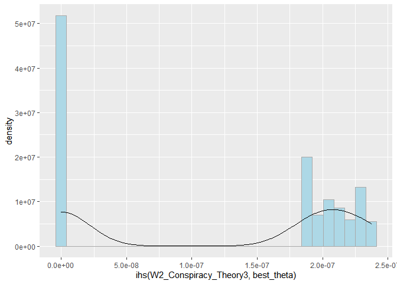
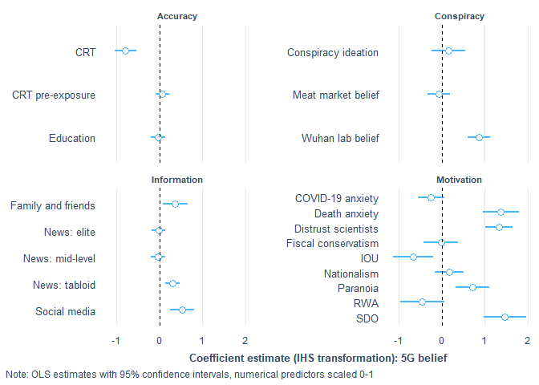
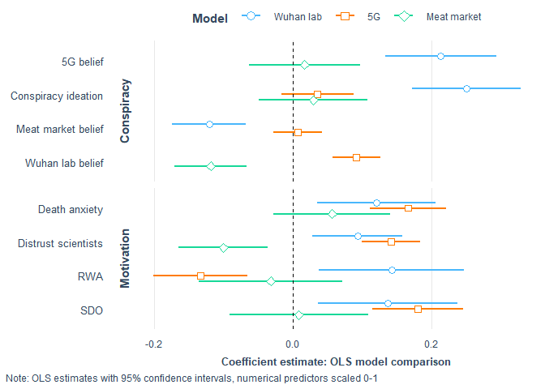

covid\_conspiracies\_markdown2
================
Michael Marshall
21/10/2020

## Loading Packages and Data

``` r
pacman::p_load(tidyverse, stringr, ggridges, forcats, labelled, leaps,
               psych, corrr, cowplot, expss, haven, interplot,
               interactions, jtools,labelled, pscl, psych, 
               sjPlot, skimr, foreign)

load("COVID W1_W2_W3 Cleaned 2878.RData") # needs to be in your wd
```

## Rescaling variable

``` r
## [rescale01] Function to rescale a variable from 0 to 1
rescale01 <- function(x, ...) {
  (x - min(x, ...)) / ((max(x, ...)) - min(x, ...))
}
```

## Summary and distribution of different COVID specific conspiracies

``` r
# plotting density of different covid conspiracies
df %>% 
  dplyr::select(W2_Conspiracy_Theory1:W2_Conspiracy_Theory5) %>% 
  gather(conspiracy_code, belief,
         W2_Conspiracy_Theory1:W2_Conspiracy_Theory5) %>%
  mutate(conspiracy_code = as.factor(conspiracy_code)) %>%
  filter(!conspiracy_code %in% c("W2_Conspiracy_Theory4",
                                 "W2_Conspiracy_Theory5")) %>% 
  ggplot(aes(x = belief, y = conspiracy_code, height = ..density..)) +
  geom_density_ridges(aes(rel_min_height = 0.005),
                      stat = "density",
                      fill = get_colors("CUD Bright",num.colors = 1)) +
  theme_nice() +
  scale_y_discrete(labels = c("Wuhan laboratory","Meat market","5G")) +
  labs(y = NULL, x = "Belief scale (0-100)",
       caption = "Distribution of origin theory belief") +
  theme(plot.caption = element_text(hjust = 0.61,
                                    face = "bold",
                                    size = 10),
        axis.title.x = element_text(size = 8,
                                    hjust = 0.5)
  )
```

<!-- -->

``` r
#pacman::p_load(patchwork)
df %>% 
  dplyr::select(W2_Conspiracy_Theory1:W2_Conspiracy_Theory5) %>% 
  gather(conspiracy_code, belief,
         W2_Conspiracy_Theory1:W2_Conspiracy_Theory5) %>%
  mutate(conspiracy_code = fct_recode(
    as.factor(conspiracy_code),
    "Wuhan laboratory" = "W2_Conspiracy_Theory1",
    "Meat market" = "W2_Conspiracy_Theory2",
    "5G" = "W2_Conspiracy_Theory3",
    "4" = "W2_Conspiracy_Theory4",
    "5" = "W2_Conspiracy_Theory5")
    ) %>%
  filter(!conspiracy_code %in% c("4","5")) %>% 
  mutate(
    order_var = ifelse(conspiracy_code == "Meat market", 1,
                       ifelse(conspiracy_code == "Wuhan laboratory",2,3))
  ) %>% 
  ggplot(aes(x = belief)) +
  geom_density(fill = get_colors("CUD Bright",num.colors = 1),
               alpha = 0.8) +
  theme_nice() +
  facet_wrap(~fct_reorder(conspiracy_code,order_var), 
             scales = "free_y", ncol = 1) +
  labs(y = "Density", 
       x = "Distribution of origin theory belief")
```

    ## Warning: attributes are not identical across measure variables;
    ## they will be dropped

    ## Warning: Removed 4416 rows containing non-finite values (stat_density).

<!-- -->

## Cleaning dataset

The following code filters down to just those observations that have
completed the battery of questions relating to COVID specific
conspiracies. It also creates a tibble counting the missing
observations, which can be useful to have as an object.

``` r
# filtering for completed dependent variable
conspiracies <- df %>% 
  filter(!is.na(W2_Conspiracy_Theory1) |
           !is.na(W2_Conspiracy_Theory2) |
           !is.na(W2_Conspiracy_Theory3) |
           !is.na(W2_Conspiracy_Theory3) |
           !is.na(W2_Conspiracy_Theory4) |
           !is.na(W2_Conspiracy_Theory5)) %>% 
  rename(W1_Housing_tenure = W1_Hosuing_tenure)

# function to count NAs
count_na <- function(x){
  sum(is.na(x))
}

conspiracies %>% 
  dplyr::select(W2_Conspiracy_Theory1:W2_Conspiracy_Theory5) %>% 
  map_int(count_na)
```

    ## W2_Conspiracy_Theory1 W2_Conspiracy_Theory2 W2_Conspiracy_Theory3 
    ##                     0                     0                     0 
    ## W2_Conspiracy_Theory4 W2_Conspiracy_Theory5 
    ##                     0                     0

``` r
missing <- tibble(
  variable = names(conspiracies),
  NAs = conspiracies %>% map_int(count_na)
)

#View(missing)
```

Due to some measurement error in original *W1\_Education\_binary*
variable, the code below overwrites the variable, and creates a dummy
for degree educated respondents (undergrad OR postgrad = 1).

``` r
conspiracies <- conspiracies %>% 
  mutate(
    W1_Education_binary = ifelse(
      W1_Education %in% c(5,7), 1, 0
    )
  )
count(conspiracies, W1_Education, W1_Education_binary)
```

    ## # A tibble: 8 x 3
    ##                  W1_Education W1_Education_binary     n
    ##                     <dbl+lbl>               <dbl> <int>
    ## 1 1 [No qualifications]                         0    47
    ## 2 2 [O-Level/GCSE or similar]                   0   263
    ## 3 3 [A-Level or similar]                        0   241
    ## 4 4 [Technical qualification]                   0   138
    ## 5 5 [Undergraduate degree]                      1   399
    ## 6 6 [Diploma]                                   0    76
    ## 7 7 [Postgraduate degree]                       1   225
    ## 8 8 [Other qualifications]                      0    17

The code below turns the *preferred newspaper* variables into dummy
variables, as they were previously coded as *1=Yes* and everything else
as *NA*.

``` r
# making preferred newspaper dummy variable (i.e. replacing NA with 0)
na_to_zero <- function(x){
  x[is.na(x)] <- 0
  x <- as.numeric(x)
  return(x)
} 

paper_vars <- rep(str_c("W2_Newspaper_prefer",seq(1,11,1)))

conspiracies[paper_vars] <- conspiracies[paper_vars] %>% 
  map_df(na_to_zero)

conspiracies <- conspiracies %>% 
  mutate(
    red_top_tabloid = ifelse(
      W2_Newspaper_prefer3 == 1 | W2_Newspaper_prefer2 == 1 |
        W2_Newspaper_prefer7 == 1 | W2_Newspaper_prefer8 == 1 |
        W2_Newspaper_prefer9 == 1, 1, 0),
    mid_level_news = ifelse(
      W2_Newspaper_prefer1 == 1 | W2_Newspaper_prefer4 == 1, 1, 0),
    elite_news = ifelse(
      W2_Newspaper_prefer5 == 1 | W2_Newspaper_prefer6 == 1 |
        W2_Newspaper_prefer10 == 1 | 
        W2_Newspaper_prefer11 == 1, 1, 0)
  )

conspiracies %>% 
  count(red_top_tabloid, mid_level_news, elite_news)
```

    ## # A tibble: 8 x 4
    ##   red_top_tabloid mid_level_news elite_news     n
    ##             <dbl>          <dbl>      <dbl> <int>
    ## 1               0              0          0   423
    ## 2               0              0          1   317
    ## 3               0              1          0   219
    ## 4               0              1          1    75
    ## 5               1              0          0   163
    ## 6               1              0          1    54
    ## 7               1              1          0    73
    ## 8               1              1          1    82

``` r
# Creating DVs
# [nat] nationalism
nat_keys <- list(nationalism = cs(W2_Nationalism1,W2_Nationalism2))
nat_test <- scoreItems(nat_keys, conspiracies, min = 1, max = 5)
head(nat_test$scores)
```

    ##      nationalism
    ## [1,]           4
    ## [2,]           4
    ## [3,]           4
    ## [4,]           3
    ## [5,]           3
    ## [6,]           3

``` r
nat_test$alpha  # Scale alpha
```

    ##       nationalism
    ## alpha   0.8213221

``` r
conspiracies$nat <- rescale01(nat_test$scores, na.rm = TRUE)
conspiracies$nat <- c(conspiracies$nat)  # Ensure variable is numeric and not matrix class
describe(conspiracies$nat)
```

    ##    vars    n mean   sd median trimmed  mad min max range  skew kurtosis   se
    ## X1    1 1406 0.57 0.25   0.62    0.58 0.19   0   1     1 -0.33    -0.18 0.01

``` r
## [imm.econ] Anti-immigrant sentiment - Economy 
table(conspiracies$W1_MigrantAttitudes1)
```

    ## 
    ##   1   2   3   4   5   6   7   8   9  10 
    ##  71  38  80 105 188 198 264 255  87 120

``` r
conspiracies$imm_econ <- rescale01(abs(
  conspiracies$W1_MigrantAttitudes1 - 11))

conspiracies %>% 
  dplyr::select(W1_MigrantAttitudes1, imm_econ) %>%
  correlate()
```

    ## 
    ## Correlation method: 'pearson'
    ## Missing treated using: 'pairwise.complete.obs'

    ## # A tibble: 2 x 3
    ##   rowname              W1_MigrantAttitudes1 imm_econ
    ##   <chr>                               <dbl>    <dbl>
    ## 1 W1_MigrantAttitudes1                   NA       -1
    ## 2 imm_econ                               -1       NA

``` r
## [imm.res] Anti-immigrant sentiment - Resources
table(conspiracies$W1_MigrantAttitudes3)
```

    ## 
    ##   1   2   3   4   5 
    ##  68 101 575 431 231

``` r
conspiracies$imm_res <- rescale01(conspiracies$W1_MigrantAttitudes3)
conspiracies %>% 
  dplyr::select(W1_MigrantAttitudes3, imm_res) %>%
  correlate()
```

    ## 
    ## Correlation method: 'pearson'
    ## Missing treated using: 'pairwise.complete.obs'

    ## # A tibble: 2 x 3
    ##   rowname              W1_MigrantAttitudes3 imm_res
    ##   <chr>                               <dbl>   <dbl>
    ## 1 W1_MigrantAttitudes3                   NA       1
    ## 2 imm_res                                 1      NA

``` r
## [imm.cul] Anti-immigrant sentiment - Culture
table(conspiracies$W1_MigrantAttitudes2)
```

    ## 
    ##   1   2   3   4   5   6   7   8   9  10 
    ## 101  57  88 120 202 177 225 219  80 137

``` r
conspiracies$imm_cul <- rescale01(abs(
  conspiracies$W1_MigrantAttitudes2 - 11))

conspiracies %>% 
  dplyr::select(W1_MigrantAttitudes2, imm_cul) %>%
  correlate()
```

    ## 
    ## Correlation method: 'pearson'
    ## Missing treated using: 'pairwise.complete.obs'

    ## # A tibble: 2 x 3
    ##   rowname              W1_MigrantAttitudes2 imm_cul
    ##   <chr>                               <dbl>   <dbl>
    ## 1 W1_MigrantAttitudes2                   NA      -1
    ## 2 imm_cul                                -1      NA

``` r
# Right wing authoritarianism
rwa_keys <- list(rwa = cs(W1_Authoritarianism1_R,
                          W1_Authoritarianism2,
                          W1_Authoritarianism3,
                          W1_Authoritarianism4_R, 
                          W1_Authoritarianism5_R,
                          W1_Authoritarianism6))

rwa_test <- scoreItems(rwa_keys, conspiracies, min = 1, max = 5)
head(rwa_test$scores)
```

    ##           rwa
    ## [1,] 2.833333
    ## [2,] 2.666667
    ## [3,] 3.166667
    ## [4,] 3.333333
    ## [5,] 3.000000
    ## [6,] 3.500000

``` r
summary(rwa_test$alpha)  # Scale alpha
```

    ##       rwa        
    ##  Min.   :0.6837  
    ##  1st Qu.:0.6837  
    ##  Median :0.6837  
    ##  Mean   :0.6837  
    ##  3rd Qu.:0.6837  
    ##  Max.   :0.6837

``` r
conspiracies$RWA <- rescale01(rwa_test$scores, na.rm = TRUE)
conspiracies$RWA <- c(conspiracies$RWA)  # Ensure variable is numeric and not matrix class

describe(conspiracies$RWA)
```

    ##    vars    n mean   sd median trimmed  mad min max range  skew kurtosis se
    ## X1    1 1406 0.51 0.17    0.5    0.52 0.12   0   1     1 -0.25      0.3  0

``` r
## [SDO] Social Dominance Orientation
sdo_keys <- list(sdo = cs(W1_Social_Dominance1,
                          W1_Social_Dominance2_R,
                          W1_Social_Dominance3_R,
                          W1_Social_Dominance4,
                          W1_Social_Dominance5_R,
                          W1_Social_Dominance6, 
                          W1_Social_Dominance7,
                          W1_Social_Dominance8_R))
sdo_test <- scoreItems(sdo_keys, conspiracies, min = 1, max = 5)
head(sdo_test$scores)
```

    ##        sdo
    ## [1,] 1.500
    ## [2,] 3.000
    ## [3,] 3.000
    ## [4,] 2.625
    ## [5,] 3.000
    ## [6,] 2.500

``` r
summary(sdo_test$alpha)  # Scale alpha
```

    ##       sdo        
    ##  Min.   :0.8404  
    ##  1st Qu.:0.8404  
    ##  Median :0.8404  
    ##  Mean   :0.8404  
    ##  3rd Qu.:0.8404  
    ##  Max.   :0.8404

``` r
conspiracies$SDO <- rescale01(sdo_test$scores, na.rm = TRUE)
conspiracies$SDO <- c(conspiracies$SDO)  # Ensure variable is numeric and not matrix class

summary(conspiracies$SDO)
```

    ##    Min. 1st Qu.  Median    Mean 3rd Qu.    Max. 
    ##  0.0000  0.2258  0.3871  0.3620  0.5161  1.0000

``` r
## [threat] Covid-19 related Threat
summary(conspiracies$W2_COVID19_anxiety)
```

    ##    Min. 1st Qu.  Median    Mean 3rd Qu.    Max. 
    ##    0.00   50.00   65.00   61.25   80.75  100.00

``` r
conspiracies$threat <- rescale01(conspiracies$W2_COVID19_anxiety)
conspiracies %>% 
  dplyr::select(W2_COVID19_anxiety, threat) %>%
  correlate()
```

    ## 
    ## Correlation method: 'pearson'
    ## Missing treated using: 'pairwise.complete.obs'

    ## # A tibble: 2 x 3
    ##   rowname            W2_COVID19_anxiety threat
    ##   <chr>                           <dbl>  <dbl>
    ## 1 W2_COVID19_anxiety                 NA      1
    ## 2 threat                              1     NA

``` r
## [right] Right-Wing political views
table(conspiracies$W1_Political_Scale)
```

    ## 
    ##   1   2   3   4   5   6   7   8   9  10 
    ##  35  44 116 143 488 221 182 102  36  39

``` r
conspiracies$right <- rescale01(conspiracies$W1_Political_Scale)
conspiracies %>% 
  dplyr::select(W1_Political_Scale, right) %>%
  correlate()
```

    ## 
    ## Correlation method: 'pearson'
    ## Missing treated using: 'pairwise.complete.obs'

    ## # A tibble: 2 x 3
    ##   rowname            W1_Political_Scale right
    ##   <chr>                           <dbl> <dbl>
    ## 1 W1_Political_Scale                 NA     1
    ## 2 right                               1    NA

``` r
## [soc.con] Social conservatism
table(conspiracies$W1_Political_Abortion_SSM)
```

    ## 
    ##   1   2   3   4   5   6   7   8   9  10 
    ## 262 123 175 129 330 124 109  67  31  56

``` r
conspiracies$soc_con <- rescale01(
  conspiracies$W1_Political_Abortion_SSM)
conspiracies %>% 
  dplyr::select(W1_Political_Abortion_SSM, soc_con) %>%
  correlate()
```

    ## 
    ## Correlation method: 'pearson'
    ## Missing treated using: 'pairwise.complete.obs'

    ## # A tibble: 2 x 3
    ##   rowname                   W1_Political_Abortion_SSM soc_con
    ##   <chr>                                         <dbl>   <dbl>
    ## 1 W1_Political_Abortion_SSM                        NA       1
    ## 2 soc_con                                           1      NA

``` r
## [fis.con] Fiscal conservatism
table(conspiracies$W1_Political_Fiscal)
```

    ## 
    ##   1   2   3   4   5   6   7   8   9  10 
    ##  55  43 112 133 430 201 226 121  39  46

``` r
conspiracies$fis_con <- rescale01(conspiracies$W1_Political_Fiscal)
conspiracies %>% 
  dplyr::select(W1_Political_Fiscal, fis_con) %>%
  correlate()
```

    ## 
    ## Correlation method: 'pearson'
    ## Missing treated using: 'pairwise.complete.obs'

    ## # A tibble: 2 x 3
    ##   rowname             W1_Political_Fiscal fis_con
    ##   <chr>                             <dbl>   <dbl>
    ## 1 W1_Political_Fiscal                  NA       1
    ## 2 fis_con                               1      NA

``` r
## [age.c] Age (in years)
summary(conspiracies$W2_Age_year)
```

    ##    Min. 1st Qu.  Median    Mean 3rd Qu.    Max. 
    ##   18.00   37.00   50.00   49.32   61.00   88.00

``` r
conspiracies$age_sc <- rescale01(conspiracies$W2_Age_year)
```

``` r
# conspiracy ideation alpha
consp_keys <- list(consp = cs(W1_Conspiracy_1,
                          W1_Conspiracy_2,
                          W1_Conspiracy_3,
                          W1_Conspiracy_4,
                          W1_Conspiracy_5))
consp_test <- scoreItems(consp_keys, conspiracies, min = 1, max = 11)
```

    ## Number of categories should be increased  in order to count frequencies.

``` r
head(consp_test$scores)
```

    ##      consp
    ## [1,]   5.8
    ## [2,]   9.0
    ## [3,]   7.0
    ## [4,]   8.6
    ## [5,]   6.0
    ## [6,]   8.8

``` r
consp_test$alpha  # Scale alpha
```

    ##           consp
    ## alpha 0.8537269

``` r
cor(consp_test$scores, conspiracies$W1_Conspiracy_Total)
```

    ##       [,1]
    ## consp    1

``` r
# uncertainty alpha
iou_keys <- list(iou = cs(W2_IOU1, W2_IOU2,W2_IOU3, W2_IOU4,
                          W2_IOU5, W2_IOU5,W2_IOU6,W2_IOU7,
                          W2_IOU7,W2_IOU8,W2_IOU9,W2_IOU10,
                          W2_IOU11,W2_IOU12))
iou_test <- scoreItems(iou_keys, conspiracies, min = 1, max = 5)
head(iou_test$scores)
```

    ##           iou
    ## [1,] 3.416667
    ## [2,] 3.916667
    ## [3,] 4.250000
    ## [4,] 3.083333
    ## [5,] 3.000000
    ## [6,] 2.500000

``` r
iou_test$alpha  # Scale alpha
```

    ##             iou
    ## alpha 0.9097412

``` r
cor(iou_test$scores, conspiracies$W2_IOU_Total)
```

    ##     [,1]
    ## iou    1

``` r
# paranoia alpha
par_keys <- list(par = cs(W2_Paranoia1,
                        W2_Paranoia2,
                        W2_Paranoia3, W2_Paranoia4, W2_Paranoia5))
par_test <- scoreItems(par_keys, conspiracies, min = 1, max = 5)
head(par_test$scores)
```

    ##      par
    ## [1,] 1.6
    ## [2,] 3.4
    ## [3,] 3.8
    ## [4,] 1.4
    ## [5,] 3.0
    ## [6,] 2.4

``` r
par_test$alpha  # Scale alpha
```

    ##             par
    ## alpha 0.8557798

``` r
cor(par_test$scores, conspiracies$W2_Paranoia_Total)
```

    ##     [,1]
    ## par    1

``` r
# dai alpha
dai_keys <- list(dai = cs(W2_DAI1,W2_DAI2,W2_DAI3,W2_DAI4,W2_DAI5,
                        W2_DAI6,W2_DAI7,W2_DAI8,W2_DAI9,W2_DAI10,
                        W2_DAI11, W2_DAI12, W2_DAI13,W2_DAI14,
                        W2_DAI15,W2_DAI16,W2_DAI17))
dai_test <- scoreItems(dai_keys, conspiracies, min = 1, max = 5)
head(dai_test$scores)
```

    ##           dai
    ## [1,] 1.764706
    ## [2,] 2.529412
    ## [3,] 1.941176
    ## [4,] 2.117647
    ## [5,] 3.000000
    ## [6,] 2.588235

``` r
dai_test$alpha  # Scale alpha
```

    ##            dai
    ## alpha 0.937162

``` r
cor(dai_test$scores, conspiracies$W2_DAI_Total)
```

    ##     [,1]
    ## dai    1

``` r
factors <- c("W1_Ethnicity","W1_C19_Infected","W1_BornUK","W1_EURef",
             "W2_Gender_binary","W2_Living_alone","W2_Employment",
             "W1_Housing_tenure")
```

``` r
# turning the above list into factors with the levels as the spss labels
#for(i in seq_along(conspiracies[factors])){
#  conspiracies[factors][,i] <- to_factor(
#    conspiracies[factors][,i], nolabel_to_na = TRUE)
#}
```

``` r
# turning to factors
conspiracies[factors] <- conspiracies[factors] %>% 
  map_df(as.factor)
```

``` r
# Making a binary for each CRT scale, baseline = incorrect answer
conspiracies$CRT1 <- ifelse(
  to_factor(conspiracies$W1_CRT1) == "5 pence", 1, 0
)

conspiracies$CRT2 <- ifelse(
  to_factor(conspiracies$W1_CRT2) == "5 minutes", 1, 0
)

conspiracies$CRT3 <- ifelse(
  to_factor(conspiracies$W1_CRT3) == "47 days", 1, 0
)

conspiracies$CRT4 <- ifelse(
  to_factor(conspiracies$W1_CRT4) == "2nd", 1, 0
)

conspiracies$CRT5 <- ifelse(
  to_factor(conspiracies$W1_CRT5) == "8", 1, 0
)

conspiracies$CRT_test <- ifelse(
  to_factor(conspiracies$W1_CRT_test) == "None of them.", 1, 0
) # baseline = heard of some of them OR all of them
```

``` r
# CRT
crt_keys <- list(crt = cs(CRT1,
                          CRT2,
                          CRT3,
                          CRT4, 
                          CRT5
                          ))

crt_test <- scoreItems(crt_keys, conspiracies, min = 0, max = 1)
head(crt_test$scores)
```

    ##      crt
    ## [1,] 0.2
    ## [2,] 0.4
    ## [3,] 0.0
    ## [4,] 0.2
    ## [5,] 0.0
    ## [6,] 0.0

``` r
summary(crt_test$alpha)  # Scale alpha
```

    ##       crt        
    ##  Min.   :0.7332  
    ##  1st Qu.:0.7332  
    ##  Median :0.7332  
    ##  Mean   :0.7332  
    ##  3rd Qu.:0.7332  
    ##  Max.   :0.7332

``` r
conspiracies$crt <- rescale01(crt_test$scores, na.rm = TRUE)
conspiracies$crt <- c(conspiracies$crt)  # Ensure variable is numeric and not matrix class

describe(conspiracies$crt)
```

    ##    vars    n mean   sd median trimmed mad min max range skew kurtosis   se
    ## X1    1 1406 0.39 0.33    0.4    0.36 0.3   0   1     1 0.41    -1.06 0.01

``` r
# renaming trust in science
conspiracies <- conspiracies %>% 
  rename(distrust_science = W2_Trust_Body6)
```

``` r
# rescaling the remaing numeric variables
numerics <- c("W1_Conspiracy_Total","W2_Paranoia_Total",
              "W2_Internal_Total","W2_Chance_Total","W2_PO_Total",
              "W2_DAI_Total","W2_IOU_Total", "W2_INFO_5",
              "W2_INFO_9","distrust_science","W1_Income_2019")

conspiracies[numerics] <- conspiracies[numerics] %>% 
  map_df(rescale01, na.rm = TRUE)
```

``` r
# creating scaled versions of each conspiracy belief
conspiracies$conspiracy1_sc <- rescale01(
  conspiracies$W2_Conspiracy_Theory1, na.rm = TRUE
)

conspiracies$conspiracy2_sc <- rescale01(
  conspiracies$W2_Conspiracy_Theory2, na.rm = TRUE
)

conspiracies$conspiracy3_sc <- rescale01(
  conspiracies$W2_Conspiracy_Theory3, na.rm = TRUE
)

conspiracies$conspiracy4_sc <- rescale01(
  conspiracies$W2_Conspiracy_Theory4, na.rm = TRUE
)

conspiracies$conspiracy5_sc <- rescale01(
  conspiracies$W2_Conspiracy_Theory5, na.rm = TRUE
)
```

## Distribution of variables

A for loop to look at distribution of potential independent variables
(numeric only).

``` r
plot_vars <- conspiracies %>% 
  dplyr::select(
    one_of(numerics),nat,RWA,SDO,threat,right,soc_con,fis_con
    ) %>%
  names()

for(i in seq_along(plot_vars)){
  
  x1 <- conspiracies[plot_vars][i] %>% as_vector()
  
  print(
    ggplot(data = NULL, aes(x = x1)) +
      geom_vline(aes(xintercept = mean(x1, na.rm =TRUE)), 
                 colour = "black",
                 linetype = "dashed") +
      geom_vline(aes(xintercept = median(x1, na.rm =TRUE)), 
                 colour = "red",
                 linetype = "dashed") +
      geom_density(fill = "lightblue", alpha = 0.7) +
      labs(x = plot_vars[i],
           caption = "Black = Mean, Red = Median")  
  )
  
}
```

<!-- --><!-- --><!-- --><!-- --><!-- --><!-- --><!-- --><!-- --><!-- -->

    ## Warning: Removed 4 rows containing non-finite values (stat_density).

<!-- --><!-- --><!-- --><!-- --><!-- --><!-- --><!-- --><!-- --><!-- -->

# Modelling for belief in Chinese lab origin

## DV Chinese lab conspiracy - singular IV models

``` r
sdo_lab <- lm(conspiracy1_sc ~ SDO,
              data = conspiracies)

summ(sdo_lab)
```

    ## MODEL INFO:
    ## Observations: 1406
    ## Dependent Variable: conspiracy1_sc
    ## Type: OLS linear regression 
    ## 
    ## MODEL FIT:
    ## F(1,1404) = 65.28, p = 0.00
    ## R² = 0.04
    ## Adj. R² = 0.04 
    ## 
    ## Standard errors: OLS
    ## -----------------------------------------------
    ##                     Est.   S.E.   t val.      p
    ## ----------------- ------ ------ -------- ------
    ## (Intercept)         0.24   0.02    12.34   0.00
    ## SDO                 0.39   0.05     8.08   0.00
    ## -----------------------------------------------

``` r
rwa_lab <- lm(conspiracy1_sc ~ RWA,
              data = conspiracies)

summ(rwa_lab)
```

    ## MODEL INFO:
    ## Observations: 1406
    ## Dependent Variable: conspiracy1_sc
    ## Type: OLS linear regression 
    ## 
    ## MODEL FIT:
    ## F(1,1404) = 87.72, p = 0.00
    ## R² = 0.06
    ## Adj. R² = 0.06 
    ## 
    ## Standard errors: OLS
    ## -----------------------------------------------
    ##                     Est.   S.E.   t val.      p
    ## ----------------- ------ ------ -------- ------
    ## (Intercept)         0.14   0.03     5.07   0.00
    ## RWA                 0.47   0.05     9.37   0.00
    ## -----------------------------------------------

## DV Chinese lab conspiracy - socio-economic variables

``` r
se_lab <- lm(conspiracy1_sc ~ W2_Gender_binary +
               W1_Education_binary +
               W1_Income_2019 +
               age_sc,
              data = conspiracies)

summary(se_lab)$adj.r.squared
```

    ## [1] 0.04693264

``` r
AIC(se_lab)
```

    ## [1] 827.0941

## DV Chinese lab conspiracy - socio-economic variables + political/media

``` r
se_pol_lab <- update(se_lab, ~ . +
                   #political and media variables
                   right +
                   soc_con +
                   fis_con +
                   nat +
                   distrust_science + #distrust of scientists
                   red_top_tabloid + 
                   mid_level_news + 
                   elite_news + 
                   W2_INFO_5 + #social media
                   W2_INFO_9 #family and friends
                 )

summary(se_pol_lab)$adj.r.squared
```

    ## [1] 0.1997379

``` r
AIC(se_pol_lab)
```

    ## [1] 589.0989

## DV Chinese lab conspiracy - socio-economic variables + political/media + pol-psych

``` r
se_polpsych_lab <- update(se_pol_lab, ~ . +
                        #political-psychology variables
                        SDO +
                        RWA +
                        W2_DAI_Total +
                        W2_IOU_Total +
                        W2_Paranoia_Total)

summary(se_polpsych_lab)$adj.r.squared
```

    ## [1] 0.2318945

``` r
AIC(se_polpsych_lab)
```

    ## [1] 536.6595

``` r
car::vif(se_polpsych_lab)
```

    ## Registered S3 methods overwritten by 'car':
    ##   method                          from
    ##   influence.merMod                lme4
    ##   cooks.distance.influence.merMod lme4
    ##   dfbeta.influence.merMod         lme4
    ##   dfbetas.influence.merMod        lme4

    ##    W2_Gender_binary W1_Education_binary      W1_Income_2019              age_sc 
    ##            1.124494            1.204661            1.187470            1.461332 
    ##               right             soc_con             fis_con                 nat 
    ##            2.073982            1.684322            2.111886            1.342183 
    ##    distrust_science     red_top_tabloid      mid_level_news          elite_news 
    ##            1.157102            1.097013            1.130635            1.146559 
    ##           W2_INFO_5           W2_INFO_9                 SDO                 RWA 
    ##            1.396521            1.225676            1.501220            1.531435 
    ##        W2_DAI_Total        W2_IOU_Total   W2_Paranoia_Total 
    ##            1.514592            1.519102            1.645075

Looking at mulitcollinearity below for the following variables:

  - right  
  - soc\_con  
  - fis\_con

<!-- end list -->

``` r
# looking for potential multicollinearity with right
cor_mat <- model.matrix(se_polpsych_lab) %>% as.data.frame()

cor_vec <- rep(NA,ncol(cor_mat))
for(i in seq_along(cor_mat)){
  cor_vec[i] <- cor(cor_mat$right,cor_mat[,i])
}
```

    ## Warning in cor(cor_mat$right, cor_mat[, i]): the standard deviation is zero

``` r
tibble(cor_vec,
       names(cor_mat)) %>% 
  arrange(desc(cor_vec))
```

    ## # A tibble: 20 x 2
    ##     cor_vec `names(cor_mat)`   
    ##       <dbl> <chr>              
    ##  1  1       right              
    ##  2  0.668   fis_con            
    ##  3  0.460   soc_con            
    ##  4  0.445   SDO                
    ##  5  0.379   nat                
    ##  6  0.376   RWA                
    ##  7  0.239   mid_level_news     
    ##  8  0.135   age_sc             
    ##  9  0.112   W1_Income_2019     
    ## 10  0.0618  distrust_science   
    ## 11  0.0471  W2_DAI_Total       
    ## 12  0.0244  red_top_tabloid    
    ## 13 -0.00278 W2_INFO_9          
    ## 14 -0.0105  W2_IOU_Total       
    ## 15 -0.0118  W2_Paranoia_Total  
    ## 16 -0.0224  W2_INFO_5          
    ## 17 -0.0621  W2_Gender_binary2  
    ## 18 -0.100   W1_Education_binary
    ## 19 -0.107   elite_news         
    ## 20 NA       (Intercept)

Fiscal conservatism positively correlated with right-left scale.

``` r
# looking for multicollinearity with soc_con
cor_vec2 <- rep(NA,ncol(cor_mat))
for(i in seq_along(cor_mat)){
  cor_vec2[i] <- cor(cor_mat$soc_con,cor_mat[,i])
}
```

    ## Warning in cor(cor_mat$soc_con, cor_mat[, i]): the standard deviation is zero

``` r
tibble(cor_vec2,
       names(cor_mat)) %>% 
  arrange(desc(cor_vec2))
```

    ## # A tibble: 20 x 2
    ##    cor_vec2 `names(cor_mat)`   
    ##       <dbl> <chr>              
    ##  1  1       soc_con            
    ##  2  0.503   fis_con            
    ##  3  0.460   right              
    ##  4  0.448   RWA                
    ##  5  0.380   SDO                
    ##  6  0.261   nat                
    ##  7  0.199   distrust_science   
    ##  8  0.192   mid_level_news     
    ##  9  0.151   W2_DAI_Total       
    ## 10  0.114   W2_Paranoia_Total  
    ## 11  0.0862  red_top_tabloid    
    ## 12  0.0590  W2_IOU_Total       
    ## 13  0.0545  age_sc             
    ## 14  0.0196  W2_INFO_9          
    ## 15  0.00762 W2_INFO_5          
    ## 16 -0.0327  W1_Income_2019     
    ## 17 -0.0957  W1_Education_binary
    ## 18 -0.115   W2_Gender_binary2  
    ## 19 -0.165   elite_news         
    ## 20 NA       (Intercept)

Fiscal conservatism, right-wing scale and RWA correlated with soc\_con.

``` r
# looking for multicollinearity with fis_con
cor_vec3 <- rep(NA,ncol(cor_mat))
for(i in seq_along(cor_mat)){
  cor_vec3[i] <- cor(cor_mat$fis_con,cor_mat[,i])
}
```

    ## Warning in cor(cor_mat$fis_con, cor_mat[, i]): the standard deviation is zero

``` r
tibble(cor_vec3,
       names(cor_mat)) %>% 
  arrange(desc(cor_vec3))
```

    ## # A tibble: 20 x 2
    ##     cor_vec3 `names(cor_mat)`   
    ##        <dbl> <chr>              
    ##  1  1.00     fis_con            
    ##  2  0.668    right              
    ##  3  0.503    soc_con            
    ##  4  0.404    SDO                
    ##  5  0.381    nat                
    ##  6  0.362    RWA                
    ##  7  0.216    mid_level_news     
    ##  8  0.131    W1_Income_2019     
    ##  9  0.128    age_sc             
    ## 10  0.0478   distrust_science   
    ## 11  0.0262   W2_DAI_Total       
    ## 12  0.00732  red_top_tabloid    
    ## 13  0.00628  W2_Paranoia_Total  
    ## 14 -0.000640 W2_INFO_9          
    ## 15 -0.00242  W2_IOU_Total       
    ## 16 -0.0680   W2_INFO_5          
    ## 17 -0.0803   W2_Gender_binary2  
    ## 18 -0.0951   W1_Education_binary
    ## 19 -0.101    elite_news         
    ## 20 NA        (Intercept)

Right, soc\_con correlated with fis\_con.

Potential multicollinearity between right, soc\_con and fis\_con. From
hereon, fis\_con is included in the models, as of the three, it shows
the smallest positive correlation between SDO and RWA.

## DV Chinese lab belief - model above minus the aforementioned variables

``` r
se_polpsych_lab_2 <- lm(conspiracy1_sc ~
                        
                        #socio-economic variables
                        W2_Gender_binary +
                        W1_Education_binary +
                        W1_Income_2019 +
                        age_sc +
                        
                        #political and media variables
                        fis_con +
                        nat +
                        distrust_science +
                        red_top_tabloid + 
                        mid_level_news + 
                        elite_news + 
                        W2_INFO_5 + #social media
                        W2_INFO_9 + #family and friends
                     
                        #political-psychology variables
                        SDO +
                        RWA +
                        W2_DAI_Total +
                        W2_IOU_Total +
                        W2_Paranoia_Total,
                      data = conspiracies)

summary(se_polpsych_lab_2)$adj.r.squared
```

    ## [1] 0.2326659

``` r
AIC(se_polpsych_lab_2)
```

    ## [1] 533.2814

``` r
car::vif(se_polpsych_lab_2)
```

    ##    W2_Gender_binary W1_Education_binary      W1_Income_2019              age_sc 
    ##            1.098837            1.201285            1.176832            1.456423 
    ##             fis_con                 nat    distrust_science     red_top_tabloid 
    ##            1.438614            1.325048            1.129812            1.095277 
    ##      mid_level_news          elite_news           W2_INFO_5           W2_INFO_9 
    ##            1.121732            1.142737            1.393844            1.225232 
    ##                 SDO                 RWA        W2_DAI_Total        W2_IOU_Total 
    ##            1.430246            1.400792            1.504814            1.519093 
    ##   W2_Paranoia_Total 
    ##            1.640482

All VIFs now below 2. AIC has also slightly improved for more
parsimonious model.

## DV Chinese lab conspiracy - socio-economic variables + political/media + pol-psych + covid-threat + CRT

``` r
multi_lab <- update(se_polpsych_lab_2, ~ . +
                  #covid-anxety
                  threat +
                  
                  #CRT
                  crt +
                  CRT_test)

summary(multi_lab)$adj.r.squared
```

    ## [1] 0.245787

``` r
AIC(multi_lab)
```

    ## [1] 512.1097

## DV Chinese lab conspiracy - full model incl. conspiracy ideation

``` r
full_lab <- update(multi_lab, ~ . + 
                  #conspiracies
                  W1_Conspiracy_Total +
                  conspiracy2_sc +
                  conspiracy3_sc)

summary(full_lab)$adj.r.squared
```

    ## [1] 0.2910173

``` r
AIC(full_lab)
```

    ## [1] 428.5413

# Modelling for belief in 5G origin conspiracy

## Plots of DV, incl. inverse hyperbolic sine transformation

``` r
# functions for IHS transformation
ihs <- function(x, theta){  # IHS transformation
  asinh(theta * x)/theta
}

ihs_loglik <- function(theta,x){
  
  ihs <- function(x, theta){  # function to IHS transform
    asinh(theta * x)/theta
  }
  
  n <- length(x)
  xt <- ihs(x, theta)
  
  log_lik <- -n*log(sum((xt - mean(xt))^2))- sum(log(1+theta^2*x^2))
  return(log_lik)
}     
```

``` r
best_theta <- optimize(ihs_loglik, 
                       lower = 0.00001, upper = 1e+06,
                       x = conspiracies$W2_Conspiracy_Theory3, 
                       maximum = TRUE)$maximum
best_theta # continues to rise indefinitely
```

    ## [1] 1e+06

``` r
# trying different starting point
best_theta <- optimize(ihs_loglik, 
                       lower = 0.001, upper = 1e+08,
                       x = conspiracies$W2_Conspiracy_Theory3, 
                       maximum = TRUE)$maximum
best_theta # continues to rise indefinitely
```

    ## [1] 1e+08

``` r
# raw data 
conspiracies %>% 
  ggplot(aes(x = W2_Conspiracy_Theory3)) +
  geom_histogram(aes(y = ..density..),
                 colour = "darkgrey", fill = "lightblue") +
  geom_density()
```

    ## `stat_bin()` using `bins = 30`. Pick better value with `binwidth`.

<!-- -->

``` r
# ihs transformation where theta = 1
conspiracies %>% 
  ggplot(aes(x = asinh(W2_Conspiracy_Theory3))) +
  geom_histogram(aes(y = ..density..),
                 colour = "darkgrey", fill = "lightblue") +
  geom_density()
```

    ## `stat_bin()` using `bins = 30`. Pick better value with `binwidth`.

<!-- -->

``` r
# ihs transformation where theta = 1e+08
conspiracies %>% 
  ggplot(aes(x = ihs(W2_Conspiracy_Theory3, best_theta))) +
  geom_histogram(aes(y = ..density..),
                 colour = "darkgrey", fill = "lightblue") +
  geom_density()
```

    ## `stat_bin()` using `bins = 30`. Pick better value with `binwidth`.

<!-- -->

``` r
# transforming using theta = 1
conspiracies <- conspiracies %>% 
  mutate(w2_conspiracy3_ihs = asinh(W2_Conspiracy_Theory3))
```

## DV 5G conspiracy - singular IV models

``` r
sdo_5g <- lm(conspiracy3_sc ~ SDO,
              data = conspiracies)

summ(sdo_5g)
```

    ## MODEL INFO:
    ## Observations: 1406
    ## Dependent Variable: conspiracy3_sc
    ## Type: OLS linear regression 
    ## 
    ## MODEL FIT:
    ## F(1,1404) = 82.37, p = 0.00
    ## R² = 0.06
    ## Adj. R² = 0.05 
    ## 
    ## Standard errors: OLS
    ## -----------------------------------------------
    ##                     Est.   S.E.   t val.      p
    ## ----------------- ------ ------ -------- ------
    ## (Intercept)         0.01   0.01     0.57   0.57
    ## SDO                 0.29   0.03     9.08   0.00
    ## -----------------------------------------------

``` r
rwa_5g <- lm(conspiracy3_sc ~ RWA,
              data = conspiracies)

summ(rwa_5g)
```

    ## MODEL INFO:
    ## Observations: 1406
    ## Dependent Variable: conspiracy3_sc
    ## Type: OLS linear regression 
    ## 
    ## MODEL FIT:
    ## F(1,1404) = 2.80, p = 0.09
    ## R² = 0.00
    ## Adj. R² = 0.00 
    ## 
    ## Standard errors: OLS
    ## -----------------------------------------------
    ##                     Est.   S.E.   t val.      p
    ## ----------------- ------ ------ -------- ------
    ## (Intercept)         0.08   0.02     4.40   0.00
    ## RWA                 0.06   0.03     1.67   0.09
    ## -----------------------------------------------

## DV 5G conspiracy - socio-economic variables

``` r
se_5g <- lm(conspiracy3_sc ~ W2_Gender_binary +
               W1_Education_binary +
               W1_Income_2019 +
               age_sc,
              data = conspiracies)

#function for adj.r.squared
adj_rsq <- function(mod){
  out <- summary(mod)$adj.r.squared
  return(out)
}

adj_rsq(se_5g)
```

    ## [1] 0.05624114

``` r
AIC(se_5g)
```

    ## [1] -355.7797

## DV 5G conspiracy - socio-economic variables + political/media

As with modelling above, fis\_con is included instead of soc\_con and
right to avoid multicollinearity problem.

``` r
se_pol_5g <- update(se_5g, ~ . +
                   #political and media variables
                   fis_con +
                   nat +
                   distrust_science + 
                   red_top_tabloid + 
                   mid_level_news + 
                   elite_news + 
                   W2_INFO_5 + #social media
                   W2_INFO_9) # family and friends

adj_rsq(se_pol_5g)
```

    ## [1] 0.1953188

``` r
AIC(se_pol_5g)
```

    ## [1] -576.62

## DV 5G conspiracy - socio-economic variables + political/media + pol-psych

``` r
se_polpsych_5g <- update(se_pol_5g, ~ . +
                        #political-psychology variables
                        SDO +
                        RWA +
                        W2_DAI_Total +
                        W2_IOU_Total +
                        W2_Paranoia_Total)

adj_rsq(se_polpsych_5g)
```

    ## [1] 0.2704548

``` r
AIC(se_polpsych_5g)
```

    ## [1] -708.8129

## DV 5G conspiracy - socio-economic variables + political/media + pol-psych + covid-threat

``` r
multi_5g <- update(se_polpsych_5g, ~ . +
                  #covid-anxiety
                  threat +
                 
                  # crt
                  crt +
                  CRT_test)

adj_rsq(multi_5g)
```

    ## [1] 0.2823862

``` r
AIC(multi_5g)
```

    ## [1] -728.9244

## DV 5G conspiracy - socio-economic variables + political/media + pol-psych + covid-threat and CRT + conspiracies

``` r
full_5g <- update(multi_5g, ~ . +
                #conspiracies
                W1_Conspiracy_Total +
                conspiracy1_sc +
                conspiracy2_sc)

adj_rsq(full_5g)
```

    ## [1] 0.2974117

``` r
AIC(full_5g)
```

    ## [1] -755.5769

## DV 5G IHS conspiracy - singular IV models

``` r
sdo_5g_ihs <- lm(w2_conspiracy3_ihs ~ SDO,
              data = conspiracies)

summ(sdo_5g_ihs)
```

    ## MODEL INFO:
    ## Observations: 1406
    ## Dependent Variable: w2_conspiracy3_ihs
    ## Type: OLS linear regression 
    ## 
    ## MODEL FIT:
    ## F(1,1404) = 107.63, p = 0.00
    ## R² = 0.07
    ## Adj. R² = 0.07 
    ## 
    ## Standard errors: OLS
    ## -----------------------------------------------
    ##                     Est.   S.E.   t val.      p
    ## ----------------- ------ ------ -------- ------
    ## (Intercept)         0.56   0.10     5.56   0.00
    ## SDO                 2.58   0.25    10.37   0.00
    ## -----------------------------------------------

``` r
rwa_5g_ihs <- lm(w2_conspiracy3_ihs ~ RWA,
              data = conspiracies)

summ(rwa_5g_ihs)
```

    ## MODEL INFO:
    ## Observations: 1406
    ## Dependent Variable: w2_conspiracy3_ihs
    ## Type: OLS linear regression 
    ## 
    ## MODEL FIT:
    ## F(1,1404) = 23.23, p = 0.00
    ## R² = 0.02
    ## Adj. R² = 0.02 
    ## 
    ## Standard errors: OLS
    ## -----------------------------------------------
    ##                     Est.   S.E.   t val.      p
    ## ----------------- ------ ------ -------- ------
    ## (Intercept)         0.82   0.15     5.64   0.00
    ## RWA                 1.30   0.27     4.82   0.00
    ## -----------------------------------------------

## DV 5G IHS conspiracy - socio-economic variables

``` r
se_5g_ihs <- lm(w2_conspiracy3_ihs ~ W2_Gender_binary +
               W1_Education_binary +
               W1_Income_2019 +
               age_sc,
              data = conspiracies)

adj_rsq(se_5g_ihs)
```

    ## [1] 0.05804877

``` r
AIC(se_5g_ihs)
```

    ## [1] 5443

## DV 5G IHS conspiracy - socio-economic variables + political/media

As with modelling above, fis\_con is included instead of soc\_con and
right to avoid multicollinearity problem.

``` r
se_pol_5g_ihs <- update(se_5g_ihs, ~ . +
                   #political and media variables
                   fis_con +
                   nat +
                   distrust_science + 
                   red_top_tabloid + 
                   mid_level_news + 
                   elite_news + 
                   W2_INFO_5 + #social media
                   W2_INFO_9)

adj_rsq(se_pol_5g_ihs)
```

    ## [1] 0.227997

``` r
AIC(se_pol_5g_ihs)
```

    ## [1] 5152.522

## DV 5G IHS conspiracy - socio-economic variables + political/media + pol-psych

``` r
se_polpsych_5g_ihs <- update(se_pol_5g_ihs, ~ . +
                        #political-psychology variables
                        SDO +
                        RWA +
                        W2_DAI_Total +
                        W2_IOU_Total +
                        W2_Paranoia_Total)

adj_rsq(se_polpsych_5g_ihs)
```

    ## [1] 0.3062904

``` r
AIC(se_polpsych_5g_ihs)
```

    ## [1] 5007.864

## DV 5G IHS conspiracy - socio-economic variables + political/media + pol-psych + covid-threat

``` r
multi_5g_ihs <- update(se_polpsych_5g_ihs, ~ . +
                  #covid-anxiety
                  threat +
                 
                  # crt
                  crt +
                  CRT_test)

adj_rsq(multi_5g_ihs)
```

    ## [1] 0.3301339

``` r
AIC(multi_5g_ihs)
```

    ## [1] 4961.891

## DV 5G IHS conspiracy - socio-economic variables + political/media + pol-psych + covid-threat and CRT + conspiracies

``` r
full_5g_ihs <- update(multi_5g_ihs, ~ . +
                #conspiracies
                W1_Conspiracy_Total +
                conspiracy1_sc +
                conspiracy2_sc)

adj_rsq(full_5g_ihs)
```

    ## [1] 0.350952

``` r
AIC(full_5g_ihs)
```

    ## [1] 4920.673

``` r
summ(full_5g_ihs, vifs = TRUE)
```

    ## MODEL INFO:
    ## Observations: 1399 (7 missing obs. deleted)
    ## Dependent Variable: w2_conspiracy3_ihs
    ## Type: OLS linear regression 
    ## 
    ## MODEL FIT:
    ## F(23,1375) = 33.87, p = 0.00
    ## R² = 0.36
    ## Adj. R² = 0.35 
    ## 
    ## Standard errors: OLS
    ## ---------------------------------------------------------------
    ##                              Est.   S.E.   t val.      p    VIF
    ## ------------------------- ------- ------ -------- ------ ------
    ## (Intercept)                  0.00   0.28     0.00   1.00       
    ## W2_Gender_binary2            0.08   0.08     0.96   0.34   1.12
    ## W1_Education_binary         -0.03   0.08    -0.32   0.75   1.23
    ## W1_Income_2019              -0.13   0.11    -1.17   0.24   1.21
    ## age_sc                      -0.05   0.21    -0.25   0.80   1.52
    ## fis_con                     -0.02   0.20    -0.12   0.91   1.44
    ## nat                          0.17   0.17     0.97   0.33   1.36
    ## distrust_science             1.33   0.16     8.18   0.00   1.19
    ## red_top_tabloid              0.31   0.09     3.46   0.00   1.11
    ## mid_level_news              -0.03   0.09    -0.31   0.76   1.15
    ## elite_news                  -0.01   0.08    -0.17   0.86   1.15
    ## W2_INFO_5                    0.53   0.14     3.81   0.00   1.43
    ## W2_INFO_9                    0.37   0.15     2.49   0.01   1.26
    ## SDO                          1.46   0.25     5.78   0.00   1.49
    ## RWA                         -0.46   0.26    -1.74   0.08   1.45
    ## W2_DAI_Total                 1.37   0.21     6.44   0.00   1.60
    ## W2_IOU_Total                -0.67   0.24    -2.80   0.01   1.59
    ## W2_Paranoia_Total            0.71   0.20     3.60   0.00   1.67
    ## threat                      -0.25   0.16    -1.57   0.12   1.23
    ## crt                         -0.79   0.13    -6.08   0.00   1.33
    ## CRT_test                     0.07   0.08     0.82   0.41   1.11
    ## W1_Conspiracy_Total          0.15   0.20     0.75   0.46   1.14
    ## conspiracy1_sc               0.86   0.13     6.47   0.00   1.41
    ## conspiracy2_sc              -0.07   0.14    -0.55   0.59   1.09
    ## ---------------------------------------------------------------

## DV 5G conspiracy poisson regression model

``` r
# looking at mean and variance to check for overdispersion
conspiracies %>% 
  mutate(
    sdo_deciles = cut_number(SDO,10)
  ) %>%
  group_by(sdo_deciles) %>% 
  summarise(
    mean_5g = mean(W2_Conspiracy_Theory3),
    var_5g = sd(W2_Conspiracy_Theory3) ^ 2
  )
```

    ## `summarise()` ungrouping output (override with `.groups` argument)

    ## # A tibble: 10 x 3
    ##    sdo_deciles    mean_5g var_5g
    ##    <fct>            <dbl>  <dbl>
    ##  1 [0,0.0968]        3.77   171.
    ##  2 (0.0968,0.194]    5.95   285.
    ##  3 (0.194,0.258]     5.11   250.
    ##  4 (0.258,0.323]     6.52   228.
    ##  5 (0.323,0.387]     8.72   316.
    ##  6 (0.387,0.452]    11.6    479.
    ##  7 (0.452,0.484]    11.2    418.
    ##  8 (0.484,0.516]    26.1    894.
    ##  9 (0.516,0.548]    18.2    749.
    ## 10 (0.548,1]        13.2    544.

``` r
conspiracies %>% 
  mutate(
    social_media = cut_interval(W2_INFO_5,5)
  ) %>%
  group_by(social_media) %>% 
  summarise(
    mean_5g = mean(W2_Conspiracy_Theory3),
    var_5g = sd(W2_Conspiracy_Theory3) ^ 2
  )
```

    ## `summarise()` ungrouping output (override with `.groups` argument)

    ## # A tibble: 4 x 3
    ##   social_media mean_5g var_5g
    ##   <fct>          <dbl>  <dbl>
    ## 1 [0,0.2]         6.11   252.
    ## 2 (0.2,0.4]      10.9    405.
    ## 3 (0.6,0.8]      19.1    786.
    ## 4 (0.8,1]        20.3    886.

The tables above suggest overdispersion of the data. As a result,
running quasipoisson model.

``` r
full_5g_poiss <- glm(W2_Conspiracy_Theory3 ~
                           #socio-economic variables
                           W2_Gender_binary +
                           W1_Education_binary +
                           W1_Income_2019 +
                           age_sc +
                           
                           #political and media variables
                           fis_con +
                           nat +
                           distrust_science + #distrust of scientists
                           red_top_tabloid + 
                           mid_level_news + 
                           elite_news + 
                           W2_INFO_5 + #social media
                           W2_INFO_9 + #family and friends
                           
                           #political-psychology variables
                           SDO +
                           RWA +
                           W2_DAI_Total +
                           W2_IOU_Total +
                           W2_Paranoia_Total +
                           
                           #covid-anxiety
                           threat +
                           
                           #crt
                           crt +
                           CRT_test +
                           
                           #conspiracies
                           W1_Conspiracy_Total +
                           conspiracy1_sc +
                           conspiracy2_sc,
                         family = "quasipoisson", data = conspiracies)

summ(full_5g_poiss)
```

    ## Note: Pseudo-R2 for quasibinomial/quasipoisson families is calculated by
    ## refitting the fitted and null models as binomial/poisson.

    ## MODEL INFO:
    ## Observations: 1399 (7 missing obs. deleted)
    ## Dependent Variable: W2_Conspiracy_Theory3
    ## Type: Generalized linear model
    ##   Family: quasipoisson 
    ##   Link function: log 
    ## 
    ## MODEL FIT:
    ## <U+03C7>²(23) = 17116.85, p = 0.00
    ## Pseudo-R² (Cragg-Uhler) = 1.00
    ## Pseudo-R² (McFadden) = 0.39
    ## AIC =  NA, BIC =  NA 
    ## 
    ## Standard errors: MLE
    ## --------------------------------------------------------
    ##                              Est.   S.E.   t val.      p
    ## ------------------------- ------- ------ -------- ------
    ## (Intercept)                  0.83   0.33     2.51   0.01
    ## W2_Gender_binary2            0.00   0.09     0.03   0.98
    ## W1_Education_binary         -0.05   0.10    -0.48   0.63
    ## W1_Income_2019              -0.07   0.14    -0.48   0.63
    ## age_sc                      -0.57   0.24    -2.34   0.02
    ## fis_con                     -0.06   0.22    -0.29   0.77
    ## nat                          0.01   0.21     0.07   0.95
    ## distrust_science             0.87   0.17     5.25   0.00
    ## red_top_tabloid              0.34   0.09     3.68   0.00
    ## mid_level_news              -0.02   0.09    -0.26   0.80
    ## elite_news                   0.05   0.10     0.54   0.59
    ## W2_INFO_5                    0.25   0.16     1.50   0.13
    ## W2_INFO_9                    0.40   0.17     2.28   0.02
    ## SDO                          1.76   0.31     5.71   0.00
    ## RWA                         -0.51   0.33    -1.52   0.13
    ## W2_DAI_Total                 1.42   0.26     5.49   0.00
    ## W2_IOU_Total                -1.01   0.27    -3.75   0.00
    ## W2_Paranoia_Total            0.86   0.24     3.66   0.00
    ## threat                      -0.19   0.19    -1.00   0.32
    ## crt                         -0.85   0.18    -4.71   0.00
    ## CRT_test                    -0.00   0.09    -0.05   0.96
    ## W1_Conspiracy_Total          0.43   0.23     1.88   0.06
    ## conspiracy1_sc               0.90   0.16     5.55   0.00
    ## conspiracy2_sc              -0.16   0.16    -0.97   0.33
    ## --------------------------------------------------------
    ## 
    ## Estimated dispersion parameter = 28.87

# Modelling for belief in Chinese meat market origin

## DV Chinese meat market - singular IV models

``` r
sdo_meat <- lm(conspiracy2_sc ~ SDO,
              data = conspiracies)

summ(sdo_meat)
```

    ## MODEL INFO:
    ## Observations: 1406
    ## Dependent Variable: conspiracy2_sc
    ## Type: OLS linear regression 
    ## 
    ## MODEL FIT:
    ## F(1,1404) = 0.01, p = 0.91
    ## R² = 0.00
    ## Adj. R² = -0.00 
    ## 
    ## Standard errors: OLS
    ## -----------------------------------------------
    ##                     Est.   S.E.   t val.      p
    ## ----------------- ------ ------ -------- ------
    ## (Intercept)         0.64   0.02    36.94   0.00
    ## SDO                 0.00   0.04     0.11   0.91
    ## -----------------------------------------------

``` r
rwa_meat <- lm(conspiracy2_sc ~ RWA,
              data = conspiracies)

summ(rwa_meat)
```

    ## MODEL INFO:
    ## Observations: 1406
    ## Dependent Variable: conspiracy2_sc
    ## Type: OLS linear regression 
    ## 
    ## MODEL FIT:
    ## F(1,1404) = 0.91, p = 0.34
    ## R² = 0.00
    ## Adj. R² = -0.00 
    ## 
    ## Standard errors: OLS
    ## -----------------------------------------------
    ##                     Est.   S.E.   t val.      p
    ## ----------------- ------ ------ -------- ------
    ## (Intercept)         0.62   0.02    25.31   0.00
    ## RWA                 0.04   0.05     0.96   0.34
    ## -----------------------------------------------

## DV Chinese meat market belief - socio-economic variables

``` r
se_meat <- lm(conspiracy2_sc ~ W2_Gender_binary +
               W1_Education_binary +
               W1_Income_2019 +
               age_sc,
              data = conspiracies)

adj_rsq(se_meat)
```

    ## [1] 0.009737859

``` r
AIC(se_meat)
```

    ## [1] 468.9749

## DV Chinese meat market belief - socio-economic variables + political/media

``` r
se_pol_meat <- update(se_meat, ~ . +
                   #political and media variables
                   fis_con +
                   nat +
                   distrust_science + 
                   red_top_tabloid + 
                   mid_level_news + 
                   elite_news + 
                   W2_INFO_5 + #social media
                   W2_INFO_9) #family and friends
                 
adj_rsq(se_pol_meat)
```

    ## [1] 0.03722417

``` r
AIC(se_pol_meat)
```

    ## [1] 436.2872

## DV Chinese meat market belief - socio-economic variables + political/media + pol-psych

``` r
se_polpsych_meat <- update(se_pol_meat, ~ . +
                        #political-psychology variables
                        SDO +
                        RWA +
                        W2_DAI_Total +
                        W2_IOU_Total +
                        W2_Paranoia_Total)

adj_rsq(se_polpsych_meat)
```

    ## [1] 0.05007784

``` r
AIC(se_polpsych_meat)
```

    ## [1] 422.4278

## DV Chinese meat market belief - socio-economic variables + political/media + pol-psych + covid-threat + CRT

``` r
multi_meat <- update(se_polpsych_meat, ~ . +
                  #covid-anxiety
                  threat +
                  
                  #CRT
                  crt +
                  CRT_test)

adj_rsq(multi_meat)
```

    ## [1] 0.05868675

``` r
AIC(multi_meat)
```

    ## [1] 412.6488

## DV Chinese meat market belief - full model incl. conspiracy ideation

``` r
full_meat <- update(multi_meat, ~ . +
                  #conspiracies
                  W1_Conspiracy_Total +
                  conspiracy1_sc +
                  conspiracy3_sc)

adj_rsq(full_meat)
```

    ## [1] 0.07016915

``` r
AIC(full_meat)
```

    ## [1] 398.4295

# Summary of final models

``` r
# setting up groups -----------------------------------------
#accuracy <- c("crt","CRT_test","W1_Education_binary1")
accuracy <- c("crt","CRT_test","W1_Education_binary")
names(accuracy) <- c("CRT","CRT pre-exposure","Education")

motivation <- c("threat","W2_DAI_Total","distrust_science",
                "fis_con","W2_IOU_Total",
                "nat","W2_Paranoia_Total",
                "RWA","SDO")
names(motivation) <- c("COVID-19 anxiety","Death anxiety",
                       "Distrust scientists","Fiscal conservatism",
                       "IOU","Nationalism","Paranoia",
                       "RWA","SDO")

inform <- c("W2_INFO_9","elite_news","mid_level_news",
            "red_top_tabloid","W2_INFO_5")
names(inform) <- c("Family and friends","News: elite",
                   "News: mid-level","News: tabloid","Social media")

conspiracy <- c("W1_Conspiracy_Total","conspiracy2_sc","conspiracy1_sc",
                "conspiracy3_sc")
names(conspiracy) <- c("Conspiracy ideation","Meat market belief",
                       "Wuhan lab belief","5G belief")
full_list <- c(accuracy, motivation, inform, conspiracy)
```

``` r
# chinese lab figure 
plot_coefs(
  full_lab,
  coefs = full_list,
  groups = list(
    Accuracy = names(accuracy), 
    Motivation = names(motivation), 
    Information = names(inform), 
    Conspiracy = names(conspiracy)
  ),
  #facet.label.pos = "left",
  facet.cols = 2
) +
  labs(x = "Coefficient estimate: Wuhan laboratory belief",
       caption = "Note: OLS estimates with 95% confidence intervals, numerical predictors scaled 0-1") +
  theme(strip.text.x = element_text(size = 8),
        axis.title.x = element_text(size = 10),
        axis.text.y = element_text(hjust = 1),
        plot.caption = element_text(hjust = 0))
```

    ## Loading required namespace: broom.mixed

    ## Registered S3 method overwritten by 'broom.mixed':
    ##   method      from 
    ##   tidy.gamlss broom

<!-- -->

``` r
summ(full_lab, vifs = TRUE)
```

    ## MODEL INFO:
    ## Observations: 1399 (7 missing obs. deleted)
    ## Dependent Variable: conspiracy1_sc
    ## Type: OLS linear regression 
    ## 
    ## MODEL FIT:
    ## F(23,1375) = 25.95, p = 0.00
    ## R² = 0.30
    ## Adj. R² = 0.29 
    ## 
    ## Standard errors: OLS
    ## ---------------------------------------------------------------
    ##                              Est.   S.E.   t val.      p    VIF
    ## ------------------------- ------- ------ -------- ------ ------
    ## (Intercept)                 -0.07   0.06    -1.25   0.21       
    ## W2_Gender_binary2            0.01   0.02     0.85   0.39   1.12
    ## W1_Education_binary         -0.04   0.02    -2.68   0.01   1.22
    ## W1_Income_2019              -0.03   0.02    -1.16   0.25   1.21
    ## age_sc                       0.02   0.04     0.36   0.72   1.52
    ## fis_con                      0.02   0.04     0.58   0.56   1.44
    ## nat                          0.11   0.03     3.20   0.00   1.35
    ## distrust_science             0.09   0.03     2.80   0.01   1.23
    ## red_top_tabloid              0.04   0.02     2.32   0.02   1.12
    ## mid_level_news               0.10   0.02     5.88   0.00   1.12
    ## elite_news                  -0.01   0.02    -0.60   0.55   1.15
    ## W2_INFO_5                    0.04   0.03     1.43   0.15   1.43
    ## W2_INFO_9                    0.10   0.03     3.36   0.00   1.26
    ## SDO                          0.14   0.05     2.66   0.01   1.51
    ## RWA                          0.14   0.05     2.66   0.01   1.46
    ## W2_DAI_Total                 0.12   0.04     2.78   0.01   1.63
    ## W2_IOU_Total                -0.11   0.05    -2.21   0.03   1.60
    ## W2_Paranoia_Total            0.08   0.04     2.06   0.04   1.69
    ## threat                       0.09   0.03     2.82   0.00   1.22
    ## crt                         -0.06   0.03    -2.47   0.01   1.34
    ## CRT_test                     0.02   0.02     1.45   0.15   1.11
    ## W1_Conspiracy_Total          0.25   0.04     6.26   0.00   1.11
    ## conspiracy2_sc              -0.12   0.03    -4.47   0.00   1.08
    ## conspiracy3_sc               0.21   0.04     5.22   0.00   1.42
    ## ---------------------------------------------------------------

``` r
par(mfrow = c(2,2))
plot(full_lab)
```

<!-- -->

``` r
# 5G belief - full set of variables, raw data is DV
plot_coefs(
  full_5g,
  coefs = full_list,
  groups = list(
    Accuracy = names(accuracy), 
    Motivation = names(motivation), 
    Information = names(inform), 
    Conspiracy = names(conspiracy)
  ),
  #facet.label.pos = "left",
  facet.cols = 2
) +
  labs(x = "Coefficient estimate: 5G belief",
       caption = "Note: OLS estimates with 95% confidence intervals, numerical predictors scaled 0-1") +
  theme(strip.text.x = element_text(size = 8),
        axis.title.x = element_text(size = 10),
        axis.text.y = element_text(hjust = 1),
        plot.caption = element_text(hjust = 0))
```

<!-- -->

``` r
summ(full_5g, vifs = TRUE)
```

    ## MODEL INFO:
    ## Observations: 1399 (7 missing obs. deleted)
    ## Dependent Variable: conspiracy3_sc
    ## Type: OLS linear regression 
    ## 
    ## MODEL FIT:
    ## F(23,1375) = 26.73, p = 0.00
    ## R² = 0.31
    ## Adj. R² = 0.30 
    ## 
    ## Standard errors: OLS
    ## ---------------------------------------------------------------
    ##                              Est.   S.E.   t val.      p    VIF
    ## ------------------------- ------- ------ -------- ------ ------
    ## (Intercept)                 -0.04   0.04    -1.09   0.28       
    ## W2_Gender_binary2           -0.01   0.01    -0.66   0.51   1.12
    ## W1_Education_binary         -0.00   0.01    -0.27   0.78   1.23
    ## W1_Income_2019              -0.01   0.01    -0.92   0.36   1.21
    ## age_sc                      -0.03   0.03    -1.09   0.28   1.52
    ## fis_con                      0.02   0.03     0.60   0.55   1.44
    ## nat                          0.02   0.02     0.89   0.37   1.36
    ## distrust_science             0.14   0.02     6.59   0.00   1.19
    ## red_top_tabloid              0.05   0.01     4.02   0.00   1.11
    ## mid_level_news              -0.01   0.01    -0.49   0.62   1.15
    ## elite_news                   0.01   0.01     0.98   0.33   1.15
    ## W2_INFO_5                    0.05   0.02     2.94   0.00   1.43
    ## W2_INFO_9                    0.06   0.02     3.27   0.00   1.26
    ## SDO                          0.18   0.03     5.40   0.00   1.49
    ## RWA                         -0.13   0.03    -3.83   0.00   1.45
    ## W2_DAI_Total                 0.17   0.03     5.92   0.00   1.60
    ## W2_IOU_Total                -0.10   0.03    -3.19   0.00   1.59
    ## W2_Paranoia_Total            0.12   0.03     4.53   0.00   1.67
    ## threat                      -0.03   0.02    -1.57   0.12   1.23
    ## crt                         -0.08   0.02    -4.43   0.00   1.33
    ## CRT_test                    -0.01   0.01    -0.62   0.53   1.11
    ## W1_Conspiracy_Total          0.04   0.03     1.33   0.18   1.14
    ## conspiracy1_sc               0.09   0.02     5.22   0.00   1.41
    ## conspiracy2_sc               0.01   0.02     0.40   0.69   1.09
    ## ---------------------------------------------------------------

``` r
par(mfrow = c(2,2))
plot(full_5g)
```

<!-- -->

``` r
# plot for IHS model
plot_coefs(
  full_5g_ihs,
  coefs = full_list,
  groups = list(
    Accuracy = names(accuracy), 
    Motivation = names(motivation), 
    Information = names(inform), 
    Conspiracy = names(conspiracy)
  ),
  #facet.label.pos = "left",
  facet.cols = 2
) +
  labs(x = "Coefficient estimate (IHS transformation): 5G belief",
       caption = "Note: OLS estimates with 95% confidence intervals, numerical predictors scaled 0-1") +
  theme(strip.text.x = element_text(size = 8),
        axis.title.x = element_text(size = 10),
        axis.text.y = element_text(hjust = 1),
        plot.caption = element_text(hjust = 0))
```

<!-- -->

``` r
# 5G belief - full set of variables and poisson
plot_coefs(
  full_5g_poiss,
  coefs = full_list,
  groups = list(
    Accuracy = names(accuracy), 
    Motivation = names(motivation), 
    Information = names(inform), 
    Conspiracy = names(conspiracy)
  ),
  #facet.label.pos = "left",
  facet.cols = 2
) +
  labs(x = "Coefficient estimate (poisson): 5G belief",
       caption = "Note: Poisson regression estimated using maximum likelihood method, with 95% confidence intervals.\nOverdispersion parameter = 28.87. Numerical predictors scaled 0-1") +
  theme(strip.text.x = element_text(size = 8),
        axis.title.x = element_text(size = 10),
        axis.text.y = element_text(hjust = 1),
        plot.caption = element_text(hjust = 0))
```

<!-- -->

``` r
summary(full_5g_poiss)
```

    ## 
    ## Call:
    ## glm(formula = W2_Conspiracy_Theory3 ~ W2_Gender_binary + W1_Education_binary + 
    ##     W1_Income_2019 + age_sc + fis_con + nat + distrust_science + 
    ##     red_top_tabloid + mid_level_news + elite_news + W2_INFO_5 + 
    ##     W2_INFO_9 + SDO + RWA + W2_DAI_Total + W2_IOU_Total + W2_Paranoia_Total + 
    ##     threat + crt + CRT_test + W1_Conspiracy_Total + conspiracy1_sc + 
    ##     conspiracy2_sc, family = "quasipoisson", data = conspiracies)
    ## 
    ## Deviance Residuals: 
    ##      Min        1Q    Median        3Q       Max  
    ## -12.8567   -3.1427   -1.9808   -0.2994   25.5214  
    ## 
    ## Coefficients:
    ##                      Estimate Std. Error t value Pr(>|t|)    
    ## (Intercept)          0.831938   0.331763   2.508 0.012269 *  
    ## W2_Gender_binary2    0.002259   0.090285   0.025 0.980043    
    ## W1_Education_binary -0.047542   0.098421  -0.483 0.629140    
    ## W1_Income_2019      -0.067898   0.141786  -0.479 0.632105    
    ## age_sc              -0.571377   0.244625  -2.336 0.019649 *  
    ## fis_con             -0.062760   0.218822  -0.287 0.774301    
    ## nat                  0.014085   0.209647   0.067 0.946444    
    ## distrust_science     0.872438   0.166202   5.249 1.77e-07 ***
    ## red_top_tabloid      0.340844   0.092654   3.679 0.000244 ***
    ## mid_level_news      -0.024209   0.093591  -0.259 0.795932    
    ## elite_news           0.052110   0.096673   0.539 0.589948    
    ## W2_INFO_5            0.246595   0.163854   1.505 0.132562    
    ## W2_INFO_9            0.397321   0.174051   2.283 0.022595 *  
    ## SDO                  1.759826   0.308397   5.706 1.41e-08 ***
    ## RWA                 -0.508617   0.333884  -1.523 0.127904    
    ## W2_DAI_Total         1.422954   0.259350   5.487 4.87e-08 ***
    ## W2_IOU_Total        -1.013358   0.270182  -3.751 0.000184 ***
    ## W2_Paranoia_Total    0.864591   0.236443   3.657 0.000265 ***
    ## threat              -0.192892   0.193181  -0.999 0.318213    
    ## crt                 -0.845253   0.179270  -4.715 2.66e-06 ***
    ## CRT_test            -0.004344   0.093237  -0.047 0.962850    
    ## W1_Conspiracy_Total  0.432881   0.230623   1.877 0.060729 .  
    ## conspiracy1_sc       0.903748   0.162772   5.552 3.38e-08 ***
    ## conspiracy2_sc      -0.160190   0.164679  -0.973 0.330853    
    ## ---
    ## Signif. codes:  0 '***' 0.001 '**' 0.01 '*' 0.05 '.' 0.1 ' ' 1
    ## 
    ## (Dispersion parameter for quasipoisson family taken to be 28.87415)
    ## 
    ##     Null deviance: 41421  on 1398  degrees of freedom
    ## Residual deviance: 24304  on 1375  degrees of freedom
    ##   (7 observations deleted due to missingness)
    ## AIC: NA
    ## 
    ## Number of Fisher Scoring iterations: 6

``` r
# Chinese meat market model - full set of variables
plot_coefs(
  full_meat,
  coefs = full_list,
  groups = list(
    Accuracy = names(accuracy), 
    Motivation = names(motivation), 
    Information = names(inform), 
    Conspiracy = names(conspiracy)
  ),
  #facet.label.pos = "left",
  facet.cols = 2
) +
  labs(x = "Coefficient estimate: Meat market belief",
       caption = "Note: OLS estimates with 95% confidence intervals, numerical predictors scaled 0-1") +
  theme(strip.text.x = element_text(size = 8),
        axis.title.x = element_text(size = 10),
        axis.text.y = element_text(hjust = 1),
        plot.caption = element_text(hjust = 0))
```

<!-- -->

``` r
summ(full_meat, vifs = TRUE)
```

    ## MODEL INFO:
    ## Observations: 1399 (7 missing obs. deleted)
    ## Dependent Variable: conspiracy2_sc
    ## Type: OLS linear regression 
    ## 
    ## MODEL FIT:
    ## F(23,1375) = 5.59, p = 0.00
    ## R² = 0.09
    ## Adj. R² = 0.07 
    ## 
    ## Standard errors: OLS
    ## ---------------------------------------------------------------
    ##                              Est.   S.E.   t val.      p    VIF
    ## ------------------------- ------- ------ -------- ------ ------
    ## (Intercept)                  0.42   0.05     7.84   0.00       
    ## W2_Gender_binary2           -0.00   0.02    -0.12   0.90   1.12
    ## W1_Education_binary         -0.04   0.02    -2.35   0.02   1.23
    ## W1_Income_2019               0.05   0.02     2.31   0.02   1.20
    ## age_sc                       0.05   0.04     1.08   0.28   1.52
    ## fis_con                      0.03   0.04     0.77   0.44   1.44
    ## nat                          0.16   0.03     4.67   0.00   1.33
    ## distrust_science            -0.10   0.03    -3.06   0.00   1.22
    ## red_top_tabloid              0.01   0.02     0.34   0.73   1.13
    ## mid_level_news               0.02   0.02     1.02   0.31   1.15
    ## elite_news                   0.02   0.02     1.12   0.26   1.15
    ## W2_INFO_5                   -0.01   0.03    -0.43   0.67   1.44
    ## W2_INFO_9                   -0.01   0.03    -0.18   0.86   1.27
    ## SDO                          0.01   0.05     0.17   0.87   1.52
    ## RWA                         -0.03   0.05    -0.60   0.55   1.46
    ## W2_DAI_Total                 0.06   0.04     1.31   0.19   1.64
    ## W2_IOU_Total                 0.13   0.05     2.79   0.01   1.59
    ## W2_Paranoia_Total           -0.06   0.04    -1.57   0.12   1.69
    ## threat                       0.13   0.03     4.10   0.00   1.21
    ## crt                          0.02   0.03     0.73   0.46   1.34
    ## CRT_test                    -0.01   0.02    -0.50   0.61   1.11
    ## W1_Conspiracy_Total          0.03   0.04     0.73   0.47   1.14
    ## conspiracy1_sc              -0.12   0.03    -4.47   0.00   1.41
    ## conspiracy3_sc               0.02   0.04     0.40   0.69   1.45
    ## ---------------------------------------------------------------

``` r
par(mfrow = c(2,2))
plot(full_meat)
```

<!-- -->

## Combined plot of models

``` r
motivation_sub <- motivation[c("Death anxiety","Distrust scientists",
                               "RWA","SDO")]

model_vars <- c(motivation_sub,conspiracy)

model_vars <- model_vars[sort(names(model_vars))]

plot_coefs(
  full_lab,full_5g,full_meat,
  model.names = c("Wuhan lab","5G","Meat market"),
  coefs = model_vars,
  groups = list(
    Motivation = names(motivation_sub),
    Conspiracy = names(conspiracy)
    ),
  facet.label.pos = "left" 
  ) +
  labs(
    x = "Coefficient estimate: OLS model comparison",
    caption = "Note: OLS estimates with 95% confidence intervals, numerical predictors scaled 0-1"
  ) + 
  theme(legend.position = "top",
        legend.margin=margin(t = 0, b = 0, unit='cm'),
        axis.title.x = element_text(size = 10),
        axis.text.y = element_text(hjust = 1),
        plot.caption = element_text(hjust = 0))
```

<!-- -->

## Conspiracies and social distancing

``` r
# loading package for multi nom
pacman::p_load(nnet)
```

``` r
## making a dataset of variables included in the models above
## plus DV's for social distancing and vaccination

vars <- model.matrix(full_lab)[,-1] %>% as.data.frame() %>% names()
vars <- c(vars,"w2_conspiracy3_ihs","W2_Internal_Total",
          "W2_Chance_Total","W2_Conspiracy_Theory1",
          "W2_Conspiracy_Theory2","W2_Conspiracy_Theory3",
          "W2_Conspiracy_Theory4","W2_Conspiracy_Theory5",
          "conspiracy4_sc","conspiracy5_sc","conspiracy1_sc",
          "W2_PO_Total","pid","right","soc_con")
vars[1] <- str_sub(vars[1],1,str_length(vars[1])-1)
#vars[2] <- str_sub(vars[2],1,str_length(vars[2])-1)

conspiracies2 <- conspiracies %>% 
  dplyr::select(one_of(vars)) %>% 
  na.omit()

conspiracies2 <- merge(
  conspiracies2,
  conspiracies %>% dplyr::select(pid,W2_SocialDistance10,
                                 W2_SocialDistance11,
                                 W2_SocialDistance12,
                                 W2_SocialDistance14,
                                 W2_C19_Vax_Self,
                                 W2_C19_Vax_Child),
  by = "pid", all.x = TRUE
)
```

``` r
# social distance scale
sd_keys <- list(sd = cs(W2_SocialDistance10,
                        W2_SocialDistance11,
                        W2_SocialDistance12,
                        W2_SocialDistance14))

sd_test <- scoreItems(sd_keys, conspiracies2, min = 1, max = 5)
head(sd_test$scores)
```

    ##        sd
    ## [1,] 5.00
    ## [2,] 3.25
    ## [3,] 4.00
    ## [4,] 4.75
    ## [5,] 3.00
    ## [6,] 3.75

``` r
summary(sd_test$alpha)  # Scale alpha
```

    ##        sd        
    ##  Min.   :0.8735  
    ##  1st Qu.:0.8735  
    ##  Median :0.8735  
    ##  Mean   :0.8735  
    ##  3rd Qu.:0.8735  
    ##  Max.   :0.8735

``` r
conspiracies2$social_distance <- rescale01(sd_test$scores, na.rm = TRUE)
conspiracies2$social_distance <- c(conspiracies2$social_distance)  # Ensure variable is numeric and not matrix class

describe(conspiracies2$social_distance)
```

    ##    vars    n mean   sd median trimmed  mad min max range  skew kurtosis se
    ## X1    1 1399 0.82 0.19   0.88    0.85 0.19   0   1     1 -1.05     1.17  0

``` r
ggplot(conspiracies2, aes(x = social_distance)) +
  geom_histogram(aes(y = ..density..),
                 binwidth = 0.1, colour = "black", fill = "lightblue") +
  geom_density()
```

<!-- -->

``` r
dist_full <- lm(social_distance ~ 
                  #socio-economic variables
                  W2_Gender_binary +
                  W1_Education_binary +
                  W1_Income_2019 +
                  age_sc +
                  
                  #political and media variables
                  fis_con +
                  nat +
                  distrust_science + 
                  red_top_tabloid + 
                  mid_level_news + 
                  elite_news +
                  W2_INFO_5 + #social media
                  W2_INFO_9 + #family and friends
                  
                  #political-psychology variables
                  SDO +
                  RWA +
                  W2_DAI_Total +
                  W2_IOU_Total +
                  W2_Paranoia_Total +
                  
                  #covid-anxiety
                  threat +
                 
                  #CRT
                  crt +
                  CRT_test +
                  
                  #conspiracies
                  W1_Conspiracy_Total +
                  conspiracy1_sc +
                  conspiracy2_sc +
                  conspiracy3_sc,
                data = conspiracies2)
```

``` r
# social distance model plot
socio_dem <- c("age_sc","W2_Gender_binary2")
names(socio_dem) <- c("Age","Gender")
motivation2 <- motivation[c("COVID-19 anxiety","Death anxiety",
                            "Distrust scientists","IOU",
                            "Paranoia","RWA","SDO")]
inform2 <- inform["Family and friends"]

plot_coefs(
  dist_full,
  coefs = c(socio_dem,motivation2,inform2,conspiracy),
  groups = list(
    Demographic = names(socio_dem), 
    Motivation = names(motivation2), 
    Information = names(inform2), 
    Conspiracy = names(conspiracy)
  ),
  #facet.label.pos = "left",
  facet.cols = 2
) +
  labs(x = "Coefficient estimate: Social distancing",
       caption = "Note: OLS estimates with 95% confidence intervals, numerical predictors scaled 0-1") +
  theme(strip.text.x = element_text(size = 8),
        axis.title.x = element_text(size = 10),
        axis.text.y = element_text(hjust = 1),
        plot.caption = element_text(hjust = 0))
```

<!-- -->

``` r
par(mfrow = c(2,2))
plot(dist_full)
```

<!-- -->

## Multinomial model for vaccine acceptance

``` r
count(conspiracies2,sum()) %>%  mutate(`%` = n / sum(n))
```

    ##   sum()    n %
    ## 1     0 1399 1

``` r
# multinomial model
vax_full <- multinom(W2_C19_Vax_Self ~ 
                  #socio-economic variables
                  W2_Gender_binary +
                  W1_Education_binary +
                  W1_Income_2019 +
                  age_sc +
                  
                  #political and media variables
                  fis_con +
                  nat +
                  distrust_science + 
                  red_top_tabloid + 
                  mid_level_news + 
                  elite_news +
                  W2_INFO_5 + #social media
                  W2_INFO_9 + #family and friends
                  
                  #political-psychology variables
                  SDO +
                  RWA +
                  W2_DAI_Total +
                  W2_IOU_Total +
                  W2_Paranoia_Total +
                  
                  #covid-anxiety
                  threat +
                 
                  #CRT
                  crt +
                  CRT_test +
                  
                  #conspiracies
                  W1_Conspiracy_Total +
                  conspiracy1_sc +
                  conspiracy2_sc +
                  conspiracy3_sc,
                data = conspiracies2)
```

    ## # weights:  78 (50 variable)
    ## initial  value 1527.071081 
    ## iter  10 value 1000.955333
    ## iter  20 value 984.346159
    ## iter  30 value 983.450947
    ## iter  40 value 983.425315
    ## final  value 983.425255 
    ## converged

``` r
# functions to inspect multinom
z_score <- function(model){
  z <- summary(model)$coefficients/summary(model)$standard.errors
  return(z)
}

p_value <- function(model){
  z <- z_score(model)
  p <- (1 - pnorm(abs(z), 0, 1)) * 2
  return(p)
}
```

``` r
p_value(vax_full)
```

    ##   (Intercept) W2_Gender_binary2 W1_Education_binary W1_Income_2019       age_sc
    ## 2   0.1806944        0.36313602            0.491365   0.4737461413 3.684517e-05
    ## 3   0.4552857        0.04567513            0.569486   0.0002548759 4.543805e-03
    ##     fis_con        nat distrust_science red_top_tabloid mid_level_news
    ## 2 0.9742113 0.05540649     4.348572e-08       0.3409613      0.4157866
    ## 3 0.7301823 0.02516502     2.245908e-03       0.4684389      0.6781281
    ##   elite_news W2_INFO_5 W2_INFO_9       SDO       RWA W2_DAI_Total W2_IOU_Total
    ## 2  0.7949013 0.3729641 0.4346733 0.5096732 0.2311160    0.6418725    0.3057625
    ## 3  0.1803655 0.3974288 0.9450827 0.6826486 0.2603301    0.8420325    0.6432661
    ##   W2_Paranoia_Total      threat       crt  CRT_test W1_Conspiracy_Total
    ## 2        0.06302608 5.04418e-05 0.2911543 0.9855441          0.85442621
    ## 3        0.27943399 5.23516e-06 0.4562290 0.9754098          0.04626571
    ##   conspiracy1_sc conspiracy2_sc conspiracy3_sc
    ## 2      0.0218868     0.01008258   2.383814e-05
    ## 3      0.7258857     0.05146090   8.649999e-01

``` r
fuller_list <- c(full_list,socio_dem,"W1_Income_2019")
names(fuller_list) <- c(names(full_list),names(socio_dem),"Income")

vax_plots <- fuller_list[c("Age","Gender",
                        "Income","COVID-19 anxiety",
                        "Distrust scientists","Nationalism",
                        "RWA","SDO",
                        "Conspiracy ideation",
                        "Meat market belief",
                        "Wuhan lab belief",
                        "5G belief")]

# table for plot of unstandardised coefficients
tidies <- tidy(vax_full) %>%
  filter(term %in% vax_plots) %>% 
  mutate(
    odds_ratio = exp(estimate),
    conf.low = estimate - std.error * qnorm(0.975),
    conf.high = estimate + std.error * qnorm(0.975),
    conf.low.exp = exp(estimate - std.error * qnorm(0.975)),
    conf.high.exp = exp(estimate + std.error * qnorm(0.975)),
    y.level = fct_recode(as.factor(y.level),
                         "No" = "2",
                         "Maybe" = "3"),
    term = fct_rev(fct_drop(fct_relevel(term, vax_plots))),
    group_facet = ifelse(term %in% accuracy, 
                         "Accuracy",
                         ifelse(term %in% motivation, "Motivation",
                                ifelse(term %in% conspiracy, "Conspiracy",
                                       "Demographic"))),
    term = fct_recode(term,
                      "Age" = "age_sc",
                      "Gender" = "W2_Gender_binary2",
                      "Income" = "W1_Income_2019",
                      "COVID-19 anxiety" = "threat",
                      "Distrust scientists" = "distrust_science",
                      "Nationalism" = "nat",
                      "RWA" = "RWA",
                      "SDO" = "SDO",
                      "Conspiracy ideation" = "W1_Conspiracy_Total",
                      "Meat market belief" = "conspiracy2_sc",
                      "Wuhan lab belief" = "conspiracy1_sc",
                      "5G belief" = "conspiracy3_sc")
    ) %>%
  rename(Level = y.level)  

# plot of unstandardised coefficients 
ggplot(data = tidies, 
       aes(y = term, 
           x = estimate, xmin = conf.low,
           xmax = conf.high, colour = Level)) + 
  geom_vline(xintercept = 0, linetype = 2, size = .25) +
  ggstance::geom_linerangeh(
    aes(y = term, xmin = conf.low,
        xmax = conf.high, colour = Level),
    position = ggstance::position_dodgev(height = 0.62), size = 0.8) +
  geom_point(
    aes(y = term, 
        x = estimate, colour = Level, shape = Level),
    position = ggstance::position_dodgev(height = 0.62),
    fill = "white", size = 3, stroke = 1, show.legend = TRUE) +
  scale_colour_manual(values = get_colors("CUD Bright",num.colors = 2)) +
  theme_nice(legend.pos = "right") +
  scale_shape_manual(values = c(21,22)) +
  drop_y_gridlines() +
  facet_wrap(~group_facet, ncol = 1, scales = "free_y",
             strip.position = "left") +
  theme(axis.title.y = element_blank(),
        legend.margin=margin(t = 0, b = 0, unit='cm'),
        axis.title.x = element_text(size = 10),
        axis.text.y = element_text(size = 10,
                                   hjust = 1),
        panel.grid.major.x = element_line(linetype = "solid"),
        strip.text.x = element_text(size = 8),
        legend.position = "top") +
  labs(
    x = "Estimate: Vaccine acceptance"
  ) 
```

<!-- -->

Below is a plot of the average marginal effects for key variables.

``` r
pacman::p_load(margins, ggstance)

# average marginal effect for "No", with bootstrap for variance
set.seed(123)
margin_no <- margins_summary(
  vax_full, category = "2",
  vce = "bootstrap"
)

# average marginal effect for "Maybe", with bootstrap for variance
set.seed(123)
margin_maybe <- margins_summary(
  vax_full, category = "3",
  vce = "bootstrap"
)
```

``` r
# plotting average marginal effect
rbind(
  margin_no %>% as_tibble() %>% mutate(level = "No"),
  margin_maybe %>% as_tibble() %>% mutate(level = "Maybe")
) %>%
  rename(term = factor) %>% 
  filter(term %in% vax_plots) %>%
  mutate(
    term = fct_rev(fct_drop(fct_relevel(term, vax_plots))),
    group_facet = ifelse(term %in% accuracy, 
                         "Accuracy",
                         ifelse(term %in% motivation, "Motivation",
                                ifelse(term %in% conspiracy, "Conspiracy",
                                       "Demographic"))),
    term = fct_recode(term,
                      "Age" = "age_sc",
                      "Gender" = "W2_Gender_binary2",
                      "Income" = "W1_Income_2019",
                      "COVID-19 anxiety" = "threat",
                      "Distrust scientists" = "distrust_science",
                      "Nationalism" = "nat",
                      "RWA" = "RWA",
                      "SDO" = "SDO",
                      "Conspiracy ideation" = "W1_Conspiracy_Total",
                      "Meat market belief" = "conspiracy2_sc",
                      "Wuhan lab belief" = "conspiracy1_sc",
                      "5G belief" = "conspiracy3_sc")
  ) %>% 
  ggplot(aes(y = term, 
           x = AME, xmin = lower,
           xmax = upper, colour = level)) + 
  geom_vline(xintercept = 0, linetype = 2, size = .25) +
  ggstance::geom_linerangeh(
    aes(y = term, xmin = lower,
        xmax = upper, colour = level),
    position = ggstance::position_dodgev(height = 0.62), size = 0.8) +
  geom_point(
    aes(y = term, 
        x = AME, colour = level, shape = level),
    position = ggstance::position_dodgev(height = 0.62),
    fill = "white", size = 3, stroke = 1, show.legend = TRUE) +
  scale_colour_manual(values = get_colors("CUD Bright",num.colors = 2)) +
  theme_nice(legend.pos = "right") +
  scale_shape_manual(values = c(21,22)) +
  drop_y_gridlines() +
  facet_wrap(~group_facet, ncol = 1, scales = "free_y",
             strip.position = "left") +
  theme(axis.title.y = element_blank(),
        legend.margin=margin(t = 0, b = 0, unit='cm'),
        axis.title.x = element_text(size = 10),
        axis.text.y = element_text(size = 10,
                                   hjust = 1),
        panel.grid.major.x = element_line(linetype = "solid"),
        strip.text.x = element_text(size = 8),
        legend.position = "top",
        plot.caption = element_text(hjust = 0)) +
  labs(
    x = "Average marginal effect: Vaccine acceptance",
    colour = "Level",
    shape = "Level",
    caption = "Note: Multinomial logit estimated using maximum likelihood method.  Bootstrapped 95% confidence intervals.\nNumerical predictors scaled 0-1."
  )
```

<!-- -->

## Table summarising variables

``` r
all_vars <- model.matrix(dist_full)[,-1] %>% as_tibble()
var_summaries <- tibble(
  variable = names(all_vars),
  mean = all_vars %>% map_dbl(mean, na.rm = TRUE),
  sd = all_vars %>% map_dbl(sd, na.rm = TRUE)
)

#write.csv(var_summaries,"variable_summaries.csv")
```

## Correlation Matrix

``` r
even_fuller_list <- c(
  fuller_list %>%
    #str_replace("W1_Education_binary1","W1_Education_binary") %>%
    str_replace("W2_Gender_binary2","W2_Gender_binary"),
  "soc_con","right","social_distance","W2_C19_Vax_Self")

names(even_fuller_list) <- c(names(fuller_list),"Social conservatism",
                             "Right-left scale", 
                             "Social distancing motivation",
                             "Vaccination attitudes")

even_fuller_list <- sort(even_fuller_list)

cor_df <- conspiracies2 %>% 
  dplyr::select(one_of(even_fuller_list)) %>% 
  na.omit()

make_dbl <- c("W2_C19_Vax_Self","W2_Gender_binary","W1_Education_binary")

cor_df[make_dbl] <- cor_df[make_dbl] %>% 
  map_df(as.numeric)

# function to get lower triangle in correlation matrix
get_lower_tri <- function(df){
  cormat <- cor(df)
  cormat[upper.tri(cormat)]<- NA
  return(cormat)
}

lower_tri <- get_lower_tri(cor_df)

var_1 <- sort(names(cor_df))

# plotting correlation matrix
cbind(
  lower_tri,
  var_1
) %>%
  as_tibble() %>%
  gather(var_2,correlation,age_sc:W2_Paranoia_Total, na.rm = T) %>%
  mutate(correlation = parse_number(correlation)) %>%
  arrange(var_1) %>%
  ggplot(aes(x = var_1, y = var_2, fill = correlation)) +
  geom_tile(colour = "white") +
  scale_fill_gradientn(breaks = c(-0.2,0,0.2,0.5),
                       colours = c("red","white",
                                   "lightblue",
                                   "dodgerblue4",
                                   "midnightblue")) +
  theme_bw() +
  theme(axis.text.x = element_text(angle = 90, vjust = 0.5, hjust = 1)) +
  labs(x = NULL, y = NULL) +
  scale_x_discrete(labels = names(even_fuller_list)) +
  scale_y_discrete(labels = names(even_fuller_list))
```

<!-- -->

``` r
# table for correlation matrix
pacman::p_load(stargazer, knitr)

lower_tri <- lower_tri %>% as_tibble() %>% 
  mutate(` ` = names(cor_df)) %>% 
  dplyr::select(` `, everything())

kable(lower_tri,
      caption = "Correlation Matrix")
```

|                       |     age\_sc | conspiracy1\_sc | conspiracy2\_sc | conspiracy3\_sc |         crt |   CRT\_test | distrust\_science | elite\_news |    fis\_con | mid\_level\_news |         nat | red\_top\_tabloid |       right |         RWA |         SDO |    soc\_con | social\_distance |      threat | W1\_Conspiracy\_Total | W1\_Education\_binary | W1\_Income\_2019 | W2\_C19\_Vax\_Self | W2\_DAI\_Total | W2\_Gender\_binary | W2\_INFO\_5 | W2\_INFO\_9 | W2\_IOU\_Total | W2\_Paranoia\_Total |
| :-------------------- | ----------: | --------------: | --------------: | --------------: | ----------: | ----------: | ----------------: | ----------: | ----------: | ---------------: | ----------: | ----------------: | ----------: | ----------: | ----------: | ----------: | ---------------: | ----------: | --------------------: | --------------------: | ---------------: | -----------------: | -------------: | -----------------: | ----------: | ----------: | -------------: | ------------------: |
| age\_sc               |   1.0000000 |              NA |              NA |              NA |          NA |          NA |                NA |          NA |          NA |               NA |          NA |                NA |          NA |          NA |          NA |          NA |               NA |          NA |                    NA |                    NA |               NA |                 NA |             NA |                 NA |          NA |          NA |             NA |                  NA |
| conspiracy1\_sc       | \-0.0554126 |       1.0000000 |              NA |              NA |          NA |          NA |                NA |          NA |          NA |               NA |          NA |                NA |          NA |          NA |          NA |          NA |               NA |          NA |                    NA |                    NA |               NA |                 NA |             NA |                 NA |          NA |          NA |             NA |                  NA |
| conspiracy2\_sc       |   0.0694473 |     \-0.0966866 |       1.0000000 |              NA |          NA |          NA |                NA |          NA |          NA |               NA |          NA |                NA |          NA |          NA |          NA |          NA |               NA |          NA |                    NA |                    NA |               NA |                 NA |             NA |                 NA |          NA |          NA |             NA |                  NA |
| conspiracy3\_sc       | \-0.1968411 |       0.3299842 |     \-0.0411027 |       1.0000000 |          NA |          NA |                NA |          NA |          NA |               NA |          NA |                NA |          NA |          NA |          NA |          NA |               NA |          NA |                    NA |                    NA |               NA |                 NA |             NA |                 NA |          NA |          NA |             NA |                  NA |
| crt                   |   0.0144273 |     \-0.2752541 |       0.0368671 |     \-0.2581064 |   1.0000000 |          NA |                NA |          NA |          NA |               NA |          NA |                NA |          NA |          NA |          NA |          NA |               NA |          NA |                    NA |                    NA |               NA |                 NA |             NA |                 NA |          NA |          NA |             NA |                  NA |
| CRT\_test             |   0.1551329 |       0.0737760 |       0.0073739 |     \-0.0201283 | \-0.2102244 |   1.0000000 |                NA |          NA |          NA |               NA |          NA |                NA |          NA |          NA |          NA |          NA |               NA |          NA |                    NA |                    NA |               NA |                 NA |             NA |                 NA |          NA |          NA |             NA |                  NA |
| distrust\_science     | \-0.0757459 |       0.2220164 |     \-0.1260939 |       0.2993469 | \-0.1376387 | \-0.0498916 |         1.0000000 |          NA |          NA |               NA |          NA |                NA |          NA |          NA |          NA |          NA |               NA |          NA |                    NA |                    NA |               NA |                 NA |             NA |                 NA |          NA |          NA |             NA |                  NA |
| elite\_news           | \-0.0480979 |     \-0.1116579 |       0.0351403 |     \-0.0310280 |   0.1216158 | \-0.0352366 |       \-0.0864244 |   1.0000000 |          NA |               NA |          NA |                NA |          NA |          NA |          NA |          NA |               NA |          NA |                    NA |                    NA |               NA |                 NA |             NA |                 NA |          NA |          NA |             NA |                  NA |
| fis\_con              |   0.1278248 |       0.1343677 |       0.0727251 |       0.0660519 | \-0.0192903 |   0.0040636 |         0.0447913 | \-0.1041902 |   1.0000000 |               NA |          NA |                NA |          NA |          NA |          NA |          NA |               NA |          NA |                    NA |                    NA |               NA |                 NA |             NA |                 NA |          NA |          NA |             NA |                  NA |
| mid\_level\_news      |   0.0478379 |       0.2502842 |       0.0381964 |       0.0984832 | \-0.1094488 |   0.0085043 |         0.0885137 | \-0.0424565 |   0.2137892 |        1.0000000 |          NA |                NA |          NA |          NA |          NA |          NA |               NA |          NA |                    NA |                    NA |               NA |                 NA |             NA |                 NA |          NA |          NA |             NA |                  NA |
| nat                   |   0.1343591 |       0.2083188 |       0.1435770 |       0.1019370 | \-0.0948203 |   0.0563587 |       \-0.0325778 | \-0.1238120 |   0.3796203 |        0.1989451 |   1.0000000 |                NA |          NA |          NA |          NA |          NA |               NA |          NA |                    NA |                    NA |               NA |                 NA |             NA |                 NA |          NA |          NA |             NA |                  NA |
| red\_top\_tabloid     | \-0.1203675 |       0.1763378 |       0.0051788 |       0.2088942 | \-0.1589908 | \-0.0268880 |         0.0857823 | \-0.0153704 |   0.0044685 |        0.1212012 |   0.0894869 |         1.0000000 |          NA |          NA |          NA |          NA |               NA |          NA |                    NA |                    NA |               NA |                 NA |             NA |                 NA |          NA |          NA |             NA |                  NA |
| right                 |   0.1338143 |       0.1634907 |       0.0726111 |       0.0971868 | \-0.0755769 |   0.0311461 |         0.0588338 | \-0.1095518 |   0.6681856 |        0.2395652 |   0.3784391 |         0.0227170 |   1.0000000 |          NA |          NA |          NA |               NA |          NA |                    NA |                    NA |               NA |                 NA |             NA |                 NA |          NA |          NA |             NA |                  NA |
| RWA                   |   0.1482799 |       0.2402447 |       0.0240614 |       0.0402643 | \-0.1955046 |   0.0972658 |         0.0673202 | \-0.2320842 |   0.3632568 |        0.2118870 |   0.3220561 |         0.0507231 |   0.3774242 |   1.0000000 |          NA |          NA |               NA |          NA |                    NA |                    NA |               NA |                 NA |             NA |                 NA |          NA |          NA |             NA |                  NA |
| SDO                   | \-0.0403077 |       0.2050590 |       0.0057042 |       0.2330242 | \-0.0864831 | \-0.0331015 |         0.1762634 | \-0.1508152 |   0.4018712 |        0.1472083 |   0.2919805 |         0.0199403 |   0.4436087 |   0.3580471 |   1.0000000 |          NA |               NA |          NA |                    NA |                    NA |               NA |                 NA |             NA |                 NA |          NA |          NA |             NA |                  NA |
| soc\_con              |   0.0565387 |       0.2009702 |       0.0316919 |       0.2009390 | \-0.1259297 | \-0.0025528 |         0.1973332 | \-0.1708457 |   0.5024330 |        0.1872127 |   0.2602379 |         0.0818576 |   0.4595156 |   0.4495329 |   0.3788981 |   1.0000000 |               NA |          NA |                    NA |                    NA |               NA |                 NA |             NA |                 NA |          NA |          NA |             NA |                  NA |
| social\_distance      |   0.2587121 |     \-0.0908347 |       0.1674625 |     \-0.2915813 |   0.0737947 |   0.0815043 |       \-0.3066986 |   0.0521132 | \-0.0011101 |        0.0012076 |   0.0500811 |       \-0.0888182 | \-0.0145833 |   0.0750816 | \-0.2510765 | \-0.1036192 |        1.0000000 |          NA |                    NA |                    NA |               NA |                 NA |             NA |                 NA |          NA |          NA |             NA |                  NA |
| threat                |   0.0556909 |       0.1356206 |       0.1327156 |       0.0390187 | \-0.1382222 |   0.1152144 |       \-0.0424669 |   0.0481917 | \-0.0177482 |        0.0629015 |   0.0570581 |         0.0640629 | \-0.0101604 |   0.0842022 | \-0.0889019 |   0.0169196 |        0.1170175 |   1.0000000 |                    NA |                    NA |               NA |                 NA |             NA |                 NA |          NA |          NA |             NA |                  NA |
| W1\_Conspiracy\_Total | \-0.0484166 |       0.2340217 |     \-0.0126038 |       0.1303185 | \-0.1398630 |   0.0764112 |         0.1710566 | \-0.0680059 | \-0.0411633 |        0.0346567 |   0.0163442 |         0.0598785 | \-0.0233279 |   0.0989850 | \-0.0599814 |   0.0309310 |        0.0141793 |   0.0871699 |             1.0000000 |                    NA |               NA |                 NA |             NA |                 NA |          NA |          NA |             NA |                  NA |
| W1\_Education\_binary | \-0.1655707 |     \-0.1834670 |     \-0.0335189 |     \-0.0744352 |   0.2081804 | \-0.0778371 |       \-0.0940102 |   0.2576219 | \-0.0969430 |      \-0.0978202 | \-0.1508601 |       \-0.1236667 | \-0.1027946 | \-0.2067672 | \-0.0724244 | \-0.1000427 |        0.0015106 | \-0.0112353 |           \-0.0865678 |             1.0000000 |               NA |                 NA |             NA |                 NA |          NA |          NA |             NA |                  NA |
| W1\_Income\_2019      |   0.0075214 |     \-0.1306903 |       0.0782161 |     \-0.1120980 |   0.2133140 | \-0.0017493 |       \-0.0848267 |   0.1434613 |   0.1320566 |        0.0045211 | \-0.0182942 |       \-0.1110322 |   0.1126077 | \-0.0408217 |   0.0533128 | \-0.0343089 |        0.0711845 | \-0.0210025 |           \-0.0911093 |             0.2327198 |        1.0000000 |                 NA |             NA |                 NA |          NA |          NA |             NA |                  NA |
| W2\_C19\_Vax\_Self    | \-0.1674974 |       0.0727313 |     \-0.1168862 |       0.0959488 | \-0.0410692 | \-0.0391686 |         0.1644502 | \-0.0683376 | \-0.0219344 |        0.0087821 | \-0.0735038 |         0.0098751 | \-0.0540847 |   0.0227439 |   0.0488148 |   0.0230165 |      \-0.1237813 | \-0.1384933 |             0.0909080 |           \-0.0066770 |      \-0.1345180 |          1.0000000 |             NA |                 NA |          NA |          NA |             NA |                  NA |
| W2\_DAI\_Total        | \-0.2417031 |       0.2457233 |       0.0506510 |       0.3237336 | \-0.2197594 |   0.0032268 |         0.1400059 | \-0.0607726 |   0.0221237 |        0.0833219 |   0.1044279 |         0.1390110 |   0.0455219 |   0.0964260 |   0.1552350 |   0.1493645 |      \-0.1877801 |   0.2677113 |             0.0854517 |           \-0.0227821 |      \-0.0991129 |          0.0571258 |      1.0000000 |                 NA |          NA |          NA |             NA |                  NA |
| W2\_Gender\_binary    | \-0.1457747 |       0.0617540 |     \-0.0235138 |       0.0151136 | \-0.1670305 |   0.0261718 |         0.0262593 | \-0.0587591 | \-0.0818514 |        0.0177856 | \-0.0515851 |       \-0.0576030 | \-0.0639928 |   0.0913433 | \-0.1015043 | \-0.1194574 |        0.0905687 |   0.0476996 |             0.0701525 |           \-0.0129786 |      \-0.0871241 |          0.0894715 |      0.1006359 |          1.0000000 |          NA |          NA |             NA |                  NA |
| W2\_INFO\_5           | \-0.3936570 |       0.1695001 |     \-0.0243246 |       0.2398268 | \-0.1845741 | \-0.0726202 |         0.0407408 |   0.0402119 | \-0.0704327 |        0.0448742 |   0.0055942 |         0.1353432 | \-0.0228397 | \-0.0225222 |   0.0262917 |   0.0054521 |      \-0.1108653 |   0.1055366 |             0.1029357 |             0.0507616 |      \-0.0620442 |          0.0861778 |      0.2476942 |          0.0856987 |   1.0000000 |          NA |             NA |                  NA |
| W2\_INFO\_9           | \-0.1909207 |       0.1909797 |       0.0064934 |       0.1853119 | \-0.1541449 | \-0.0097522 |       \-0.0041932 |   0.0740565 | \-0.0023472 |        0.1155816 |   0.0708626 |         0.1015062 | \-0.0035331 |   0.0018120 | \-0.0529470 |   0.0195715 |        0.0441123 |   0.1725282 |             0.0660756 |             0.0102841 |      \-0.0302430 |          0.0147415 |      0.1606231 |          0.0723318 |   0.3875101 |   1.0000000 |             NA |                  NA |
| W2\_IOU\_Total        | \-0.2640647 |       0.1006033 |       0.0879339 |       0.1340517 | \-0.0729250 | \-0.0380873 |         0.0340551 |   0.0095418 | \-0.0051193 |        0.0461810 |   0.0415397 |         0.0852039 | \-0.0131687 |   0.0294074 |   0.0270955 |   0.0560052 |      \-0.0314238 |   0.2404121 |             0.1557813 |             0.0361928 |      \-0.1146742 |          0.0583917 |      0.4870017 |          0.0846793 |   0.2592348 |   0.1588673 |      1.0000000 |                  NA |
| W2\_Paranoia\_Total   | \-0.3600180 |       0.2336302 |     \-0.0390273 |       0.3332412 | \-0.1775648 | \-0.0547720 |         0.2355392 | \-0.0238432 |   0.0032399 |        0.0304096 |   0.0762793 |         0.1232698 | \-0.0152521 |   0.0538306 |   0.1537561 |   0.1108835 |      \-0.2339250 |   0.1464008 |             0.1390493 |           \-0.0344645 |      \-0.2187434 |          0.1305646 |      0.4406508 |          0.0257881 |   0.2443180 |   0.1377613 |      0.4633299 |                   1 |

Correlation Matrix

``` r
#write.csv(lower_tri,"correlation_matrix.csv")
```

## Comparison against British Election Survey (BES) benchmarks

Demographic characteristics are compared to BES Wave 19, conducted in
December 2019, where n = 32,177 for BES.

BES W19 data downloaded from the following
[link](https://www.britishelectionstudy.com/data-objects/panel-study-data/).

Demographics are only displayed for n=1,406 study participants who
answered questions on conspiracy theories and are included in the
regression analyses.

``` r
# reading in BES data
bes <- read_sav("BES data/BES2019_W19_v1.0-2.sav")
```

Our sample has a slightly higher number of male respondents.

``` r
gender_df <- bes %>% 
  mutate(
    gender = to_factor(gender)
  ) %>% 
  count(gender) %>% 
  mutate(`BES W19 Proportion` = n / sum(n)) %>% 
  rename(`BES W19 n` = n)

gender_df_full <- conspiracies %>% 
  mutate(
    gender = fct_recode(
      W2_Gender_binary,
      "Male" = "1",
      "Female" = "2") %>% fct_explicit_na("Other/Prefer not to say")
  ) %>%
  count(gender) %>% 
  mutate(Proportion = n/sum(n)) %>% 
  left_join(gender_df, by = "gender")
gender_df_full
```

    ## # A tibble: 3 x 5
    ##   gender                      n Proportion `BES W19 n` `BES W19 Proportion`
    ##   <fct>                   <int>      <dbl>       <int>                <dbl>
    ## 1 Male                      727    0.517         15049                0.468
    ## 2 Female                    676    0.481         17128                0.532
    ## 3 Other/Prefer not to say     3    0.00213          NA               NA

Our sample has slightly more participants who identify as an ethnicity
other than White. Note: the wording and classification of ethnicity
given below uses the same [conventions as
gov.uk](https://www.ethnicity-facts-figures.service.gov.uk/style-guide/writing-about-ethnicity).

``` r
ethnicity_df <- bes %>% 
  mutate(
    ethnicity = fct_collapse(
      as.factor(p_ethnicity),
      "White" = c("1","2"),
      "ethnic minorities (excluding White minorities)" = 
        c("3","4","5","6","7","8","9","10","11","12","13","14","15"),
      "Prefer not to say" = "16"
    )
  ) %>% 
  count(ethnicity) %>% 
  mutate(`BES W19 Proportion` = n/sum(n)) %>% 
  rename(`BES W19 n` = n)
  
ethnicity_df_full <- conspiracies %>% 
  mutate(
    ethnicity = fct_collapse(
      W1_Ethnicity,
      "White" = c("1","2"),
      "ethnic minorities (excluding White minorities)" = 
        c("3","4","5","6","7","8","9","10","11")
    )
  ) %>% 
  count(ethnicity) %>% 
  mutate(Proportion = n/sum(n)) %>% 
  right_join(ethnicity_df, by = "ethnicity")
ethnicity_df_full
```

    ## # A tibble: 4 x 5
    ##   ethnicity                          n Proportion `BES W19 n` `BES W19 Proporti~
    ##   <fct>                          <int>      <dbl>       <int>              <dbl>
    ## 1 White                           1307     0.930        30308            0.942  
    ## 2 ethnic minorities (excluding ~    99     0.0704        1408            0.0438 
    ## 3 Prefer not to say                 NA    NA              314            0.00976
    ## 4 <NA>                              NA    NA              147            0.00457

Our sample is a bit younger than BES, with more respondents under 34 and
less respondents over 55.

``` r
age_df <- bes %>% 
  mutate(
    age_bands = cut(
      age,
      breaks = c(-Inf,17,24,34,44,54,64,74,Inf),
      labels = c("Under 18","18-24","25-34","35-44","45-54",
                 "55-64","65-74","75+")
    )
  ) %>%
  count(age_bands) %>%
  mutate(`BES W19 Proportion` = n / sum(n)) %>%
  rename(`BES W19 n` = n)

age_df_full <- conspiracies %>% 
  mutate(
    age_bands = cut(
      W2_Age_year,
      breaks = c(-Inf,17,24,34,44,54,64,74,Inf),
      labels = c("Under 18","18-24","25-34","35-44","45-54",
                 "55-64","65-74","75+")
    )
  ) %>%
  count(age_bands) %>%
  mutate(Proportion = n / sum(n)) %>% 
  left_join(age_df, by = "age_bands")
age_df_full
```

    ## # A tibble: 7 x 5
    ##   age_bands     n Proportion `BES W19 n` `BES W19 Proportion`
    ##   <fct>     <int>      <dbl>       <int>                <dbl>
    ## 1 18-24        78     0.0555        1364               0.0424
    ## 2 25-34       213     0.151         2856               0.0888
    ## 3 35-44       244     0.174         4184               0.130 
    ## 4 45-54       307     0.218         5462               0.170 
    ## 5 55-64       311     0.221         7420               0.231 
    ## 6 65-74       215     0.153         8394               0.261 
    ## 7 75+          38     0.0270        2497               0.0776

Our sample has more people with a degree (undergraduate and/or
postgraduate).

``` r
education_df <- bes %>% 
  mutate(
    Education = fct_collapse(
      as.factor(p_education),
      "Degree education" = c("16","17")) %>% 
      fct_lump_n(1) %>% 
      fct_recode(
        "Other qualification or no qualifications" = "Other"
        )
    ) %>% 
  count(Education) %>% 
  mutate(`BES W19 Proportion` = n/sum(n)) %>% 
  rename(`BES W19 n` = n)

education_df_full <- conspiracies %>% 
  mutate(
    Education = fct_recode(
      as.factor(W1_Education_binary),
      "Degree education" = "1",
      "Other qualification or no qualifications" = "0") 
    ) %>% 
  count(Education) %>% 
  mutate(Proportion = n/sum(n)) %>% 
  left_join(education_df, by = "Education")
education_df_full
```

    ## # A tibble: 2 x 5
    ##   Education                          n Proportion `BES W19 n` `BES W19 Proporti~
    ##   <fct>                          <int>      <dbl>       <int>              <dbl>
    ## 1 Other qualification or no qua~   782      0.556       22020              0.684
    ## 2 Degree education                 624      0.444       10157              0.316

The factor levels we use for gross household are not directly comparable
to those used in BES W19. However, the table below uses the best
approximation for comparisons and suggests our sample has slightly more
respondents on low incomes, but also more respondents on high incomes.

``` r
income_df <- bes %>% 
  mutate(
    gross_hh_income = fct_collapse(
      as.factor(p_gross_household),
      "愼㸳0 - 愼㸳14,999" = c("1","2","3"),
      "愼㸳15,000 - 愼㸳24,999" = c("4","5"),
      "愼㸳25,000 - 愼㸳39,999" = c("6","7","8"),
      "愼㸳40,000 - 愼㸳59,999" = c("9","10","11"),
      "愼㸳60,000 or more" = c("12","13","14","15"),
      "Other" = c("16","17")
    )
  ) %>% 
  filter(gross_hh_income != "Other") %>% 
  count(gross_hh_income) %>% 
  mutate(`BES W19 Proportion` = n/sum(n)) %>% 
  rename(`BES W19 n` = n)

income_df_full <- conspiracies %>% 
  mutate(
    gross_hh_income = fct_recode(
      as.factor(W1_Income_2019),
      "愼㸳0 - 15,490" = "0",
      "愼㸳15,491 - 愼㸳25,340" = "0.25",
      "愼㸳25,341 - 愼㸳38,740" = "0.5",
      "愼㸳38,741 - 愼㸳57,930" = "0.75",
      "愼㸳57,931 or more" = "1"
    )
  ) %>% 
  count(gross_hh_income) %>% 
  mutate(Proportion = n/sum(n)) %>% 
  full_join(income_df, by = "gross_hh_income")
income_df_full
```

    ## # A tibble: 10 x 5
    ##    gross_hh_income       n Proportion `BES W19 n` `BES W19 Proportion`
    ##    <fct>             <int>      <dbl>       <int>                <dbl>
    ##  1 £0 - 15,490         279      0.198          NA               NA    
    ##  2 £15,491 - £25,340   252      0.179          NA               NA    
    ##  3 £25,341 - £38,740   259      0.184          NA               NA    
    ##  4 £38,741 - £57,930   311      0.221          NA               NA    
    ##  5 £57,931 or more     305      0.217          NA               NA    
    ##  6 £0 - £14,999         NA     NA            4402                0.184
    ##  7 £15,000 - £24,999    NA     NA            4920                0.206
    ##  8 £25,000 - £39,999    NA     NA            6317                0.264
    ##  9 £40,000 - £59,999    NA     NA            4456                0.186
    ## 10 £60,000 or more      NA     NA            3799                0.159

``` r
# combined table of all demographic comparisons
demographics <- rbind(
  age_df_full %>% rename(Category = age_bands) %>% 
    mutate(Variable = "Age"),
  gender_df_full %>% rename(Category = gender) %>% 
    mutate(Variable = "Gender"), 
  ethnicity_df_full %>% rename(Category = ethnicity) %>% 
    mutate(Variable = "Ethnicity"),
  education_df_full %>% rename(Category = Education) %>% 
    mutate(Variable = "Education"),
  income_df_full %>% rename(Category = gross_hh_income) %>% 
    mutate(Variable = "Gross household income")
) %>% 
  dplyr::select(Variable,everything())

kable(demographics)
```

| Variable               | Category                                       |    n | Proportion | BES W19 n | BES W19 Proportion |
| :--------------------- | :--------------------------------------------- | ---: | ---------: | --------: | -----------------: |
| Age                    | 18-24                                          |   78 |  0.0554765 |      1364 |          0.0423905 |
| Age                    | 25-34                                          |  213 |  0.1514936 |      2856 |          0.0887591 |
| Age                    | 35-44                                          |  244 |  0.1735420 |      4184 |          0.1300308 |
| Age                    | 45-54                                          |  307 |  0.2183499 |      5462 |          0.1697486 |
| Age                    | 55-64                                          |  311 |  0.2211949 |      7420 |          0.2305995 |
| Age                    | 65-74                                          |  215 |  0.1529161 |      8394 |          0.2608696 |
| Age                    | 75+                                            |   38 |  0.0270270 |      2497 |          0.0776020 |
| Gender                 | Male                                           |  727 |  0.5170697 |     15049 |          0.4676943 |
| Gender                 | Female                                         |  676 |  0.4807966 |     17128 |          0.5323057 |
| Gender                 | Other/Prefer not to say                        |    3 |  0.0021337 |        NA |                 NA |
| Ethnicity              | White                                          | 1307 |  0.9295875 |     30308 |          0.9419150 |
| Ethnicity              | ethnic minorities (excluding White minorities) |   99 |  0.0704125 |      1408 |          0.0437580 |
| Ethnicity              | Prefer not to say                              |   NA |         NA |       314 |          0.0097585 |
| Ethnicity              | NA                                             |   NA |         NA |       147 |          0.0045685 |
| Education              | Other qualification or no qualifications       |  782 |  0.5561878 |     22020 |          0.6843397 |
| Education              | Degree education                               |  624 |  0.4438122 |     10157 |          0.3156603 |
| Gross household income | £0 - 15,490                                    |  279 |  0.1984353 |        NA |                 NA |
| Gross household income | £15,491 - £25,340                              |  252 |  0.1792319 |        NA |                 NA |
| Gross household income | £25,341 - £38,740                              |  259 |  0.1842105 |        NA |                 NA |
| Gross household income | £38,741 - £57,930                              |  311 |  0.2211949 |        NA |                 NA |
| Gross household income | £57,931 or more                                |  305 |  0.2169275 |        NA |                 NA |
| Gross household income | £0 - £14,999                                   |   NA |         NA |      4402 |          0.1842304 |
| Gross household income | £15,000 - £24,999                              |   NA |         NA |      4920 |          0.2059094 |
| Gross household income | £25,000 - £39,999                              |   NA |         NA |      6317 |          0.2643760 |
| Gross household income | £40,000 - £59,999                              |   NA |         NA |      4456 |          0.1864903 |
| Gross household income | £60,000 or more                                |   NA |         NA |      3799 |          0.1589939 |

``` r
#write.csv(demographics, "demographic_table.csv")
```

## Regression tables

``` r
# setting up variable orders
to_plot <- c("age_sc","W1_Education_binary1","W2_Gender_binary2",
             "W1_Income_2019","elite_news","W2_INFO_9","mid_level_news",
             "W2_INFO_5","red_top_tabloid","threat","W2_DAI_Total",
             "distrust_science","fis_con","W2_IOU_Total",
             "nat","W2_Paranoia_Total",
             "RWA","SDO","crt","CRT_test","W1_Conspiracy_Total",
             "conspiracy1_sc","conspiracy2_sc","conspiracy3_sc")
names(to_plot) <- c("Age","Education","Gender","Income","Elite news",
              "Family and friends","Mid-level news","Social media",
              "Tabloid news","COVID-19 anxiety","Death anxiety",
              "Distrust scientists","Fiscal conservatism",
              "Intolerance of uncertainty","Nationalism","Paranoia","RWA",
              "SDO","CRT","CRT pre-exposure","Conspiracy ideation",
              "Wuhan lab belief","Meat market belief","5G belief")

to_plot <- to_plot[sort(names(to_plot))]
```

``` r
stargazer(full_meat, full_lab, full_5g, full_5g_ihs, full_5g_poiss, 
          title="Table A2: Regression Results Origin Theory Belief",
          dep.var.labels=c("Meat market", "Wuhan lab","5G","5G","5G"),
          column.labels = c("OLS","OLS","OLS","OLS (IHS)","Poisson"),
          order = to_plot,
          covariate.labels = names(to_plot),
          #omit.stat=c("LL","ser","f","bic"),
          keep.stat = c("n","rsq","adj.rsq"),
          model.names = FALSE,
          single.row=TRUE,
          model.numbers = FALSE,
          align = TRUE,
          report = "vcs*",
          star.cutoffs = c(0.05, 0.01, 0.001),
          type = "html")
```

<table style="text-align:center">

<caption>

<strong>Table A2: Regression Results Origin Theory Belief</strong>

</caption>

<tr>

<td colspan="6" style="border-bottom: 1px solid black">

</td>

</tr>

<tr>

<td style="text-align:left">

</td>

<td colspan="5">

<em>Dependent variable:</em>

</td>

</tr>

<tr>

<td>

</td>

<td colspan="5" style="border-bottom: 1px solid black">

</td>

</tr>

<tr>

<td style="text-align:left">

</td>

<td>

Meat market

</td>

<td>

Wuhan lab

</td>

<td>

5G

</td>

<td>

5G

</td>

<td>

5G

</td>

</tr>

<tr>

<td style="text-align:left">

</td>

<td>

OLS

</td>

<td>

OLS

</td>

<td>

OLS

</td>

<td>

OLS (IHS)

</td>

<td>

Poisson

</td>

</tr>

<tr>

<td colspan="6" style="border-bottom: 1px solid black">

</td>

</tr>

<tr>

<td style="text-align:left">

5G belief

</td>

<td>

0.016 (0.041)

</td>

<td>

0.213 (0.041)<sup>\*\*\*</sup>

</td>

<td>

</td>

<td>

</td>

<td>

</td>

</tr>

<tr>

<td style="text-align:left">

Age

</td>

<td>

0.046 (0.043)

</td>

<td>

0.015 (0.043)

</td>

<td>

\-0.031 (0.028)

</td>

<td>

\-0.054 (0.215)

</td>

<td>

\-0.571 (0.245)<sup>\*</sup>

</td>

</tr>

<tr>

<td style="text-align:left">

Conspiracy ideation

</td>

<td>

0.029 (0.040)

</td>

<td>

0.249 (0.040)<sup>\*\*\*</sup>

</td>

<td>

0.035 (0.026)

</td>

<td>

0.150 (0.201)

</td>

<td>

0.433 (0.231)

</td>

</tr>

<tr>

<td style="text-align:left">

COVID-19 anxiety

</td>

<td>

0.130 (0.032)<sup>\*\*\*</sup>

</td>

<td>

0.091 (0.032)<sup>\*\*</sup>

</td>

<td>

\-0.033 (0.021)

</td>

<td>

\-0.252 (0.160)

</td>

<td>

\-0.193 (0.193)

</td>

</tr>

<tr>

<td style="text-align:left">

CRT

</td>

<td>

0.019 (0.026)

</td>

<td>

\-0.065 (0.026)<sup>\*</sup>

</td>

<td>

\-0.076 (0.017)<sup>\*\*\*</sup>

</td>

<td>

\-0.792 (0.130)<sup>\*\*\*</sup>

</td>

<td>

\-0.845 (0.179)<sup>\*\*\*</sup>

</td>

</tr>

<tr>

<td style="text-align:left">

CRT pre-exposure

</td>

<td>

\-0.008 (0.016)

</td>

<td>

0.024 (0.016)

</td>

<td>

\-0.007 (0.011)

</td>

<td>

0.066 (0.081)

</td>

<td>

\-0.004 (0.093)

</td>

</tr>

<tr>

<td style="text-align:left">

Death anxiety

</td>

<td>

0.056 (0.043)

</td>

<td>

0.120 (0.043)<sup>\*\*</sup>

</td>

<td>

0.166 (0.028)<sup>\*\*\*</sup>

</td>

<td>

1.372 (0.213)<sup>\*\*\*</sup>

</td>

<td>

1.423 (0.259)<sup>\*\*\*</sup>

</td>

</tr>

<tr>

<td style="text-align:left">

Distrust scientists

</td>

<td>

\-0.100 (0.033)<sup>\*\*</sup>

</td>

<td>

0.093 (0.033)<sup>\*\*</sup>

</td>

<td>

0.141 (0.021)<sup>\*\*\*</sup>

</td>

<td>

1.333 (0.163)<sup>\*\*\*</sup>

</td>

<td>

0.872 (0.166)<sup>\*\*\*</sup>

</td>

</tr>

<tr>

<td style="text-align:left">

Education

</td>

<td>

0.018 (0.016)

</td>

<td>

\-0.010 (0.017)

</td>

<td>

0.011 (0.011)

</td>

<td>

\-0.014 (0.082)

</td>

<td>

0.052 (0.097)

</td>

</tr>

<tr>

<td style="text-align:left">

Elite news

</td>

<td>

\-0.005 (0.029)

</td>

<td>

0.100 (0.030)<sup>\*\*\*</sup>

</td>

<td>

0.063 (0.019)<sup>\*\*</sup>

</td>

<td>

0.367 (0.148)<sup>\*</sup>

</td>

<td>

0.397 (0.174)<sup>\*</sup>

</td>

</tr>

<tr>

<td style="text-align:left">

Family and friends

</td>

<td>

0.031 (0.041)

</td>

<td>

0.024 (0.041)

</td>

<td>

0.016 (0.027)

</td>

<td>

\-0.024 (0.204)

</td>

<td>

\-0.063 (0.219)

</td>

</tr>

<tr>

<td style="text-align:left">

Fiscal conservatism

</td>

<td>

\-0.002 (0.016)

</td>

<td>

0.013 (0.016)

</td>

<td>

\-0.007 (0.010)

</td>

<td>

0.076 (0.079)

</td>

<td>

0.002 (0.090)

</td>

</tr>

<tr>

<td style="text-align:left">

Gender

</td>

<td>

0.052 (0.023)<sup>\*</sup>

</td>

<td>

\-0.027 (0.023)

</td>

<td>

\-0.014 (0.015)

</td>

<td>

\-0.133 (0.114)

</td>

<td>

\-0.068 (0.142)

</td>

</tr>

<tr>

<td style="text-align:left">

Income

</td>

<td>

0.132 (0.047)<sup>\*\*</sup>

</td>

<td>

\-0.106 (0.048)<sup>\*</sup>

</td>

<td>

\-0.100 (0.031)<sup>\*\*</sup>

</td>

<td>

\-0.666 (0.238)<sup>\*\*</sup>

</td>

<td>

\-1.013 (0.270)<sup>\*\*\*</sup>

</td>

</tr>

<tr>

<td style="text-align:left">

Intolerance of uncertainty

</td>

<td>

</td>

<td>

\-0.121 (0.027)<sup>\*\*\*</sup>

</td>

<td>

0.007 (0.018)

</td>

<td>

\-0.074 (0.136)

</td>

<td>

\-0.160 (0.165)

</td>

</tr>

<tr>

<td style="text-align:left">

Meat market belief

</td>

<td>

0.017 (0.017)

</td>

<td>

0.100 (0.017)<sup>\*\*\*</sup>

</td>

<td>

\-0.006 (0.011)

</td>

<td>

\-0.027 (0.086)

</td>

<td>

\-0.024 (0.094)

</td>

</tr>

<tr>

<td style="text-align:left">

Mid-level news

</td>

<td>

0.160 (0.034)<sup>\*\*\*</sup>

</td>

<td>

0.112 (0.035)<sup>\*\*</sup>

</td>

<td>

0.020 (0.023)

</td>

<td>

0.168 (0.174)

</td>

<td>

0.014 (0.210)

</td>

</tr>

<tr>

<td style="text-align:left">

Nationalism

</td>

<td>

\-0.062 (0.040)

</td>

<td>

0.082 (0.040)<sup>\*</sup>

</td>

<td>

0.118 (0.026)<sup>\*\*\*</sup>

</td>

<td>

0.712 (0.198)<sup>\*\*\*</sup>

</td>

<td>

0.865 (0.236)<sup>\*\*\*</sup>

</td>

</tr>

<tr>

<td style="text-align:left">

Paranoia

</td>

<td>

\-0.032 (0.053)

</td>

<td>

0.142 (0.053)<sup>\*\*</sup>

</td>

<td>

\-0.133 (0.035)<sup>\*\*\*</sup>

</td>

<td>

\-0.459 (0.264)

</td>

<td>

\-0.509 (0.334)

</td>

</tr>

<tr>

<td style="text-align:left">

RWA

</td>

<td>

0.008 (0.051)

</td>

<td>

0.136 (0.051)<sup>\*\*</sup>

</td>

<td>

0.180 (0.033)<sup>\*\*\*</sup>

</td>

<td>

1.465 (0.253)<sup>\*\*\*</sup>

</td>

<td>

1.760 (0.308)<sup>\*\*\*</sup>

</td>

</tr>

<tr>

<td style="text-align:left">

SDO

</td>

<td>

\-0.012 (0.028)

</td>

<td>

0.040 (0.028)

</td>

<td>

0.054 (0.018)<sup>\*\*</sup>

</td>

<td>

0.530 (0.139)<sup>\*\*\*</sup>

</td>

<td>

0.247 (0.164)

</td>

</tr>

<tr>

<td style="text-align:left">

Social media

</td>

<td>

0.006 (0.018)

</td>

<td>

0.042 (0.018)<sup>\*</sup>

</td>

<td>

0.047 (0.012)<sup>\*\*\*</sup>

</td>

<td>

0.307 (0.089)<sup>\*\*\*</sup>

</td>

<td>

0.341 (0.093)<sup>\*\*\*</sup>

</td>

</tr>

<tr>

<td style="text-align:left">

Tabloid news

</td>

<td>

\-0.118 (0.026)<sup>\*\*\*</sup>

</td>

<td>

</td>

<td>

0.091 (0.017)<sup>\*\*\*</sup>

</td>

<td>

0.860 (0.133)<sup>\*\*\*</sup>

</td>

<td>

0.904 (0.163)<sup>\*\*\*</sup>

</td>

</tr>

<tr>

<td style="text-align:left">

Wuhan lab belief

</td>

<td>

\-0.039 (0.016)<sup>\*</sup>

</td>

<td>

\-0.045 (0.017)<sup>\*\*</sup>

</td>

<td>

\-0.003 (0.011)

</td>

<td>

\-0.027 (0.083)

</td>

<td>

\-0.048 (0.098)

</td>

</tr>

<tr>

<td style="text-align:left">

Constant

</td>

<td>

0.422 (0.054)<sup>\*\*\*</sup>

</td>

<td>

\-0.069 (0.056)

</td>

<td>

\-0.040 (0.036)

</td>

<td>

0.001 (0.277)

</td>

<td>

0.832 (0.332)<sup>\*</sup>

</td>

</tr>

<tr>

<td colspan="6" style="border-bottom: 1px solid black">

</td>

</tr>

<tr>

<td style="text-align:left">

Observations

</td>

<td>

1,399

</td>

<td>

1,399

</td>

<td>

1,399

</td>

<td>

1,399

</td>

<td>

1,399

</td>

</tr>

<tr>

<td style="text-align:left">

R<sup>2</sup>

</td>

<td>

0.085

</td>

<td>

0.303

</td>

<td>

0.309

</td>

<td>

0.362

</td>

<td>

</td>

</tr>

<tr>

<td style="text-align:left">

Adjusted R<sup>2</sup>

</td>

<td>

0.070

</td>

<td>

0.291

</td>

<td>

0.297

</td>

<td>

0.351

</td>

<td>

</td>

</tr>

<tr>

<td colspan="6" style="border-bottom: 1px solid black">

</td>

</tr>

<tr>

<td style="text-align:left">

<em>Note:</em>

</td>

<td colspan="5" style="text-align:right">

<sup>*</sup>p\<0.05; <sup>**</sup>p\<0.01; <sup>***</sup>p\<0.001

</td>

</tr>

</table>

``` r
stargazer(dist_full, vax_full,
          title="Table A3: Public Health Measures Model Results",
          dep.var.labels=c("Social distancing (OLS)",
                           "Vaccine (multi logit)",
                           "Vaccine (multi logit)"),
          multicolumn = TRUE,
          column.labels = c(" ", "No", "Maybe"),
          model.names = FALSE,
          model.numbers = FALSE,
          order = to_plot,
          covariate.labels = names(to_plot),
          #omit.stat=c("LL","ser","f","bic"),
          keep.stat = c("n","rsq","adj.rsq","aic"),
          single.row=TRUE,
          align = TRUE,
          report = "vcs*",
          star.cutoffs = c(0.05, 0.01, 0.001),
          type = "html")
```

<table style="text-align:center">

<caption>

<strong>Table A3: Public Health Measures Model Results</strong>

</caption>

<tr>

<td colspan="4" style="border-bottom: 1px solid black">

</td>

</tr>

<tr>

<td style="text-align:left">

</td>

<td colspan="3">

<em>Dependent variable:</em>

</td>

</tr>

<tr>

<td>

</td>

<td colspan="3" style="border-bottom: 1px solid black">

</td>

</tr>

<tr>

<td style="text-align:left">

</td>

<td>

Social distancing (OLS)

</td>

<td>

Vaccine (multi logit)

</td>

<td>

Vaccine (multi logit)

</td>

</tr>

<tr>

<td style="text-align:left">

</td>

<td>

</td>

<td>

No

</td>

<td>

Maybe

</td>

</tr>

<tr>

<td colspan="4" style="border-bottom: 1px solid black">

</td>

</tr>

<tr>

<td style="text-align:left">

5G belief

</td>

<td>

\-0.113 (0.023)<sup>\*\*\*</sup>

</td>

<td>

1.941 (0.459)<sup>\*\*\*</sup>

</td>

<td>

\-0.066 (0.388)

</td>

</tr>

<tr>

<td style="text-align:left">

Age

</td>

<td>

0.151 (0.025)<sup>\*\*\*</sup>

</td>

<td>

\-2.658 (0.644)<sup>\*\*\*</sup>

</td>

<td>

\-1.096 (0.386)<sup>\*\*</sup>

</td>

</tr>

<tr>

<td style="text-align:left">

Conspiracy ideation

</td>

<td>

0.041 (0.023)

</td>

<td>

0.111 (0.603)

</td>

<td>

0.742 (0.372)<sup>\*</sup>

</td>

</tr>

<tr>

<td style="text-align:left">

COVID-19 anxiety

</td>

<td>

0.042 (0.018)<sup>\*</sup>

</td>

<td>

\-1.889 (0.466)<sup>\*\*\*</sup>

</td>

<td>

\-1.291 (0.283)<sup>\*\*\*</sup>

</td>

</tr>

<tr>

<td style="text-align:left">

CRT

</td>

<td>

0.014 (0.015)

</td>

<td>

\-0.427 (0.404)

</td>

<td>

0.176 (0.236)

</td>

</tr>

<tr>

<td style="text-align:left">

CRT pre-exposure

</td>

<td>

0.005 (0.009)

</td>

<td>

\-0.004 (0.228)

</td>

<td>

\-0.004 (0.145)

</td>

</tr>

<tr>

<td style="text-align:left">

Death anxiety

</td>

<td>

\-0.096 (0.025)<sup>\*\*\*</sup>

</td>

<td>

\-0.302 (0.650)

</td>

<td>

0.077 (0.387)

</td>

</tr>

<tr>

<td style="text-align:left">

Distrust scientists

</td>

<td>

\-0.139 (0.019)<sup>\*\*\*</sup>

</td>

<td>

2.452 (0.448)<sup>\*\*\*</sup>

</td>

<td>

0.909 (0.297)<sup>\*\*</sup>

</td>

</tr>

<tr>

<td style="text-align:left">

Education

</td>

<td>

0.010 (0.009)

</td>

<td>

0.061 (0.236)

</td>

<td>

\-0.204 (0.152)

</td>

</tr>

<tr>

<td style="text-align:left">

Elite news

</td>

<td>

0.057 (0.017)<sup>\*\*\*</sup>

</td>

<td>

\-0.348 (0.445)

</td>

<td>

\-0.019 (0.270)

</td>

</tr>

<tr>

<td style="text-align:left">

Family and friends

</td>

<td>

0.009 (0.023)

</td>

<td>

\-0.019 (0.584)

</td>

<td>

0.128 (0.370)

</td>

</tr>

<tr>

<td style="text-align:left">

Fiscal conservatism

</td>

<td>

0.038 (0.009)<sup>\*\*\*</sup>

</td>

<td>

0.208 (0.229)

</td>

<td>

0.285 (0.143)<sup>\*</sup>

</td>

</tr>

<tr>

<td style="text-align:left">

Gender

</td>

<td>

0.019 (0.013)

</td>

<td>

\-0.245 (0.341)

</td>

<td>

\-0.752 (0.206)<sup>\*\*\*</sup>

</td>

</tr>

<tr>

<td style="text-align:left">

Income

</td>

<td>

0.075 (0.027)<sup>\*\*</sup>

</td>

<td>

\-0.700 (0.684)

</td>

<td>

0.197 (0.425)

</td>

</tr>

<tr>

<td style="text-align:left">

Intolerance of uncertainty

</td>

<td>

0.068 (0.015)<sup>\*\*\*</sup>

</td>

<td>

\-1.004 (0.390)<sup>\*</sup>

</td>

<td>

\-0.465 (0.239)

</td>

</tr>

<tr>

<td style="text-align:left">

Meat market belief

</td>

<td>

0.001 (0.010)

</td>

<td>

0.193 (0.237)

</td>

<td>

0.065 (0.156)

</td>

</tr>

<tr>

<td style="text-align:left">

Mid-level news

</td>

<td>

0.033 (0.020)

</td>

<td>

\-0.944 (0.493)

</td>

<td>

\-0.701 (0.313)<sup>\*</sup>

</td>

</tr>

<tr>

<td style="text-align:left">

Nationalism

</td>

<td>

\-0.046 (0.023)<sup>\*</sup>

</td>

<td>

1.075 (0.578)

</td>

<td>

0.384 (0.355)

</td>

</tr>

<tr>

<td style="text-align:left">

Paranoia

</td>

<td>

0.126 (0.030)<sup>\*\*\*</sup>

</td>

<td>

0.939 (0.784)

</td>

<td>

0.543 (0.482)

</td>

</tr>

<tr>

<td style="text-align:left">

RWA

</td>

<td>

\-0.198 (0.029)<sup>\*\*\*</sup>

</td>

<td>

0.505 (0.766)

</td>

<td>

0.189 (0.461)

</td>

</tr>

<tr>

<td style="text-align:left">

SDO

</td>

<td>

\-0.010 (0.016)

</td>

<td>

0.364 (0.408)

</td>

<td>

0.212 (0.250)

</td>

</tr>

<tr>

<td style="text-align:left">

Social media

</td>

<td>

\-0.007 (0.010)

</td>

<td>

\-0.235 (0.246)

</td>

<td>

\-0.118 (0.163)

</td>

</tr>

<tr>

<td style="text-align:left">

Tabloid news

</td>

<td>

0.016 (0.015)

</td>

<td>

0.925 (0.403)<sup>\*</sup>

</td>

<td>

0.085 (0.242)

</td>

</tr>

<tr>

<td style="text-align:left">

Wuhan lab belief

</td>

<td>

0.003 (0.009)

</td>

<td>

0.163 (0.237)

</td>

<td>

0.086 (0.151)

</td>

</tr>

<tr>

<td style="text-align:left">

Constant

</td>

<td>

0.655 (0.032)<sup>\*\*\*</sup>

</td>

<td>

\-1.099 (0.821)

</td>

<td>

\-0.374 (0.500)

</td>

</tr>

<tr>

<td colspan="4" style="border-bottom: 1px solid black">

</td>

</tr>

<tr>

<td style="text-align:left">

Observations

</td>

<td>

1,399

</td>

<td>

</td>

<td>

</td>

</tr>

<tr>

<td style="text-align:left">

R<sup>2</sup>

</td>

<td>

0.279

</td>

<td>

</td>

<td>

</td>

</tr>

<tr>

<td style="text-align:left">

Adjusted R<sup>2</sup>

</td>

<td>

0.266

</td>

<td>

</td>

<td>

</td>

</tr>

<tr>

<td style="text-align:left">

Akaike Inf. Crit.

</td>

<td>

</td>

<td>

2,066.851

</td>

<td>

2,066.851

</td>

</tr>

<tr>

<td colspan="4" style="border-bottom: 1px solid black">

</td>

</tr>

<tr>

<td style="text-align:left">

<em>Note:</em>

</td>

<td colspan="3" style="text-align:right">

<sup>*</sup>p\<0.05; <sup>**</sup>p\<0.01; <sup>***</sup>p\<0.001

</td>

</tr>

</table>
