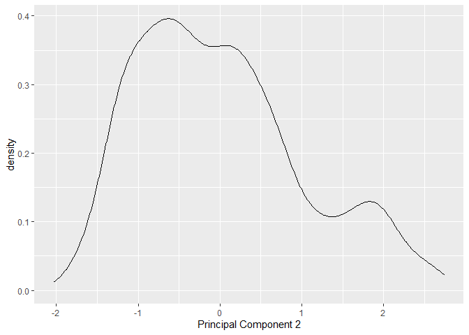
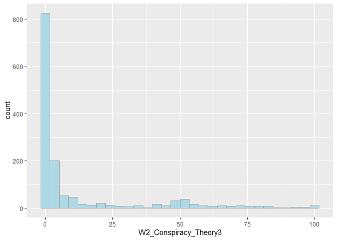
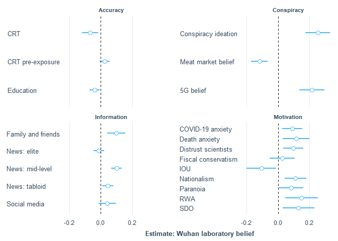

covid\_conspiracies\_markdown2
================
Michael Marshall
21/10/2020

## Loading Packages and Data

``` r
pacman::p_load(tidyverse, stringr, ggridges, forcats, labelled, leaps,
               psych, corrr, cowplot, expss, haven, interplot,
               interactions, jtools,labelled, pscl, psych, 
               sjPlot, skimr)

load("COVID W1_W2_W3 Cleaned 2878.RData") # needs to be in your wd
```

## Rescaling variable

``` r
## [rescale01] Function to rescale a variable from 0 to 1
rescale01 <- function(x, ...) {
  (x - min(x, ...)) / ((max(x, ...)) - min(x, ...))
}
```

## Summary and distribution of different COVID specific conspiracies

``` r
# plotting density of different covid conspiracies
df %>% 
  dplyr::select(W2_Conspiracy_Theory1:W2_Conspiracy_Theory5) %>% 
  gather(conspiracy_code, belief,
         W2_Conspiracy_Theory1:W2_Conspiracy_Theory5) %>%
  mutate(
    conspiracy_code = as.factor(conspiracy_code),
    conspiracy = ifelse(
      conspiracy_code == "W2_Conspiracy_Theory1",
      "Chinese lab",
      ifelse(conspiracy_code == "W2_Conspiracy_Theory2",
             "Chinese meat market",
             ifelse(conspiracy_code == "W2_Conspiracy_Theory3",
                    "5G",
                    ifelse(conspiracy_code == "W2_Conspiracy_Theory4",
                           "No worse than flu",
                           "Vitamin C treatment"))))
  ) %>% 
  ggplot(aes(x = belief, y = conspiracy, height = ..density..)) +
  geom_density_ridges(aes(fill = conspiracy,
                          rel_min_height = 0.005),
                      stat = "density",
                      #bins = 20,
                      show.legend = FALSE) +
  scale_fill_brewer(palette = "Dark2") +
  theme_ridges()
```

    ## Warning: attributes are not identical across measure variables;
    ## they will be dropped

    ## Warning: Removed 7360 rows containing non-finite values (stat_density).

<!-- -->

## Cleaning dataset

The following code filters down to just those observations that have
completed the battery of questions relating to COVID specific
conspiracies. It also creates a tibble counting the missing
observations, which can be useful to have as an object.

``` r
# filtering for completed dependent variable
conspiracies <- df %>% 
  filter(!is.na(W2_Conspiracy_Theory1) |
           !is.na(W2_Conspiracy_Theory2) |
           !is.na(W2_Conspiracy_Theory3) |
           !is.na(W2_Conspiracy_Theory3) |
           !is.na(W2_Conspiracy_Theory4) |
           !is.na(W2_Conspiracy_Theory5)) %>% 
  rename(W1_Housing_tenure = W1_Hosuing_tenure)

# function to count NAs
count_na <- function(x){
  sum(is.na(x))
}

conspiracies %>% 
  dplyr::select(W2_Conspiracy_Theory1:W2_Conspiracy_Theory5) %>% 
  map_int(count_na)
```

    ## W2_Conspiracy_Theory1 W2_Conspiracy_Theory2 W2_Conspiracy_Theory3 
    ##                     0                     0                     0 
    ## W2_Conspiracy_Theory4 W2_Conspiracy_Theory5 
    ##                     0                     0

``` r
missing <- tibble(
  variable = names(conspiracies),
  NAs = conspiracies %>% map_int(count_na)
)

#View(missing)
```

The code below combines the two variables on the 2019 general election
into a single variable that combines whether a respondent voted, and who
they voted for. It also turns the *preferred newspaper* variables into
dummy variables, as they were previously coded as *1=Yes* and everything
else as *NA*.

``` r
# making preferred newspaper dummy variable (i.e. replacing NA with 0)
na_to_zero <- function(x){
  x[is.na(x)] <- 0
  x <- as.numeric(x)
  return(x)
} 

paper_vars <- rep(str_c("W2_Newspaper_prefer",seq(1,11,1)))

conspiracies[paper_vars] <- conspiracies[paper_vars] %>% 
  map_df(na_to_zero)
```

``` r
# Creating DVs
# [nat] nationalism
nat_keys <- list(nationalism = cs(W2_Nationalism1,W2_Nationalism2))
nat_test <- scoreItems(nat_keys, conspiracies, min = 1, max = 5)
head(nat_test$scores)
```

    ##      nationalism
    ## [1,]           4
    ## [2,]           4
    ## [3,]           4
    ## [4,]           3
    ## [5,]           3
    ## [6,]           3

``` r
nat_test$alpha  # Scale alpha
```

    ##       nationalism
    ## alpha   0.8213221

``` r
conspiracies$nat <- rescale01(nat_test$scores, na.rm = TRUE)
conspiracies$nat <- c(conspiracies$nat)  # Ensure variable is numeric and not matrix class
describe(conspiracies$nat)
```

    ##    vars    n mean   sd median trimmed  mad min max range  skew kurtosis   se
    ## X1    1 1406 0.57 0.25   0.62    0.58 0.19   0   1     1 -0.33    -0.18 0.01

``` r
## [imm.econ] Anti-immigrant sentiment - Economy 
table(conspiracies$W1_MigrantAttitudes1)
```

    ## 
    ##   1   2   3   4   5   6   7   8   9  10 
    ##  71  38  80 105 188 198 264 255  87 120

``` r
conspiracies$imm_econ <- rescale01(abs(
  conspiracies$W1_MigrantAttitudes1 - 11))

conspiracies %>% 
  dplyr::select(W1_MigrantAttitudes1, imm_econ) %>%
  correlate()
```

    ## 
    ## Correlation method: 'pearson'
    ## Missing treated using: 'pairwise.complete.obs'

    ## # A tibble: 2 x 3
    ##   rowname              W1_MigrantAttitudes1 imm_econ
    ##   <chr>                               <dbl>    <dbl>
    ## 1 W1_MigrantAttitudes1                   NA       -1
    ## 2 imm_econ                               -1       NA

``` r
## [imm.res] Anti-immigrant sentiment - Resources
table(conspiracies$W1_MigrantAttitudes3)
```

    ## 
    ##   1   2   3   4   5 
    ##  68 101 575 431 231

``` r
conspiracies$imm_res <- rescale01(conspiracies$W1_MigrantAttitudes3)
conspiracies %>% 
  dplyr::select(W1_MigrantAttitudes3, imm_res) %>%
  correlate()
```

    ## 
    ## Correlation method: 'pearson'
    ## Missing treated using: 'pairwise.complete.obs'

    ## # A tibble: 2 x 3
    ##   rowname              W1_MigrantAttitudes3 imm_res
    ##   <chr>                               <dbl>   <dbl>
    ## 1 W1_MigrantAttitudes3                   NA       1
    ## 2 imm_res                                 1      NA

``` r
## [imm.cul] Anti-immigrant sentiment - Culture
table(conspiracies$W1_MigrantAttitudes2)
```

    ## 
    ##   1   2   3   4   5   6   7   8   9  10 
    ## 101  57  88 120 202 177 225 219  80 137

``` r
conspiracies$imm_cul <- rescale01(abs(
  conspiracies$W1_MigrantAttitudes2 - 11))

conspiracies %>% 
  dplyr::select(W1_MigrantAttitudes2, imm_cul) %>%
  correlate()
```

    ## 
    ## Correlation method: 'pearson'
    ## Missing treated using: 'pairwise.complete.obs'

    ## # A tibble: 2 x 3
    ##   rowname              W1_MigrantAttitudes2 imm_cul
    ##   <chr>                               <dbl>   <dbl>
    ## 1 W1_MigrantAttitudes2                   NA      -1
    ## 2 imm_cul                                -1      NA

``` r
# Right wing authoritarianism
rwa_keys <- list(rwa = cs(W1_Authoritarianism1_R,
                          W1_Authoritarianism2,
                          W1_Authoritarianism3,
                          W1_Authoritarianism4_R, 
                          W1_Authoritarianism5_R,
                          W1_Authoritarianism6))

rwa_test <- scoreItems(rwa_keys, conspiracies, min = 1, max = 5)
head(rwa_test$scores)
```

    ##           rwa
    ## [1,] 2.833333
    ## [2,] 2.666667
    ## [3,] 3.166667
    ## [4,] 3.333333
    ## [5,] 3.000000
    ## [6,] 3.500000

``` r
summary(rwa_test$alpha)  # Scale alpha
```

    ##       rwa        
    ##  Min.   :0.6837  
    ##  1st Qu.:0.6837  
    ##  Median :0.6837  
    ##  Mean   :0.6837  
    ##  3rd Qu.:0.6837  
    ##  Max.   :0.6837

``` r
conspiracies$RWA <- rescale01(rwa_test$scores, na.rm = TRUE)
conspiracies$RWA <- c(conspiracies$RWA)  # Ensure variable is numeric and not matrix class

describe(conspiracies$RWA)
```

    ##    vars    n mean   sd median trimmed  mad min max range  skew kurtosis se
    ## X1    1 1406 0.51 0.17    0.5    0.52 0.12   0   1     1 -0.25      0.3  0

``` r
## [SDO] Social Dominance Orientation
sdo_keys <- list(sdo = cs(W1_Social_Dominance1,
                          W1_Social_Dominance2_R,
                          W1_Social_Dominance3_R,
                          W1_Social_Dominance4,
                          W1_Social_Dominance5_R,
                          W1_Social_Dominance6, 
                          W1_Social_Dominance7,
                          W1_Social_Dominance8_R))
sdo_test <- scoreItems(sdo_keys, conspiracies, min = 1, max = 5)
head(sdo_test$scores)
```

    ##        sdo
    ## [1,] 1.500
    ## [2,] 3.000
    ## [3,] 3.000
    ## [4,] 2.625
    ## [5,] 3.000
    ## [6,] 2.500

``` r
summary(sdo_test$alpha)  # Scale alpha
```

    ##       sdo        
    ##  Min.   :0.8404  
    ##  1st Qu.:0.8404  
    ##  Median :0.8404  
    ##  Mean   :0.8404  
    ##  3rd Qu.:0.8404  
    ##  Max.   :0.8404

``` r
conspiracies$SDO <- rescale01(sdo_test$scores, na.rm = TRUE)
conspiracies$SDO <- c(conspiracies$SDO)  # Ensure variable is numeric and not matrix class

summary(conspiracies$SDO)
```

    ##    Min. 1st Qu.  Median    Mean 3rd Qu.    Max. 
    ##  0.0000  0.2258  0.3871  0.3620  0.5161  1.0000

``` r
## [threat] Covid-19 related Threat
summary(conspiracies$W2_COVID19_anxiety)
```

    ##    Min. 1st Qu.  Median    Mean 3rd Qu.    Max. 
    ##    0.00   50.00   65.00   61.25   80.75  100.00

``` r
conspiracies$threat <- rescale01(conspiracies$W2_COVID19_anxiety)
conspiracies %>% 
  dplyr::select(W2_COVID19_anxiety, threat) %>%
  correlate()
```

    ## 
    ## Correlation method: 'pearson'
    ## Missing treated using: 'pairwise.complete.obs'

    ## # A tibble: 2 x 3
    ##   rowname            W2_COVID19_anxiety threat
    ##   <chr>                           <dbl>  <dbl>
    ## 1 W2_COVID19_anxiety                 NA      1
    ## 2 threat                              1     NA

``` r
## [right] Right-Wing political views
table(conspiracies$W1_Political_Scale)
```

    ## 
    ##   1   2   3   4   5   6   7   8   9  10 
    ##  35  44 116 143 488 221 182 102  36  39

``` r
conspiracies$right <- rescale01(conspiracies$W1_Political_Scale)
conspiracies %>% 
  dplyr::select(W1_Political_Scale, right) %>%
  correlate()
```

    ## 
    ## Correlation method: 'pearson'
    ## Missing treated using: 'pairwise.complete.obs'

    ## # A tibble: 2 x 3
    ##   rowname            W1_Political_Scale right
    ##   <chr>                           <dbl> <dbl>
    ## 1 W1_Political_Scale                 NA     1
    ## 2 right                               1    NA

``` r
## [soc.con] Social conservatism
table(conspiracies$W1_Political_Abortion_SSM)
```

    ## 
    ##   1   2   3   4   5   6   7   8   9  10 
    ## 262 123 175 129 330 124 109  67  31  56

``` r
conspiracies$soc_con <- rescale01(
  conspiracies$W1_Political_Abortion_SSM)
conspiracies %>% 
  dplyr::select(W1_Political_Abortion_SSM, soc_con) %>%
  correlate()
```

    ## 
    ## Correlation method: 'pearson'
    ## Missing treated using: 'pairwise.complete.obs'

    ## # A tibble: 2 x 3
    ##   rowname                   W1_Political_Abortion_SSM soc_con
    ##   <chr>                                         <dbl>   <dbl>
    ## 1 W1_Political_Abortion_SSM                        NA       1
    ## 2 soc_con                                           1      NA

``` r
## [fis.con] Fiscal conservatism
table(conspiracies$W1_Political_Fiscal)
```

    ## 
    ##   1   2   3   4   5   6   7   8   9  10 
    ##  55  43 112 133 430 201 226 121  39  46

``` r
conspiracies$fis_con <- rescale01(conspiracies$W1_Political_Fiscal)
conspiracies %>% 
  dplyr::select(W1_Political_Fiscal, fis_con) %>%
  correlate()
```

    ## 
    ## Correlation method: 'pearson'
    ## Missing treated using: 'pairwise.complete.obs'

    ## # A tibble: 2 x 3
    ##   rowname             W1_Political_Fiscal fis_con
    ##   <chr>                             <dbl>   <dbl>
    ## 1 W1_Political_Fiscal                  NA       1
    ## 2 fis_con                               1      NA

``` r
## [age.c] Age (in years)
summary(conspiracies$W2_Age_year)
```

    ##    Min. 1st Qu.  Median    Mean 3rd Qu.    Max. 
    ##   18.00   37.00   50.00   49.32   61.00   88.00

``` r
conspiracies$age_sc <- rescale01(conspiracies$W2_Age_year)
```

``` r
factors <- c("W1_Ethnicity","W1_C19_Infected","W1_BornUK","W1_EURef",
             "W2_Gender_binary","W2_Living_alone","W2_Employment",
             "W1_Education_binary","W1_Housing_tenure")
```

``` r
# turning the above list into factors with the levels as the spss labels
#for(i in seq_along(conspiracies[factors])){
#  conspiracies[factors][,i] <- to_factor(
#    conspiracies[factors][,i], nolabel_to_na = TRUE)
#}
```

``` r
# turning to factors
conspiracies[factors] <- conspiracies[factors] %>% 
  map_df(as.factor)
```

``` r
# Making a binary for each CRT scale, baseline = correct answer
conspiracies$CRT1 <- ifelse(
  to_factor(conspiracies$W1_CRT1) != "5 pence", 1, 0
)

conspiracies$CRT2 <- ifelse(
  to_factor(conspiracies$W1_CRT2) != "5 minutes", 1, 0
)

conspiracies$CRT3 <- ifelse(
  to_factor(conspiracies$W1_CRT3) != "47 days", 1, 0
)

conspiracies$CRT4 <- ifelse(
  to_factor(conspiracies$W1_CRT4) != "2nd", 1, 0
)

conspiracies$CRT5 <- ifelse(
  to_factor(conspiracies$W1_CRT5) != "8", 1, 0
)

conspiracies$CRT_test <- ifelse(
  to_factor(conspiracies$W1_CRT_test) == "None of them.", 1, 0
) # baseline = heard of some of them OR all of them
```

``` r
# Right wing authoritarianism
crt_keys <- list(crt = cs(CRT1,
                          CRT2,
                          CRT3,
                          CRT4, 
                          CRT5))

crt_test <- scoreItems(crt_keys, conspiracies, min = 0, max = 1)
head(crt_test$scores)
```

    ##      crt
    ## [1,] 0.8
    ## [2,] 0.6
    ## [3,] 1.0
    ## [4,] 0.8
    ## [5,] 1.0
    ## [6,] 1.0

``` r
summary(crt_test$alpha)  # Scale alpha
```

    ##       crt        
    ##  Min.   :0.7332  
    ##  1st Qu.:0.7332  
    ##  Median :0.7332  
    ##  Mean   :0.7332  
    ##  3rd Qu.:0.7332  
    ##  Max.   :0.7332

``` r
conspiracies$crt <- rescale01(crt_test$scores, na.rm = TRUE)
conspiracies$crt <- c(conspiracies$crt)  # Ensure variable is numeric and not matrix class

describe(conspiracies$crt)
```

    ##    vars    n mean   sd median trimmed mad min max range  skew kurtosis   se
    ## X1    1 1406 0.61 0.33    0.6    0.64 0.3   0   1     1 -0.41    -1.06 0.01

``` r
# do CRT scores come from different distributions
# dependent on whether they've seen the test

conspiracies %>% 
  group_by(CRT_test) %>% 
  summarise(
    mean_crt = mean(crt),
    median_crt = median(crt),
    std_crt = sd(crt)
  )
```

    ## `summarise()` ungrouping output (override with `.groups` argument)

    ## # A tibble: 2 x 4
    ##   CRT_test mean_crt median_crt std_crt
    ##      <dbl>    <dbl>      <dbl>   <dbl>
    ## 1        0    0.522        0.6   0.335
    ## 2        1    0.666        0.8   0.314

``` r
kruskal.test(crt ~ CRT_test, data = conspiracies)
```

    ## 
    ##  Kruskal-Wallis rank sum test
    ## 
    ## data:  crt by CRT_test
    ## Kruskal-Wallis chi-squared = 61.72, df = 1, p-value = 3.96e-15

``` r
# Making a binary for each CRT scale, 1 = most common wrong answer
conspiracies$CRT1_wrong <- ifelse(
  to_factor(conspiracies$W1_CRT1) == "10 pence", 1, 0
)

conspiracies$CRT2_wrong <- ifelse(
  to_factor(conspiracies$W1_CRT2) == "100 minutes", 1, 0
)

conspiracies$CRT3_wrong <- ifelse(
  to_factor(conspiracies$W1_CRT3) == "24 days", 1, 0
)

conspiracies$CRT4_wrong <- ifelse(
  to_factor(conspiracies$W1_CRT4) == "1st", 1, 0
)

conspiracies$CRT5_wrong <- ifelse(
  to_factor(conspiracies$W1_CRT5) == "7", 1, 0
)
```

``` r
# rescaling the remaing numeric variables
numerics <- c("W1_Conspiracy_Total","W2_Paranoia_Total",
              "W2_Internal_Total","W2_Chance_Total","W2_PO_Total",
              "W2_DAI_Total","W2_IOU_Total", "W2_INFO_5",
              "W2_INFO_9","W2_Trust_Body6","W1_Income_2019")

conspiracies[numerics] <- conspiracies[numerics] %>% 
  map_df(rescale01, na.rm = TRUE)
```

``` r
# creating scaled versions of each conspiracy belief
conspiracies$conspiracy1_sc <- rescale01(
  conspiracies$W2_Conspiracy_Theory1, na.rm = TRUE
)

conspiracies$conspiracy2_sc <- rescale01(
  conspiracies$W2_Conspiracy_Theory2, na.rm = TRUE
)

conspiracies$conspiracy3_sc <- rescale01(
  conspiracies$W2_Conspiracy_Theory3, na.rm = TRUE
)

conspiracies$conspiracy4_sc <- rescale01(
  conspiracies$W2_Conspiracy_Theory4, na.rm = TRUE
)

conspiracies$conspiracy5_sc <- rescale01(
  conspiracies$W2_Conspiracy_Theory5, na.rm = TRUE
)
```

## Distribution of variables

A for loop to look at distribution of potential independent variables
(numeric only).

``` r
plot_vars <- conspiracies %>% 
  dplyr::select(
    one_of(numerics),nat,RWA,SDO,threat,right,soc_con,fis_con
    ) %>%
  names()

for(i in seq_along(plot_vars)){
  
  x1 <- conspiracies[plot_vars][i] %>% as_vector()
  
  print(
    ggplot(data = NULL, aes(x = x1)) +
      geom_vline(aes(xintercept = mean(x1, na.rm =TRUE)), 
                 colour = "black",
                 linetype = "dashed") +
      geom_vline(aes(xintercept = median(x1, na.rm =TRUE)), 
                 colour = "red",
                 linetype = "dashed") +
      geom_density(fill = "lightblue", alpha = 0.7) +
      labs(x = plot_vars[i],
           caption = "Black = Mean, Red = Median")  
  )
  
}
```

<!-- --><!-- --><!-- --><!-- --><!-- --><!-- --><!-- --><!-- --><!-- -->

    ## Warning: Removed 4 rows containing non-finite values (stat_density).

<!-- --><!-- --><!-- --><!-- --><!-- --><!-- --><!-- --><!-- --><!-- -->

# Principal Components Analysis - PCA

``` r
# pca on conspiracy theory variables
pca_df <- conspiracies %>% 
  dplyr::select(W2_Conspiracy_Theory1:W2_Conspiracy_Theory5)

pca_fit <- prcomp(pca_df,scale = TRUE)
```

``` r
# looking at biplots for components 1:4
biplot(pca_fit,
       col = c("lightgrey","red"))
```

<!-- -->

``` r
biplot(pca_fit, choices = 3:4,
       col = c("lightgrey","red"))
```

<!-- -->

``` r
pca_fit$rotation[,1:4]
```

    ##                               PC1         PC2        PC3          PC4
    ## W2_Conspiracy_Theory1  0.38903347  0.24539595 -0.8871956  0.005348538
    ## W2_Conspiracy_Theory2 -0.06373755 -0.95279476 -0.2915166  0.055301539
    ## W2_Conspiracy_Theory3  0.56176975 -0.06995748  0.2010846  0.389643958
    ## W2_Conspiracy_Theory4  0.46001469 -0.12890497  0.1587345 -0.862444840
    ## W2_Conspiracy_Theory5  0.56337529 -0.10223712  0.2495403  0.318244587

``` r
components <- pca_fit$x[,1:4] %>% as_tibble()
```

First four principal components are as follows:  
1\. general conspiracy ideation, with belief in 5G, ‘it’s no worse than
flu’ and vitamin C treatment highly loaded to this component, and belief
in Chinese lab less so  
2\. disbelief in Chinese meat market origin, with mild positive loading
for Chinese lab origin  
3\. strong conspiracy ideation (non-nationalistic), strong loading for
belig 5g, ‘it’s no worse than flu’ and vitamin C treatment, with
negative loading for both Chinese lab origin and Chinese meat market  
4\. strong loading for belief in 5G conspiracy and vitamin C treatment,
but strong negative loading for belief ‘it’s no worse than flu’

``` r
pc <- cbind(conspiracies,components)

ihs <- function(x){
  log(x + ((x^2 + 1)^0.5))
}

pc <- pc %>% 
  mutate(
    pc1_ihs = ihs(PC1)
  )

pc %>% 
  ggplot(aes(x = pc1_ihs)) +
  geom_density() +
  labs(x = "Principal Component 1 (IHS)")
```

<!-- -->

``` r
pc %>% 
  ggplot(aes(x = PC2)) +
  geom_density() +
  labs(x = "Principal Component 2")
```

<!-- -->

``` r
pc %>% 
  ggplot(aes(x = PC3)) +
  geom_density() +
  labs(x = "Principal Component 3")
```

<!-- -->

``` r
pc %>% 
  ggplot(aes(x = PC4)) +
  geom_density()  +
  labs(x = "Principal Component 4")
```

<!-- -->

Principal components 1 to 3 explain most of the variation in the data.

``` r
# modelling principal components against general conspiracy ideation
conspiracy_mod <- lm(W1_Conspiracy_Total ~ pc1_ihs + PC2 + PC3 + PC4,
                     data = pc)

par(mfrow = c(2,2))
plot(conspiracy_mod)
```

<!-- -->

``` r
summ(conspiracy_mod, vifs = TRUE)
```

    ## MODEL INFO:
    ## Observations: 1406
    ## Dependent Variable: W1_Conspiracy_Total
    ## Type: OLS linear regression 
    ## 
    ## MODEL FIT:
    ## F(4,1401) = 20.56, p = 0.00
    ## R² = 0.06
    ## Adj. R² = 0.05 
    ## 
    ## Standard errors: OLS
    ## -------------------------------------------------------
    ##                      Est.   S.E.   t val.      p    VIF
    ## ----------------- ------- ------ -------- ------ ------
    ## (Intercept)          0.58   0.01   111.45   0.00       
    ## pc1_ihs              0.03   0.01     6.56   0.00   1.01
    ## PC2                  0.01   0.01     1.23   0.22   1.00
    ## PC3                 -0.03   0.01    -5.78   0.00   1.00
    ## PC4                  0.00   0.01     0.05   0.96   1.00
    ## -------------------------------------------------------

``` r
source("diagnostic_plots.R")
av_ggplot(conspiracy_mod)
```

    ## `geom_smooth()` using formula 'y ~ x'

<!-- -->

    ## `geom_smooth()` using formula 'y ~ x'

<!-- -->

    ## `geom_smooth()` using formula 'y ~ x'

<!-- -->

    ## `geom_smooth()` using formula 'y ~ x'

<!-- -->

Only principal components 1 and 3 associated with general conspiracy
ideation.

# Modelling for belief in Chinese lab origin

## DV Chinese lab conspiracy - singular IV models

``` r
sdo_lab <- lm(W2_Conspiracy_Theory1 ~ SDO,
              data = conspiracies)

summ(sdo_lab)
```

    ## MODEL INFO:
    ## Observations: 1406
    ## Dependent Variable: W2_Conspiracy_Theory1
    ## Type: OLS linear regression 
    ## 
    ## MODEL FIT:
    ## F(1,1404) = 65.28, p = 0.00
    ## R² = 0.04
    ## Adj. R² = 0.04 
    ## 
    ## Standard errors: OLS
    ## ------------------------------------------------
    ##                      Est.   S.E.   t val.      p
    ## ----------------- ------- ------ -------- ------
    ## (Intercept)         24.11   1.95    12.34   0.00
    ## SDO                 39.08   4.84     8.08   0.00
    ## ------------------------------------------------

``` r
rwa_lab <- lm(W2_Conspiracy_Theory1 ~ RWA,
              data = conspiracies)

summ(rwa_lab)
```

    ## MODEL INFO:
    ## Observations: 1406
    ## Dependent Variable: W2_Conspiracy_Theory1
    ## Type: OLS linear regression 
    ## 
    ## MODEL FIT:
    ## F(1,1404) = 87.72, p = 0.00
    ## R² = 0.06
    ## Adj. R² = 0.06 
    ## 
    ## Standard errors: OLS
    ## ------------------------------------------------
    ##                      Est.   S.E.   t val.      p
    ## ----------------- ------- ------ -------- ------
    ## (Intercept)         13.88   2.74     5.07   0.00
    ## RWA                 47.40   5.06     9.37   0.00
    ## ------------------------------------------------

``` r
daily_m_lab <- lm(W2_Conspiracy_Theory1 ~ W2_Newspaper_prefer1,
              data = conspiracies)

summ(daily_m_lab)
```

    ## MODEL INFO:
    ## Observations: 1406
    ## Dependent Variable: W2_Conspiracy_Theory1
    ## Type: OLS linear regression 
    ## 
    ## MODEL FIT:
    ## F(1,1404) = 87.24, p = 0.00
    ## R² = 0.06
    ## Adj. R² = 0.06 
    ## 
    ## Standard errors: OLS
    ## ---------------------------------------------------------
    ##                               Est.   S.E.   t val.      p
    ## -------------------------- ------- ------ -------- ------
    ## (Intercept)                  32.96   1.03    32.02   0.00
    ## W2_Newspaper_prefer1         17.47   1.87     9.34   0.00
    ## ---------------------------------------------------------

``` r
social_m_lab <- lm(W2_Conspiracy_Theory1 ~ W2_INFO_5,
              data = conspiracies)

summ(social_m_lab)
```

    ## MODEL INFO:
    ## Observations: 1406
    ## Dependent Variable: W2_Conspiracy_Theory1
    ## Type: OLS linear regression 
    ## 
    ## MODEL FIT:
    ## F(1,1404) = 43.67, p = 0.00
    ## R² = 0.03
    ## Adj. R² = 0.03 
    ## 
    ## Standard errors: OLS
    ## ------------------------------------------------
    ##                      Est.   S.E.   t val.      p
    ## ----------------- ------- ------ -------- ------
    ## (Intercept)         32.81   1.20    27.33   0.00
    ## W2_INFO_5           18.00   2.72     6.61   0.00
    ## ------------------------------------------------

## DV Chinese lab conspiracy - socio-economic variables

``` r
se_lab <- lm(W2_Conspiracy_Theory1 ~ W2_Gender_binary +
               W1_Education_binary +
               W1_Income_2019 +
               age_sc,
              data = conspiracies)

summ(se_lab, vifs = TRUE)
```

    ## MODEL INFO:
    ## Observations: 1403 (3 missing obs. deleted)
    ## Dependent Variable: W2_Conspiracy_Theory1
    ## Type: OLS linear regression 
    ## 
    ## MODEL FIT:
    ## F(4,1398) = 13.24, p = 0.00
    ## R² = 0.04
    ## Adj. R² = 0.03 
    ## 
    ## Standard errors: OLS
    ## ----------------------------------------------------------------
    ##                               Est.   S.E.   t val.      p    VIF
    ## -------------------------- ------- ------ -------- ------ ------
    ## (Intercept)                  50.87   2.87    17.74   0.00       
    ## W2_Gender_binary2             2.76   1.77     1.56   0.12   1.03
    ## W1_Education_binary1         -8.28   1.84    -4.50   0.00   1.06
    ## W1_Income_2019               -9.34   2.50    -3.73   0.00   1.06
    ## age_sc                       -8.94   4.14    -2.16   0.03   1.03
    ## ----------------------------------------------------------------

``` r
plot_coefs(se_lab)
```

    ## Loading required namespace: broom.mixed

<!-- -->

``` r
par(mfrow = c(2,2))
plot(se_lab)
```

<!-- -->

## DV Chinese lab conspiracy - socio-economic variables + political/media

``` r
se_pol_lab <- lm(W2_Conspiracy_Theory1 ~ 
                   
                   #socio-economic variables
                   W2_Gender_binary +
                   W1_Education_binary +
                   W1_Income_2019 +
                   age_sc +
                   
                   #political and media variables
                   right +
                   soc_con +
                   fis_con +
                   nat +
                   W2_Trust_Body6 + #distrust of scientists
                   W2_Newspaper_prefer1 + #daily_mail
                   W2_Newspaper_prefer5 + #guardian
                   W2_Newspaper_prefer9 + #sun
                   W2_INFO_5 + #social media
                   W2_INFO_9, #family and friends
                 data = conspiracies)

summ(se_pol_lab, vifs = TRUE)
```

    ## MODEL INFO:
    ## Observations: 1399 (7 missing obs. deleted)
    ## Dependent Variable: W2_Conspiracy_Theory1
    ## Type: OLS linear regression 
    ## 
    ## MODEL FIT:
    ## F(14,1384) = 25.55, p = 0.00
    ## R² = 0.21
    ## Adj. R² = 0.20 
    ## 
    ## Standard errors: OLS
    ## ----------------------------------------------------------------
    ##                               Est.   S.E.   t val.      p    VIF
    ## -------------------------- ------- ------ -------- ------ ------
    ## (Intercept)                   9.42   4.12     2.28   0.02       
    ## W2_Gender_binary2             2.85   1.64     1.74   0.08   1.06
    ## W1_Education_binary1         -4.52   1.72    -2.62   0.01   1.12
    ## W1_Income_2019               -6.66   2.35    -2.83   0.00   1.12
    ## age_sc                       -0.15   4.19    -0.03   0.97   1.27
    ## right                         5.59   5.49     1.02   0.31   1.98
    ## soc_con                       9.59   3.56     2.70   0.01   1.50
    ## fis_con                      -2.23   5.24    -0.43   0.67   2.09
    ## nat                          16.11   3.62     4.44   0.00   1.29
    ## W2_Trust_Body6               22.83   3.30     6.91   0.00   1.08
    ## W2_Newspaper_prefer1         10.52   1.83     5.76   0.00   1.11
    ## W2_Newspaper_prefer5         -5.12   2.11    -2.42   0.02   1.16
    ## W2_Newspaper_prefer9         10.50   2.54     4.13   0.00   1.11
    ## W2_INFO_5                    10.24   2.91     3.52   0.00   1.37
    ## W2_INFO_9                    13.30   3.09     4.31   0.00   1.21
    ## ----------------------------------------------------------------

``` r
plot_coefs(se_pol_lab)
```

    ## Loading required namespace: broom.mixed

<!-- -->

``` r
par(mfrow = c(2,2))
plot(se_pol_lab)
```

<!-- -->

## DV Chinese lab conspiracy - socio-economic variables + political/media + pol-psych

``` r
se_polpsych_lab <- lm(W2_Conspiracy_Theory1 ~
                        
                        #socio-economic variables
                        W2_Gender_binary +
                        W1_Education_binary +
                        W1_Income_2019 +
                        age_sc +
                        
                        #political and media variables
                        right +
                        soc_con +
                        fis_con +
                        nat +
                        W2_Trust_Body6 + #distrust of scientists
                        W2_Newspaper_prefer1 + #daily_mail
                        W2_Newspaper_prefer5 + #guardian
                        W2_Newspaper_prefer9 + #sun
                        W2_INFO_5 + #social media
                        W2_INFO_9 + #family and friends
                     
                        #political-psychology variables
                        SDO +
                        RWA +
                        W2_DAI_Total +
                        W2_IOU_Total +
                        W2_Paranoia_Total +
                        W2_Internal_Total +
                        W2_Chance_Total,
                      data = conspiracies)

summ(se_polpsych_lab, vifs = TRUE)
```

    ## MODEL INFO:
    ## Observations: 1399 (7 missing obs. deleted)
    ## Dependent Variable: W2_Conspiracy_Theory1
    ## Type: OLS linear regression 
    ## 
    ## MODEL FIT:
    ## F(21,1377) = 20.49, p = 0.00
    ## R² = 0.24
    ## Adj. R² = 0.23 
    ## 
    ## Standard errors: OLS
    ## -----------------------------------------------------------------
    ##                                Est.   S.E.   t val.      p    VIF
    ## -------------------------- -------- ------ -------- ------ ------
    ## (Intercept)                   -6.73   5.93    -1.14   0.26       
    ## W2_Gender_binary2              2.14   1.65     1.29   0.20   1.12
    ## W1_Education_binary1          -3.69   1.70    -2.18   0.03   1.13
    ## W1_Income_2019                -5.22   2.39    -2.19   0.03   1.20
    ## age_sc                         5.10   4.43     1.15   0.25   1.47
    ## right                          2.69   5.52     0.49   0.63   2.08
    ## soc_con                        2.84   3.69     0.77   0.44   1.68
    ## fis_con                       -2.96   5.19    -0.57   0.57   2.12
    ## nat                           10.66   3.66     2.91   0.00   1.36
    ## W2_Trust_Body6                18.59   3.38     5.50   0.00   1.17
    ## W2_Newspaper_prefer1           9.62   1.80     5.33   0.00   1.13
    ## W2_Newspaper_prefer5          -2.55   2.13    -1.19   0.23   1.23
    ## W2_Newspaper_prefer9           9.26   2.51     3.69   0.00   1.12
    ## W2_INFO_5                      8.08   2.90     2.79   0.01   1.40
    ## W2_INFO_9                     13.04   3.07     4.25   0.00   1.24
    ## SDO                            9.66   5.39     1.79   0.07   1.53
    ## RWA                           20.18   5.71     3.53   0.00   1.54
    ## W2_DAI_Total                  17.25   4.39     3.93   0.00   1.54
    ## W2_IOU_Total                 -11.68   4.97    -2.35   0.02   1.59
    ## W2_Paranoia_Total             14.11   4.23     3.34   0.00   1.73
    ## W2_Internal_Total              3.50   4.96     0.71   0.48   1.20
    ## W2_Chance_Total                2.10   4.48     0.47   0.64   1.36
    ## -----------------------------------------------------------------

``` r
plot_coefs(se_polpsych_lab)
```

    ## Loading required namespace: broom.mixed

<!-- -->

``` r
par(mfrow = c(2,2))
plot(se_polpsych_lab)
```

<!-- -->

Looking at mulitcollinearity below for the following variables:  
\* right  
\* soc\_con  
\* fis\_con  
\* paranoia

``` r
# looking for potential multicollinearity with right
cor_mat <- model.matrix(se_polpsych_lab) %>% as.data.frame()

cor_vec <- rep(NA,ncol(cor_mat))
for(i in seq_along(cor_mat)){
  cor_vec[i] <- cor(cor_mat$right,cor_mat[,i])
}
```

    ## Warning in cor(cor_mat$right, cor_mat[, i]): the standard deviation is zero

``` r
tibble(cor_vec,
       names(cor_mat)) %>% 
  arrange(desc(cor_vec))
```

    ## # A tibble: 22 x 2
    ##    cor_vec `names(cor_mat)`    
    ##      <dbl> <chr>               
    ##  1   1     right               
    ##  2   0.668 fis_con             
    ##  3   0.460 soc_con             
    ##  4   0.445 SDO                 
    ##  5   0.379 nat                 
    ##  6   0.376 RWA                 
    ##  7   0.227 W2_Newspaper_prefer1
    ##  8   0.149 W2_Internal_Total   
    ##  9   0.135 age_sc              
    ## 10   0.112 W1_Income_2019      
    ## # ... with 12 more rows

Fiscal conservatism positively correlated with right-left scale.

``` r
# looking for multicollinearity with soc_con
cor_vec2 <- rep(NA,ncol(cor_mat))
for(i in seq_along(cor_mat)){
  cor_vec2[i] <- cor(cor_mat$soc_con,cor_mat[,i])
}
```

    ## Warning in cor(cor_mat$soc_con, cor_mat[, i]): the standard deviation is zero

``` r
tibble(cor_vec2,
       names(cor_mat)) %>% 
  arrange(desc(cor_vec2))
```

    ## # A tibble: 22 x 2
    ##    cor_vec2 `names(cor_mat)`    
    ##       <dbl> <chr>               
    ##  1    1     soc_con             
    ##  2    0.503 fis_con             
    ##  3    0.460 right               
    ##  4    0.448 RWA                 
    ##  5    0.380 SDO                 
    ##  6    0.261 nat                 
    ##  7    0.199 W2_Trust_Body6      
    ##  8    0.183 W2_Newspaper_prefer1
    ##  9    0.151 W2_DAI_Total        
    ## 10    0.114 W2_Paranoia_Total   
    ## # ... with 12 more rows

Fiscal conservatism, right-wing scale and RWA correlated with soc\_con.

``` r
# looking for multicollinearity with fis_con
cor_vec3 <- rep(NA,ncol(cor_mat))
for(i in seq_along(cor_mat)){
  cor_vec3[i] <- cor(cor_mat$fis_con,cor_mat[,i])
}
```

    ## Warning in cor(cor_mat$fis_con, cor_mat[, i]): the standard deviation is zero

``` r
tibble(cor_vec3,
       names(cor_mat)) %>% 
  arrange(desc(cor_vec3))
```

    ## # A tibble: 22 x 2
    ##    cor_vec3 `names(cor_mat)`    
    ##       <dbl> <chr>               
    ##  1    1.00  fis_con             
    ##  2    0.668 right               
    ##  3    0.503 soc_con             
    ##  4    0.404 SDO                 
    ##  5    0.381 nat                 
    ##  6    0.362 RWA                 
    ##  7    0.208 W2_Newspaper_prefer1
    ##  8    0.157 W2_Internal_Total   
    ##  9    0.131 W1_Income_2019      
    ## 10    0.128 age_sc              
    ## # ... with 12 more rows

Right, soc\_con correlated with fis\_con.

``` r
# looking for multicollinearity with paranoia
cor_vec4 <- rep(NA,ncol(cor_mat))
for(i in seq_along(cor_mat)){
  cor_vec4[i] <- cor(cor_mat$W2_Paranoia_Total,cor_mat[,i])
}
```

    ## Warning in cor(cor_mat$W2_Paranoia_Total, cor_mat[, i]): the standard deviation
    ## is zero

``` r
tibble(cor_vec4,
       names(cor_mat)) %>% 
  arrange(desc(cor_vec4))
```

    ## # A tibble: 22 x 2
    ##    cor_vec4 `names(cor_mat)`    
    ##       <dbl> <chr>               
    ##  1    1     W2_Paranoia_Total   
    ##  2    0.463 W2_IOU_Total        
    ##  3    0.441 W2_DAI_Total        
    ##  4    0.418 W2_Chance_Total     
    ##  5    0.247 W2_INFO_5           
    ##  6    0.237 W2_Trust_Body6      
    ##  7    0.158 SDO                 
    ##  8    0.137 W2_INFO_9           
    ##  9    0.131 W2_Newspaper_prefer9
    ## 10    0.114 soc_con             
    ## # ... with 12 more rows

Potential multicollinearity between right, soc\_con and fis\_con. From
hereon, fis\_con is included in the models, as of the three, it shows
the least positive correlation between SDO and RWA. In addition, the
variables relating to locus of control (W2\_Internal\_Total,
W2\_Chance\_Total) are dropped due to non-significance.

## DV Chinese lab belief - model above minus the aforementioned variables

``` r
se_polpsych_lab_2 <- lm(W2_Conspiracy_Theory1 ~
                        
                        #socio-economic variables
                        W2_Gender_binary +
                        W1_Education_binary +
                        W1_Income_2019 +
                        age_sc +
                        
                        #political and media variables
                        fis_con +
                        nat +
                        W2_Trust_Body6 + #distrust of scientists
                        W2_Newspaper_prefer1 + #daily_mail
                        W2_Newspaper_prefer5 + #guardian
                        W2_Newspaper_prefer9 + #sun
                        W2_INFO_5 + #social media
                        W2_INFO_9 + #family and friends
                     
                        #political-psychology variables
                        SDO +
                        RWA +
                        W2_DAI_Total +
                        W2_IOU_Total +
                        W2_Paranoia_Total,
                      data = conspiracies)

summ(se_polpsych_lab_2, vifs = TRUE)
```

    ## MODEL INFO:
    ## Observations: 1399 (7 missing obs. deleted)
    ## Dependent Variable: W2_Conspiracy_Theory1
    ## Type: OLS linear regression 
    ## 
    ## MODEL FIT:
    ## F(17,1381) = 25.26, p = 0.00
    ## R² = 0.24
    ## Adj. R² = 0.23 
    ## 
    ## Standard errors: OLS
    ## -----------------------------------------------------------------
    ##                                Est.   S.E.   t val.      p    VIF
    ## -------------------------- -------- ------ -------- ------ ------
    ## (Intercept)                   -4.39   4.91    -0.89   0.37       
    ## W2_Gender_binary2              1.92   1.63     1.18   0.24   1.10
    ## W1_Education_binary1          -3.69   1.69    -2.18   0.03   1.12
    ## W1_Income_2019                -5.14   2.34    -2.19   0.03   1.16
    ## age_sc                         5.56   4.38     1.27   0.21   1.44
    ## fis_con                       -0.23   4.28    -0.05   0.96   1.45
    ## nat                           11.17   3.61     3.10   0.00   1.33
    ## W2_Trust_Body6                18.70   3.31     5.66   0.00   1.12
    ## W2_Newspaper_prefer1           9.71   1.80     5.40   0.00   1.12
    ## W2_Newspaper_prefer5          -2.68   2.13    -1.26   0.21   1.22
    ## W2_Newspaper_prefer9           9.36   2.50     3.75   0.00   1.11
    ## W2_INFO_5                      8.18   2.89     2.83   0.00   1.40
    ## W2_INFO_9                     13.32   3.05     4.37   0.00   1.23
    ## SDO                           10.34   5.26     1.96   0.05   1.46
    ## RWA                           21.54   5.45     3.95   0.00   1.40
    ## W2_DAI_Total                  17.81   4.34     4.11   0.00   1.51
    ## W2_IOU_Total                 -11.40   4.87    -2.34   0.02   1.52
    ## W2_Paranoia_Total             14.15   4.10     3.45   0.00   1.64
    ## -----------------------------------------------------------------

``` r
plot_coefs(se_polpsych_lab_2)
```

    ## Loading required namespace: broom.mixed

<!-- -->

``` r
par(mfrow = c(2,2))
plot(se_polpsych_lab_2)
```

<!-- -->

## DV Chinese lab conspiracy - socio-economic variables + political/media + pol-psych + covid-threat + CRT

``` r
multi_lab <- lm(W2_Conspiracy_Theory1 ~
                  
                  #socio-economic variables
                  W2_Gender_binary +
                  W1_Education_binary +
                  W1_Income_2019 +
                  age_sc +
                  
                  #political and media variables
                  fis_con +
                  nat +
                  W2_Trust_Body6 + #distrust of scientists
                  W2_Newspaper_prefer1 + #daily_mail
                  W2_Newspaper_prefer5 + #guardian
                  W2_Newspaper_prefer9 + #sun
                  W2_INFO_5 + #social media
                  W2_INFO_9 + #family and friends
                  
                  #political-psychology variables
                  SDO +
                  RWA +
                  W2_DAI_Total +
                  W2_IOU_Total +
                  W2_Paranoia_Total +
                  
                  #covid-anxety
                  threat +
                  
                  #CRT
                  crt +
                  CRT_test,
                data = conspiracies)

summ(multi_lab, vifs = TRUE)
```

    ## MODEL INFO:
    ## Observations: 1399 (7 missing obs. deleted)
    ## Dependent Variable: W2_Conspiracy_Theory1
    ## Type: OLS linear regression 
    ## 
    ## MODEL FIT:
    ## F(20,1378) = 23.35, p = 0.00
    ## R² = 0.25
    ## Adj. R² = 0.24 
    ## 
    ## Standard errors: OLS
    ## -----------------------------------------------------------------
    ##                                Est.   S.E.   t val.      p    VIF
    ## -------------------------- -------- ------ -------- ------ ------
    ## (Intercept)                  -10.81   5.01    -2.16   0.03       
    ## W2_Gender_binary2              0.94   1.63     0.57   0.57   1.11
    ## W1_Education_binary1          -3.43   1.68    -2.04   0.04   1.13
    ## W1_Income_2019                -4.14   2.35    -1.76   0.08   1.19
    ## age_sc                         1.22   4.44     0.27   0.78   1.51
    ## fis_con                        0.90   4.24     0.21   0.83   1.45
    ## nat                           10.81   3.57     3.02   0.00   1.33
    ## W2_Trust_Body6                18.42   3.30     5.59   0.00   1.13
    ## W2_Newspaper_prefer1           9.43   1.78     5.30   0.00   1.12
    ## W2_Newspaper_prefer5          -2.45   2.12    -1.16   0.25   1.23
    ## W2_Newspaper_prefer9           8.29   2.48     3.34   0.00   1.12
    ## W2_INFO_5                      6.69   2.89     2.31   0.02   1.43
    ## W2_INFO_9                     11.44   3.05     3.75   0.00   1.25
    ## SDO                           12.05   5.25     2.29   0.02   1.48
    ## RWA                           17.12   5.46     3.14   0.00   1.43
    ## W2_DAI_Total                  13.38   4.40     3.04   0.00   1.58
    ## W2_IOU_Total                 -11.01   4.87    -2.26   0.02   1.55
    ## W2_Paranoia_Total             12.50   4.08     3.06   0.00   1.65
    ## threat                         7.84   3.31     2.37   0.02   1.21
    ## crt                           10.30   2.67     3.86   0.00   1.29
    ## CRT_test                       2.80   1.68     1.67   0.09   1.10
    ## -----------------------------------------------------------------

``` r
plot_coefs(multi_lab)
```

    ## Loading required namespace: broom.mixed

<!-- -->

``` r
par(mfrow = c(2,2))
plot(multi_lab)
```

<!-- -->

## DV Chinese lab belief - interactions

``` r
int_lab <- lm(W2_Conspiracy_Theory1 ~
                  
                  #socio-economic variables
                  W2_Gender_binary +
                  W1_Education_binary +
                  W1_Income_2019 +
                  age_sc +
                  
                  #political and media variables
                  fis_con +
                  nat +
                  W2_Trust_Body6 + #distrust of scientists
                  W2_Newspaper_prefer1 + #daily_mail
                  W2_Newspaper_prefer5 + #guardian
                  W2_Newspaper_prefer9 + #sun
                  
                  #political-psychology variables
                  SDO +
                  W2_DAI_Total +
                  W2_IOU_Total +
                  W2_Paranoia_Total +
                  
                  #covid-anxety
                  threat +
                  
                  #CRT
                  crt +
                
                  #interactions
                  (W2_INFO_5*RWA) +
                  (W2_INFO_9*RWA),
                data = conspiracies)

summ(int_lab, vifs = TRUE)
```

    ## MODEL INFO:
    ## Observations: 1399 (7 missing obs. deleted)
    ## Dependent Variable: W2_Conspiracy_Theory1
    ## Type: OLS linear regression 
    ## 
    ## MODEL FIT:
    ## F(21,1377) = 22.11, p = 0.00
    ## R² = 0.25
    ## Adj. R² = 0.24 
    ## 
    ## Standard errors: OLS
    ## -------------------------------------------------------------------
    ##                                Est.    S.E.   t val.      p     VIF
    ## -------------------------- -------- ------- -------- ------ -------
    ## (Intercept)                  -10.14    5.94    -1.71   0.09        
    ## W2_Gender_binary2              0.87    1.63     0.53   0.59    1.12
    ## W1_Education_binary1          -3.48    1.68    -2.07   0.04    1.13
    ## W1_Income_2019                -4.01    2.35    -1.71   0.09    1.19
    ## age_sc                         1.50    4.44     0.34   0.74    1.51
    ## fis_con                        0.84    4.25     0.20   0.84    1.45
    ## nat                           10.87    3.58     3.04   0.00    1.33
    ## W2_Trust_Body6                18.29    3.30     5.55   0.00    1.13
    ## W2_Newspaper_prefer1           9.35    1.78     5.24   0.00    1.12
    ## W2_Newspaper_prefer5          -2.57    2.12    -1.21   0.22    1.23
    ## W2_Newspaper_prefer9           8.36    2.49     3.36   0.00    1.13
    ## SDO                           11.39    5.26     2.16   0.03    1.48
    ## W2_DAI_Total                  13.55    4.41     3.07   0.00    1.58
    ## W2_IOU_Total                 -11.30    4.88    -2.32   0.02    1.56
    ## W2_Paranoia_Total             12.31    4.08     3.01   0.00    1.65
    ## threat                         8.15    3.30     2.47   0.01    1.20
    ## crt                           11.24    2.61     4.30   0.00    1.24
    ## W2_INFO_5                     14.25    8.30     1.72   0.09   11.76
    ## RWA                           18.56    8.47     2.19   0.03    3.45
    ## W2_INFO_9                      6.58    9.42     0.70   0.48   11.90
    ## W2_INFO_5:RWA                -15.16   15.05    -1.01   0.31   12.21
    ## RWA:W2_INFO_9                  9.21   17.23     0.53   0.59   13.52
    ## -------------------------------------------------------------------

``` r
plot_coefs(int_lab)
```

    ## Loading required namespace: broom.mixed

<!-- -->

``` r
par(mfrow = c(2,2))
plot(int_lab)
```

<!-- -->

## DV Chinese lab conspiracy - full model incl. conspiracy ideation

``` r
full_lab <- lm(W2_Conspiracy_Theory1 ~
                  
                  #socio-economic variables
                  W2_Gender_binary +
                  W1_Education_binary +
                  W1_Income_2019 +
                  age_sc +
                  
                  #political and media variables
                  fis_con +
                  nat +
                  W2_Trust_Body6 + #distrust of scientists
                  W2_Newspaper_prefer1 + #daily_mail
                  W2_Newspaper_prefer5 + #guardian
                  W2_Newspaper_prefer9 + #sun
                  W2_INFO_5 + #social media
                  W2_INFO_9 + #family and friends
                  
                  #political-psychology variables
                  SDO +
                  RWA +
                  W2_DAI_Total +
                  W2_IOU_Total +
                  W2_Paranoia_Total +
                  
                  #covid-anxety
                  threat +
                 
                  #CRT
                  crt +
                  CRT_test +
                  
                  #conspiracies
                  W1_Conspiracy_Total +
                  conspiracy2_sc +
                  conspiracy3_sc,
                data = conspiracies)

summ(full_lab, vifs = TRUE)
```

    ## MODEL INFO:
    ## Observations: 1399 (7 missing obs. deleted)
    ## Dependent Variable: W2_Conspiracy_Theory1
    ## Type: OLS linear regression 
    ## 
    ## MODEL FIT:
    ## F(23,1375) = 25.79, p = 0.00
    ## R² = 0.30
    ## Adj. R² = 0.29 
    ## 
    ## Standard errors: OLS
    ## -----------------------------------------------------------------
    ##                                Est.   S.E.   t val.      p    VIF
    ## -------------------------- -------- ------ -------- ------ ------
    ## (Intercept)                  -13.60   5.30    -2.57   0.01       
    ## W2_Gender_binary2              1.02   1.58     0.64   0.52   1.12
    ## W1_Education_binary1          -3.52   1.63    -2.16   0.03   1.13
    ## W1_Income_2019                -2.84   2.28    -1.24   0.21   1.20
    ## age_sc                         2.85   4.31     0.66   0.51   1.51
    ## fis_con                        1.97   4.11     0.48   0.63   1.45
    ## nat                           11.41   3.49     3.27   0.00   1.35
    ## W2_Trust_Body6                 9.98   3.31     3.01   0.00   1.22
    ## W2_Newspaper_prefer1           9.44   1.72     5.48   0.00   1.12
    ## W2_Newspaper_prefer5          -2.00   2.05    -0.98   0.33   1.24
    ## W2_Newspaper_prefer9           7.70   2.41     3.19   0.00   1.13
    ## W2_INFO_5                      4.28   2.81     1.52   0.13   1.44
    ## W2_INFO_9                      9.52   2.97     3.21   0.00   1.26
    ## SDO                           11.58   5.18     2.24   0.03   1.53
    ## RWA                           15.66   5.33     2.94   0.00   1.46
    ## W2_DAI_Total                  11.08   4.33     2.56   0.01   1.63
    ## W2_IOU_Total                 -10.39   4.79    -2.17   0.03   1.60
    ## W2_Paranoia_Total              7.90   3.99     1.98   0.05   1.69
    ## threat                         9.25   3.22     2.87   0.00   1.22
    ## crt                            7.06   2.61     2.70   0.01   1.32
    ## CRT_test                       2.09   1.63     1.28   0.20   1.11
    ## W1_Conspiracy_Total           25.50   3.99     6.40   0.00   1.11
    ## conspiracy2_sc               -11.99   2.71    -4.43   0.00   1.07
    ## conspiracy3_sc                22.10   4.06     5.45   0.00   1.40
    ## -----------------------------------------------------------------

``` r
plot_coefs(full_lab)
```

    ## Loading required namespace: broom.mixed

<!-- -->

``` r
par(mfrow = c(2,2))
plot(full_lab)
```

<!-- -->

# Modelling for belief in 5G origin conspiracy

## Plots of DV, incl. inverse hyperbolic sine transformation

``` r
conspiracies %>% 
  ggplot(aes(x = W2_Conspiracy_Theory3)) +
  geom_histogram(colour = "darkgrey", fill = "lightblue")
```

    ## `stat_bin()` using `bins = 30`. Pick better value with `binwidth`.

<!-- -->

``` r
conspiracies <- conspiracies %>% 
  mutate(w2_conspiracy3_ihs = ihs(W2_Conspiracy_Theory3))

conspiracies %>% 
  ggplot(aes(x = w2_conspiracy3_ihs)) +
  geom_histogram(colour = "darkgrey", fill = "lightblue")
```

    ## `stat_bin()` using `bins = 30`. Pick better value with `binwidth`.

<!-- -->

## DV 5G conspiracy - singular IV models

``` r
sdo_5g <- lm(W2_Conspiracy_Theory3 ~ SDO,
              data = conspiracies)

summ(sdo_5g)
```

    ## MODEL INFO:
    ## Observations: 1406
    ## Dependent Variable: W2_Conspiracy_Theory3
    ## Type: OLS linear regression 
    ## 
    ## MODEL FIT:
    ## F(1,1404) = 82.37, p = 0.00
    ## R² = 0.06
    ## Adj. R² = 0.05 
    ## 
    ## Standard errors: OLS
    ## ------------------------------------------------
    ##                      Est.   S.E.   t val.      p
    ## ----------------- ------- ------ -------- ------
    ## (Intercept)          0.72   1.28     0.57   0.57
    ## SDO                 28.79   3.17     9.08   0.00
    ## ------------------------------------------------

``` r
rwa_5g <- lm(W2_Conspiracy_Theory3 ~ RWA,
              data = conspiracies)

summ(rwa_5g)
```

    ## MODEL INFO:
    ## Observations: 1406
    ## Dependent Variable: W2_Conspiracy_Theory3
    ## Type: OLS linear regression 
    ## 
    ## MODEL FIT:
    ## F(1,1404) = 2.80, p = 0.09
    ## R² = 0.00
    ## Adj. R² = 0.00 
    ## 
    ## Standard errors: OLS
    ## -----------------------------------------------
    ##                     Est.   S.E.   t val.      p
    ## ----------------- ------ ------ -------- ------
    ## (Intercept)         8.19   1.86     4.40   0.00
    ## RWA                 5.75   3.44     1.67   0.09
    ## -----------------------------------------------

``` r
daily_m_5g <- lm(W2_Conspiracy_Theory3 ~ 
                   W2_Newspaper_prefer1,
              data = conspiracies)

summ(daily_m_5g)
```

    ## MODEL INFO:
    ## Observations: 1406
    ## Dependent Variable: W2_Conspiracy_Theory3
    ## Type: OLS linear regression 
    ## 
    ## MODEL FIT:
    ## F(1,1404) = 11.96, p = 0.00
    ## R² = 0.01
    ## Adj. R² = 0.01 
    ## 
    ## Standard errors: OLS
    ## --------------------------------------------------------
    ##                              Est.   S.E.   t val.      p
    ## -------------------------- ------ ------ -------- ------
    ## (Intercept)                  9.82   0.70    14.09   0.00
    ## W2_Newspaper_prefer1         4.38   1.27     3.46   0.00
    ## --------------------------------------------------------

``` r
social_m_5g <- lm(W2_Conspiracy_Theory3 ~ W2_INFO_5,
              data = conspiracies)

summ(social_m_5g)
```

    ## MODEL INFO:
    ## Observations: 1406
    ## Dependent Variable: W2_Conspiracy_Theory3
    ## Type: OLS linear regression 
    ## 
    ## MODEL FIT:
    ## F(1,1404) = 90.16, p = 0.00
    ## R² = 0.06
    ## Adj. R² = 0.06 
    ## 
    ## Standard errors: OLS
    ## ------------------------------------------------
    ##                      Est.   S.E.   t val.      p
    ## ----------------- ------- ------ -------- ------
    ## (Intercept)          6.06   0.78     7.78   0.00
    ## W2_INFO_5           16.79   1.77     9.50   0.00
    ## ------------------------------------------------

## DV 5G conspiracy - socio-economic variables

``` r
se_5g <- lm(W2_Conspiracy_Theory3 ~ W2_Gender_binary +
               W1_Education_binary +
               W1_Income_2019 +
               age_sc,
              data = conspiracies)

summ(se_5g, vifs = TRUE)
```

    ## MODEL INFO:
    ## Observations: 1403 (3 missing obs. deleted)
    ## Dependent Variable: W2_Conspiracy_Theory3
    ## Type: OLS linear regression 
    ## 
    ## MODEL FIT:
    ## F(4,1398) = 19.94, p = 0.00
    ## R² = 0.05
    ## Adj. R² = 0.05 
    ## 
    ## Standard errors: OLS
    ## -----------------------------------------------------------------
    ##                                Est.   S.E.   t val.      p    VIF
    ## -------------------------- -------- ------ -------- ------ ------
    ## (Intercept)                   25.69   1.87    13.71   0.00       
    ## W2_Gender_binary2             -1.11   1.16    -0.96   0.34   1.03
    ## W1_Education_binary1          -2.41   1.20    -2.01   0.04   1.06
    ## W1_Income_2019                -6.58   1.64    -4.02   0.00   1.06
    ## age_sc                       -20.39   2.70    -7.54   0.00   1.03
    ## -----------------------------------------------------------------

``` r
plot_coefs(se_5g)
```

    ## Loading required namespace: broom.mixed

<!-- -->

``` r
par(mfrow = c(2,2))
plot(se_5g)
```

<!-- -->

## DV 5G conspiracy - socio-economic variables + political/media

As with modelling above, fis\_con is included instead of soc\_con and
right to avoid multicollinearity problem.

``` r
se_pol_5g <- lm(W2_Conspiracy_Theory3 ~ 
                   #socio-economic variables
                   W2_Gender_binary +
                   W1_Education_binary +
                   W1_Income_2019 +
                   age_sc +
                   
                   #political and media variables
                   fis_con +
                   nat +
                   W2_Trust_Body6 + #distrust of scientists
                   W2_Newspaper_prefer1 + #daily_mail
                   W2_Newspaper_prefer5 + #guardian
                   W2_Newspaper_prefer9 + #sun
                   W2_INFO_5 + #social media
                   W2_INFO_9,
                 data = conspiracies)

summ(se_pol_5g, vifs = TRUE)
```

    ## MODEL INFO:
    ## Observations: 1399 (7 missing obs. deleted)
    ## Dependent Variable: W2_Conspiracy_Theory3
    ## Type: OLS linear regression 
    ## 
    ## MODEL FIT:
    ## F(12,1386) = 27.80, p = 0.00
    ## R² = 0.19
    ## Adj. R² = 0.19 
    ## 
    ## Standard errors: OLS
    ## -----------------------------------------------------------------
    ##                                Est.   S.E.   t val.      p    VIF
    ## -------------------------- -------- ------ -------- ------ ------
    ## (Intercept)                   -1.24   2.70    -0.46   0.65       
    ## W2_Gender_binary2             -1.22   1.08    -1.13   0.26   1.05
    ## W1_Education_binary1          -0.80   1.14    -0.71   0.48   1.12
    ## W1_Income_2019                -4.42   1.54    -2.86   0.00   1.11
    ## age_sc                       -11.22   2.77    -4.05   0.00   1.27
    ## fis_con                        3.60   2.72     1.32   0.19   1.29
    ## nat                            7.61   2.37     3.21   0.00   1.26
    ## W2_Trust_Body6                23.81   2.15    11.09   0.00   1.04
    ## W2_Newspaper_prefer1           0.66   1.20     0.55   0.58   1.10
    ## W2_Newspaper_prefer5          -1.46   1.38    -1.05   0.29   1.14
    ## W2_Newspaper_prefer9           5.60   1.68     3.33   0.00   1.11
    ## W2_INFO_5                      9.58   1.92     4.98   0.00   1.36
    ## W2_INFO_9                      7.87   2.04     3.85   0.00   1.21
    ## -----------------------------------------------------------------

``` r
plot_coefs(se_pol_5g)
```

    ## Loading required namespace: broom.mixed

<!-- -->

``` r
par(mfrow = c(2,2))
plot(se_pol_5g)
```

<!-- -->

## DV 5G conspiracy - socio-economic variables + political/media + pol-psych

``` r
se_polpsych_5g <- lm(W2_Conspiracy_Theory3 ~
                        #socio-economic variables
                        W2_Gender_binary +
                        W1_Education_binary +
                        W1_Income_2019 +
                        age_sc +
                        
                        #political and media variables
                        fis_con +
                        nat +
                        W2_Trust_Body6 + #distrust of scientists
                        W2_Newspaper_prefer1 + #daily_mail
                        W2_Newspaper_prefer5 + #guardian
                        W2_Newspaper_prefer9 + #sun
                        W2_INFO_5 + #social media
                        W2_INFO_9 + #family and friends
                     
                        #political-psychology variables
                        SDO +
                        RWA +
                        W2_DAI_Total +
                        W2_IOU_Total +
                        W2_Paranoia_Total +
                        W2_Internal_Total +
                        W2_Chance_Total,
                     data = conspiracies)

summ(se_polpsych_5g, vifs = TRUE)
```

    ## MODEL INFO:
    ## Observations: 1399 (7 missing obs. deleted)
    ## Dependent Variable: W2_Conspiracy_Theory3
    ## Type: OLS linear regression 
    ## 
    ## MODEL FIT:
    ## F(19,1379) = 26.74, p = 0.00
    ## R² = 0.27
    ## Adj. R² = 0.26 
    ## 
    ## Standard errors: OLS
    ## -----------------------------------------------------------------
    ##                                Est.   S.E.   t val.      p    VIF
    ## -------------------------- -------- ------ -------- ------ ------
    ## (Intercept)                   -8.14   3.80    -2.14   0.03       
    ## W2_Gender_binary2             -0.19   1.05    -0.18   0.86   1.10
    ## W1_Education_binary1          -0.36   1.09    -0.33   0.74   1.12
    ## W1_Income_2019                -3.07   1.53    -2.01   0.04   1.19
    ## age_sc                        -2.40   2.85    -0.84   0.40   1.47
    ## fis_con                        0.98   2.77     0.35   0.72   1.46
    ## nat                            3.79   2.34     1.62   0.11   1.34
    ## W2_Trust_Body6                17.58   2.15     8.17   0.00   1.14
    ## W2_Newspaper_prefer1           0.37   1.16     0.32   0.75   1.12
    ## W2_Newspaper_prefer5          -0.00   1.37    -0.00   1.00   1.22
    ## W2_Newspaper_prefer9           4.38   1.61     2.71   0.01   1.12
    ## W2_INFO_5                      7.46   1.86     4.00   0.00   1.40
    ## W2_INFO_9                      8.10   1.97     4.10   0.00   1.24
    ## SDO                           18.70   3.40     5.50   0.00   1.46
    ## RWA                           -8.95   3.52    -2.55   0.01   1.41
    ## W2_DAI_Total                  19.06   2.81     6.78   0.00   1.53
    ## W2_IOU_Total                 -12.58   3.20    -3.93   0.00   1.59
    ## W2_Paranoia_Total             13.36   2.72     4.92   0.00   1.73
    ## W2_Internal_Total             -0.83   3.19    -0.26   0.79   1.20
    ## W2_Chance_Total                1.61   2.88     0.56   0.58   1.36
    ## -----------------------------------------------------------------

``` r
plot_coefs(se_polpsych_5g)
```

    ## Loading required namespace: broom.mixed

<!-- -->

``` r
par(mfrow = c(2,2))
plot(se_polpsych_5g)
```

<!-- -->

## DV 5G conspiracy - socio-economic variables + political/media + pol-psych + covid-threat

Dropping locus of control variables.

``` r
multi_5g <- lm(W2_Conspiracy_Theory3 ~ 
                  #socio-economic variables
                  W2_Gender_binary +
                  W1_Education_binary +
                  W1_Income_2019 +
                  age_sc +
                  
                  #political and media variables
                  fis_con +
                  nat +
                  W2_Trust_Body6 + #distrust of scientists
                  W2_Newspaper_prefer1 + #daily_mail
                  W2_Newspaper_prefer5 + #guardian
                  W2_Newspaper_prefer9 + #sun
                  W2_INFO_5 + #social media
                  W2_INFO_9 + #family and friends
                  
                  #political-psychology variables
                  SDO +
                  RWA +
                  W2_DAI_Total +
                  W2_IOU_Total +
                  W2_Paranoia_Total +
                  
                  #covid-anxety
                  threat +
                 
                  # crt
                  crt +
                  CRT_test,
                 data = conspiracies)

summ(multi_5g, vifs = TRUE)
```

    ## MODEL INFO:
    ## Observations: 1399 (7 missing obs. deleted)
    ## Dependent Variable: W2_Conspiracy_Theory3
    ## Type: OLS linear regression 
    ## 
    ## MODEL FIT:
    ## F(20,1378) = 27.38, p = 0.00
    ## R² = 0.28
    ## Adj. R² = 0.27 
    ## 
    ## Standard errors: OLS
    ## -----------------------------------------------------------------
    ##                                Est.   S.E.   t val.      p    VIF
    ## -------------------------- -------- ------ -------- ------ ------
    ## (Intercept)                  -10.32   3.23    -3.20   0.00       
    ## W2_Gender_binary2             -0.93   1.05    -0.88   0.38   1.11
    ## W1_Education_binary1          -0.05   1.08    -0.05   0.96   1.13
    ## W1_Income_2019                -1.97   1.51    -1.30   0.19   1.19
    ## age_sc                        -3.25   2.86    -1.13   0.26   1.51
    ## fis_con                        1.30   2.73     0.47   0.64   1.45
    ## nat                            3.76   2.30     1.63   0.10   1.33
    ## W2_Trust_Body6                16.63   2.12     7.84   0.00   1.13
    ## W2_Newspaper_prefer1           0.15   1.15     0.13   0.89   1.12
    ## W2_Newspaper_prefer5           0.41   1.36     0.30   0.76   1.23
    ## W2_Newspaper_prefer9           3.70   1.60     2.31   0.02   1.12
    ## W2_INFO_5                      6.17   1.86     3.31   0.00   1.43
    ## W2_INFO_9                      7.54   1.96     3.84   0.00   1.25
    ## SDO                           18.04   3.38     5.33   0.00   1.48
    ## RWA                          -10.82   3.51    -3.08   0.00   1.43
    ## W2_DAI_Total                  17.93   2.83     6.33   0.00   1.58
    ## W2_IOU_Total                 -10.40   3.14    -3.32   0.00   1.55
    ## W2_Paranoia_Total             12.98   2.63     4.94   0.00   1.65
    ## threat                        -2.37   2.13    -1.11   0.27   1.21
    ## crt                            9.18   1.72     5.35   0.00   1.29
    ## CRT_test                      -0.46   1.08    -0.42   0.67   1.10
    ## -----------------------------------------------------------------

``` r
plot_coefs(multi_5g)
```

    ## Loading required namespace: broom.mixed

<!-- -->

``` r
par(mfrow = c(2,2))
plot(multi_5g)
```

<!-- -->

As with the Chinese lab belief, the locus of control variables
(W2\_Internal\_Total and W2\_Chance\_Total) appear unrelated to the DV,
and are omitted in subsequent models.

## DV 5G conspiracy - multivariate and interaction model

``` r
int_5g <- lm(W2_Conspiracy_Theory3 ~
                  #socio-economic variables
                  W2_Gender_binary +
                  W1_Education_binary +
                  W1_Income_2019 +
                  age_sc +
                  
                  #political and media variables
                  fis_con +
                  nat +
                  W2_Trust_Body6 + #distrust of scientists
                  W2_Newspaper_prefer1 + #daily_mail
                  W2_Newspaper_prefer5 + #guardian
                  W2_Newspaper_prefer9 + #sun
                  W2_INFO_9 +
                  
                  #political-psychology variables
                  RWA +
                  W2_DAI_Total +
                  W2_IOU_Total +
                  W2_Paranoia_Total +
                  
                  #covid-anxety
                  threat +
               
                  #crt
                  crt +
                  CRT_test +
                  
                  #interactions
                  (W2_INFO_5 * SDO),
             data = conspiracies)

summ(int_5g, vifs = TRUE)
```

    ## MODEL INFO:
    ## Observations: 1399 (7 missing obs. deleted)
    ## Dependent Variable: W2_Conspiracy_Theory3
    ## Type: OLS linear regression 
    ## 
    ## MODEL FIT:
    ## F(21,1377) = 27.08, p = 0.00
    ## R² = 0.29
    ## Adj. R² = 0.28 
    ## 
    ## Standard errors: OLS
    ## -----------------------------------------------------------------
    ##                                Est.   S.E.   t val.      p    VIF
    ## -------------------------- -------- ------ -------- ------ ------
    ## (Intercept)                   -6.94   3.33    -2.09   0.04       
    ## W2_Gender_binary2             -0.84   1.05    -0.81   0.42   1.11
    ## W1_Education_binary1          -0.08   1.08    -0.08   0.94   1.13
    ## W1_Income_2019                -1.89   1.51    -1.25   0.21   1.19
    ## age_sc                        -2.93   2.85    -1.03   0.30   1.51
    ## fis_con                        1.06   2.72     0.39   0.70   1.45
    ## nat                            3.48   2.29     1.52   0.13   1.33
    ## W2_Trust_Body6                16.65   2.11     7.89   0.00   1.13
    ## W2_Newspaper_prefer1           0.25   1.14     0.22   0.82   1.12
    ## W2_Newspaper_prefer5           0.27   1.36     0.20   0.84   1.23
    ## W2_Newspaper_prefer9           3.62   1.59     2.28   0.02   1.12
    ## W2_INFO_9                      6.98   1.96     3.57   0.00   1.25
    ## RWA                          -10.01   3.50    -2.86   0.00   1.44
    ## W2_DAI_Total                  17.19   2.83     6.08   0.00   1.59
    ## W2_IOU_Total                 -10.36   3.12    -3.32   0.00   1.55
    ## W2_Paranoia_Total             12.66   2.62     4.84   0.00   1.65
    ## threat                        -1.73   2.12    -0.82   0.41   1.22
    ## crt                            8.97   1.71     5.25   0.00   1.29
    ## CRT_test                      -0.40   1.07    -0.37   0.71   1.10
    ## W2_INFO_5                     -5.68   3.55    -1.60   0.11   5.26
    ## SDO                            7.90   4.25     1.86   0.06   2.36
    ## W2_INFO_5:SDO                 34.02   8.71     3.90   0.00   6.20
    ## -----------------------------------------------------------------

``` r
plot_coefs(int_5g)
```

    ## Loading required namespace: broom.mixed

<!-- -->

``` r
par(mfrow = c(2,2))
plot(int_5g)
```

<!-- -->

``` r
AIC(multi_5g)
```

    ## [1] 12172.54

``` r
AIC(int_5g) # support for interaction term at this point
```

    ## [1] 12159.14

## DV 5G conspiracy - socio-economic variables + political/media + pol-psych + covid-threat and CRT + conspiracies

``` r
full_5g <- lm(W2_Conspiracy_Theory3 ~
                #socio-economic variables
                W2_Gender_binary +
                W1_Education_binary +
                W1_Income_2019 +
                age_sc +
                  
                #political and media variables
                fis_con +
                nat +
                W2_Trust_Body6 + #distrust of scientists
                W2_Newspaper_prefer1 + #daily_mail
                W2_Newspaper_prefer5 + #guardian
                W2_Newspaper_prefer9 + #sun
                W2_INFO_5 + #social media
                W2_INFO_9 + #family and friends
                  
                #political-psychology variables
                SDO +
                RWA +
                W2_DAI_Total +
                W2_IOU_Total +
                W2_Paranoia_Total +
                
                #covid-anxety
                threat +
                
                #crt
                crt +
                CRT_test +
                  
                #conspiracies
                W1_Conspiracy_Total +
                conspiracy1_sc +
                conspiracy2_sc,
              data = conspiracies)

summ(full_5g, vifs = TRUE)
```

    ## MODEL INFO:
    ## Observations: 1399 (7 missing obs. deleted)
    ## Dependent Variable: W2_Conspiracy_Theory3
    ## Type: OLS linear regression 
    ## 
    ## MODEL FIT:
    ## F(23,1375) = 25.89, p = 0.00
    ## R² = 0.30
    ## Adj. R² = 0.29 
    ## 
    ## Standard errors: OLS
    ## -----------------------------------------------------------------
    ##                                Est.   S.E.   t val.      p    VIF
    ## -------------------------- -------- ------ -------- ------ ------
    ## (Intercept)                  -11.15   3.48    -3.20   0.00       
    ## W2_Gender_binary2             -1.02   1.04    -0.98   0.33   1.11
    ## W1_Education_binary1           0.30   1.07     0.28   0.78   1.13
    ## W1_Income_2019                -1.60   1.50    -1.06   0.29   1.20
    ## age_sc                        -3.37   2.83    -1.19   0.23   1.51
    ## fis_con                        1.32   2.70     0.49   0.62   1.45
    ## nat                            2.55   2.30     1.11   0.27   1.36
    ## W2_Trust_Body6                14.49   2.15     6.74   0.00   1.19
    ## W2_Newspaper_prefer1          -0.76   1.15    -0.66   0.51   1.15
    ## W2_Newspaper_prefer5           0.73   1.35     0.54   0.59   1.24
    ## W2_Newspaper_prefer9           2.91   1.59     1.83   0.07   1.13
    ## W2_INFO_5                      5.43   1.84     2.94   0.00   1.44
    ## W2_INFO_9                      6.45   1.95     3.31   0.00   1.26
    ## SDO                           17.42   3.38     5.16   0.00   1.51
    ## RWA                          -12.87   3.50    -3.68   0.00   1.45
    ## W2_DAI_Total                  16.80   2.82     5.96   0.00   1.60
    ## W2_IOU_Total                  -9.95   3.14    -3.17   0.00   1.59
    ## W2_Paranoia_Total             11.73   2.61     4.49   0.00   1.67
    ## threat                        -3.30   2.12    -1.56   0.12   1.23
    ## crt                            8.09   1.71     4.74   0.00   1.31
    ## CRT_test                      -0.81   1.07    -0.76   0.45   1.11
    ## W1_Conspiracy_Total            3.52   2.66     1.32   0.19   1.14
    ## conspiracy1_sc                 9.55   1.75     5.45   0.00   1.40
    ## conspiracy2_sc                 0.84   1.79     0.47   0.64   1.09
    ## -----------------------------------------------------------------

``` r
plot_coefs(full_5g)
```

    ## Loading required namespace: broom.mixed

<!-- -->

``` r
par(mfrow = c(2,2))
plot(full_5g)
```

<!-- -->

``` r
full_int_5g <- lm(W2_Conspiracy_Theory3 ~
                #socio-economic variables
                W2_Gender_binary +
                W1_Education_binary +
                W1_Income_2019 +
                age_sc +
                  
                #political and media variables
                fis_con +
                nat +
                W2_Trust_Body6 + #distrust of scientists
                W2_Newspaper_prefer1 + #daily_mail
                W2_Newspaper_prefer5 + #guardian
                W2_Newspaper_prefer9 + #sun
                #W2_INFO_5 + #social media
                W2_INFO_9 + #family and friends
                  
                #political-psychology variables
                #SDO +
                RWA +
                W2_DAI_Total +
                W2_IOU_Total +
                W2_Paranoia_Total +
                
                #covid-anxety
                threat +
                
                #crt
                crt +
                CRT_test +
                    
                #conspiracies
                W1_Conspiracy_Total +
                conspiracy1_sc +
                conspiracy2_sc +
                
                # interactions
                (W2_INFO_5*SDO),
              data = conspiracies)

summ(full_int_5g, vifs = TRUE)
```

    ## MODEL INFO:
    ## Observations: 1399 (7 missing obs. deleted)
    ## Dependent Variable: W2_Conspiracy_Theory3
    ## Type: OLS linear regression 
    ## 
    ## MODEL FIT:
    ## F(24,1374) = 25.66, p = 0.00
    ## R² = 0.31
    ## Adj. R² = 0.30 
    ## 
    ## Standard errors: OLS
    ## -----------------------------------------------------------------
    ##                                Est.   S.E.   t val.      p    VIF
    ## -------------------------- -------- ------ -------- ------ ------
    ## (Intercept)                   -7.96   3.56    -2.23   0.03       
    ## W2_Gender_binary2             -0.94   1.03    -0.91   0.36   1.12
    ## W1_Education_binary1           0.26   1.07     0.24   0.81   1.13
    ## W1_Income_2019                -1.52   1.49    -1.02   0.31   1.20
    ## age_sc                        -3.06   2.82    -1.08   0.28   1.51
    ## fis_con                        1.11   2.69     0.41   0.68   1.45
    ## nat                            2.32   2.29     1.01   0.31   1.36
    ## W2_Trust_Body6                14.51   2.14     6.78   0.00   1.19
    ## W2_Newspaper_prefer1          -0.64   1.14    -0.56   0.58   1.15
    ## W2_Newspaper_prefer5           0.59   1.34     0.44   0.66   1.24
    ## W2_Newspaper_prefer9           2.85   1.58     1.80   0.07   1.13
    ## W2_INFO_9                      5.94   1.95     3.05   0.00   1.27
    ## RWA                          -12.08   3.49    -3.46   0.00   1.46
    ## W2_DAI_Total                  16.13   2.81     5.74   0.00   1.61
    ## W2_IOU_Total                  -9.95   3.13    -3.18   0.00   1.59
    ## W2_Paranoia_Total             11.43   2.60     4.40   0.00   1.67
    ## threat                        -2.67   2.12    -1.26   0.21   1.24
    ## crt                            7.90   1.70     4.65   0.00   1.31
    ## CRT_test                      -0.75   1.06    -0.71   0.48   1.11
    ## W1_Conspiracy_Total            3.73   2.65     1.41   0.16   1.14
    ## conspiracy1_sc                 9.33   1.75     5.34   0.00   1.40
    ## conspiracy2_sc                 0.77   1.78     0.43   0.66   1.09
    ## W2_INFO_5                     -5.99   3.52    -1.70   0.09   5.27
    ## SDO                            7.69   4.22     1.82   0.07   2.38
    ## W2_INFO_5:SDO                 32.82   8.62     3.81   0.00   6.21
    ## -----------------------------------------------------------------

``` r
plot_coefs(full_int_5g)
```

    ## Loading required namespace: broom.mixed

<!-- -->

``` r
par(mfrow = c(2,2))
plot(full_int_5g)
```

<!-- -->

``` r
# comparing AIC with and without interaction
AIC(full_5g)
```

    ## [1] 12143.28

``` r
AIC(full_int_5g) # support for interaction effect
```

    ## [1] 12130.61

## DV 5G IHS conspiracy - singular IV models

``` r
sdo_5g_ihs <- lm(w2_conspiracy3_ihs ~ SDO,
              data = conspiracies)

summ(sdo_5g_ihs)
```

    ## MODEL INFO:
    ## Observations: 1406
    ## Dependent Variable: w2_conspiracy3_ihs
    ## Type: OLS linear regression 
    ## 
    ## MODEL FIT:
    ## F(1,1404) = 107.63, p = 0.00
    ## R² = 0.07
    ## Adj. R² = 0.07 
    ## 
    ## Standard errors: OLS
    ## -----------------------------------------------
    ##                     Est.   S.E.   t val.      p
    ## ----------------- ------ ------ -------- ------
    ## (Intercept)         0.56   0.10     5.56   0.00
    ## SDO                 2.58   0.25    10.37   0.00
    ## -----------------------------------------------

``` r
rwa_5g_ihs <- lm(w2_conspiracy3_ihs ~ RWA,
              data = conspiracies)

summ(rwa_5g_ihs)
```

    ## MODEL INFO:
    ## Observations: 1406
    ## Dependent Variable: w2_conspiracy3_ihs
    ## Type: OLS linear regression 
    ## 
    ## MODEL FIT:
    ## F(1,1404) = 23.23, p = 0.00
    ## R² = 0.02
    ## Adj. R² = 0.02 
    ## 
    ## Standard errors: OLS
    ## -----------------------------------------------
    ##                     Est.   S.E.   t val.      p
    ## ----------------- ------ ------ -------- ------
    ## (Intercept)         0.82   0.15     5.64   0.00
    ## RWA                 1.30   0.27     4.82   0.00
    ## -----------------------------------------------

``` r
daily_m_5g_ihs <- lm(w2_conspiracy3_ihs ~ 
                   W2_Newspaper_prefer1,
              data = conspiracies)

summ(daily_m_5g_ihs)
```

    ## MODEL INFO:
    ## Observations: 1406
    ## Dependent Variable: w2_conspiracy3_ihs
    ## Type: OLS linear regression 
    ## 
    ## MODEL FIT:
    ## F(1,1404) = 20.19, p = 0.00
    ## R² = 0.01
    ## Adj. R² = 0.01 
    ## 
    ## Standard errors: OLS
    ## --------------------------------------------------------
    ##                              Est.   S.E.   t val.      p
    ## -------------------------- ------ ------ -------- ------
    ## (Intercept)                  1.36   0.05    24.69   0.00
    ## W2_Newspaper_prefer1         0.45   0.10     4.49   0.00
    ## --------------------------------------------------------

``` r
social_m_5g_ihs <- lm(w2_conspiracy3_ihs ~ W2_INFO_5,
              data = conspiracies)

summ(social_m_5g_ihs)
```

    ## MODEL INFO:
    ## Observations: 1406
    ## Dependent Variable: w2_conspiracy3_ihs
    ## Type: OLS linear regression 
    ## 
    ## MODEL FIT:
    ## F(1,1404) = 98.00, p = 0.00
    ## R² = 0.07
    ## Adj. R² = 0.06 
    ## 
    ## Standard errors: OLS
    ## -----------------------------------------------
    ##                     Est.   S.E.   t val.      p
    ## ----------------- ------ ------ -------- ------
    ## (Intercept)         1.07   0.06    17.48   0.00
    ## W2_INFO_5           1.38   0.14     9.90   0.00
    ## -----------------------------------------------

## DV 5G IHS conspiracy - socio-economic variables

``` r
se_5g_ihs <- lm(w2_conspiracy3_ihs ~ W2_Gender_binary +
               W1_Education_binary +
               W1_Income_2019 +
               age_sc,
              data = conspiracies)

summ(se_5g_ihs, vifs = TRUE)
```

    ## MODEL INFO:
    ## Observations: 1403 (3 missing obs. deleted)
    ## Dependent Variable: w2_conspiracy3_ihs
    ## Type: OLS linear regression 
    ## 
    ## MODEL FIT:
    ## F(4,1398) = 18.69, p = 0.00
    ## R² = 0.05
    ## Adj. R² = 0.05 
    ## 
    ## Standard errors: OLS
    ## ----------------------------------------------------------------
    ##                               Est.   S.E.   t val.      p    VIF
    ## -------------------------- ------- ------ -------- ------ ------
    ## (Intercept)                   2.46   0.15    16.58   0.00       
    ## W2_Gender_binary2             0.11   0.09     1.20   0.23   1.03
    ## W1_Education_binary1         -0.18   0.10    -1.94   0.05   1.06
    ## W1_Income_2019               -0.62   0.13    -4.80   0.00   1.06
    ## age_sc                       -1.31   0.21    -6.10   0.00   1.03
    ## ----------------------------------------------------------------

``` r
plot_coefs(se_5g_ihs)
```

    ## Loading required namespace: broom.mixed

<!-- -->

``` r
par(mfrow = c(2,2))
plot(se_5g_ihs)
```

<!-- -->

## DV 5G IHS conspiracy - socio-economic variables + political/media

As with modelling above, fis\_con is included instead of soc\_con and
right to avoid multicollinearity problem.

``` r
se_pol_5g_ihs <- lm(w2_conspiracy3_ihs ~ 
                   #socio-economic variables
                   W2_Gender_binary +
                   W1_Education_binary +
                   W1_Income_2019 +
                   age_sc +
                   
                   #political and media variables
                   fis_con +
                   nat +
                   W2_Trust_Body6 + #distrust of scientists
                   W2_Newspaper_prefer1 + #daily_mail
                   W2_Newspaper_prefer5 + #guardian
                   W2_Newspaper_prefer9 + #sun
                   W2_INFO_5 + #social media
                   W2_INFO_9,
                 data = conspiracies)

summ(se_pol_5g_ihs, vifs = TRUE)
```

    ## MODEL INFO:
    ## Observations: 1399 (7 missing obs. deleted)
    ## Dependent Variable: w2_conspiracy3_ihs
    ## Type: OLS linear regression 
    ## 
    ## MODEL FIT:
    ## F(12,1386) = 33.90, p = 0.00
    ## R² = 0.23
    ## Adj. R² = 0.22 
    ## 
    ## Standard errors: OLS
    ## ----------------------------------------------------------------
    ##                               Est.   S.E.   t val.      p    VIF
    ## -------------------------- ------- ------ -------- ------ ------
    ## (Intercept)                   0.20   0.21     0.96   0.34       
    ## W2_Gender_binary2             0.09   0.08     1.06   0.29   1.05
    ## W1_Education_binary1         -0.04   0.09    -0.43   0.67   1.12
    ## W1_Income_2019               -0.43   0.12    -3.61   0.00   1.11
    ## age_sc                       -0.56   0.21    -2.61   0.01   1.27
    ## fis_con                       0.24   0.21     1.16   0.25   1.29
    ## nat                           0.69   0.18     3.74   0.00   1.26
    ## W2_Trust_Body6                2.14   0.17    12.84   0.00   1.04
    ## W2_Newspaper_prefer1          0.14   0.09     1.45   0.15   1.10
    ## W2_Newspaper_prefer5         -0.30   0.11    -2.78   0.01   1.14
    ## W2_Newspaper_prefer9          0.37   0.13     2.85   0.00   1.11
    ## W2_INFO_5                     0.92   0.15     6.17   0.00   1.36
    ## W2_INFO_9                     0.52   0.16     3.31   0.00   1.21
    ## ----------------------------------------------------------------

``` r
plot_coefs(se_pol_5g_ihs)
```

    ## Loading required namespace: broom.mixed

<!-- -->

``` r
par(mfrow = c(2,2))
plot(se_pol_5g_ihs)
```

<!-- -->

## DV 5G IHS conspiracy - socio-economic variables + political/media + pol-psych

``` r
se_polpsych_5g_ihs <- lm(w2_conspiracy3_ihs ~
                        #socio-economic variables
                        W2_Gender_binary +
                        W1_Education_binary +
                        W1_Income_2019 +
                        age_sc +
                        
                        #political and media variables
                        fis_con +
                        nat +
                        W2_Trust_Body6 + #distrust of scientists
                        W2_Newspaper_prefer1 + #daily_mail
                        W2_Newspaper_prefer5 + #guardian
                        W2_Newspaper_prefer9 + #sun
                        W2_INFO_5 + #social media
                        W2_INFO_9 + #family and friends
                     
                        #political-psychology variables
                        SDO +
                        RWA +
                        W2_DAI_Total +
                        W2_IOU_Total +
                        W2_Paranoia_Total +
                        W2_Internal_Total +
                        W2_Chance_Total,
                     data = conspiracies)

summ(se_polpsych_5g_ihs, vifs = TRUE)
```

    ## MODEL INFO:
    ## Observations: 1399 (7 missing obs. deleted)
    ## Dependent Variable: w2_conspiracy3_ihs
    ## Type: OLS linear regression 
    ## 
    ## MODEL FIT:
    ## F(19,1379) = 32.04, p = 0.00
    ## R² = 0.31
    ## Adj. R² = 0.30 
    ## 
    ## Standard errors: OLS
    ## ----------------------------------------------------------------
    ##                               Est.   S.E.   t val.      p    VIF
    ## -------------------------- ------- ------ -------- ------ ------
    ## (Intercept)                  -0.33   0.29    -1.12   0.26       
    ## W2_Gender_binary2             0.14   0.08     1.70   0.09   1.10
    ## W1_Education_binary1          0.01   0.08     0.06   0.95   1.12
    ## W1_Income_2019               -0.31   0.12    -2.62   0.01   1.19
    ## age_sc                        0.10   0.22     0.43   0.66   1.47
    ## fis_con                      -0.07   0.21    -0.32   0.75   1.46
    ## nat                           0.34   0.18     1.88   0.06   1.34
    ## W2_Trust_Body6                1.61   0.17     9.69   0.00   1.14
    ## W2_Newspaper_prefer1          0.08   0.09     0.86   0.39   1.12
    ## W2_Newspaper_prefer5         -0.12   0.11    -1.15   0.25   1.22
    ## W2_Newspaper_prefer9          0.28   0.12     2.25   0.02   1.12
    ## W2_INFO_5                     0.73   0.14     5.11   0.00   1.40
    ## W2_INFO_9                     0.57   0.15     3.74   0.00   1.24
    ## SDO                           1.51   0.26     5.78   0.00   1.46
    ## RWA                          -0.03   0.27    -0.10   0.92   1.41
    ## W2_DAI_Total                  1.67   0.22     7.70   0.00   1.53
    ## W2_IOU_Total                 -0.97   0.25    -3.95   0.00   1.59
    ## W2_Paranoia_Total             0.87   0.21     4.13   0.00   1.73
    ## W2_Internal_Total            -0.43   0.25    -1.75   0.08   1.20
    ## W2_Chance_Total               0.04   0.22     0.18   0.86   1.36
    ## ----------------------------------------------------------------

``` r
plot_coefs(se_polpsych_5g_ihs)
```

    ## Loading required namespace: broom.mixed

<!-- -->

``` r
par(mfrow = c(2,2))
plot(se_polpsych_5g_ihs)
```

<!-- -->

## DV 5G IHS conspiracy - socio-economic variables + political/media + pol-psych + covid-threat

``` r
multi_5g_ihs <- lm(w2_conspiracy3_ihs ~ 
                  #socio-economic variables
                  W2_Gender_binary +
                  W1_Education_binary +
                  W1_Income_2019 +
                  age_sc +
                  
                  #political and media variables
                  fis_con +
                  nat +
                  W2_Trust_Body6 + #distrust of scientists
                  W2_Newspaper_prefer1 + #daily_mail
                  W2_Newspaper_prefer5 + #guardian
                  W2_Newspaper_prefer9 + #sun
                  W2_INFO_5 + #social media
                  W2_INFO_9 + #family and friends
                  
                  #political-psychology variables
                  SDO +
                  RWA +
                  W2_DAI_Total +
                  W2_IOU_Total +
                  W2_Paranoia_Total +
                  W2_Internal_Total +
                  W2_Chance_Total +
                  
                  #covid-anxety
                  threat +
                 
                  # crt
                  crt +
                  CRT_test,
                 data = conspiracies)

summ(multi_5g_ihs, vifs = TRUE)
```

    ## MODEL INFO:
    ## Observations: 1399 (7 missing obs. deleted)
    ## Dependent Variable: w2_conspiracy3_ihs
    ## Type: OLS linear regression 
    ## 
    ## MODEL FIT:
    ## F(22,1376) = 31.42, p = 0.00
    ## R² = 0.33
    ## Adj. R² = 0.32 
    ## 
    ## Standard errors: OLS
    ## ----------------------------------------------------------------
    ##                               Est.   S.E.   t val.      p    VIF
    ## -------------------------- ------- ------ -------- ------ ------
    ## (Intercept)                  -0.61   0.30    -2.07   0.04       
    ## W2_Gender_binary2             0.06   0.08     0.74   0.46   1.12
    ## W1_Education_binary1          0.04   0.08     0.49   0.63   1.13
    ## W1_Income_2019               -0.19   0.12    -1.60   0.11   1.22
    ## age_sc                       -0.03   0.22    -0.12   0.90   1.54
    ## fis_con                      -0.01   0.21    -0.05   0.96   1.46
    ## nat                           0.33   0.18     1.87   0.06   1.34
    ## W2_Trust_Body6                1.51   0.16     9.25   0.00   1.16
    ## W2_Newspaper_prefer1          0.05   0.09     0.62   0.53   1.12
    ## W2_Newspaper_prefer5         -0.07   0.10    -0.71   0.48   1.23
    ## W2_Newspaper_prefer9          0.21   0.12     1.74   0.08   1.13
    ## W2_INFO_5                     0.61   0.14     4.30   0.00   1.43
    ## W2_INFO_9                     0.50   0.15     3.33   0.00   1.26
    ## SDO                           1.47   0.26     5.68   0.00   1.49
    ## RWA                          -0.24   0.27    -0.91   0.36   1.44
    ## W2_DAI_Total                  1.52   0.22     6.96   0.00   1.60
    ## W2_IOU_Total                 -0.79   0.24    -3.24   0.00   1.62
    ## W2_Paranoia_Total             0.78   0.21     3.80   0.00   1.74
    ## W2_Internal_Total            -0.45   0.24    -1.84   0.07   1.21
    ## W2_Chance_Total               0.03   0.22     0.15   0.88   1.36
    ## threat                       -0.21   0.16    -1.30   0.19   1.22
    ## crt                           0.94   0.13     7.14   0.00   1.29
    ## CRT_test                      0.09   0.08     1.07   0.28   1.10
    ## ----------------------------------------------------------------

``` r
plot_coefs(multi_5g_ihs)
```

    ## Loading required namespace: broom.mixed

<!-- -->

``` r
par(mfrow = c(2,2))
plot(multi_5g_ihs)
```

<!-- -->

As with the Chinese lab belief, the locus of control variables
(W2\_Internal\_Total and W2\_Chance\_Total) appear unrelated to the DV,
and are omitted in subsequent models.

## DV 5G IHS conspiracy - multivariate and interaction model

``` r
int_5g_ihs <- lm(w2_conspiracy3_ihs ~
                  #socio-economic variables
                  W2_Gender_binary +
                  W1_Education_binary +
                  W1_Income_2019 +
                  age_sc +
                  
                  #political and media variables
                  fis_con +
                  nat +
                  W2_Trust_Body6 + #distrust of scientists
                  W2_Newspaper_prefer1 + #daily_mail
                  W2_Newspaper_prefer5 + #guardian
                  W2_Newspaper_prefer9 + #sun
                  W2_INFO_9 +
                  
                  #political-psychology variables
                  RWA +
                  W2_DAI_Total +
                  W2_IOU_Total +
                  W2_Paranoia_Total +
                  
                  #covid-anxety
                  threat +
               
                  #crt
                  crt +
                  CRT_test +
                  
                  #interactions
                  (W2_INFO_5 * SDO),
             data = conspiracies)

summ(int_5g_ihs, vifs = TRUE)
```

    ## MODEL INFO:
    ## Observations: 1399 (7 missing obs. deleted)
    ## Dependent Variable: w2_conspiracy3_ihs
    ## Type: OLS linear regression 
    ## 
    ## MODEL FIT:
    ## F(21,1377) = 33.27, p = 0.00
    ## R² = 0.34
    ## Adj. R² = 0.33 
    ## 
    ## Standard errors: OLS
    ## ----------------------------------------------------------------
    ##                               Est.   S.E.   t val.      p    VIF
    ## -------------------------- ------- ------ -------- ------ ------
    ## (Intercept)                  -0.67   0.25    -2.62   0.01       
    ## W2_Gender_binary2             0.06   0.08     0.80   0.42   1.11
    ## W1_Education_binary1          0.04   0.08     0.50   0.62   1.13
    ## W1_Income_2019               -0.22   0.12    -1.88   0.06   1.19
    ## age_sc                       -0.07   0.22    -0.30   0.76   1.51
    ## fis_con                      -0.06   0.21    -0.28   0.78   1.45
    ## nat                           0.28   0.18     1.61   0.11   1.33
    ## W2_Trust_Body6                1.56   0.16     9.62   0.00   1.13
    ## W2_Newspaper_prefer1          0.06   0.09     0.72   0.47   1.12
    ## W2_Newspaper_prefer5         -0.08   0.10    -0.77   0.44   1.23
    ## W2_Newspaper_prefer9          0.19   0.12     1.58   0.12   1.12
    ## W2_INFO_9                     0.45   0.15     2.99   0.00   1.25
    ## RWA                          -0.20   0.27    -0.76   0.45   1.44
    ## W2_DAI_Total                  1.47   0.22     6.79   0.00   1.59
    ## W2_IOU_Total                 -0.76   0.24    -3.19   0.00   1.55
    ## W2_Paranoia_Total             0.81   0.20     4.03   0.00   1.65
    ## threat                       -0.15   0.16    -0.93   0.35   1.22
    ## crt                           0.93   0.13     7.07   0.00   1.29
    ## CRT_test                      0.09   0.08     1.07   0.28   1.10
    ## W2_INFO_5                    -0.06   0.27    -0.22   0.83   5.26
    ## SDO                           0.93   0.33     2.85   0.00   2.36
    ## W2_INFO_5:SDO                 1.90   0.67     2.85   0.00   6.20
    ## ----------------------------------------------------------------

``` r
plot_coefs(int_5g_ihs)
```

    ## Loading required namespace: broom.mixed

<!-- -->

``` r
par(mfrow = c(2,2))
plot(int_5g_ihs)
```

<!-- -->

``` r
AIC(multi_5g_ihs)
```

    ## [1] 4977.108

``` r
AIC(int_5g_ihs) # moderate support for interaction term at this point
```

    ## [1] 4970.455

## DV 5G IHS conspiracy - socio-economic variables + political/media + pol-psych + covid-threat and CRT + conspiracies

``` r
full_5g_ihs <- lm(w2_conspiracy3_ihs ~
                #socio-economic variables
                W2_Gender_binary +
                W1_Education_binary +
                W1_Income_2019 +
                age_sc +
                  
                #political and media variables
                fis_con +
                nat +
                W2_Trust_Body6 + #distrust of scientists
                W2_Newspaper_prefer1 + #daily_mail
                W2_Newspaper_prefer5 + #guardian
                W2_Newspaper_prefer9 + #sun
                W2_INFO_5 + #social media
                W2_INFO_9 + #family and friends
                  
                #political-psychology variables
                SDO +
                RWA +
                W2_DAI_Total +
                W2_IOU_Total +
                W2_Paranoia_Total +
                
                #covid-anxety
                threat +
                
                #crt
                crt +
                CRT_test +
                  
                #conspiracies
                W1_Conspiracy_Total +
                conspiracy1_sc +
                conspiracy2_sc,
              data = conspiracies)

summ(full_5g_ihs, vifs = TRUE)
```

    ## MODEL INFO:
    ## Observations: 1399 (7 missing obs. deleted)
    ## Dependent Variable: w2_conspiracy3_ihs
    ## Type: OLS linear regression 
    ## 
    ## MODEL FIT:
    ## F(23,1375) = 33.15, p = 0.00
    ## R² = 0.36
    ## Adj. R² = 0.35 
    ## 
    ## Standard errors: OLS
    ## ----------------------------------------------------------------
    ##                               Est.   S.E.   t val.      p    VIF
    ## -------------------------- ------- ------ -------- ------ ------
    ## (Intercept)                  -0.79   0.26    -2.99   0.00       
    ## W2_Gender_binary2             0.05   0.08     0.63   0.53   1.11
    ## W1_Education_binary1          0.07   0.08     0.91   0.37   1.13
    ## W1_Income_2019               -0.18   0.11    -1.57   0.12   1.20
    ## age_sc                       -0.09   0.21    -0.42   0.67   1.51
    ## fis_con                      -0.05   0.21    -0.23   0.82   1.45
    ## nat                           0.21   0.17     1.19   0.23   1.36
    ## W2_Trust_Body6                1.36   0.16     8.34   0.00   1.19
    ## W2_Newspaper_prefer1         -0.03   0.09    -0.32   0.75   1.15
    ## W2_Newspaper_prefer5         -0.05   0.10    -0.46   0.65   1.24
    ## W2_Newspaper_prefer9          0.12   0.12     1.02   0.31   1.13
    ## W2_INFO_5                     0.54   0.14     3.83   0.00   1.44
    ## W2_INFO_9                     0.38   0.15     2.53   0.01   1.26
    ## SDO                           1.41   0.26     5.49   0.00   1.51
    ## RWA                          -0.43   0.27    -1.60   0.11   1.45
    ## W2_DAI_Total                  1.40   0.21     6.54   0.00   1.60
    ## W2_IOU_Total                 -0.68   0.24    -2.83   0.00   1.59
    ## W2_Paranoia_Total             0.70   0.20     3.55   0.00   1.67
    ## threat                       -0.25   0.16    -1.57   0.12   1.23
    ## crt                           0.84   0.13     6.46   0.00   1.31
    ## CRT_test                      0.06   0.08     0.68   0.50   1.11
    ## W1_Conspiracy_Total           0.15   0.20     0.74   0.46   1.14
    ## conspiracy1_sc                0.90   0.13     6.77   0.00   1.40
    ## conspiracy2_sc               -0.06   0.14    -0.47   0.64   1.09
    ## ----------------------------------------------------------------

``` r
plot_coefs(full_5g_ihs)
```

    ## Loading required namespace: broom.mixed

<!-- -->

``` r
par(mfrow = c(2,2))
plot(full_5g_ihs)
```

<!-- -->

``` r
full_int_5g_ihs <- lm(w2_conspiracy3_ihs ~
                #socio-economic variables
                W2_Gender_binary +
                W1_Education_binary +
                W1_Income_2019 +
                age_sc +
                  
                #political and media variables
                fis_con +
                nat +
                W2_Trust_Body6 + #distrust of scientists
                W2_Newspaper_prefer1 + #daily_mail
                W2_Newspaper_prefer5 + #guardian
                W2_Newspaper_prefer9 + #sun
                #W2_INFO_5 + #social media
                W2_INFO_9 + #family and friends
                  
                #political-psychology variables
                #SDO +
                RWA +
                W2_DAI_Total +
                W2_IOU_Total +
                W2_Paranoia_Total +
                
                #covid-anxety
                threat +
                
                #crt
                crt +
                CRT_test +
                    
                #conspiracies
                W1_Conspiracy_Total +
                conspiracy1_sc +
                conspiracy2_sc +
                
                # interactions
                (W2_INFO_5*SDO),
              data = conspiracies)

summ(full_int_5g_ihs, vifs = TRUE)
```

    ## MODEL INFO:
    ## Observations: 1399 (7 missing obs. deleted)
    ## Dependent Variable: w2_conspiracy3_ihs
    ## Type: OLS linear regression 
    ## 
    ## MODEL FIT:
    ## F(24,1374) = 32.23, p = 0.00
    ## R² = 0.36
    ## Adj. R² = 0.35 
    ## 
    ## Standard errors: OLS
    ## ----------------------------------------------------------------
    ##                               Est.   S.E.   t val.      p    VIF
    ## -------------------------- ------- ------ -------- ------ ------
    ## (Intercept)                  -0.62   0.27    -2.28   0.02       
    ## W2_Gender_binary2             0.05   0.08     0.69   0.49   1.12
    ## W1_Education_binary1          0.07   0.08     0.88   0.38   1.13
    ## W1_Income_2019               -0.17   0.11    -1.54   0.12   1.20
    ## age_sc                       -0.07   0.21    -0.34   0.73   1.51
    ## fis_con                      -0.06   0.20    -0.28   0.78   1.45
    ## nat                           0.20   0.17     1.12   0.26   1.36
    ## W2_Trust_Body6                1.36   0.16     8.36   0.00   1.19
    ## W2_Newspaper_prefer1         -0.02   0.09    -0.25   0.80   1.15
    ## W2_Newspaper_prefer5         -0.05   0.10    -0.53   0.60   1.24
    ## W2_Newspaper_prefer9          0.12   0.12     1.00   0.32   1.13
    ## W2_INFO_9                     0.35   0.15     2.35   0.02   1.27
    ## RWA                          -0.38   0.27    -1.44   0.15   1.46
    ## W2_DAI_Total                  1.36   0.21     6.37   0.00   1.61
    ## W2_IOU_Total                 -0.68   0.24    -2.84   0.00   1.59
    ## W2_Paranoia_Total             0.69   0.20     3.47   0.00   1.67
    ## threat                       -0.22   0.16    -1.35   0.18   1.24
    ## crt                           0.83   0.13     6.39   0.00   1.31
    ## CRT_test                      0.06   0.08     0.72   0.47   1.11
    ## W1_Conspiracy_Total           0.16   0.20     0.79   0.43   1.14
    ## conspiracy1_sc                0.89   0.13     6.70   0.00   1.40
    ## conspiracy2_sc               -0.07   0.14    -0.50   0.62   1.09
    ## W2_INFO_5                    -0.08   0.27    -0.31   0.75   5.27
    ## SDO                           0.88   0.32     2.73   0.01   2.38
    ## W2_INFO_5:SDO                 1.79   0.66     2.72   0.01   6.21
    ## ----------------------------------------------------------------

``` r
plot_coefs(full_int_5g_ihs)
```

    ## Loading required namespace: broom.mixed

<!-- -->

``` r
par(mfrow = c(2,2))
plot(full_int_5g_ihs)
```

<!-- -->

``` r
# comparing AIC with and without interaction
AIC(full_5g_ihs)
```

    ## [1] 4931.366

``` r
AIC(full_int_5g_ihs) # moderate support for interaction effect
```

    ## [1] 4925.862

# Modelling for belief in Chinese meat market origin

## DV Chinese meat market - singular IV models

``` r
sdo_meat <- lm(W2_Conspiracy_Theory2 ~ SDO,
              data = conspiracies)

summ(sdo_meat)
```

    ## MODEL INFO:
    ## Observations: 1406
    ## Dependent Variable: W2_Conspiracy_Theory2
    ## Type: OLS linear regression 
    ## 
    ## MODEL FIT:
    ## F(1,1404) = 0.01, p = 0.91
    ## R² = 0.00
    ## Adj. R² = -0.00 
    ## 
    ## Standard errors: OLS
    ## ------------------------------------------------
    ##                      Est.   S.E.   t val.      p
    ## ----------------- ------- ------ -------- ------
    ## (Intercept)         63.79   1.73    36.94   0.00
    ## SDO                  0.47   4.28     0.11   0.91
    ## ------------------------------------------------

``` r
rwa_meat <- lm(W2_Conspiracy_Theory2 ~ RWA,
              data = conspiracies)

summ(rwa_meat)
```

    ## MODEL INFO:
    ## Observations: 1406
    ## Dependent Variable: W2_Conspiracy_Theory2
    ## Type: OLS linear regression 
    ## 
    ## MODEL FIT:
    ## F(1,1404) = 0.91, p = 0.34
    ## R² = 0.00
    ## Adj. R² = -0.00 
    ## 
    ## Standard errors: OLS
    ## ------------------------------------------------
    ##                      Est.   S.E.   t val.      p
    ## ----------------- ------- ------ -------- ------
    ## (Intercept)         61.75   2.44    25.31   0.00
    ## RWA                  4.31   4.51     0.96   0.34
    ## ------------------------------------------------

``` r
daily_m_meat <- lm(W2_Conspiracy_Theory2 ~ W2_Newspaper_prefer1,
              data = conspiracies)

summ(daily_m_meat)
```

    ## MODEL INFO:
    ## Observations: 1406
    ## Dependent Variable: W2_Conspiracy_Theory2
    ## Type: OLS linear regression 
    ## 
    ## MODEL FIT:
    ## F(1,1404) = 1.33, p = 0.25
    ## R² = 0.00
    ## Adj. R² = 0.00 
    ## 
    ## Standard errors: OLS
    ## ---------------------------------------------------------
    ##                               Est.   S.E.   t val.      p
    ## -------------------------- ------- ------ -------- ------
    ## (Intercept)                  63.38   0.92    69.18   0.00
    ## W2_Newspaper_prefer1          1.92   1.66     1.15   0.25
    ## ---------------------------------------------------------

``` r
social_m_meat <- lm(W2_Conspiracy_Theory2 ~ W2_INFO_5,
              data = conspiracies)

summ(social_m_meat)
```

    ## MODEL INFO:
    ## Observations: 1406
    ## Dependent Variable: W2_Conspiracy_Theory2
    ## Type: OLS linear regression 
    ## 
    ## MODEL FIT:
    ## F(1,1404) = 0.57, p = 0.45
    ## R² = 0.00
    ## Adj. R² = -0.00 
    ## 
    ## Standard errors: OLS
    ## ------------------------------------------------
    ##                      Est.   S.E.   t val.      p
    ## ----------------- ------- ------ -------- ------
    ## (Intercept)         64.51   1.05    61.26   0.00
    ## W2_INFO_5           -1.80   2.39    -0.75   0.45
    ## ------------------------------------------------

## DV Chinese meat market belief - socio-economic variables

``` r
se_meat <- lm(W2_Conspiracy_Theory2 ~ W2_Gender_binary +
               W1_Education_binary +
               W1_Income_2019 +
               age_sc,
              data = conspiracies)

summ(se_meat, vifs = TRUE)
```

    ## MODEL INFO:
    ## Observations: 1403 (3 missing obs. deleted)
    ## Dependent Variable: W2_Conspiracy_Theory2
    ## Type: OLS linear regression 
    ## 
    ## MODEL FIT:
    ## F(4,1398) = 4.06, p = 0.00
    ## R² = 0.01
    ## Adj. R² = 0.01 
    ## 
    ## Standard errors: OLS
    ## ----------------------------------------------------------------
    ##                               Est.   S.E.   t val.      p    VIF
    ## -------------------------- ------- ------ -------- ------ ------
    ## (Intercept)                  57.89   2.51    23.08   0.00       
    ## W2_Gender_binary2            -0.59   1.55    -0.38   0.70   1.03
    ## W1_Education_binary1         -1.56   1.61    -0.97   0.33   1.06
    ## W1_Income_2019                6.59   2.19     3.01   0.00   1.06
    ## age_sc                        8.71   3.62     2.41   0.02   1.03
    ## ----------------------------------------------------------------

``` r
plot_coefs(se_meat)
```

    ## Loading required namespace: broom.mixed

<!-- -->

``` r
par(mfrow = c(2,2))
plot(se_meat)
```

<!-- -->

## DV Chinese meat market belief - socio-economic variables + political/media

``` r
se_pol_meat <- lm(W2_Conspiracy_Theory2 ~ 
                   
                   #socio-economic variables
                   W2_Gender_binary +
                   W1_Education_binary +
                   W1_Income_2019 +
                   age_sc +
                   
                   #political and media variables
                   right +
                   soc_con +
                   fis_con +
                   nat +
                   W2_Trust_Body6 + #distrust of scientists
                   W2_Newspaper_prefer1 + #daily_mail
                   W2_Newspaper_prefer5 + #guardian
                   W2_Newspaper_prefer9 + #sun
                   W2_INFO_5 + #social media
                   W2_INFO_9, #family and friends
                 data = conspiracies)

summ(se_pol_meat, vifs = TRUE)
```

    ## MODEL INFO:
    ## Observations: 1399 (7 missing obs. deleted)
    ## Dependent Variable: W2_Conspiracy_Theory2
    ## Type: OLS linear regression 
    ## 
    ## MODEL FIT:
    ## F(14,1384) = 4.49, p = 0.00
    ## R² = 0.04
    ## Adj. R² = 0.03 
    ## 
    ## Standard errors: OLS
    ## -----------------------------------------------------------------
    ##                                Est.   S.E.   t val.      p    VIF
    ## -------------------------- -------- ------ -------- ------ ------
    ## (Intercept)                   53.26   3.91    13.62   0.00       
    ## W2_Gender_binary2             -0.02   1.55    -0.02   0.99   1.06
    ## W1_Education_binary1          -0.82   1.63    -0.50   0.62   1.12
    ## W1_Income_2019                 5.83   2.23     2.62   0.01   1.12
    ## age_sc                         5.91   3.98     1.49   0.14   1.27
    ## right                          1.43   5.20     0.27   0.78   1.98
    ## soc_con                        1.49   3.37     0.44   0.66   1.50
    ## fis_con                       -0.17   4.97    -0.03   0.97   2.09
    ## nat                           14.56   3.43     4.24   0.00   1.29
    ## W2_Trust_Body6               -13.52   3.13    -4.32   0.00   1.08
    ## W2_Newspaper_prefer1           0.54   1.73     0.31   0.75   1.11
    ## W2_Newspaper_prefer5           1.09   2.00     0.55   0.59   1.16
    ## W2_Newspaper_prefer9           1.64   2.41     0.68   0.49   1.11
    ## W2_INFO_5                     -0.31   2.76    -0.11   0.91   1.37
    ## W2_INFO_9                      0.18   2.93     0.06   0.95   1.21
    ## -----------------------------------------------------------------

``` r
plot_coefs(se_pol_meat)
```

    ## Loading required namespace: broom.mixed

<!-- -->

``` r
par(mfrow = c(2,2))
plot(se_pol_meat)
```

<!-- -->

## DV Chinese meat market belief - socio-economic variables + political/media + pol-psych

``` r
se_polpsych_meat <- lm(W2_Conspiracy_Theory2 ~
                        
                        #socio-economic variables
                        W2_Gender_binary +
                        W1_Education_binary +
                        W1_Income_2019 +
                        age_sc +
                        
                        #political and media variables
                        fis_con +
                        nat +
                        W2_Trust_Body6 + #distrust of scientists
                        W2_Newspaper_prefer1 + #daily_mail
                        W2_Newspaper_prefer5 + #guardian
                        W2_Newspaper_prefer9 + #sun
                        W2_INFO_5 + #social media
                        W2_INFO_9 + #family and friends
                     
                        #political-psychology variables
                        SDO +
                        RWA +
                        W2_DAI_Total +
                        W2_IOU_Total +
                        W2_Paranoia_Total +
                        W2_Internal_Total +
                        W2_Chance_Total,
                      data = conspiracies)

summ(se_polpsych_meat, vifs = TRUE)
```

    ## MODEL INFO:
    ## Observations: 1399 (7 missing obs. deleted)
    ## Dependent Variable: W2_Conspiracy_Theory2
    ## Type: OLS linear regression 
    ## 
    ## MODEL FIT:
    ## F(19,1379) = 5.85, p = 0.00
    ## R² = 0.07
    ## Adj. R² = 0.06 
    ## 
    ## Standard errors: OLS
    ## -----------------------------------------------------------------
    ##                                Est.   S.E.   t val.      p    VIF
    ## -------------------------- -------- ------ -------- ------ ------
    ## (Intercept)                   32.75   5.61     5.83   0.00       
    ## W2_Gender_binary2             -0.50   1.56    -0.32   0.75   1.10
    ## W1_Education_binary1          -0.87   1.61    -0.54   0.59   1.12
    ## W1_Income_2019                 5.07   2.26     2.24   0.03   1.19
    ## age_sc                         5.31   4.21     1.26   0.21   1.47
    ## fis_con                        1.52   4.09     0.37   0.71   1.46
    ## nat                           13.03   3.46     3.77   0.00   1.34
    ## W2_Trust_Body6               -10.18   3.18    -3.20   0.00   1.14
    ## W2_Newspaper_prefer1           0.61   1.71     0.36   0.72   1.12
    ## W2_Newspaper_prefer5           0.55   2.03     0.27   0.79   1.22
    ## W2_Newspaper_prefer9           0.83   2.38     0.35   0.73   1.12
    ## W2_INFO_5                     -1.90   2.75    -0.69   0.49   1.40
    ## W2_INFO_9                     -2.06   2.92    -0.71   0.48   1.24
    ## SDO                           -2.56   5.02    -0.51   0.61   1.46
    ## RWA                           -3.06   5.20    -0.59   0.56   1.41
    ## W2_DAI_Total                   4.64   4.16     1.12   0.26   1.53
    ## W2_IOU_Total                  15.99   4.73     3.38   0.00   1.59
    ## W2_Paranoia_Total             -7.00   4.02    -1.74   0.08   1.73
    ## W2_Internal_Total             20.78   4.71     4.41   0.00   1.20
    ## W2_Chance_Total               10.45   4.26     2.46   0.01   1.36
    ## -----------------------------------------------------------------

``` r
plot_coefs(se_polpsych_meat)
```

    ## Loading required namespace: broom.mixed

<!-- -->

``` r
par(mfrow = c(2,2))
plot(se_polpsych_meat)
```

<!-- -->

## DV Chinese meat market belief - socio-economic variables + political/media + pol-psych + covid-threat + CRT

``` r
multi_meat <- lm(W2_Conspiracy_Theory2 ~
                  
                  #socio-economic variables
                  W2_Gender_binary +
                  W1_Education_binary +
                  W1_Income_2019 +
                  age_sc +
                  
                  #political and media variables
                  fis_con +
                  nat +
                  W2_Trust_Body6 + #distrust of scientists
                  W2_Newspaper_prefer1 + #daily_mail
                  W2_Newspaper_prefer5 + #guardian
                  W2_Newspaper_prefer9 + #sun
                  W2_INFO_5 + #social media
                  W2_INFO_9 + #family and friends
                  W2_Internal_Total +
                  W2_Chance_Total +
                  
                  #political-psychology variables
                  SDO +
                  RWA +
                  W2_DAI_Total +
                  W2_IOU_Total +
                  W2_Paranoia_Total +
                  W2_Internal_Total +
                  W2_Chance_Total +
                  
                  #covid-anxety
                  threat +
                  
                  #CRT
                  crt +
                  CRT_test,
                data = conspiracies)

summ(multi_meat, vifs = TRUE)
```

    ## MODEL INFO:
    ## Observations: 1399 (7 missing obs. deleted)
    ## Dependent Variable: W2_Conspiracy_Theory2
    ## Type: OLS linear regression 
    ## 
    ## MODEL FIT:
    ## F(22,1376) = 5.99, p = 0.00
    ## R² = 0.09
    ## Adj. R² = 0.07 
    ## 
    ## Standard errors: OLS
    ## ----------------------------------------------------------------
    ##                               Est.   S.E.   t val.      p    VIF
    ## -------------------------- ------- ------ -------- ------ ------
    ## (Intercept)                  29.86   5.73     5.21   0.00       
    ## W2_Gender_binary2            -0.36   1.56    -0.23   0.82   1.12
    ## W1_Education_binary1         -1.19   1.61    -0.74   0.46   1.13
    ## W1_Income_2019                4.30   2.27     1.89   0.06   1.22
    ## age_sc                        2.68   4.29     0.63   0.53   1.54
    ## fis_con                       1.55   4.07     0.38   0.70   1.46
    ## nat                          12.75   3.44     3.71   0.00   1.34
    ## W2_Trust_Body6               -9.10   3.18    -2.86   0.00   1.16
    ## W2_Newspaper_prefer1          0.64   1.70     0.38   0.71   1.12
    ## W2_Newspaper_prefer5         -0.09   2.02    -0.04   0.96   1.23
    ## W2_Newspaper_prefer9          0.59   2.38     0.25   0.80   1.13
    ## W2_INFO_5                    -1.97   2.76    -0.71   0.48   1.43
    ## W2_INFO_9                    -3.30   2.93    -1.13   0.26   1.26
    ## W2_Internal_Total            22.47   4.70     4.78   0.00   1.21
    ## W2_Chance_Total              10.71   4.23     2.53   0.01   1.36
    ## SDO                          -0.12   5.03    -0.02   0.98   1.49
    ## RWA                          -4.22   5.22    -0.81   0.42   1.44
    ## W2_DAI_Total                  1.87   4.23     0.44   0.66   1.60
    ## W2_IOU_Total                 13.33   4.75     2.81   0.01   1.62
    ## W2_Paranoia_Total            -7.68   4.01    -1.92   0.06   1.74
    ## threat                       13.55   3.17     4.28   0.00   1.22
    ## crt                          -2.45   2.55    -0.96   0.34   1.29
    ## CRT_test                     -1.24   1.60    -0.77   0.44   1.10
    ## ----------------------------------------------------------------

``` r
plot_coefs(multi_meat)
```

    ## Loading required namespace: broom.mixed

<!-- -->

``` r
par(mfrow = c(2,2))
plot(multi_meat)
```

<!-- -->

## DV Chinese meat market belief - full model incl. conspiracy ideation

``` r
full_meat <- lm(W2_Conspiracy_Theory2 ~
                  
                  #socio-economic variables
                  W2_Gender_binary +
                  W1_Education_binary +
                  W1_Income_2019 +
                  age_sc +
                  
                  #political and media variables
                  fis_con +
                  nat +
                  W2_Trust_Body6 + #distrust of scientists
                  W2_Newspaper_prefer1 + #daily_mail
                  W2_Newspaper_prefer5 + #guardian
                  W2_Newspaper_prefer9 + #sun
                  W2_INFO_5 + #social media
                  W2_INFO_9 + #family and friends
                  
                  #political-psychology variables
                  SDO +
                  RWA +
                  W2_DAI_Total +
                  W2_IOU_Total +
                  W2_Paranoia_Total +
                  W2_Internal_Total +
                  W2_Chance_Total +
                  
                  #covid-anxety
                  threat +
                 
                  #CRT
                  crt +
                  CRT_test +
                  
                  #conspiracies
                  W1_Conspiracy_Total +
                  conspiracy1_sc +
                  conspiracy3_sc,
                data = conspiracies)

summ(full_meat, vifs = TRUE)
```

    ## MODEL INFO:
    ## Observations: 1399 (7 missing obs. deleted)
    ## Dependent Variable: W2_Conspiracy_Theory2
    ## Type: OLS linear regression 
    ## 
    ## MODEL FIT:
    ## F(25,1373) = 6.17, p = 0.00
    ## R² = 0.10
    ## Adj. R² = 0.08 
    ## 
    ## Standard errors: OLS
    ## -----------------------------------------------------------------
    ##                                Est.   S.E.   t val.      p    VIF
    ## -------------------------- -------- ------ -------- ------ ------
    ## (Intercept)                   27.83   5.91     4.71   0.00       
    ## W2_Gender_binary2             -0.24   1.55    -0.15   0.88   1.12
    ## W1_Education_binary1          -1.59   1.60    -1.00   0.32   1.13
    ## W1_Income_2019                 3.83   2.26     1.69   0.09   1.23
    ## age_sc                         2.85   4.26     0.67   0.50   1.54
    ## fis_con                        1.66   4.05     0.41   0.68   1.47
    ## nat                           13.91   3.43     4.05   0.00   1.35
    ## W2_Trust_Body6                -7.41   3.28    -2.26   0.02   1.25
    ## W2_Newspaper_prefer1           1.77   1.71     1.03   0.30   1.15
    ## W2_Newspaper_prefer5          -0.35   2.01    -0.18   0.86   1.24
    ## W2_Newspaper_prefer9           1.49   2.38     0.63   0.53   1.14
    ## W2_INFO_5                     -1.36   2.76    -0.49   0.62   1.45
    ## W2_INFO_9                     -2.12   2.94    -0.72   0.47   1.29
    ## SDO                            1.20   5.09     0.24   0.81   1.54
    ## RWA                           -2.14   5.25    -0.41   0.68   1.47
    ## W2_DAI_Total                   3.15   4.28     0.74   0.46   1.66
    ## W2_IOU_Total                  12.03   4.77     2.52   0.01   1.65
    ## W2_Paranoia_Total             -6.49   4.02    -1.61   0.11   1.78
    ## W2_Internal_Total             22.95   4.67     4.91   0.00   1.21
    ## W2_Chance_Total               10.77   4.23     2.55   0.01   1.37
    ## threat                        14.53   3.16     4.60   0.00   1.23
    ## crt                           -1.47   2.57    -0.57   0.57   1.33
    ## CRT_test                      -0.94   1.60    -0.59   0.56   1.11
    ## W1_Conspiracy_Total            1.58   3.99     0.40   0.69   1.16
    ## conspiracy1_sc               -11.95   2.63    -4.55   0.00   1.41
    ## conspiracy3_sc                 2.10   4.02     0.52   0.60   1.43
    ## -----------------------------------------------------------------

``` r
plot_coefs(full_meat)
```

    ## Loading required namespace: broom.mixed

<!-- -->

``` r
par(mfrow = c(2,2))
plot(full_meat)
```

<!-- -->

# Summary of final models

``` r
# Chinese lab belief - full set of variables
summ(full_lab)
```

    ## MODEL INFO:
    ## Observations: 1399 (7 missing obs. deleted)
    ## Dependent Variable: W2_Conspiracy_Theory1
    ## Type: OLS linear regression 
    ## 
    ## MODEL FIT:
    ## F(23,1375) = 25.79, p = 0.00
    ## R² = 0.30
    ## Adj. R² = 0.29 
    ## 
    ## Standard errors: OLS
    ## ----------------------------------------------------------
    ##                                Est.   S.E.   t val.      p
    ## -------------------------- -------- ------ -------- ------
    ## (Intercept)                  -13.60   5.30    -2.57   0.01
    ## W2_Gender_binary2              1.02   1.58     0.64   0.52
    ## W1_Education_binary1          -3.52   1.63    -2.16   0.03
    ## W1_Income_2019                -2.84   2.28    -1.24   0.21
    ## age_sc                         2.85   4.31     0.66   0.51
    ## fis_con                        1.97   4.11     0.48   0.63
    ## nat                           11.41   3.49     3.27   0.00
    ## W2_Trust_Body6                 9.98   3.31     3.01   0.00
    ## W2_Newspaper_prefer1           9.44   1.72     5.48   0.00
    ## W2_Newspaper_prefer5          -2.00   2.05    -0.98   0.33
    ## W2_Newspaper_prefer9           7.70   2.41     3.19   0.00
    ## W2_INFO_5                      4.28   2.81     1.52   0.13
    ## W2_INFO_9                      9.52   2.97     3.21   0.00
    ## SDO                           11.58   5.18     2.24   0.03
    ## RWA                           15.66   5.33     2.94   0.00
    ## W2_DAI_Total                  11.08   4.33     2.56   0.01
    ## W2_IOU_Total                 -10.39   4.79    -2.17   0.03
    ## W2_Paranoia_Total              7.90   3.99     1.98   0.05
    ## threat                         9.25   3.22     2.87   0.00
    ## crt                            7.06   2.61     2.70   0.01
    ## CRT_test                       2.09   1.63     1.28   0.20
    ## W1_Conspiracy_Total           25.50   3.99     6.40   0.00
    ## conspiracy2_sc               -11.99   2.71    -4.43   0.00
    ## conspiracy3_sc                22.10   4.06     5.45   0.00
    ## ----------------------------------------------------------

``` r
plot_coefs(full_lab) 
```

    ## Loading required namespace: broom.mixed

<!-- -->

``` r
# 5G belief - full set of variables, raw data is DV
summ(full_5g)
```

    ## MODEL INFO:
    ## Observations: 1399 (7 missing obs. deleted)
    ## Dependent Variable: W2_Conspiracy_Theory3
    ## Type: OLS linear regression 
    ## 
    ## MODEL FIT:
    ## F(23,1375) = 25.89, p = 0.00
    ## R² = 0.30
    ## Adj. R² = 0.29 
    ## 
    ## Standard errors: OLS
    ## ----------------------------------------------------------
    ##                                Est.   S.E.   t val.      p
    ## -------------------------- -------- ------ -------- ------
    ## (Intercept)                  -11.15   3.48    -3.20   0.00
    ## W2_Gender_binary2             -1.02   1.04    -0.98   0.33
    ## W1_Education_binary1           0.30   1.07     0.28   0.78
    ## W1_Income_2019                -1.60   1.50    -1.06   0.29
    ## age_sc                        -3.37   2.83    -1.19   0.23
    ## fis_con                        1.32   2.70     0.49   0.62
    ## nat                            2.55   2.30     1.11   0.27
    ## W2_Trust_Body6                14.49   2.15     6.74   0.00
    ## W2_Newspaper_prefer1          -0.76   1.15    -0.66   0.51
    ## W2_Newspaper_prefer5           0.73   1.35     0.54   0.59
    ## W2_Newspaper_prefer9           2.91   1.59     1.83   0.07
    ## W2_INFO_5                      5.43   1.84     2.94   0.00
    ## W2_INFO_9                      6.45   1.95     3.31   0.00
    ## SDO                           17.42   3.38     5.16   0.00
    ## RWA                          -12.87   3.50    -3.68   0.00
    ## W2_DAI_Total                  16.80   2.82     5.96   0.00
    ## W2_IOU_Total                  -9.95   3.14    -3.17   0.00
    ## W2_Paranoia_Total             11.73   2.61     4.49   0.00
    ## threat                        -3.30   2.12    -1.56   0.12
    ## crt                            8.09   1.71     4.74   0.00
    ## CRT_test                      -0.81   1.07    -0.76   0.45
    ## W1_Conspiracy_Total            3.52   2.66     1.32   0.19
    ## conspiracy1_sc                 9.55   1.75     5.45   0.00
    ## conspiracy2_sc                 0.84   1.79     0.47   0.64
    ## ----------------------------------------------------------

``` r
plot_coefs(full_5g)
```

    ## Loading required namespace: broom.mixed

<!-- -->

``` r
# 5G belief - full set of variables and interaction term
# DV is IHS transformed
# NOTE: interaction is significant in the non-transformed DV model as well
summ(full_int_5g_ihs)
```

    ## MODEL INFO:
    ## Observations: 1399 (7 missing obs. deleted)
    ## Dependent Variable: w2_conspiracy3_ihs
    ## Type: OLS linear regression 
    ## 
    ## MODEL FIT:
    ## F(24,1374) = 32.23, p = 0.00
    ## R² = 0.36
    ## Adj. R² = 0.35 
    ## 
    ## Standard errors: OLS
    ## ---------------------------------------------------------
    ##                               Est.   S.E.   t val.      p
    ## -------------------------- ------- ------ -------- ------
    ## (Intercept)                  -0.62   0.27    -2.28   0.02
    ## W2_Gender_binary2             0.05   0.08     0.69   0.49
    ## W1_Education_binary1          0.07   0.08     0.88   0.38
    ## W1_Income_2019               -0.17   0.11    -1.54   0.12
    ## age_sc                       -0.07   0.21    -0.34   0.73
    ## fis_con                      -0.06   0.20    -0.28   0.78
    ## nat                           0.20   0.17     1.12   0.26
    ## W2_Trust_Body6                1.36   0.16     8.36   0.00
    ## W2_Newspaper_prefer1         -0.02   0.09    -0.25   0.80
    ## W2_Newspaper_prefer5         -0.05   0.10    -0.53   0.60
    ## W2_Newspaper_prefer9          0.12   0.12     1.00   0.32
    ## W2_INFO_9                     0.35   0.15     2.35   0.02
    ## RWA                          -0.38   0.27    -1.44   0.15
    ## W2_DAI_Total                  1.36   0.21     6.37   0.00
    ## W2_IOU_Total                 -0.68   0.24    -2.84   0.00
    ## W2_Paranoia_Total             0.69   0.20     3.47   0.00
    ## threat                       -0.22   0.16    -1.35   0.18
    ## crt                           0.83   0.13     6.39   0.00
    ## CRT_test                      0.06   0.08     0.72   0.47
    ## W1_Conspiracy_Total           0.16   0.20     0.79   0.43
    ## conspiracy1_sc                0.89   0.13     6.70   0.00
    ## conspiracy2_sc               -0.07   0.14    -0.50   0.62
    ## W2_INFO_5                    -0.08   0.27    -0.31   0.75
    ## SDO                           0.88   0.32     2.73   0.01
    ## W2_INFO_5:SDO                 1.79   0.66     2.72   0.01
    ## ---------------------------------------------------------

``` r
plot_coefs(full_int_5g_ihs)
```

    ## Loading required namespace: broom.mixed

<!-- -->

``` r
# Chinese meat market model - full set of variables
summ(full_meat)
```

    ## MODEL INFO:
    ## Observations: 1399 (7 missing obs. deleted)
    ## Dependent Variable: W2_Conspiracy_Theory2
    ## Type: OLS linear regression 
    ## 
    ## MODEL FIT:
    ## F(25,1373) = 6.17, p = 0.00
    ## R² = 0.10
    ## Adj. R² = 0.08 
    ## 
    ## Standard errors: OLS
    ## ----------------------------------------------------------
    ##                                Est.   S.E.   t val.      p
    ## -------------------------- -------- ------ -------- ------
    ## (Intercept)                   27.83   5.91     4.71   0.00
    ## W2_Gender_binary2             -0.24   1.55    -0.15   0.88
    ## W1_Education_binary1          -1.59   1.60    -1.00   0.32
    ## W1_Income_2019                 3.83   2.26     1.69   0.09
    ## age_sc                         2.85   4.26     0.67   0.50
    ## fis_con                        1.66   4.05     0.41   0.68
    ## nat                           13.91   3.43     4.05   0.00
    ## W2_Trust_Body6                -7.41   3.28    -2.26   0.02
    ## W2_Newspaper_prefer1           1.77   1.71     1.03   0.30
    ## W2_Newspaper_prefer5          -0.35   2.01    -0.18   0.86
    ## W2_Newspaper_prefer9           1.49   2.38     0.63   0.53
    ## W2_INFO_5                     -1.36   2.76    -0.49   0.62
    ## W2_INFO_9                     -2.12   2.94    -0.72   0.47
    ## SDO                            1.20   5.09     0.24   0.81
    ## RWA                           -2.14   5.25    -0.41   0.68
    ## W2_DAI_Total                   3.15   4.28     0.74   0.46
    ## W2_IOU_Total                  12.03   4.77     2.52   0.01
    ## W2_Paranoia_Total             -6.49   4.02    -1.61   0.11
    ## W2_Internal_Total             22.95   4.67     4.91   0.00
    ## W2_Chance_Total               10.77   4.23     2.55   0.01
    ## threat                        14.53   3.16     4.60   0.00
    ## crt                           -1.47   2.57    -0.57   0.57
    ## CRT_test                      -0.94   1.60    -0.59   0.56
    ## W1_Conspiracy_Total            1.58   3.99     0.40   0.69
    ## conspiracy1_sc               -11.95   2.63    -4.55   0.00
    ## conspiracy3_sc                 2.10   4.02     0.52   0.60
    ## ----------------------------------------------------------

``` r
plot_coefs(full_meat)
```

    ## Loading required namespace: broom.mixed

<!-- -->
