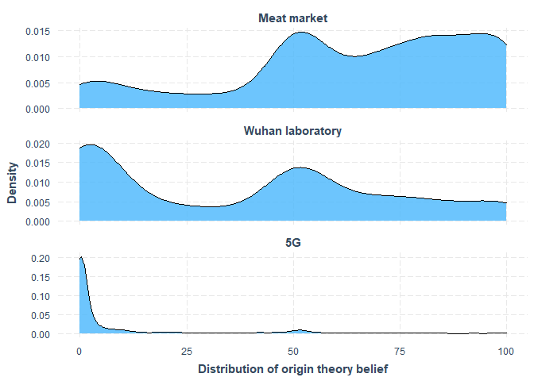
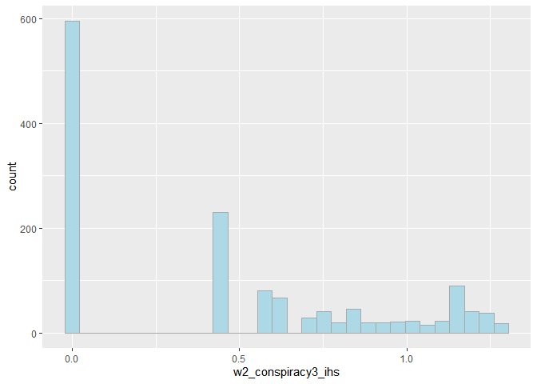
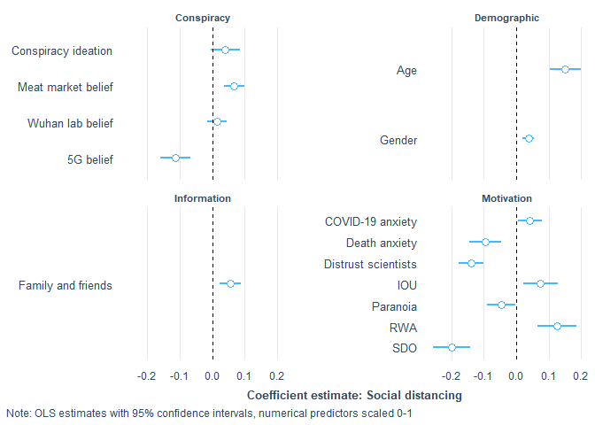
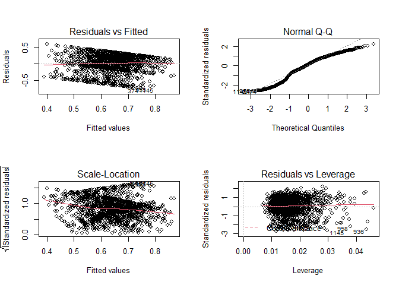

covid\_conspiracies\_markdown2
================
Michael Marshall
21/10/2020

## Loading Packages and Data

``` r
pacman::p_load(tidyverse, stringr, ggridges, forcats, labelled, leaps,
               psych, corrr, cowplot, expss, haven, interplot,
               interactions, jtools,labelled, pscl, psych, 
               sjPlot, skimr)

load("COVID W1_W2_W3 Cleaned 2878.RData") # needs to be in your wd
```

## Rescaling variable

``` r
## [rescale01] Function to rescale a variable from 0 to 1
rescale01 <- function(x, ...) {
  (x - min(x, ...)) / ((max(x, ...)) - min(x, ...))
}
```

## Summary and distribution of different COVID specific conspiracies

``` r
# plotting density of different covid conspiracies
df %>% 
  dplyr::select(W2_Conspiracy_Theory1:W2_Conspiracy_Theory5) %>% 
  gather(conspiracy_code, belief,
         W2_Conspiracy_Theory1:W2_Conspiracy_Theory5) %>%
  mutate(conspiracy_code = as.factor(conspiracy_code)) %>%
  filter(!conspiracy_code %in% c("W2_Conspiracy_Theory4",
                                 "W2_Conspiracy_Theory5")) %>% 
  ggplot(aes(x = belief, y = conspiracy_code, height = ..density..)) +
  geom_density_ridges(aes(rel_min_height = 0.005),
                      stat = "density",
                      fill = get_colors("CUD Bright",num.colors = 1)) +
  theme_nice() +
  scale_y_discrete(labels = c("Wuhan laboratory","Meat market","5G")) +
  labs(y = NULL, x = "Belief scale (0-100)",
       caption = "Distribution of origin theory belief") +
  theme(plot.caption = element_text(hjust = 0.61,
                                    face = "bold",
                                    size = 10),
        axis.title.x = element_text(size = 8,
                                    hjust = 0.5)
  )
```

<!-- -->

``` r
#pacman::p_load(patchwork)
df %>% 
  dplyr::select(W2_Conspiracy_Theory1:W2_Conspiracy_Theory5) %>% 
  gather(conspiracy_code, belief,
         W2_Conspiracy_Theory1:W2_Conspiracy_Theory5) %>%
  mutate(conspiracy_code = fct_recode(
    as.factor(conspiracy_code),
    "Wuhan laboratory" = "W2_Conspiracy_Theory1",
    "Meat market" = "W2_Conspiracy_Theory2",
    "5G" = "W2_Conspiracy_Theory3",
    "4" = "W2_Conspiracy_Theory4",
    "5" = "W2_Conspiracy_Theory5")
    ) %>%
  filter(!conspiracy_code %in% c("4","5")) %>% 
  mutate(
    order_var = ifelse(conspiracy_code == "Meat market", 1,
                       ifelse(conspiracy_code == "Wuhan laboratory",2,3))
  ) %>% 
  ggplot(aes(x = belief)) +
  geom_density(fill = get_colors("CUD Bright",num.colors = 1),
               alpha = 0.8) +
  theme_nice() +
  facet_wrap(~fct_reorder(conspiracy_code,order_var), 
             scales = "free_y", ncol = 1) +
  labs(y = "Density", 
       x = "Distribution of origin theory belief")
```

    ## Warning: attributes are not identical across measure variables;
    ## they will be dropped

    ## Warning: Removed 4416 rows containing non-finite values (stat_density).

<!-- -->

## Cleaning dataset

The following code filters down to just those observations that have
completed the battery of questions relating to COVID specific
conspiracies. It also creates a tibble counting the missing
observations, which can be useful to have as an object.

``` r
# filtering for completed dependent variable
conspiracies <- df %>% 
  filter(!is.na(W2_Conspiracy_Theory1) |
           !is.na(W2_Conspiracy_Theory2) |
           !is.na(W2_Conspiracy_Theory3) |
           !is.na(W2_Conspiracy_Theory3) |
           !is.na(W2_Conspiracy_Theory4) |
           !is.na(W2_Conspiracy_Theory5)) %>% 
  rename(W1_Housing_tenure = W1_Hosuing_tenure)

# function to count NAs
count_na <- function(x){
  sum(is.na(x))
}

conspiracies %>% 
  dplyr::select(W2_Conspiracy_Theory1:W2_Conspiracy_Theory5) %>% 
  map_int(count_na)
```

    ## W2_Conspiracy_Theory1 W2_Conspiracy_Theory2 W2_Conspiracy_Theory3 
    ##                     0                     0                     0 
    ## W2_Conspiracy_Theory4 W2_Conspiracy_Theory5 
    ##                     0                     0

``` r
missing <- tibble(
  variable = names(conspiracies),
  NAs = conspiracies %>% map_int(count_na)
)

#View(missing)
```

The code below combines the two variables on the 2019 general election
into a single variable that combines whether a respondent voted, and who
they voted for. It also turns the *preferred newspaper* variables into
dummy variables, as they were previously coded as *1=Yes* and everything
else as *NA*.

``` r
# making preferred newspaper dummy variable (i.e. replacing NA with 0)
na_to_zero <- function(x){
  x[is.na(x)] <- 0
  x <- as.numeric(x)
  return(x)
} 

paper_vars <- rep(str_c("W2_Newspaper_prefer",seq(1,11,1)))

conspiracies[paper_vars] <- conspiracies[paper_vars] %>% 
  map_df(na_to_zero)

conspiracies <- conspiracies %>% 
  mutate(
    red_top_tabloid = ifelse(
      W2_Newspaper_prefer3 == 1 | W2_Newspaper_prefer2 == 1 |
        W2_Newspaper_prefer7 == 1 | W2_Newspaper_prefer8 == 1 |
        W2_Newspaper_prefer9 == 1, 1, 0),
    mid_level_news = ifelse(
      W2_Newspaper_prefer1 == 1 | W2_Newspaper_prefer4 == 1, 1, 0),
    elite_news = ifelse(
      W2_Newspaper_prefer5 == 1 | W2_Newspaper_prefer6 == 1 |
        W2_Newspaper_prefer10 == 1 | 
        W2_Newspaper_prefer11 == 1, 1, 0)
  )

conspiracies %>% 
  count(red_top_tabloid, mid_level_news, elite_news)
```

    ## # A tibble: 8 x 4
    ##   red_top_tabloid mid_level_news elite_news     n
    ##             <dbl>          <dbl>      <dbl> <int>
    ## 1               0              0          0   423
    ## 2               0              0          1   317
    ## 3               0              1          0   219
    ## 4               0              1          1    75
    ## 5               1              0          0   163
    ## 6               1              0          1    54
    ## 7               1              1          0    73
    ## 8               1              1          1    82

``` r
# Creating DVs
# [nat] nationalism
nat_keys <- list(nationalism = cs(W2_Nationalism1,W2_Nationalism2))
nat_test <- scoreItems(nat_keys, conspiracies, min = 1, max = 5)
head(nat_test$scores)
```

    ##      nationalism
    ## [1,]           4
    ## [2,]           4
    ## [3,]           4
    ## [4,]           3
    ## [5,]           3
    ## [6,]           3

``` r
nat_test$alpha  # Scale alpha
```

    ##       nationalism
    ## alpha   0.8213221

``` r
conspiracies$nat <- rescale01(nat_test$scores, na.rm = TRUE)
conspiracies$nat <- c(conspiracies$nat)  # Ensure variable is numeric and not matrix class
describe(conspiracies$nat)
```

    ##    vars    n mean   sd median trimmed  mad min max range  skew kurtosis   se
    ## X1    1 1406 0.57 0.25   0.62    0.58 0.19   0   1     1 -0.33    -0.18 0.01

``` r
## [imm.econ] Anti-immigrant sentiment - Economy 
table(conspiracies$W1_MigrantAttitudes1)
```

    ## 
    ##   1   2   3   4   5   6   7   8   9  10 
    ##  71  38  80 105 188 198 264 255  87 120

``` r
conspiracies$imm_econ <- rescale01(abs(
  conspiracies$W1_MigrantAttitudes1 - 11))

conspiracies %>% 
  dplyr::select(W1_MigrantAttitudes1, imm_econ) %>%
  correlate()
```

    ## 
    ## Correlation method: 'pearson'
    ## Missing treated using: 'pairwise.complete.obs'

    ## # A tibble: 2 x 3
    ##   rowname              W1_MigrantAttitudes1 imm_econ
    ##   <chr>                               <dbl>    <dbl>
    ## 1 W1_MigrantAttitudes1                   NA       -1
    ## 2 imm_econ                               -1       NA

``` r
## [imm.res] Anti-immigrant sentiment - Resources
table(conspiracies$W1_MigrantAttitudes3)
```

    ## 
    ##   1   2   3   4   5 
    ##  68 101 575 431 231

``` r
conspiracies$imm_res <- rescale01(conspiracies$W1_MigrantAttitudes3)
conspiracies %>% 
  dplyr::select(W1_MigrantAttitudes3, imm_res) %>%
  correlate()
```

    ## 
    ## Correlation method: 'pearson'
    ## Missing treated using: 'pairwise.complete.obs'

    ## # A tibble: 2 x 3
    ##   rowname              W1_MigrantAttitudes3 imm_res
    ##   <chr>                               <dbl>   <dbl>
    ## 1 W1_MigrantAttitudes3                   NA       1
    ## 2 imm_res                                 1      NA

``` r
## [imm.cul] Anti-immigrant sentiment - Culture
table(conspiracies$W1_MigrantAttitudes2)
```

    ## 
    ##   1   2   3   4   5   6   7   8   9  10 
    ## 101  57  88 120 202 177 225 219  80 137

``` r
conspiracies$imm_cul <- rescale01(abs(
  conspiracies$W1_MigrantAttitudes2 - 11))

conspiracies %>% 
  dplyr::select(W1_MigrantAttitudes2, imm_cul) %>%
  correlate()
```

    ## 
    ## Correlation method: 'pearson'
    ## Missing treated using: 'pairwise.complete.obs'

    ## # A tibble: 2 x 3
    ##   rowname              W1_MigrantAttitudes2 imm_cul
    ##   <chr>                               <dbl>   <dbl>
    ## 1 W1_MigrantAttitudes2                   NA      -1
    ## 2 imm_cul                                -1      NA

``` r
# Right wing authoritarianism
rwa_keys <- list(rwa = cs(W1_Authoritarianism1_R,
                          W1_Authoritarianism2,
                          W1_Authoritarianism3,
                          W1_Authoritarianism4_R, 
                          W1_Authoritarianism5_R,
                          W1_Authoritarianism6))

rwa_test <- scoreItems(rwa_keys, conspiracies, min = 1, max = 5)
head(rwa_test$scores)
```

    ##           rwa
    ## [1,] 2.833333
    ## [2,] 2.666667
    ## [3,] 3.166667
    ## [4,] 3.333333
    ## [5,] 3.000000
    ## [6,] 3.500000

``` r
summary(rwa_test$alpha)  # Scale alpha
```

    ##       rwa        
    ##  Min.   :0.6837  
    ##  1st Qu.:0.6837  
    ##  Median :0.6837  
    ##  Mean   :0.6837  
    ##  3rd Qu.:0.6837  
    ##  Max.   :0.6837

``` r
conspiracies$RWA <- rescale01(rwa_test$scores, na.rm = TRUE)
conspiracies$RWA <- c(conspiracies$RWA)  # Ensure variable is numeric and not matrix class

describe(conspiracies$RWA)
```

    ##    vars    n mean   sd median trimmed  mad min max range  skew kurtosis se
    ## X1    1 1406 0.51 0.17    0.5    0.52 0.12   0   1     1 -0.25      0.3  0

``` r
## [SDO] Social Dominance Orientation
sdo_keys <- list(sdo = cs(W1_Social_Dominance1,
                          W1_Social_Dominance2_R,
                          W1_Social_Dominance3_R,
                          W1_Social_Dominance4,
                          W1_Social_Dominance5_R,
                          W1_Social_Dominance6, 
                          W1_Social_Dominance7,
                          W1_Social_Dominance8_R))
sdo_test <- scoreItems(sdo_keys, conspiracies, min = 1, max = 5)
head(sdo_test$scores)
```

    ##        sdo
    ## [1,] 1.500
    ## [2,] 3.000
    ## [3,] 3.000
    ## [4,] 2.625
    ## [5,] 3.000
    ## [6,] 2.500

``` r
summary(sdo_test$alpha)  # Scale alpha
```

    ##       sdo        
    ##  Min.   :0.8404  
    ##  1st Qu.:0.8404  
    ##  Median :0.8404  
    ##  Mean   :0.8404  
    ##  3rd Qu.:0.8404  
    ##  Max.   :0.8404

``` r
conspiracies$SDO <- rescale01(sdo_test$scores, na.rm = TRUE)
conspiracies$SDO <- c(conspiracies$SDO)  # Ensure variable is numeric and not matrix class

summary(conspiracies$SDO)
```

    ##    Min. 1st Qu.  Median    Mean 3rd Qu.    Max. 
    ##  0.0000  0.2258  0.3871  0.3620  0.5161  1.0000

``` r
## [threat] Covid-19 related Threat
summary(conspiracies$W2_COVID19_anxiety)
```

    ##    Min. 1st Qu.  Median    Mean 3rd Qu.    Max. 
    ##    0.00   50.00   65.00   61.25   80.75  100.00

``` r
conspiracies$threat <- rescale01(conspiracies$W2_COVID19_anxiety)
conspiracies %>% 
  dplyr::select(W2_COVID19_anxiety, threat) %>%
  correlate()
```

    ## 
    ## Correlation method: 'pearson'
    ## Missing treated using: 'pairwise.complete.obs'

    ## # A tibble: 2 x 3
    ##   rowname            W2_COVID19_anxiety threat
    ##   <chr>                           <dbl>  <dbl>
    ## 1 W2_COVID19_anxiety                 NA      1
    ## 2 threat                              1     NA

``` r
## [right] Right-Wing political views
table(conspiracies$W1_Political_Scale)
```

    ## 
    ##   1   2   3   4   5   6   7   8   9  10 
    ##  35  44 116 143 488 221 182 102  36  39

``` r
conspiracies$right <- rescale01(conspiracies$W1_Political_Scale)
conspiracies %>% 
  dplyr::select(W1_Political_Scale, right) %>%
  correlate()
```

    ## 
    ## Correlation method: 'pearson'
    ## Missing treated using: 'pairwise.complete.obs'

    ## # A tibble: 2 x 3
    ##   rowname            W1_Political_Scale right
    ##   <chr>                           <dbl> <dbl>
    ## 1 W1_Political_Scale                 NA     1
    ## 2 right                               1    NA

``` r
## [soc.con] Social conservatism
table(conspiracies$W1_Political_Abortion_SSM)
```

    ## 
    ##   1   2   3   4   5   6   7   8   9  10 
    ## 262 123 175 129 330 124 109  67  31  56

``` r
conspiracies$soc_con <- rescale01(
  conspiracies$W1_Political_Abortion_SSM)
conspiracies %>% 
  dplyr::select(W1_Political_Abortion_SSM, soc_con) %>%
  correlate()
```

    ## 
    ## Correlation method: 'pearson'
    ## Missing treated using: 'pairwise.complete.obs'

    ## # A tibble: 2 x 3
    ##   rowname                   W1_Political_Abortion_SSM soc_con
    ##   <chr>                                         <dbl>   <dbl>
    ## 1 W1_Political_Abortion_SSM                        NA       1
    ## 2 soc_con                                           1      NA

``` r
## [fis.con] Fiscal conservatism
table(conspiracies$W1_Political_Fiscal)
```

    ## 
    ##   1   2   3   4   5   6   7   8   9  10 
    ##  55  43 112 133 430 201 226 121  39  46

``` r
conspiracies$fis_con <- rescale01(conspiracies$W1_Political_Fiscal)
conspiracies %>% 
  dplyr::select(W1_Political_Fiscal, fis_con) %>%
  correlate()
```

    ## 
    ## Correlation method: 'pearson'
    ## Missing treated using: 'pairwise.complete.obs'

    ## # A tibble: 2 x 3
    ##   rowname             W1_Political_Fiscal fis_con
    ##   <chr>                             <dbl>   <dbl>
    ## 1 W1_Political_Fiscal                  NA       1
    ## 2 fis_con                               1      NA

``` r
## [age.c] Age (in years)
summary(conspiracies$W2_Age_year)
```

    ##    Min. 1st Qu.  Median    Mean 3rd Qu.    Max. 
    ##   18.00   37.00   50.00   49.32   61.00   88.00

``` r
conspiracies$age_sc <- rescale01(conspiracies$W2_Age_year)
```

``` r
# conspiracy ideation alpha
consp_keys <- list(consp = cs(W1_Conspiracy_1,
                          W1_Conspiracy_2,
                          W1_Conspiracy_3,
                          W1_Conspiracy_4,
                          W1_Conspiracy_5))
consp_test <- scoreItems(consp_keys, conspiracies, min = 1, max = 11)
```

    ## Number of categories should be increased  in order to count frequencies.

``` r
head(consp_test$scores)
```

    ##      consp
    ## [1,]   5.8
    ## [2,]   9.0
    ## [3,]   7.0
    ## [4,]   8.6
    ## [5,]   6.0
    ## [6,]   8.8

``` r
consp_test$alpha  # Scale alpha
```

    ##           consp
    ## alpha 0.8537269

``` r
cor(consp_test$scores, conspiracies$W1_Conspiracy_Total)
```

    ##       [,1]
    ## consp    1

``` r
# uncertainty alpha
iou_keys <- list(iou = cs(W2_IOU1, W2_IOU2,W2_IOU3, W2_IOU4,
                          W2_IOU5, W2_IOU5,W2_IOU6,W2_IOU7,
                          W2_IOU7,W2_IOU8,W2_IOU9,W2_IOU10,
                          W2_IOU11,W2_IOU12))
iou_test <- scoreItems(iou_keys, conspiracies, min = 1, max = 5)
head(iou_test$scores)
```

    ##           iou
    ## [1,] 3.416667
    ## [2,] 3.916667
    ## [3,] 4.250000
    ## [4,] 3.083333
    ## [5,] 3.000000
    ## [6,] 2.500000

``` r
iou_test$alpha  # Scale alpha
```

    ##             iou
    ## alpha 0.9097412

``` r
cor(iou_test$scores, conspiracies$W2_IOU_Total)
```

    ##     [,1]
    ## iou    1

``` r
# paranoia alpha
par_keys <- list(par = cs(W2_Paranoia1,
                        W2_Paranoia2,
                        W2_Paranoia3, W2_Paranoia4, W2_Paranoia5))
par_test <- scoreItems(par_keys, conspiracies, min = 1, max = 5)
head(par_test$scores)
```

    ##      par
    ## [1,] 1.6
    ## [2,] 3.4
    ## [3,] 3.8
    ## [4,] 1.4
    ## [5,] 3.0
    ## [6,] 2.4

``` r
par_test$alpha  # Scale alpha
```

    ##             par
    ## alpha 0.8557798

``` r
cor(par_test$scores, conspiracies$W2_Paranoia_Total)
```

    ##     [,1]
    ## par    1

``` r
# dai alpha
dai_keys <- list(dai = cs(W2_DAI1,W2_DAI2,W2_DAI3,W2_DAI4,W2_DAI5,
                        W2_DAI6,W2_DAI7,W2_DAI8,W2_DAI9,W2_DAI10,
                        W2_DAI11, W2_DAI12, W2_DAI13,W2_DAI14,
                        W2_DAI15,W2_DAI16,W2_DAI17))
dai_test <- scoreItems(dai_keys, conspiracies, min = 1, max = 5)
head(dai_test$scores)
```

    ##           dai
    ## [1,] 1.764706
    ## [2,] 2.529412
    ## [3,] 1.941176
    ## [4,] 2.117647
    ## [5,] 3.000000
    ## [6,] 2.588235

``` r
dai_test$alpha  # Scale alpha
```

    ##            dai
    ## alpha 0.937162

``` r
cor(dai_test$scores, conspiracies$W2_DAI_Total)
```

    ##     [,1]
    ## dai    1

``` r
factors <- c("W1_Ethnicity","W1_C19_Infected","W1_BornUK","W1_EURef",
             "W2_Gender_binary","W2_Living_alone","W2_Employment",
             "W1_Education_binary","W1_Housing_tenure")
```

``` r
# turning the above list into factors with the levels as the spss labels
#for(i in seq_along(conspiracies[factors])){
#  conspiracies[factors][,i] <- to_factor(
#    conspiracies[factors][,i], nolabel_to_na = TRUE)
#}
```

``` r
# turning to factors
conspiracies[factors] <- conspiracies[factors] %>% 
  map_df(as.factor)
```

``` r
# Making a binary for each CRT scale, baseline = incorrect answer
conspiracies$CRT1 <- ifelse(
  to_factor(conspiracies$W1_CRT1) == "5 pence", 1, 0
)

conspiracies$CRT2 <- ifelse(
  to_factor(conspiracies$W1_CRT2) == "5 minutes", 1, 0
)

conspiracies$CRT3 <- ifelse(
  to_factor(conspiracies$W1_CRT3) == "47 days", 1, 0
)

conspiracies$CRT4 <- ifelse(
  to_factor(conspiracies$W1_CRT4) == "2nd", 1, 0
)

conspiracies$CRT5 <- ifelse(
  to_factor(conspiracies$W1_CRT5) == "8", 1, 0
)

conspiracies$CRT_test <- ifelse(
  to_factor(conspiracies$W1_CRT_test) == "None of them.", 1, 0
) # baseline = heard of some of them OR all of them
```

``` r
# CRT
crt_keys <- list(crt = cs(CRT1,
                          CRT2,
                          CRT3,
                          CRT4, 
                          CRT5
                          ))

crt_test <- scoreItems(crt_keys, conspiracies, min = 0, max = 1)
head(crt_test$scores)
```

    ##      crt
    ## [1,] 0.2
    ## [2,] 0.4
    ## [3,] 0.0
    ## [4,] 0.2
    ## [5,] 0.0
    ## [6,] 0.0

``` r
summary(crt_test$alpha)  # Scale alpha
```

    ##       crt        
    ##  Min.   :0.7332  
    ##  1st Qu.:0.7332  
    ##  Median :0.7332  
    ##  Mean   :0.7332  
    ##  3rd Qu.:0.7332  
    ##  Max.   :0.7332

``` r
conspiracies$crt <- rescale01(crt_test$scores, na.rm = TRUE)
conspiracies$crt <- c(conspiracies$crt)  # Ensure variable is numeric and not matrix class

describe(conspiracies$crt)
```

    ##    vars    n mean   sd median trimmed mad min max range skew kurtosis   se
    ## X1    1 1406 0.39 0.33    0.4    0.36 0.3   0   1     1 0.41    -1.06 0.01

``` r
# do CRT scores come from different distributions
# dependent on whether they've seen the test

conspiracies %>% 
  group_by(CRT_test) %>% 
  summarise(
    mean_crt = mean(crt),
    median_crt = median(crt),
    std_crt = sd(crt)
  )
```

    ## `summarise()` ungrouping output (override with `.groups` argument)

    ## # A tibble: 2 x 4
    ##   CRT_test mean_crt median_crt std_crt
    ##      <dbl>    <dbl>      <dbl>   <dbl>
    ## 1        0    0.478        0.4   0.335
    ## 2        1    0.334        0.2   0.314

``` r
kruskal.test(crt ~ CRT_test, data = conspiracies)
```

    ## 
    ##  Kruskal-Wallis rank sum test
    ## 
    ## data:  crt by CRT_test
    ## Kruskal-Wallis chi-squared = 61.72, df = 1, p-value = 3.96e-15

``` r
# renaming trust in science
conspiracies <- conspiracies %>% 
  rename(distrust_science = W2_Trust_Body6)
```

``` r
# rescaling the remaing numeric variables
numerics <- c("W1_Conspiracy_Total","W2_Paranoia_Total",
              "W2_Internal_Total","W2_Chance_Total","W2_PO_Total",
              "W2_DAI_Total","W2_IOU_Total", "W2_INFO_5",
              "W2_INFO_9","distrust_science","W1_Income_2019")

conspiracies[numerics] <- conspiracies[numerics] %>% 
  map_df(rescale01, na.rm = TRUE)
```

``` r
# creating scaled versions of each conspiracy belief
conspiracies$conspiracy1_sc <- rescale01(
  conspiracies$W2_Conspiracy_Theory1, na.rm = TRUE
)

conspiracies$conspiracy2_sc <- rescale01(
  conspiracies$W2_Conspiracy_Theory2, na.rm = TRUE
)

conspiracies$conspiracy3_sc <- rescale01(
  conspiracies$W2_Conspiracy_Theory3, na.rm = TRUE
)

conspiracies$conspiracy4_sc <- rescale01(
  conspiracies$W2_Conspiracy_Theory4, na.rm = TRUE
)

conspiracies$conspiracy5_sc <- rescale01(
  conspiracies$W2_Conspiracy_Theory5, na.rm = TRUE
)
```

## Distribution of variables

A for loop to look at distribution of potential independent variables
(numeric only).

``` r
plot_vars <- conspiracies %>% 
  dplyr::select(
    one_of(numerics),nat,RWA,SDO,threat,right,soc_con,fis_con
    ) %>%
  names()

for(i in seq_along(plot_vars)){
  
  x1 <- conspiracies[plot_vars][i] %>% as_vector()
  
  print(
    ggplot(data = NULL, aes(x = x1)) +
      geom_vline(aes(xintercept = mean(x1, na.rm =TRUE)), 
                 colour = "black",
                 linetype = "dashed") +
      geom_vline(aes(xintercept = median(x1, na.rm =TRUE)), 
                 colour = "red",
                 linetype = "dashed") +
      geom_density(fill = "lightblue", alpha = 0.7) +
      labs(x = plot_vars[i],
           caption = "Black = Mean, Red = Median")  
  )
  
}
```

<!-- --><!-- --><!-- --><!-- --><!-- --><!-- --><!-- --><!-- --><!-- -->

    ## Warning: Removed 4 rows containing non-finite values (stat_density).

<!-- --><!-- --><!-- --><!-- --><!-- --><!-- --><!-- --><!-- --><!-- -->

# Principal Components Analysis - PCA

``` r
# pca on conspiracy theory variables
pca_df <- conspiracies %>% 
  dplyr::select(W2_Conspiracy_Theory1:W2_Conspiracy_Theory5)

pca_fit <- prcomp(pca_df,scale = TRUE)
```

``` r
# looking at biplots for components 1:4
biplot(pca_fit,
       col = c("lightgrey","red"))
```

<!-- -->

``` r
biplot(pca_fit, choices = 3:4,
       col = c("lightgrey","red"))
```

<!-- -->

``` r
pca_fit$rotation[,1:4]
```

    ##                               PC1         PC2        PC3          PC4
    ## W2_Conspiracy_Theory1  0.38903347  0.24539595 -0.8871956  0.005348538
    ## W2_Conspiracy_Theory2 -0.06373755 -0.95279476 -0.2915166  0.055301539
    ## W2_Conspiracy_Theory3  0.56176975 -0.06995748  0.2010846  0.389643958
    ## W2_Conspiracy_Theory4  0.46001469 -0.12890497  0.1587345 -0.862444840
    ## W2_Conspiracy_Theory5  0.56337529 -0.10223712  0.2495403  0.318244587

``` r
components <- pca_fit$x[,1:4] %>% as_tibble()
```

First four principal components are as follows:  
1\. general conspiracy ideation, with belief in 5G, ‘it’s no worse than
flu’ and vitamin C treatment highly loaded to this component, and belief
in Chinese lab less so  
2\. disbelief in Chinese meat market origin, with mild positive loading
for Chinese lab origin  
3\. strong conspiracy ideation (non-nationalistic), strong loading for
belig 5g, ‘it’s no worse than flu’ and vitamin C treatment, with
negative loading for both Chinese lab origin and Chinese meat market  
4\. strong loading for belief in 5G conspiracy and vitamin C treatment,
but strong negative loading for belief ‘it’s no worse than flu’

``` r
pc <- cbind(conspiracies,components)

pc <- pc %>% 
  mutate(
    pc1_ihs = asinh(PC1)
  )

pc %>% 
  ggplot(aes(x = pc1_ihs)) +
  geom_density() +
  labs(x = "Principal Component 1 (IHS)")
```

<!-- -->

``` r
pc %>% 
  ggplot(aes(x = PC2)) +
  geom_density() +
  labs(x = "Principal Component 2")
```

<!-- -->

``` r
pc %>% 
  ggplot(aes(x = PC3)) +
  geom_density() +
  labs(x = "Principal Component 3")
```

<!-- -->

``` r
pc %>% 
  ggplot(aes(x = PC4)) +
  geom_density()  +
  labs(x = "Principal Component 4")
```

<!-- -->

Principal components 1 to 3 explain most of the variation in the data.

``` r
# modelling principal components against general conspiracy ideation
conspiracy_mod <- lm(W1_Conspiracy_Total ~ pc1_ihs + PC2 + PC3 + PC4,
                     data = pc)

par(mfrow = c(2,2))
plot(conspiracy_mod)
```

<!-- -->

``` r
summ(conspiracy_mod, vifs = TRUE)
```

    ## MODEL INFO:
    ## Observations: 1406
    ## Dependent Variable: W1_Conspiracy_Total
    ## Type: OLS linear regression 
    ## 
    ## MODEL FIT:
    ## F(4,1401) = 20.56, p = 0.00
    ## R² = 0.06
    ## Adj. R² = 0.05 
    ## 
    ## Standard errors: OLS
    ## -------------------------------------------------------
    ##                      Est.   S.E.   t val.      p    VIF
    ## ----------------- ------- ------ -------- ------ ------
    ## (Intercept)          0.58   0.01   111.45   0.00       
    ## pc1_ihs              0.03   0.01     6.56   0.00   1.01
    ## PC2                  0.01   0.01     1.23   0.22   1.00
    ## PC3                 -0.03   0.01    -5.78   0.00   1.00
    ## PC4                  0.00   0.01     0.05   0.96   1.00
    ## -------------------------------------------------------

``` r
source("diagnostic_plots.R")
```

Only principal components 1 and 3 associated with general conspiracy
ideation.

# Modelling for belief in Chinese lab origin

## DV Chinese lab conspiracy - singular IV models

``` r
sdo_lab <- lm(conspiracy1_sc ~ SDO,
              data = conspiracies)

summ(sdo_lab)
```

    ## MODEL INFO:
    ## Observations: 1406
    ## Dependent Variable: conspiracy1_sc
    ## Type: OLS linear regression 
    ## 
    ## MODEL FIT:
    ## F(1,1404) = 65.28, p = 0.00
    ## R² = 0.04
    ## Adj. R² = 0.04 
    ## 
    ## Standard errors: OLS
    ## -----------------------------------------------
    ##                     Est.   S.E.   t val.      p
    ## ----------------- ------ ------ -------- ------
    ## (Intercept)         0.24   0.02    12.34   0.00
    ## SDO                 0.39   0.05     8.08   0.00
    ## -----------------------------------------------

``` r
rwa_lab <- lm(conspiracy1_sc ~ RWA,
              data = conspiracies)

summ(rwa_lab)
```

    ## MODEL INFO:
    ## Observations: 1406
    ## Dependent Variable: conspiracy1_sc
    ## Type: OLS linear regression 
    ## 
    ## MODEL FIT:
    ## F(1,1404) = 87.72, p = 0.00
    ## R² = 0.06
    ## Adj. R² = 0.06 
    ## 
    ## Standard errors: OLS
    ## -----------------------------------------------
    ##                     Est.   S.E.   t val.      p
    ## ----------------- ------ ------ -------- ------
    ## (Intercept)         0.14   0.03     5.07   0.00
    ## RWA                 0.47   0.05     9.37   0.00
    ## -----------------------------------------------

``` r
mid_news_lab <- lm(conspiracy1_sc ~ mid_level_news,
              data = conspiracies)

summ(mid_news_lab)
```

    ## MODEL INFO:
    ## Observations: 1406
    ## Dependent Variable: conspiracy1_sc
    ## Type: OLS linear regression 
    ## 
    ## MODEL FIT:
    ## F(1,1404) = 96.79, p = 0.00
    ## R² = 0.06
    ## Adj. R² = 0.06 
    ## 
    ## Standard errors: OLS
    ## --------------------------------------------------
    ##                        Est.   S.E.   t val.      p
    ## -------------------- ------ ------ -------- ------
    ## (Intercept)            0.32   0.01    31.29   0.00
    ## mid_level_news         0.18   0.02     9.84   0.00
    ## --------------------------------------------------

``` r
social_m_lab <- lm(conspiracy1_sc ~ W2_INFO_5,
              data = conspiracies)

summ(social_m_lab)
```

    ## MODEL INFO:
    ## Observations: 1406
    ## Dependent Variable: conspiracy1_sc
    ## Type: OLS linear regression 
    ## 
    ## MODEL FIT:
    ## F(1,1404) = 43.67, p = 0.00
    ## R² = 0.03
    ## Adj. R² = 0.03 
    ## 
    ## Standard errors: OLS
    ## -----------------------------------------------
    ##                     Est.   S.E.   t val.      p
    ## ----------------- ------ ------ -------- ------
    ## (Intercept)         0.33   0.01    27.33   0.00
    ## W2_INFO_5           0.18   0.03     6.61   0.00
    ## -----------------------------------------------

## DV Chinese lab conspiracy - socio-economic variables

``` r
se_lab <- lm(conspiracy1_sc ~ W2_Gender_binary +
               W1_Education_binary +
               W1_Income_2019 +
               age_sc,
              data = conspiracies)

summary(se_lab)$adj.r.squared
```

    ## [1] 0.03374514

``` r
AIC(se_lab)
```

    ## [1] 846.3742

## DV Chinese lab conspiracy - socio-economic variables + political/media

``` r
se_pol_lab <- update(se_lab, ~ . +
                   #political and media variables
                   right +
                   soc_con +
                   fis_con +
                   nat +
                   distrust_science + #distrust of scientists
                   red_top_tabloid + 
                   mid_level_news + 
                   elite_news + 
                   W2_INFO_5 + #social media
                   W2_INFO_9 #family and friends
                 )

summary(se_pol_lab)$adj.r.squared
```

    ## [1] 0.1972147

``` r
AIC(se_pol_lab)
```

    ## [1] 593.503

## DV Chinese lab conspiracy - socio-economic variables + political/media + pol-psych

``` r
se_polpsych_lab <- update(se_pol_lab, ~ . +
                        #political-psychology variables
                        SDO +
                        RWA +
                        W2_DAI_Total +
                        W2_IOU_Total +
                        W2_Paranoia_Total)

summary(se_polpsych_lab)$adj.r.squared
```

    ## [1] 0.2295136

``` r
AIC(se_polpsych_lab)
```

    ## [1] 540.9893

``` r
car::vif(se_polpsych_lab)
```

    ## Registered S3 methods overwritten by 'car':
    ##   method                          from
    ##   influence.merMod                lme4
    ##   cooks.distance.influence.merMod lme4
    ##   dfbeta.influence.merMod         lme4
    ##   dfbetas.influence.merMod        lme4

    ##    W2_Gender_binary W1_Education_binary      W1_Income_2019              age_sc 
    ##            1.125275            1.126881            1.186177            1.442031 
    ##               right             soc_con             fis_con                 nat 
    ##            2.075386            1.684671            2.110168            1.342846 
    ##    distrust_science     red_top_tabloid      mid_level_news          elite_news 
    ##            1.152754            1.090730            1.129362            1.132350 
    ##           W2_INFO_5           W2_INFO_9                 SDO                 RWA 
    ##            1.398856            1.227175            1.502057            1.518160 
    ##        W2_DAI_Total        W2_IOU_Total   W2_Paranoia_Total 
    ##            1.517283            1.519868            1.644123

Looking at mulitcollinearity below for the following variables:

  - right  
  - soc\_con  
  - fis\_con

<!-- end list -->

``` r
# looking for potential multicollinearity with right
cor_mat <- model.matrix(se_polpsych_lab) %>% as.data.frame()

cor_vec <- rep(NA,ncol(cor_mat))
for(i in seq_along(cor_mat)){
  cor_vec[i] <- cor(cor_mat$right,cor_mat[,i])
}
```

    ## Warning in cor(cor_mat$right, cor_mat[, i]): the standard deviation is zero

``` r
tibble(cor_vec,
       names(cor_mat)) %>% 
  arrange(desc(cor_vec))
```

    ## # A tibble: 20 x 2
    ##     cor_vec `names(cor_mat)`    
    ##       <dbl> <chr>               
    ##  1  1       right               
    ##  2  0.668   fis_con             
    ##  3  0.460   soc_con             
    ##  4  0.445   SDO                 
    ##  5  0.379   nat                 
    ##  6  0.376   RWA                 
    ##  7  0.239   mid_level_news      
    ##  8  0.135   age_sc              
    ##  9  0.112   W1_Income_2019      
    ## 10  0.0618  distrust_science    
    ## 11  0.0471  W2_DAI_Total        
    ## 12  0.0244  red_top_tabloid     
    ## 13 -0.00278 W2_INFO_9           
    ## 14 -0.0105  W2_IOU_Total        
    ## 15 -0.0118  W2_Paranoia_Total   
    ## 16 -0.0224  W2_INFO_5           
    ## 17 -0.0621  W2_Gender_binary2   
    ## 18 -0.0712  W1_Education_binary1
    ## 19 -0.107   elite_news          
    ## 20 NA       (Intercept)

Fiscal conservatism positively correlated with right-left scale.

``` r
# looking for multicollinearity with soc_con
cor_vec2 <- rep(NA,ncol(cor_mat))
for(i in seq_along(cor_mat)){
  cor_vec2[i] <- cor(cor_mat$soc_con,cor_mat[,i])
}
```

    ## Warning in cor(cor_mat$soc_con, cor_mat[, i]): the standard deviation is zero

``` r
tibble(cor_vec2,
       names(cor_mat)) %>% 
  arrange(desc(cor_vec2))
```

    ## # A tibble: 20 x 2
    ##    cor_vec2 `names(cor_mat)`    
    ##       <dbl> <chr>               
    ##  1  1       soc_con             
    ##  2  0.503   fis_con             
    ##  3  0.460   right               
    ##  4  0.448   RWA                 
    ##  5  0.380   SDO                 
    ##  6  0.261   nat                 
    ##  7  0.199   distrust_science    
    ##  8  0.192   mid_level_news      
    ##  9  0.151   W2_DAI_Total        
    ## 10  0.114   W2_Paranoia_Total   
    ## 11  0.0862  red_top_tabloid     
    ## 12  0.0590  W2_IOU_Total        
    ## 13  0.0545  age_sc              
    ## 14  0.0196  W2_INFO_9           
    ## 15  0.00762 W2_INFO_5           
    ## 16 -0.0327  W1_Income_2019      
    ## 17 -0.0466  W1_Education_binary1
    ## 18 -0.115   W2_Gender_binary2   
    ## 19 -0.165   elite_news          
    ## 20 NA       (Intercept)

Fiscal conservatism, right-wing scale and RWA correlated with soc\_con.

``` r
# looking for multicollinearity with fis_con
cor_vec3 <- rep(NA,ncol(cor_mat))
for(i in seq_along(cor_mat)){
  cor_vec3[i] <- cor(cor_mat$fis_con,cor_mat[,i])
}
```

    ## Warning in cor(cor_mat$fis_con, cor_mat[, i]): the standard deviation is zero

``` r
tibble(cor_vec3,
       names(cor_mat)) %>% 
  arrange(desc(cor_vec3))
```

    ## # A tibble: 20 x 2
    ##     cor_vec3 `names(cor_mat)`    
    ##        <dbl> <chr>               
    ##  1  1.00     fis_con             
    ##  2  0.668    right               
    ##  3  0.503    soc_con             
    ##  4  0.404    SDO                 
    ##  5  0.381    nat                 
    ##  6  0.362    RWA                 
    ##  7  0.216    mid_level_news      
    ##  8  0.131    W1_Income_2019      
    ##  9  0.128    age_sc              
    ## 10  0.0478   distrust_science    
    ## 11  0.0262   W2_DAI_Total        
    ## 12  0.00732  red_top_tabloid     
    ## 13  0.00628  W2_Paranoia_Total   
    ## 14 -0.000640 W2_INFO_9           
    ## 15 -0.00242  W2_IOU_Total        
    ## 16 -0.0459   W1_Education_binary1
    ## 17 -0.0680   W2_INFO_5           
    ## 18 -0.0803   W2_Gender_binary2   
    ## 19 -0.101    elite_news          
    ## 20 NA        (Intercept)

Right, soc\_con correlated with fis\_con.

Potential multicollinearity between right, soc\_con and fis\_con. From
hereon, fis\_con is included in the models, as of the three, it shows
the least positive correlation between SDO and RWA.

## DV Chinese lab belief - model above minus the aforementioned variables

``` r
se_polpsych_lab_2 <- lm(conspiracy1_sc ~
                        
                        #socio-economic variables
                        W2_Gender_binary +
                        W1_Education_binary +
                        W1_Income_2019 +
                        age_sc +
                        
                        #political and media variables
                        fis_con +
                        nat +
                        distrust_science +
                        red_top_tabloid + 
                        mid_level_news + 
                        elite_news + 
                        W2_INFO_5 + #social media
                        W2_INFO_9 + #family and friends
                     
                        #political-psychology variables
                        SDO +
                        RWA +
                        W2_DAI_Total +
                        W2_IOU_Total +
                        W2_Paranoia_Total,
                      data = conspiracies)

summary(se_polpsych_lab_2)$adj.r.squared
```

    ## [1] 0.2303279

``` r
AIC(se_polpsych_lab_2)
```

    ## [1] 537.5375

``` r
car::vif(se_polpsych_lab_2)
```

    ##    W2_Gender_binary W1_Education_binary      W1_Income_2019              age_sc 
    ##            1.100105            1.122952            1.175162            1.436964 
    ##             fis_con                 nat    distrust_science     red_top_tabloid 
    ##            1.437894            1.325992            1.126665            1.089135 
    ##      mid_level_news          elite_news           W2_INFO_5           W2_INFO_9 
    ##            1.120525            1.128726            1.396056            1.226663 
    ##                 SDO                 RWA        W2_DAI_Total        W2_IOU_Total 
    ##            1.431048            1.390055            1.507019            1.519853 
    ##   W2_Paranoia_Total 
    ##            1.639540

## DV Chinese lab conspiracy - socio-economic variables + political/media + pol-psych + covid-threat + CRT

``` r
multi_lab <- update(se_polpsych_lab_2, ~ . +
                  #covid-anxety
                  threat +
                  
                  #CRT
                  crt +
                  CRT_test)

summary(multi_lab)$adj.r.squared
```

    ## [1] 0.2445966

``` r
AIC(multi_lab)
```

    ## [1] 514.316

## DV Chinese lab conspiracy - full model incl. conspiracy ideation

``` r
full_lab <- update(multi_lab, ~ . + 
                  #conspiracies
                  W1_Conspiracy_Total +
                  conspiracy2_sc +
                  conspiracy3_sc)

summary(full_lab)$adj.r.squared
```

    ## [1] 0.2902613

``` r
AIC(full_lab)
```

    ## [1] 430.0324

# Modelling for belief in 5G origin conspiracy

## Plots of DV, incl. inverse hyperbolic sine transformation

``` r
# functions for IHS transformation
ihs <- function(x, theta){  # IHS transformation
  asinh(theta * x)/theta
}

ihs_loglik <- function(theta,x){
  
  ihs <- function(x, theta){  # function to IHS transform
    asinh(theta * x)/theta
  }
  
  n <- length(x)
  xt <- ihs(x, theta)
  
  log_lik <- -n*log(sum((xt - mean(xt))^2))- sum(log(1+theta^2*x^2))
  return(log_lik)
}     


# alternative using shapiro-wik test
shapiro_test_pvalue <- function(theta, x){ 
  x <- ihs(x, theta) 
  shapiro.test(x)$p.value 
}
```

``` r
best_theta <- optimize(shapiro_test_pvalue, 
                       lower = 0.00001, upper = 50,
                       x = conspiracies$W2_Conspiracy_Theory3, 
                       maximum = TRUE)$maximum
best_theta
```

    ## [1] 5.450961

``` r
conspiracies %>% 
  ggplot(aes(x = W2_Conspiracy_Theory3)) +
  geom_histogram(colour = "darkgrey", fill = "lightblue")
```

    ## `stat_bin()` using `bins = 30`. Pick better value with `binwidth`.

<!-- -->

``` r
conspiracies <- conspiracies %>% 
  mutate(w2_conspiracy3_ihs = ihs(W2_Conspiracy_Theory3, best_theta))

conspiracies %>% 
  ggplot(aes(x = w2_conspiracy3_ihs)) +
  geom_histogram(colour = "darkgrey", fill = "lightblue")
```

    ## `stat_bin()` using `bins = 30`. Pick better value with `binwidth`.

<!-- -->

## DV 5G conspiracy - singular IV models

``` r
sdo_5g <- lm(conspiracy3_sc ~ SDO,
              data = conspiracies)

summ(sdo_5g)
```

    ## MODEL INFO:
    ## Observations: 1406
    ## Dependent Variable: conspiracy3_sc
    ## Type: OLS linear regression 
    ## 
    ## MODEL FIT:
    ## F(1,1404) = 82.37, p = 0.00
    ## R² = 0.06
    ## Adj. R² = 0.05 
    ## 
    ## Standard errors: OLS
    ## -----------------------------------------------
    ##                     Est.   S.E.   t val.      p
    ## ----------------- ------ ------ -------- ------
    ## (Intercept)         0.01   0.01     0.57   0.57
    ## SDO                 0.29   0.03     9.08   0.00
    ## -----------------------------------------------

``` r
rwa_5g <- lm(conspiracy3_sc ~ RWA,
              data = conspiracies)

summ(rwa_5g)
```

    ## MODEL INFO:
    ## Observations: 1406
    ## Dependent Variable: conspiracy3_sc
    ## Type: OLS linear regression 
    ## 
    ## MODEL FIT:
    ## F(1,1404) = 2.80, p = 0.09
    ## R² = 0.00
    ## Adj. R² = 0.00 
    ## 
    ## Standard errors: OLS
    ## -----------------------------------------------
    ##                     Est.   S.E.   t val.      p
    ## ----------------- ------ ------ -------- ------
    ## (Intercept)         0.08   0.02     4.40   0.00
    ## RWA                 0.06   0.03     1.67   0.09
    ## -----------------------------------------------

``` r
mid_news_5g <- lm(conspiracy3_sc ~ mid_level_news,
              data = conspiracies)

summ(mid_news_5g)
```

    ## MODEL INFO:
    ## Observations: 1406
    ## Dependent Variable: conspiracy3_sc
    ## Type: OLS linear regression 
    ## 
    ## MODEL FIT:
    ## F(1,1404) = 13.82, p = 0.00
    ## R² = 0.01
    ## Adj. R² = 0.01 
    ## 
    ## Standard errors: OLS
    ## --------------------------------------------------
    ##                        Est.   S.E.   t val.      p
    ## -------------------- ------ ------ -------- ------
    ## (Intercept)            0.10   0.01    13.72   0.00
    ## mid_level_news         0.05   0.01     3.72   0.00
    ## --------------------------------------------------

``` r
social_m_5g <- lm(conspiracy3_sc ~ W2_INFO_5,
              data = conspiracies)

summ(social_m_5g)
```

    ## MODEL INFO:
    ## Observations: 1406
    ## Dependent Variable: conspiracy3_sc
    ## Type: OLS linear regression 
    ## 
    ## MODEL FIT:
    ## F(1,1404) = 90.16, p = 0.00
    ## R² = 0.06
    ## Adj. R² = 0.06 
    ## 
    ## Standard errors: OLS
    ## -----------------------------------------------
    ##                     Est.   S.E.   t val.      p
    ## ----------------- ------ ------ -------- ------
    ## (Intercept)         0.06   0.01     7.78   0.00
    ## W2_INFO_5           0.17   0.02     9.50   0.00
    ## -----------------------------------------------

## DV 5G conspiracy - socio-economic variables

``` r
se_5g <- lm(conspiracy3_sc ~ W2_Gender_binary +
               W1_Education_binary +
               W1_Income_2019 +
               age_sc,
              data = conspiracies)

#function for adj.r.squared
adj_rsq <- function(mod){
  out <- summary(mod)$adj.r.squared
  return(out)
}

adj_rsq(se_5g)
```

    ## [1] 0.05127553

``` r
AIC(se_5g)
```

    ## [1] -348.4171

## DV 5G conspiracy - socio-economic variables + political/media

As with modelling above, fis\_con is included instead of soc\_con and
right to avoid multicollinearity problem.

``` r
se_pol_5g <- update(se_5g, ~ . +
                   #political and media variables
                   fis_con +
                   nat +
                   distrust_science + 
                   red_top_tabloid + 
                   mid_level_news + 
                   elite_news + 
                   W2_INFO_5 + #social media
                   W2_INFO_9) # family and friends

adj_rsq(se_pol_5g)
```

    ## [1] 0.1950187

``` r
AIC(se_pol_5g)
```

    ## [1] -576.0983

## DV 5G conspiracy - socio-economic variables + political/media + pol-psych

``` r
se_polpsych_5g <- update(se_pol_5g, ~ . +
                        #political-psychology variables
                        SDO +
                        RWA +
                        W2_DAI_Total +
                        W2_IOU_Total +
                        W2_Paranoia_Total)

adj_rsq(se_polpsych_5g)
```

    ## [1] 0.2696314

``` r
AIC(se_polpsych_5g)
```

    ## [1] -707.2347

## DV 5G conspiracy - socio-economic variables + political/media + pol-psych + covid-threat

``` r
multi_5g <- update(se_polpsych_5g, ~ . +
                  #covid-anxiety
                  threat +
                 
                  # crt
                  crt +
                  CRT_test)

adj_rsq(multi_5g)
```

    ## [1] 0.282122

``` r
AIC(multi_5g)
```

    ## [1] -728.4095

## DV 5G conspiracy - socio-economic variables + political/media + pol-psych + covid-threat and CRT + conspiracies

``` r
full_5g <- update(multi_5g, ~ . +
                #conspiracies
                W1_Conspiracy_Total +
                conspiracy1_sc +
                conspiracy2_sc)

adj_rsq(full_5g)
```

    ## [1] 0.2973996

``` r
AIC(full_5g)
```

    ## [1] -755.5528

## DV 5G IHS conspiracy - singular IV models

``` r
sdo_5g_ihs <- lm(w2_conspiracy3_ihs ~ SDO,
              data = conspiracies)

summ(sdo_5g_ihs)
```

    ## MODEL INFO:
    ## Observations: 1406
    ## Dependent Variable: w2_conspiracy3_ihs
    ## Type: OLS linear regression 
    ## 
    ## MODEL FIT:
    ## F(1,1404) = 104.57, p = 0.00
    ## R² = 0.07
    ## Adj. R² = 0.07 
    ## 
    ## Standard errors: OLS
    ## -----------------------------------------------
    ##                     Est.   S.E.   t val.      p
    ## ----------------- ------ ------ -------- ------
    ## (Intercept)         0.21   0.03     8.20   0.00
    ## SDO                 0.65   0.06    10.23   0.00
    ## -----------------------------------------------

``` r
rwa_5g_ihs <- lm(w2_conspiracy3_ihs ~ RWA,
              data = conspiracies)

summ(rwa_5g_ihs)
```

    ## MODEL INFO:
    ## Observations: 1406
    ## Dependent Variable: w2_conspiracy3_ihs
    ## Type: OLS linear regression 
    ## 
    ## MODEL FIT:
    ## F(1,1404) = 35.56, p = 0.00
    ## R² = 0.02
    ## Adj. R² = 0.02 
    ## 
    ## Standard errors: OLS
    ## -----------------------------------------------
    ##                     Est.   S.E.   t val.      p
    ## ----------------- ------ ------ -------- ------
    ## (Intercept)         0.24   0.04     6.34   0.00
    ## RWA                 0.41   0.07     5.96   0.00
    ## -----------------------------------------------

``` r
mid_news_5g_ihs <- lm(w2_conspiracy3_ihs ~ mid_level_news,
              data = conspiracies)

summ(mid_news_5g_ihs)
```

    ## MODEL INFO:
    ## Observations: 1406
    ## Dependent Variable: w2_conspiracy3_ihs
    ## Type: OLS linear regression 
    ## 
    ## MODEL FIT:
    ## F(1,1404) = 22.71, p = 0.00
    ## R² = 0.02
    ## Adj. R² = 0.02 
    ## 
    ## Standard errors: OLS
    ## --------------------------------------------------
    ##                        Est.   S.E.   t val.      p
    ## -------------------- ------ ------ -------- ------
    ## (Intercept)            0.41   0.01    28.75   0.00
    ## mid_level_news         0.12   0.03     4.77   0.00
    ## --------------------------------------------------

``` r
social_m_5g_ihs <- lm(w2_conspiracy3_ihs ~ W2_INFO_5,
              data = conspiracies)

summ(social_m_5g_ihs)
```

    ## MODEL INFO:
    ## Observations: 1406
    ## Dependent Variable: w2_conspiracy3_ihs
    ## Type: OLS linear regression 
    ## 
    ## MODEL FIT:
    ## F(1,1404) = 85.20, p = 0.00
    ## R² = 0.06
    ## Adj. R² = 0.06 
    ## 
    ## Standard errors: OLS
    ## -----------------------------------------------
    ##                     Est.   S.E.   t val.      p
    ## ----------------- ------ ------ -------- ------
    ## (Intercept)         0.35   0.02    21.95   0.00
    ## W2_INFO_5           0.33   0.04     9.23   0.00
    ## -----------------------------------------------

## DV 5G IHS conspiracy - socio-economic variables

``` r
se_5g_ihs <- lm(w2_conspiracy3_ihs ~ W2_Gender_binary +
               W1_Education_binary +
               W1_Income_2019 +
               age_sc,
              data = conspiracies)

adj_rsq(se_5g_ihs)
```

    ## [1] 0.03911744

``` r
AIC(se_5g_ihs)
```

    ## [1] 1646.507

## DV 5G IHS conspiracy - socio-economic variables + political/media

As with modelling above, fis\_con is included instead of soc\_con and
right to avoid multicollinearity problem.

``` r
se_pol_5g_ihs <- update(se_5g_ihs, ~ . +
                   #political and media variables
                   fis_con +
                   nat +
                   distrust_science + 
                   red_top_tabloid + 
                   mid_level_news + 
                   elite_news + 
                   W2_INFO_5 + #social media
                   W2_INFO_9)

adj_rsq(se_pol_5g_ihs)
```

    ## [1] 0.210389

``` r
AIC(se_pol_5g_ihs)
```

    ## [1] 1371.774

## DV 5G IHS conspiracy - socio-economic variables + political/media + pol-psych

``` r
se_polpsych_5g_ihs <- update(se_pol_5g_ihs, ~ . +
                        #political-psychology variables
                        SDO +
                        RWA +
                        W2_DAI_Total +
                        W2_IOU_Total +
                        W2_Paranoia_Total)

adj_rsq(se_polpsych_5g_ihs)
```

    ## [1] 0.2830188

``` r
AIC(se_polpsych_5g_ihs)
```

    ## [1] 1241.727

## DV 5G IHS conspiracy - socio-economic variables + political/media + pol-psych + covid-threat

``` r
multi_5g_ihs <- update(se_polpsych_5g_ihs, ~ . +
                  #covid-anxiety
                  threat +
                 
                  # crt
                  crt +
                  CRT_test)

adj_rsq(multi_5g_ihs)
```

    ## [1] 0.310877

``` r
AIC(multi_5g_ihs)
```

    ## [1] 1189.243

## DV 5G IHS conspiracy - socio-economic variables + political/media + pol-psych + covid-threat and CRT + conspiracies

``` r
full_5g_ihs <- update(multi_5g_ihs, ~ . +
                #conspiracies
                W1_Conspiracy_Total +
                conspiracy1_sc +
                conspiracy2_sc)

adj_rsq(full_5g_ihs)
```

    ## [1] 0.3317404

``` r
AIC(full_5g_ihs)
```

    ## [1] 1149.184

## DV 5G conspiracy poisson regression model

``` r
conspiracies %>% 
  mutate(
    sdo_deciles = cut_number(SDO,10)
  ) %>%
  group_by(sdo_deciles) %>% 
  summarise(
    mean_5g = mean(W2_Conspiracy_Theory3),
    var_5g = sd(W2_Conspiracy_Theory3) ^ 2
  )
```

    ## `summarise()` ungrouping output (override with `.groups` argument)

    ## # A tibble: 10 x 3
    ##    sdo_deciles    mean_5g var_5g
    ##    <fct>            <dbl>  <dbl>
    ##  1 [0,0.0968]        3.77   171.
    ##  2 (0.0968,0.194]    5.95   285.
    ##  3 (0.194,0.258]     5.11   250.
    ##  4 (0.258,0.323]     6.52   228.
    ##  5 (0.323,0.387]     8.72   316.
    ##  6 (0.387,0.452]    11.6    479.
    ##  7 (0.452,0.484]    11.2    418.
    ##  8 (0.484,0.516]    26.1    894.
    ##  9 (0.516,0.548]    18.2    749.
    ## 10 (0.548,1]        13.2    544.

``` r
conspiracies %>% 
  mutate(
    social_media = cut_interval(W2_INFO_5,5)
  ) %>%
  group_by(social_media) %>% 
  summarise(
    mean_5g = mean(W2_Conspiracy_Theory3),
    var_5g = sd(W2_Conspiracy_Theory3) ^ 2
  )
```

    ## `summarise()` ungrouping output (override with `.groups` argument)

    ## # A tibble: 4 x 3
    ##   social_media mean_5g var_5g
    ##   <fct>          <dbl>  <dbl>
    ## 1 [0,0.2]         6.11   252.
    ## 2 (0.2,0.4]      10.9    405.
    ## 3 (0.6,0.8]      19.1    786.
    ## 4 (0.8,1]        20.3    886.

The tables above suggest overdispersion of the data. As a result,
running quasipoisson models, as suggested by [Building Your Statistical
Horizons](https://bookdown.org/roback/bookdown-bysh/ch-poissonreg.html).

``` r
full_5g_poiss <- glm(W2_Conspiracy_Theory3 ~
                           #socio-economic variables
                           W2_Gender_binary +
                           W1_Education_binary +
                           W1_Income_2019 +
                           age_sc +
                           
                           #political and media variables
                           fis_con +
                           nat +
                           distrust_science + #distrust of scientists
                           red_top_tabloid + 
                           mid_level_news + 
                           elite_news + 
                           W2_INFO_5 + #social media
                           W2_INFO_9 + #family and friends
                           
                           #political-psychology variables
                           SDO +
                           RWA +
                           W2_DAI_Total +
                           W2_IOU_Total +
                           W2_Paranoia_Total +
                           
                           #covid-anxiety
                           threat +
                           
                           #crt
                           crt +
                           CRT_test +
                           
                           #conspiracies
                           W1_Conspiracy_Total +
                           conspiracy1_sc +
                           conspiracy2_sc,
                         family = "quasipoisson", data = conspiracies)

summ(full_5g_poiss)
```

    ## Note: Pseudo-R2 for quasibinomial/quasipoisson families is calculated by
    ## refitting the fitted and null models as binomial/poisson.

    ## MODEL INFO:
    ## Observations: 1399 (7 missing obs. deleted)
    ## Dependent Variable: W2_Conspiracy_Theory3
    ## Type: Generalized linear model
    ##   Family: quasipoisson 
    ##   Link function: log 
    ## 
    ## MODEL FIT:
    ## <U+03C7>²(23) = 17114.42, p = 0.00
    ## Pseudo-R² (Cragg-Uhler) = 1.00
    ## Pseudo-R² (McFadden) = 0.39
    ## AIC =  NA, BIC =  NA 
    ## 
    ## Standard errors: MLE
    ## ---------------------------------------------------------
    ##                               Est.   S.E.   t val.      p
    ## -------------------------- ------- ------ -------- ------
    ## (Intercept)                   0.79   0.33     2.37   0.02
    ## W2_Gender_binary2             0.00   0.09     0.02   0.99
    ## W1_Education_binary1          0.04   0.09     0.39   0.70
    ## W1_Income_2019               -0.09   0.14    -0.63   0.53
    ## age_sc                       -0.55   0.24    -2.26   0.02
    ## fis_con                      -0.07   0.22    -0.31   0.76
    ## nat                           0.02   0.21     0.10   0.92
    ## distrust_science              0.88   0.17     5.27   0.00
    ## red_top_tabloid               0.35   0.09     3.78   0.00
    ## mid_level_news               -0.02   0.09    -0.24   0.81
    ## elite_news                    0.04   0.10     0.41   0.69
    ## W2_INFO_5                     0.24   0.16     1.47   0.14
    ## W2_INFO_9                     0.40   0.17     2.30   0.02
    ## SDO                           1.75   0.31     5.70   0.00
    ## RWA                          -0.50   0.33    -1.49   0.14
    ## W2_DAI_Total                  1.42   0.26     5.49   0.00
    ## W2_IOU_Total                 -1.03   0.27    -3.80   0.00
    ## W2_Paranoia_Total             0.87   0.24     3.69   0.00
    ## threat                       -0.20   0.19    -1.03   0.30
    ## crt                          -0.86   0.18    -4.81   0.00
    ## CRT_test                     -0.00   0.09    -0.05   0.96
    ## W1_Conspiracy_Total           0.44   0.23     1.91   0.06
    ## conspiracy1_sc                0.91   0.16     5.60   0.00
    ## conspiracy2_sc               -0.15   0.16    -0.91   0.36
    ## ---------------------------------------------------------
    ## 
    ## Estimated dispersion parameter = 28.85

# Modelling for belief in Chinese meat market origin

## DV Chinese meat market - singular IV models

``` r
sdo_meat <- lm(conspiracy2_sc ~ SDO,
              data = conspiracies)

summ(sdo_meat)
```

    ## MODEL INFO:
    ## Observations: 1406
    ## Dependent Variable: conspiracy2_sc
    ## Type: OLS linear regression 
    ## 
    ## MODEL FIT:
    ## F(1,1404) = 0.01, p = 0.91
    ## R² = 0.00
    ## Adj. R² = -0.00 
    ## 
    ## Standard errors: OLS
    ## -----------------------------------------------
    ##                     Est.   S.E.   t val.      p
    ## ----------------- ------ ------ -------- ------
    ## (Intercept)         0.64   0.02    36.94   0.00
    ## SDO                 0.00   0.04     0.11   0.91
    ## -----------------------------------------------

``` r
rwa_meat <- lm(conspiracy2_sc ~ RWA,
              data = conspiracies)

summ(rwa_meat)
```

    ## MODEL INFO:
    ## Observations: 1406
    ## Dependent Variable: conspiracy2_sc
    ## Type: OLS linear regression 
    ## 
    ## MODEL FIT:
    ## F(1,1404) = 0.91, p = 0.34
    ## R² = 0.00
    ## Adj. R² = -0.00 
    ## 
    ## Standard errors: OLS
    ## -----------------------------------------------
    ##                     Est.   S.E.   t val.      p
    ## ----------------- ------ ------ -------- ------
    ## (Intercept)         0.62   0.02    25.31   0.00
    ## RWA                 0.04   0.05     0.96   0.34
    ## -----------------------------------------------

``` r
mid_news_meat <- lm(conspiracy2_sc ~ mid_level_news,
              data = conspiracies)

summ(mid_news_meat)
```

    ## MODEL INFO:
    ## Observations: 1406
    ## Dependent Variable: conspiracy2_sc
    ## Type: OLS linear regression 
    ## 
    ## MODEL FIT:
    ## F(1,1404) = 1.75, p = 0.19
    ## R² = 0.00
    ## Adj. R² = 0.00 
    ## 
    ## Standard errors: OLS
    ## --------------------------------------------------
    ##                        Est.   S.E.   t val.      p
    ## -------------------- ------ ------ -------- ------
    ## (Intercept)            0.63   0.01    68.25   0.00
    ## mid_level_news         0.02   0.02     1.32   0.19
    ## --------------------------------------------------

``` r
social_m_meat <- lm(conspiracy2_sc ~ W2_INFO_5,
              data = conspiracies)

summ(social_m_meat)
```

    ## MODEL INFO:
    ## Observations: 1406
    ## Dependent Variable: conspiracy2_sc
    ## Type: OLS linear regression 
    ## 
    ## MODEL FIT:
    ## F(1,1404) = 0.57, p = 0.45
    ## R² = 0.00
    ## Adj. R² = -0.00 
    ## 
    ## Standard errors: OLS
    ## ------------------------------------------------
    ##                      Est.   S.E.   t val.      p
    ## ----------------- ------- ------ -------- ------
    ## (Intercept)          0.65   0.01    61.26   0.00
    ## W2_INFO_5           -0.02   0.02    -0.75   0.45
    ## ------------------------------------------------

## DV Chinese meat market belief - socio-economic variables

``` r
se_meat <- lm(conspiracy2_sc ~ W2_Gender_binary +
               W1_Education_binary +
               W1_Income_2019 +
               age_sc,
              data = conspiracies)

adj_rsq(se_meat)
```

    ## [1] 0.00866477

``` r
AIC(se_meat)
```

    ## [1] 470.4944

## DV Chinese meat market belief - socio-economic variables + political/media

``` r
se_pol_meat <- update(se_meat, ~ . +
                   #political and media variables
                   fis_con +
                   nat +
                   distrust_science + 
                   red_top_tabloid + 
                   mid_level_news + 
                   elite_news + 
                   W2_INFO_5 + #social media
                   W2_INFO_9) #family and friends
                 
adj_rsq(se_pol_meat)
```

    ## [1] 0.03585842

``` r
AIC(se_pol_meat)
```

    ## [1] 438.2703

## DV Chinese meat market belief - socio-economic variables + political/media + pol-psych

``` r
se_polpsych_meat <- update(se_pol_meat, ~ . +
                        #political-psychology variables
                        SDO +
                        RWA +
                        W2_DAI_Total +
                        W2_IOU_Total +
                        W2_Paranoia_Total)

adj_rsq(se_polpsych_meat)
```

    ## [1] 0.04826821

``` r
AIC(se_polpsych_meat)
```

    ## [1] 425.0904

## DV Chinese meat market belief - socio-economic variables + political/media + pol-psych + covid-threat + CRT

``` r
multi_meat <- update(se_polpsych_meat, ~ . +
                  #covid-anxiety
                  threat +
                  
                  #CRT
                  crt +
                  CRT_test)

adj_rsq(multi_meat)
```

    ## [1] 0.05663563

``` r
AIC(multi_meat)
```

    ## [1] 415.6939

## DV Chinese meat market belief - full model incl. conspiracy ideation

``` r
full_meat <- update(multi_meat, ~ . +
                  #conspiracies
                  W1_Conspiracy_Total +
                  conspiracy1_sc +
                  conspiracy3_sc)

adj_rsq(full_meat)
```

    ## [1] 0.06768969

``` r
AIC(full_meat)
```

    ## [1] 402.155

# Summary of final models

``` r
# Chinese lab belief - full set of variables
to_plot <- c("W1_Education_binary1",
             "elite_news","W2_INFO_9","mid_level_news",
             "W2_INFO_5","red_top_tabloid","threat","W2_DAI_Total",
             "distrust_science","fis_con","W2_IOU_Total",
             "nat","W2_Paranoia_Total",
             "RWA","SDO","crt","CRT_test","W1_Conspiracy_Total")
names(to_plot) <- c("Education","Elite news",
              "Family and friends","Mid-level news","Social media",
              "Tabloid news","COVID-19 anxiety","Death anxiety",
              "Distrust scientists","Fiscal conservatism",
              "Intolerance of uncertainty","Nationalism","Paranoia","RWA",
              "SDO","CRT","CRT pre-exposure","Conspiracy ideation")

lab_vars1 <- c(to_plot, "conspiracy3_sc","conspiracy2_sc")
names(lab_vars1) <- c(names(to_plot), "5G belief", "Meat market belief")
lab_vars1 <- lab_vars1[sort(names(lab_vars1))]
lab_vars <- c(lab_vars1[-1],"conspiracy3_sc")
names(lab_vars) <- c(names(lab_vars1)[-1],"5G belief")


plot_coefs(
  full_lab,
  coefs = lab_vars) +
  theme(legend.position = "top") +
  labs(
    x = "Estimate: Belief in Wuhan laboratory origin"
  )
```

    ## Loading required namespace: broom.mixed

<!-- -->

``` r
summ(full_lab, vifs = TRUE)
```

    ## MODEL INFO:
    ## Observations: 1399 (7 missing obs. deleted)
    ## Dependent Variable: conspiracy1_sc
    ## Type: OLS linear regression 
    ## 
    ## MODEL FIT:
    ## F(23,1375) = 25.86, p = 0.00
    ## R² = 0.30
    ## Adj. R² = 0.29 
    ## 
    ## Standard errors: OLS
    ## ----------------------------------------------------------------
    ##                               Est.   S.E.   t val.      p    VIF
    ## -------------------------- ------- ------ -------- ------ ------
    ## (Intercept)                  -0.07   0.06    -1.30   0.19       
    ## W2_Gender_binary2             0.01   0.02     0.76   0.45   1.12
    ## W1_Education_binary1         -0.04   0.02    -2.39   0.02   1.13
    ## W1_Income_2019               -0.03   0.02    -1.21   0.23   1.21
    ## age_sc                        0.02   0.04     0.56   0.58   1.50
    ## fis_con                       0.03   0.04     0.66   0.51   1.44
    ## nat                           0.11   0.03     3.19   0.00   1.35
    ## distrust_science              0.10   0.03     2.95   0.00   1.22
    ## red_top_tabloid               0.04   0.02     2.40   0.02   1.12
    ## mid_level_news                0.10   0.02     5.94   0.00   1.12
    ## elite_news                   -0.01   0.02    -0.74   0.46   1.14
    ## W2_INFO_5                     0.04   0.03     1.46   0.15   1.44
    ## W2_INFO_9                     0.10   0.03     3.29   0.00   1.26
    ## SDO                           0.13   0.05     2.53   0.01   1.51
    ## RWA                           0.15   0.05     2.81   0.00   1.45
    ## W2_DAI_Total                  0.11   0.04     2.65   0.01   1.63
    ## W2_IOU_Total                 -0.11   0.05    -2.21   0.03   1.60
    ## W2_Paranoia_Total             0.08   0.04     2.09   0.04   1.69
    ## threat                        0.09   0.03     2.84   0.00   1.22
    ## crt                          -0.07   0.03    -2.65   0.01   1.33
    ## CRT_test                      0.02   0.02     1.45   0.15   1.11
    ## W1_Conspiracy_Total           0.25   0.04     6.34   0.00   1.11
    ## conspiracy2_sc               -0.12   0.03    -4.39   0.00   1.08
    ## conspiracy3_sc                0.21   0.04     5.26   0.00   1.42
    ## ----------------------------------------------------------------

``` r
par(mfrow = c(2,2))
plot(full_lab)
```

<!-- -->

``` r
# 5G belief - full set of variables, raw data is DV
fiveg_vars <- c(to_plot, "conspiracy2_sc","conspiracy1_sc")
names(fiveg_vars) <- c(names(to_plot),"Meat market belief",
                     "Wuhan lab belief")
fiveg_vars <- fiveg_vars[sort(names(fiveg_vars))]

plot_coefs(
  full_5g,
  coefs = fiveg_vars) +
  labs(
    x = "Estimate: Belief in 5G origin"
  )
```

    ## Loading required namespace: broom.mixed

<!-- -->

``` r
summ(full_5g, vifs = TRUE)
```

    ## MODEL INFO:
    ## Observations: 1399 (7 missing obs. deleted)
    ## Dependent Variable: conspiracy3_sc
    ## Type: OLS linear regression 
    ## 
    ## MODEL FIT:
    ## F(23,1375) = 26.73, p = 0.00
    ## R² = 0.31
    ## Adj. R² = 0.30 
    ## 
    ## Standard errors: OLS
    ## ----------------------------------------------------------------
    ##                               Est.   S.E.   t val.      p    VIF
    ## -------------------------- ------- ------ -------- ------ ------
    ## (Intercept)                  -0.04   0.04    -1.17   0.24       
    ## W2_Gender_binary2            -0.01   0.01    -0.65   0.51   1.12
    ## W1_Education_binary1          0.00   0.01     0.23   0.82   1.13
    ## W1_Income_2019               -0.02   0.01    -1.00   0.32   1.21
    ## age_sc                       -0.03   0.03    -1.05   0.29   1.50
    ## fis_con                       0.02   0.03     0.61   0.54   1.44
    ## nat                           0.02   0.02     0.91   0.36   1.36
    ## distrust_science              0.14   0.02     6.60   0.00   1.19
    ## red_top_tabloid               0.05   0.01     4.07   0.00   1.11
    ## mid_level_news               -0.01   0.01    -0.49   0.62   1.15
    ## elite_news                    0.01   0.01     0.90   0.37   1.14
    ## W2_INFO_5                     0.05   0.02     2.91   0.00   1.43
    ## W2_INFO_9                     0.06   0.02     3.27   0.00   1.26
    ## SDO                           0.18   0.03     5.39   0.00   1.49
    ## RWA                          -0.13   0.03    -3.82   0.00   1.44
    ## W2_DAI_Total                  0.17   0.03     5.92   0.00   1.60
    ## W2_IOU_Total                 -0.10   0.03    -3.20   0.00   1.59
    ## W2_Paranoia_Total             0.12   0.03     4.54   0.00   1.67
    ## threat                       -0.03   0.02    -1.59   0.11   1.23
    ## crt                          -0.08   0.02    -4.49   0.00   1.31
    ## CRT_test                     -0.01   0.01    -0.61   0.54   1.11
    ## W1_Conspiracy_Total           0.04   0.03     1.33   0.18   1.14
    ## conspiracy1_sc                0.09   0.02     5.26   0.00   1.40
    ## conspiracy2_sc                0.01   0.02     0.43   0.67   1.09
    ## ----------------------------------------------------------------

``` r
par(mfrow = c(2,2))
plot(full_5g)
```

<!-- -->

``` r
# plot for IHS model
plot_coefs(
  full_5g_ihs,
  coefs = fiveg_vars) +
  labs(
    x = "Estimate: Belief in 5G origin (IHS transformation)"
  ) 
```

    ## Loading required namespace: broom.mixed

<!-- -->

``` r
# 5G belief - full set of variables and poisson
plot_coefs(
  full_5g_poiss,
  coefs = fiveg_vars
  ) +
  labs(
    x = "Estimate: Belief in 5G origin (poisson)"
  )
```

    ## Loading required namespace: broom.mixed

<!-- -->

``` r
# Chinese meat market model - full set of variables
meat_vars1 <- c(to_plot, "conspiracy3_sc","conspiracy1_sc")
names(meat_vars1) <- c(names(to_plot),"5G belief",
                     "Wuhan lab belief")
meat_vars1 <- meat_vars1[sort(names(meat_vars1))]
meat_vars <- c(meat_vars1[-1],"conspiracy3_sc")
names(meat_vars) <- c(names(meat_vars1)[-1],"5G belief")

plot_coefs(
  full_meat,
  coefs = meat_vars) +
  labs(
    x = "Estimate: Belief in meat market origin"
  )
```

    ## Loading required namespace: broom.mixed

<!-- -->

``` r
summ(full_meat, vifs = TRUE)
```

    ## MODEL INFO:
    ## Observations: 1399 (7 missing obs. deleted)
    ## Dependent Variable: conspiracy2_sc
    ## Type: OLS linear regression 
    ## 
    ## MODEL FIT:
    ## F(23,1375) = 5.41, p = 0.00
    ## R² = 0.08
    ## Adj. R² = 0.07 
    ## 
    ## Standard errors: OLS
    ## ----------------------------------------------------------------
    ##                               Est.   S.E.   t val.      p    VIF
    ## -------------------------- ------- ------ -------- ------ ------
    ## (Intercept)                   0.41   0.05     7.67   0.00       
    ## W2_Gender_binary2            -0.00   0.02    -0.18   0.86   1.12
    ## W1_Education_binary1         -0.02   0.02    -1.37   0.17   1.13
    ## W1_Income_2019                0.05   0.02     2.14   0.03   1.20
    ## age_sc                        0.05   0.04     1.29   0.20   1.50
    ## fis_con                       0.03   0.04     0.85   0.40   1.44
    ## nat                           0.16   0.03     4.69   0.00   1.34
    ## distrust_science             -0.10   0.03    -2.95   0.00   1.22
    ## red_top_tabloid               0.01   0.02     0.46   0.65   1.12
    ## mid_level_news                0.02   0.02     1.06   0.29   1.15
    ## elite_news                    0.01   0.02     0.90   0.37   1.14
    ## W2_INFO_5                    -0.01   0.03    -0.45   0.65   1.44
    ## W2_INFO_9                    -0.01   0.03    -0.22   0.83   1.27
    ## SDO                           0.00   0.05     0.07   0.94   1.52
    ## RWA                          -0.02   0.05    -0.47   0.64   1.46
    ## W2_DAI_Total                  0.05   0.04     1.22   0.22   1.64
    ## W2_IOU_Total                  0.13   0.05     2.76   0.01   1.59
    ## W2_Paranoia_Total            -0.06   0.04    -1.55   0.12   1.69
    ## threat                        0.13   0.03     4.09   0.00   1.21
    ## crt                           0.01   0.03     0.55   0.58   1.33
    ## CRT_test                     -0.01   0.02    -0.49   0.62   1.11
    ## W1_Conspiracy_Total           0.03   0.04     0.79   0.43   1.14
    ## conspiracy1_sc               -0.12   0.03    -4.39   0.00   1.41
    ## conspiracy3_sc                0.02   0.04     0.43   0.67   1.45
    ## ----------------------------------------------------------------

``` r
par(mfrow = c(2,2))
plot(full_meat)
```

<!-- -->

## Combined plot of models

``` r
model_vars <- c("W1_Education_binary1","crt",
                "red_top_tabloid","mid_level_news",
                "W2_INFO_5","W2_INFO_9","SDO",
                "RWA")
names(model_vars) <- c("Education","CRT",
                       "Tabloid news","Mid-level news",
                       "Social media",
                       "Family and friends",
                       "SDO","RWA")

model_vars <- model_vars[sort(names(model_vars))]

plot_coefs(
  full_lab,full_5g,full_meat,
  model.names = c("Wuhan lab","5G","Meat market"),
  coefs = model_vars) +
  labs(
    x = "Estimate: OLS model comparison"
  ) + 
  theme(#axis.title.x = element_text(hjust = 0.33),
        legend.title = element_text(size = 9),
        legend.position = c(1,1), legend.direction = "vertical",
        legend.justification = c(1,1),
        legend.background = element_rect(colour = "darkgrey", 
                                         fill = "white"))
```

<!-- -->

## Conspiracies and social distancing

``` r
# loading package for multi nom
pacman::p_load(nnet)
```

``` r
## making a dataset of variables included in the models above
## plus DV's for social distancing and vaccination

vars <- model.matrix(full_lab)[,-1] %>% as.data.frame() %>% names()
vars <- c(vars,"w2_conspiracy3_ihs","W2_Internal_Total",
          "W2_Chance_Total","W2_Conspiracy_Theory1",
          "W2_Conspiracy_Theory2","W2_Conspiracy_Theory3",
          "W2_Conspiracy_Theory4","W2_Conspiracy_Theory5",
          "conspiracy4_sc","conspiracy5_sc","conspiracy1_sc",
          "W2_PO_Total","pid")
vars[1] <- str_sub(vars[1],1,str_length(vars[1])-1)
vars[2] <- str_sub(vars[2],1,str_length(vars[2])-1)

conspiracies2 <- conspiracies %>% 
  dplyr::select(one_of(vars)) %>% 
  na.omit()

conspiracies2 <- merge(
  conspiracies2,
  conspiracies %>% dplyr::select(pid,W2_SocialDistance10,
                                 W2_SocialDistance11,
                                 W2_SocialDistance12,
                                 W2_SocialDistance14,
                                 W2_C19_Vax_Self,
                                 W2_C19_Vax_Child, W2_Trust_Body1,
                                 W2_Trust_Body2,W2_Trust_Body5),
  by = "pid", all.x = TRUE
)
```

``` r
# social distance scale
sd_keys <- list(sd = cs(W2_SocialDistance10,
                        W2_SocialDistance11,
                        W2_SocialDistance12,
                        W2_SocialDistance14))

sd_test <- scoreItems(sd_keys, conspiracies2, min = 1, max = 5)
head(sd_test$scores)
```

    ##        sd
    ## [1,] 5.00
    ## [2,] 3.25
    ## [3,] 4.00
    ## [4,] 4.75
    ## [5,] 3.00
    ## [6,] 3.75

``` r
summary(sd_test$alpha)  # Scale alpha
```

    ##        sd        
    ##  Min.   :0.8735  
    ##  1st Qu.:0.8735  
    ##  Median :0.8735  
    ##  Mean   :0.8735  
    ##  3rd Qu.:0.8735  
    ##  Max.   :0.8735

``` r
conspiracies2$social_distance <- rescale01(sd_test$scores, na.rm = TRUE)
conspiracies2$social_distance <- c(conspiracies2$social_distance)  # Ensure variable is numeric and not matrix class

describe(conspiracies2$social_distance)
```

    ##    vars    n mean   sd median trimmed  mad min max range  skew kurtosis se
    ## X1    1 1399 0.82 0.19   0.88    0.85 0.19   0   1     1 -1.05     1.17  0

``` r
ggplot(conspiracies2, aes(x = social_distance, y = ..density..)) +
  geom_histogram(binwidth = 0.1, colour = "black", fill = "lightblue")
```

<!-- -->

``` r
dist_full <- lm(social_distance ~ 
                  #socio-economic variables
                  W2_Gender_binary +
                  W1_Education_binary +
                  W1_Income_2019 +
                  age_sc +
                  
                  #political and media variables
                  fis_con +
                  nat +
                  distrust_science + 
                  red_top_tabloid + 
                  mid_level_news + 
                  elite_news +
                  W2_INFO_5 + #social media
                  W2_INFO_9 + #family and friends
                  
                  #political-psychology variables
                  SDO +
                  RWA +
                  W2_DAI_Total +
                  W2_IOU_Total +
                  W2_Paranoia_Total +
                  
                  #covid-anxiety
                  threat +
                 
                  #CRT
                  crt +
                  CRT_test +
                  
                  #conspiracies
                  W1_Conspiracy_Total +
                  conspiracy1_sc +
                  conspiracy2_sc +
                  conspiracy3_sc,
                data = conspiracies2)

dist_plots1 <- c("age_sc","W2_Gender_binary2","W2_INFO_9",
                "threat","W2_DAI_Total","distrust_science",
                "W2_IOU_Total","RWA","SDO","W2_Paranoia_Total",
                "W1_Conspiracy_Total","conspiracy3_sc",
                "conspiracy2_sc","conspiracy1_sc")
names(dist_plots1) <- c("Age","Gender",
              "Family and friends","COVID-19 anxiety","Death anxiety",
              "Distrust scientists","Intolerance of uncertainty",
              "RWA","SDO",
              "Paranoia","Conspiracy ideation","5G belief",
              "Meat market belief","Wuhan lab belief")

dist_plots1 <- dist_plots1[sort(names(dist_plots1))]
dist_plots <- c(dist_plots1[-1],"conspiracy3_sc")
names(dist_plots) <- c(names(dist_plots1)[-1],"5G belief")


summ(dist_full, vifs = TRUE)
```

    ## MODEL INFO:
    ## Observations: 1399
    ## Dependent Variable: social_distance
    ## Type: OLS linear regression 
    ## 
    ## MODEL FIT:
    ## F(24,1374) = 22.20, p = 0.00
    ## R² = 0.28
    ## Adj. R² = 0.27 
    ## 
    ## Standard errors: OLS
    ## ----------------------------------------------------------------
    ##                               Est.   S.E.   t val.      p    VIF
    ## -------------------------- ------- ------ -------- ------ ------
    ## (Intercept)                   0.65   0.03    20.58   0.00       
    ## W2_Gender_binary2             0.04   0.01     4.22   0.00   1.12
    ## W1_Education_binary1          0.01   0.01     1.25   0.21   1.13
    ## W1_Income_2019                0.02   0.01     1.30   0.19   1.21
    ## age_sc                        0.15   0.02     6.22   0.00   1.50
    ## fis_con                       0.01   0.02     0.39   0.70   1.44
    ## nat                           0.03   0.02     1.70   0.09   1.36
    ## distrust_science             -0.14   0.02    -7.40   0.00   1.23
    ## red_top_tabloid              -0.01   0.01    -0.62   0.53   1.12
    ## mid_level_news                0.00   0.01     0.09   0.93   1.15
    ## elite_news                    0.01   0.01     0.93   0.35   1.14
    ## W2_INFO_5                    -0.01   0.02    -0.66   0.51   1.44
    ## W2_INFO_9                     0.06   0.02     3.39   0.00   1.27
    ## SDO                          -0.20   0.03    -6.73   0.00   1.52
    ## RWA                           0.13   0.03     4.16   0.00   1.46
    ## W2_DAI_Total                 -0.09   0.02    -3.84   0.00   1.64
    ## W2_IOU_Total                  0.07   0.03     2.72   0.01   1.60
    ## W2_Paranoia_Total            -0.05   0.02    -2.03   0.04   1.69
    ## threat                        0.04   0.02     2.27   0.02   1.23
    ## crt                           0.01   0.01     0.90   0.37   1.33
    ## CRT_test                      0.01   0.01     0.57   0.57   1.11
    ## W1_Conspiracy_Total           0.04   0.02     1.76   0.08   1.14
    ## conspiracy1_sc                0.02   0.02     1.08   0.28   1.43
    ## conspiracy2_sc                0.07   0.02     4.42   0.00   1.09
    ## conspiracy3_sc               -0.11   0.02    -4.85   0.00   1.45
    ## ----------------------------------------------------------------

``` r
plot_coefs(dist_full,
           coefs = dist_plots
           ) +
  labs(
    x = "Estimate: social distancing motivation"
  )
```

    ## Loading required namespace: broom.mixed

<!-- -->

``` r
par(mfrow = c(2,2))
plot(dist_full)
```

<!-- -->

## Multinomial model for vaccine acceptance

``` r
count(conspiracies2,sum()) %>%  mutate(`%` = n / sum(n))
```

    ##   sum()    n %
    ## 1     0 1399 1

``` r
vax_full <- multinom(W2_C19_Vax_Self ~ 
                  #socio-economic variables
                  W2_Gender_binary +
                  W1_Education_binary +
                  W1_Income_2019 +
                  age_sc +
                  
                  #political and media variables
                  fis_con +
                  nat +
                  distrust_science + 
                  red_top_tabloid + 
                  mid_level_news + 
                  elite_news +
                  W2_INFO_5 + #social media
                  W2_INFO_9 + #family and friends
                  
                  #political-psychology variables
                  SDO +
                  RWA +
                  W2_DAI_Total +
                  W2_IOU_Total +
                  W2_Paranoia_Total +
                  
                  #covid-anxiety
                  threat +
                 
                  #CRT
                  crt +
                  CRT_test +
                  
                  #conspiracies
                  W1_Conspiracy_Total +
                  conspiracy1_sc +
                  conspiracy2_sc +
                  conspiracy3_sc,
                data = conspiracies2)
```

    ## # weights:  78 (50 variable)
    ## initial  value 1527.071081 
    ## iter  10 value 1010.057502
    ## iter  20 value 985.605419
    ## iter  30 value 983.293933
    ## iter  40 value 983.239122
    ## final  value 983.239033 
    ## converged

``` r
# functions to inspect multinom
z_score <- function(model){
  z <- summary(model)$coefficients/summary(model)$standard.errors
  return(z)
}

p_value <- function(model){
  z <- z_score(model)
  p <- (1 - pnorm(abs(z), 0, 1)) * 2
  return(p)
}
```

``` r
p_value(vax_full)
```

    ##   (Intercept) W2_Gender_binary2 W1_Education_binary1 W1_Income_2019
    ## 2   0.1810722        0.35365967            0.4755349   0.4665250798
    ## 3   0.4298165        0.04360122            0.3905612   0.0002083638
    ##         age_sc   fis_con        nat distrust_science red_top_tabloid
    ## 2 2.730924e-05 0.9560422 0.05490506     5.701208e-08       0.3359430
    ## 3 3.997326e-03 0.7461189 0.02619048     2.524702e-03       0.4734777
    ##   mid_level_news elite_news W2_INFO_5 W2_INFO_9       SDO       RWA
    ## 2      0.4288990  0.7894478 0.3802401 0.4490313 0.4831031 0.2442813
    ## 3      0.6773349  0.1696332 0.4077329 0.9611859 0.6584465 0.2717355
    ##   W2_DAI_Total W2_IOU_Total W2_Paranoia_Total       threat       crt  CRT_test
    ## 2    0.6652494    0.2997445        0.06230898 4.868475e-05 0.3069522 0.9995338
    ## 3    0.8055546    0.6545196        0.28507286 4.907678e-06 0.4400879 0.9913400
    ##   W1_Conspiracy_Total conspiracy1_sc conspiracy2_sc conspiracy3_sc
    ## 2          0.87320633     0.02225289     0.01004117   2.434348e-05
    ## 3          0.04810296     0.72362178     0.04962821   8.579475e-01

``` r
vax_plots1 <- c("age_sc","W2_Gender_binary2","W1_Income_2019","threat",
               "distrust_science","nat","RWA","SDO","W1_Conspiracy_Total",
               "conspiracy3_sc","conspiracy2_sc","conspiracy1_sc")

names(vax_plots1) <- c("Age","Gender","Income","COVID-19 anxiety",
                      "Distrust scientists","Nationalism",
                      "RWA","SDO","Conspiracy ideation",
                      "5G belief","Meat market belief","Wuhan lab belief")

vax_plots1 <- vax_plots1[sort(names(vax_plots1))]
vax_plots <- c(vax_plots1[-1],"conspiracy3_sc")
names(vax_plots) <- c(names(vax_plots1[-1]),"5G belief")

tidies <- tidy(vax_full) %>%
  filter(term %in% vax_plots) %>% 
  mutate(
    odds_ratio = exp(estimate),
    conf.low = estimate - std.error * qnorm(0.975),
    conf.high = estimate + std.error * qnorm(0.975),
    conf.low.exp = exp(estimate - std.error * qnorm(0.975)),
    conf.high.exp = exp(estimate + std.error * qnorm(0.975)),
    y.level = fct_recode(as.factor(y.level),
                              "No" = "2",
                              "Maybe" = "3"),
    term = fct_rev(fct_drop(fct_relevel(term, vax_plots)))) %>%
  rename(Level = y.level)  

ggplot(data = tidies, 
       aes(y = term, 
           x = estimate, xmin = conf.low,
                          xmax = conf.high, colour = Level)) + 
  geom_vline(xintercept = 0, linetype = 2, size = .25) +
  ggstance::geom_linerangeh(
  aes(y = term, xmin = conf.low,
      xmax = conf.high, colour = Level),
  position = ggstance::position_dodgev(height = 0.62), size = 0.8) +
  geom_point(
    aes(y = term, 
        x = estimate, colour = Level, shape = Level),
    position = ggstance::position_dodgev(height = 0.62),
    fill = "white", size = 3, stroke = 1, show.legend = TRUE) +
  scale_colour_manual(values = get_colors("CUD Bright",num.colors = 2)) +
  theme_nice(legend.pos = "right") +
  scale_shape_manual(values = c(21,22)) +
  scale_y_discrete(labels = rev(names(vax_plots))) +
  drop_y_gridlines() +
  theme(axis.title.y = element_blank(),
        axis.text.y = element_text(size = 10),
        panel.grid.major.x = element_line(linetype = "solid")) +
  labs(
    x = "Estimate: Vaccine acceptance"
  ) + 
  theme(legend.title = element_text(size = 9),
        legend.position = c(1,1), legend.direction = "vertical",
        legend.justification = c(1,1),
        legend.background = element_rect(colour = "darkgrey", 
                                         fill = "white"))
```

<!-- -->

## Table summarising variables

``` r
all_vars <- model.matrix(dist_full)[,-1] %>% as_tibble()
var_summaries <- tibble(
  variable = names(all_vars),
  mean = all_vars %>% map_dbl(mean, na.rm = TRUE),
  sd = all_vars %>% map_dbl(sd, na.rm = TRUE)
)

#write.csv(var_summaries,"variable_summaries.csv")
```

## Regression tables

``` r
pacman::p_load(stargazer)

# setting up variable orders
to_plot <- c("age_sc","W1_Education_binary1","W2_Gender_binary2",
             "W1_Income_2019","elite_news","W2_INFO_9","mid_level_news",
             "W2_INFO_5","red_top_tabloid","threat","W2_DAI_Total",
             "distrust_science","fis_con","W2_IOU_Total",
             "nat","W2_Paranoia_Total",
             "RWA","SDO","crt","CRT_test","W1_Conspiracy_Total",
             "conspiracy1_sc","conspiracy2_sc","conspiracy3_sc")
names(to_plot) <- c("Age","Education","Gender","Income","Elite news",
              "Family and friends","Mid-level news","Social media",
              "Tabloid news","COVID-19 anxiety","Death anxiety",
              "Distrust scientists","Fiscal conservatism",
              "Intolerance of uncertainty","Nationalism","Paranoia","RWA",
              "SDO","CRT","CRT pre-exposure","Conspiracy ideation",
              "Wuhan lab belief","Meat market belief","5G belief")

to_plot <- to_plot[sort(names(to_plot))]
```

``` r
stargazer(full_meat, full_lab, full_5g, full_5g_ihs, full_5g_poiss, 
          title="Table A2: Regression Results Origin Theory Belief",
          dep.var.labels=c("Meat market", "Wuhan lab","5G","5G","5G"),
          column.labels = c("OLS","OLS","OLS","OLS (IHS)","Poisson"),
          order = to_plot,
          covariate.labels = names(to_plot),
          #omit.stat=c("LL","ser","f","bic"),
          keep.stat = c("n","rsq","adj.rsq"),
          model.names = FALSE,
          single.row=TRUE,
          model.numbers = FALSE,
          align = TRUE,
          report = "vcs*",
          star.cutoffs = c(0.05, 0.01, 0.001),
          type = "html")
```

<table style="text-align:center">

<caption>

<strong>Table A2: Regression Results Origin Theory Belief</strong>

</caption>

<tr>

<td colspan="6" style="border-bottom: 1px solid black">

</td>

</tr>

<tr>

<td style="text-align:left">

</td>

<td colspan="5">

<em>Dependent variable:</em>

</td>

</tr>

<tr>

<td>

</td>

<td colspan="5" style="border-bottom: 1px solid black">

</td>

</tr>

<tr>

<td style="text-align:left">

</td>

<td>

Meat market

</td>

<td>

Wuhan lab

</td>

<td>

5G

</td>

<td>

5G

</td>

<td>

5G

</td>

</tr>

<tr>

<td style="text-align:left">

</td>

<td>

OLS

</td>

<td>

OLS

</td>

<td>

OLS

</td>

<td>

OLS (IHS)

</td>

<td>

Poisson

</td>

</tr>

<tr>

<td colspan="6" style="border-bottom: 1px solid black">

</td>

</tr>

<tr>

<td style="text-align:left">

5G belief

</td>

<td>

0.017 (0.041)

</td>

<td>

0.215 (0.041)<sup>\*\*\*</sup>

</td>

<td>

</td>

<td>

</td>

<td>

</td>

</tr>

<tr>

<td style="text-align:left">

Age

</td>

<td>

0.055 (0.042)

</td>

<td>

0.024 (0.043)

</td>

<td>

\-0.030 (0.028)

</td>

<td>

0.044 (0.055)

</td>

<td>

\-0.551 (0.243)<sup>\*</sup>

</td>

</tr>

<tr>

<td style="text-align:left">

Conspiracy ideation

</td>

<td>

0.032 (0.040)

</td>

<td>

0.253 (0.040)<sup>\*\*\*</sup>

</td>

<td>

0.035 (0.026)

</td>

<td>

0.061 (0.052)

</td>

<td>

0.440 (0.230)

</td>

</tr>

<tr>

<td style="text-align:left">

COVID-19 anxiety

</td>

<td>

0.130 (0.032)<sup>\*\*\*</sup>

</td>

<td>

0.091 (0.032)<sup>\*\*</sup>

</td>

<td>

\-0.034 (0.021)

</td>

<td>

\-0.072 (0.042)

</td>

<td>

\-0.199 (0.193)

</td>

</tr>

<tr>

<td style="text-align:left">

CRT

</td>

<td>

0.014 (0.026)

</td>

<td>

\-0.069 (0.026)<sup>\*\*</sup>

</td>

<td>

\-0.076 (0.017)<sup>\*\*\*</sup>

</td>

<td>

\-0.213 (0.034)<sup>\*\*\*</sup>

</td>

<td>

\-0.857 (0.178)<sup>\*\*\*</sup>

</td>

</tr>

<tr>

<td style="text-align:left">

CRT pre-exposure

</td>

<td>

\-0.008 (0.016)

</td>

<td>

0.024 (0.016)

</td>

<td>

\-0.007 (0.011)

</td>

<td>

0.024 (0.021)

</td>

<td>

\-0.004 (0.093)

</td>

</tr>

<tr>

<td style="text-align:left">

Death anxiety

</td>

<td>

0.053 (0.043)

</td>

<td>

0.115 (0.043)<sup>\*\*</sup>

</td>

<td>

0.166 (0.028)<sup>\*\*\*</sup>

</td>

<td>

0.330 (0.055)<sup>\*\*\*</sup>

</td>

<td>

1.424 (0.259)<sup>\*\*\*</sup>

</td>

</tr>

<tr>

<td style="text-align:left">

Distrust scientists

</td>

<td>

\-0.097 (0.033)<sup>\*\*</sup>

</td>

<td>

0.098 (0.033)<sup>\*\*</sup>

</td>

<td>

0.141 (0.021)<sup>\*\*\*</sup>

</td>

<td>

0.322 (0.042)<sup>\*\*\*</sup>

</td>

<td>

0.875 (0.166)<sup>\*\*\*</sup>

</td>

</tr>

<tr>

<td style="text-align:left">

Education

</td>

<td>

\-0.022 (0.016)

</td>

<td>

\-0.039 (0.016)<sup>\*</sup>

</td>

<td>

0.002 (0.011)

</td>

<td>

0.025 (0.021)

</td>

<td>

0.036 (0.093)

</td>

</tr>

<tr>

<td style="text-align:left">

Elite news

</td>

<td>

0.015 (0.016)

</td>

<td>

\-0.012 (0.016)

</td>

<td>

0.010 (0.011)

</td>

<td>

\-0.012 (0.021)

</td>

<td>

0.039 (0.096)

</td>

</tr>

<tr>

<td style="text-align:left">

Family and friends

</td>

<td>

\-0.007 (0.029)

</td>

<td>

0.098 (0.030)<sup>\*\*</sup>

</td>

<td>

0.064 (0.019)<sup>\*\*</sup>

</td>

<td>

0.094 (0.038)<sup>\*</sup>

</td>

<td>

0.400 (0.174)<sup>\*</sup>

</td>

</tr>

<tr>

<td style="text-align:left">

Fiscal conservatism

</td>

<td>

0.034 (0.041)

</td>

<td>

0.027 (0.041)

</td>

<td>

0.016 (0.027)

</td>

<td>

\-0.014 (0.053)

</td>

<td>

\-0.068 (0.219)

</td>

</tr>

<tr>

<td style="text-align:left">

Gender

</td>

<td>

\-0.003 (0.016)

</td>

<td>

0.012 (0.016)

</td>

<td>

\-0.007 (0.010)

</td>

<td>

0.036 (0.020)

</td>

<td>

0.001 (0.090)

</td>

</tr>

<tr>

<td style="text-align:left">

Income

</td>

<td>

0.048 (0.023)<sup>\*</sup>

</td>

<td>

\-0.028 (0.023)

</td>

<td>

\-0.015 (0.015)

</td>

<td>

\-0.036 (0.030)

</td>

<td>

\-0.089 (0.142)

</td>

</tr>

<tr>

<td style="text-align:left">

Intolerance of uncertainty

</td>

<td>

0.131 (0.047)<sup>\*\*</sup>

</td>

<td>

\-0.106 (0.048)<sup>\*</sup>

</td>

<td>

\-0.100 (0.031)<sup>\*\*</sup>

</td>

<td>

\-0.145 (0.062)<sup>\*</sup>

</td>

<td>

\-1.029 (0.270)<sup>\*\*\*</sup>

</td>

</tr>

<tr>

<td style="text-align:left">

Meat market belief

</td>

<td>

</td>

<td>

\-0.119 (0.027)<sup>\*\*\*</sup>

</td>

<td>

0.008 (0.018)

</td>

<td>

\-0.021 (0.035)

</td>

<td>

\-0.150 (0.165)

</td>

</tr>

<tr>

<td style="text-align:left">

Mid-level news

</td>

<td>

0.018 (0.017)

</td>

<td>

0.101 (0.017)<sup>\*\*\*</sup>

</td>

<td>

\-0.006 (0.011)

</td>

<td>

\-0.007 (0.022)

</td>

<td>

\-0.023 (0.093)

</td>

</tr>

<tr>

<td style="text-align:left">

Nationalism

</td>

<td>

0.161 (0.034)<sup>\*\*\*</sup>

</td>

<td>

0.111 (0.035)<sup>\*\*</sup>

</td>

<td>

0.021 (0.023)

</td>

<td>

0.050 (0.045)

</td>

<td>

0.021 (0.210)

</td>

</tr>

<tr>

<td style="text-align:left">

Paranoia

</td>

<td>

\-0.061 (0.040)

</td>

<td>

0.083 (0.040)<sup>\*</sup>

</td>

<td>

0.118 (0.026)<sup>\*\*\*</sup>

</td>

<td>

0.163 (0.051)<sup>\*\*</sup>

</td>

<td>

0.871 (0.236)<sup>\*\*\*</sup>

</td>

</tr>

<tr>

<td style="text-align:left">

RWA

</td>

<td>

\-0.025 (0.053)

</td>

<td>

0.149 (0.053)<sup>\*\*</sup>

</td>

<td>

\-0.132 (0.035)<sup>\*\*\*</sup>

</td>

<td>

\-0.043 (0.068)

</td>

<td>

\-0.496 (0.333)

</td>

</tr>

<tr>

<td style="text-align:left">

SDO

</td>

<td>

0.004 (0.051)

</td>

<td>

0.130 (0.051)<sup>\*</sup>

</td>

<td>

0.180 (0.033)<sup>\*\*\*</sup>

</td>

<td>

0.365 (0.066)<sup>\*\*\*</sup>

</td>

<td>

1.747 (0.307)<sup>\*\*\*</sup>

</td>

</tr>

<tr>

<td style="text-align:left">

Social media

</td>

<td>

\-0.012 (0.028)

</td>

<td>

0.041 (0.028)

</td>

<td>

0.053 (0.018)<sup>\*\*</sup>

</td>

<td>

0.128 (0.036)<sup>\*\*\*</sup>

</td>

<td>

0.241 (0.164)

</td>

</tr>

<tr>

<td style="text-align:left">

Tabloid news

</td>

<td>

0.008 (0.018)

</td>

<td>

0.043 (0.018)<sup>\*</sup>

</td>

<td>

0.047 (0.012)<sup>\*\*\*</sup>

</td>

<td>

0.078 (0.023)<sup>\*\*\*</sup>

</td>

<td>

0.350 (0.092)<sup>\*\*\*</sup>

</td>

</tr>

<tr>

<td style="text-align:left">

Wuhan lab belief

</td>

<td>

\-0.116 (0.027)<sup>\*\*\*</sup>

</td>

<td>

</td>

<td>

0.092 (0.017)<sup>\*\*\*</sup>

</td>

<td>

0.216 (0.035)<sup>\*\*\*</sup>

</td>

<td>

0.913 (0.163)<sup>\*\*\*</sup>

</td>

</tr>

<tr>

<td style="text-align:left">

Constant

</td>

<td>

0.414 (0.054)<sup>\*\*\*</sup>

</td>

<td>

\-0.073 (0.056)

</td>

<td>

\-0.043 (0.036)

</td>

<td>

\-0.013 (0.072)

</td>

<td>

0.789 (0.333)<sup>\*</sup>

</td>

</tr>

<tr>

<td colspan="6" style="border-bottom: 1px solid black">

</td>

</tr>

<tr>

<td style="text-align:left">

Observations

</td>

<td>

1,399

</td>

<td>

1,399

</td>

<td>

1,399

</td>

<td>

1,399

</td>

<td>

1,399

</td>

</tr>

<tr>

<td style="text-align:left">

R<sup>2</sup>

</td>

<td>

0.083

</td>

<td>

0.302

</td>

<td>

0.309

</td>

<td>

0.343

</td>

<td>

</td>

</tr>

<tr>

<td style="text-align:left">

Adjusted R<sup>2</sup>

</td>

<td>

0.068

</td>

<td>

0.290

</td>

<td>

0.297

</td>

<td>

0.332

</td>

<td>

</td>

</tr>

<tr>

<td colspan="6" style="border-bottom: 1px solid black">

</td>

</tr>

<tr>

<td style="text-align:left">

<em>Note:</em>

</td>

<td colspan="5" style="text-align:right">

<sup>*</sup>p\<0.05; <sup>**</sup>p\<0.01; <sup>***</sup>p\<0.001

</td>

</tr>

</table>

``` r
stargazer(dist_full, vax_full,
          title="Table A3: Public Health Measures Model Results",
          dep.var.labels=c("Social distancing (OLS)",
                           "Vaccine (multi logit)",
                           "Vaccine (multi logit)"),
          multicolumn = TRUE,
          column.labels = c(" ", "No", "Maybe"),
          model.names = FALSE,
          model.numbers = FALSE,
          order = to_plot,
          covariate.labels = names(to_plot),
          #omit.stat=c("LL","ser","f","bic"),
          keep.stat = c("n","rsq","adj.rsq","aic"),
          single.row=TRUE,
          align = TRUE,
          report = "vcs*",
          star.cutoffs = c(0.05, 0.01, 0.001),
          type = "html")
```

<table style="text-align:center">

<caption>

<strong>Table A3: Public Health Measures Model Results</strong>

</caption>

<tr>

<td colspan="4" style="border-bottom: 1px solid black">

</td>

</tr>

<tr>

<td style="text-align:left">

</td>

<td colspan="3">

<em>Dependent variable:</em>

</td>

</tr>

<tr>

<td>

</td>

<td colspan="3" style="border-bottom: 1px solid black">

</td>

</tr>

<tr>

<td style="text-align:left">

</td>

<td>

Social distancing (OLS)

</td>

<td>

Vaccine (multi logit)

</td>

<td>

Vaccine (multi logit)

</td>

</tr>

<tr>

<td style="text-align:left">

</td>

<td>

</td>

<td>

No

</td>

<td>

Maybe

</td>

</tr>

<tr>

<td colspan="4" style="border-bottom: 1px solid black">

</td>

</tr>

<tr>

<td style="text-align:left">

5G belief

</td>

<td>

\-0.114 (0.023)<sup>\*\*\*</sup>

</td>

<td>

1.940 (0.460)<sup>\*\*\*</sup>

</td>

<td>

\-0.069 (0.388)

</td>

</tr>

<tr>

<td style="text-align:left">

Age

</td>

<td>

0.152 (0.024)<sup>\*\*\*</sup>

</td>

<td>

\-2.687 (0.640)<sup>\*\*\*</sup>

</td>

<td>

\-1.106 (0.384)<sup>\*\*</sup>

</td>

</tr>

<tr>

<td style="text-align:left">

Conspiracy ideation

</td>

<td>

0.040 (0.023)

</td>

<td>

0.096 (0.602)

</td>

<td>

0.736 (0.372)<sup>\*</sup>

</td>

</tr>

<tr>

<td style="text-align:left">

COVID-19 anxiety

</td>

<td>

0.041 (0.018)<sup>\*</sup>

</td>

<td>

\-1.893 (0.466)<sup>\*\*\*</sup>

</td>

<td>

\-1.295 (0.284)<sup>\*\*\*</sup>

</td>

</tr>

<tr>

<td style="text-align:left">

CRT

</td>

<td>

0.013 (0.015)

</td>

<td>

\-0.412 (0.403)

</td>

<td>

0.181 (0.235)

</td>

</tr>

<tr>

<td style="text-align:left">

CRT pre-exposure

</td>

<td>

0.005 (0.009)

</td>

<td>

0.0001 (0.228)

</td>

<td>

\-0.002 (0.145)

</td>

</tr>

<tr>

<td style="text-align:left">

Death anxiety

</td>

<td>

\-0.095 (0.025)<sup>\*\*\*</sup>

</td>

<td>

\-0.281 (0.650)

</td>

<td>

0.095 (0.388)

</td>

</tr>

<tr>

<td style="text-align:left">

Distrust scientists

</td>

<td>

\-0.140 (0.019)<sup>\*\*\*</sup>

</td>

<td>

2.430 (0.448)<sup>\*\*\*</sup>

</td>

<td>

0.897 (0.297)<sup>\*\*</sup>

</td>

</tr>

<tr>

<td style="text-align:left">

Education

</td>

<td>

0.012 (0.009)

</td>

<td>

0.168 (0.235)

</td>

<td>

0.125 (0.146)

</td>

</tr>

<tr>

<td style="text-align:left">

Elite news

</td>

<td>

0.009 (0.009)

</td>

<td>

0.063 (0.235)

</td>

<td>

\-0.209 (0.152)

</td>

</tr>

<tr>

<td style="text-align:left">

Family and friends

</td>

<td>

0.057 (0.017)<sup>\*\*\*</sup>

</td>

<td>

\-0.337 (0.445)

</td>

<td>

\-0.013 (0.270)

</td>

</tr>

<tr>

<td style="text-align:left">

Fiscal conservatism

</td>

<td>

0.009 (0.023)

</td>

<td>

\-0.032 (0.584)

</td>

<td>

0.120 (0.370)

</td>

</tr>

<tr>

<td style="text-align:left">

Gender

</td>

<td>

0.038 (0.009)<sup>\*\*\*</sup>

</td>

<td>

0.213 (0.229)

</td>

<td>

0.288 (0.143)<sup>\*</sup>

</td>

</tr>

<tr>

<td style="text-align:left">

Income

</td>

<td>

0.017 (0.013)

</td>

<td>

\-0.249 (0.342)

</td>

<td>

\-0.763 (0.206)<sup>\*\*\*</sup>

</td>

</tr>

<tr>

<td style="text-align:left">

Intolerance of uncertainty

</td>

<td>

0.074 (0.027)<sup>\*\*</sup>

</td>

<td>

\-0.712 (0.686)

</td>

<td>

0.191 (0.426)

</td>

</tr>

<tr>

<td style="text-align:left">

Meat market belief

</td>

<td>

0.068 (0.015)<sup>\*\*\*</sup>

</td>

<td>

\-1.006 (0.391)<sup>\*</sup>

</td>

<td>

\-0.468 (0.238)<sup>\*</sup>

</td>

</tr>

<tr>

<td style="text-align:left">

Mid-level news

</td>

<td>

0.001 (0.010)

</td>

<td>

0.188 (0.237)

</td>

<td>

0.065 (0.156)

</td>

</tr>

<tr>

<td style="text-align:left">

Nationalism

</td>

<td>

0.034 (0.020)

</td>

<td>

\-0.946 (0.493)

</td>

<td>

\-0.696 (0.313)<sup>\*</sup>

</td>

</tr>

<tr>

<td style="text-align:left">

Paranoia

</td>

<td>

\-0.046 (0.023)<sup>\*</sup>

</td>

<td>

1.077 (0.577)

</td>

<td>

0.380 (0.355)

</td>

</tr>

<tr>

<td style="text-align:left">

RWA

</td>

<td>

0.126 (0.030)<sup>\*\*\*</sup>

</td>

<td>

0.913 (0.784)

</td>

<td>

0.529 (0.481)

</td>

</tr>

<tr>

<td style="text-align:left">

SDO

</td>

<td>

\-0.197 (0.029)<sup>\*\*\*</sup>

</td>

<td>

0.538 (0.767)

</td>

<td>

0.204 (0.462)

</td>

</tr>

<tr>

<td style="text-align:left">

Social media

</td>

<td>

\-0.011 (0.016)

</td>

<td>

0.358 (0.409)

</td>

<td>

0.207 (0.250)

</td>

</tr>

<tr>

<td style="text-align:left">

Tabloid news

</td>

<td>

\-0.006 (0.010)

</td>

<td>

\-0.237 (0.246)

</td>

<td>

\-0.116 (0.162)

</td>

</tr>

<tr>

<td style="text-align:left">

Wuhan lab belief

</td>

<td>

0.017 (0.015)

</td>

<td>

0.922 (0.403)<sup>\*</sup>

</td>

<td>

0.085 (0.241)

</td>

</tr>

<tr>

<td style="text-align:left">

Constant

</td>

<td>

0.650 (0.032)<sup>\*\*\*</sup>

</td>

<td>

\-1.097 (0.820)

</td>

<td>

\-0.394 (0.499)

</td>

</tr>

<tr>

<td colspan="4" style="border-bottom: 1px solid black">

</td>

</tr>

<tr>

<td style="text-align:left">

Observations

</td>

<td>

1,399

</td>

<td>

</td>

<td>

</td>

</tr>

<tr>

<td style="text-align:left">

R<sup>2</sup>

</td>

<td>

0.279

</td>

<td>

</td>

<td>

</td>

</tr>

<tr>

<td style="text-align:left">

Adjusted R<sup>2</sup>

</td>

<td>

0.267

</td>

<td>

</td>

<td>

</td>

</tr>

<tr>

<td style="text-align:left">

Akaike Inf. Crit.

</td>

<td>

</td>

<td>

2,066.478

</td>

<td>

2,066.478

</td>

</tr>

<tr>

<td colspan="4" style="border-bottom: 1px solid black">

</td>

</tr>

<tr>

<td style="text-align:left">

<em>Note:</em>

</td>

<td colspan="3" style="text-align:right">

<sup>*</sup>p\<0.05; <sup>**</sup>p\<0.01; <sup>***</sup>p\<0.001

</td>

</tr>

</table>
