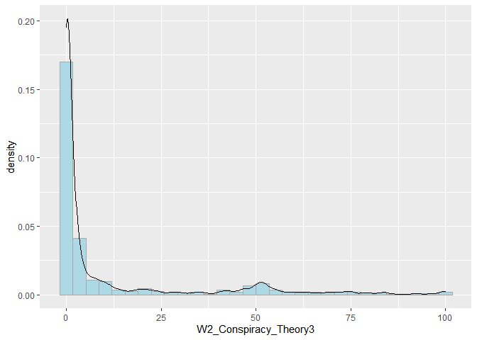
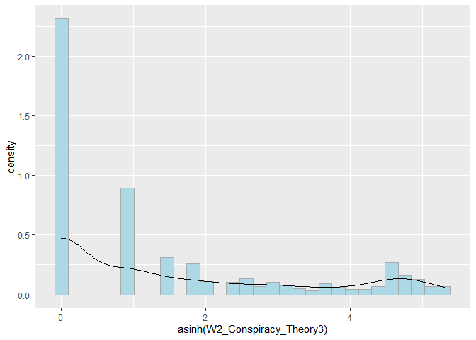

covid\_conspiracies\_markdown2
================
Michael Marshall
21/10/2020

## Loading Packages and Data

``` r
pacman::p_load(tidyverse, stringr, ggridges, forcats, labelled, leaps,
               psych, corrr, cowplot, expss, haven, interplot,
               interactions, jtools,labelled, pscl, psych, 
               sjPlot, skimr)

load("COVID W1_W2_W3 Cleaned 2878.RData") # needs to be in your wd
```

## Rescaling variable

``` r
## [rescale01] Function to rescale a variable from 0 to 1
rescale01 <- function(x, ...) {
  (x - min(x, ...)) / ((max(x, ...)) - min(x, ...))
}
```

## Summary and distribution of different COVID specific conspiracies

``` r
# plotting density of different covid conspiracies
df %>% 
  dplyr::select(W2_Conspiracy_Theory1:W2_Conspiracy_Theory5) %>% 
  gather(conspiracy_code, belief,
         W2_Conspiracy_Theory1:W2_Conspiracy_Theory5) %>%
  mutate(
    conspiracy_code = as.factor(conspiracy_code),
    conspiracy = ifelse(
      conspiracy_code == "W2_Conspiracy_Theory1",
      "Chinese lab",
      ifelse(conspiracy_code == "W2_Conspiracy_Theory2",
             "Chinese meat market",
             ifelse(conspiracy_code == "W2_Conspiracy_Theory3",
                    "5G",
                    ifelse(conspiracy_code == "W2_Conspiracy_Theory4",
                           "No worse than flu",
                           "Vitamin C treatment"))))
  ) %>% 
  ggplot(aes(x = belief, y = conspiracy, height = ..density..)) +
  geom_density_ridges(aes(fill = conspiracy,
                          rel_min_height = 0.005),
                      stat = "density",
                      #bins = 20,
                      show.legend = FALSE) +
  scale_fill_brewer(palette = "Dark2") +
  theme_ridges()
```

    ## Warning: attributes are not identical across measure variables;
    ## they will be dropped

    ## Warning: Removed 7360 rows containing non-finite values (stat_density).

<!-- -->

## Cleaning dataset

The following code filters down to just those observations that have
completed the battery of questions relating to COVID specific
conspiracies. It also creates a tibble counting the missing
observations, which can be useful to have as an object.

``` r
# filtering for completed dependent variable
conspiracies <- df %>% 
  filter(!is.na(W2_Conspiracy_Theory1) |
           !is.na(W2_Conspiracy_Theory2) |
           !is.na(W2_Conspiracy_Theory3) |
           !is.na(W2_Conspiracy_Theory3) |
           !is.na(W2_Conspiracy_Theory4) |
           !is.na(W2_Conspiracy_Theory5)) %>% 
  rename(W1_Housing_tenure = W1_Hosuing_tenure)

# function to count NAs
count_na <- function(x){
  sum(is.na(x))
}

conspiracies %>% 
  dplyr::select(W2_Conspiracy_Theory1:W2_Conspiracy_Theory5) %>% 
  map_int(count_na)
```

    ## W2_Conspiracy_Theory1 W2_Conspiracy_Theory2 W2_Conspiracy_Theory3 
    ##                     0                     0                     0 
    ## W2_Conspiracy_Theory4 W2_Conspiracy_Theory5 
    ##                     0                     0

``` r
missing <- tibble(
  variable = names(conspiracies),
  NAs = conspiracies %>% map_int(count_na)
)

#View(missing)
```

The code below combines the two variables on the 2019 general election
into a single variable that combines whether a respondent voted, and who
they voted for. It also turns the *preferred newspaper* variables into
dummy variables, as they were previously coded as *1=Yes* and everything
else as *NA*.

``` r
# combining 2019 election variables into one, for parties and didn't votes

conspiracies <- conspiracies %>% 
  mutate(
    W1_Voted_Party_Name = to_factor(
      conspiracies$W1_Voted_Party,
      nolabel_to_na = TRUE),
    W1_Voted_GenElection_Name = to_factor(
      conspiracies$W1_Voted_GenElection,
      nolabel_to_na = TRUE),
    W1_2019_GE_Full = factor(ifelse(
      W1_Voted_GenElection_Name == "Voted.",
      as.character(W1_Voted_Party_Name),
      as.character(W1_Voted_GenElection_Name)))
    )

# making preferred newspaper dummy variable (i.e. replacing NA with 0)
na_to_zero <- function(x){
  x[is.na(x)] <- 0
  x <- as.numeric(x)
  return(x)
} 

paper_vars <- conspiracies %>%
  dplyr::select(W2_Newspaper_prefer1:W2_Newspaper_prefer11) %>% 
  names()

conspiracies[paper_vars] <- conspiracies[paper_vars] %>% 
  map_df(na_to_zero)
```

``` r
# Creating DVs
# [nat] nationalism
nat_keys <- list(nationalism = cs(W2_Nationalism1,W2_Nationalism2))
nat_test <- scoreItems(nat_keys, conspiracies, min = 1, max = 5)
head(nat_test$scores)
```

    ##      nationalism
    ## [1,]           4
    ## [2,]           4
    ## [3,]           4
    ## [4,]           3
    ## [5,]           3
    ## [6,]           3

``` r
nat_test$alpha  # Scale alpha
```

    ##       nationalism
    ## alpha   0.8213221

``` r
conspiracies$nat <- rescale01(nat_test$scores, na.rm = TRUE)
conspiracies$nat <- c(conspiracies$nat)  # Ensure variable is numeric and not matrix class
describe(conspiracies$nat)
```

    ##    vars    n mean   sd median trimmed  mad min max range  skew kurtosis   se
    ## X1    1 1406 0.57 0.25   0.62    0.58 0.19   0   1     1 -0.33    -0.18 0.01

``` r
## [imm.econ] Anti-immigrant sentiment - Economy 
table(conspiracies$W1_MigrantAttitudes1)
```

    ## 
    ##   1   2   3   4   5   6   7   8   9  10 
    ##  71  38  80 105 188 198 264 255  87 120

``` r
conspiracies$imm_econ <- rescale01(abs(
  conspiracies$W1_MigrantAttitudes1 - 11))

conspiracies %>% 
  dplyr::select(W1_MigrantAttitudes1, imm_econ) %>%
  correlate()
```

    ## 
    ## Correlation method: 'pearson'
    ## Missing treated using: 'pairwise.complete.obs'

    ## # A tibble: 2 x 3
    ##   rowname              W1_MigrantAttitudes1 imm_econ
    ##   <chr>                               <dbl>    <dbl>
    ## 1 W1_MigrantAttitudes1                   NA       -1
    ## 2 imm_econ                               -1       NA

``` r
## [imm.res] Anti-immigrant sentiment - Resources
table(conspiracies$W1_MigrantAttitudes3)
```

    ## 
    ##   1   2   3   4   5 
    ##  68 101 575 431 231

``` r
conspiracies$imm_res <- rescale01(conspiracies$W1_MigrantAttitudes3)
conspiracies %>% 
  dplyr::select(W1_MigrantAttitudes3, imm_res) %>%
  correlate()
```

    ## 
    ## Correlation method: 'pearson'
    ## Missing treated using: 'pairwise.complete.obs'

    ## # A tibble: 2 x 3
    ##   rowname              W1_MigrantAttitudes3 imm_res
    ##   <chr>                               <dbl>   <dbl>
    ## 1 W1_MigrantAttitudes3                   NA       1
    ## 2 imm_res                                 1      NA

``` r
## [imm.cul] Anti-immigrant sentiment - Culture
table(conspiracies$W1_MigrantAttitudes2)
```

    ## 
    ##   1   2   3   4   5   6   7   8   9  10 
    ## 101  57  88 120 202 177 225 219  80 137

``` r
conspiracies$imm_cul <- rescale01(abs(
  conspiracies$W1_MigrantAttitudes2 - 11))

conspiracies %>% 
  dplyr::select(W1_MigrantAttitudes2, imm_cul) %>%
  correlate()
```

    ## 
    ## Correlation method: 'pearson'
    ## Missing treated using: 'pairwise.complete.obs'

    ## # A tibble: 2 x 3
    ##   rowname              W1_MigrantAttitudes2 imm_cul
    ##   <chr>                               <dbl>   <dbl>
    ## 1 W1_MigrantAttitudes2                   NA      -1
    ## 2 imm_cul                                -1      NA

``` r
# Right wing authoritarianism
rwa_keys <- list(rwa = cs(W1_Authoritarianism1_R,
                          W1_Authoritarianism2,
                          W1_Authoritarianism3,
                          W1_Authoritarianism4_R, 
                          W1_Authoritarianism5_R,
                          W1_Authoritarianism6))

rwa_test <- scoreItems(rwa_keys, conspiracies, min = 1, max = 5)
head(rwa_test$scores)
```

    ##           rwa
    ## [1,] 2.833333
    ## [2,] 2.666667
    ## [3,] 3.166667
    ## [4,] 3.333333
    ## [5,] 3.000000
    ## [6,] 3.500000

``` r
summary(rwa_test$alpha)  # Scale alpha
```

    ##       rwa        
    ##  Min.   :0.6837  
    ##  1st Qu.:0.6837  
    ##  Median :0.6837  
    ##  Mean   :0.6837  
    ##  3rd Qu.:0.6837  
    ##  Max.   :0.6837

``` r
conspiracies$RWA <- rescale01(rwa_test$scores, na.rm = TRUE)
conspiracies$RWA <- c(conspiracies$RWA)  # Ensure variable is numeric and not matrix class

describe(conspiracies$RWA)
```

    ##    vars    n mean   sd median trimmed  mad min max range  skew kurtosis se
    ## X1    1 1406 0.51 0.17    0.5    0.52 0.12   0   1     1 -0.25      0.3  0

``` r
## [SDO] Social Dominance Orientation
sdo_keys <- list(sdo = cs(W1_Social_Dominance1,
                          W1_Social_Dominance2_R,
                          W1_Social_Dominance3_R,
                          W1_Social_Dominance4,
                          W1_Social_Dominance5_R,
                          W1_Social_Dominance6, 
                          W1_Social_Dominance7,
                          W1_Social_Dominance8_R))
sdo_test <- scoreItems(sdo_keys, conspiracies, min = 1, max = 5)
head(sdo_test$scores)
```

    ##        sdo
    ## [1,] 1.500
    ## [2,] 3.000
    ## [3,] 3.000
    ## [4,] 2.625
    ## [5,] 3.000
    ## [6,] 2.500

``` r
summary(sdo_test$alpha)  # Scale alpha
```

    ##       sdo        
    ##  Min.   :0.8404  
    ##  1st Qu.:0.8404  
    ##  Median :0.8404  
    ##  Mean   :0.8404  
    ##  3rd Qu.:0.8404  
    ##  Max.   :0.8404

``` r
conspiracies$SDO <- rescale01(sdo_test$scores, na.rm = TRUE)
conspiracies$SDO <- c(conspiracies$SDO)  # Ensure variable is numeric and not matrix class

summary(conspiracies$SDO)
```

    ##    Min. 1st Qu.  Median    Mean 3rd Qu.    Max. 
    ##  0.0000  0.2258  0.3871  0.3620  0.5161  1.0000

``` r
## [threat] Covid-19 related Threat
summary(conspiracies$W2_COVID19_anxiety)
```

    ##    Min. 1st Qu.  Median    Mean 3rd Qu.    Max. 
    ##    0.00   50.00   65.00   61.25   80.75  100.00

``` r
conspiracies$threat <- rescale01(conspiracies$W2_COVID19_anxiety)
conspiracies %>% 
  dplyr::select(W2_COVID19_anxiety, threat) %>%
  correlate()
```

    ## 
    ## Correlation method: 'pearson'
    ## Missing treated using: 'pairwise.complete.obs'

    ## # A tibble: 2 x 3
    ##   rowname            W2_COVID19_anxiety threat
    ##   <chr>                           <dbl>  <dbl>
    ## 1 W2_COVID19_anxiety                 NA      1
    ## 2 threat                              1     NA

``` r
## [right] Right-Wing political views
table(conspiracies$W1_Political_Scale)
```

    ## 
    ##   1   2   3   4   5   6   7   8   9  10 
    ##  35  44 116 143 488 221 182 102  36  39

``` r
conspiracies$right <- rescale01(conspiracies$W1_Political_Scale)
conspiracies %>% 
  dplyr::select(W1_Political_Scale, right) %>%
  correlate()
```

    ## 
    ## Correlation method: 'pearson'
    ## Missing treated using: 'pairwise.complete.obs'

    ## # A tibble: 2 x 3
    ##   rowname            W1_Political_Scale right
    ##   <chr>                           <dbl> <dbl>
    ## 1 W1_Political_Scale                 NA     1
    ## 2 right                               1    NA

``` r
## [soc.con] Social conservatism
table(conspiracies$W1_Political_Abortion_SSM)
```

    ## 
    ##   1   2   3   4   5   6   7   8   9  10 
    ## 262 123 175 129 330 124 109  67  31  56

``` r
conspiracies$soc_con <- rescale01(
  conspiracies$W1_Political_Abortion_SSM)
conspiracies %>% 
  dplyr::select(W1_Political_Abortion_SSM, soc_con) %>%
  correlate()
```

    ## 
    ## Correlation method: 'pearson'
    ## Missing treated using: 'pairwise.complete.obs'

    ## # A tibble: 2 x 3
    ##   rowname                   W1_Political_Abortion_SSM soc_con
    ##   <chr>                                         <dbl>   <dbl>
    ## 1 W1_Political_Abortion_SSM                        NA       1
    ## 2 soc_con                                           1      NA

``` r
## [fis.con] Fiscal conservatism
table(conspiracies$W1_Political_Fiscal)
```

    ## 
    ##   1   2   3   4   5   6   7   8   9  10 
    ##  55  43 112 133 430 201 226 121  39  46

``` r
conspiracies$fis_con <- rescale01(conspiracies$W1_Political_Fiscal)
conspiracies %>% 
  dplyr::select(W1_Political_Fiscal, fis_con) %>%
  correlate()
```

    ## 
    ## Correlation method: 'pearson'
    ## Missing treated using: 'pairwise.complete.obs'

    ## # A tibble: 2 x 3
    ##   rowname             W1_Political_Fiscal fis_con
    ##   <chr>                             <dbl>   <dbl>
    ## 1 W1_Political_Fiscal                  NA       1
    ## 2 fis_con                               1      NA

``` r
## [age.c] Age (in years)
summary(conspiracies$W2_Age_year)
```

    ##    Min. 1st Qu.  Median    Mean 3rd Qu.    Max. 
    ##   18.00   37.00   50.00   49.32   61.00   88.00

``` r
conspiracies$age_sc <- rescale01(conspiracies$W2_Age_year)
```

``` r
factors <- c("W1_Ethnicity","W1_C19_Infected",
             "W1_CRT1","W1_CRT2","W1_CRT3","W1_CRT4",
             "W1_CRT5","W1_CRT_test","W1_BornUK","W1_EURef",
             "W2_Gender_binary","W2_Living_alone","W2_Employment",
             rep(str_c("W2_INFO_",seq(1,9,1))))
```

``` r
# turning the above list into factors with the levels as the spss labels
#for(i in seq_along(conspiracies[factors])){
#  conspiracies[factors][,i] <- to_factor(
#    conspiracies[factors][,i], nolabel_to_na = TRUE)
#}
```

``` r
# Making a binary for each CRT scale, baseline = correct answer
conspiracies$CRT1 <- ifelse(
  to_factor(conspiracies$W1_CRT1) != "5 pence", 1, 0
)

conspiracies$CRT2 <- ifelse(
  to_factor(conspiracies$W1_CRT2) != "5 minutes", 1, 0
)

conspiracies$CRT3 <- ifelse(
  to_factor(conspiracies$W1_CRT3) != "47 days", 1, 0
)

conspiracies$CRT4 <- ifelse(
  to_factor(conspiracies$W1_CRT4) != "2nd", 1, 0
)

conspiracies$CRT5 <- ifelse(
  to_factor(conspiracies$W1_CRT5) != "8", 1, 0
)

conspiracies$CRT_test <- ifelse(
  to_factor(conspiracies$W1_CRT_test) == "None of them.", 1, 0
) # baseline = heard of some of them OR all of them
```

``` r
# Making a binary for each CRT scale, 1 = most common wrong answer
conspiracies$CRT1_wrong <- ifelse(
  to_factor(conspiracies$W1_CRT1) == "10 pence", 1, 0
)

conspiracies$CRT2_wrong <- ifelse(
  to_factor(conspiracies$W1_CRT2) == "100 minutes", 1, 0
)

conspiracies$CRT3_wrong <- ifelse(
  to_factor(conspiracies$W1_CRT3) == "24 days", 1, 0
)

conspiracies$CRT4_wrong <- ifelse(
  to_factor(conspiracies$W1_CRT4) == "1st", 1, 0
)

conspiracies$CRT5_wrong <- ifelse(
  to_factor(conspiracies$W1_CRT5) == "7", 1, 0
)
```

``` r
# setting the remaining factors as factors
factors_2 <- c("W1_Income_2019","W1_Education_binary",
               "W1_Housing_tenure",
               rep(str_c("W2_Trust_Body",
                         seq(1,7,1))))

# below line can be removed once relevelled factors with long strings
conspiracies[factors] <- conspiracies[factors] %>% 
  map_df(as.factor)

conspiracies[factors_2] <- conspiracies[factors_2] %>% 
  map_df(as.factor)
```

``` r
# rescaling the remaing numeric variables
numerics <- c("W1_ReligiousBelief_Total","W1_Conspiracy_Total",
              "W2_Paranoia_Total","W2_Dep_Total","W2_GAD_Total",
              "W2_Internal_Total","W2_Chance_Total","W2_PO_Total",
              "W2_DAI_Total","W2_ProspectiveAnx_Total",
              "W2_InhibitoryAnx_Total","W2_IOU_Total")

conspiracies[numerics] <- conspiracies[numerics] %>% 
  map_df(rescale01, na.rm = TRUE)
```

``` r
# creating scaled versions of each conspiracy belief
conspiracies$conspiracy1_sc <- rescale01(
  conspiracies$W2_Conspiracy_Theory1, na.rm = TRUE
)

conspiracies$conspiracy2_sc <- rescale01(
  conspiracies$W2_Conspiracy_Theory2, na.rm = TRUE
)

conspiracies$conspiracy3_sc <- rescale01(
  conspiracies$W2_Conspiracy_Theory3, na.rm = TRUE
)

conspiracies$conspiracy4_sc <- rescale01(
  conspiracies$W2_Conspiracy_Theory4, na.rm = TRUE
)

conspiracies$conspiracy5_sc <- rescale01(
  conspiracies$W2_Conspiracy_Theory5, na.rm = TRUE
)
```

## Distribution of variables

A for loop to look at distribution of potential independent variables
(numeric only).

``` r
plot_vars <- conspiracies %>% 
  dplyr::select(
    one_of(numerics),nat,imm_econ,imm_res,imm_cul,RWA,SDO,threat,right,
    soc_con,fis_con,age_sc
    ) %>%
  names()

for(i in seq_along(plot_vars)){
  
  x1 <- conspiracies[plot_vars][i] %>% as_vector()
  
  print(
    ggplot(data = NULL, aes(x = x1)) +
      geom_vline(aes(xintercept = mean(x1, na.rm =TRUE)), 
                 colour = "black",
                 #alpha = 0.7,
                 linetype = "dashed") +
      geom_vline(aes(xintercept = median(x1, na.rm =TRUE)), 
                 colour = "red",
                 #alpha = 0.7,
                 linetype = "dashed") +
      geom_density(fill = "lightblue", alpha = 0.7) +
      labs(x = plot_vars[i],
           caption = "Black = Mean, Red = Median")  
  )
  
}
```

    ## Warning: Removed 30 rows containing non-finite values (stat_density).

<!-- --><!-- --><!-- --><!-- --><!-- --><!-- --><!-- --><!-- --><!-- --><!-- --><!-- --><!-- --><!-- --><!-- --><!-- --><!-- --><!-- --><!-- --><!-- --><!-- --><!-- --><!-- --><!-- -->

## Vote in 2019 election and conspiracy belief

``` r
conspiracies %>% 
  ggplot(aes(x = fct_reorder(W1_2019_GE_Full, W2_Conspiracy_Theory1),
             y = W2_Conspiracy_Theory1)) +
  geom_boxplot() +
  coord_flip() +
  labs(x = "Vote in 2019 GE",
       y = "Belief in Chinese Lab Origin")
```

<!-- -->

``` r
# filtering down for some of the main parties
parties <- c("UKIP",
             "Did not vote.",
             "Conservative",
             "Labour",
             "Green",
             "Scottish Nationalists",
             "Liberal Democrats")

conspiracies %>% 
  filter(W1_2019_GE_Full %in% parties) %>% 
  ggplot(aes(x = W2_Conspiracy_Theory1,
             y = fct_reorder(W1_2019_GE_Full, W2_Conspiracy_Theory1))) +
  geom_density_ridges(alpha = 0.7,
                      quantile_lines = TRUE,
                      quantiles = 4,
                      scale = 0.9,
                      jittered_points = TRUE,
                      vline_size = 1,
                      point_size = 0.6,
                      point_alpha = 0.6,
                      position = "raincloud") +
  labs(x = "Vote in 2019 GE",
       y = "Belief in Chinese lab origin")
```

    ## Picking joint bandwidth of 12

<!-- -->

``` r
# interestingly, Conservatives have relatively high belief in Chinese lab conspiracy

conspiracies %>% 
  ggplot(aes(x = fct_reorder(W1_2019_GE_Full, W2_Conspiracy_Theory3),
             y = W2_Conspiracy_Theory3)) +
  geom_boxplot() +
  coord_flip() +
  labs(x = "Vote in 2019 GE",
       y = "Belief in 5G Origin")
```

<!-- -->

``` r
conspiracies %>% 
  filter(W1_2019_GE_Full %in% parties) %>% 
  ggplot(aes(x = W2_Conspiracy_Theory3,
             y = fct_reorder(W1_2019_GE_Full, W2_Conspiracy_Theory3))) +
  geom_density_ridges(alpha = 0.7,
                      quantile_lines = TRUE,
                      quantiles = 4,
                      scale = 0.9,
                      jittered_points = TRUE,
                      vline_size = 1,
                      point_size = 0.6,
                      point_alpha = 0.6,
                      position = "raincloud") +
  labs(x = "Vote in 2019 GE",
       y = "Belief in 5G origin")
```

    ## Picking joint bandwidth of 4.57

<!-- -->

``` r
conspiracies %>% 
  ggplot(aes(x = fct_reorder(W1_2019_GE_Full, W2_Conspiracy_Theory4),
             y = W2_Conspiracy_Theory4)) +
  geom_boxplot() +
  coord_flip() +
  labs(x = "Vote in 2019 GE",
       y = "Belief it is no worse than flu")
```

<!-- -->

``` r
conspiracies %>% 
  filter(W1_2019_GE_Full %in% parties) %>% 
  ggplot(aes(x = W2_Conspiracy_Theory4,
             y = fct_reorder(W1_2019_GE_Full, W2_Conspiracy_Theory4))) +
  geom_density_ridges(alpha = 0.7,
                      quantile_lines = TRUE,
                      quantiles = 4,
                      scale = 0.9,
                      jittered_points = TRUE,
                      vline_size = 1,
                      point_size = 0.6,
                      point_alpha = 0.6,
                      position = "raincloud") +
  labs(x = "Vote in 2019 GE",
       y = "Belief it is no worse than flu")
```

    ## Picking joint bandwidth of 11

<!-- -->

``` r
conspiracies %>% 
  ggplot(aes(x = fct_reorder(W1_2019_GE_Full, W2_Conspiracy_Theory5),
             y = W2_Conspiracy_Theory5)) +
  geom_boxplot() +
  coord_flip() +
  labs(x = "Vote in 2019 GE",
       y = "Belief in Vitamin C treatment")
```

<!-- -->

# Modelling for belief in Chinese lab origin

## DV Chinese lab conspiracy - singular IV models

``` r
sdo_lab <- lm(W2_Conspiracy_Theory1 ~ SDO,
              data = conspiracies)

summ(sdo_lab)
```

    ## MODEL INFO:
    ## Observations: 1406
    ## Dependent Variable: W2_Conspiracy_Theory1
    ## Type: OLS linear regression 
    ## 
    ## MODEL FIT:
    ## F(1,1404) = 65.28, p = 0.00
    ## R² = 0.04
    ## Adj. R² = 0.04 
    ## 
    ## Standard errors: OLS
    ## ------------------------------------------------
    ##                      Est.   S.E.   t val.      p
    ## ----------------- ------- ------ -------- ------
    ## (Intercept)         24.11   1.95    12.34   0.00
    ## SDO                 39.08   4.84     8.08   0.00
    ## ------------------------------------------------

``` r
ggplot(conspiracies,aes(x = SDO, y = W2_Conspiracy_Theory1)) +
  geom_boxplot(aes(group = cut_width(SDO,0.1))) +
  geom_smooth(method = "lm")
```

    ## `geom_smooth()` using formula 'y ~ x'

<!-- -->

``` r
par(mfrow = c(2,2))
plot(sdo_lab)
```

<!-- -->

``` r
rwa_lab <- lm(W2_Conspiracy_Theory1 ~ RWA,
              data = conspiracies)

summ(rwa_lab)
```

    ## MODEL INFO:
    ## Observations: 1406
    ## Dependent Variable: W2_Conspiracy_Theory1
    ## Type: OLS linear regression 
    ## 
    ## MODEL FIT:
    ## F(1,1404) = 87.72, p = 0.00
    ## R² = 0.06
    ## Adj. R² = 0.06 
    ## 
    ## Standard errors: OLS
    ## ------------------------------------------------
    ##                      Est.   S.E.   t val.      p
    ## ----------------- ------- ------ -------- ------
    ## (Intercept)         13.88   2.74     5.07   0.00
    ## RWA                 47.40   5.06     9.37   0.00
    ## ------------------------------------------------

``` r
ggplot(conspiracies,aes(x = RWA, y = W2_Conspiracy_Theory1)) +
  geom_boxplot(aes(group = cut_width(RWA,0.1))) +
  geom_smooth(method = "lm")
```

    ## `geom_smooth()` using formula 'y ~ x'

<!-- -->

``` r
par(mfrow = c(2,2))
plot(rwa_lab)
```

<!-- -->

``` r
daily_m_lab <- lm(W2_Conspiracy_Theory1 ~ W2_Newspaper_prefer1,
              data = conspiracies)

summ(daily_m_lab)
```

    ## MODEL INFO:
    ## Observations: 1406
    ## Dependent Variable: W2_Conspiracy_Theory1
    ## Type: OLS linear regression 
    ## 
    ## MODEL FIT:
    ## F(1,1404) = 87.24, p = 0.00
    ## R² = 0.06
    ## Adj. R² = 0.06 
    ## 
    ## Standard errors: OLS
    ## ---------------------------------------------------------
    ##                               Est.   S.E.   t val.      p
    ## -------------------------- ------- ------ -------- ------
    ## (Intercept)                  32.96   1.03    32.02   0.00
    ## W2_Newspaper_prefer1         17.47   1.87     9.34   0.00
    ## ---------------------------------------------------------

``` r
ggplot(conspiracies,aes(x = as.factor(W2_Newspaper_prefer1), 
                        y = W2_Conspiracy_Theory1)) +
  geom_boxplot() +
  labs(x = "Daily Mail Reader")
```

<!-- -->

``` r
par(mfrow = c(2,2))
plot(daily_m_lab)
```

<!-- -->

``` r
social_m_lab <- lm(W2_Conspiracy_Theory1 ~ W2_INFO_5,
              data = conspiracies)

summ(social_m_lab)
```

    ## MODEL INFO:
    ## Observations: 1406
    ## Dependent Variable: W2_Conspiracy_Theory1
    ## Type: OLS linear regression 
    ## 
    ## MODEL FIT:
    ## F(3,1402) = 16.28, p = 0.00
    ## R² = 0.03
    ## Adj. R² = 0.03 
    ## 
    ## Standard errors: OLS
    ## ------------------------------------------------
    ##                      Est.   S.E.   t val.      p
    ## ----------------- ------- ------ -------- ------
    ## (Intercept)         32.46   1.31    24.72   0.00
    ## W2_INFO_52           6.07   2.10     2.89   0.00
    ## W2_INFO_53          15.28   2.32     6.57   0.00
    ## W2_INFO_54          13.03   3.52     3.70   0.00
    ## ------------------------------------------------

``` r
ggplot(conspiracies,aes(x = W2_INFO_5, 
                        y = W2_Conspiracy_Theory1)) +
  geom_boxplot() +
  labs(x = "COVID-19 info from social media")
```

<!-- -->

``` r
par(mfrow = c(2,2))
plot(social_m_lab)
```

<!-- -->

``` r
# plotting RWA and SDO by conspiracy, facetted by social media

conspiracies %>% 
  ggplot(aes(x = SDO, y = W2_Conspiracy_Theory1)) +
  geom_jitter(aes(colour = W2_INFO_5), alpha = 1/3) +
  geom_smooth(method = "lm") +
  facet_wrap(~W2_INFO_5) +
  labs(colour = "COVID-19 info from social media",
       x = "Social Dominance Orientation",
       y = "Belief in Chinese lab origin") +
  theme(legend.position = "top")
```

    ## `geom_smooth()` using formula 'y ~ x'

<!-- -->

``` r
conspiracies %>% 
  ggplot(aes(x = RWA, y = W2_Conspiracy_Theory1)) +
  geom_jitter(aes(colour = W2_INFO_5), alpha = 1/3) +
  geom_smooth(method = "lm") +
  facet_wrap(~W2_INFO_5) +
  labs(colour = "COVID-19 info from social media",
       x = "Right Wing Authoritarianism",
       y = "Belief in Chinese lab origin") +
  theme(legend.position = "top")
```

    ## `geom_smooth()` using formula 'y ~ x'

<!-- -->

## DV Chinese lab conspiracy - socio-economic variables

``` r
se_lab <- lm(W2_Conspiracy_Theory1 ~ W2_Gender_binary +
               W1_Education_binary +
               W1_BornUK +
               W1_Income_2019 +
               age_sc,
              data = conspiracies)

summ(se_lab)
```

    ## MODEL INFO:
    ## Observations: 1403 (3 missing obs. deleted)
    ## Dependent Variable: W2_Conspiracy_Theory1
    ## Type: OLS linear regression 
    ## 
    ## MODEL FIT:
    ## F(8,1394) = 7.48, p = 0.00
    ## R² = 0.04
    ## Adj. R² = 0.04 
    ## 
    ## Standard errors: OLS
    ## ----------------------------------------------------------
    ##                                Est.   S.E.   t val.      p
    ## -------------------------- -------- ------ -------- ------
    ## (Intercept)                   48.82   3.33    14.68   0.00
    ## W2_Gender_binary2              2.79   1.78     1.56   0.12
    ## W1_Education_binary1          -8.23   1.85    -4.45   0.00
    ## W1_BornUK2                     0.36   3.26     0.11   0.91
    ## W1_Income_20192                1.26   2.90     0.43   0.66
    ## W1_Income_20193               -4.24   2.86    -1.48   0.14
    ## W1_Income_20194               -2.09   2.73    -0.76   0.44
    ## W1_Income_20195              -10.11   2.79    -3.62   0.00
    ## age_sc                        -8.21   4.22    -1.95   0.05
    ## ----------------------------------------------------------

``` r
plot_coefs(se_lab)
```

    ## Loading required namespace: broom.mixed

<!-- -->

``` r
par(mfrow = c(2,2))
plot(se_lab)
```

<!-- -->

## DV Chinese lab conspiracy - socio-economic variables + political/media

``` r
se_pol_lab <- lm(W2_Conspiracy_Theory1 ~ W1_Education_binary +
                   W1_Income_2019 +
                   age_sc +
                   right +
                   soc_con +
                   fis_con +
                   nat +
                   W2_Newspaper_prefer1 +
                   W2_Newspaper_prefer5 +
                   W2_Newspaper_prefer6 +
                   W2_Newspaper_prefer9 +
                   W2_INFO_5 +
                   W2_INFO_9,
                 data = conspiracies)

#summary(se_pol_lab)
summ(se_pol_lab, vifs = TRUE)
```

    ## MODEL INFO:
    ## Observations: 1406
    ## Dependent Variable: W2_Conspiracy_Theory1
    ## Type: OLS linear regression 
    ## 
    ## MODEL FIT:
    ## F(20,1385) = 16.24, p = 0.00
    ## R² = 0.19
    ## Adj. R² = 0.18 
    ## 
    ## Standard errors: OLS
    ## ----------------------------------------------------------------
    ##                               Est.   S.E.   t val.      p    VIF
    ## -------------------------- ------- ------ -------- ------ ------
    ## (Intercept)                  19.66   4.06     4.84   0.00       
    ## W1_Education_binary1         -4.48   1.74    -2.58   0.01   1.12
    ## W1_Income_20192              -0.69   2.68    -0.26   0.80   1.19
    ## W1_Income_20193              -6.46   2.65    -2.43   0.02   1.19
    ## W1_Income_20194              -3.46   2.55    -1.35   0.18   1.19
    ## W1_Income_20195              -8.91   2.62    -3.40   0.00   1.19
    ## age_sc                       -2.49   4.25    -0.59   0.56   1.28
    ## right                         5.23   5.57     0.94   0.35   2.00
    ## soc_con                      13.47   3.53     3.81   0.00   1.45
    ## fis_con                      -3.20   5.30    -0.60   0.55   2.10
    ## nat                          14.01   3.65     3.84   0.00   1.28
    ## W2_Newspaper_prefer1         12.15   1.85     6.58   0.00   1.12
    ## W2_Newspaper_prefer5         -4.89   2.28    -2.14   0.03   1.33
    ## W2_Newspaper_prefer6         -4.61   2.85    -1.62   0.11   1.22
    ## W2_Newspaper_prefer9         11.22   2.58     4.34   0.00   1.12
    ## W2_INFO_52                    5.08   2.05     2.47   0.01   1.49
    ## W2_INFO_53                   11.28   2.39     4.72   0.00   1.49
    ## W2_INFO_54                    3.81   3.60     1.06   0.29   1.49
    ## W2_INFO_92                    4.77   2.10     2.27   0.02   1.29
    ## W2_INFO_93                    6.65   2.38     2.79   0.01   1.29
    ## W2_INFO_94                   18.86   4.06     4.65   0.00   1.29
    ## ----------------------------------------------------------------

``` r
plot_coefs(se_pol_lab)
```

    ## Loading required namespace: broom.mixed

<!-- -->

``` r
par(mfrow = c(2,2))
plot(se_pol_lab)
```

<!-- -->

## DV Chinese lab conspiracy - socio-economic variables + political/media + pol-psych

``` r
# right and fis_con now dropped from modelling
# due to VIF >= 2 and non-significant effect
se_polpsych_lab <- lm(W2_Conspiracy_Theory1 ~ W1_Education_binary +
                   W1_Income_2019 +
                   age_sc +
                   #right +
                   soc_con +
                   #fis_con +
                   nat +
                   W2_Newspaper_prefer1 +
                   W2_Newspaper_prefer5 +
                   W2_Newspaper_prefer6 +
                   W2_Newspaper_prefer9 +
                   W2_INFO_5 +
                   W2_INFO_9 +
                   SDO +
                   RWA +
                   W2_DAI_Total +
                   W2_IOU_Total,
                 data = conspiracies)

#summary(se_polpsych_lab)
summ(se_polpsych_lab, vifs = TRUE)
```

    ## MODEL INFO:
    ## Observations: 1406
    ## Dependent Variable: W2_Conspiracy_Theory1
    ## Type: OLS linear regression 
    ## 
    ## MODEL FIT:
    ## F(22,1383) = 18.06, p = 0.00
    ## R² = 0.22
    ## Adj. R² = 0.21 
    ## 
    ## Standard errors: OLS
    ## ----------------------------------------------------------------
    ##                               Est.   S.E.   t val.      p    VIF
    ## -------------------------- ------- ------ -------- ------ ------
    ## (Intercept)                   5.99   4.89     1.23   0.22       
    ## W1_Education_binary1         -3.65   1.71    -2.13   0.03   1.13
    ## W1_Income_20192              -1.47   2.62    -0.56   0.57   1.18
    ## W1_Income_20193              -7.84   2.60    -3.01   0.00   1.18
    ## W1_Income_20194              -3.90   2.48    -1.57   0.12   1.18
    ## W1_Income_20195              -8.99   2.55    -3.53   0.00   1.18
    ## age_sc                        0.23   4.28     0.05   0.96   1.35
    ## soc_con                       4.89   3.40     1.44   0.15   1.40
    ## nat                           9.03   3.53     2.55   0.01   1.25
    ## W2_Newspaper_prefer1         10.66   1.81     5.89   0.00   1.12
    ## W2_Newspaper_prefer5         -1.93   2.28    -0.84   0.40   1.38
    ## W2_Newspaper_prefer6         -3.52   2.80    -1.26   0.21   1.23
    ## W2_Newspaper_prefer9          9.76   2.54     3.85   0.00   1.12
    ## W2_INFO_52                    4.45   2.02     2.21   0.03   1.52
    ## W2_INFO_53                    9.62   2.36     4.08   0.00   1.52
    ## W2_INFO_54                    2.33   3.55     0.65   0.51   1.52
    ## W2_INFO_92                    4.18   2.06     2.03   0.04   1.32
    ## W2_INFO_93                    6.34   2.35     2.70   0.01   1.32
    ## W2_INFO_94                   19.51   3.99     4.89   0.00   1.32
    ## SDO                          13.98   5.18     2.70   0.01   1.39
    ## RWA                          21.05   5.65     3.73   0.00   1.49
    ## W2_DAI_Total                 23.81   4.27     5.58   0.00   1.43
    ## W2_IOU_Total                 -8.67   4.69    -1.85   0.06   1.39
    ## ----------------------------------------------------------------

``` r
plot_coefs(se_polpsych_lab)
```

    ## Loading required namespace: broom.mixed

<!-- -->

``` r
par(mfrow = c(2,2))
plot(se_polpsych_lab)
```

<!-- -->

``` r
# looking for potential multicollinearity with DAI
cor_mat <- model.matrix(se_polpsych_lab) %>% as.data.frame()

cor_vec <- rep(NA,ncol(cor_mat))
for(i in seq_along(cor_mat)){
  cor_vec[i] <- cor(cor_mat$W2_DAI_Total,cor_mat[,i])
}
```

    ## Warning in cor(cor_mat$W2_DAI_Total, cor_mat[, i]): the standard deviation is
    ## zero

``` r
tibble(cor_vec,
       names(cor_mat)) %>% 
  arrange(desc(cor_vec)) # IOU moderately positively correlated
```

    ## # A tibble: 23 x 2
    ##    cor_vec `names(cor_mat)`    
    ##      <dbl> <chr>               
    ##  1  1      W2_DAI_Total        
    ##  2  0.486  W2_IOU_Total        
    ##  3  0.163  SDO                 
    ##  4  0.156  W2_INFO_53          
    ##  5  0.153  soc_con             
    ##  6  0.149  W2_Newspaper_prefer9
    ##  7  0.141  W2_INFO_54          
    ##  8  0.112  W1_Income_20192     
    ##  9  0.110  nat                 
    ## 10  0.0991 RWA                 
    ## # ... with 13 more rows

``` r
# looking for multicollinearity with soc_con
cor_vec2 <- rep(NA,ncol(cor_mat))
for(i in seq_along(cor_mat)){
  cor_vec2[i] <- cor(cor_mat$soc_con,cor_mat[,i])
}
```

    ## Warning in cor(cor_mat$soc_con, cor_mat[, i]): the standard deviation is zero

``` r
tibble(cor_vec2,
       names(cor_mat)) %>% 
  arrange(desc(cor_vec2)) # RWA moderately correlated with soc_con
```

    ## # A tibble: 23 x 2
    ##    cor_vec2 `names(cor_mat)`    
    ##       <dbl> <chr>               
    ##  1   1.00   soc_con             
    ##  2   0.450  RWA                 
    ##  3   0.382  SDO                 
    ##  4   0.262  nat                 
    ##  5   0.184  W2_Newspaper_prefer1
    ##  6   0.153  W2_DAI_Total        
    ##  7   0.0665 W2_Newspaper_prefer9
    ##  8   0.0612 W2_IOU_Total        
    ##  9   0.0565 age_sc              
    ## 10   0.0550 W2_INFO_94          
    ## # ... with 13 more rows

## DV Chinese lab belief - model above minus soc\_con and IOU

``` r
se_polpsych_lab_2 <- lm(W2_Conspiracy_Theory1 ~ W1_Education_binary +
                   W1_Income_2019 +
                   age_sc +
                   #right +
                   #soc_con +
                   #fis_con +
                   nat +
                   W2_Newspaper_prefer1 +
                   W2_Newspaper_prefer5 +
                   W2_Newspaper_prefer6 +
                   W2_Newspaper_prefer9 +
                   W2_INFO_5 +
                   W2_INFO_9 +
                   SDO +
                   RWA +
                   #W2_IOU_Total +
                   W2_DAI_Total,
                 data = conspiracies)

#summary(se_polpsych_lab_2)
summ(se_polpsych_lab_2, vifs = TRUE)
```

    ## MODEL INFO:
    ## Observations: 1406
    ## Dependent Variable: W2_Conspiracy_Theory1
    ## Type: OLS linear regression 
    ## 
    ## MODEL FIT:
    ## F(20,1385) = 19.54, p = 0.00
    ## R² = 0.22
    ## Adj. R² = 0.21 
    ## 
    ## Standard errors: OLS
    ## ----------------------------------------------------------------
    ##                               Est.   S.E.   t val.      p    VIF
    ## -------------------------- ------- ------ -------- ------ ------
    ## (Intercept)                   2.19   4.55     0.48   0.63       
    ## W1_Education_binary1         -3.69   1.71    -2.16   0.03   1.12
    ## W1_Income_20192              -1.12   2.62    -0.43   0.67   1.17
    ## W1_Income_20193              -7.47   2.60    -2.88   0.00   1.17
    ## W1_Income_20194              -3.66   2.49    -1.47   0.14   1.17
    ## W1_Income_20195              -8.62   2.54    -3.40   0.00   1.17
    ## age_sc                        1.37   4.25     0.32   0.75   1.33
    ## nat                           9.17   3.53     2.60   0.01   1.24
    ## W2_Newspaper_prefer1         10.79   1.81     5.97   0.00   1.11
    ## W2_Newspaper_prefer5         -2.16   2.28    -0.95   0.34   1.38
    ## W2_Newspaper_prefer6         -3.59   2.80    -1.28   0.20   1.22
    ## W2_Newspaper_prefer9          9.96   2.54     3.93   0.00   1.12
    ## W2_INFO_52                    4.10   2.01     2.04   0.04   1.50
    ## W2_INFO_53                    9.29   2.36     3.94   0.00   1.50
    ## W2_INFO_54                    1.71   3.55     0.48   0.63   1.50
    ## W2_INFO_92                    4.04   2.06     1.96   0.05   1.31
    ## W2_INFO_93                    6.30   2.35     2.68   0.01   1.31
    ## W2_INFO_94                   19.39   3.99     4.86   0.00   1.31
    ## SDO                          16.05   5.05     3.18   0.00   1.32
    ## RWA                          23.26   5.38     4.32   0.00   1.35
    ## W2_DAI_Total                 20.88   3.86     5.42   0.00   1.17
    ## ----------------------------------------------------------------

``` r
plot_coefs(se_polpsych_lab_2)
```

    ## Loading required namespace: broom.mixed

<!-- -->

``` r
par(mfrow = c(2,2))
plot(se_polpsych_lab_2)
```

<!-- -->

## DV Chinese lab conspiracy - socio-economic variables + political/media + pol-psych + covid-threat and CRT

``` r
multi_lab <- lm(W2_Conspiracy_Theory1 ~ W1_Education_binary +
                  W1_Income_2019 +
                  age_sc +
                  #right +
                  soc_con +
                  #fis_con +
                  nat +
                  W2_Newspaper_prefer1 +
                  W2_Newspaper_prefer5 +
                  W2_Newspaper_prefer6 +
                  W2_Newspaper_prefer9 +
                  W2_INFO_5 +
                  W2_INFO_9 +
                  SDO +
                  RWA +
                  W2_DAI_Total +
                  W2_IOU_Total +
                  threat +
                  CRT1 +
                  CRT2 +
                  CRT3 +
                  CRT4 +
                  CRT5,
                 data = conspiracies)

#summary(multi_lab)
summ(multi_lab, vifs = TRUE)
```

    ## MODEL INFO:
    ## Observations: 1406
    ## Dependent Variable: W2_Conspiracy_Theory1
    ## Type: OLS linear regression 
    ## 
    ## MODEL FIT:
    ## F(28,1377) = 16.00, p = 0.00
    ## R² = 0.25
    ## Adj. R² = 0.23 
    ## 
    ## Standard errors: OLS
    ## ----------------------------------------------------------------
    ##                               Est.   S.E.   t val.      p    VIF
    ## -------------------------- ------- ------ -------- ------ ------
    ## (Intercept)                  -1.12   5.08    -0.22   0.83       
    ## W1_Education_binary1         -3.33   1.69    -1.96   0.05   1.13
    ## W1_Income_20192              -1.03   2.60    -0.40   0.69   1.24
    ## W1_Income_20193              -6.97   2.58    -2.70   0.01   1.24
    ## W1_Income_20194              -2.29   2.48    -0.92   0.36   1.24
    ## W1_Income_20195              -6.99   2.55    -2.75   0.01   1.24
    ## age_sc                       -1.54   4.35    -0.35   0.72   1.43
    ## soc_con                       5.00   3.36     1.49   0.14   1.41
    ## nat                           9.16   3.50     2.62   0.01   1.26
    ## W2_Newspaper_prefer1         10.15   1.79     5.66   0.00   1.13
    ## W2_Newspaper_prefer5         -1.51   2.27    -0.66   0.51   1.40
    ## W2_Newspaper_prefer6         -3.55   2.77    -1.28   0.20   1.23
    ## W2_Newspaper_prefer9          8.35   2.52     3.32   0.00   1.13
    ## W2_INFO_52                    3.52   2.00     1.76   0.08   1.56
    ## W2_INFO_53                    8.18   2.34     3.49   0.00   1.56
    ## W2_INFO_54                    0.63   3.54     0.18   0.86   1.56
    ## W2_INFO_92                    3.95   2.04     1.93   0.05   1.37
    ## W2_INFO_93                    5.28   2.34     2.26   0.02   1.37
    ## W2_INFO_94                   16.38   3.99     4.10   0.00   1.37
    ## SDO                          16.03   5.18     3.10   0.00   1.42
    ## RWA                          15.71   5.66     2.78   0.01   1.53
    ## W2_DAI_Total                 17.56   4.37     4.02   0.00   1.54
    ## W2_IOU_Total                 -8.29   4.70    -1.77   0.08   1.43
    ## threat                        8.06   3.32     2.43   0.02   1.21
    ## CRT1                          0.62   2.23     0.28   0.78   1.38
    ## CRT2                          3.21   1.92     1.68   0.09   1.45
    ## CRT3                          4.85   2.06     2.35   0.02   1.58
    ## CRT4                         -1.13   1.80    -0.63   0.53   1.30
    ## CRT5                          5.25   1.84     2.86   0.00   1.37
    ## ----------------------------------------------------------------

``` r
plot_coefs(multi_lab)
```

    ## Loading required namespace: broom.mixed

<!-- -->

``` r
par(mfrow = c(2,2))
plot(multi_lab)
```

<!-- -->

## DV Chinese lab belief - model above minus soc\_con and IOU

``` r
multi_lab_2 <- lm(W2_Conspiracy_Theory1 ~ W1_Education_binary +
                  W1_Income_2019 +
                  age_sc +
                  #right +
                  #soc_con +
                  #fis_con +
                  nat +
                  W2_Newspaper_prefer1 +
                  W2_Newspaper_prefer5 +
                  W2_Newspaper_prefer6 +
                  W2_Newspaper_prefer9 +
                  W2_INFO_5 +
                  W2_INFO_9 +
                  SDO +
                  RWA +
                  W2_DAI_Total +
                  #W2_IOU_Total +
                  threat +
                  CRT1 +
                  CRT2 +
                  CRT3 +
                  CRT4 +
                  CRT5,
                 data = conspiracies)

#summary(multi_lab_2)
summ(multi_lab_2, vifs = TRUE)
```

    ## MODEL INFO:
    ## Observations: 1406
    ## Dependent Variable: W2_Conspiracy_Theory1
    ## Type: OLS linear regression 
    ## 
    ## MODEL FIT:
    ## F(26,1379) = 16.99, p = 0.00
    ## R² = 0.24
    ## Adj. R² = 0.23 
    ## 
    ## Standard errors: OLS
    ## ----------------------------------------------------------------
    ##                               Est.   S.E.   t val.      p    VIF
    ## -------------------------- ------- ------ -------- ------ ------
    ## (Intercept)                  -4.60   4.79    -0.96   0.34       
    ## W1_Education_binary1         -3.33   1.69    -1.97   0.05   1.13
    ## W1_Income_20192              -0.66   2.59    -0.26   0.80   1.22
    ## W1_Income_20193              -6.56   2.57    -2.55   0.01   1.22
    ## W1_Income_20194              -1.98   2.48    -0.80   0.43   1.22
    ## W1_Income_20195              -6.57   2.53    -2.60   0.01   1.22
    ## age_sc                       -0.31   4.31    -0.07   0.94   1.40
    ## nat                           9.35   3.50     2.67   0.01   1.25
    ## W2_Newspaper_prefer1         10.27   1.79     5.74   0.00   1.12
    ## W2_Newspaper_prefer5         -1.68   2.27    -0.74   0.46   1.40
    ## W2_Newspaper_prefer6         -3.61   2.77    -1.31   0.19   1.23
    ## W2_Newspaper_prefer9          8.53   2.52     3.39   0.00   1.13
    ## W2_INFO_52                    3.13   2.00     1.57   0.12   1.54
    ## W2_INFO_53                    7.85   2.34     3.35   0.00   1.54
    ## W2_INFO_54                    0.03   3.53     0.01   0.99   1.54
    ## W2_INFO_92                    3.86   2.05     1.88   0.06   1.36
    ## W2_INFO_93                    5.27   2.34     2.25   0.02   1.36
    ## W2_INFO_94                   16.37   3.99     4.10   0.00   1.36
    ## SDO                          17.91   5.06     3.54   0.00   1.35
    ## RWA                          18.04   5.41     3.34   0.00   1.39
    ## W2_DAI_Total                 15.03   4.01     3.75   0.00   1.29
    ## threat                        7.06   3.29     2.15   0.03   1.18
    ## CRT1                          0.66   2.23     0.29   0.77   1.38
    ## CRT2                          3.21   1.92     1.67   0.09   1.45
    ## CRT3                          4.99   2.06     2.42   0.02   1.58
    ## CRT4                         -1.06   1.80    -0.59   0.56   1.30
    ## CRT5                          5.41   1.84     2.95   0.00   1.36
    ## ----------------------------------------------------------------

``` r
plot_coefs(multi_lab_2)
```

    ## Loading required namespace: broom.mixed

<!-- -->

``` r
par(mfrow = c(2,2))
plot(multi_lab_2)
```

<!-- -->

## DV Chinese lab belief - interaction RWA \* INFO\_9, minus soc\_con and IOU and conspiracy controls

``` r
int_lab <- lm(W2_Conspiracy_Theory1 ~ W1_Education_binary +
                  W1_Income_2019 +
                  age_sc +
                  #right +
                  #soc_con +
                  #fis_con +
                  nat +
                  W2_Newspaper_prefer1 +
                  W2_Newspaper_prefer5 +
                  W2_Newspaper_prefer6 +
                  W2_Newspaper_prefer9 +
                  W2_INFO_5 +
                  W2_INFO_9:RWA +
                  SDO +
                  #RWA +
                  W2_DAI_Total +
                  #W2_IOU_Total +
                  threat +
                  CRT1 +
                  CRT2 +
                  CRT3 +
                  CRT4 +
                  CRT5,
                 data = conspiracies)

#summary(int_lab)
summ(int_lab, vifs = TRUE)
```

    ## MODEL INFO:
    ## Observations: 1406
    ## Dependent Variable: W2_Conspiracy_Theory1
    ## Type: OLS linear regression 
    ## 
    ## MODEL FIT:
    ## F(26,1379) = 16.95, p = 0.00
    ## R² = 0.24
    ## Adj. R² = 0.23 
    ## 
    ## Standard errors: OLS
    ## ----------------------------------------------------------------
    ##                               Est.   S.E.   t val.      p    VIF
    ## -------------------------- ------- ------ -------- ------ ------
    ## (Intercept)                  -0.82   4.69    -0.17   0.86       
    ## W1_Education_binary1         -3.35   1.69    -1.98   0.05   1.13
    ## W1_Income_20192              -0.69   2.59    -0.27   0.79   1.22
    ## W1_Income_20193              -6.55   2.57    -2.55   0.01   1.22
    ## W1_Income_20194              -1.90   2.48    -0.77   0.44   1.22
    ## W1_Income_20195              -6.70   2.54    -2.64   0.01   1.22
    ## age_sc                       -0.61   4.31    -0.14   0.89   1.40
    ## nat                           9.51   3.50     2.72   0.01   1.25
    ## W2_Newspaper_prefer1         10.30   1.79     5.75   0.00   1.12
    ## W2_Newspaper_prefer5         -1.62   2.27    -0.71   0.48   1.40
    ## W2_Newspaper_prefer6         -3.56   2.77    -1.29   0.20   1.23
    ## W2_Newspaper_prefer9          8.60   2.52     3.41   0.00   1.13
    ## W2_INFO_52                    3.16   1.99     1.59   0.11   1.52
    ## W2_INFO_53                    7.95   2.33     3.41   0.00   1.52
    ## W2_INFO_54                    0.15   3.53     0.04   0.97   1.52
    ## SDO                          17.89   5.06     3.53   0.00   1.36
    ## W2_DAI_Total                 15.09   4.01     3.76   0.00   1.29
    ## threat                        6.96   3.29     2.11   0.03   1.19
    ## CRT1                          0.47   2.23     0.21   0.83   1.38
    ## CRT2                          3.21   1.92     1.67   0.09   1.45
    ## CRT3                          5.07   2.06     2.46   0.01   1.58
    ## CRT4                         -0.86   1.80    -0.48   0.63   1.29
    ## CRT5                          5.47   1.84     2.98   0.00   1.36
    ## W2_INFO_91:RWA               10.75   6.00     1.79   0.07   1.85
    ## W2_INFO_92:RWA               18.70   5.65     3.31   0.00   1.85
    ## W2_INFO_93:RWA               20.51   5.96     3.44   0.00   1.85
    ## W2_INFO_94:RWA               39.76   8.44     4.71   0.00   1.85
    ## ----------------------------------------------------------------

``` r
plot_coefs(int_lab)
```

    ## Loading required namespace: broom.mixed

<!-- -->

``` r
par(mfrow = c(2,2))
plot(int_lab)
```

<!-- -->

## DV Chinese lab conspiracy - socio-economic variables + political/media + pol-psych + covid-threat and CRT + conspiracies

``` r
full_lab <- lm(W2_Conspiracy_Theory1 ~ W1_Education_binary +
                  W1_Income_2019 +
                  age_sc +
                  #right +
                  #soc_con +
                  #fis_con +
                  nat +
                  W2_Newspaper_prefer1 +
                  W2_Newspaper_prefer5 +
                  W2_Newspaper_prefer6 +
                  W2_Newspaper_prefer9 +
                  W2_INFO_5 +
                  W2_INFO_9:RWA +
                  SDO +
                  #RWA +
                  W2_DAI_Total +
                  #W2_IOU_Total +
                  threat +
                  CRT1 +
                  CRT2 +
                  CRT3 +
                  CRT4 +
                  CRT5 +
                  W1_Conspiracy_Total +
                  conspiracy2_sc +
                  conspiracy3_sc +
                  conspiracy4_sc +
                  conspiracy5_sc,
                 data = conspiracies)

#summary(full_lab)
summ(full_lab, vifs = TRUE)
```

    ## MODEL INFO:
    ## Observations: 1406
    ## Dependent Variable: W2_Conspiracy_Theory1
    ## Type: OLS linear regression 
    ## 
    ## MODEL FIT:
    ## F(31,1374) = 20.76, p = 0.00
    ## R² = 0.32
    ## Adj. R² = 0.30 
    ## 
    ## Standard errors: OLS
    ## -----------------------------------------------------------------
    ##                                Est.   S.E.   t val.      p    VIF
    ## -------------------------- -------- ------ -------- ------ ------
    ## (Intercept)                  -10.04   5.10    -1.97   0.05       
    ## W1_Education_binary1          -3.50   1.61    -2.18   0.03   1.13
    ## W1_Income_20192                0.87   2.47     0.35   0.73   1.25
    ## W1_Income_20193               -6.19   2.45    -2.53   0.01   1.25
    ## W1_Income_20194                0.00   2.36     0.00   1.00   1.25
    ## W1_Income_20195               -4.30   2.42    -1.78   0.08   1.25
    ## age_sc                         4.29   4.12     1.04   0.30   1.42
    ## nat                           11.07   3.36     3.29   0.00   1.28
    ## W2_Newspaper_prefer1           9.29   1.71     5.43   0.00   1.13
    ## W2_Newspaper_prefer5          -0.31   2.16    -0.15   0.88   1.40
    ## W2_Newspaper_prefer6          -4.84   2.64    -1.84   0.07   1.24
    ## W2_Newspaper_prefer9           7.31   2.40     3.04   0.00   1.14
    ## W2_INFO_52                     3.09   1.90     1.63   0.10   1.56
    ## W2_INFO_53                     5.39   2.23     2.42   0.02   1.56
    ## W2_INFO_54                    -1.78   3.36    -0.53   0.60   1.56
    ## SDO                           11.55   4.96     2.33   0.02   1.44
    ## W2_DAI_Total                   8.60   3.90     2.21   0.03   1.36
    ## threat                        10.16   3.17     3.20   0.00   1.22
    ## CRT1                          -0.78   2.13    -0.37   0.71   1.39
    ## CRT2                           2.39   1.82     1.31   0.19   1.45
    ## CRT3                           4.12   1.96     2.10   0.04   1.59
    ## CRT4                          -0.75   1.71    -0.44   0.66   1.30
    ## CRT5                           2.47   1.77     1.40   0.16   1.40
    ## W1_Conspiracy_Total           26.35   3.90     6.76   0.00   1.09
    ## conspiracy2_sc               -13.40   2.66    -5.04   0.00   1.06
    ## conspiracy3_sc                18.59   4.88     3.81   0.00   2.09
    ## conspiracy4_sc                10.40   2.77     3.75   0.00   1.34
    ## conspiracy5_sc                 6.12   4.51     1.36   0.18   2.07
    ## W2_INFO_91:RWA                10.51   5.77     1.82   0.07   1.94
    ## W2_INFO_92:RWA                20.04   5.41     3.70   0.00   1.94
    ## W2_INFO_93:RWA                19.33   5.71     3.39   0.00   1.94
    ## W2_INFO_94:RWA                33.74   8.05     4.19   0.00   1.94
    ## -----------------------------------------------------------------

``` r
plot_coefs(full_lab)
```

    ## Loading required namespace: broom.mixed

<!-- -->

``` r
par(mfrow = c(2,2))
plot(full_lab)
```

<!-- -->

# Modelling for belief in 5G origin conspiracy

## Plots of DV, incl. inverse hyperbolic sine transformation

``` r
conspiracies %>% 
  ggplot(aes(x = W2_Conspiracy_Theory3)) +
  geom_histogram(colour = "darkgrey", fill = "lightblue")
```

    ## `stat_bin()` using `bins = 30`. Pick better value with `binwidth`.

<!-- -->

``` r
conspiracies <- conspiracies %>% 
  mutate(w2_conspiracy3_ihs = log(W2_Conspiracy_Theory3 + 
                                    ((W2_Conspiracy_Theory3^2 + 1)
                                     ^ 0.5)
                                  )
         )

conspiracies %>% 
  ggplot(aes(x = w2_conspiracy3_ihs)) +
  geom_histogram(colour = "darkgrey", fill = "lightblue")
```

    ## `stat_bin()` using `bins = 30`. Pick better value with `binwidth`.

<!-- -->

## DV 5G conspiracy - singular IV models

``` r
sdo_5g <- lm(w2_conspiracy3_ihs ~ SDO,
              data = conspiracies)

summ(sdo_5g)
```

    ## MODEL INFO:
    ## Observations: 1406
    ## Dependent Variable: w2_conspiracy3_ihs
    ## Type: OLS linear regression 
    ## 
    ## MODEL FIT:
    ## F(1,1404) = 107.63, p = 0.00
    ## R² = 0.07
    ## Adj. R² = 0.07 
    ## 
    ## Standard errors: OLS
    ## -----------------------------------------------
    ##                     Est.   S.E.   t val.      p
    ## ----------------- ------ ------ -------- ------
    ## (Intercept)         0.56   0.10     5.56   0.00
    ## SDO                 2.58   0.25    10.37   0.00
    ## -----------------------------------------------

``` r
ggplot(conspiracies,aes(x = SDO, 
                        y = w2_conspiracy3_ihs)) +
  geom_boxplot(aes(group = cut_width(SDO,0.1))) +
  geom_smooth(method = "lm")
```

    ## `geom_smooth()` using formula 'y ~ x'

<!-- -->

``` r
par(mfrow = c(2,2))
plot(sdo_5g)
```

<!-- -->

``` r
rwa_5g <- lm(w2_conspiracy3_ihs ~ RWA,
              data = conspiracies)

summ(rwa_5g)
```

    ## MODEL INFO:
    ## Observations: 1406
    ## Dependent Variable: w2_conspiracy3_ihs
    ## Type: OLS linear regression 
    ## 
    ## MODEL FIT:
    ## F(1,1404) = 23.23, p = 0.00
    ## R² = 0.02
    ## Adj. R² = 0.02 
    ## 
    ## Standard errors: OLS
    ## -----------------------------------------------
    ##                     Est.   S.E.   t val.      p
    ## ----------------- ------ ------ -------- ------
    ## (Intercept)         0.82   0.15     5.64   0.00
    ## RWA                 1.30   0.27     4.82   0.00
    ## -----------------------------------------------

``` r
ggplot(conspiracies,aes(x = RWA, y = w2_conspiracy3_ihs)) +
  geom_boxplot(aes(group = cut_width(RWA,0.1))) +
  geom_smooth(method = "lm")
```

    ## `geom_smooth()` using formula 'y ~ x'

<!-- -->

``` r
par(mfrow = c(2,2))
plot(rwa_5g)
```

<!-- -->

``` r
daily_m_5g <- lm(w2_conspiracy3_ihs ~ 
                   W2_Newspaper_prefer1,
              data = conspiracies)

summ(daily_m_5g)
```

    ## MODEL INFO:
    ## Observations: 1406
    ## Dependent Variable: w2_conspiracy3_ihs
    ## Type: OLS linear regression 
    ## 
    ## MODEL FIT:
    ## F(1,1404) = 20.19, p = 0.00
    ## R² = 0.01
    ## Adj. R² = 0.01 
    ## 
    ## Standard errors: OLS
    ## --------------------------------------------------------
    ##                              Est.   S.E.   t val.      p
    ## -------------------------- ------ ------ -------- ------
    ## (Intercept)                  1.36   0.05    24.69   0.00
    ## W2_Newspaper_prefer1         0.45   0.10     4.49   0.00
    ## --------------------------------------------------------

``` r
ggplot(conspiracies,aes(x = as.factor(w2_conspiracy3_ihs), 
                        y = W2_Conspiracy_Theory3)) +
  geom_boxplot() +
  labs(x = "Daily Mail Reader")
```

<!-- -->

``` r
par(mfrow = c(2,2))
plot(daily_m_5g)
```

<!-- -->

``` r
social_m_5g <- lm(w2_conspiracy3_ihs ~ W2_INFO_5,
              data = conspiracies)

summ(social_m_5g)
```

    ## MODEL INFO:
    ## Observations: 1406
    ## Dependent Variable: w2_conspiracy3_ihs
    ## Type: OLS linear regression 
    ## 
    ## MODEL FIT:
    ## F(3,1402) = 34.26, p = 0.00
    ## R² = 0.07
    ## Adj. R² = 0.07 
    ## 
    ## Standard errors: OLS
    ## -----------------------------------------------
    ##                     Est.   S.E.   t val.      p
    ## ----------------- ------ ------ -------- ------
    ## (Intercept)         1.06   0.07    15.69   0.00
    ## W2_INFO_52          0.47   0.11     4.39   0.00
    ## W2_INFO_53          1.08   0.12     9.07   0.00
    ## W2_INFO_54          1.14   0.18     6.31   0.00
    ## -----------------------------------------------

``` r
ggplot(conspiracies,aes(x = W2_INFO_5, 
                        y = w2_conspiracy3_ihs)) +
  geom_boxplot() +
  labs(x = "COVID-19 info from social media")
```

<!-- -->

``` r
par(mfrow = c(2,2))
plot(social_m_5g)
```

<!-- -->

``` r
# plotting RWA and SDO by conspiracy, facetted by social media

conspiracies %>% 
  ggplot(aes(x = SDO, y = w2_conspiracy3_ihs)) +
  geom_jitter(aes(colour = W2_INFO_5), alpha = 1/3) +
  geom_smooth(method = "lm") +
  facet_wrap(~W2_INFO_5) +
  labs(colour = "COVID-19 info from social media",
       x = "Social Dominance Orientation",
       y = "Belief in 5G origin") +
  theme(legend.position = "top")
```

    ## `geom_smooth()` using formula 'y ~ x'

<!-- -->

``` r
conspiracies %>% 
  ggplot(aes(x = RWA, y = w2_conspiracy3_ihs)) +
  geom_jitter(aes(colour = W2_INFO_5), alpha = 1/3) +
  geom_smooth(method = "lm") +
  facet_wrap(~W2_INFO_5) +
  labs(colour = "COVID-19 info from social media",
       x = "Right Wing Authoritarianism",
       y = "Belief in 5G origin") +
  theme(legend.position = "top")
```

    ## `geom_smooth()` using formula 'y ~ x'

<!-- -->

## DV 5G conspiracy - socio-economic variables

``` r
se_5g <- lm(w2_conspiracy3_ihs ~ W2_Gender_binary +
               W1_Education_binary +
               W1_BornUK +
               W1_Income_2019 +
               age_sc,
              data = conspiracies)

summ(se_5g)
```

    ## MODEL INFO:
    ## Observations: 1403 (3 missing obs. deleted)
    ## Dependent Variable: w2_conspiracy3_ihs
    ## Type: OLS linear regression 
    ## 
    ## MODEL FIT:
    ## F(8,1394) = 10.38, p = 0.00
    ## R² = 0.06
    ## Adj. R² = 0.05 
    ## 
    ## Standard errors: OLS
    ## ---------------------------------------------------------
    ##                               Est.   S.E.   t val.      p
    ## -------------------------- ------- ------ -------- ------
    ## (Intercept)                   2.31   0.17    13.45   0.00
    ## W2_Gender_binary2             0.13   0.09     1.38   0.17
    ## W1_Education_binary1         -0.19   0.10    -1.94   0.05
    ## W1_BornUK2                    0.16   0.17     0.94   0.35
    ## W1_Income_20192              -0.06   0.15    -0.37   0.71
    ## W1_Income_20193               0.02   0.15     0.15   0.88
    ## W1_Income_20194              -0.45   0.14    -3.20   0.00
    ## W1_Income_20195              -0.58   0.14    -4.01   0.00
    ## age_sc                       -1.23   0.22    -5.63   0.00
    ## ---------------------------------------------------------

``` r
plot_coefs(se_5g)
```

    ## Loading required namespace: broom.mixed

<!-- -->

``` r
par(mfrow = c(2,2))
plot(se_5g)
```

<!-- -->

## DV 5G conspiracy - socio-economic variables + political/media

``` r
se_pol_5g <- lm(w2_conspiracy3_ihs ~ W1_Education_binary +
                  W1_Income_2019 +
                  age_sc +
                  right +
                  soc_con +
                  fis_con +
                  nat +
                  W2_Newspaper_prefer1 +
                  W2_Newspaper_prefer5 +
                  W2_Newspaper_prefer6 +
                  W2_Newspaper_prefer9 +
                  W2_INFO_5 +
                  W2_INFO_9 +
                  W2_Trust_Body6,
                 data = conspiracies)

#summary(se_pol_5g)
summ(se_pol_5g, vifs = TRUE)
```

    ## MODEL INFO:
    ## Observations: 1402 (4 missing obs. deleted)
    ## Dependent Variable: w2_conspiracy3_ihs
    ## Type: OLS linear regression 
    ## 
    ## MODEL FIT:
    ## F(24,1377) = 19.85, p = 0.00
    ## R² = 0.26
    ## Adj. R² = 0.24 
    ## 
    ## Standard errors: OLS
    ## ----------------------------------------------------------------
    ##                               Est.   S.E.   t val.      p    VIF
    ## -------------------------- ------- ------ -------- ------ ------
    ## (Intercept)                   0.30   0.22     1.36   0.17       
    ## W1_Education_binary1         -0.06   0.09    -0.68   0.50   1.12
    ## W1_Income_20192              -0.21   0.13    -1.58   0.11   1.23
    ## W1_Income_20193              -0.02   0.13    -0.18   0.86   1.23
    ## W1_Income_20194              -0.36   0.13    -2.80   0.01   1.23
    ## W1_Income_20195              -0.36   0.13    -2.75   0.01   1.23
    ## age_sc                       -0.57   0.21    -2.67   0.01   1.29
    ## right                         0.26   0.28     0.93   0.35   2.01
    ## soc_con                       1.00   0.18     5.58   0.00   1.51
    ## fis_con                      -0.45   0.27    -1.70   0.09   2.11
    ## nat                           0.55   0.18     2.97   0.00   1.31
    ## W2_Newspaper_prefer1          0.09   0.09     1.01   0.31   1.13
    ## W2_Newspaper_prefer5         -0.29   0.11    -2.52   0.01   1.34
    ## W2_Newspaper_prefer6          0.21   0.14     1.50   0.13   1.23
    ## W2_Newspaper_prefer9          0.34   0.13     2.65   0.01   1.12
    ## W2_INFO_52                    0.36   0.10     3.50   0.00   1.49
    ## W2_INFO_53                    0.74   0.12     6.16   0.00   1.49
    ## W2_INFO_54                    0.63   0.18     3.50   0.00   1.49
    ## W2_INFO_92                    0.16   0.11     1.53   0.13   1.31
    ## W2_INFO_93                    0.37   0.12     3.08   0.00   1.31
    ## W2_INFO_94                    0.46   0.20     2.26   0.02   1.31
    ## W2_Trust_Body62               0.28   0.11     2.49   0.01   1.17
    ## W2_Trust_Body63               1.00   0.13     7.78   0.00   1.17
    ## W2_Trust_Body64               1.46   0.15     9.47   0.00   1.17
    ## W2_Trust_Body65               1.57   0.26     6.04   0.00   1.17
    ## ----------------------------------------------------------------

``` r
plot_coefs(se_pol_5g)
```

    ## Loading required namespace: broom.mixed

<!-- -->

``` r
par(mfrow = c(2,2))
plot(se_pol_5g)
```

<!-- -->

## DV 5G conspiracy - socio-economic variables + political/media + pol-psych

``` r
# right and fis_con now dropped from modelling
# due to VIF >= 2 and non-significant effect
# also dropping education
se_polpsych_5g <- lm(w2_conspiracy3_ihs ~
                       #W1_Education_binary +
                       W1_Income_2019 +
                       age_sc +
                       #right +
                       soc_con +
                       #fis_con +
                       nat +
                       W2_Newspaper_prefer1 +
                       W2_Newspaper_prefer5 +
                       W2_Newspaper_prefer6 +
                       W2_Newspaper_prefer9 +
                       W2_INFO_5 +
                       W2_INFO_9 +
                       W2_Trust_Body6 +
                       SDO +
                       RWA +
                       W2_DAI_Total +
                       W2_IOU_Total +
                       W2_Paranoia_Total +
                       W2_Internal_Total +
                       W2_Chance_Total,
                     data = conspiracies)

#summary(se_polpsych_5g)
summ(se_polpsych_5g, vifs = TRUE)
```

    ## MODEL INFO:
    ## Observations: 1402 (4 missing obs. deleted)
    ## Dependent Variable: w2_conspiracy3_ihs
    ## Type: OLS linear regression 
    ## 
    ## MODEL FIT:
    ## F(28,1373) = 23.13, p = 0.00
    ## R² = 0.32
    ## Adj. R² = 0.31 
    ## 
    ## Standard errors: OLS
    ## ----------------------------------------------------------------
    ##                               Est.   S.E.   t val.      p    VIF
    ## -------------------------- ------- ------ -------- ------ ------
    ## (Intercept)                  -0.07   0.30    -0.25   0.80       
    ## W1_Income_20192              -0.23   0.13    -1.74   0.08   1.26
    ## W1_Income_20193              -0.06   0.13    -0.48   0.63   1.26
    ## W1_Income_20194              -0.33   0.12    -2.68   0.01   1.26
    ## W1_Income_20195              -0.31   0.13    -2.47   0.01   1.26
    ## age_sc                        0.02   0.22     0.09   0.93   1.48
    ## soc_con                       0.64   0.17     3.81   0.00   1.43
    ## nat                           0.24   0.18     1.33   0.18   1.31
    ## W2_Newspaper_prefer1          0.06   0.09     0.65   0.51   1.13
    ## W2_Newspaper_prefer5         -0.18   0.11    -1.63   0.10   1.37
    ## W2_Newspaper_prefer6          0.23   0.14     1.64   0.10   1.24
    ## W2_Newspaper_prefer9          0.24   0.12     1.98   0.05   1.11
    ## W2_INFO_52                    0.32   0.10     3.24   0.00   1.53
    ## W2_INFO_53                    0.62   0.12     5.41   0.00   1.53
    ## W2_INFO_54                    0.54   0.17     3.12   0.00   1.53
    ## W2_INFO_92                    0.14   0.10     1.38   0.17   1.35
    ## W2_INFO_93                    0.37   0.12     3.19   0.00   1.35
    ## W2_INFO_94                    0.50   0.20     2.58   0.01   1.35
    ## W2_Trust_Body62               0.22   0.11     2.04   0.04   1.29
    ## W2_Trust_Body63               0.77   0.13     6.05   0.00   1.29
    ## W2_Trust_Body64               1.18   0.15     7.84   0.00   1.29
    ## W2_Trust_Body65               1.21   0.25     4.76   0.00   1.29
    ## SDO                           1.18   0.26     4.61   0.00   1.42
    ## RWA                          -0.28   0.28    -1.02   0.31   1.50
    ## W2_DAI_Total                  1.66   0.22     7.71   0.00   1.53
    ## W2_IOU_Total                 -0.97   0.25    -3.97   0.00   1.59
    ## W2_Paranoia_Total             0.82   0.21     3.93   0.00   1.74
    ## W2_Internal_Total            -0.38   0.24    -1.57   0.12   1.21
    ## W2_Chance_Total               0.05   0.22     0.21   0.84   1.36
    ## ----------------------------------------------------------------

``` r
plot_coefs(se_polpsych_5g)
```

    ## Loading required namespace: broom.mixed

<!-- -->

``` r
par(mfrow = c(2,2))
plot(se_polpsych_5g)
```

<!-- -->

``` r
#av_ggplot(se_polpsych_5g)
```

## DV 5G conspiracy - socio-economic variables + political/media + pol-psych + covid-threat and CRT

``` r
multi_5g <- lm(w2_conspiracy3_ihs ~ #W1_Education_binary +
                  W1_Income_2019 +
                  age_sc +
                  #right +
                  soc_con +
                  #fis_con +
                  nat +
                  W2_Newspaper_prefer1 +
                  W2_Newspaper_prefer5 +
                  W2_Newspaper_prefer6 +
                  W2_Newspaper_prefer9 +
                  W2_INFO_5 +
                  W2_INFO_9 +
                  W2_Trust_Body6 +
                  SDO +
                  RWA +
                  W2_DAI_Total +
                  W2_IOU_Total +
                  W2_Paranoia_Total +
                  W2_Internal_Total +
                  W2_Chance_Total +
                  threat +
                  CRT1 +
                  CRT2 +
                  CRT3 +
                  CRT4 +
                  CRT5,
                 data = conspiracies)

#summary(multi_5g)
summ(multi_5g, vifs = TRUE)
```

    ## MODEL INFO:
    ## Observations: 1402 (4 missing obs. deleted)
    ## Dependent Variable: w2_conspiracy3_ihs
    ## Type: OLS linear regression 
    ## 
    ## MODEL FIT:
    ## F(34,1367) = 22.16, p = 0.00
    ## R² = 0.36
    ## Adj. R² = 0.34 
    ## 
    ## Standard errors: OLS
    ## ----------------------------------------------------------------
    ##                               Est.   S.E.   t val.      p    VIF
    ## -------------------------- ------- ------ -------- ------ ------
    ## (Intercept)                  -0.38   0.30    -1.26   0.21       
    ## W1_Income_20192              -0.19   0.13    -1.52   0.13   1.31
    ## W1_Income_20193               0.01   0.13     0.05   0.96   1.31
    ## W1_Income_20194              -0.19   0.12    -1.55   0.12   1.31
    ## W1_Income_20195              -0.17   0.13    -1.32   0.19   1.31
    ## age_sc                       -0.11   0.22    -0.48   0.63   1.57
    ## soc_con                       0.65   0.16     3.96   0.00   1.44
    ## nat                           0.22   0.17     1.25   0.21   1.31
    ## W2_Newspaper_prefer1          0.03   0.09     0.34   0.73   1.14
    ## W2_Newspaper_prefer5         -0.13   0.11    -1.23   0.22   1.39
    ## W2_Newspaper_prefer6          0.22   0.13     1.67   0.09   1.24
    ## W2_Newspaper_prefer9          0.16   0.12     1.29   0.20   1.13
    ## W2_INFO_52                    0.25   0.10     2.58   0.01   1.57
    ## W2_INFO_53                    0.53   0.11     4.66   0.00   1.57
    ## W2_INFO_54                    0.43   0.17     2.50   0.01   1.57
    ## W2_INFO_92                    0.16   0.10     1.57   0.12   1.40
    ## W2_INFO_93                    0.32   0.11     2.85   0.00   1.40
    ## W2_INFO_94                    0.38   0.19     1.94   0.05   1.40
    ## W2_Trust_Body62               0.22   0.11     2.09   0.04   1.33
    ## W2_Trust_Body63               0.71   0.12     5.75   0.00   1.33
    ## W2_Trust_Body64               1.09   0.15     7.34   0.00   1.33
    ## W2_Trust_Body65               1.16   0.25     4.70   0.00   1.33
    ## SDO                           1.20   0.25     4.74   0.00   1.46
    ## RWA                          -0.50   0.27    -1.81   0.07   1.54
    ## W2_DAI_Total                  1.43   0.22     6.59   0.00   1.63
    ## W2_IOU_Total                 -0.76   0.24    -3.16   0.00   1.63
    ## W2_Paranoia_Total             0.74   0.20     3.61   0.00   1.75
    ## W2_Internal_Total            -0.34   0.24    -1.40   0.16   1.22
    ## W2_Chance_Total               0.05   0.22     0.25   0.80   1.37
    ## threat                       -0.15   0.16    -0.95   0.34   1.22
    ## CRT1                          0.21   0.11     1.91   0.06   1.39
    ## CRT2                          0.01   0.09     0.09   0.93   1.47
    ## CRT3                          0.19   0.10     1.93   0.05   1.59
    ## CRT4                          0.08   0.09     0.93   0.35   1.30
    ## CRT5                          0.49   0.09     5.53   0.00   1.38
    ## ----------------------------------------------------------------

``` r
plot_coefs(multi_5g)
```

    ## Loading required namespace: broom.mixed

<!-- -->

``` r
par(mfrow = c(2,2))
plot(multi_5g)
```

<!-- -->

``` r
#source("diagnostic_plots.R")
#pr_ggplot(multi_5g)
```

## DV 5G belief, socio-economic + pol-psych amended

Dropping: income, age, nationalism, newspapers, nationalism, RWA,
threat, internal and chance.

``` r
multi_5g_2 <- lm(w2_conspiracy3_ihs ~
                         #W1_Education_binary +
                         #W1_Income_2019 +
                         #age_sc +
                         #right +
                         soc_con +
                         #fis_con +
                         #nat +
                         #W2_Newspaper_prefer1 +
                         #W2_Newspaper_prefer5 +
                         #W2_Newspaper_prefer6 +
                         #W2_Newspaper_prefer9 +
                         W2_INFO_5 +
                         W2_INFO_9 +
                         W2_Trust_Body6 +
                         SDO +
                         #RWA +
                         W2_IOU_Total +
                         W2_DAI_Total + 
                         W2_Paranoia_Total +
                         #W2_Internal_Total +
                         #W2_Chance_Total +
                         #threat +
                         CRT1 +
                         CRT2 +
                         CRT3 +
                         CRT4 +
                         CRT5,
                       data = conspiracies)

#summary(multi_5g_2)
summ(multi_5g_2, vifs = TRUE)
```

    ## MODEL INFO:
    ## Observations: 1402 (4 missing obs. deleted)
    ## Dependent Variable: w2_conspiracy3_ihs
    ## Type: OLS linear regression 
    ## 
    ## MODEL FIT:
    ## F(20,1381) = 36.49, p = 0.00
    ## R² = 0.35
    ## Adj. R² = 0.34 
    ## 
    ## Standard errors: OLS
    ## -------------------------------------------------------------
    ##                            Est.   S.E.   t val.      p    VIF
    ## ----------------------- ------- ------ -------- ------ ------
    ## (Intercept)               -0.98   0.17    -5.65   0.00       
    ## soc_con                    0.58   0.15     3.78   0.00   1.24
    ## W2_INFO_52                 0.28   0.09     3.01   0.00   1.38
    ## W2_INFO_53                 0.54   0.11     4.92   0.00   1.38
    ## W2_INFO_54                 0.46   0.17     2.78   0.01   1.38
    ## W2_INFO_92                 0.15   0.10     1.52   0.13   1.31
    ## W2_INFO_93                 0.32   0.11     2.86   0.00   1.31
    ## W2_INFO_94                 0.40   0.19     2.10   0.04   1.31
    ## W2_Trust_Body62            0.23   0.10     2.18   0.03   1.20
    ## W2_Trust_Body63            0.73   0.12     6.01   0.00   1.20
    ## W2_Trust_Body64            1.10   0.15     7.55   0.00   1.20
    ## W2_Trust_Body65            1.22   0.24     5.00   0.00   1.20
    ## SDO                        1.21   0.23     5.17   0.00   1.24
    ## W2_IOU_Total              -0.77   0.24    -3.26   0.00   1.53
    ## W2_DAI_Total               1.41   0.21     6.68   0.00   1.53
    ## W2_Paranoia_Total          0.90   0.19     4.75   0.00   1.50
    ## CRT1                       0.22   0.11     2.04   0.04   1.37
    ## CRT2                      -0.01   0.09    -0.06   0.96   1.45
    ## CRT3                       0.19   0.10     1.98   0.05   1.54
    ## CRT4                       0.07   0.09     0.79   0.43   1.26
    ## CRT5                       0.52   0.09     5.88   0.00   1.35
    ## -------------------------------------------------------------

``` r
plot_coefs(multi_5g_2)
```

    ## Loading required namespace: broom.mixed

<!-- -->

``` r
par(mfrow = c(2,2))
plot(multi_5g_2)
```

<!-- -->

## DV 5G conspiracy - multivariate and interaction model (not incl. conspiracy controls)

``` r
int_5g <- lm(w2_conspiracy3_ihs ~
                         #W1_Education_binary +
                         #W1_Income_2019 +
                         #age_sc +
                         #right +
                         soc_con +
                         #fis_con +
                         #nat +
                         #W2_Newspaper_prefer1 +
                         #W2_Newspaper_prefer5 +
                         #W2_Newspaper_prefer6 +
                         #W2_Newspaper_prefer9 +
                         W2_INFO_5:SDO +
                         W2_INFO_9 +
                         W2_Trust_Body6 +
                         #SDO +
                         #RWA +
                         W2_IOU_Total +
                         W2_DAI_Total + 
                         W2_Paranoia_Total +
                         #W2_Internal_Total +
                         #W2_Chance_Total +
                         #threat +
                         CRT1 +
                         CRT2 +
                         CRT3 +
                         CRT4 +
                         CRT5,
                       data = conspiracies)

#summary(int_5g)
summ(int_5g, vifs = TRUE)
```

    ## MODEL INFO:
    ## Observations: 1402 (4 missing obs. deleted)
    ## Dependent Variable: w2_conspiracy3_ihs
    ## Type: OLS linear regression 
    ## 
    ## MODEL FIT:
    ## F(20,1381) = 37.12, p = 0.00
    ## R² = 0.35
    ## Adj. R² = 0.34 
    ## 
    ## Standard errors: OLS
    ## -------------------------------------------------------------
    ##                            Est.   S.E.   t val.      p    VIF
    ## ----------------------- ------- ------ -------- ------ ------
    ## (Intercept)               -0.75   0.18    -4.18   0.00       
    ## soc_con                    0.57   0.15     3.75   0.00   1.23
    ## W2_INFO_92                 0.15   0.10     1.49   0.14   1.32
    ## W2_INFO_93                 0.31   0.11     2.80   0.01   1.32
    ## W2_INFO_94                 0.38   0.19     1.97   0.05   1.32
    ## W2_Trust_Body62            0.23   0.10     2.24   0.03   1.20
    ## W2_Trust_Body63            0.74   0.12     6.08   0.00   1.20
    ## W2_Trust_Body64            1.10   0.15     7.53   0.00   1.20
    ## W2_Trust_Body65            1.24   0.24     5.09   0.00   1.20
    ## W2_IOU_Total              -0.76   0.23    -3.23   0.00   1.53
    ## W2_DAI_Total               1.37   0.21     6.53   0.00   1.53
    ## W2_Paranoia_Total          0.88   0.19     4.64   0.00   1.50
    ## CRT1                       0.20   0.11     1.90   0.06   1.37
    ## CRT2                      -0.01   0.09    -0.09   0.92   1.45
    ## CRT3                       0.20   0.10     2.06   0.04   1.54
    ## CRT4                       0.08   0.09     0.96   0.34   1.26
    ## CRT5                       0.51   0.09     5.80   0.00   1.35
    ## W2_INFO_51:SDO             0.58   0.26     2.23   0.03   1.70
    ## W2_INFO_52:SDO             1.44   0.28     5.24   0.00   1.70
    ## W2_INFO_53:SDO             2.04   0.30     6.91   0.00   1.70
    ## W2_INFO_54:SDO             1.98   0.44     4.54   0.00   1.70
    ## -------------------------------------------------------------

``` r
plot_coefs(int_5g)
```

    ## Loading required namespace: broom.mixed

<!-- -->

``` r
par(mfrow = c(2,2))
plot(int_5g)
```

<!-- -->

``` r
AIC(multi_5g_2)
```

    ## [1] 4961.361

``` r
AIC(int_5g)
```

    ## [1] 4953.051

## DV 5G conspiracy - socio-economic variables + political/media + pol-psych + covid-threat and CRT + conspiracies

``` r
full_5g <- lm(w2_conspiracy3_ihs ~
                #W1_Education_binary +
                #W1_Income_2019 +
                #age_sc +
                #right +
                soc_con +
                #fis_con +
                #nat +
                #W2_Newspaper_prefer1 +
                #W2_Newspaper_prefer5 +
                #W2_Newspaper_prefer6 +
                #W2_Newspaper_prefer9 +
                W2_INFO_5:SDO +
                W2_INFO_9 +
                W2_Trust_Body6 +
                #SDO +
                #RWA +
                W2_IOU_Total +
                W2_DAI_Total +
                W2_Paranoia_Total +
                #W2_Internal_Total +
                #W2_Chance_Total +
                #threat +
                CRT1 +
                CRT2 +
                CRT3 +
                CRT4 +
                CRT5 +
                W1_Conspiracy_Total +
                conspiracy1_sc +
                conspiracy2_sc +
                conspiracy4_sc +
                conspiracy5_sc,
              data = conspiracies)

#summary(full_5g)
summ(full_5g, vifs = TRUE)
```

    ## MODEL INFO:
    ## Observations: 1402 (4 missing obs. deleted)
    ## Dependent Variable: w2_conspiracy3_ihs
    ## Type: OLS linear regression 
    ## 
    ## MODEL FIT:
    ## F(25,1376) = 61.27, p = 0.00
    ## R² = 0.53
    ## Adj. R² = 0.52 
    ## 
    ## Standard errors: OLS
    ## ---------------------------------------------------------------
    ##                              Est.   S.E.   t val.      p    VIF
    ## ------------------------- ------- ------ -------- ------ ------
    ## (Intercept)                 -0.44   0.19    -2.33   0.02       
    ## soc_con                      0.31   0.13     2.37   0.02   1.25
    ## W2_INFO_92                   0.08   0.08     0.97   0.33   1.36
    ## W2_INFO_93                   0.16   0.10     1.63   0.10   1.36
    ## W2_INFO_94                   0.09   0.16     0.56   0.57   1.36
    ## W2_Trust_Body62              0.15   0.09     1.67   0.10   1.30
    ## W2_Trust_Body63              0.44   0.11     4.20   0.00   1.30
    ## W2_Trust_Body64              0.62   0.13     4.89   0.00   1.30
    ## W2_Trust_Body65              0.64   0.21     3.01   0.00   1.30
    ## W2_IOU_Total                -0.55   0.20    -2.71   0.01   1.57
    ## W2_DAI_Total                 0.92   0.18     5.04   0.00   1.57
    ## W2_Paranoia_Total            0.34   0.16     2.05   0.04   1.54
    ## CRT1                         0.18   0.09     1.98   0.05   1.38
    ## CRT2                        -0.03   0.08    -0.37   0.71   1.45
    ## CRT3                         0.08   0.08     0.96   0.34   1.56
    ## CRT4                         0.07   0.07     0.93   0.35   1.27
    ## CRT5                         0.37   0.08     4.84   0.00   1.37
    ## W1_Conspiracy_Total          0.12   0.17     0.67   0.50   1.14
    ## conspiracy1_sc               0.49   0.11     4.41   0.00   1.35
    ## conspiracy2_sc              -0.14   0.11    -1.23   0.22   1.05
    ## conspiracy4_sc               0.38   0.12     3.18   0.00   1.31
    ## conspiracy5_sc               3.17   0.17    18.98   0.00   1.51
    ## W2_INFO_51:SDO               0.28   0.23     1.23   0.22   1.87
    ## W2_INFO_52:SDO               0.72   0.24     3.02   0.00   1.87
    ## W2_INFO_53:SDO               0.78   0.26     3.00   0.00   1.87
    ## W2_INFO_54:SDO               0.65   0.38     1.71   0.09   1.87
    ## ---------------------------------------------------------------

``` r
plot_coefs(full_5g)
```

    ## Loading required namespace: broom.mixed

<!-- -->

``` r
par(mfrow = c(2,2))
plot(full_5g)
```

<!-- -->

# Parsimonious models

## Chinese lab belief

``` r
pars_lab <- lm(W2_Conspiracy_Theory1 ~ W1_Education_binary +
                 W1_Income_2019 +
                 nat +
                 W2_Newspaper_prefer1 +
                 W2_Newspaper_prefer9 +
                 W2_INFO_5 +
                 W2_INFO_9:RWA +
                 SDO +
                 W2_DAI_Total +
                 threat +
                 CRT3 +
                 W1_Conspiracy_Total +
                 conspiracy2_sc +
                 conspiracy3_sc +
                 conspiracy4_sc,
              data = conspiracies)

summ(pars_lab, vifs = TRUE)
```

    ## MODEL INFO:
    ## Observations: 1406
    ## Dependent Variable: W2_Conspiracy_Theory1
    ## Type: OLS linear regression 
    ## 
    ## MODEL FIT:
    ## F(23,1382) = 27.45, p = 0.00
    ## R² = 0.31
    ## Adj. R² = 0.30 
    ## 
    ## Standard errors: OLS
    ## -----------------------------------------------------------------
    ##                                Est.   S.E.   t val.      p    VIF
    ## -------------------------- -------- ------ -------- ------ ------
    ## (Intercept)                   -9.50   4.48    -2.12   0.03       
    ## W1_Education_binary1          -3.82   1.59    -2.40   0.02   1.11
    ## W1_Income_20192                0.40   2.46     0.16   0.87   1.20
    ## W1_Income_20193               -6.67   2.44    -2.73   0.01   1.20
    ## W1_Income_20194               -0.36   2.35    -0.15   0.88   1.20
    ## W1_Income_20195               -4.82   2.41    -2.00   0.05   1.20
    ## nat                           12.05   3.31     3.64   0.00   1.24
    ## W2_Newspaper_prefer1           9.21   1.69     5.44   0.00   1.11
    ## W2_Newspaper_prefer9           6.61   2.37     2.79   0.01   1.10
    ## W2_INFO_52                     2.80   1.84     1.52   0.13   1.37
    ## W2_INFO_53                     5.06   2.15     2.36   0.02   1.37
    ## W2_INFO_54                    -2.34   3.25    -0.72   0.47   1.37
    ## SDO                           12.63   4.87     2.60   0.01   1.39
    ## W2_DAI_Total                   9.01   3.82     2.36   0.02   1.30
    ## threat                        10.26   3.13     3.27   0.00   1.19
    ## CRT3                           5.68   1.68     3.39   0.00   1.16
    ## W1_Conspiracy_Total           26.65   3.89     6.85   0.00   1.08
    ## conspiracy2_sc               -13.55   2.65    -5.10   0.00   1.06
    ## conspiracy3_sc                22.32   4.04     5.53   0.00   1.43
    ## conspiracy4_sc                11.52   2.70     4.26   0.00   1.27
    ## W2_INFO_91:RWA                12.88   5.62     2.29   0.02   1.80
    ## W2_INFO_92:RWA                21.82   5.29     4.12   0.00   1.80
    ## W2_INFO_93:RWA                21.42   5.60     3.83   0.00   1.80
    ## W2_INFO_94:RWA                35.60   7.99     4.45   0.00   1.80
    ## -----------------------------------------------------------------

``` r
plot_coefs(pars_lab)
```

    ## Loading required namespace: broom.mixed

<!-- -->

``` r
par(mfrow = c(2,2))
plot(pars_lab)
```

<!-- -->

## 5G origin belief

``` r
pars_5g <- lm(w2_conspiracy3_ihs ~
                soc_con +
                W2_INFO_5:SDO +
                W2_Trust_Body6 +
                W2_IOU_Total +
                W2_DAI_Total +
                W2_Paranoia_Total +
                conspiracy1_sc +
                conspiracy4_sc +
                conspiracy5_sc,
              data = conspiracies)

#summary(pars_5g)
summ(pars_5g, vifs = TRUE)
```

    ## MODEL INFO:
    ## Observations: 1402 (4 missing obs. deleted)
    ## Dependent Variable: w2_conspiracy3_ihs
    ## Type: OLS linear regression 
    ## 
    ## MODEL FIT:
    ## F(15,1386) = 94.92, p = 0.00
    ## R² = 0.51
    ## Adj. R² = 0.50 
    ## 
    ## Standard errors: OLS
    ## -------------------------------------------------------------
    ##                            Est.   S.E.   t val.      p    VIF
    ## ----------------------- ------- ------ -------- ------ ------
    ## (Intercept)               -0.10   0.13    -0.74   0.46       
    ## soc_con                    0.33   0.13     2.51   0.01   1.24
    ## W2_Trust_Body62            0.15   0.09     1.66   0.10   1.22
    ## W2_Trust_Body63            0.47   0.11     4.46   0.00   1.22
    ## W2_Trust_Body64            0.67   0.13     5.24   0.00   1.22
    ## W2_Trust_Body65            0.64   0.21     3.01   0.00   1.22
    ## W2_IOU_Total              -0.66   0.20    -3.23   0.00   1.52
    ## W2_DAI_Total               1.06   0.18     5.83   0.00   1.53
    ## W2_Paranoia_Total          0.39   0.17     2.36   0.02   1.53
    ## conspiracy1_sc             0.66   0.11     6.06   0.00   1.22
    ## conspiracy4_sc             0.42   0.12     3.52   0.00   1.30
    ## conspiracy5_sc             3.26   0.17    19.25   0.00   1.49
    ## W2_INFO_51:SDO             0.09   0.22     0.40   0.69   1.52
    ## W2_INFO_52:SDO             0.64   0.24     2.69   0.01   1.52
    ## W2_INFO_53:SDO             0.80   0.26     3.04   0.00   1.52
    ## W2_INFO_54:SDO             0.72   0.38     1.92   0.06   1.52
    ## -------------------------------------------------------------

``` r
plot_coefs(pars_5g)
```

    ## Loading required namespace: broom.mixed

<!-- -->

``` r
par(mfrow = c(2,2))
plot(pars_5g)
```

<!-- -->

Inclusion of the Vitamin C treatment belief makes SDO:INFO\_54
non-signficant. But there may be an issue of multi-collinearity, as
SDO:INFO\_54 is a strong predictor of belief in Vitamin C treatment, as
indicated by model below.

``` r
ihs <- function(x){
  log(x + ((x^2 + 1)^0.5))
}

conspiracies <- conspiracies %>% 
  mutate(w2_conspiracy5_ihs = ihs(W2_Conspiracy_Theory5))

vitamin_mod <- lm(w2_conspiracy5_ihs ~
                soc_con +
                W2_INFO_5:SDO +
                W2_Trust_Body6 +
                W2_IOU_Total +
                W2_DAI_Total +
                W2_Paranoia_Total +
                conspiracy1_sc +
                conspiracy4_sc,
                data = conspiracies)

#summary(vitamin_mod)
summ(vitamin_mod, vifs = TRUE)
```

    ## MODEL INFO:
    ## Observations: 1402 (4 missing obs. deleted)
    ## Dependent Variable: w2_conspiracy5_ihs
    ## Type: OLS linear regression 
    ## 
    ## MODEL FIT:
    ## F(14,1387) = 53.13, p = 0.00
    ## R² = 0.35
    ## Adj. R² = 0.34 
    ## 
    ## Standard errors: OLS
    ## -------------------------------------------------------------
    ##                            Est.   S.E.   t val.      p    VIF
    ## ----------------------- ------- ------ -------- ------ ------
    ## (Intercept)                0.07   0.16     0.42   0.67       
    ## soc_con                    0.38   0.16     2.41   0.02   1.23
    ## W2_Trust_Body62            0.17   0.11     1.55   0.12   1.19
    ## W2_Trust_Body63            0.51   0.13     4.02   0.00   1.19
    ## W2_Trust_Body64            0.82   0.15     5.38   0.00   1.19
    ## W2_Trust_Body65            0.29   0.26     1.12   0.26   1.19
    ## W2_IOU_Total              -0.06   0.24    -0.25   0.80   1.52
    ## W2_DAI_Total               0.88   0.22     4.04   0.00   1.52
    ## W2_Paranoia_Total          0.49   0.20     2.48   0.01   1.52
    ## conspiracy1_sc             0.74   0.13     5.69   0.00   1.21
    ## conspiracy4_sc             1.61   0.14    11.72   0.00   1.17
    ## W2_INFO_51:SDO            -0.16   0.27    -0.60   0.55   1.45
    ## W2_INFO_52:SDO             1.26   0.29     4.38   0.00   1.45
    ## W2_INFO_53:SDO             1.82   0.31     5.83   0.00   1.45
    ## W2_INFO_54:SDO             2.16   0.45     4.80   0.00   1.45
    ## -------------------------------------------------------------

``` r
plot_coefs(vitamin_mod)
```

    ## Loading required namespace: broom.mixed

<!-- -->

``` r
par(mfrow = c(2,2))
plot(vitamin_mod)
```

<!-- -->

# Principal Components Analysis - PCA

``` r
# pca on conspiracy theory variables
pca_df <- conspiracies %>% 
  dplyr::select(W2_Conspiracy_Theory1:W2_Conspiracy_Theory5)

pca_fit <- prcomp(pca_df,scale = TRUE)
```

``` r
# looking at biplots for components 1:4
biplot(pca_fit,
       col = c("lightgrey","red"))
```

<!-- -->

``` r
biplot(pca_fit, choices = 3:4,
       col = c("lightgrey","red"))
```

<!-- -->

``` r
pca_fit$rotation[,1:4]
```

    ##                               PC1         PC2        PC3          PC4
    ## W2_Conspiracy_Theory1  0.38903347  0.24539595 -0.8871956  0.005348538
    ## W2_Conspiracy_Theory2 -0.06373755 -0.95279476 -0.2915166  0.055301539
    ## W2_Conspiracy_Theory3  0.56176975 -0.06995748  0.2010846  0.389643958
    ## W2_Conspiracy_Theory4  0.46001469 -0.12890497  0.1587345 -0.862444840
    ## W2_Conspiracy_Theory5  0.56337529 -0.10223712  0.2495403  0.318244587

``` r
components <- pca_fit$x[,1:4] %>% as_tibble()
```

First four principal components are as follows:  
1\. general conspiracy ideation, with belief in 5G, ‘it’s no worse than
flu’ and vitamin C treatment highly loaded to this component, and belief
in Chinese lab less so  
2\. disbelief in Chinese meat market origin, with mild positive loading
for Chinese lab origin  
3\. strong conspiracy ideation (non-nationalistic), strong loading for
belig 5g, ‘it’s no worse than flu’ and vitamin C treatment, with
negative loading for both Chinese lab origin and Chinese meat market  
4\. strong loading for belief in 5G conspiracy and vitamin C treatment,
but strong negative loading for belief ‘it’s no worse than flu’

``` r
pc <- cbind(conspiracies,components)

pc <- pc %>% 
  mutate(
    pc1_ihs = ihs(PC1)
  )

pc %>% 
  ggplot(aes(x = pc1_ihs)) +
  geom_density() +
  labs(x = "Principal Component 1 (IHS)")
```

<!-- -->

``` r
pc %>% 
  ggplot(aes(x = PC2)) +
  geom_density() +
  labs(x = "Principal Component 2")
```

<!-- -->

``` r
pc %>% 
  ggplot(aes(x = PC3)) +
  geom_density() +
  labs(x = "Principal Component 3")
```

<!-- -->

``` r
pc %>% 
  ggplot(aes(x = PC4)) +
  geom_density()  +
  labs(x = "Principal Component 4")
```

<!-- -->

Principal components 1 to 3 explain most of the variation in the data.

``` r
# modelling principal components against general conspiracy ideation
conspiracy_mod <- lm(W1_Conspiracy_Total ~ pc1_ihs + PC2 + PC3 + PC4,
                     data = pc)

par(mfrow = c(2,2))
plot(conspiracy_mod)
```

<!-- -->

``` r
summ(conspiracy_mod, vifs = TRUE)
```

    ## MODEL INFO:
    ## Observations: 1406
    ## Dependent Variable: W1_Conspiracy_Total
    ## Type: OLS linear regression 
    ## 
    ## MODEL FIT:
    ## F(4,1401) = 20.56, p = 0.00
    ## R² = 0.06
    ## Adj. R² = 0.05 
    ## 
    ## Standard errors: OLS
    ## -------------------------------------------------------
    ##                      Est.   S.E.   t val.      p    VIF
    ## ----------------- ------- ------ -------- ------ ------
    ## (Intercept)          0.58   0.01   111.45   0.00       
    ## pc1_ihs              0.03   0.01     6.56   0.00   1.01
    ## PC2                  0.01   0.01     1.23   0.22   1.00
    ## PC3                 -0.03   0.01    -5.78   0.00   1.00
    ## PC4                  0.00   0.01     0.05   0.96   1.00
    ## -------------------------------------------------------

``` r
source("diagnostic_plots.R")
av_ggplot(conspiracy_mod)
```

    ## `geom_smooth()` using formula 'y ~ x'

<!-- -->

    ## `geom_smooth()` using formula 'y ~ x'

<!-- -->

    ## `geom_smooth()` using formula 'y ~ x'

<!-- -->

    ## `geom_smooth()` using formula 'y ~ x'

<!-- -->

Only principal components 1 and 3 associated with general conspiracy
ideation.

# Ranking of conspiracies

``` r
## [maxn] Function to find nth highest column position for each row (to use among a subset of data)
maxn <- function(n) function(x) order(x, decreasing = TRUE)[n]  
```

``` r
## Create differenced DV: item - highest or next highest probability X item probability/100
subs <- names(pca_df)

conspiracies$c_first <- apply(conspiracies[subs],
                              1, 
                              function(x)x[maxn(1)(x)])  # Highest probability
table(conspiracies$c_first)
```

    ## 
    ##   0   1   2   3   4   5   6   7   8   9  10  11  12  14  15  16  18  19  20  21 
    ##  16   6   1   4   3   4   1   3   5   2   7   1   1   2   5   1   1   3   5   3 
    ##  22  24  25  26  27  28  29  30  31  32  35  36  38  39  40  41  42  43  45  46 
    ##   3   1   1   2   3   3   2   4   2   2   2   1   1   1   3   4   1   3   4   2 
    ##  47  48  49  50  51  52  53  54  55  56  57  58  59  60  61  62  63  64  65  66 
    ##   2   7   9  54  42  34  16  15   7   5   6  14  13  27  20  12   6  10  13   7 
    ##  67  68  69  70  71  72  73  74  75  76  77  78  79  80  81  82  83  84  85  86 
    ##  12   9  14  37  30  28  17  14  21  11  15  17  15  46  31  46  27  22  26  13 
    ##  87  88  89  90  91  92  93  94  95  96  97  98  99 100 
    ##  17  18  16  47  28  40  14  18  24  20  13  17  29 216

``` r
conspiracies$c_second <- apply(conspiracies[subs],
                              1, 
                              function(x)x[maxn(2)(x)])  # 2nd highest probability
table(conspiracies$c_second)
```

    ## 
    ##   0   1   2   3   4   5   6   7   8   9  10  11  12  13  14  15  16  17  18  19 
    ## 141  58  21  23  18  31  13  14   8  20  37  19   7   2   6   8  10   8   7  12 
    ##  20  21  22  23  24  25  27  28  29  30  31  32  33  34  35  36  37  38  39  40 
    ##  18   4   5   5   7   7   4   9  10  22   7   5   7   3   5   3   3   9   5  20 
    ##  41  42  43  44  45  46  47  48  49  50  51  52  53  54  55  56  57  58  59  60 
    ##   7   8   6   5   6   6  11  11  23 116  72  33  38  16  10   9  14   9  17  17 
    ##  61  62  63  64  65  66  67  68  69  70  71  72  73  74  75  76  77  78  79  80 
    ##   7   8  11   9  10  12   8   4   3  22  17  11  12   6  15   8   5   9   6  13 
    ##  81  82  83  84  85  86  87  88  89  90  91  92  93  94  95  96  97  98  99 100 
    ##  18   9   9   6   7   5   5   3   2   9   4   4   3   2   4   4   3   7   7  44

``` r
conspiracies$c_third <- apply(conspiracies[subs],
                              1, 
                              function(x)x[maxn(3)(x)])  # 3rd highest probability
table(conspiracies$c_third)
```

    ## 
    ##   0   1   2   3   4   5   6   7   8   9  10  11  12  13  14  15  16  17  18  19 
    ## 354 142  64  45  37  40  22  18  21  22  41  16  16  11   8  16   8   5  14  14 
    ##  20  21  22  23  24  25  26  27  28  29  30  31  32  33  34  35  36  37  38  39 
    ##  18   6  10   9   6  10   2   8  12   6  10  10   6   5   5   5   9   7   3   3 
    ##  40  41  42  43  44  45  46  47  48  49  50  51  52  53  54  55  56  57  58  59 
    ##   2   3   2   6   5   4   6   9   7  11  48  29  27  22  13   5   6  10   5   6 
    ##  60  61  62  63  64  65  66  67  68  69  70  71  72  73  74  75  77  78  79  80 
    ##   8   3   9   3   6   6   5   2   3   2   4   9   3   3   5   3   4   2   4   3 
    ##  81  82  83  84  85  86  87  88  92  94  95  96  97  98 100 
    ##   1   4   1   1   1   1   2   1   3   1   1   1   1   1   9

``` r
conspiracies$c_fourth <- apply(conspiracies[subs],
                              1, 
                              function(x)x[maxn(4)(x)])  # 4th highest probability
table(conspiracies$c_fourth)
```

    ## 
    ##   0   1   2   3   4   5   6   7   8   9  10  11  12  13  14  15  16  17  18  19 
    ## 501 219  81  65  43  30  26  20  28  14  23  15  12   9  14   4   9   7   4   7 
    ##  20  21  22  23  24  25  26  27  28  29  30  31  32  33  34  35  36  37  38  39 
    ##   7   1   5  12   6   7   2   8   7   6   4   1   4   4   6   2   4   1   3   2 
    ##  40  41  42  43  44  45  46  47  48  49  50  51  52  53  54  55  56  57  58  59 
    ##   4   2   3   4   2   5   7   9   7   7  19  16  16  12   4   6   6   3   6   4 
    ##  60  61  62  63  64  65  66  67  68  69  70  73  74  75  76  78  79  80  89  90 
    ##   1   2   2   5   2   2   1   1   3   1   2   2   1   2   1   1   2   1   1   1 
    ##  91  98  99 100 
    ##   1   1   1   4

``` r
conspiracies$c_fifth <- apply(conspiracies[subs],
                              1, 
                              function(x)x[maxn(5)(x)])  # 5th highest probability
table(conspiracies$c_fifth)
```

    ## 
    ##   0   1   2   3   4   5   6   7   8   9  10  11  12  13  14  15  16  17  18  19 
    ## 648 251  93  60  27  32  13  15  19   8  16  10   5  10   9   3   3   2   6   5 
    ##  20  21  22  23  24  25  26  27  28  29  30  31  32  34  35  36  37  38  39  40 
    ##   4   8   4   2   3   1   1   1   2   2   1   4   3   4   2   3   1   2   2   4 
    ##  41  42  43  44  45  46  47  48  49  50  51  52  53  54  55  56  57  58  60  61 
    ##   6   3   5   4   8   4   2   5   9  11  10   6   6   3   4   3   4   1   3   2 
    ##  62  63  64  65  66  67  68  72  73  74  77  79  86  90  97  99 100 
    ##   1   1   1   1   1   1   1   1   1   1   1   1   1   1   1   1   2

``` r
## A start to creating a differenced DV using the name of the top conspiracy and their ratings...
#conspiracies$c1_diff <- ifelse(
#  conspiracies$c.name == "c1", 
#  df$c1 - df$c.second,
#  df$c1 - df$c.first)

#summary(df$c1.diff)
#head(df$c1.diff)
#df$c1.diff.norm <- df$c1.diff*df$c.first/100
#head(df$c1.diff.norm)
```
