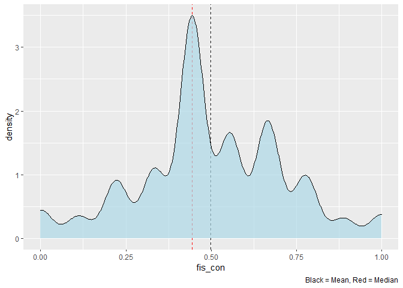
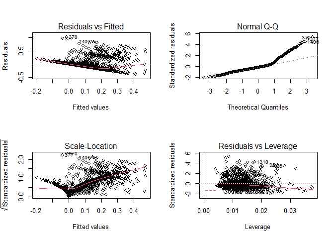
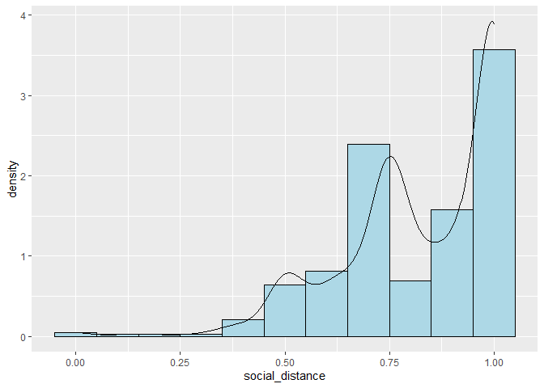
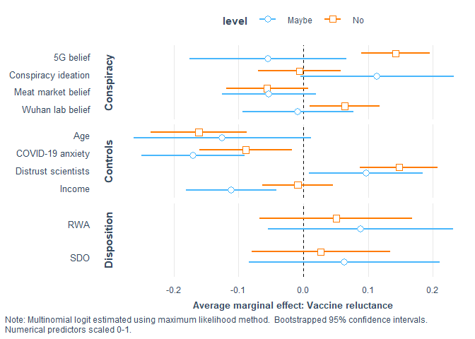
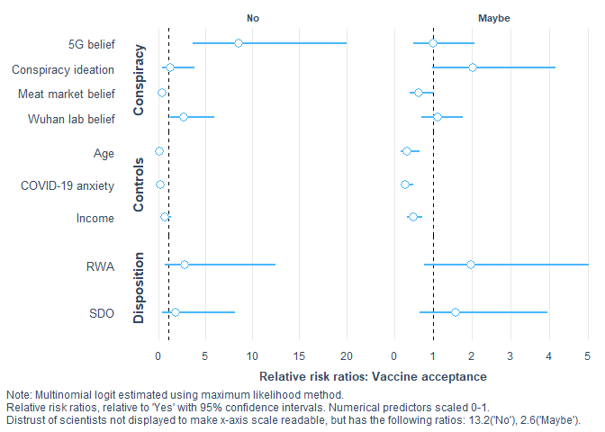

covid\_conspiracies\_markdown3
================
Michael Marshall
14/03/2021

## Loading Packages and Data

``` r
pacman::p_load(tidyverse, stringr, ggridges, forcats, labelled, leaps,
               psych, corrr, cowplot, expss, haven, interplot,
               interactions, jtools,labelled, pscl, psych, 
               sjPlot, skimr)

load("COVID W1_W2_W3 Cleaned 2878.RData") # needs to be in your wd
```

## Rescaling variable

``` r
## [rescale01] Function to rescale a variable from 0 to 1
rescale01 <- function(x, ...) {
  (x - min(x, ...)) / ((max(x, ...)) - min(x, ...))
}
```

## Summary and distribution of different COVID specific conspiracies

``` r
# plotting density of different covid conspiracies
df %>% 
  dplyr::select(W2_Conspiracy_Theory1:W2_Conspiracy_Theory3) %>% 
  gather(conspiracy_code, belief,
         W2_Conspiracy_Theory1:W2_Conspiracy_Theory3) %>%
  mutate(conspiracy_code = as.factor(conspiracy_code)) %>%
  ggplot(aes(x = belief, y = conspiracy_code, height = ..density..)) +
  geom_density_ridges(aes(rel_min_height = 0.005),
                      stat = "density",
                      fill = get_colors("CUD Bright",num.colors = 1)) +
  theme_nice() +
  scale_y_discrete(labels = c("Wuhan laboratory","Meat market","5G")) +
  labs(y = NULL, x = "Belief scale (0-100)",
       caption = "Distribution of origin theory belief") +
  theme(plot.caption = element_text(hjust = 0.61,
                                    face = "bold",
                                    size = 10),
        axis.title.x = element_text(size = 8,
                                    hjust = 0.5)
  )
```

<!-- -->

``` r
#pacman::p_load(patchwork)
df %>% 
  dplyr::select(W2_Conspiracy_Theory1:W2_Conspiracy_Theory3) %>% 
  gather(conspiracy_code, belief,
         W2_Conspiracy_Theory1:W2_Conspiracy_Theory3) %>%
  mutate(conspiracy_code = fct_recode(
    as.factor(conspiracy_code),
    "Wuhan laboratory" = "W2_Conspiracy_Theory1",
    "Meat market" = "W2_Conspiracy_Theory2",
    "5G" = "W2_Conspiracy_Theory3")
    ) %>%
  mutate(
    order_var = ifelse(conspiracy_code == "Meat market", 1,
                       ifelse(conspiracy_code == "Wuhan laboratory",2,3))
  ) %>% 
  ggplot(aes(x = belief)) +
  geom_density(fill = get_colors("CUD Bright",num.colors = 1),
               alpha = 0.8) +
  theme_nice() +
  facet_wrap(~fct_reorder(conspiracy_code,order_var), 
             scales = "free_y", ncol = 1) +
  labs(y = "Density", 
       x = "Distribution of origin theory belief")
```

    ## Warning: attributes are not identical across measure variables;
    ## they will be dropped

    ## Warning: Removed 4416 rows containing non-finite values (stat_density).

<!-- -->

## Cleaning dataset

The following code filters down to just those observations that have
completed the battery of questions relating to COVID specific
conspiracies. It also creates a tibble counting the missing
observations, which can be useful to have as an object.

``` r
# filtering for completed dependent variable
conspiracies <- df %>% 
  filter(!is.na(W2_Conspiracy_Theory1) |
           !is.na(W2_Conspiracy_Theory2) |
           !is.na(W2_Conspiracy_Theory3) |
           !is.na(W2_Conspiracy_Theory3)) %>% 
  rename(W1_Housing_tenure = W1_Hosuing_tenure)

nrow(conspiracies) #1406 observations
```

    ## [1] 1406

``` r
# function to count NAs
count_na <- function(x){
  sum(is.na(x))
}

conspiracies %>% 
  dplyr::select(W2_Conspiracy_Theory1:W2_Conspiracy_Theory3) %>% 
  map_int(count_na)
```

    ## W2_Conspiracy_Theory1 W2_Conspiracy_Theory2 W2_Conspiracy_Theory3 
    ##                     0                     0                     0

``` r
missing <- tibble(
  variable = names(conspiracies),
  NAs = conspiracies %>% map_int(count_na)
)

#View(missing)
```

Due to some measurement error in original *W1\_Education\_binary*
variable, the code below overwrites the variable, and creates a dummy
for degree educated respondents (undergrad OR postgrad = 1).

``` r
conspiracies <- conspiracies %>% 
  mutate(
    W1_Education_binary = ifelse(
      W1_Education %in% c(5,7), 1, 0
    )
  )
count(conspiracies, W1_Education, W1_Education_binary)
```

    ## # A tibble: 8 x 3
    ##                  W1_Education W1_Education_binary     n
    ##                     <dbl+lbl>               <dbl> <int>
    ## 1 1 [No qualifications]                         0    47
    ## 2 2 [O-Level/GCSE or similar]                   0   263
    ## 3 3 [A-Level or similar]                        0   241
    ## 4 4 [Technical qualification]                   0   138
    ## 5 5 [Undergraduate degree]                      1   399
    ## 6 6 [Diploma]                                   0    76
    ## 7 7 [Postgraduate degree]                       1   225
    ## 8 8 [Other qualifications]                      0    17

The code below turns the *preferred newspaper* variables into dummy
variables, as they were previously coded as *1=Yes* and everything else
as *NA*.

``` r
# making preferred newspaper dummy variable (i.e. replacing NA with 0)
na_to_zero <- function(x){
  x[is.na(x)] <- 0
  x <- as.numeric(x)
  return(x)
} 

paper_vars <- rep(str_c("W2_Newspaper_prefer",seq(1,11,1)))

conspiracies[paper_vars] <- conspiracies[paper_vars] %>% 
  map_df(na_to_zero)

conspiracies <- conspiracies %>% 
  mutate(
    red_top_tabloid = ifelse(
      W2_Newspaper_prefer3 == 1 | W2_Newspaper_prefer2 == 1 |
        W2_Newspaper_prefer7 == 1 | W2_Newspaper_prefer8 == 1 |
        W2_Newspaper_prefer9 == 1, 1, 0),
    mid_level_news = ifelse(
      W2_Newspaper_prefer1 == 1 | W2_Newspaper_prefer4 == 1, 1, 0),
    elite_news = ifelse(
      W2_Newspaper_prefer5 == 1 | W2_Newspaper_prefer6 == 1 |
        W2_Newspaper_prefer10 == 1 | 
        W2_Newspaper_prefer11 == 1, 1, 0)
  )

conspiracies %>% 
  count(red_top_tabloid, mid_level_news, elite_news)
```

    ## # A tibble: 8 x 4
    ##   red_top_tabloid mid_level_news elite_news     n
    ##             <dbl>          <dbl>      <dbl> <int>
    ## 1               0              0          0   423
    ## 2               0              0          1   317
    ## 3               0              1          0   219
    ## 4               0              1          1    75
    ## 5               1              0          0   163
    ## 6               1              0          1    54
    ## 7               1              1          0    73
    ## 8               1              1          1    82

``` r
# Creating DVs
# [ethno] ethnocentrism
eth_keys <- list(ethno = cs(W2_Nationalism1,W2_Nationalism2))
eth_test <- scoreItems(eth_keys, conspiracies, min = 1, max = 5)
head(eth_test$scores)
```

    ##      ethno
    ## [1,]     4
    ## [2,]     4
    ## [3,]     4
    ## [4,]     3
    ## [5,]     3
    ## [6,]     3

``` r
eth_test$alpha  # Scale alpha
```

    ##           ethno
    ## alpha 0.8213221

``` r
conspiracies$ethno <- rescale01(eth_test$scores, na.rm = TRUE)
conspiracies$ethno <- c(conspiracies$ethno)  # Ensure variable is numeric and not matrix class
describe(conspiracies$ethno)
```

    ##    vars    n mean   sd median trimmed  mad min max range  skew kurtosis   se
    ## X1    1 1406 0.57 0.25   0.62    0.58 0.19   0   1     1 -0.33    -0.18 0.01

``` r
# Right wing authoritarianism
rwa_keys <- list(rwa = cs(W1_Authoritarianism1_R,
                          W1_Authoritarianism2,
                          W1_Authoritarianism3,
                          W1_Authoritarianism4_R, 
                          W1_Authoritarianism5_R,
                          W1_Authoritarianism6))

rwa_test <- scoreItems(rwa_keys, conspiracies, min = 1, max = 5)
head(rwa_test$scores)
```

    ##           rwa
    ## [1,] 2.833333
    ## [2,] 2.666667
    ## [3,] 3.166667
    ## [4,] 3.333333
    ## [5,] 3.000000
    ## [6,] 3.500000

``` r
summary(rwa_test$alpha)  # Scale alpha
```

    ##       rwa        
    ##  Min.   :0.6837  
    ##  1st Qu.:0.6837  
    ##  Median :0.6837  
    ##  Mean   :0.6837  
    ##  3rd Qu.:0.6837  
    ##  Max.   :0.6837

``` r
conspiracies$RWA <- rescale01(rwa_test$scores, na.rm = TRUE)
conspiracies$RWA <- c(conspiracies$RWA)  # Ensure variable is numeric and not matrix class

describe(conspiracies$RWA)
```

    ##    vars    n mean   sd median trimmed  mad min max range  skew kurtosis se
    ## X1    1 1406 0.51 0.17    0.5    0.52 0.12   0   1     1 -0.25      0.3  0

``` r
## [SDO] Social Dominance Orientation
sdo_keys <- list(sdo = cs(W1_Social_Dominance1,
                          W1_Social_Dominance2_R,
                          W1_Social_Dominance3_R,
                          W1_Social_Dominance4,
                          W1_Social_Dominance5_R,
                          W1_Social_Dominance6, 
                          W1_Social_Dominance7,
                          W1_Social_Dominance8_R))
sdo_test <- scoreItems(sdo_keys, conspiracies, min = 1, max = 5)
head(sdo_test$scores)
```

    ##        sdo
    ## [1,] 1.500
    ## [2,] 3.000
    ## [3,] 3.000
    ## [4,] 2.625
    ## [5,] 3.000
    ## [6,] 2.500

``` r
summary(sdo_test$alpha)  # Scale alpha
```

    ##       sdo        
    ##  Min.   :0.8404  
    ##  1st Qu.:0.8404  
    ##  Median :0.8404  
    ##  Mean   :0.8404  
    ##  3rd Qu.:0.8404  
    ##  Max.   :0.8404

``` r
conspiracies$SDO <- rescale01(sdo_test$scores, na.rm = TRUE)
conspiracies$SDO <- c(conspiracies$SDO)  # Ensure variable is numeric and not matrix class

summary(conspiracies$SDO)
```

    ##    Min. 1st Qu.  Median    Mean 3rd Qu.    Max. 
    ##  0.0000  0.2258  0.3871  0.3620  0.5161  1.0000

``` r
## [threat] Covid-19 related Threat
summary(conspiracies$W2_COVID19_anxiety)
```

    ##    Min. 1st Qu.  Median    Mean 3rd Qu.    Max. 
    ##    0.00   50.00   65.00   61.25   80.75  100.00

``` r
conspiracies$threat <- rescale01(conspiracies$W2_COVID19_anxiety)
conspiracies %>% 
  dplyr::select(W2_COVID19_anxiety, threat) %>%
  correlate()
```

    ## 
    ## Correlation method: 'pearson'
    ## Missing treated using: 'pairwise.complete.obs'

    ## # A tibble: 2 x 3
    ##   rowname            W2_COVID19_anxiety threat
    ##   <chr>                           <dbl>  <dbl>
    ## 1 W2_COVID19_anxiety                 NA      1
    ## 2 threat                              1     NA

``` r
## [right] Right-Wing political views
table(conspiracies$W1_Political_Scale)
```

    ## 
    ##   1   2   3   4   5   6   7   8   9  10 
    ##  35  44 116 143 488 221 182 102  36  39

``` r
conspiracies$right <- rescale01(conspiracies$W1_Political_Scale)
conspiracies %>% 
  dplyr::select(W1_Political_Scale, right) %>%
  correlate()
```

    ## 
    ## Correlation method: 'pearson'
    ## Missing treated using: 'pairwise.complete.obs'

    ## # A tibble: 2 x 3
    ##   rowname            W1_Political_Scale right
    ##   <chr>                           <dbl> <dbl>
    ## 1 W1_Political_Scale                 NA     1
    ## 2 right                               1    NA

``` r
## [soc.con] Social conservatism
table(conspiracies$W1_Political_Abortion_SSM)
```

    ## 
    ##   1   2   3   4   5   6   7   8   9  10 
    ## 262 123 175 129 330 124 109  67  31  56

``` r
conspiracies$soc_con <- rescale01(
  conspiracies$W1_Political_Abortion_SSM)
conspiracies %>% 
  dplyr::select(W1_Political_Abortion_SSM, soc_con) %>%
  correlate()
```

    ## 
    ## Correlation method: 'pearson'
    ## Missing treated using: 'pairwise.complete.obs'

    ## # A tibble: 2 x 3
    ##   rowname                   W1_Political_Abortion_SSM soc_con
    ##   <chr>                                         <dbl>   <dbl>
    ## 1 W1_Political_Abortion_SSM                        NA       1
    ## 2 soc_con                                           1      NA

``` r
## [fis.con] Fiscal conservatism
table(conspiracies$W1_Political_Fiscal)
```

    ## 
    ##   1   2   3   4   5   6   7   8   9  10 
    ##  55  43 112 133 430 201 226 121  39  46

``` r
conspiracies$fis_con <- rescale01(conspiracies$W1_Political_Fiscal)
conspiracies %>% 
  dplyr::select(W1_Political_Fiscal, fis_con) %>%
  correlate()
```

    ## 
    ## Correlation method: 'pearson'
    ## Missing treated using: 'pairwise.complete.obs'

    ## # A tibble: 2 x 3
    ##   rowname             W1_Political_Fiscal fis_con
    ##   <chr>                             <dbl>   <dbl>
    ## 1 W1_Political_Fiscal                  NA       1
    ## 2 fis_con                               1      NA

``` r
## [age.c] Age (in years)
summary(conspiracies$W2_Age_year)
```

    ##    Min. 1st Qu.  Median    Mean 3rd Qu.    Max. 
    ##   18.00   37.00   50.00   49.32   61.00   88.00

``` r
conspiracies$age_sc <- rescale01(conspiracies$W2_Age_year)
```

``` r
# conspiracy ideation
consp_keys <- list(consp = cs(W1_Conspiracy_1,
                          W1_Conspiracy_2,
                          W1_Conspiracy_3,
                          W1_Conspiracy_4,
                          W1_Conspiracy_5))
consp_test <- scoreItems(consp_keys, conspiracies, min = 1, max = 11)
```

    ## Number of categories should be increased  in order to count frequencies.

``` r
head(consp_test$scores)
```

    ##      consp
    ## [1,]   5.8
    ## [2,]   9.0
    ## [3,]   7.0
    ## [4,]   8.6
    ## [5,]   6.0
    ## [6,]   8.8

``` r
consp_test$alpha  # Scale alpha
```

    ##           consp
    ## alpha 0.8537269

``` r
cor(consp_test$scores, conspiracies$W1_Conspiracy_Total)
```

    ##       [,1]
    ## consp    1

``` r
mean(
  round(rescale01(consp_test$scores, na.rm = T), 4) ==
    round(rescale01(conspiracies$W1_Conspiracy_Total, na.rm = T), 4)
) # scale is equal to pre-existing variable in dataset
```

    ## [1] 1

``` r
# intolerance of uncertainty
iou_keys <- list(iou = cs(W2_IOU1, W2_IOU2,W2_IOU3, W2_IOU4,
                          W2_IOU5, W2_IOU5,W2_IOU6,W2_IOU7,
                          W2_IOU7,W2_IOU8,W2_IOU9,W2_IOU10,
                          W2_IOU11,W2_IOU12))
iou_test <- scoreItems(iou_keys, conspiracies, min = 1, max = 5)
head(iou_test$scores)
```

    ##           iou
    ## [1,] 3.416667
    ## [2,] 3.916667
    ## [3,] 4.250000
    ## [4,] 3.083333
    ## [5,] 3.000000
    ## [6,] 2.500000

``` r
iou_test$alpha  # Scale alpha
```

    ##             iou
    ## alpha 0.9097412

``` r
cor(iou_test$scores, conspiracies$W2_IOU_Total)
```

    ##     [,1]
    ## iou    1

``` r
mean(
  round(rescale01(iou_test$scores, na.rm = T), 4) ==
    round(rescale01(conspiracies$W2_IOU_Total, na.rm = T), 4)
) # scale is equal to pre-existing variable in dataset
```

    ## [1] 1

``` r
factors <- c("W1_Ethnicity",
             "W2_Gender_binary")
# turning to factors
conspiracies[factors] <- conspiracies[factors] %>% 
  map_df(as.factor)
```

``` r
# renaming trust in science
conspiracies <- conspiracies %>% 
  rename(distrust_science = W2_Trust_Body6)
```

``` r
# rescaling the remaining numeric variables
numerics <- c("W1_Conspiracy_Total","W2_IOU_Total", "W2_INFO_5",
              "W2_INFO_9","distrust_science","W1_Income_2019")

conspiracies[numerics] <- conspiracies[numerics] %>% 
  map_df(rescale01, na.rm = TRUE)
```

``` r
# creating scaled versions of each conspiracy belief
conspiracies$conspiracy1_sc <- rescale01(
  conspiracies$W2_Conspiracy_Theory1, na.rm = TRUE
)

conspiracies$conspiracy2_sc <- rescale01(
  conspiracies$W2_Conspiracy_Theory2, na.rm = TRUE
)

conspiracies$conspiracy3_sc <- rescale01(
  conspiracies$W2_Conspiracy_Theory3, na.rm = TRUE
)

conspiracies$conspiracy4_sc <- rescale01(
  conspiracies$W2_Conspiracy_Theory4, na.rm = TRUE
)

conspiracies$conspiracy5_sc <- rescale01(
  conspiracies$W2_Conspiracy_Theory5, na.rm = TRUE
)
```

## Distribution of variables

A for loop to look at distribution of potential independent variables
(numeric only).

``` r
plot_vars <- conspiracies %>% 
  dplyr::select(
    one_of(numerics),ethno,RWA,SDO,threat,right,soc_con,fis_con
    ) %>%
  names()

for(i in seq_along(plot_vars)){
  
  x1 <- conspiracies[plot_vars][i] %>% as_vector()
  
  print(
    ggplot(data = NULL, aes(x = x1)) +
      geom_vline(aes(xintercept = mean(x1, na.rm =TRUE)), 
                 colour = "black",
                 linetype = "dashed") +
      geom_vline(aes(xintercept = median(x1, na.rm =TRUE)), 
                 colour = "red",
                 linetype = "dashed") +
      geom_density(fill = "lightblue", alpha = 0.7) +
      labs(x = plot_vars[i],
           caption = "Black = Mean, Red = Median")  
  )
  
}
```

<!-- --><!-- --><!-- --><!-- -->

    ## Warning: Removed 4 rows containing non-finite values (stat_density).

<!-- --><!-- --><!-- --><!-- --><!-- --><!-- --><!-- --><!-- --><!-- -->

# Correlation between the origin theories

Correlation between the origin theories below. Statistical significance
tested via spearman’s rank, with bonferroni correction for 3 tests.

``` r
pacman::p_load(knitr)
my_cor <- corr.test(
  conspiracies %>% dplyr::select(conspiracy1_sc:conspiracy3_sc),
  method = "kendall",
  adjust = "bonferroni"
)

my_cor$r %>% 
  as_tibble() %>% 
  kable()
```

| conspiracy1\_sc | conspiracy2\_sc | conspiracy3\_sc |
| --------------: | --------------: | --------------: |
|       1.0000000 |     \-0.0957135 |       0.3238067 |
|     \-0.0957135 |       1.0000000 |     \-0.0765614 |
|       0.3238067 |     \-0.0765614 |       1.0000000 |

``` r
my_cor$p %>% 
  as_tibble() %>% 
  kable()
```

| conspiracy1\_sc | conspiracy2\_sc | conspiracy3\_sc |
| --------------: | --------------: | --------------: |
|       0.0000000 |       0.0009769 |       0.0000000 |
|       0.0003256 |       0.0000000 |       0.0122186 |
|       0.0000000 |       0.0040729 |       0.0000000 |

# Modelling for belief in Chinese lab origin

## DV Chinese lab conspiracy - singular IV models

``` r
sdo_lab <- lm(conspiracy1_sc ~ SDO,
              data = conspiracies)

summ(sdo_lab)
```

    ## MODEL INFO:
    ## Observations: 1406
    ## Dependent Variable: conspiracy1_sc
    ## Type: OLS linear regression 
    ## 
    ## MODEL FIT:
    ## F(1,1404) = 65.28, p = 0.00
    ## R² = 0.04
    ## Adj. R² = 0.04 
    ## 
    ## Standard errors: OLS
    ## -----------------------------------------------
    ##                     Est.   S.E.   t val.      p
    ## ----------------- ------ ------ -------- ------
    ## (Intercept)         0.24   0.02    12.34   0.00
    ## SDO                 0.39   0.05     8.08   0.00
    ## -----------------------------------------------

``` r
rwa_lab <- lm(conspiracy1_sc ~ RWA,
              data = conspiracies)

summ(rwa_lab)
```

    ## MODEL INFO:
    ## Observations: 1406
    ## Dependent Variable: conspiracy1_sc
    ## Type: OLS linear regression 
    ## 
    ## MODEL FIT:
    ## F(1,1404) = 87.72, p = 0.00
    ## R² = 0.06
    ## Adj. R² = 0.06 
    ## 
    ## Standard errors: OLS
    ## -----------------------------------------------
    ##                     Est.   S.E.   t val.      p
    ## ----------------- ------ ------ -------- ------
    ## (Intercept)         0.14   0.03     5.07   0.00
    ## RWA                 0.47   0.05     9.37   0.00
    ## -----------------------------------------------

## DV Chinese lab conspiracy - socio-economic variables

``` r
se_lab <- lm(conspiracy1_sc ~ W2_Gender_binary +
               W1_Education_binary +
               W1_Income_2019 +
               age_sc,
              data = conspiracies)

summary(se_lab)$adj.r.squared
```

    ## [1] 0.04693264

``` r
AIC(se_lab)
```

    ## [1] 827.0941

## DV Chinese lab conspiracy - socio-economic variables + political/media

``` r
se_pol_lab <- update(se_lab, ~ . +
                   #political and media variables
                   right +
                   ethno +
                   distrust_science + #distrust of scientists
                   red_top_tabloid + 
                   mid_level_news + 
                   elite_news + 
                   W2_INFO_5 + #social media
                   W2_INFO_9 #family and friends
                 )

summary(se_pol_lab)$adj.r.squared
```

    ## [1] 0.1971395

``` r
AIC(se_pol_lab)
```

    ## [1] 591.6542

## DV Chinese lab conspiracy - socio-economic variables + political/media + pol-psych

``` r
se_polpsych_lab <- update(se_pol_lab, ~ . +
                        #political-psychology variables
                        SDO +
                        RWA +
                        W2_IOU_Total)

summary(se_polpsych_lab)$adj.r.squared
```

    ## [1] 0.2128012

``` r
AIC(se_polpsych_lab)
```

    ## [1] 567.0623

``` r
car::vif(se_polpsych_lab)
```

    ## Registered S3 methods overwritten by 'car':
    ##   method                          from
    ##   influence.merMod                lme4
    ##   cooks.distance.influence.merMod lme4
    ##   dfbeta.influence.merMod         lme4
    ##   dfbetas.influence.merMod        lme4

    ##    W2_Gender_binary W1_Education_binary      W1_Income_2019              age_sc 
    ##            1.087265            1.200203            1.131525            1.366633 
    ##               right               ethno    distrust_science     red_top_tabloid 
    ##            1.487366            1.302714            1.076368            1.089356 
    ##      mid_level_news          elite_news           W2_INFO_5           W2_INFO_9 
    ##            1.126469            1.139595            1.381617            1.221180 
    ##                 SDO                 RWA        W2_IOU_Total 
    ##            1.446343            1.397784            1.136058

## DV Chinese lab conspiracy - socio-economic variables + political/media + pol-psych + covid-threat

``` r
multi_lab <- update(se_polpsych_lab, ~ . +
                  #covid-anxety
                  threat)

summary(multi_lab)$adj.r.squared
```

    ## [1] 0.2207157

``` r
AIC(multi_lab)
```

    ## [1] 553.9136

## DV Chinese lab conspiracy - full model incl. conspiracy ideation

``` r
full_lab <- update(multi_lab, ~ . + 
                  #conspiracies
                  W1_Conspiracy_Total)

summary(full_lab)$adj.r.squared
```

    ## [1] 0.2448091

``` r
AIC(full_lab)
```

    ## [1] 510.9649

``` r
summ(full_lab, vifs = T)
```

    ## MODEL INFO:
    ## Observations: 1399 (7 missing obs. deleted)
    ## Dependent Variable: conspiracy1_sc
    ## Type: OLS linear regression 
    ## 
    ## MODEL FIT:
    ## F(17,1381) = 27.66, p = 0.00
    ## R² = 0.25
    ## Adj. R² = 0.24 
    ## 
    ## Standard errors: OLS
    ## ---------------------------------------------------------------
    ##                              Est.   S.E.   t val.      p    VIF
    ## ------------------------- ------- ------ -------- ------ ------
    ## (Intercept)                 -0.18   0.05    -3.40   0.00       
    ## W2_Gender_binary2            0.02   0.02     1.30   0.19   1.09
    ## W1_Education_binary         -0.05   0.02    -3.02   0.00   1.20
    ## W1_Income_2019              -0.06   0.02    -2.74   0.01   1.13
    ## age_sc                      -0.04   0.04    -0.87   0.38   1.39
    ## right                        0.02   0.05     0.46   0.64   1.49
    ## ethno                        0.12   0.04     3.31   0.00   1.30
    ## distrust_science             0.18   0.03     5.49   0.00   1.11
    ## red_top_tabloid              0.06   0.02     3.43   0.00   1.09
    ## mid_level_news               0.10   0.02     5.72   0.00   1.13
    ## elite_news                  -0.01   0.02    -0.81   0.42   1.14
    ## W2_INFO_5                    0.07   0.03     2.58   0.01   1.39
    ## W2_INFO_9                    0.13   0.03     4.27   0.00   1.24
    ## SDO                          0.23   0.05     4.31   0.00   1.48
    ## RWA                          0.14   0.05     2.67   0.01   1.42
    ## W2_IOU_Total                -0.04   0.04    -0.91   0.37   1.22
    ## threat                       0.12   0.03     3.70   0.00   1.14
    ## W1_Conspiracy_Total          0.27   0.04     6.71   0.00   1.10
    ## ---------------------------------------------------------------

## DV Chinese lab conspiracy - interaction RWA and COVID-19 anxiety

``` r
int_lab <- lm(conspiracy1_sc ~ W2_Gender_binary +
                W1_Education_binary +
                W1_Income_2019 +
                age_sc +
                right +
                ethno +
                distrust_science + #distrust of scientists
                red_top_tabloid +
                mid_level_news +
                elite_news +
                W2_INFO_5 + #social media
                W2_INFO_9 + # family and friends
                SDO +
                W2_IOU_Total +
                W1_Conspiracy_Total +
                (RWA * threat), # interaction term
              data = conspiracies) 

summ(int_lab)
```

    ## MODEL INFO:
    ## Observations: 1399 (7 missing obs. deleted)
    ## Dependent Variable: conspiracy1_sc
    ## Type: OLS linear regression 
    ## 
    ## MODEL FIT:
    ## F(18,1380) = 26.13, p = 0.00
    ## R² = 0.25
    ## Adj. R² = 0.24 
    ## 
    ## Standard errors: OLS
    ## --------------------------------------------------------
    ##                              Est.   S.E.   t val.      p
    ## ------------------------- ------- ------ -------- ------
    ## (Intercept)                 -0.14   0.08    -1.84   0.07
    ## W2_Gender_binary2            0.02   0.02     1.27   0.20
    ## W1_Education_binary         -0.05   0.02    -3.03   0.00
    ## W1_Income_2019              -0.06   0.02    -2.72   0.01
    ## age_sc                      -0.04   0.04    -0.89   0.38
    ## right                        0.02   0.05     0.45   0.66
    ## ethno                        0.12   0.04     3.31   0.00
    ## distrust_science             0.18   0.03     5.47   0.00
    ## red_top_tabloid              0.06   0.02     3.45   0.00
    ## mid_level_news               0.10   0.02     5.74   0.00
    ## elite_news                  -0.01   0.02    -0.78   0.44
    ## W2_INFO_5                    0.07   0.03     2.60   0.01
    ## W2_INFO_9                    0.13   0.03     4.23   0.00
    ## SDO                          0.23   0.05     4.33   0.00
    ## W2_IOU_Total                -0.04   0.04    -0.88   0.38
    ## W1_Conspiracy_Total          0.27   0.04     6.72   0.00
    ## RWA                          0.07   0.12     0.61   0.54
    ## threat                       0.06   0.10     0.62   0.54
    ## RWA:threat                   0.11   0.17     0.65   0.51
    ## --------------------------------------------------------

``` r
plot_coefs(int_lab)
```

    ## Loading required namespace: broom.mixed

    ## Registered S3 method overwritten by 'broom.mixed':
    ##   method      from 
    ##   tidy.gamlss broom

<!-- -->

No evidence for an interaction between RWA and threat.

``` r
summary(full_lab)$adj.r.squared
```

    ## [1] 0.2448091

``` r
AIC(full_lab)
```

    ## [1] 510.9649

``` r
summary(int_lab)$adj.r.squared
```

    ## [1] 0.2444946

``` r
AIC(int_lab)
```

    ## [1] 512.534

# Modelling for belief in 5G origin conspiracy

## Plots of DV, incl. inverse hyperbolic sine transformation

``` r
# functions for IHS transformation
ihs <- function(x, theta){  # IHS transformation
  asinh(theta * x)/theta
}

ihs_loglik <- function(theta,x){
  
  ihs <- function(x, theta){  # function to IHS transform
    asinh(theta * x)/theta
  }
  
  n <- length(x)
  xt <- ihs(x, theta)
  
  log_lik <- -n*log(sum((xt - mean(xt))^2))- sum(log(1+theta^2*x^2))
  return(log_lik)
}     
```

``` r
best_theta <- optimize(ihs_loglik, 
                       lower = 0.00001, upper = 1e+06,
                       x = conspiracies$W2_Conspiracy_Theory3, 
                       maximum = TRUE)$maximum
best_theta # continues to rise indefinitely
```

    ## [1] 1e+06

``` r
# trying different starting point
best_theta <- optimize(ihs_loglik, 
                       lower = 0.001, upper = 1e+08,
                       x = conspiracies$W2_Conspiracy_Theory3, 
                       maximum = TRUE)$maximum
best_theta # continues to rise indefinitely
```

    ## [1] 1e+08

``` r
# raw data 
conspiracies %>% 
  ggplot(aes(x = W2_Conspiracy_Theory3)) +
  geom_histogram(aes(y = ..density..),
                 colour = "darkgrey", fill = "lightblue") +
  geom_density()
```

    ## `stat_bin()` using `bins = 30`. Pick better value with `binwidth`.

<!-- -->

``` r
# ihs transformation where theta = 1
conspiracies %>% 
  ggplot(aes(x = asinh(W2_Conspiracy_Theory3))) +
  geom_histogram(aes(y = ..density..),
                 colour = "darkgrey", fill = "lightblue") +
  geom_density()
```

    ## `stat_bin()` using `bins = 30`. Pick better value with `binwidth`.

<!-- -->

``` r
# ihs transformation where theta = 1e+08
conspiracies %>% 
  ggplot(aes(x = ihs(W2_Conspiracy_Theory3, best_theta))) +
  geom_histogram(aes(y = ..density..),
                 colour = "darkgrey", fill = "lightblue") +
  geom_density()
```

    ## `stat_bin()` using `bins = 30`. Pick better value with `binwidth`.

<!-- -->

``` r
# transforming using theta = 1
conspiracies <- conspiracies %>% 
  mutate(w2_conspiracy3_ihs = asinh(W2_Conspiracy_Theory3))
```

## DV 5G conspiracy - singular IV models

``` r
sdo_5g <- lm(conspiracy3_sc ~ SDO,
              data = conspiracies)

summ(sdo_5g)
```

    ## MODEL INFO:
    ## Observations: 1406
    ## Dependent Variable: conspiracy3_sc
    ## Type: OLS linear regression 
    ## 
    ## MODEL FIT:
    ## F(1,1404) = 82.37, p = 0.00
    ## R² = 0.06
    ## Adj. R² = 0.05 
    ## 
    ## Standard errors: OLS
    ## -----------------------------------------------
    ##                     Est.   S.E.   t val.      p
    ## ----------------- ------ ------ -------- ------
    ## (Intercept)         0.01   0.01     0.57   0.57
    ## SDO                 0.29   0.03     9.08   0.00
    ## -----------------------------------------------

``` r
rwa_5g <- lm(conspiracy3_sc ~ RWA,
              data = conspiracies)

summ(rwa_5g)
```

    ## MODEL INFO:
    ## Observations: 1406
    ## Dependent Variable: conspiracy3_sc
    ## Type: OLS linear regression 
    ## 
    ## MODEL FIT:
    ## F(1,1404) = 2.80, p = 0.09
    ## R² = 0.00
    ## Adj. R² = 0.00 
    ## 
    ## Standard errors: OLS
    ## -----------------------------------------------
    ##                     Est.   S.E.   t val.      p
    ## ----------------- ------ ------ -------- ------
    ## (Intercept)         0.08   0.02     4.40   0.00
    ## RWA                 0.06   0.03     1.67   0.09
    ## -----------------------------------------------

## DV 5G conspiracy - socio-economic variables

``` r
se_5g <- lm(conspiracy3_sc ~ W2_Gender_binary +
               W1_Education_binary +
               W1_Income_2019 +
               age_sc,
              data = conspiracies)

#function for adj.r.squared
adj_rsq <- function(mod){
  out <- summary(mod)$adj.r.squared
  return(out)
}

adj_rsq(se_5g)
```

    ## [1] 0.05624114

``` r
AIC(se_5g)
```

    ## [1] -355.7797

## DV 5G conspiracy - socio-economic variables + political/media

``` r
se_pol_5g <- update(se_5g, ~ . +
                   #political and media variables
                   right +
                   ethno +
                   distrust_science + 
                   red_top_tabloid + 
                   mid_level_news + 
                   elite_news + 
                   W2_INFO_5 + #social media
                   W2_INFO_9) # family and friends

adj_rsq(se_pol_5g)
```

    ## [1] 0.1972151

``` r
AIC(se_pol_5g)
```

    ## [1] -579.9208

## DV 5G conspiracy - socio-economic variables + political/media + pol-psych

``` r
se_polpsych_5g <- update(se_pol_5g, ~ . +
                        #political-psychology variables
                        SDO +
                        RWA +
                        W2_IOU_Total)

adj_rsq(se_polpsych_5g)
```

    ## [1] 0.2230283

``` r
AIC(se_polpsych_5g)
```

    ## [1] -622.6755

## DV 5G conspiracy - socio-economic variables + political/media + pol-psych + covid-threat

``` r
multi_5g <- update(se_polpsych_5g, ~ . +
                  #covid-anxiety
                  threat)

adj_rsq(multi_5g)
```

    ## [1] 0.2231347

``` r
AIC(multi_5g)
```

    ## [1] -621.8791

## DV 5G conspiracy - socio-economic variables + political/media + pol-psych + covid-threat and CRT + conspiracies

``` r
full_5g <- update(multi_5g, ~ . +
                #conspiracies
                W1_Conspiracy_Total)

adj_rsq(full_5g)
```

    ## [1] 0.2257733

``` r
AIC(full_5g)
```

    ## [1] -625.6515

``` r
summ(full_5g, vifs = T)
```

    ## MODEL INFO:
    ## Observations: 1399 (7 missing obs. deleted)
    ## Dependent Variable: conspiracy3_sc
    ## Type: OLS linear regression 
    ## 
    ## MODEL FIT:
    ## F(17,1381) = 24.98, p = 0.00
    ## R² = 0.24
    ## Adj. R² = 0.23 
    ## 
    ## Standard errors: OLS
    ## ---------------------------------------------------------------
    ##                              Est.   S.E.   t val.      p    VIF
    ## ------------------------- ------- ------ -------- ------ ------
    ## (Intercept)                 -0.10   0.03    -2.83   0.00       
    ## W2_Gender_binary2            0.00   0.01     0.18   0.85   1.09
    ## W1_Education_binary         -0.02   0.01    -1.34   0.18   1.20
    ## W1_Income_2019              -0.04   0.02    -2.91   0.00   1.13
    ## age_sc                      -0.08   0.03    -2.96   0.00   1.39
    ## right                        0.02   0.03     0.62   0.54   1.49
    ## ethno                        0.05   0.02     2.02   0.04   1.30
    ## distrust_science             0.20   0.02     9.17   0.00   1.11
    ## red_top_tabloid              0.06   0.01     5.21   0.00   1.09
    ## mid_level_news               0.00   0.01     0.36   0.72   1.13
    ## elite_news                   0.01   0.01     0.55   0.58   1.14
    ## W2_INFO_5                    0.08   0.02     4.24   0.00   1.39
    ## W2_INFO_9                    0.09   0.02     4.24   0.00   1.24
    ## SDO                          0.25   0.03     7.15   0.00   1.48
    ## RWA                         -0.11   0.04    -2.92   0.00   1.42
    ## W2_IOU_Total                 0.01   0.03     0.48   0.63   1.22
    ## threat                       0.02   0.02     1.01   0.31   1.14
    ## W1_Conspiracy_Total          0.06   0.03     2.39   0.02   1.10
    ## ---------------------------------------------------------------

## DV 5G IHS conspiracy - singular IV models

``` r
sdo_5g_ihs <- lm(w2_conspiracy3_ihs ~ SDO,
              data = conspiracies)

summ(sdo_5g_ihs)
```

    ## MODEL INFO:
    ## Observations: 1406
    ## Dependent Variable: w2_conspiracy3_ihs
    ## Type: OLS linear regression 
    ## 
    ## MODEL FIT:
    ## F(1,1404) = 107.63, p = 0.00
    ## R² = 0.07
    ## Adj. R² = 0.07 
    ## 
    ## Standard errors: OLS
    ## -----------------------------------------------
    ##                     Est.   S.E.   t val.      p
    ## ----------------- ------ ------ -------- ------
    ## (Intercept)         0.56   0.10     5.56   0.00
    ## SDO                 2.58   0.25    10.37   0.00
    ## -----------------------------------------------

``` r
rwa_5g_ihs <- lm(w2_conspiracy3_ihs ~ RWA,
              data = conspiracies)

summ(rwa_5g_ihs)
```

    ## MODEL INFO:
    ## Observations: 1406
    ## Dependent Variable: w2_conspiracy3_ihs
    ## Type: OLS linear regression 
    ## 
    ## MODEL FIT:
    ## F(1,1404) = 23.23, p = 0.00
    ## R² = 0.02
    ## Adj. R² = 0.02 
    ## 
    ## Standard errors: OLS
    ## -----------------------------------------------
    ##                     Est.   S.E.   t val.      p
    ## ----------------- ------ ------ -------- ------
    ## (Intercept)         0.82   0.15     5.64   0.00
    ## RWA                 1.30   0.27     4.82   0.00
    ## -----------------------------------------------

## DV 5G IHS conspiracy - socio-economic variables

``` r
se_5g_ihs <- lm(w2_conspiracy3_ihs ~ W2_Gender_binary +
               W1_Education_binary +
               W1_Income_2019 +
               age_sc,
              data = conspiracies)

adj_rsq(se_5g_ihs)
```

    ## [1] 0.05804877

``` r
AIC(se_5g_ihs)
```

    ## [1] 5443

## DV 5G IHS conspiracy - socio-economic variables + political/media

``` r
se_pol_5g_ihs <- update(se_5g_ihs, ~ . +
                   #political and media variables
                   right +
                   ethno +
                   distrust_science + 
                   red_top_tabloid + 
                   mid_level_news + 
                   elite_news + 
                   W2_INFO_5 + #social media
                   W2_INFO_9)

adj_rsq(se_pol_5g_ihs)
```

    ## [1] 0.2308266

``` r
AIC(se_pol_5g_ihs)
```

    ## [1] 5147.385

## DV 5G IHS conspiracy - socio-economic variables + political/media + pol-psych

``` r
se_polpsych_5g_ihs <- update(se_pol_5g_ihs, ~ . +
                        #political-psychology variables
                        SDO +
                        RWA +
                        W2_IOU_Total)

adj_rsq(se_polpsych_5g_ihs)
```

    ## [1] 0.2586094

``` r
AIC(se_polpsych_5g_ihs)
```

    ## [1] 5098.886

## DV 5G IHS conspiracy - socio-economic variables + political/media + pol-psych + covid-threat

``` r
multi_5g_ihs <- update(se_polpsych_5g_ihs, ~ . +
                  #covid-anxiety
                  threat)

adj_rsq(multi_5g_ihs)
```

    ## [1] 0.2591528

``` r
AIC(multi_5g_ihs)
```

    ## [1] 5098.848

## DV 5G IHS conspiracy - socio-economic variables + political/media + pol-psych + covid-threat and CRT + conspiracies

``` r
full_5g_ihs <- update(multi_5g_ihs, ~ . +
                #conspiracies
                W1_Conspiracy_Total)

adj_rsq(full_5g_ihs)
```

    ## [1] 0.2612123

``` r
AIC(full_5g_ihs)
```

    ## [1] 5095.941

``` r
summ(full_5g_ihs, vifs = TRUE)
```

    ## MODEL INFO:
    ## Observations: 1399 (7 missing obs. deleted)
    ## Dependent Variable: w2_conspiracy3_ihs
    ## Type: OLS linear regression 
    ## 
    ## MODEL FIT:
    ## F(17,1381) = 30.08, p = 0.00
    ## R² = 0.27
    ## Adj. R² = 0.26 
    ## 
    ## Standard errors: OLS
    ## ---------------------------------------------------------------
    ##                              Est.   S.E.   t val.      p    VIF
    ## ------------------------- ------- ------ -------- ------ ------
    ## (Intercept)                 -0.67   0.27    -2.54   0.01       
    ## W2_Gender_binary2            0.18   0.08     2.14   0.03   1.09
    ## W1_Education_binary         -0.14   0.09    -1.63   0.10   1.20
    ## W1_Income_2019              -0.40   0.12    -3.37   0.00   1.13
    ## age_sc                      -0.39   0.22    -1.77   0.08   1.39
    ## right                        0.05   0.24     0.19   0.85   1.49
    ## ethno                        0.36   0.18     1.99   0.05   1.30
    ## distrust_science             1.80   0.17    10.78   0.00   1.11
    ## red_top_tabloid              0.46   0.09     4.86   0.00   1.09
    ## mid_level_news               0.07   0.09     0.74   0.46   1.13
    ## elite_news                  -0.06   0.09    -0.70   0.48   1.14
    ## W2_INFO_5                    0.78   0.15     5.31   0.00   1.39
    ## W2_INFO_9                    0.58   0.16     3.71   0.00   1.24
    ## SDO                          2.03   0.27     7.51   0.00   1.48
    ## RWA                         -0.17   0.28    -0.62   0.54   1.42
    ## W2_IOU_Total                 0.12   0.22     0.53   0.60   1.22
    ## threat                       0.22   0.16     1.34   0.18   1.14
    ## W1_Conspiracy_Total          0.46   0.21     2.20   0.03   1.10
    ## ---------------------------------------------------------------

## DV 5G conspiracy poisson regression model

``` r
# looking at mean and variance to check for overdispersion
conspiracies %>% 
  mutate(
    sdo_deciles = cut_number(SDO,10)
  ) %>%
  group_by(sdo_deciles) %>% 
  summarise(
    mean_5g = mean(W2_Conspiracy_Theory3),
    var_5g = sd(W2_Conspiracy_Theory3) ^ 2
  )
```

    ## `summarise()` ungrouping output (override with `.groups` argument)

    ## # A tibble: 10 x 3
    ##    sdo_deciles    mean_5g var_5g
    ##    <fct>            <dbl>  <dbl>
    ##  1 [0,0.0968]        3.77   171.
    ##  2 (0.0968,0.194]    5.95   285.
    ##  3 (0.194,0.258]     5.11   250.
    ##  4 (0.258,0.323]     6.52   228.
    ##  5 (0.323,0.387]     8.72   316.
    ##  6 (0.387,0.452]    11.6    479.
    ##  7 (0.452,0.484]    11.2    418.
    ##  8 (0.484,0.516]    26.1    894.
    ##  9 (0.516,0.548]    18.2    749.
    ## 10 (0.548,1]        13.2    544.

``` r
conspiracies %>% 
  mutate(
    social_media = cut_interval(W2_INFO_5,5)
  ) %>%
  group_by(social_media) %>% 
  summarise(
    mean_5g = mean(W2_Conspiracy_Theory3),
    var_5g = sd(W2_Conspiracy_Theory3) ^ 2
  )
```

    ## `summarise()` ungrouping output (override with `.groups` argument)

    ## # A tibble: 4 x 3
    ##   social_media mean_5g var_5g
    ##   <fct>          <dbl>  <dbl>
    ## 1 [0,0.2]         6.11   252.
    ## 2 (0.2,0.4]      10.9    405.
    ## 3 (0.6,0.8]      19.1    786.
    ## 4 (0.8,1]        20.3    886.

The tables above suggest overdispersion of the data. As a result,
running quasipoisson model.

``` r
full_5g_poiss <- glm(W2_Conspiracy_Theory3 ~
                           #socio-economic variables
                           W2_Gender_binary +
                           W1_Education_binary +
                           W1_Income_2019 +
                           age_sc +
                           
                           #political and media variables
                           right +
                           ethno +
                           distrust_science + #distrust of scientists
                           red_top_tabloid + 
                           mid_level_news + 
                           elite_news + 
                           W2_INFO_5 + #social media
                           W2_INFO_9 + #family and friends
                           
                           #political-psychology variables
                           SDO +
                           RWA +
                           W2_IOU_Total +
                           
                           #covid-anxiety
                           threat +
                           
                           #conspiracies
                           W1_Conspiracy_Total,
                         family = "quasipoisson", data = conspiracies)

summ(full_5g_poiss)
```

    ## Note: Pseudo-R2 for quasibinomial/quasipoisson families is calculated by
    ## refitting the fitted and null models as binomial/poisson.

    ## MODEL INFO:
    ## Observations: 1399 (7 missing obs. deleted)
    ## Dependent Variable: W2_Conspiracy_Theory3
    ## Type: Generalized linear model
    ##   Family: quasipoisson 
    ##   Link function: log 
    ## 
    ## MODEL FIT:
    ## <U+03C7>²(17) = 12893.93, p = 0.00
    ## Pseudo-R² (Cragg-Uhler) = 1.00
    ## Pseudo-R² (McFadden) = 0.29
    ## AIC =  NA, BIC =  NA 
    ## 
    ## Standard errors: MLE
    ## --------------------------------------------------------
    ##                              Est.   S.E.   t val.      p
    ## ------------------------- ------- ------ -------- ------
    ## (Intercept)                  0.27   0.31     0.87   0.39
    ## W2_Gender_binary2            0.09   0.09     0.92   0.36
    ## W1_Education_binary         -0.15   0.10    -1.52   0.13
    ## W1_Income_2019              -0.40   0.14    -2.77   0.01
    ## age_sc                      -0.95   0.25    -3.81   0.00
    ## right                        0.01   0.23     0.03   0.98
    ## ethno                        0.37   0.21     1.74   0.08
    ## distrust_science             1.40   0.17     8.30   0.00
    ## red_top_tabloid              0.48   0.10     4.95   0.00
    ## mid_level_news               0.01   0.10     0.11   0.91
    ## elite_news                   0.00   0.10     0.03   0.97
    ## W2_INFO_5                    0.52   0.17     3.16   0.00
    ## W2_INFO_9                    0.60   0.18     3.29   0.00
    ## SDO                          2.36   0.31     7.63   0.00
    ## RWA                         -0.48   0.34    -1.43   0.15
    ## W2_IOU_Total                 0.02   0.24     0.07   0.94
    ## threat                       0.29   0.20     1.49   0.14
    ## W1_Conspiracy_Total          0.68   0.24     2.89   0.00
    ## --------------------------------------------------------
    ## 
    ## Estimated dispersion parameter = 31.86

# Modelling for belief in Chinese meat market origin

## DV Chinese meat market - singular IV models

``` r
sdo_meat <- lm(conspiracy2_sc ~ SDO,
              data = conspiracies)

summ(sdo_meat)
```

    ## MODEL INFO:
    ## Observations: 1406
    ## Dependent Variable: conspiracy2_sc
    ## Type: OLS linear regression 
    ## 
    ## MODEL FIT:
    ## F(1,1404) = 0.01, p = 0.91
    ## R² = 0.00
    ## Adj. R² = -0.00 
    ## 
    ## Standard errors: OLS
    ## -----------------------------------------------
    ##                     Est.   S.E.   t val.      p
    ## ----------------- ------ ------ -------- ------
    ## (Intercept)         0.64   0.02    36.94   0.00
    ## SDO                 0.00   0.04     0.11   0.91
    ## -----------------------------------------------

``` r
rwa_meat <- lm(conspiracy2_sc ~ RWA,
              data = conspiracies)

summ(rwa_meat)
```

    ## MODEL INFO:
    ## Observations: 1406
    ## Dependent Variable: conspiracy2_sc
    ## Type: OLS linear regression 
    ## 
    ## MODEL FIT:
    ## F(1,1404) = 0.91, p = 0.34
    ## R² = 0.00
    ## Adj. R² = -0.00 
    ## 
    ## Standard errors: OLS
    ## -----------------------------------------------
    ##                     Est.   S.E.   t val.      p
    ## ----------------- ------ ------ -------- ------
    ## (Intercept)         0.62   0.02    25.31   0.00
    ## RWA                 0.04   0.05     0.96   0.34
    ## -----------------------------------------------

## DV Chinese meat market belief - socio-economic variables

``` r
se_meat <- lm(conspiracy2_sc ~ W2_Gender_binary +
               W1_Education_binary +
               W1_Income_2019 +
               age_sc,
              data = conspiracies)

adj_rsq(se_meat)
```

    ## [1] 0.009737859

``` r
AIC(se_meat)
```

    ## [1] 468.9749

## DV Chinese meat market belief - socio-economic variables + political/media

``` r
se_pol_meat <- update(se_meat, ~ . +
                   #political and media variables
                   right +
                   ethno +
                   distrust_science + 
                   red_top_tabloid + 
                   mid_level_news + 
                   elite_news + 
                   W2_INFO_5 + #social media
                   W2_INFO_9) #family and friends
                 
adj_rsq(se_pol_meat)
```

    ## [1] 0.03730106

``` r
AIC(se_pol_meat)
```

    ## [1] 436.1755

## DV Chinese meat market belief - socio-economic variables + political/media + pol-psych

``` r
se_polpsych_meat <- update(se_pol_meat, ~ . +
                        #political-psychology variables
                        SDO +
                        RWA +
                        W2_IOU_Total)

adj_rsq(se_polpsych_meat)
```

    ## [1] 0.04870178

``` r
AIC(se_polpsych_meat)
```

    ## [1] 422.4775

## DV Chinese meat market belief - socio-economic variables + political/media + pol-psych + covid-threat + CRT

``` r
multi_meat <- update(se_polpsych_meat, ~ . +
                  #covid-anxiety
                  threat)

adj_rsq(multi_meat)
```

    ## [1] 0.05758646

``` r
AIC(multi_meat)
```

    ## [1] 410.3382

## DV Chinese meat market belief - full model incl. conspiracy ideation

``` r
full_meat <- update(multi_meat, ~ . +
                  #conspiracies
                  W1_Conspiracy_Total)

adj_rsq(full_meat)
```

    ## [1] 0.0569456

``` r
AIC(full_meat)
```

    ## [1] 412.2766

``` r
summ(full_meat, vifs = T)
```

    ## MODEL INFO:
    ## Observations: 1399 (7 missing obs. deleted)
    ## Dependent Variable: conspiracy2_sc
    ## Type: OLS linear regression 
    ## 
    ## MODEL FIT:
    ## F(17,1381) = 5.97, p = 0.00
    ## R² = 0.07
    ## Adj. R² = 0.06 
    ## 
    ## Standard errors: OLS
    ## ---------------------------------------------------------------
    ##                              Est.   S.E.   t val.      p    VIF
    ## ------------------------- ------- ------ -------- ------ ------
    ## (Intercept)                  0.44   0.05     8.92   0.00       
    ## W2_Gender_binary2           -0.00   0.02    -0.24   0.81   1.09
    ## W1_Education_binary         -0.03   0.02    -1.86   0.06   1.20
    ## W1_Income_2019               0.07   0.02     3.01   0.00   1.13
    ## age_sc                       0.06   0.04     1.36   0.17   1.39
    ## right                        0.04   0.04     1.01   0.31   1.49
    ## ethno                        0.14   0.03     4.21   0.00   1.30
    ## distrust_science            -0.13   0.03    -3.99   0.00   1.11
    ## red_top_tabloid             -0.00   0.02    -0.02   0.98   1.09
    ## mid_level_news               0.01   0.02     0.32   0.75   1.13
    ## elite_news                   0.02   0.02     1.15   0.25   1.14
    ## W2_INFO_5                   -0.02   0.03    -0.79   0.43   1.39
    ## W2_INFO_9                   -0.02   0.03    -0.69   0.49   1.24
    ## SDO                         -0.02   0.05    -0.44   0.66   1.48
    ## RWA                         -0.06   0.05    -1.12   0.26   1.42
    ## W2_IOU_Total                 0.14   0.04     3.30   0.00   1.22
    ## threat                       0.12   0.03     3.75   0.00   1.14
    ## W1_Conspiracy_Total         -0.01   0.04    -0.25   0.81   1.10
    ## ---------------------------------------------------------------

# Summary of final models

``` r
# setting up groups -----------------------------------------
socio_econ <- c("W2_Gender_binary2","W1_Education_binary",
                "W1_Income_2019","age_sc")
names(socio_econ) <- c("Gender","Education","Income","Age")
socio_econ <- socio_econ[sort(names(socio_econ))]

dispositions <- c("RWA","SDO")
names(dispositions) <- c("RWA","SDO")
dispositions <- dispositions[sort(names(dispositions))]

conspiracy <- c("W1_Conspiracy_Total")
names(conspiracy) <- c("Conspiracy ideation")

inform <- c("W2_INFO_9","elite_news","mid_level_news",
            "red_top_tabloid","W2_INFO_5")
names(inform) <- c("Family and friends","News: elite",
                   "News: mid-level","News: tabloid","Social media")
inform <- inform[sort(names(inform))]

controls <- c("threat","distrust_science",
              "W2_IOU_Total","ethno","right")
names(controls) <- c("COVID-19 anxiety","Distrust scientists",
                     "Uncertainty intolerance",
                     "Ethnocentrism","Left-right scale")
controls <- controls[sort(names(controls))]

full_list <- c(socio_econ, dispositions, conspiracy, inform, controls)
```

``` r
# chinese lab figure 
plot_coefs(
  full_lab,
  coefs = c(dispositions, conspiracy, inform, controls),
  groups = list(
    Disposition = names(dispositions), 
    Conspiracy = names(conspiracy),
    Information = names(inform),
    Controls = names(controls) 
  ),
  #facet.label.pos = "left",
  facet.cols = 2
) +
  labs(x = "Coefficient estimate: Wuhan laboratory belief",
       caption = "Note: OLS estimates with 95% confidence intervals, numerical predictors scaled 0-1") +
  theme(strip.text.x = element_text(size = 8),
        axis.title.x = element_text(size = 10),
        axis.text.y = element_text(hjust = 1),
        plot.caption = element_text(hjust = 0))
```

<!-- -->

``` r
par(mfrow = c(2,2))
plot(full_lab)
```

<!-- -->

``` r
# 5G belief - full set of variables, raw data is DV
plot_coefs(
  full_5g,
  coefs = c(dispositions, conspiracy, inform, controls),
  groups = list(
    Disposition = names(dispositions), 
    Conspiracy = names(conspiracy),
    Information = names(inform),
    Controls = names(controls) 
  ),
  #facet.label.pos = "left",
  facet.cols = 2
) +
  labs(x = "Coefficient estimate: 5G belief",
       caption = "Note: OLS estimates with 95% confidence intervals, numerical predictors scaled 0-1") +
  theme(strip.text.x = element_text(size = 8),
        axis.title.x = element_text(size = 10),
        axis.text.y = element_text(hjust = 1),
        plot.caption = element_text(hjust = 0))
```

<!-- -->

``` r
par(mfrow = c(2,2))
plot(full_5g)
```

<!-- -->

``` r
# Chinese meat market model - full set of variables
plot_coefs(
  full_meat,
  coefs = c(dispositions, conspiracy, inform, controls),
  groups = list(
    Disposition = names(dispositions), 
    Conspiracy = names(conspiracy),
    Information = names(inform),
    Controls = names(controls) 
  ),
  #facet.label.pos = "left",
  facet.cols = 2
) +
  labs(x = "Coefficient estimate: Meat market belief",
       caption = "Note: OLS estimates with 95% confidence intervals, numerical predictors scaled 0-1") +
  theme(strip.text.x = element_text(size = 8),
        axis.title.x = element_text(size = 10),
        axis.text.y = element_text(hjust = 1),
        plot.caption = element_text(hjust = 0))
```

<!-- -->

``` r
par(mfrow = c(2,2))
plot(full_meat)
```

<!-- -->

## Combined plot of models

``` r
model_vars <- c(dispositions,conspiracy)
model_vars <- model_vars[sort(names(model_vars))]

plot_coefs(
  full_lab,full_5g,full_meat,
  model.names = c("Wuhan lab","5G","Meat market"),
  coefs = model_vars#,
  #groups = list(
  #  Dispositions = names(dispositions),
  #  Conspiracy = names(conspiracy)
  #  ),
  #facet.label.pos = "left" 
  ) +
  labs(
    x = "Coefficient estimate: OLS model comparison",
    caption = "Note: OLS estimates with 95% confidence intervals, numerical predictors scaled 0-1"
  ) + 
  theme(legend.position = "top",
        legend.margin=margin(t = 0, b = 0, unit='cm'),
        axis.title.x = element_text(size = 10),
        axis.text.y = element_text(hjust = 1),
        plot.caption = element_text(hjust = 0))
```

<!-- -->

``` r
control_vars <- c(controls,inform)
control_vars <- control_vars[sort(names(control_vars))]

plot_coefs(
  full_lab,full_5g,full_meat,
  model.names = c("Wuhan lab","5G","Meat market"),
  coefs = control_vars,
  groups = list(
    Information = names(inform),
    `Pol-psych controls` = names(controls)
    ),
  facet.label.pos = "left" 
  ) +
  labs(
    x = "Coefficient estimate: OLS model comparison",
    caption = "Note: OLS estimates with 95% confidence intervals, numerical predictors scaled 0-1"
  ) + 
  theme(legend.position = "top",
        legend.margin=margin(t = 0, b = 0, unit='cm'),
        axis.title.x = element_text(size = 10),
        axis.text.y = element_text(hjust = 1),
        plot.caption = element_text(hjust = 0))
```

<!-- -->

``` r
plot_coefs(
  full_5g_ihs,full_5g_poiss,
  model.names = c("5G IHS transformed","5G poisson"),
  coefs = model_vars#,
  #groups = list(
  #  Conspiracy = names(conspiracy),
  #  Dispositions = names(dispositions)
  #  ),
  #facet.label.pos = "left" 
  ) +
  labs(
    x = "Coefficient estimate",
    caption = "Note: Comparison of supplementary models. IHS transformed model estimated using OLS.\nPoisson regression estimated using maximum likelihood method, with overdispersion parameter (=31.86).\n95% confidence intervals presented. Numerical predictors scaled 0-1."
  ) + 
  theme(legend.position = "top",
        legend.margin=margin(t = 0, b = 0, unit='cm'),
        axis.title.x = element_text(size = 10),
        axis.text.y = element_text(hjust = 1),
        plot.caption = element_text(hjust = 0))
```

<!-- -->

## Conspiracies and social distancing

``` r
# loading package for multi nom
pacman::p_load(nnet)
```

``` r
## making a dataset of variables included in the models above
## plus DV's for social distancing and vaccination

vars <- model.matrix(full_lab)[,-1] %>% as.data.frame() %>% names()
vars <- c(vars,"w2_conspiracy3_ihs","W2_Conspiracy_Theory1",
          "W2_Conspiracy_Theory2","W2_Conspiracy_Theory3",
          "conspiracy1_sc","conspiracy2_sc","conspiracy3_sc","pid")
vars[1] <- str_sub(vars[1],1,str_length(vars[1])-1)
#vars[2] <- str_sub(vars[2],1,str_length(vars[2])-1)

conspiracies2 <- conspiracies %>% 
  dplyr::select(one_of(vars)) %>% 
  na.omit()

conspiracies2 <- merge(
  conspiracies2,
  conspiracies %>% dplyr::select(pid,W2_SocialDistance10,
                                 W2_SocialDistance11,
                                 W2_SocialDistance12,
                                 W2_SocialDistance14,
                                 W2_C19_Vax_Self,
                                 W2_C19_Vax_Child),
  by = "pid", all.x = TRUE
)
```

``` r
# social distance scale
sd_keys <- list(sd = cs(W2_SocialDistance10,
                        W2_SocialDistance11,
                        W2_SocialDistance12,
                        W2_SocialDistance14))

sd_test <- scoreItems(sd_keys, conspiracies2, min = 1, max = 5)
head(sd_test$scores)
```

    ##        sd
    ## [1,] 5.00
    ## [2,] 3.25
    ## [3,] 4.00
    ## [4,] 4.75
    ## [5,] 3.00
    ## [6,] 3.75

``` r
summary(sd_test$alpha)  # Scale alpha
```

    ##        sd        
    ##  Min.   :0.8735  
    ##  1st Qu.:0.8735  
    ##  Median :0.8735  
    ##  Mean   :0.8735  
    ##  3rd Qu.:0.8735  
    ##  Max.   :0.8735

``` r
conspiracies2$social_distance <- rescale01(sd_test$scores, na.rm = TRUE)
conspiracies2$social_distance <- c(conspiracies2$social_distance)  # Ensure variable is numeric and not matrix class

describe(conspiracies2$social_distance)
```

    ##    vars    n mean   sd median trimmed  mad min max range  skew kurtosis se
    ## X1    1 1399 0.82 0.19   0.88    0.85 0.19   0   1     1 -1.05     1.17  0

``` r
ggplot(conspiracies2, aes(x = social_distance)) +
  geom_histogram(aes(y = ..density..),
                 binwidth = 0.1, colour = "black", fill = "lightblue") +
  geom_density()
```

<!-- -->

``` r
dist_full <- lm(social_distance ~ 
                  #socio-economic variables
                  W2_Gender_binary +
                  W1_Education_binary +
                  W1_Income_2019 +
                  age_sc +
                  
                  #political and media variables
                  right +
                  ethno +
                  distrust_science + 
                  red_top_tabloid + 
                  mid_level_news + 
                  elite_news +
                  W2_INFO_5 + #social media
                  W2_INFO_9 + #family and friends
                  
                  #political-psychology variables
                  SDO +
                  RWA +
                  W2_IOU_Total +
                  
                  #covid-anxiety
                  threat +
                 
                  #conspiracies
                  W1_Conspiracy_Total +
                  conspiracy1_sc +
                  conspiracy2_sc +
                  conspiracy3_sc,
                data = conspiracies2)
summ(dist_full, vifs = T)
```

    ## MODEL INFO:
    ## Observations: 1399
    ## Dependent Variable: social_distance
    ## Type: OLS linear regression 
    ## 
    ## MODEL FIT:
    ## F(20,1378) = 24.97, p = 0.00
    ## R² = 0.27
    ## Adj. R² = 0.26 
    ## 
    ## Standard errors: OLS
    ## ---------------------------------------------------------------
    ##                              Est.   S.E.   t val.      p    VIF
    ## ------------------------- ------- ------ -------- ------ ------
    ## (Intercept)                  0.66   0.03    22.24   0.00       
    ## W2_Gender_binary2            0.04   0.01     4.02   0.00   1.09
    ## W1_Education_binary          0.00   0.01     0.42   0.68   1.22
    ## W1_Income_2019               0.03   0.01     1.99   0.05   1.15
    ## age_sc                       0.17   0.02     7.26   0.00   1.41
    ## right                        0.02   0.03     0.72   0.47   1.49
    ## ethno                        0.03   0.02     1.37   0.17   1.34
    ## distrust_science            -0.15   0.02    -7.98   0.00   1.20
    ## red_top_tabloid             -0.01   0.01    -0.83   0.40   1.12
    ## mid_level_news               0.00   0.01     0.14   0.89   1.15
    ## elite_news                   0.01   0.01     1.20   0.23   1.14
    ## W2_INFO_5                   -0.01   0.02    -0.92   0.36   1.41
    ## W2_INFO_9                    0.06   0.02     3.37   0.00   1.27
    ## SDO                         -0.21   0.03    -7.23   0.00   1.54
    ## RWA                          0.12   0.03     3.96   0.00   1.44
    ## W2_IOU_Total                 0.02   0.02     0.67   0.51   1.23
    ## threat                       0.02   0.02     1.37   0.17   1.17
    ## W1_Conspiracy_Total          0.05   0.02     1.99   0.05   1.13
    ## conspiracy1_sc               0.01   0.02     0.46   0.64   1.41
    ## conspiracy2_sc               0.07   0.02     4.33   0.00   1.09
    ## conspiracy3_sc              -0.14   0.02    -6.21   0.00   1.35
    ## ---------------------------------------------------------------

``` r
# social distance model plot
dist_controls <- c("age_sc","W2_Gender_binary2","distrust_science",
                   "W2_INFO_9")
names(dist_controls) <- c("Age","Gender","Distrust scientists",
                          "Family and friends")
dist_controls <- dist_controls[sort(names(dist_controls))]

conspiracy2 <- c(conspiracy,"conspiracy1_sc","conspiracy2_sc",
                 "conspiracy3_sc")
names(conspiracy2) <- c(names(conspiracy),"Wuhan lab belief", 
                        "Meat market belief","5G belief")
conspiracy2 <- conspiracy2[sort(names(conspiracy2))]

plot_coefs(
  dist_full,
  coefs = c(dist_controls,dispositions,conspiracy2),
  groups = list(
    Controls = names(dist_controls), 
    Disposition = names(dispositions),
    Conspiracy = names(conspiracy2)
  ),
  facet.label.pos = "left"
) +
  labs(x = "Coefficient estimate: Social distancing",
       caption = "Note: OLS estimates with 95% confidence intervals, numerical predictors scaled 0-1") +
  theme(strip.text.x = element_text(size = 8),
        axis.title.x = element_text(size = 10),
        axis.text.y = element_text(hjust = 1),
        plot.caption = element_text(hjust = 0))
```

<!-- -->

``` r
par(mfrow = c(2,2))
plot(dist_full)
```

<!-- -->

## Multinomial model for vaccine acceptance

``` r
# functions to inspect multinom
z_score <- function(model){
  z <- summary(model)$coefficients/summary(model)$standard.errors
  return(z)
}

p_value <- function(model){
  z <- z_score(model)
  p <- (1 - pnorm(abs(z), 0, 1)) * 2
  return(p)
}
```

``` r
# multinomial model
vax_full <- multinom(W2_C19_Vax_Self ~ 
                  #socio-economic variables
                  W2_Gender_binary +
                  W1_Education_binary +
                  W1_Income_2019 +
                  age_sc +
                  
                  #political and media variables
                  right +
                  ethno +
                  distrust_science + 
                  red_top_tabloid + 
                  mid_level_news + 
                  elite_news +
                  W2_INFO_5 + #social media
                  W2_INFO_9 + #family and friends
                  
                  #political-psychology variables
                  SDO +
                  RWA +
                  W2_IOU_Total +
                  
                  #covid-anxiety
                  threat +
                 
                  #conspiracies
                  W1_Conspiracy_Total +
                  conspiracy1_sc +
                  conspiracy2_sc +
                  conspiracy3_sc,
                data = conspiracies2)
```

    ## # weights:  66 (42 variable)
    ## initial  value 1527.071081 
    ## iter  10 value 998.446091
    ## iter  20 value 985.751324
    ## iter  30 value 985.330108
    ## final  value 985.328575 
    ## converged

``` r
t(p_value(vax_full))
```

    ##                                2            3
    ## (Intercept)         1.141417e-01 8.325006e-01
    ## W2_Gender_binary2   3.414436e-01 7.229696e-02
    ## W1_Education_binary 5.272841e-01 5.372921e-01
    ## W1_Income_2019      2.273038e-01 3.227875e-04
    ## age_sc              3.414586e-06 1.722345e-03
    ## right               7.964977e-01 1.139373e-01
    ## ethno               9.957509e-02 7.268913e-02
    ## distrust_science    4.405816e-09 1.214443e-03
    ## red_top_tabloid     3.502299e-01 4.188975e-01
    ## mid_level_news      4.410809e-01 5.659722e-01
    ## elite_news          7.776279e-01 1.735154e-01
    ## W2_INFO_5           3.498732e-01 4.261363e-01
    ## W2_INFO_9           4.836841e-01 8.848474e-01
    ## SDO                 4.539986e-01 3.215399e-01
    ## RWA                 1.881196e-01 1.577487e-01
    ## W2_IOU_Total        4.729139e-01 2.856241e-01
    ## threat              5.451681e-05 3.290162e-06
    ## W1_Conspiracy_Total 7.707732e-01 5.695333e-02
    ## conspiracy1_sc      1.285167e-02 6.887922e-01
    ## conspiracy2_sc      9.089015e-03 4.915276e-02
    ## conspiracy3_sc      8.064897e-07 9.721378e-01

``` r
pacman::p_load(margins, ggstance)

# average marginal effect for "No", with bootstrap for variance
set.seed(123)
margin_no <- margins_summary(
  vax_full, category = "2",
  vce = "bootstrap"
)

# average marginal effect for "Maybe", with bootstrap for variance
set.seed(123)
margin_maybe <- margins_summary(
  vax_full, category = "3",
  vce = "bootstrap"
)
```

Below is a plot of the average marginal effects for key variables.

``` r
# plotting average marginal effect
vax_plots <- c("W1_Income_2019","age_sc","distrust_science",
               "threat","W1_Conspiracy_Total","conspiracy1_sc",
               "conspiracy2_sc","conspiracy3_sc","RWA","SDO")
names(vax_plots) <- c("Income","Age","Distrust scientists",
                      "COVID-19 anxiety","Conspiracy ideation",
                      "Wuhan lab belief", "Meat market belief",
                      "5G belief", "RWA", "SDO")
vax_plots <- vax_plots[sort(names(vax_plots))]
vax_plots_df <- tibble(
  term = vax_plots,
  name = names(vax_plots)
)

rbind(
  margin_no %>% as_tibble() %>% mutate(level = "No"),
  margin_maybe %>% as_tibble() %>% mutate(level = "Maybe")
) %>% 
  rename(term = factor) %>% 
  right_join(vax_plots_df, by = "term") %>% 
  mutate(
    name = fct_rev(fct_drop(fct_relevel(name, names(vax_plots)))),
    group_facet = ifelse(term %in% dispositions, 
                         "Disposition",
                         ifelse(term %in% conspiracy2, "Conspiracy",
                                       "Controls"))) %>% 
  ggplot(aes(y = name, 
           x = AME, xmin = lower,
           xmax = upper, colour = level)) + 
  geom_vline(xintercept = 0, linetype = 2, size = .25) +
  ggstance::geom_linerangeh(
    aes(y = name, xmin = lower,
        xmax = upper, colour = level),
    position = ggstance::position_dodgev(height = 0.62), size = 0.8) +
  geom_point(
    aes(y = name, 
        x = AME, colour = level, shape = level),
    position = ggstance::position_dodgev(height = 0.62),
    fill = "white", size = 3, stroke = 1, show.legend = TRUE) +
  scale_colour_manual(values = get_colors("CUD Bright",num.colors = 2)) +
  theme_nice() +
  scale_shape_manual(values = c(21,22)) +
  drop_y_gridlines() +
  facet_wrap(~group_facet, ncol = 1, scales = "free_y",
             strip.position = "left") +
  theme(axis.title.y = element_blank(),
        axis.title.x = element_text(size = 10),
        axis.text.y = element_text(size = 10,
                                   hjust = 1),
        panel.grid.major.x = element_line(linetype = "solid"),
        strip.text.x = element_text(size = 8),
        legend.position = "top",
        plot.caption = element_text(hjust = 0)) +
  labs(
    x = "Average marginal effect: Vaccine reluctance",
    caption = "Note: Multinomial logit estimated using maximum likelihood method.  Bootstrapped 95% confidence intervals.\nNumerical predictors scaled 0-1."
  )
```

<!-- -->

``` r
tidies <- tidy(vax_full)

#presenting relative risk ratios for vaccine reluctance
tidies %>% 
  mutate(
    odds_ratio = exp(estimate),
    or_lower = exp(estimate - qnorm(0.975) * std.error),
    or_upper = exp(estimate + qnorm(0.975) * std.error),
    y.level = fct_recode(as.factor(y.level),
                         "No" = "2",
                         "Maybe" = "3")
  ) %>% 
  rename(Level = y.level) %>% 
  right_join(vax_plots_df, by = "term") %>% 
  filter(term != "distrust_science") %>% 
  mutate(
    name = fct_rev(fct_drop(fct_relevel(name, names(vax_plots)))),
    group_facet = ifelse(term %in% dispositions, 
                         "Disposition",
                         ifelse(term %in% conspiracy2, "Conspiracy",
                                       "Controls"))) %>% 
  ggplot(aes(y = name, 
           x = odds_ratio, xmin = or_lower,
           xmax = or_upper)) +
  geom_vline(xintercept = 1, linetype = 2, size = .25) +
  ggstance::geom_linerangeh(
    aes(y = name, xmin = or_lower,
        xmax = or_upper),
    colour = get_colors("CUD Bright"), 
    size = 0.8) +
  geom_point(
    aes(y = name, 
        x = odds_ratio),
    fill = "white", size = 3, stroke = 1, shape = 21,
    colour = get_colors("CUD Bright")) +
  theme_nice() +
  drop_y_gridlines() +
  facet_grid(group_facet ~ Level, 
             #ncol = 2, 
             scales = "free",
             switch = "y"
             ) +
  theme(axis.title.y = element_blank(),
        axis.title.x = element_text(size = 10),
        axis.text.y = element_text(size = 10,
                                   hjust = 1),
        panel.grid.major.x = element_line(linetype = "solid"),
        strip.text.x = element_text(size = 8),
        plot.caption = element_text(hjust = 0),
        panel.spacing = unit(0,"cm")) +
  labs(
    x = "Odds ratios: Vaccine acceptance",
    caption = "Note: Multinomial logit estimated using maximum likelihood method.\nRelative risk ratios, relative to 'Yes' with 95% confidence intervals. Numerical predictors scaled 0-1.\nDistrust of scientists not displayed to make x-axis scale readable, but has the following ratios: 13.2('No'), 2.6('Maybe')."
  )
```

    ## Warning: Problem with `mutate()` input `name`.
    ## i Unknown levels in `f`: Distrust scientists
    ## i Input `name` is `fct_rev(fct_drop(fct_relevel(name, names(vax_plots))))`.

    ## Warning: Unknown levels in `f`: Distrust scientists

<!-- -->

## Table summarising variables

``` r
all_vars <- model.matrix(dist_full)[,-1] %>% as_tibble()
var_summaries <- tibble(
  variable = names(all_vars),
  mean = all_vars %>% map_dbl(mean, na.rm = TRUE),
  sd = all_vars %>% map_dbl(sd, na.rm = TRUE)
)

#write.csv(var_summaries,"variable_summaries_randr.csv")
```

## Correlation Matrix

``` r
fuller_list <- c(
  full_list %>%
    str_replace("W2_Gender_binary2","W2_Gender_binary"),
  "social_distance","W2_C19_Vax_Self","conspiracy1_sc","conspiracy2_sc",
  "conspiracy3_sc")

names(fuller_list) <- c(names(full_list),
                        "Social distancing motivation",
                        "Vaccination attitudes",
                        "Meat market","Wuhan laboratory","5G")

fuller_list <- fuller_list[sort(names(fuller_list))]

cor_df <- conspiracies2 %>% 
  dplyr::select(one_of(fuller_list)) %>% 
  na.omit()

make_dbl <- c("W2_C19_Vax_Self","W2_Gender_binary")

cor_df[make_dbl] <- cor_df[make_dbl] %>% 
  map_df(as.numeric)

names(cor_df) <- names(fuller_list)

cor_df <- cor_df %>% dplyr::select(one_of(sort(names(fuller_list))))
```

``` r
# function to get lower triangle in correlation matrix
cor_mat <- corr.test(
  cor_df,
  adjust = "bonferroni"
)
```

``` r
# table for correlation matrix
pacman::p_load(stargazer)

kable(cor_mat$r)
```

|                              |          5G |         Age | Conspiracy ideation | COVID-19 anxiety | Distrust scientists |   Education | Ethnocentrism | Family and friends |      Gender |      Income | Left-right scale | Meat market | News: elite | News: mid-level | News: tabloid |         RWA |         SDO | Social distancing motivation | Social media | Uncertainty intolerance | Vaccination attitudes | Wuhan laboratory |
| :--------------------------- | ----------: | ----------: | ------------------: | ---------------: | ------------------: | ----------: | ------------: | -----------------: | ----------: | ----------: | ---------------: | ----------: | ----------: | --------------: | ------------: | ----------: | ----------: | ---------------------------: | -----------: | ----------------------: | --------------------: | ---------------: |
| 5G                           |   1.0000000 | \-0.1968411 |           0.1303185 |        0.0390187 |           0.2993469 | \-0.0744352 |     0.1019370 |          0.1853119 |   0.0151136 | \-0.1120980 |        0.0971868 |   0.3299842 | \-0.0310280 |       0.0984832 |     0.2088942 |   0.0402643 |   0.2330242 |                  \-0.2915813 |    0.2398268 |               0.1340517 |             0.0959488 |      \-0.0411027 |
| Age                          | \-0.1968411 |   1.0000000 |         \-0.0484166 |        0.0556909 |         \-0.0757459 | \-0.1655707 |     0.1343591 |        \-0.1909207 | \-0.1457747 |   0.0075214 |        0.1338143 | \-0.0554126 | \-0.0480979 |       0.0478379 |   \-0.1203675 |   0.1482799 | \-0.0403077 |                    0.2587121 |  \-0.3936570 |             \-0.2640647 |           \-0.1674974 |        0.0694473 |
| Conspiracy ideation          |   0.1303185 | \-0.0484166 |           1.0000000 |        0.0871699 |           0.1710566 | \-0.0865678 |     0.0163442 |          0.0660756 |   0.0701525 | \-0.0911093 |      \-0.0233279 |   0.2340217 | \-0.0680059 |       0.0346567 |     0.0598785 |   0.0989850 | \-0.0599814 |                    0.0141793 |    0.1029357 |               0.1557813 |             0.0909080 |      \-0.0126038 |
| COVID-19 anxiety             |   0.0390187 |   0.0556909 |           0.0871699 |        1.0000000 |         \-0.0424669 | \-0.0112353 |     0.0570581 |          0.1725282 |   0.0476996 | \-0.0210025 |      \-0.0101604 |   0.1356206 |   0.0481917 |       0.0629015 |     0.0640629 |   0.0842022 | \-0.0889019 |                    0.1170175 |    0.1055366 |               0.2404121 |           \-0.1384933 |        0.1327156 |
| Distrust scientists          |   0.2993469 | \-0.0757459 |           0.1710566 |      \-0.0424669 |           1.0000000 | \-0.0940102 |   \-0.0325778 |        \-0.0041932 |   0.0262593 | \-0.0848267 |        0.0588338 |   0.2220164 | \-0.0864244 |       0.0885137 |     0.0857823 |   0.0673202 |   0.1762634 |                  \-0.3066986 |    0.0407408 |               0.0340551 |             0.1644502 |      \-0.1260939 |
| Education                    | \-0.0744352 | \-0.1655707 |         \-0.0865678 |      \-0.0112353 |         \-0.0940102 |   1.0000000 |   \-0.1508601 |          0.0102841 | \-0.0129786 |   0.2327198 |      \-0.1027946 | \-0.1834670 |   0.2576219 |     \-0.0978202 |   \-0.1236667 | \-0.2067672 | \-0.0724244 |                    0.0015106 |    0.0507616 |               0.0361928 |           \-0.0066770 |      \-0.0335189 |
| Ethnocentrism                |   0.1019370 |   0.1343591 |           0.0163442 |        0.0570581 |         \-0.0325778 | \-0.1508601 |     1.0000000 |          0.0708626 | \-0.0515851 | \-0.0182942 |        0.3784391 |   0.2083188 | \-0.1238120 |       0.1989451 |     0.0894869 |   0.3220561 |   0.2919805 |                    0.0500811 |    0.0055942 |               0.0415397 |           \-0.0735038 |        0.1435770 |
| Family and friends           |   0.1853119 | \-0.1909207 |           0.0660756 |        0.1725282 |         \-0.0041932 |   0.0102841 |     0.0708626 |          1.0000000 |   0.0723318 | \-0.0302430 |      \-0.0035331 |   0.1909797 |   0.0740565 |       0.1155816 |     0.1015062 |   0.0018120 | \-0.0529470 |                    0.0441123 |    0.3875101 |               0.1588673 |             0.0147415 |        0.0064934 |
| Gender                       |   0.0151136 | \-0.1457747 |           0.0701525 |        0.0476996 |           0.0262593 | \-0.0129786 |   \-0.0515851 |          0.0723318 |   1.0000000 | \-0.0871241 |      \-0.0639928 |   0.0617540 | \-0.0587591 |       0.0177856 |   \-0.0576030 |   0.0913433 | \-0.1015043 |                    0.0905687 |    0.0856987 |               0.0846793 |             0.0894715 |      \-0.0235138 |
| Income                       | \-0.1120980 |   0.0075214 |         \-0.0911093 |      \-0.0210025 |         \-0.0848267 |   0.2327198 |   \-0.0182942 |        \-0.0302430 | \-0.0871241 |   1.0000000 |        0.1126077 | \-0.1306903 |   0.1434613 |       0.0045211 |   \-0.1110322 | \-0.0408217 |   0.0533128 |                    0.0711845 |  \-0.0620442 |             \-0.1146742 |           \-0.1345180 |        0.0782161 |
| Left-right scale             |   0.0971868 |   0.1338143 |         \-0.0233279 |      \-0.0101604 |           0.0588338 | \-0.1027946 |     0.3784391 |        \-0.0035331 | \-0.0639928 |   0.1126077 |        1.0000000 |   0.1634907 | \-0.1095518 |       0.2395652 |     0.0227170 |   0.3774242 |   0.4436087 |                  \-0.0145833 |  \-0.0228397 |             \-0.0131687 |           \-0.0540847 |        0.0726111 |
| Meat market                  |   0.3299842 | \-0.0554126 |           0.2340217 |        0.1356206 |           0.2220164 | \-0.1834670 |     0.2083188 |          0.1909797 |   0.0617540 | \-0.1306903 |        0.1634907 |   1.0000000 | \-0.1116579 |       0.2502842 |     0.1763378 |   0.2402447 |   0.2050590 |                  \-0.0908347 |    0.1695001 |               0.1006033 |             0.0727313 |      \-0.0966866 |
| News: elite                  | \-0.0310280 | \-0.0480979 |         \-0.0680059 |        0.0481917 |         \-0.0864244 |   0.2576219 |   \-0.1238120 |          0.0740565 | \-0.0587591 |   0.1434613 |      \-0.1095518 | \-0.1116579 |   1.0000000 |     \-0.0424565 |   \-0.0153704 | \-0.2320842 | \-0.1508152 |                    0.0521132 |    0.0402119 |               0.0095418 |           \-0.0683376 |        0.0351403 |
| News: mid-level              |   0.0984832 |   0.0478379 |           0.0346567 |        0.0629015 |           0.0885137 | \-0.0978202 |     0.1989451 |          0.1155816 |   0.0177856 |   0.0045211 |        0.2395652 |   0.2502842 | \-0.0424565 |       1.0000000 |     0.1212012 |   0.2118870 |   0.1472083 |                    0.0012076 |    0.0448742 |               0.0461810 |             0.0087821 |        0.0381964 |
| News: tabloid                |   0.2088942 | \-0.1203675 |           0.0598785 |        0.0640629 |           0.0857823 | \-0.1236667 |     0.0894869 |          0.1015062 | \-0.0576030 | \-0.1110322 |        0.0227170 |   0.1763378 | \-0.0153704 |       0.1212012 |     1.0000000 |   0.0507231 |   0.0199403 |                  \-0.0888182 |    0.1353432 |               0.0852039 |             0.0098751 |        0.0051788 |
| RWA                          |   0.0402643 |   0.1482799 |           0.0989850 |        0.0842022 |           0.0673202 | \-0.2067672 |     0.3220561 |          0.0018120 |   0.0913433 | \-0.0408217 |        0.3774242 |   0.2402447 | \-0.2320842 |       0.2118870 |     0.0507231 |   1.0000000 |   0.3580471 |                    0.0750816 |  \-0.0225222 |               0.0294074 |             0.0227439 |        0.0240614 |
| SDO                          |   0.2330242 | \-0.0403077 |         \-0.0599814 |      \-0.0889019 |           0.1762634 | \-0.0724244 |     0.2919805 |        \-0.0529470 | \-0.1015043 |   0.0533128 |        0.4436087 |   0.2050590 | \-0.1508152 |       0.1472083 |     0.0199403 |   0.3580471 |   1.0000000 |                  \-0.2510765 |    0.0262917 |               0.0270955 |             0.0488148 |        0.0057042 |
| Social distancing motivation | \-0.2915813 |   0.2587121 |           0.0141793 |        0.1170175 |         \-0.3066986 |   0.0015106 |     0.0500811 |          0.0441123 |   0.0905687 |   0.0711845 |      \-0.0145833 | \-0.0908347 |   0.0521132 |       0.0012076 |   \-0.0888182 |   0.0750816 | \-0.2510765 |                    1.0000000 |  \-0.1108653 |             \-0.0314238 |           \-0.1237813 |        0.1674625 |
| Social media                 |   0.2398268 | \-0.3936570 |           0.1029357 |        0.1055366 |           0.0407408 |   0.0507616 |     0.0055942 |          0.3875101 |   0.0856987 | \-0.0620442 |      \-0.0228397 |   0.1695001 |   0.0402119 |       0.0448742 |     0.1353432 | \-0.0225222 |   0.0262917 |                  \-0.1108653 |    1.0000000 |               0.2592348 |             0.0861778 |      \-0.0243246 |
| Uncertainty intolerance      |   0.1340517 | \-0.2640647 |           0.1557813 |        0.2404121 |           0.0340551 |   0.0361928 |     0.0415397 |          0.1588673 |   0.0846793 | \-0.1146742 |      \-0.0131687 |   0.1006033 |   0.0095418 |       0.0461810 |     0.0852039 |   0.0294074 |   0.0270955 |                  \-0.0314238 |    0.2592348 |               1.0000000 |             0.0583917 |        0.0879339 |
| Vaccination attitudes        |   0.0959488 | \-0.1674974 |           0.0909080 |      \-0.1384933 |           0.1644502 | \-0.0066770 |   \-0.0735038 |          0.0147415 |   0.0894715 | \-0.1345180 |      \-0.0540847 |   0.0727313 | \-0.0683376 |       0.0087821 |     0.0098751 |   0.0227439 |   0.0488148 |                  \-0.1237813 |    0.0861778 |               0.0583917 |             1.0000000 |      \-0.1168862 |
| Wuhan laboratory             | \-0.0411027 |   0.0694473 |         \-0.0126038 |        0.1327156 |         \-0.1260939 | \-0.0335189 |     0.1435770 |          0.0064934 | \-0.0235138 |   0.0782161 |        0.0726111 | \-0.0966866 |   0.0351403 |       0.0381964 |     0.0051788 |   0.0240614 |   0.0057042 |                    0.1674625 |  \-0.0243246 |               0.0879339 |           \-0.1168862 |        1.0000000 |

``` r
kable(cor_mat$p)
```

|                              |        5G |       Age | Conspiracy ideation | COVID-19 anxiety | Distrust scientists | Education | Ethnocentrism | Family and friends |    Gender |    Income | Left-right scale | Meat market | News: elite | News: mid-level | News: tabloid |       RWA |       SDO | Social distancing motivation | Social media | Uncertainty intolerance | Vaccination attitudes | Wuhan laboratory |
| :--------------------------- | --------: | --------: | ------------------: | ---------------: | ------------------: | --------: | ------------: | -----------------: | --------: | --------: | ---------------: | ----------: | ----------: | --------------: | ------------: | --------: | --------: | ---------------------------: | -----------: | ----------------------: | --------------------: | ---------------: |
| 5G                           | 0.0000000 | 0.0000000 |           0.0002513 |        1.0000000 |           0.0000000 | 1.0000000 |     0.0324946 |          0.0000000 | 1.0000000 | 0.0064790 |        0.0657956 |   0.0000000 |   1.0000000 |       0.0544377 |     0.0000000 | 1.0000000 | 0.0000000 |                    0.0000000 |    0.0000000 |               0.0001219 |             0.0786804 |        1.0000000 |
| Age                          | 0.0000000 | 0.0000000 |           1.0000000 |        1.0000000 |           1.0000000 | 0.0000001 |     0.0001147 |          0.0000000 | 0.0000111 | 1.0000000 |        0.0001277 |   1.0000000 |   1.0000000 |       1.0000000 |     0.0015700 | 0.0000064 | 1.0000000 |                    0.0000000 |    0.0000000 |               0.0000000 |             0.0000001 |        1.0000000 |
| Conspiracy ideation          | 0.0000011 | 0.0711476 |           0.0000000 |        0.2636029 |           0.0000000 | 0.2853110 |     1.0000000 |          1.0000000 | 1.0000000 | 0.1551960 |        1.0000000 |   0.0000000 |   1.0000000 |       1.0000000 |     1.0000000 | 0.0505569 | 1.0000000 |                    1.0000000 |    0.0279060 |               0.0000012 |             0.1595340 |        1.0000000 |
| COVID-19 anxiety             | 0.1459555 | 0.0378894 |           0.0011411 |        0.0000000 |           1.0000000 | 1.0000000 |     1.0000000 |          0.0000000 | 1.0000000 | 1.0000000 |        1.0000000 |   0.0000894 |   1.0000000 |       1.0000000 |     1.0000000 | 0.3875585 | 0.2093641 |                    0.0028201 |    0.0186533 |               0.0000000 |             0.0000502 |        0.0001583 |
| Distrust scientists          | 0.0000000 | 0.0047202 |           0.0000000 |        0.1135198 |           0.0000000 | 0.1036783 |     1.0000000 |          1.0000000 | 1.0000000 | 0.3577130 |        1.0000000 |   0.0000000 |   0.2907200 |       0.2205342 |     0.3161172 | 1.0000000 | 0.0000000 |                    0.0000000 |    1.0000000 |               1.0000000 |             0.0000002 |        0.0005564 |
| Education                    | 0.0054947 | 0.0000000 |           0.0012351 |        0.6755691 |           0.0004488 | 0.0000000 |     0.0000037 |          1.0000000 | 1.0000000 | 0.0000000 |        0.0285150 |   0.0000000 |   0.0000000 |       0.0599948 |     0.0008685 | 0.0000000 | 1.0000000 |                    1.0000000 |    1.0000000 |               1.0000000 |             1.0000000 |        1.0000000 |
| Ethnocentrism                | 0.0001407 | 0.0000005 |           0.5426256 |        0.0334120 |           0.2248170 | 0.0000000 |     0.0000000 |          1.0000000 | 1.0000000 | 1.0000000 |        0.0000000 |   0.0000000 |   0.0008458 |       0.0000000 |     0.1935180 | 0.0000000 | 0.0000000 |                    1.0000000 |    1.0000000 |               1.0000000 |             1.0000000 |        0.0000176 |
| Family and friends           | 0.0000000 | 0.0000000 |           0.0137414 |        0.0000000 |           0.8758803 | 0.7016562 |     0.0082200 |          0.0000000 | 1.0000000 | 1.0000000 |        1.0000000 |   0.0000000 |   1.0000000 |       0.0036075 |     0.0346856 | 1.0000000 | 1.0000000 |                    1.0000000 |    0.0000000 |               0.0000006 |             1.0000000 |        1.0000000 |
| Gender                       | 0.5734331 | 0.0000000 |           0.0088876 |        0.0754395 |           0.3279232 | 0.6287673 |     0.0545075 |          0.0069793 | 0.0000000 | 0.2651961 |        1.0000000 |   1.0000000 |   1.0000000 |       1.0000000 |     1.0000000 | 0.1502897 | 0.0346956 |                    0.1671038 |    0.3195672 |               0.3645597 |             0.1939215 |        1.0000000 |
| Income                       | 0.0000280 | 0.7793486 |           0.0006718 |        0.4339717 |           0.0015485 | 0.0000000 |     0.4955542 |          0.2598336 | 0.0011480 | 0.0000000 |        0.0059533 |   0.0002340 |   0.0000180 |       1.0000000 |     0.0077243 | 1.0000000 | 1.0000000 |                    1.0000000 |    1.0000000 |               0.0042087 |             0.0001112 |        0.8138888 |
| Left-right scale             | 0.0002848 | 0.0000006 |           0.3848122 |        0.7050780 |           0.0282779 | 0.0001234 |     0.0000000 |          0.8952959 | 0.0170270 | 0.0000258 |        0.0000000 |   0.0000002 |   0.0098350 |       0.0000000 |     1.0000000 | 0.0000000 | 0.0000000 |                    1.0000000 |    1.0000000 |               1.0000000 |             1.0000000 |        1.0000000 |
| Meat market                  | 0.0000000 | 0.0388606 |           0.0000000 |        0.0000004 |           0.0000000 | 0.0000000 |     0.0000000 |          0.0000000 | 0.0213079 | 0.0000010 |        0.0000000 |   0.0000000 |   0.0069681 |       0.0000000 |     0.0000000 | 0.0000000 | 0.0000000 |                    0.1611419 |    0.0000000 |               0.0397354 |             1.0000000 |        0.0707441 |
| News: elite                  | 0.2476627 | 0.0730297 |           0.0112095 |        0.0724718 |           0.0012585 | 0.0000000 |     0.0000037 |          0.0057389 | 0.0284792 | 0.0000001 |        0.0000426 |   0.0000302 |   0.0000000 |       1.0000000 |     1.0000000 | 0.0000000 | 0.0000037 |                    1.0000000 |    1.0000000 |               1.0000000 |             1.0000000 |        1.0000000 |
| News: mid-level              | 0.0002357 | 0.0745959 |           0.1965924 |        0.0190093 |           0.0009547 | 0.0002597 |     0.0000000 |          0.0000156 | 0.5076186 | 0.8662612 |        0.0000000 |   0.0000000 |   0.1136078 |       0.0000000 |     0.0013538 | 0.0000000 | 0.0000081 |                    1.0000000 |    1.0000000 |               1.0000000 |             1.0000000 |        1.0000000 |
| News: tabloid                | 0.0000000 | 0.0000068 |           0.0255869 |        0.0169062 |           0.0013685 | 0.0000038 |     0.0008377 |          0.0001502 | 0.0317578 | 0.0000334 |        0.3973858 |   0.0000000 |   0.5669379 |       0.0000059 |     0.0000000 | 1.0000000 | 1.0000000 |                    0.2117274 |    0.0000945 |               0.3407260 |             1.0000000 |        1.0000000 |
| RWA                          | 0.1335056 | 0.0000000 |           0.0002189 |        0.0016777 |           0.0120570 | 0.0000000 |     0.0000000 |          0.9461879 | 0.0006506 | 0.1282077 |        0.0000000 |   0.0000000 |   0.0000000 |       0.0000000 |     0.0586762 | 0.0000000 | 0.0000000 |                    1.0000000 |    1.0000000 |               1.0000000 |             1.0000000 |        1.0000000 |
| SDO                          | 0.0000000 | 0.1330876 |           0.0253340 |        0.0009063 |           0.0000000 | 0.0069070 |     0.0000000 |          0.0484253 | 0.0001502 | 0.0468926 |        0.0000000 |   0.0000000 |   0.0000000 |       0.0000000 |     0.4575827 | 0.0000000 | 0.0000000 |                    0.0000000 |    1.0000000 |               1.0000000 |             1.0000000 |        1.0000000 |
| Social distancing motivation | 0.0000000 | 0.0000000 |           0.5973653 |        0.0000122 |           0.0000000 | 0.9551276 |     0.0619506 |          0.1001874 | 0.0007234 | 0.0079325 |        0.5869608 |   0.0006976 |   0.0520776 |       0.9641223 |     0.0009166 | 0.0050995 | 0.0000000 |                    0.0000000 |    0.0079387 |               1.0000000 |             0.0008506 |        0.0000001 |
| Social media                 | 0.0000000 | 0.0000000 |           0.0001208 |        0.0000808 |           0.1289662 | 0.0584848 |     0.8349319 |          0.0000000 | 0.0013834 | 0.0207049 |        0.3948406 |   0.0000000 |   0.1340127 |       0.0944515 |     0.0000004 | 0.4014479 | 0.3273257 |                    0.0000344 |    0.0000000 |               0.0000000 |             0.3002425 |        1.0000000 |
| Uncertainty intolerance      | 0.0000005 | 0.0000000 |           0.0000000 |        0.0000000 |           0.2044793 | 0.1774674 |     0.1216254 |          0.0000000 | 0.0015782 | 0.0000182 |        0.6237476 |   0.0001720 |   0.7222654 |       0.0852286 |     0.0014750 | 0.2732372 | 0.3127497 |                    0.2416793 |    0.0000000 |               0.0000000 |             1.0000000 |        0.2382502 |
| Vaccination attitudes        | 0.0003406 | 0.0000000 |           0.0006906 |        0.0000002 |           0.0000000 | 0.8035798 |     0.0061129 |          0.5829106 | 0.0008395 | 0.0000005 |        0.0437909 |   0.0066723 |   0.0108188 |       0.7435670 |     0.7129857 | 0.3968268 | 0.0688512 |                    0.0000037 |    0.0012998 |               0.0294880 |             0.0000000 |        0.0028846 |
| Wuhan laboratory             | 0.1255992 | 0.0095981 |           0.6387115 |        0.0000007 |           0.0000024 | 0.2117006 |     0.0000001 |          0.8088762 | 0.3810346 | 0.0035233 |        0.0067634 |   0.0003063 |   0.1904148 |       0.1546479 |     0.8470327 | 0.3700407 | 0.8317342 |                    0.0000000 |    0.3648279 |               0.0010314 |             0.0000125 |        0.0000000 |

``` r
#write.csv(cor_mat$r,"correlation_matrix_randr.csv")
#write.csv(cor_mat$p,"correlation_matrix_randr_pvalues.csv")
```

## Comparison against British Election Survey (BES) benchmarks

Demographic characteristics are compared to BES Wave 19, conducted in
December 2019, where n = 32,177 for BES.

BES W19 data downloaded from the following
[link](https://www.britishelectionstudy.com/data-objects/panel-study-data/).

Demographics are only displayed for n=1,406 study participants who
answered questions on conspiracy theories and are included in the
regression analyses.

``` r
# reading in BES data
bes <- read_sav("BES data/BES2019_W19_v1.0-2.sav")
```

Our sample has a slightly higher number of male respondents.

``` r
gender_df <- bes %>% 
  mutate(
    gender = to_factor(gender)
  ) %>% 
  count(gender) %>% 
  mutate(`BES W19 Proportion` = n / sum(n)) %>% 
  rename(`BES W19 n` = n)

gender_df_full <- conspiracies %>% 
  mutate(
    gender = fct_recode(
      W2_Gender_binary,
      "Male" = "1",
      "Female" = "2") %>% fct_explicit_na("Other/Prefer not to say")
  ) %>%
  count(gender) %>% 
  mutate(Proportion = n/sum(n)) %>% 
  left_join(gender_df, by = "gender")
gender_df_full
```

    ## # A tibble: 3 x 5
    ##   gender                      n Proportion `BES W19 n` `BES W19 Proportion`
    ##   <fct>                   <int>      <dbl>       <int>                <dbl>
    ## 1 Male                      727    0.517         15049                0.468
    ## 2 Female                    676    0.481         17128                0.532
    ## 3 Other/Prefer not to say     3    0.00213          NA               NA

Our sample has slightly more participants who identify as an ethnicity
other than White. Note: the wording and classification of ethnicity
given below uses the same [conventions as
gov.uk](https://www.ethnicity-facts-figures.service.gov.uk/style-guide/writing-about-ethnicity).

``` r
ethnicity_df <- bes %>% 
  mutate(
    ethnicity = fct_collapse(
      as.factor(p_ethnicity),
      "White" = c("1","2"),
      "ethnic minorities (excluding White minorities)" = 
        c("3","4","5","6","7","8","9","10","11","12","13","14","15"),
      "Prefer not to say" = "16"
    )
  ) %>% 
  count(ethnicity) %>% 
  mutate(`BES W19 Proportion` = n/sum(n)) %>% 
  rename(`BES W19 n` = n)
  
ethnicity_df_full <- conspiracies %>% 
  mutate(
    ethnicity = fct_collapse(
      W1_Ethnicity,
      "White" = c("1","2"),
      "ethnic minorities (excluding White minorities)" = 
        c("3","4","5","6","7","8","9","10","11")
    )
  ) %>% 
  count(ethnicity) %>% 
  mutate(Proportion = n/sum(n)) %>% 
  right_join(ethnicity_df, by = "ethnicity")
ethnicity_df_full
```

    ## # A tibble: 4 x 5
    ##   ethnicity                          n Proportion `BES W19 n` `BES W19 Proporti~
    ##   <fct>                          <int>      <dbl>       <int>              <dbl>
    ## 1 White                           1307     0.930        30308            0.942  
    ## 2 ethnic minorities (excluding ~    99     0.0704        1408            0.0438 
    ## 3 Prefer not to say                 NA    NA              314            0.00976
    ## 4 <NA>                              NA    NA              147            0.00457

Our sample is a bit younger than BES, with more respondents under 34 and
less respondents over 55.

``` r
age_df <- bes %>% 
  mutate(
    age_bands = cut(
      age,
      breaks = c(-Inf,17,24,34,44,54,64,74,Inf),
      labels = c("Under 18","18-24","25-34","35-44","45-54",
                 "55-64","65-74","75+")
    )
  ) %>%
  count(age_bands) %>%
  mutate(`BES W19 Proportion` = n / sum(n)) %>%
  rename(`BES W19 n` = n)

age_df_full <- conspiracies %>% 
  mutate(
    age_bands = cut(
      W2_Age_year,
      breaks = c(-Inf,17,24,34,44,54,64,74,Inf),
      labels = c("Under 18","18-24","25-34","35-44","45-54",
                 "55-64","65-74","75+")
    )
  ) %>%
  count(age_bands) %>%
  mutate(Proportion = n / sum(n)) %>% 
  left_join(age_df, by = "age_bands")
age_df_full
```

    ## # A tibble: 7 x 5
    ##   age_bands     n Proportion `BES W19 n` `BES W19 Proportion`
    ##   <fct>     <int>      <dbl>       <int>                <dbl>
    ## 1 18-24        78     0.0555        1364               0.0424
    ## 2 25-34       213     0.151         2856               0.0888
    ## 3 35-44       244     0.174         4184               0.130 
    ## 4 45-54       307     0.218         5462               0.170 
    ## 5 55-64       311     0.221         7420               0.231 
    ## 6 65-74       215     0.153         8394               0.261 
    ## 7 75+          38     0.0270        2497               0.0776

Our sample has more people with a degree (undergraduate and/or
postgraduate).

``` r
education_df <- bes %>% 
  mutate(
    Education = fct_collapse(
      as.factor(p_education),
      "Degree education" = c("16","17")) %>% 
      fct_lump_n(1) %>% 
      fct_recode(
        "Other qualification or no qualifications" = "Other"
        )
    ) %>% 
  count(Education) %>% 
  mutate(`BES W19 Proportion` = n/sum(n)) %>% 
  rename(`BES W19 n` = n)

education_df_full <- conspiracies %>% 
  mutate(
    Education = fct_recode(
      as.factor(W1_Education_binary),
      "Degree education" = "1",
      "Other qualification or no qualifications" = "0") 
    ) %>% 
  count(Education) %>% 
  mutate(Proportion = n/sum(n)) %>% 
  left_join(education_df, by = "Education")
education_df_full
```

    ## # A tibble: 2 x 5
    ##   Education                          n Proportion `BES W19 n` `BES W19 Proporti~
    ##   <fct>                          <int>      <dbl>       <int>              <dbl>
    ## 1 Other qualification or no qua~   782      0.556       22020              0.684
    ## 2 Degree education                 624      0.444       10157              0.316

The factor levels we use for gross household are not directly comparable
to those used in BES W19. However, the table below uses the best
approximation for comparisons and suggests our sample has slightly more
respondents on low incomes, but also more respondents on high incomes.

``` r
income_df <- bes %>% 
  mutate(
    gross_hh_income = fct_collapse(
      as.factor(p_gross_household),
      "£0 - £14,999" = c("1","2","3"),
      "£15,000 - £24,999" = c("4","5"),
      "£25,000 - £39,999" = c("6","7","8"),
      "£40,000 - £59,999" = c("9","10","11"),
      "£60,000 or more" = c("12","13","14","15"),
      "Other" = c("16","17")
    )
  ) %>% 
  filter(gross_hh_income != "Other") %>% 
  count(gross_hh_income) %>% 
  mutate(`BES W19 Proportion` = n/sum(n)) %>% 
  rename(`BES W19 n` = n)

income_df_full <- conspiracies %>% 
  mutate(
    gross_hh_income = fct_recode(
      as.factor(W1_Income_2019),
      "£0 - 15,490" = "0",
      "£15,491 - £25,340" = "0.25",
      "£25,341 - £38,740" = "0.5",
      "£38,741 - £57,930" = "0.75",
      "£57,931 or more" = "1"
    )
  ) %>% 
  count(gross_hh_income) %>% 
  mutate(Proportion = n/sum(n)) %>% 
  full_join(income_df, by = "gross_hh_income")
income_df_full
```

    ## # A tibble: 10 x 5
    ##    gross_hh_income       n Proportion `BES W19 n` `BES W19 Proportion`
    ##    <fct>             <int>      <dbl>       <int>                <dbl>
    ##  1 £0 - 15,490         279      0.198          NA               NA    
    ##  2 £15,491 - £25,340   252      0.179          NA               NA    
    ##  3 £25,341 - £38,740   259      0.184          NA               NA    
    ##  4 £38,741 - £57,930   311      0.221          NA               NA    
    ##  5 £57,931 or more     305      0.217          NA               NA    
    ##  6 £0 - £14,999         NA     NA            4402                0.184
    ##  7 £15,000 - £24,999    NA     NA            4920                0.206
    ##  8 £25,000 - £39,999    NA     NA            6317                0.264
    ##  9 £40,000 - £59,999    NA     NA            4456                0.186
    ## 10 £60,000 or more      NA     NA            3799                0.159

``` r
# combined table of all demographic comparisons
demographics <- rbind(
  age_df_full %>% rename(Category = age_bands) %>% 
    mutate(Variable = "Age"),
  gender_df_full %>% rename(Category = gender) %>% 
    mutate(Variable = "Gender"), 
  ethnicity_df_full %>% rename(Category = ethnicity) %>% 
    mutate(Variable = "Ethnicity"),
  education_df_full %>% rename(Category = Education) %>% 
    mutate(Variable = "Education"),
  income_df_full %>% rename(Category = gross_hh_income) %>% 
    mutate(Variable = "Gross household income")
) %>% 
  dplyr::select(Variable,everything())

kable(demographics)
```

| Variable               | Category                                       |    n | Proportion | BES W19 n | BES W19 Proportion |
| :--------------------- | :--------------------------------------------- | ---: | ---------: | --------: | -----------------: |
| Age                    | 18-24                                          |   78 |  0.0554765 |      1364 |          0.0423905 |
| Age                    | 25-34                                          |  213 |  0.1514936 |      2856 |          0.0887591 |
| Age                    | 35-44                                          |  244 |  0.1735420 |      4184 |          0.1300308 |
| Age                    | 45-54                                          |  307 |  0.2183499 |      5462 |          0.1697486 |
| Age                    | 55-64                                          |  311 |  0.2211949 |      7420 |          0.2305995 |
| Age                    | 65-74                                          |  215 |  0.1529161 |      8394 |          0.2608696 |
| Age                    | 75+                                            |   38 |  0.0270270 |      2497 |          0.0776020 |
| Gender                 | Male                                           |  727 |  0.5170697 |     15049 |          0.4676943 |
| Gender                 | Female                                         |  676 |  0.4807966 |     17128 |          0.5323057 |
| Gender                 | Other/Prefer not to say                        |    3 |  0.0021337 |        NA |                 NA |
| Ethnicity              | White                                          | 1307 |  0.9295875 |     30308 |          0.9419150 |
| Ethnicity              | ethnic minorities (excluding White minorities) |   99 |  0.0704125 |      1408 |          0.0437580 |
| Ethnicity              | Prefer not to say                              |   NA |         NA |       314 |          0.0097585 |
| Ethnicity              | NA                                             |   NA |         NA |       147 |          0.0045685 |
| Education              | Other qualification or no qualifications       |  782 |  0.5561878 |     22020 |          0.6843397 |
| Education              | Degree education                               |  624 |  0.4438122 |     10157 |          0.3156603 |
| Gross household income | £0 - 15,490                                    |  279 |  0.1984353 |        NA |                 NA |
| Gross household income | £15,491 - £25,340                              |  252 |  0.1792319 |        NA |                 NA |
| Gross household income | £25,341 - £38,740                              |  259 |  0.1842105 |        NA |                 NA |
| Gross household income | £38,741 - £57,930                              |  311 |  0.2211949 |        NA |                 NA |
| Gross household income | £57,931 or more                                |  305 |  0.2169275 |        NA |                 NA |
| Gross household income | £0 - £14,999                                   |   NA |         NA |      4402 |          0.1842304 |
| Gross household income | £15,000 - £24,999                              |   NA |         NA |      4920 |          0.2059094 |
| Gross household income | £25,000 - £39,999                              |   NA |         NA |      6317 |          0.2643760 |
| Gross household income | £40,000 - £59,999                              |   NA |         NA |      4456 |          0.1864903 |
| Gross household income | £60,000 or more                                |   NA |         NA |      3799 |          0.1589939 |

``` r
#write.csv(demographics, "demographic_table.csv")
```

## Regression tables

``` r
# setting up variable orders
to_plot <- c("age_sc","W1_Education_binary","W2_Gender_binary2",
             "W1_Income_2019","elite_news","W2_INFO_9","mid_level_news",
             "W2_INFO_5","red_top_tabloid","threat","ethno","right",
             "distrust_science","W2_IOU_Total",
             "RWA","SDO","W1_Conspiracy_Total")
names(to_plot) <- c("Age","Education","Gender","Income","Elite news",
              "Family and friends","Mid-level news","Social media",
              "Tabloid news","COVID-19 anxiety","Ethnocentrism",
              "Left-right scale","Distrust scientists",
              "Intolerance of uncertainty","RWA",
              "SDO","Conspiracy ideation")

to_plot <- to_plot[sort(names(to_plot))]
```

``` r
stargazer(full_meat, full_lab, full_5g, full_5g_ihs, full_5g_poiss, 
          title="Table A2: Regression Results Origin Theory Belief",
          dep.var.labels=c("Meat market", "Wuhan lab","5G","5G","5G"),
          column.labels = c("OLS","OLS","OLS","OLS (IHS)","Poisson"),
          order = to_plot,
          covariate.labels = names(to_plot),
          #omit.stat=c("LL","ser","f","bic"),
          keep.stat = c("n","rsq","adj.rsq"),
          model.names = FALSE,
          single.row=TRUE,
          model.numbers = FALSE,
          align = TRUE,
          report = "vcs*",
          star.cutoffs = c(0.05, 0.01, 0.001),
          type = "html")
```

<table style="text-align:center">

<caption>

<strong>Table A2: Regression Results Origin Theory Belief</strong>

</caption>

<tr>

<td colspan="6" style="border-bottom: 1px solid black">

</td>

</tr>

<tr>

<td style="text-align:left">

</td>

<td colspan="5">

<em>Dependent variable:</em>

</td>

</tr>

<tr>

<td>

</td>

<td colspan="5" style="border-bottom: 1px solid black">

</td>

</tr>

<tr>

<td style="text-align:left">

</td>

<td>

Meat market

</td>

<td>

Wuhan lab

</td>

<td>

5G

</td>

<td>

5G

</td>

<td>

5G

</td>

</tr>

<tr>

<td style="text-align:left">

</td>

<td>

OLS

</td>

<td>

OLS

</td>

<td>

OLS

</td>

<td>

OLS (IHS)

</td>

<td>

Poisson

</td>

</tr>

<tr>

<td colspan="6" style="border-bottom: 1px solid black">

</td>

</tr>

<tr>

<td style="text-align:left">

Age

</td>

<td>

0.056 (0.041)

</td>

<td>

\-0.037 (0.043)

</td>

<td>

\-0.084 (0.028)<sup>\*\*</sup>

</td>

<td>

\-0.387 (0.219)

</td>

<td>

\-0.945 (0.248)<sup>\*\*\*</sup>

</td>

</tr>

<tr>

<td style="text-align:left">

Conspiracy ideation

</td>

<td>

\-0.010 (0.039)

</td>

<td>

0.274 (0.041)<sup>\*\*\*</sup>

</td>

<td>

0.065 (0.027)<sup>\*</sup>

</td>

<td>

0.463 (0.210)<sup>\*</sup>

</td>

<td>

0.682 (0.236)<sup>\*\*</sup>

</td>

</tr>

<tr>

<td style="text-align:left">

COVID-19 anxiety

</td>

<td>

0.116 (0.031)<sup>\*\*\*</sup>

</td>

<td>

0.119 (0.032)<sup>\*\*\*</sup>

</td>

<td>

0.022 (0.021)

</td>

<td>

0.222 (0.165)

</td>

<td>

0.290 (0.195)

</td>

</tr>

<tr>

<td style="text-align:left">

Distrust scientists

</td>

<td>

\-0.125 (0.031)<sup>\*\*\*</sup>

</td>

<td>

0.179 (0.033)<sup>\*\*\*</sup>

</td>

<td>

0.199 (0.022)<sup>\*\*\*</sup>

</td>

<td>

1.805 (0.167)<sup>\*\*\*</sup>

</td>

<td>

1.403 (0.169)<sup>\*\*\*</sup>

</td>

</tr>

<tr>

<td style="text-align:left">

Education

</td>

<td>

\-0.031 (0.016)

</td>

<td>

\-0.051 (0.017)<sup>\*\*</sup>

</td>

<td>

\-0.015 (0.011)

</td>

<td>

\-0.143 (0.088)

</td>

<td>

\-0.154 (0.102)

</td>

</tr>

<tr>

<td style="text-align:left">

Elite news

</td>

<td>

0.019 (0.016)

</td>

<td>

\-0.014 (0.017)

</td>

<td>

0.006 (0.011)

</td>

<td>

\-0.062 (0.088)

</td>

<td>

0.003 (0.100)

</td>

</tr>

<tr>

<td style="text-align:left">

Ethnocentrism

</td>

<td>

0.144 (0.034)<sup>\*\*\*</sup>

</td>

<td>

0.117 (0.035)<sup>\*\*\*</sup>

</td>

<td>

0.048 (0.024)<sup>\*</sup>

</td>

<td>

0.362 (0.182)<sup>\*</sup>

</td>

<td>

0.371 (0.213)

</td>

</tr>

<tr>

<td style="text-align:left">

Family and friends

</td>

<td>

\-0.020 (0.029)

</td>

<td>

0.129 (0.030)<sup>\*\*\*</sup>

</td>

<td>

0.086 (0.020)<sup>\*\*\*</sup>

</td>

<td>

0.579 (0.156)<sup>\*\*\*</sup>

</td>

<td>

0.597 (0.182)<sup>\*\*</sup>

</td>

</tr>

<tr>

<td style="text-align:left">

Gender

</td>

<td>

\-0.004 (0.016)

</td>

<td>

0.021 (0.016)

</td>

<td>

0.002 (0.011)

</td>

<td>

0.178 (0.083)<sup>\*</sup>

</td>

<td>

0.086 (0.094)

</td>

</tr>

<tr>

<td style="text-align:left">

Income

</td>

<td>

0.066 (0.022)<sup>\*\*</sup>

</td>

<td>

\-0.063 (0.023)<sup>\*\*</sup>

</td>

<td>

\-0.044 (0.015)<sup>\*\*</sup>

</td>

<td>

\-0.397 (0.118)<sup>\*\*\*</sup>

</td>

<td>

\-0.397 (0.143)<sup>\*\*</sup>

</td>

</tr>

<tr>

<td style="text-align:left">

Intolerance of uncertainty

</td>

<td>

0.137 (0.042)<sup>\*\*</sup>

</td>

<td>

\-0.039 (0.043)

</td>

<td>

0.014 (0.029)

</td>

<td>

0.117 (0.222)

</td>

<td>

0.017 (0.239)

</td>

</tr>

<tr>

<td style="text-align:left">

Left-right scale

</td>

<td>

0.045 (0.045)

</td>

<td>

0.021 (0.046)

</td>

<td>

0.019 (0.031)

</td>

<td>

0.045 (0.237)

</td>

<td>

0.007 (0.232)

</td>

</tr>

<tr>

<td style="text-align:left">

Mid-level news

</td>

<td>

0.005 (0.017)

</td>

<td>

0.100 (0.018)<sup>\*\*\*</sup>

</td>

<td>

0.004 (0.012)

</td>

<td>

0.067 (0.090)

</td>

<td>

0.011 (0.099)

</td>

</tr>

<tr>

<td style="text-align:left">

RWA

</td>

<td>

\-0.059 (0.052)

</td>

<td>

0.145 (0.054)<sup>\*\*</sup>

</td>

<td>

\-0.106 (0.036)<sup>\*\*</sup>

</td>

<td>

\-0.173 (0.280)

</td>

<td>

\-0.481 (0.337)

</td>

</tr>

<tr>

<td style="text-align:left">

SDO

</td>

<td>

\-0.022 (0.051)

</td>

<td>

0.226 (0.052)<sup>\*\*\*</sup>

</td>

<td>

0.249 (0.035)<sup>\*\*\*</sup>

</td>

<td>

2.027 (0.270)<sup>\*\*\*</sup>

</td>

<td>

2.359 (0.309)<sup>\*\*\*</sup>

</td>

</tr>

<tr>

<td style="text-align:left">

Social media

</td>

<td>

\-0.022 (0.027)

</td>

<td>

0.074 (0.028)<sup>\*\*</sup>

</td>

<td>

0.080 (0.019)<sup>\*\*\*</sup>

</td>

<td>

0.778 (0.146)<sup>\*\*\*</sup>

</td>

<td>

0.523 (0.165)<sup>\*\*</sup>

</td>

</tr>

<tr>

<td style="text-align:left">

Tabloid news

</td>

<td>

\-0.0004 (0.018)

</td>

<td>

0.063 (0.018)<sup>\*\*\*</sup>

</td>

<td>

0.063 (0.012)<sup>\*\*\*</sup>

</td>

<td>

0.456 (0.094)<sup>\*\*\*</sup>

</td>

<td>

0.478 (0.097)<sup>\*\*\*</sup>

</td>

</tr>

<tr>

<td style="text-align:left">

Constant

</td>

<td>

0.444 (0.050)<sup>\*\*\*</sup>

</td>

<td>

\-0.175 (0.052)<sup>\*\*\*</sup>

</td>

<td>

\-0.097 (0.034)<sup>\*\*</sup>

</td>

<td>

\-0.675 (0.266)<sup>\*</sup>

</td>

<td>

0.273 (0.315)

</td>

</tr>

<tr>

<td colspan="6" style="border-bottom: 1px solid black">

</td>

</tr>

<tr>

<td style="text-align:left">

Observations

</td>

<td>

1,399

</td>

<td>

1,399

</td>

<td>

1,399

</td>

<td>

1,399

</td>

<td>

1,399

</td>

</tr>

<tr>

<td style="text-align:left">

R<sup>2</sup>

</td>

<td>

0.068

</td>

<td>

0.254

</td>

<td>

0.235

</td>

<td>

0.270

</td>

<td>

</td>

</tr>

<tr>

<td style="text-align:left">

Adjusted R<sup>2</sup>

</td>

<td>

0.057

</td>

<td>

0.245

</td>

<td>

0.226

</td>

<td>

0.261

</td>

<td>

</td>

</tr>

<tr>

<td colspan="6" style="border-bottom: 1px solid black">

</td>

</tr>

<tr>

<td style="text-align:left">

<em>Note:</em>

</td>

<td colspan="5" style="text-align:right">

<sup>*</sup>p\<0.05; <sup>**</sup>p\<0.01; <sup>***</sup>p\<0.001

</td>

</tr>

</table>

``` r
to_plot2 <- c(to_plot,"conspiracy1_sc","conspiracy2_sc","conspiracy3_sc")
names(to_plot2) <- c(names(to_plot),
                     "Wuhan lab belief", "Meat market belief", "5G belief")
to_plot2 <- to_plot2[sort(names(to_plot2))]

stargazer(dist_full, vax_full,
          title="Table A3: Public Health Measures Model Results",
          dep.var.labels=c("Social distancing (OLS)",
                           "Vaccine (multi logit)",
                           "Vaccine (multi logit)"),
          multicolumn = TRUE,
          column.labels = c(" ", "No", "Maybe"),
          model.names = FALSE,
          model.numbers = FALSE,
          order = to_plot2,
          covariate.labels = names(to_plot2),
          #omit.stat=c("LL","ser","f","bic"),
          keep.stat = c("n","rsq","adj.rsq","aic"),
          single.row=TRUE,
          align = TRUE,
          report = "vcs*",
          star.cutoffs = c(0.05, 0.01, 0.001),
          type = "html")
```

<table style="text-align:center">

<caption>

<strong>Table A3: Public Health Measures Model Results</strong>

</caption>

<tr>

<td colspan="4" style="border-bottom: 1px solid black">

</td>

</tr>

<tr>

<td style="text-align:left">

</td>

<td colspan="3">

<em>Dependent variable:</em>

</td>

</tr>

<tr>

<td>

</td>

<td colspan="3" style="border-bottom: 1px solid black">

</td>

</tr>

<tr>

<td style="text-align:left">

</td>

<td>

Social distancing (OLS)

</td>

<td>

Vaccine (multi logit)

</td>

<td>

Vaccine (multi logit)

</td>

</tr>

<tr>

<td style="text-align:left">

</td>

<td>

</td>

<td>

No

</td>

<td>

Maybe

</td>

</tr>

<tr>

<td colspan="4" style="border-bottom: 1px solid black">

</td>

</tr>

<tr>

<td style="text-align:left">

5G belief

</td>

<td>

\-0.141 (0.023)<sup>\*\*\*</sup>

</td>

<td>

2.147 (0.435)<sup>\*\*\*</sup>

</td>

<td>

\-0.013 (0.375)

</td>

</tr>

<tr>

<td style="text-align:left">

Age

</td>

<td>

0.172 (0.024)<sup>\*\*\*</sup>

</td>

<td>

\-2.867 (0.617)<sup>\*\*\*</sup>

</td>

<td>

\-1.166 (0.372)<sup>\*\*</sup>

</td>

</tr>

<tr>

<td style="text-align:left">

Conspiracy ideation

</td>

<td>

0.046 (0.023)<sup>\*</sup>

</td>

<td>

0.173 (0.595)

</td>

<td>

0.704 (0.370)

</td>

</tr>

<tr>

<td style="text-align:left">

COVID-19 anxiety

</td>

<td>

0.025 (0.018)

</td>

<td>

\-1.816 (0.450)<sup>\*\*\*</sup>

</td>

<td>

\-1.282 (0.276)<sup>\*\*\*</sup>

</td>

</tr>

<tr>

<td style="text-align:left">

Distrust scientists

</td>

<td>

\-0.150 (0.019)<sup>\*\*\*</sup>

</td>

<td>

2.581 (0.440)<sup>\*\*\*</sup>

</td>

<td>

0.954 (0.295)<sup>\*\*</sup>

</td>

</tr>

<tr>

<td style="text-align:left">

Education

</td>

<td>

0.004 (0.009)

</td>

<td>

0.149 (0.236)

</td>

<td>

0.093 (0.150)

</td>

</tr>

<tr>

<td style="text-align:left">

Elite news

</td>

<td>

0.011 (0.009)

</td>

<td>

0.066 (0.234)

</td>

<td>

\-0.207 (0.152)

</td>

</tr>

<tr>

<td style="text-align:left">

Ethnocentrism

</td>

<td>

0.027 (0.020)

</td>

<td>

\-0.801 (0.487)

</td>

<td>

\-0.557 (0.310)

</td>

</tr>

<tr>

<td style="text-align:left">

Family and friends

</td>

<td>

0.057 (0.017)<sup>\*\*\*</sup>

</td>

<td>

\-0.310 (0.443)

</td>

<td>

\-0.039 (0.269)

</td>

</tr>

<tr>

<td style="text-align:left">

Gender

</td>

<td>

0.036 (0.009)<sup>\*\*\*</sup>

</td>

<td>

0.214 (0.225)

</td>

<td>

0.253 (0.141)

</td>

</tr>

<tr>

<td style="text-align:left">

Income

</td>

<td>

0.025 (0.013)<sup>\*</sup>

</td>

<td>

\-0.397 (0.329)

</td>

<td>

\-0.720 (0.200)<sup>\*\*\*</sup>

</td>

</tr>

<tr>

<td style="text-align:left">

Intolerance of uncertainty

</td>

<td>

0.016 (0.024)

</td>

<td>

\-0.426 (0.594)

</td>

<td>

0.401 (0.376)

</td>

</tr>

<tr>

<td style="text-align:left">

Left-right scale

</td>

<td>

0.018 (0.026)

</td>

<td>

\-0.156 (0.603)

</td>

<td>

\-0.640 (0.405)

</td>

</tr>

<tr>

<td style="text-align:left">

Meat market belief

</td>

<td>

0.068 (0.016)<sup>\*\*\*</sup>

</td>

<td>

\-1.019 (0.391)<sup>\*\*</sup>

</td>

<td>

\-0.468 (0.238)<sup>\*</sup>

</td>

</tr>

<tr>

<td style="text-align:left">

Mid-level news

</td>

<td>

0.001 (0.010)

</td>

<td>

0.183 (0.238)

</td>

<td>

0.090 (0.156)

</td>

</tr>

<tr>

<td style="text-align:left">

RWA

</td>

<td>

0.120 (0.030)<sup>\*\*\*</sup>

</td>

<td>

1.012 (0.769)

</td>

<td>

0.676 (0.479)

</td>

</tr>

<tr>

<td style="text-align:left">

SDO

</td>

<td>

\-0.215 (0.030)<sup>\*\*\*</sup>

</td>

<td>

0.579 (0.774)

</td>

<td>

0.463 (0.467)

</td>

</tr>

<tr>

<td style="text-align:left">

Social media

</td>

<td>

\-0.015 (0.016)

</td>

<td>

0.379 (0.405)

</td>

<td>

0.197 (0.247)

</td>

</tr>

<tr>

<td style="text-align:left">

Tabloid news

</td>

<td>

\-0.009 (0.010)

</td>

<td>

\-0.229 (0.245)

</td>

<td>

\-0.131 (0.162)

</td>

</tr>

<tr>

<td style="text-align:left">

Wuhan lab belief

</td>

<td>

0.007 (0.015)

</td>

<td>

0.996 (0.400)<sup>\*</sup>

</td>

<td>

0.096 (0.240)

</td>

</tr>

<tr>

<td style="text-align:left">

Constant

</td>

<td>

0.657 (0.030)<sup>\*\*\*</sup>

</td>

<td>

\-1.210 (0.766)

</td>

<td>

\-0.098 (0.463)

</td>

</tr>

<tr>

<td colspan="4" style="border-bottom: 1px solid black">

</td>

</tr>

<tr>

<td style="text-align:left">

Observations

</td>

<td>

1,399

</td>

<td>

</td>

<td>

</td>

</tr>

<tr>

<td style="text-align:left">

R<sup>2</sup>

</td>

<td>

0.266

</td>

<td>

</td>

<td>

</td>

</tr>

<tr>

<td style="text-align:left">

Adjusted R<sup>2</sup>

</td>

<td>

0.255

</td>

<td>

</td>

<td>

</td>

</tr>

<tr>

<td style="text-align:left">

Akaike Inf. Crit.

</td>

<td>

</td>

<td>

2,054.657

</td>

<td>

2,054.657

</td>

</tr>

<tr>

<td colspan="4" style="border-bottom: 1px solid black">

</td>

</tr>

<tr>

<td style="text-align:left">

<em>Note:</em>

</td>

<td colspan="3" style="text-align:right">

<sup>*</sup>p\<0.05; <sup>**</sup>p\<0.01; <sup>***</sup>p\<0.001

</td>

</tr>

</table>

``` r
tab <- full_join(
  margin_no %>% dplyr::select(factor:SE,p),
  margin_maybe %>% dplyr::select(factor:SE,p),
  by = "factor",
  suffix = c("_no","_maybe")
) %>% 
  as_tibble()

tab2 <- tibble(factor = to_plot2, variable = names(to_plot2))

ames <- left_join(
    tab,
    tab2,
    by = "factor"
    ) %>% 
  dplyr::select(variable,everything()) %>%
  arrange(variable)

ors <- tidies %>% 
  rename(factor = term) %>% 
  mutate(odds_ratios = exp(estimate),
         y.level = fct_recode(
           as.factor(y.level),
           "No" = "2",
           "Maybe" = "3"
           )
         )
```

``` r
kable(ames)
```

| variable                   | factor                |     AME\_no |    SE\_no |     p\_no |  AME\_maybe | SE\_maybe |  p\_maybe |
| :------------------------- | :-------------------- | ----------: | --------: | --------: | ----------: | --------: | --------: |
| 5G belief                  | conspiracy3\_sc       |   0.1427990 | 0.0270727 | 0.0000001 | \-0.0550133 | 0.0618257 | 0.3735667 |
| Age                        | age\_sc               | \-0.1615372 | 0.0378285 | 0.0000195 | \-0.1252339 | 0.0700101 | 0.0736474 |
| Conspiracy ideation        | W1\_Conspiracy\_Total | \-0.0058160 | 0.0325771 | 0.8583072 |   0.1139518 | 0.0602896 | 0.0587481 |
| COVID-19 anxiety           | threat                | \-0.0889479 | 0.0367432 | 0.0154865 | \-0.1705003 | 0.0405062 | 0.0000256 |
| Distrust scientists        | distrust\_science     |   0.1477947 | 0.0306252 | 0.0000014 |   0.0967139 | 0.0448466 | 0.0310409 |
| Education                  | W1\_Education\_binary |   0.0076020 | 0.0166450 | 0.6478762 |   0.0118811 | 0.0219310 | 0.5879913 |
| Elite news                 | elite\_news           |   0.0094896 | 0.0162488 | 0.5592087 | \-0.0364152 | 0.0210080 | 0.0830253 |
| Ethnocentrism              | ethno                 | \-0.0394840 | 0.0333169 | 0.2359752 | \-0.0737707 | 0.0509726 | 0.1478233 |
| Family and friends         | W2\_INFO\_9           | \-0.0196362 | 0.0326718 | 0.5478312 |   0.0011001 | 0.0459693 | 0.9809075 |
| Gender                     | W2\_Gender\_binary2   |   0.0080295 | 0.0153910 | 0.6018807 |   0.0372956 | 0.0236473 | 0.1147584 |
| Income                     | W1\_Income\_2019      | \-0.0086331 | 0.0279366 | 0.7573017 | \-0.1110991 | 0.0356810 | 0.0018477 |
| Intolerance of uncertainty | W2\_IOU\_Total        | \-0.0381565 | 0.0443563 | 0.3896640 |   0.0778272 | 0.0631957 | 0.2181255 |
| Left-right scale           | right                 |   0.0054075 | 0.0491898 | 0.9124631 | \-0.1035326 | 0.0574798 | 0.0716714 |
| Meat market belief         | conspiracy2\_sc       | \-0.0561299 | 0.0323444 | 0.0826735 | \-0.0534145 | 0.0370903 | 0.1498331 |
| Mid-level news             | mid\_level\_news      |   0.0099706 | 0.0162411 | 0.5392719 |   0.0105213 | 0.0256511 | 0.6816812 |
| RWA                        | RWA                   |   0.0505452 | 0.0602685 | 0.4016559 |   0.0885985 | 0.0728023 | 0.2236143 |
| SDO                        | SDO                   |   0.0270746 | 0.0545978 | 0.6199705 |   0.0633904 | 0.0751473 | 0.3989215 |
| Social media               | W2\_INFO\_5           |   0.0203137 | 0.0275113 | 0.4602861 |   0.0236931 | 0.0461687 | 0.6078218 |
| Tabloid news               | red\_top\_tabloid     | \-0.0119851 | 0.0149767 | 0.4235657 | \-0.0163570 | 0.0257439 | 0.5251840 |
| Wuhan lab belief           | conspiracy1\_sc       |   0.0637148 | 0.0277392 | 0.0216233 | \-0.0083908 | 0.0436422 | 0.8475365 |

``` r
kable(ors)
```

| y.level | factor                |    estimate | std.error |   statistic |   p.value | odds\_ratios |
| :------ | :-------------------- | ----------: | --------: | ----------: | --------: | -----------: |
| No      | (Intercept)           | \-1.2095008 | 0.7655804 | \-1.5798481 | 0.1141417 |    0.2983462 |
| No      | W2\_Gender\_binary2   |   0.2139102 | 0.2248569 |   0.9513167 | 0.3414436 |    1.2385114 |
| No      | W1\_Education\_binary |   0.1488869 | 0.2355220 |   0.6321572 | 0.5272841 |    1.1605417 |
| No      | W1\_Income\_2019      | \-0.3969938 | 0.3288187 | \-1.2073335 | 0.2273038 |    0.6723382 |
| No      | age\_sc               | \-2.8666442 | 0.6172575 | \-4.6441626 | 0.0000034 |    0.0568895 |
| No      | right                 | \-0.1555769 | 0.6032863 | \-0.2578824 | 0.7964977 |    0.8559212 |
| No      | ethno                 | \-0.8014645 | 0.4866453 | \-1.6469171 | 0.0995751 |    0.4486714 |
| No      | distrust\_science     |   2.5810516 | 0.4398379 |   5.8681887 | 0.0000000 |   13.2110240 |
| No      | red\_top\_tabloid     | \-0.2291857 | 0.2453431 | \-0.9341435 | 0.3502299 |    0.7951809 |
| No      | mid\_level\_news      |   0.1834572 | 0.2381420 |   0.7703692 | 0.4410809 |    1.2013636 |
| No      | elite\_news           |   0.0661935 | 0.2343867 |   0.2824116 | 0.7776279 |    1.0684335 |
| No      | W2\_INFO\_5           |   0.3790378 | 0.4054595 |   0.9348352 | 0.3498732 |    1.4608783 |
| No      | W2\_INFO\_9           | \-0.3103487 | 0.4431087 | \-0.7003895 | 0.4836841 |    0.7331913 |
| No      | SDO                   |   0.5794723 | 0.7739036 |   0.7487654 | 0.4539986 |    1.7850961 |
| No      | RWA                   |   1.0123560 | 0.7691728 |   1.3161621 | 0.1881196 |    2.7520774 |
| No      | W2\_IOU\_Total        | \-0.4263257 | 0.5939786 | \-0.7177460 | 0.4729139 |    0.6529036 |
| No      | threat                | \-1.8155737 | 0.4499153 | \-4.0353679 | 0.0000545 |    0.1627445 |
| No      | W1\_Conspiracy\_Total |   0.1733971 | 0.5951227 |   0.2913636 | 0.7707732 |    1.1893383 |
| No      | conspiracy1\_sc       |   0.9957517 | 0.4002454 |   2.4878533 | 0.0128517 |    2.7067583 |
| No      | conspiracy2\_sc       | \-1.0191970 | 0.3906934 | \-2.6086877 | 0.0090890 |    0.3608846 |
| No      | conspiracy3\_sc       |   2.1471559 | 0.4351940 |   4.9337904 | 0.0000008 |    8.5604770 |
| Maybe   | (Intercept)           | \-0.0979194 | 0.4629854 | \-0.2114956 | 0.8325006 |    0.9067220 |
| Maybe   | W2\_Gender\_binary2   |   0.2525133 | 0.1405003 |   1.7972436 | 0.0722970 |    1.2872566 |
| Maybe   | W1\_Education\_binary |   0.0925927 | 0.1500904 |   0.6169130 | 0.5372921 |    1.0970148 |
| Maybe   | W1\_Income\_2019      | \-0.7199971 | 0.2002055 | \-3.5962904 | 0.0003228 |    0.4867537 |
| Maybe   | age\_sc               | \-1.1660691 | 0.3720288 | \-3.1343513 | 0.0017223 |    0.3115894 |
| Maybe   | right                 | \-0.6395489 | 0.4045881 | \-1.5807407 | 0.1139373 |    0.5275303 |
| Maybe   | ethno                 | \-0.5568943 | 0.3102860 | \-1.7947777 | 0.0726891 |    0.5729858 |
| Maybe   | distrust\_science     |   0.9543260 | 0.2949578 |   3.2354662 | 0.0012144 |    2.5969195 |
| Maybe   | red\_top\_tabloid     | \-0.1310221 | 0.1620888 | \-0.8083354 | 0.4188975 |    0.8771984 |
| Maybe   | mid\_level\_news      |   0.0895577 | 0.1560256 |   0.5739935 | 0.5659722 |    1.0936905 |
| Maybe   | elite\_news           | \-0.2072296 | 0.1522633 | \-1.3609946 | 0.1735154 |    0.8128330 |
| Maybe   | W2\_INFO\_5           |   0.1966810 | 0.2471424 |   0.7958207 | 0.4261363 |    1.2173556 |
| Maybe   | W2\_INFO\_9           | \-0.0389210 | 0.2687410 | \-0.1448270 | 0.8848474 |    0.9618267 |
| Maybe   | SDO                   |   0.4625303 | 0.4665904 |   0.9912983 | 0.3215399 |    1.5880873 |
| Maybe   | RWA                   |   0.6761260 | 0.4786110 |   1.4126837 | 0.1577487 |    1.9662457 |
| Maybe   | W2\_IOU\_Total        |   0.4011553 | 0.3756944 |   1.0677704 | 0.2856241 |    1.4935492 |
| Maybe   | threat                | \-1.2817146 | 0.2755296 | \-4.6518213 | 0.0000033 |    0.2775610 |
| Maybe   | W1\_Conspiracy\_Total |   0.7042277 | 0.3699318 |   1.9036689 | 0.0569533 |    2.0222843 |
| Maybe   | conspiracy1\_sc       |   0.0959196 | 0.2395028 |   0.4004947 | 0.6887922 |    1.1006706 |
| Maybe   | conspiracy2\_sc       | \-0.4675341 | 0.2376570 | \-1.9672642 | 0.0491528 |    0.6265454 |
| Maybe   | conspiracy3\_sc       | \-0.0131034 | 0.3751634 | \-0.0349272 | 0.9721378 |    0.9869821 |

``` r
#write.csv(ames, "multinom_ames.csv")
#write.csv(ors, "multinom_odds_ratios.csv")
```

## Missing Values

There are 3 missing values from the W2\_Gender\_binary variable, 4
missing values from the distrust\_science variable, and 9 missing values
from the W2\_C19\_Vax\_Self variable. Missing values were removed with
listwise deletion when the respective variable is included in a model.
Therefore, for the conspiracy theory and the social distancing models
n=1399. And for the vaccination model n=1390.

``` r
select_these <- names(conspiracies2)

conspiracies3 <- conspiracies %>%
  dplyr::select(one_of(select_these[-length(select_these)]))

conspiracies3 %>% map_int(count_na) %>% sort()
```

    ##                   pid   W1_Education_binary        W1_Income_2019 
    ##                     0                     0                     0 
    ##                age_sc                 right                 ethno 
    ##                     0                     0                     0 
    ##       red_top_tabloid        mid_level_news            elite_news 
    ##                     0                     0                     0 
    ##             W2_INFO_5             W2_INFO_9                   SDO 
    ##                     0                     0                     0 
    ##                   RWA          W2_IOU_Total                threat 
    ##                     0                     0                     0 
    ##   W1_Conspiracy_Total    w2_conspiracy3_ihs W2_Conspiracy_Theory1 
    ##                     0                     0                     0 
    ## W2_Conspiracy_Theory2 W2_Conspiracy_Theory3        conspiracy1_sc 
    ##                     0                     0                     0 
    ##        conspiracy2_sc        conspiracy3_sc   W2_SocialDistance10 
    ##                     0                     0                     0 
    ##   W2_SocialDistance11   W2_SocialDistance12   W2_SocialDistance14 
    ##                     0                     0                     0 
    ##      W2_C19_Vax_Child      W2_Gender_binary      distrust_science 
    ##                     0                     3                     4 
    ##       W2_C19_Vax_Self 
    ##                     9

``` r
count_na(conspiracies2$social_distance)
```

    ## [1] 0
