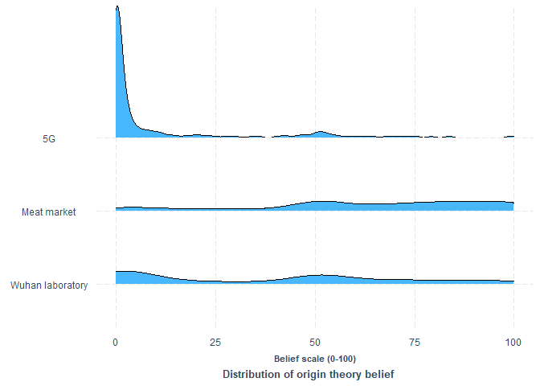
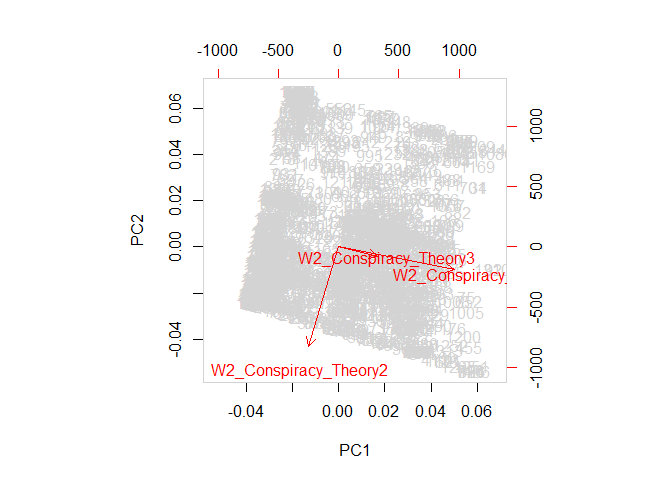
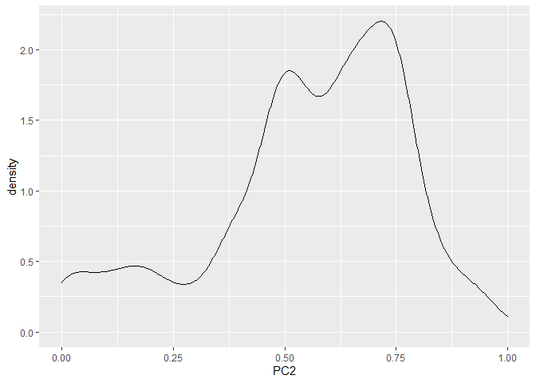
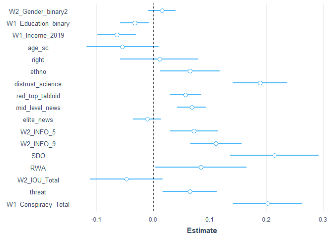
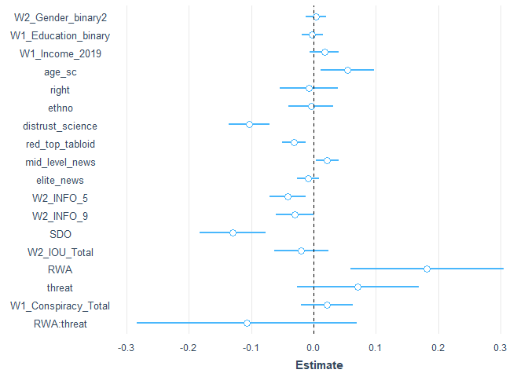

covid\_conspiracies\_markdown4
================
Michael Marshall
14/03/2021

## Loading Packages and Data

``` r
pacman::p_load(tidyverse, stringr, ggridges, forcats, labelled, leaps,
               psych, corrr, cowplot, expss, haven, interplot,
               interactions, jtools,labelled, pscl, psych, 
               sjPlot, skimr)

load("COVID W1_W2_W3 Cleaned 2878.RData") # needs to be in your wd
```

## Rescaling variable

``` r
## [rescale01] Function to rescale a variable from 0 to 1
rescale01 <- function(x, ...) {
  (x - min(x, ...)) / ((max(x, ...)) - min(x, ...))
}
```

## Summary and distribution of different COVID specific conspiracies

``` r
# plotting density of different covid conspiracies
df %>% 
  dplyr::select(W2_Conspiracy_Theory1:W2_Conspiracy_Theory5) %>% 
  gather(conspiracy_code, belief,
         W2_Conspiracy_Theory1:W2_Conspiracy_Theory5) %>%
  mutate(conspiracy_code = as.factor(conspiracy_code)) %>%
  filter(!conspiracy_code %in% c("W2_Conspiracy_Theory4",
                                 "W2_Conspiracy_Theory5")) %>% 
  ggplot(aes(x = belief, y = conspiracy_code, height = ..density..)) +
  geom_density_ridges(aes(rel_min_height = 0.005),
                      stat = "density",
                      fill = get_colors("CUD Bright",num.colors = 1)) +
  theme_nice() +
  scale_y_discrete(labels = c("Wuhan laboratory","Meat market","5G")) +
  labs(y = NULL, x = "Belief scale (0-100)",
       caption = "Distribution of origin theory belief") +
  theme(plot.caption = element_text(hjust = 0.61,
                                    face = "bold",
                                    size = 10),
        axis.title.x = element_text(size = 8,
                                    hjust = 0.5)
  )
```

<!-- -->

``` r
#pacman::p_load(patchwork)
df %>% 
  dplyr::select(W2_Conspiracy_Theory1:W2_Conspiracy_Theory5) %>% 
  gather(conspiracy_code, belief,
         W2_Conspiracy_Theory1:W2_Conspiracy_Theory5) %>%
  mutate(conspiracy_code = fct_recode(
    as.factor(conspiracy_code),
    "Wuhan laboratory" = "W2_Conspiracy_Theory1",
    "Meat market" = "W2_Conspiracy_Theory2",
    "5G" = "W2_Conspiracy_Theory3",
    "4" = "W2_Conspiracy_Theory4",
    "5" = "W2_Conspiracy_Theory5")
    ) %>%
  filter(!conspiracy_code %in% c("4","5")) %>% 
  mutate(
    order_var = ifelse(conspiracy_code == "Meat market", 1,
                       ifelse(conspiracy_code == "Wuhan laboratory",2,3))
  ) %>% 
  ggplot(aes(x = belief)) +
  geom_density(fill = get_colors("CUD Bright",num.colors = 1),
               alpha = 0.8) +
  theme_nice() +
  facet_wrap(~fct_reorder(conspiracy_code,order_var), 
             scales = "free_y", ncol = 1) +
  labs(y = "Density", 
       x = "Distribution of origin theory belief")
```

    ## Warning: attributes are not identical across measure variables;
    ## they will be dropped

    ## Warning: Removed 4416 rows containing non-finite values (stat_density).

<!-- -->

## Cleaning dataset

The following code filters down to just those observations that have
completed the battery of questions relating to COVID specific
conspiracies. It also creates a tibble counting the missing
observations, which can be useful to have as an object.

``` r
# filtering for completed dependent variable
conspiracies <- df %>% 
  filter(!is.na(W2_Conspiracy_Theory1) |
           !is.na(W2_Conspiracy_Theory2) |
           !is.na(W2_Conspiracy_Theory3) |
           !is.na(W2_Conspiracy_Theory3) |
           !is.na(W2_Conspiracy_Theory4) |
           !is.na(W2_Conspiracy_Theory5)) %>% 
  rename(W1_Housing_tenure = W1_Hosuing_tenure)

# function to count NAs
count_na <- function(x){
  sum(is.na(x))
}

conspiracies %>% 
  dplyr::select(W2_Conspiracy_Theory1:W2_Conspiracy_Theory5) %>% 
  map_int(count_na)
```

    ## W2_Conspiracy_Theory1 W2_Conspiracy_Theory2 W2_Conspiracy_Theory3 
    ##                     0                     0                     0 
    ## W2_Conspiracy_Theory4 W2_Conspiracy_Theory5 
    ##                     0                     0

``` r
missing <- tibble(
  variable = names(conspiracies),
  NAs = conspiracies %>% map_int(count_na)
)

#View(missing)
```

Due to some measurement error in original *W1\_Education\_binary*
variable, the code below overwrites the variable, and creates a dummy
for degree educated respondents (undergrad OR postgrad = 1).

``` r
conspiracies <- conspiracies %>% 
  mutate(
    W1_Education_binary = ifelse(
      W1_Education %in% c(5,7), 1, 0
    )
  )
count(conspiracies, W1_Education, W1_Education_binary)
```

    ## # A tibble: 8 x 3
    ##                  W1_Education W1_Education_binary     n
    ##                     <dbl+lbl>               <dbl> <int>
    ## 1 1 [No qualifications]                         0    47
    ## 2 2 [O-Level/GCSE or similar]                   0   263
    ## 3 3 [A-Level or similar]                        0   241
    ## 4 4 [Technical qualification]                   0   138
    ## 5 5 [Undergraduate degree]                      1   399
    ## 6 6 [Diploma]                                   0    76
    ## 7 7 [Postgraduate degree]                       1   225
    ## 8 8 [Other qualifications]                      0    17

The code below turns the *preferred newspaper* variables into dummy
variables, as they were previously coded as *1=Yes* and everything else
as *NA*.

``` r
# making preferred newspaper dummy variable (i.e. replacing NA with 0)
na_to_zero <- function(x){
  x[is.na(x)] <- 0
  x <- as.numeric(x)
  return(x)
} 

paper_vars <- rep(str_c("W2_Newspaper_prefer",seq(1,11,1)))

conspiracies[paper_vars] <- conspiracies[paper_vars] %>% 
  map_df(na_to_zero)

conspiracies <- conspiracies %>% 
  mutate(
    red_top_tabloid = ifelse(
      W2_Newspaper_prefer3 == 1 | W2_Newspaper_prefer2 == 1 |
        W2_Newspaper_prefer7 == 1 | W2_Newspaper_prefer8 == 1 |
        W2_Newspaper_prefer9 == 1, 1, 0),
    mid_level_news = ifelse(
      W2_Newspaper_prefer1 == 1 | W2_Newspaper_prefer4 == 1, 1, 0),
    elite_news = ifelse(
      W2_Newspaper_prefer5 == 1 | W2_Newspaper_prefer6 == 1 |
        W2_Newspaper_prefer10 == 1 | 
        W2_Newspaper_prefer11 == 1, 1, 0)
  )

conspiracies %>% 
  count(red_top_tabloid, mid_level_news, elite_news)
```

    ## # A tibble: 8 x 4
    ##   red_top_tabloid mid_level_news elite_news     n
    ##             <dbl>          <dbl>      <dbl> <int>
    ## 1               0              0          0   423
    ## 2               0              0          1   317
    ## 3               0              1          0   219
    ## 4               0              1          1    75
    ## 5               1              0          0   163
    ## 6               1              0          1    54
    ## 7               1              1          0    73
    ## 8               1              1          1    82

``` r
# Creating DVs
# [ethno] ethnocentrism
eth_keys <- list(ethno = cs(W2_Nationalism1,W2_Nationalism2))
eth_test <- scoreItems(eth_keys, conspiracies, min = 1, max = 5)
head(eth_test$scores)
```

    ##      ethno
    ## [1,]     4
    ## [2,]     4
    ## [3,]     4
    ## [4,]     3
    ## [5,]     3
    ## [6,]     3

``` r
eth_test$alpha  # Scale alpha
```

    ##           ethno
    ## alpha 0.8213221

``` r
conspiracies$ethno <- rescale01(eth_test$scores, na.rm = TRUE)
conspiracies$ethno <- c(conspiracies$ethno)  # Ensure variable is numeric and not matrix class
describe(conspiracies$ethno)
```

    ##    vars    n mean   sd median trimmed  mad min max range  skew kurtosis   se
    ## X1    1 1406 0.57 0.25   0.62    0.58 0.19   0   1     1 -0.33    -0.18 0.01

``` r
# Right wing authoritarianism
rwa_keys <- list(rwa = cs(W1_Authoritarianism1_R,
                          W1_Authoritarianism2,
                          W1_Authoritarianism3,
                          W1_Authoritarianism4_R, 
                          W1_Authoritarianism5_R,
                          W1_Authoritarianism6))

rwa_test <- scoreItems(rwa_keys, conspiracies, min = 1, max = 5)
head(rwa_test$scores)
```

    ##           rwa
    ## [1,] 2.833333
    ## [2,] 2.666667
    ## [3,] 3.166667
    ## [4,] 3.333333
    ## [5,] 3.000000
    ## [6,] 3.500000

``` r
summary(rwa_test$alpha)  # Scale alpha
```

    ##       rwa        
    ##  Min.   :0.6837  
    ##  1st Qu.:0.6837  
    ##  Median :0.6837  
    ##  Mean   :0.6837  
    ##  3rd Qu.:0.6837  
    ##  Max.   :0.6837

``` r
conspiracies$RWA <- rescale01(rwa_test$scores, na.rm = TRUE)
conspiracies$RWA <- c(conspiracies$RWA)  # Ensure variable is numeric and not matrix class

describe(conspiracies$RWA)
```

    ##    vars    n mean   sd median trimmed  mad min max range  skew kurtosis se
    ## X1    1 1406 0.51 0.17    0.5    0.52 0.12   0   1     1 -0.25      0.3  0

``` r
## [SDO] Social Dominance Orientation
sdo_keys <- list(sdo = cs(W1_Social_Dominance1,
                          W1_Social_Dominance2_R,
                          W1_Social_Dominance3_R,
                          W1_Social_Dominance4,
                          W1_Social_Dominance5_R,
                          W1_Social_Dominance6, 
                          W1_Social_Dominance7,
                          W1_Social_Dominance8_R))
sdo_test <- scoreItems(sdo_keys, conspiracies, min = 1, max = 5)
head(sdo_test$scores)
```

    ##        sdo
    ## [1,] 1.500
    ## [2,] 3.000
    ## [3,] 3.000
    ## [4,] 2.625
    ## [5,] 3.000
    ## [6,] 2.500

``` r
summary(sdo_test$alpha)  # Scale alpha
```

    ##       sdo        
    ##  Min.   :0.8404  
    ##  1st Qu.:0.8404  
    ##  Median :0.8404  
    ##  Mean   :0.8404  
    ##  3rd Qu.:0.8404  
    ##  Max.   :0.8404

``` r
conspiracies$SDO <- rescale01(sdo_test$scores, na.rm = TRUE)
conspiracies$SDO <- c(conspiracies$SDO)  # Ensure variable is numeric and not matrix class

summary(conspiracies$SDO)
```

    ##    Min. 1st Qu.  Median    Mean 3rd Qu.    Max. 
    ##  0.0000  0.2258  0.3871  0.3620  0.5161  1.0000

``` r
## [threat] Covid-19 related Threat
summary(conspiracies$W2_COVID19_anxiety)
```

    ##    Min. 1st Qu.  Median    Mean 3rd Qu.    Max. 
    ##    0.00   50.00   65.00   61.25   80.75  100.00

``` r
conspiracies$threat <- rescale01(conspiracies$W2_COVID19_anxiety)
conspiracies %>% 
  dplyr::select(W2_COVID19_anxiety, threat) %>%
  correlate()
```

    ## 
    ## Correlation method: 'pearson'
    ## Missing treated using: 'pairwise.complete.obs'

    ## # A tibble: 2 x 3
    ##   rowname            W2_COVID19_anxiety threat
    ##   <chr>                           <dbl>  <dbl>
    ## 1 W2_COVID19_anxiety                 NA      1
    ## 2 threat                              1     NA

``` r
## [right] Right-Wing political views
table(conspiracies$W1_Political_Scale)
```

    ## 
    ##   1   2   3   4   5   6   7   8   9  10 
    ##  35  44 116 143 488 221 182 102  36  39

``` r
conspiracies$right <- rescale01(conspiracies$W1_Political_Scale)
conspiracies %>% 
  dplyr::select(W1_Political_Scale, right) %>%
  correlate()
```

    ## 
    ## Correlation method: 'pearson'
    ## Missing treated using: 'pairwise.complete.obs'

    ## # A tibble: 2 x 3
    ##   rowname            W1_Political_Scale right
    ##   <chr>                           <dbl> <dbl>
    ## 1 W1_Political_Scale                 NA     1
    ## 2 right                               1    NA

``` r
## [soc.con] Social conservatism
table(conspiracies$W1_Political_Abortion_SSM)
```

    ## 
    ##   1   2   3   4   5   6   7   8   9  10 
    ## 262 123 175 129 330 124 109  67  31  56

``` r
conspiracies$soc_con <- rescale01(
  conspiracies$W1_Political_Abortion_SSM)
conspiracies %>% 
  dplyr::select(W1_Political_Abortion_SSM, soc_con) %>%
  correlate()
```

    ## 
    ## Correlation method: 'pearson'
    ## Missing treated using: 'pairwise.complete.obs'

    ## # A tibble: 2 x 3
    ##   rowname                   W1_Political_Abortion_SSM soc_con
    ##   <chr>                                         <dbl>   <dbl>
    ## 1 W1_Political_Abortion_SSM                        NA       1
    ## 2 soc_con                                           1      NA

``` r
## [fis.con] Fiscal conservatism
table(conspiracies$W1_Political_Fiscal)
```

    ## 
    ##   1   2   3   4   5   6   7   8   9  10 
    ##  55  43 112 133 430 201 226 121  39  46

``` r
conspiracies$fis_con <- rescale01(conspiracies$W1_Political_Fiscal)
conspiracies %>% 
  dplyr::select(W1_Political_Fiscal, fis_con) %>%
  correlate()
```

    ## 
    ## Correlation method: 'pearson'
    ## Missing treated using: 'pairwise.complete.obs'

    ## # A tibble: 2 x 3
    ##   rowname             W1_Political_Fiscal fis_con
    ##   <chr>                             <dbl>   <dbl>
    ## 1 W1_Political_Fiscal                  NA       1
    ## 2 fis_con                               1      NA

``` r
## [age.c] Age (in years)
summary(conspiracies$W2_Age_year)
```

    ##    Min. 1st Qu.  Median    Mean 3rd Qu.    Max. 
    ##   18.00   37.00   50.00   49.32   61.00   88.00

``` r
conspiracies$age_sc <- rescale01(conspiracies$W2_Age_year)
```

``` r
# conspiracy ideation
consp_keys <- list(consp = cs(W1_Conspiracy_1,
                          W1_Conspiracy_2,
                          W1_Conspiracy_3,
                          W1_Conspiracy_4,
                          W1_Conspiracy_5))
consp_test <- scoreItems(consp_keys, conspiracies, min = 1, max = 11)
```

    ## Number of categories should be increased  in order to count frequencies.

``` r
head(consp_test$scores)
```

    ##      consp
    ## [1,]   5.8
    ## [2,]   9.0
    ## [3,]   7.0
    ## [4,]   8.6
    ## [5,]   6.0
    ## [6,]   8.8

``` r
consp_test$alpha  # Scale alpha
```

    ##           consp
    ## alpha 0.8537269

``` r
cor(consp_test$scores, conspiracies$W1_Conspiracy_Total)
```

    ##       [,1]
    ## consp    1

``` r
mean(
  round(rescale01(consp_test$scores, na.rm = T), 4) ==
    round(rescale01(conspiracies$W1_Conspiracy_Total, na.rm = T), 4)
) # scale is equal to pre-existing variable in dataset
```

    ## [1] 1

``` r
# intolerance of uncertainty
iou_keys <- list(iou = cs(W2_IOU1, W2_IOU2,W2_IOU3, W2_IOU4,
                          W2_IOU5, W2_IOU5,W2_IOU6,W2_IOU7,
                          W2_IOU7,W2_IOU8,W2_IOU9,W2_IOU10,
                          W2_IOU11,W2_IOU12))
iou_test <- scoreItems(iou_keys, conspiracies, min = 1, max = 5)
head(iou_test$scores)
```

    ##           iou
    ## [1,] 3.416667
    ## [2,] 3.916667
    ## [3,] 4.250000
    ## [4,] 3.083333
    ## [5,] 3.000000
    ## [6,] 2.500000

``` r
iou_test$alpha  # Scale alpha
```

    ##             iou
    ## alpha 0.9097412

``` r
cor(iou_test$scores, conspiracies$W2_IOU_Total)
```

    ##     [,1]
    ## iou    1

``` r
mean(
  round(rescale01(iou_test$scores, na.rm = T), 4) ==
    round(rescale01(conspiracies$W2_IOU_Total, na.rm = T), 4)
) # scale is equal to pre-existing variable in dataset
```

    ## [1] 1

``` r
factors <- c("W1_Ethnicity",
             "W2_Gender_binary")
```

``` r
# turning to factors
conspiracies[factors] <- conspiracies[factors] %>% 
  map_df(as.factor)
```

``` r
# renaming trust in science
conspiracies <- conspiracies %>% 
  rename(distrust_science = W2_Trust_Body6)
```

``` r
# rescaling the remaing numeric variables
numerics <- c("W1_Conspiracy_Total","W2_IOU_Total", "W2_INFO_5",
              "W2_INFO_9","distrust_science","W1_Income_2019")

conspiracies[numerics] <- conspiracies[numerics] %>% 
  map_df(rescale01, na.rm = TRUE)
```

``` r
# creating scaled versions of each conspiracy belief
conspiracies$conspiracy1_sc <- rescale01(
  conspiracies$W2_Conspiracy_Theory1, na.rm = TRUE
)

conspiracies$conspiracy2_sc <- rescale01(
  conspiracies$W2_Conspiracy_Theory2, na.rm = TRUE
)

conspiracies$conspiracy3_sc <- rescale01(
  conspiracies$W2_Conspiracy_Theory3, na.rm = TRUE
)

conspiracies$conspiracy4_sc <- rescale01(
  conspiracies$W2_Conspiracy_Theory4, na.rm = TRUE
)

conspiracies$conspiracy5_sc <- rescale01(
  conspiracies$W2_Conspiracy_Theory5, na.rm = TRUE
)
```

## Distribution of variables

A for loop to look at distribution of potential independent variables
(numeric only).

``` r
plot_vars <- conspiracies %>% 
  dplyr::select(
    one_of(numerics),ethno,RWA,SDO,threat,right,soc_con,fis_con
    ) %>%
  names()

for(i in seq_along(plot_vars)){
  
  x1 <- conspiracies[plot_vars][i] %>% as_vector()
  
  print(
    ggplot(data = NULL, aes(x = x1)) +
      geom_vline(aes(xintercept = mean(x1, na.rm =TRUE)), 
                 colour = "black",
                 linetype = "dashed") +
      geom_vline(aes(xintercept = median(x1, na.rm =TRUE)), 
                 colour = "red",
                 linetype = "dashed") +
      geom_density(fill = "lightblue", alpha = 0.7) +
      labs(x = plot_vars[i],
           caption = "Black = Mean, Red = Median")  
  )
  
}
```

<!-- --><!-- --><!-- --><!-- -->

    ## Warning: Removed 4 rows containing non-finite values (stat_density).

<!-- --><!-- --><!-- --><!-- --><!-- --><!-- --><!-- --><!-- --><!-- -->

## PCA

``` r
pca_df <- conspiracies %>% 
  dplyr::select(W2_Conspiracy_Theory1:W2_Conspiracy_Theory3)

pca_fit <- prcomp(pca_df,scale = TRUE)

biplot(pca_fit,
       col = c("lightgrey","red"))
```

<!-- -->

``` r
pca_fit$rotation
```

    ##                              PC1        PC2        PC3
    ## W2_Conspiracy_Theory1  0.6925726 -0.1003290  0.7143369
    ## W2_Conspiracy_Theory2 -0.2646508 -0.9565657  0.1222372
    ## W2_Conspiracy_Theory3  0.6710463 -0.2737080 -0.6890434

``` r
components <- pca_fit$x[,1:3] %>% as.tibble()
```

    ## Warning: `as.tibble()` is deprecated as of tibble 2.0.0.
    ## Please use `as_tibble()` instead.
    ## The signature and semantics have changed, see `?as_tibble`.
    ## This warning is displayed once every 8 hours.
    ## Call `lifecycle::last_warnings()` to see where this warning was generated.

Principal components are as follows:

  - PC1 = belief in Wuhan lab and 5G conspiracies  
  - PC2 = disbelief in all three origin theories, but especially strong
    disbelief in meat market theory  
  - PC3 = belief in meat market but not 5G

<!-- end list -->

``` r
pc <- cbind(conspiracies,components)
pc$PC2 <- 0 - pc$PC2

princ_comps <- c("PC1","PC2","PC3")
pc[princ_comps] <- pc[princ_comps] %>% 
  map_df(rescale01, na.rm = TRUE)

pc %>% 
  ggplot(aes(x = PC1)) +
  geom_density()
```

<!-- -->

``` r
pc %>% 
  ggplot(aes(x = PC2)) +
  geom_density()
```

<!-- -->

``` r
pc %>% 
  ggplot(aes(x = PC3)) +
  geom_density()
```

<!-- -->

## Modelling for belief in PC1

``` r
pc1_full <- lm(PC1 ~ 
                  #socio-economic variables
                  W2_Gender_binary +
                  W1_Education_binary +
                  W1_Income_2019 +
                  age_sc +
                  
                  #political and media variables
                  right +
                  ethno +
                  distrust_science + 
                  red_top_tabloid + 
                  mid_level_news + 
                  elite_news +
                  W2_INFO_5 + #social media
                  W2_INFO_9 + #family and friends
                  
                  #political-psychology variables
                  SDO +
                  RWA +
                  W2_IOU_Total +
                  
                  #covid-anxiety
                  threat +
                  
                  #conspiracies
                  W1_Conspiracy_Total,
                 data = pc)

par(mfrow = c(2,2))
plot(pc1_full)
```

<!-- -->

``` r
summ(pc1_full, vifs = T)
```

    ## MODEL INFO:
    ## Observations: 1399 (7 missing obs. deleted)
    ## Dependent Variable: PC1
    ## Type: OLS linear regression 
    ## 
    ## MODEL FIT:
    ## F(17,1381) = 36.43, p = 0.00
    ## R² = 0.31
    ## Adj. R² = 0.30 
    ## 
    ## Standard errors: OLS
    ## ---------------------------------------------------------------
    ##                              Est.   S.E.   t val.      p    VIF
    ## ------------------------- ------- ------ -------- ------ ------
    ## (Intercept)                 -0.03   0.03    -0.87   0.39       
    ## W2_Gender_binary2            0.01   0.01     0.98   0.33   1.09
    ## W1_Education_binary         -0.02   0.01    -2.19   0.03   1.20
    ## W1_Income_2019              -0.06   0.01    -4.25   0.00   1.13
    ## age_sc                      -0.07   0.03    -2.69   0.01   1.39
    ## right                        0.01   0.03     0.39   0.69   1.49
    ## ethno                        0.05   0.02     2.16   0.03   1.30
    ## distrust_science             0.19   0.02    10.01   0.00   1.11
    ## red_top_tabloid              0.06   0.01     5.28   0.00   1.09
    ## mid_level_news               0.04   0.01     3.67   0.00   1.13
    ## elite_news                  -0.00   0.01    -0.47   0.64   1.14
    ## W2_INFO_5                    0.07   0.02     4.38   0.00   1.39
    ## W2_INFO_9                    0.10   0.02     5.39   0.00   1.24
    ## SDO                          0.22   0.03     7.11   0.00   1.48
    ## RWA                          0.01   0.03     0.17   0.86   1.42
    ## W2_IOU_Total                -0.03   0.03    -1.14   0.25   1.22
    ## threat                       0.04   0.02     1.91   0.06   1.14
    ## W1_Conspiracy_Total          0.14   0.02     5.67   0.00   1.10
    ## ---------------------------------------------------------------

``` r
plot_coefs(pc1_full)
```

    ## Loading required namespace: broom.mixed

    ## Registered S3 method overwritten by 'broom.mixed':
    ##   method      from 
    ##   tidy.gamlss broom

<!-- -->

## Modelling for belief in PC3

``` r
pc3_full <- lm(PC3 ~ 
                   #socio-economic variables
                   W2_Gender_binary +
                   W1_Education_binary +
                   W1_Income_2019 +
                   age_sc +
                   
                   #political and media variables
                   right +
                   ethno +
                   distrust_science + 
                   red_top_tabloid + 
                   mid_level_news + 
                   elite_news +
                   W2_INFO_5 + #social media
                   W2_INFO_9 + #family and friends
                   
                   #political-psychology variables
                   SDO +
                   RWA +
                   W2_IOU_Total +
                   
                   #covid-anxiety
                   threat +
                   
                   #conspiracies
                   W1_Conspiracy_Total,
                 data = pc)

par(mfrow = c(2,2))
plot(pc3_full)
```

<!-- -->

``` r
summ(pc3_full, vifs = T)
```

    ## MODEL INFO:
    ## Observations: 1399 (7 missing obs. deleted)
    ## Dependent Variable: PC3
    ## Type: OLS linear regression 
    ## 
    ## MODEL FIT:
    ## F(17,1381) = 7.83, p = 0.00
    ## R² = 0.09
    ## Adj. R² = 0.08 
    ## 
    ## Standard errors: OLS
    ## ---------------------------------------------------------------
    ##                              Est.   S.E.   t val.      p    VIF
    ## ------------------------- ------- ------ -------- ------ ------
    ## (Intercept)                  0.55   0.03    21.74   0.00       
    ## W2_Gender_binary2            0.01   0.01     0.85   0.39   1.09
    ## W1_Education_binary         -0.01   0.01    -1.64   0.10   1.20
    ## W1_Income_2019               0.01   0.01     0.54   0.59   1.13
    ## age_sc                       0.04   0.02     1.80   0.07   1.39
    ## right                        0.00   0.02     0.04   0.97   1.49
    ## ethno                        0.03   0.02     1.70   0.09   1.30
    ## distrust_science            -0.05   0.02    -3.33   0.00   1.11
    ## red_top_tabloid             -0.01   0.01    -1.30   0.19   1.09
    ## mid_level_news               0.04   0.01     4.30   0.00   1.13
    ## elite_news                  -0.01   0.01    -0.89   0.37   1.14
    ## W2_INFO_5                   -0.02   0.01    -1.34   0.18   1.39
    ## W2_INFO_9                    0.00   0.01     0.00   1.00   1.24
    ## SDO                         -0.06   0.03    -2.17   0.03   1.48
    ## RWA                          0.11   0.03     4.20   0.00   1.42
    ## W2_IOU_Total                -0.01   0.02    -0.59   0.56   1.22
    ## threat                       0.04   0.02     2.72   0.01   1.14
    ## W1_Conspiracy_Total          0.07   0.02     3.44   0.00   1.10
    ## ---------------------------------------------------------------

``` r
plot_coefs(pc3_full)
```

<!-- -->

## Interaction model

``` r
pc3_int <- lm(PC3 ~ 
                   #socio-economic variables
                   W2_Gender_binary +
                   W1_Education_binary +
                   W1_Income_2019 +
                   age_sc +
                   
                   #political and media variables
                   right +
                   ethno +
                   distrust_science + 
                   red_top_tabloid + 
                   mid_level_news + 
                   elite_news +
                   W2_INFO_5 + #social media
                   W2_INFO_9 + #family and friends
                   
                   #political-psychology variables
                   SDO +
                   #RWA +
                   W2_IOU_Total +
                   
                   # RWA and covid-anxiety interaction
                   (RWA*threat) +
                   
                   #conspiracies
                   W1_Conspiracy_Total,
                 data = pc)

par(mfrow = c(2,2))
plot(pc3_int)
```

<!-- -->

``` r
summ(pc3_int, vifs = TRUE)
```

    ## MODEL INFO:
    ## Observations: 1399 (7 missing obs. deleted)
    ## Dependent Variable: PC3
    ## Type: OLS linear regression 
    ## 
    ## MODEL FIT:
    ## F(18,1380) = 7.43, p = 0.00
    ## R² = 0.09
    ## Adj. R² = 0.08 
    ## 
    ## Standard errors: OLS
    ## ----------------------------------------------------------------
    ##                              Est.   S.E.   t val.      p     VIF
    ## ------------------------- ------- ------ -------- ------ -------
    ## (Intercept)                  0.53   0.04    14.24   0.00        
    ## W2_Gender_binary2            0.01   0.01     0.88   0.38    1.09
    ## W1_Education_binary         -0.01   0.01    -1.64   0.10    1.20
    ## W1_Income_2019               0.01   0.01     0.52   0.60    1.13
    ## age_sc                       0.04   0.02     1.82   0.07    1.40
    ## right                        0.00   0.02     0.06   0.95    1.49
    ## ethno                        0.03   0.02     1.70   0.09    1.30
    ## distrust_science            -0.05   0.02    -3.30   0.00    1.11
    ## red_top_tabloid             -0.01   0.01    -1.32   0.19    1.09
    ## mid_level_news               0.04   0.01     4.25   0.00    1.13
    ## elite_news                  -0.01   0.01    -0.93   0.35    1.15
    ## W2_INFO_5                   -0.02   0.01    -1.37   0.17    1.39
    ## W2_INFO_9                    0.00   0.01     0.05   0.96    1.24
    ## SDO                         -0.06   0.03    -2.19   0.03    1.48
    ## W2_IOU_Total                -0.01   0.02    -0.61   0.54    1.22
    ## RWA                          0.15   0.06     2.58   0.01    7.12
    ## threat                       0.08   0.05     1.65   0.10   10.31
    ## W1_Conspiracy_Total          0.07   0.02     3.43   0.00    1.10
    ## RWA:threat                  -0.07   0.09    -0.78   0.43   17.08
    ## ----------------------------------------------------------------

``` r
plot_coefs(pc3_int)
```

<!-- -->

## IHS model

``` r
# functions for IHS transformation
ihs <- function(x, theta){  # IHS transformation
  asinh(theta * x)/theta
}

ihs_loglik <- function(theta,x){
  
  ihs <- function(x, theta){  # function to IHS transform
    asinh(theta * x)/theta
  }
  
  n <- length(x)
  xt <- ihs(x, theta)
  
  log_lik <- -n*log(sum((xt - mean(xt))^2))- sum(log(1+theta^2*x^2))
  return(log_lik)
}     
```

``` r
best_theta <- optimize(ihs_loglik, 
                       lower = 0.00001, upper = 1e+06,
                       x = pc$PC1, 
                       maximum = TRUE)$maximum
best_theta # continues to rise indefinitely
```

    ## [1] 9.297805

``` r
pc$PC1_ihs <- ihs(pc$PC1, best_theta)

pc %>% 
  ggplot(aes(x = PC1)) +
  geom_density()
```

<!-- -->

``` r
pc %>% 
  ggplot(aes(x = PC1_ihs)) +
  geom_density()
```

<!-- -->

``` r
pc1_ihs <- lm(PC1_ihs ~ 
                  #socio-economic variables
                  W2_Gender_binary +
                  W1_Education_binary +
                  W1_Income_2019 +
                  age_sc +
                  
                  #political and media variables
                  right +
                  ethno +
                  distrust_science + 
                  red_top_tabloid + 
                  mid_level_news + 
                  elite_news +
                  W2_INFO_5 + #social media
                  W2_INFO_9 + #family and friends
                  
                  #political-psychology variables
                  SDO +
                  RWA +
                  W2_IOU_Total +
                  
                  #covid-anxiety
                  threat +
                  
                  #conspiracies
                  W1_Conspiracy_Total,
                 data = pc)

par(mfrow = c(2,2))
plot(pc1_ihs)
```

<!-- -->

``` r
summ(pc1_ihs, vifs = T)
```

    ## MODEL INFO:
    ## Observations: 1399 (7 missing obs. deleted)
    ## Dependent Variable: PC1_ihs
    ## Type: OLS linear regression 
    ## 
    ## MODEL FIT:
    ## F(17,1381) = 32.59, p = 0.00
    ## R² = 0.29
    ## Adj. R² = 0.28 
    ## 
    ## Standard errors: OLS
    ## ---------------------------------------------------------------
    ##                              Est.   S.E.   t val.      p    VIF
    ## ------------------------- ------- ------ -------- ------ ------
    ## (Intercept)                  0.04   0.01     3.07   0.00       
    ## W2_Gender_binary2            0.01   0.00     1.30   0.19   1.09
    ## W1_Education_binary         -0.01   0.00    -2.13   0.03   1.20
    ## W1_Income_2019              -0.02   0.01    -4.27   0.00   1.13
    ## age_sc                      -0.03   0.01    -2.49   0.01   1.39
    ## right                       -0.00   0.01    -0.13   0.90   1.49
    ## ethno                        0.01   0.01     1.72   0.09   1.30
    ## distrust_science             0.07   0.01     9.41   0.00   1.11
    ## red_top_tabloid              0.02   0.00     4.57   0.00   1.09
    ## mid_level_news               0.02   0.00     4.45   0.00   1.13
    ## elite_news                  -0.01   0.00    -1.41   0.16   1.14
    ## W2_INFO_5                    0.02   0.01     3.38   0.00   1.39
    ## W2_INFO_9                    0.04   0.01     5.17   0.00   1.24
    ## SDO                          0.08   0.01     6.40   0.00   1.48
    ## RWA                          0.02   0.01     1.43   0.15   1.42
    ## W2_IOU_Total                -0.02   0.01    -1.60   0.11   1.22
    ## threat                       0.01   0.01     1.79   0.07   1.14
    ## W1_Conspiracy_Total          0.05   0.01     5.18   0.00   1.10
    ## ---------------------------------------------------------------

``` r
plot_coefs(pc1_ihs)
```

<!-- -->

``` r
coef(pc1_ihs)
```

    ##         (Intercept)   W2_Gender_binary2 W1_Education_binary      W1_Income_2019 
    ##         0.038745792         0.005124018        -0.008846750        -0.023868112 
    ##              age_sc               right               ethno    distrust_science 
    ##        -0.025893935        -0.001431929         0.014852893         0.074773642 
    ##     red_top_tabloid      mid_level_news          elite_news           W2_INFO_5 
    ##         0.020356122         0.019082071        -0.005880048         0.023472011 
    ##           W2_INFO_9                 SDO                 RWA        W2_IOU_Total 
    ##         0.038306346         0.081887332         0.018998310        -0.016816752 
    ##              threat W1_Conspiracy_Total 
    ##         0.014004705         0.051650484

## Social distancing

``` r
## making a dataset of variables included in the models above
## plus DV's for social distancing and vaccination

vars <- model.matrix(pc1_full)[,-1] %>% as.data.frame() %>% names()
vars <- c(vars,"PC1","PC2","PC3","pid")
vars[1] <- str_sub(vars[1],1,str_length(vars[1])-1)
#vars[2] <- str_sub(vars[2],1,str_length(vars[2])-1)

public <- merge(
  pc %>% dplyr::select(one_of(vars)) %>% na.omit(),
  conspiracies %>% dplyr::select(pid,W2_SocialDistance10,
                                 W2_SocialDistance11,
                                 W2_SocialDistance12,
                                 W2_SocialDistance14,
                                 W2_C19_Vax_Self,
                                 W2_C19_Vax_Child),
  by = "pid", all.x = TRUE
)
```

``` r
# social distance scale
sd_keys <- list(sd = cs(W2_SocialDistance10,
                        W2_SocialDistance11,
                        W2_SocialDistance12,
                        W2_SocialDistance14))

sd_test <- scoreItems(sd_keys, public, min = 1, max = 5)
head(sd_test$scores)
```

    ##        sd
    ## [1,] 5.00
    ## [2,] 3.25
    ## [3,] 4.00
    ## [4,] 4.75
    ## [5,] 3.00
    ## [6,] 3.75

``` r
summary(sd_test$alpha)  # Scale alpha
```

    ##        sd        
    ##  Min.   :0.8735  
    ##  1st Qu.:0.8735  
    ##  Median :0.8735  
    ##  Mean   :0.8735  
    ##  3rd Qu.:0.8735  
    ##  Max.   :0.8735

``` r
public$social_distance <- rescale01(sd_test$scores, na.rm = TRUE)
public$social_distance <- c(public$social_distance)  # Ensure variable is numeric and not matrix class

describe(public$social_distance)
```

    ##    vars    n mean   sd median trimmed  mad min max range  skew kurtosis se
    ## X1    1 1399 0.82 0.19   0.88    0.85 0.19   0   1     1 -1.05     1.17  0

``` r
ggplot(public, aes(x = social_distance)) +
  geom_histogram(aes(y = ..density..),
                 binwidth = 0.1, colour = "black", fill = "lightblue") +
  geom_density()
```

<!-- -->

``` r
dist_full <- lm(social_distance ~ 
                  #socio-economic variables
                  W2_Gender_binary +
                  W1_Education_binary +
                  W1_Income_2019 +
                  age_sc +
                  
                  #political and media variables
                  right +
                  ethno +
                  distrust_science + 
                  red_top_tabloid + 
                  mid_level_news + 
                  elite_news +
                  W2_INFO_5 + #social media
                  W2_INFO_9 + #family and friends
                  
                  #political-psychology variables
                  SDO +
                  RWA +
                  W2_IOU_Total +
                  
                  #covid-anxiety
                  threat +
                 
                  #conspiracies
                  W1_Conspiracy_Total +
                  PC1 +
                  PC2 +
                  PC3,
                data = public)
summ(dist_full, vifs = T)
```

    ## MODEL INFO:
    ## Observations: 1399
    ## Dependent Variable: social_distance
    ## Type: OLS linear regression 
    ## 
    ## MODEL FIT:
    ## F(20,1378) = 24.97, p = 0.00
    ## R² = 0.27
    ## Adj. R² = 0.26 
    ## 
    ## Standard errors: OLS
    ## ---------------------------------------------------------------
    ##                              Est.   S.E.   t val.      p    VIF
    ## ------------------------- ------- ------ -------- ------ ------
    ## (Intercept)                  0.60   0.03    17.90   0.00       
    ## W2_Gender_binary2            0.04   0.01     4.02   0.00   1.09
    ## W1_Education_binary          0.00   0.01     0.42   0.68   1.22
    ## W1_Income_2019               0.03   0.01     1.99   0.05   1.15
    ## age_sc                       0.17   0.02     7.26   0.00   1.41
    ## right                        0.02   0.03     0.72   0.47   1.49
    ## ethno                        0.03   0.02     1.37   0.17   1.34
    ## distrust_science            -0.15   0.02    -7.98   0.00   1.20
    ## red_top_tabloid             -0.01   0.01    -0.83   0.40   1.12
    ## mid_level_news               0.00   0.01     0.14   0.89   1.15
    ## elite_news                   0.01   0.01     1.20   0.23   1.14
    ## W2_INFO_5                   -0.01   0.02    -0.92   0.36   1.41
    ## W2_INFO_9                    0.06   0.02     3.37   0.00   1.27
    ## SDO                         -0.21   0.03    -7.23   0.00   1.54
    ## RWA                          0.12   0.03     3.96   0.00   1.44
    ## W2_IOU_Total                 0.02   0.02     0.67   0.51   1.23
    ## threat                       0.02   0.02     1.37   0.17   1.17
    ## W1_Conspiracy_Total          0.05   0.02     1.99   0.05   1.13
    ## PC1                         -0.14   0.03    -5.46   0.00   1.46
    ## PC2                          0.05   0.02     2.27   0.02   1.10
    ## PC3                          0.14   0.03     4.61   0.00   1.10
    ## ---------------------------------------------------------------

``` r
par(mfrow = c(2,2))
plot(dist_full)
```

<!-- -->

``` r
plot_coefs(dist_full)
```

<!-- -->

## Multinomial model for vaccine acceptance

``` r
pacman::p_load(nnet)

# multinomial model
vax_full <- multinom(W2_C19_Vax_Self ~ 
                  #socio-economic variables
                  W2_Gender_binary +
                  W1_Education_binary +
                  W1_Income_2019 +
                  age_sc +
                  
                  #political and media variables
                  right +
                  ethno +
                  distrust_science + 
                  red_top_tabloid + 
                  mid_level_news + 
                  elite_news +
                  W2_INFO_5 + #social media
                  W2_INFO_9 + #family and friends
                  
                  #political-psychology variables
                  SDO +
                  RWA +
                  W2_IOU_Total +
                  
                  #covid-anxiety
                  threat +
                 
                  #conspiracies
                  W1_Conspiracy_Total +
                  PC1 +
                  PC2 +
                  PC3,
                data = public)
```

    ## # weights:  66 (42 variable)
    ## initial  value 1527.071081 
    ## iter  10 value 1010.755681
    ## iter  20 value 986.373263
    ## iter  30 value 985.334894
    ## iter  40 value 985.328574
    ## final  value 985.328560 
    ## converged

``` r
# functions to inspect multinom
z_score <- function(model){
  z <- summary(model)$coefficients/summary(model)$standard.errors
  return(z)
}

p_value <- function(model){
  z <- z_score(model)
  p <- (1 - pnorm(abs(z), 0, 1)) * 2
  return(p)
}
```

``` r
p_value(vax_full)
```

    ##   (Intercept) W2_Gender_binary2 W1_Education_binary W1_Income_2019       age_sc
    ## 2   0.1001782        0.34134953           0.5271656   0.2269016772 3.408978e-06
    ## 3   0.7438046        0.07237896           0.5375818   0.0003229641 1.722901e-03
    ##       right      ethno distrust_science red_top_tabloid mid_level_news
    ## 2 0.7961216 0.09953451     4.443083e-09       0.3497124      0.4400723
    ## 3 0.1139616 0.07245597     1.205801e-03       0.4187590      0.5652486
    ##   elite_news W2_INFO_5 W2_INFO_9       SDO       RWA W2_IOU_Total       threat
    ## 2  0.7774440 0.3496546 0.4833810 0.4536572 0.1880197    0.4720002 5.465262e-05
    ## 3  0.1734472 0.4265736 0.8861823 0.3215145 0.1579246    0.2856178 3.308624e-06
    ##   W1_Conspiracy_Total          PC1        PC2       PC3
    ## 2          0.77018491 8.095648e-09 0.27976725 0.3258814
    ## 3          0.05680113 4.383753e-01 0.06958108 0.9245713

``` r
# table for plot of unstandardised coefficients
vax_vars <- c("distrust_science","threat","age_sc","W1_Income_2019",
              "RWA","SDO","PC1","PC2",
               "PC3","W1_Conspiracy_Total")

#vax_plots <- full_list[full_list %in% vax_vars]
#vax_plots <- vax_plots[sort(names(vax_plots))]

tidies <- tidy(vax_full) %>%
  filter(term %in% vax_vars) %>% 
  mutate(
    odds_ratio = exp(estimate),
    conf.low = estimate - std.error * qnorm(0.975),
    conf.high = estimate + std.error * qnorm(0.975),
    conf.low.exp = exp(estimate - std.error * qnorm(0.975)),
    conf.high.exp = exp(estimate + std.error * qnorm(0.975)),
    y.level = fct_recode(as.factor(y.level),
                         "No" = "2",
                         "Maybe" = "3")#,
    #term = fct_rev(fct_drop(fct_relevel(term, vax_plots))),
    #group_facet = ifelse(term %in% dispositions, 
    #                     "Dispositions",
    #                     ifelse(term %in% conspiracy, "Conspiracy",
    #                                   "Controls")),
    #term = fct_recode(term,
    #                  "Age" = "age_sc",
    #                  "Income" = "W1_Income_2019",
    #                  "COVID-19 anxiety" = "threat",
    #                  "Distrust scientists" = "distrust_science",
    #                  "RWA" = "RWA",
    #                  "SDO" = "SDO",
    #                  "Conspiracy ideation" = "W1_Conspiracy_Total",
    #                  "Meat market belief" = "conspiracy2_sc",
    #                  "Wuhan lab belief" = "conspiracy1_sc",
    #                 "5G belief" = "conspiracy3_sc")
  ) %>%
  rename(Level = y.level)  

# plotting beta coefficients
ggplot(data = tidies, 
       aes(y = term, 
           x = estimate, xmin = conf.low,
           xmax = conf.high, colour = Level)) + 
  geom_vline(xintercept = 0, linetype = 2, size = .25) +
  ggstance::geom_linerangeh(
    aes(y = term, xmin = conf.low,
        xmax = conf.high, colour = Level),
    position = ggstance::position_dodgev(height = 0.62), size = 0.8) +
  geom_point(
    aes(y = term, 
        x = estimate, colour = Level, shape = Level),
    position = ggstance::position_dodgev(height = 0.62),
    fill = "white", size = 3, stroke = 1, show.legend = TRUE) +
  scale_colour_manual(values = get_colors("CUD Bright",num.colors = 2)) +
  theme_nice(legend.pos = "right") +
  scale_shape_manual(values = c(21,22)) +
  drop_y_gridlines() +
  #facet_wrap(~group_facet, ncol = 1, scales = "free_y",
  #           strip.position = "left") +
  theme(axis.title.y = element_blank(),
        legend.margin=margin(t = 0, b = 0, unit='cm'),
        axis.title.x = element_text(size = 10),
        axis.text.y = element_text(size = 10,
                                   hjust = 1),
        panel.grid.major.x = element_line(linetype = "solid"),
  #      strip.text.x = element_text(size = 8),
        legend.position = "top",
        plot.caption = element_text(hjust = 0)) +
  labs(
    x = "Coefficient estimate: Vaccine acceptance",
    caption = "Note: Multinomial logit estimated using maximum likelihood.\nUnstardised coefficients and 95% confidence intervals presented. Numerical predictors scaled 0-1."
  ) 
```

<!-- -->

Below is a plot of the average marginal effects for key variables.

``` r
pacman::p_load(margins)

# average marginal effect for "No", with bootstrap for variance
set.seed(123)
margin_no <- margins_summary(
  vax_full, category = "2",
  vce = "bootstrap"
)

# average marginal effect for "Maybe", with bootstrap for variance
set.seed(123)
margin_maybe <- margins_summary(
  vax_full, category = "3",
  vce = "bootstrap"
)
```

``` r
# plotting average marginal effect
rbind(
  margin_no %>% as_tibble() %>% mutate(level = "No"),
  margin_maybe %>% as_tibble() %>% mutate(level = "Maybe")
) %>% 
  rename(term = factor) %>% 
  filter(term %in% vax_vars) %>%
  #mutate(
    #term = fct_rev(fct_drop(fct_relevel(term, vax_plots))),
    #group_facet = ifelse(term %in% dispositions, 
    #                     "Dispositions",
    #                     ifelse(term %in% conspiracy, "Conspiracy",
    #                                   "Controls")),
    #term = fct_recode(term,
    #                  "Age" = "age_sc",
    #                  "Income" = "W1_Income_2019",
    #                  "COVID-19 anxiety" = "threat",
    #                  "Distrust scientists" = "distrust_science",
    #                  "RWA" = "RWA",
    #                  "SDO" = "SDO",
    #                  "Conspiracy ideation" = "W1_Conspiracy_Total",
    #                  "Meat market belief" = "conspiracy2_sc",
    #                  "Wuhan lab belief" = "conspiracy1_sc",
    #                  "5G belief" = "conspiracy3_sc")
  #) %>% 
  ggplot(aes(y = term, 
           x = AME, xmin = lower,
           xmax = upper, colour = level)) + 
  geom_vline(xintercept = 0, linetype = 2, size = .25) +
  ggstance::geom_linerangeh(
    aes(y = term, xmin = lower,
        xmax = upper, colour = level),
    position = ggstance::position_dodgev(height = 0.62), size = 0.8) +
  geom_point(
    aes(y = term, 
        x = AME, colour = level, shape = level),
    position = ggstance::position_dodgev(height = 0.62),
    fill = "white", size = 3, stroke = 1, show.legend = TRUE) +
  scale_colour_manual(values = get_colors("CUD Bright",num.colors = 2)) +
  theme_nice(legend.pos = "right") +
  scale_shape_manual(values = c(21,22)) +
  drop_y_gridlines() +
  #facet_wrap(~group_facet, ncol = 1, scales = "free_y",
  #           strip.position = "left") +
  theme(axis.title.y = element_blank(),
        legend.margin=margin(t = 0, b = 0, unit='cm'),
        axis.title.x = element_text(size = 10),
        axis.text.y = element_text(size = 10,
                                   hjust = 1),
        panel.grid.major.x = element_line(linetype = "solid"),
        #strip.text.x = element_text(size = 8),
        legend.position = "top",
        plot.caption = element_text(hjust = 0)) +
  labs(
    x = "Average marginal effect: Vaccine acceptance",
    colour = "Level",
    shape = "Level",
    caption = "Note: Multinomial logit estimated using maximum likelihood method.  Bootstrapped 95% confidence intervals.\nNumerical predictors scaled 0-1."
  )
```

<!-- -->
